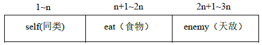
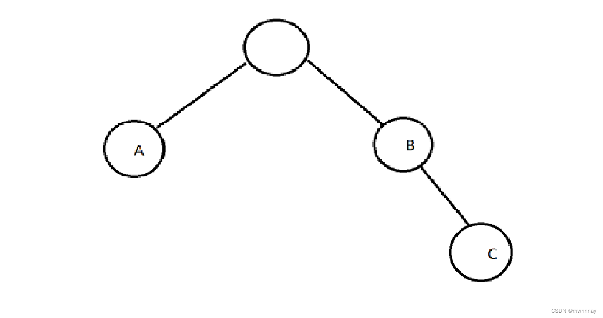
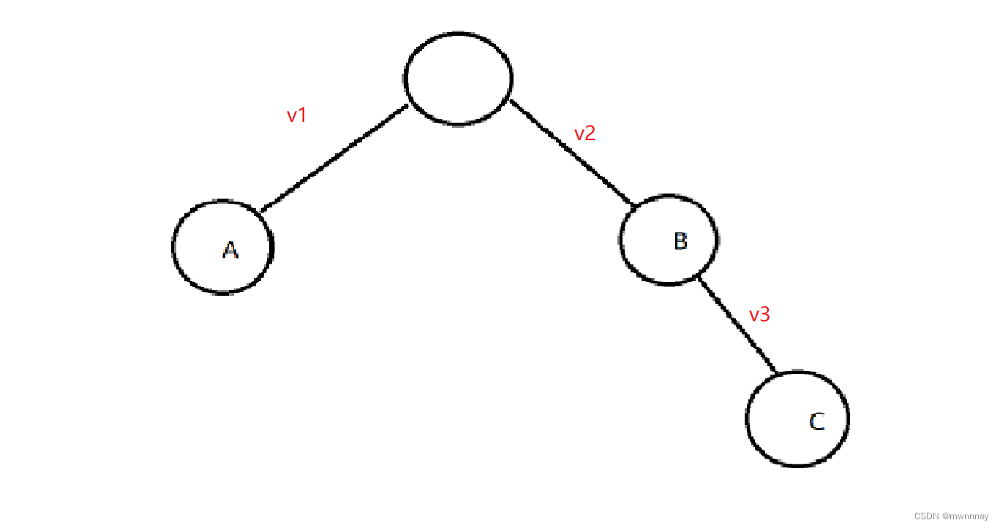
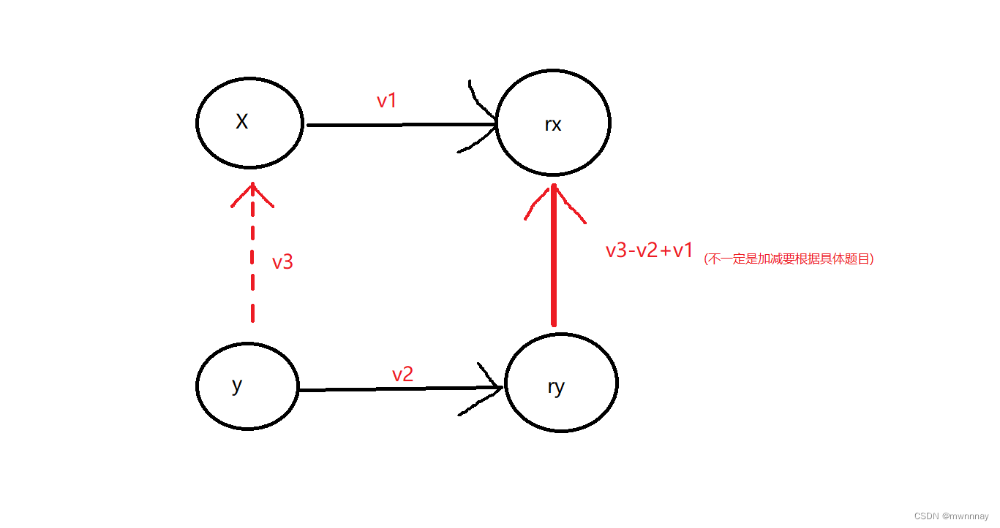

# 单链表

```c++
// head存储链表头，e[]存储节点的值，ne[]存储节点的next指针，idx表示当前用到了哪个节点
int head, e[N], ne[N], idx;

// 初始化
void init()
{
    head = -1;
    idx = 0;
}

// 在链表头插入一个数a
void insert(int a)
{
    e[idx] = a, ne[idx] = head, head = idx ++ ;
}

// 将头结点删除，需要保证头结点存在
void remove()
{
    head = ne[head];
}
```

## AcWing826.单链表

https://www.acwing.com/problem/content/828/

实现一个单链表，链表初始为空，支持三种操作：

1. 向链表头插入一个数；
2. 删除第 k 个插入的数后面的数；
3. 在第 k 个插入的数后插入一个数。

现在要对该链表进行 M 次操作，进行完所有操作后，从头到尾输出整个链表。

**注意**:题目中第 k 个插入的数并不是指当前链表的第 k 个数。例如操作过程中一共插入了 n 个数，则按照插入的时间顺序，这 n 个数依次为：第 1 个插入的数，第 2 个插入的数，…第 n 个插入的数。

#### 输入格式

第一行包含整数 M，表示操作次数。

接下来 M 行，每行包含一个操作命令，操作命令可能为以下几种：

1. `H x`，表示向链表头插入一个数 x。
2. `D k`，表示删除第 kk 个插入的数后面的数（当 k 为 0 时，表示删除头结点）。
3. `I k x`，表示在第 kk 个插入的数后面插入一个数 x（此操作中 k 均大于 0）。

#### 输出格式

共一行，将整个链表从头到尾输出。

#### 数据范围

1≤M≤100000
所有操作保证合法。

#### 输入样例：

```
10
H 9
I 1 1
D 1
D 0
H 6
I 3 6
I 4 5
I 4 5
I 3 4
D 6
```

#### 输出样例：

```
6 4 6 5
```

```c++
//用new或者malloc多半会超时
//所以算法竞赛用数组（静态链表）模拟链表 
#include<bits/stdc++.h>
using namespace std;
const int N = 1e5+10;
int head, e[N], ne[N], idx;
// head 表示头结点的下标
// e[i] 表示节点i的值
// ne[i] 表示节点i的next指针是多少
// index 存储当前已经用到了哪个点

// 初始化
void init()
{
    head = -1;
    idx = 0;
}

// 将x插到头结点
void add_to_head(int x)
{
    e[idx] = x, ne[idx] = head, head = idx ++ ;
}

// 将x插到下标是k的点后面
void add(int k, int x)
{
    e[idx] = x, ne[idx] = ne[k], ne[k] = idx ++ ;
}

// 将下标是k的点后面的点删掉
void remove(int k)
{
    ne[k] = ne[ne[k]];
}

int main()
{
    int m;
    cin >> m;

    init();

    while (m -- )
    {
        int k, x;
        char op;

        cin >> op;
        if (op == 'H')
        {
            cin >> x;
            add_to_head(x);
        }
        else if (op == 'D')
        {
            cin >> k;
            if (!k) head = ne[head];//head结点特判
            //第k个插入的结点下标是k-1
            else remove(k - 1);
        }
        else
        {
            cin >> k >> x;
            //第k个插入的结点下标是k-1
            add(k - 1, x);
        }
    }

    for (int i = head; i != -1; i = ne[i]) cout << e[i] << ' ';
    cout << endl;

    return 0;
}
```

# 双链表

```c++
// e[]表示节点的值，l[]表示节点的左指针，r[]表示节点的右指针，idx表示当前用到了哪个节点
int e[N], l[N], r[N], idx;

// 初始化
void init()
{
    //0是左端点，1是右端点
    r[0] = 1, l[1] = 0;
    idx = 2;
}

// 在节点a的右边插入一个数x
void insert(int a, int x)
{
    e[idx] = x;
    l[idx] = a, r[idx] = r[a];
    l[r[a]] = idx, r[a] = idx ++ ;
}

// 删除节点a
void remove(int a)
{
    l[r[a]] = l[a];
    r[l[a]] = r[a];
}
```

## AcWing827.双链表

https://www.acwing.com/problem/content/829/

实现一个双链表，双链表初始为空，支持 55 种操作：

1. 在最左侧插入一个数；
2. 在最右侧插入一个数；
3. 将第 k 个插入的数删除；
4. 在第 k 个插入的数左侧插入一个数；
5. 在第 k 个插入的数右侧插入一个数

现在要对该链表进行 M 次操作，进行完所有操作后，从左到右输出整个链表。

**注意**:题目中第 k 个插入的数并不是指当前链表的第 k 个数。例如操作过程中一共插入了 n 个数，则按照插入的时间顺序，这 n 个数依次为：第 1 个插入的数，第 2 个插入的数，…第 n 个插入的数。

#### 输入格式

第一行包含整数 M，表示操作次数。

接下来 M 行，每行包含一个操作命令，操作命令可能为以下几种：

1. `L x`，表示在链表的最左端插入数 x。
2. `R x`，表示在链表的最右端插入数 x。
3. `D k`，表示将第 k 个插入的数删除。
4. `IL k x`，表示在第 k 个插入的数左侧插入一个数。
5. `IR k x`，表示在第 k 个插入的数右侧插入一个数。

#### 输出格式

共一行，将整个链表从左到右输出。

#### 数据范围

1≤M≤100000
所有操作保证合法。

#### 输入样例：

```
10
R 7
D 1
L 3
IL 2 10
D 3
IL 2 7
L 8
R 9
IL 4 7
IR 2 2
```

#### 输出样例：

```
8 7 7 3 2 9
```

```c++
#include <iostream>

using namespace std;

const int N = 100010;

int m;
int e[N], l[N], r[N], idx;

// 在节点a的右边插入一个数x
void insert(int a, int x)
{
    e[idx] = x;
    l[idx] = a, r[idx] = r[a];
    l[r[a]] = idx, r[a] = idx ++ ;
}

// 删除节点a
void remove(int a)
{
    l[r[a]] = l[a];
    r[l[a]] = r[a];
}

int main()
{
    cin >> m;

    // 0是左端点，1是右端点
    r[0] = 1, l[1] = 0;
    idx = 2;

    while (m -- )
    {
        string op;
        cin >> op;
        int k, x;
        if (op == "L")
        {
            cin >> x;
            insert(0, x);
        }
        else if (op == "R")
        {
            cin >> x;
            insert(l[1], x);
        }
        else if (op == "D")
        {
            cin >> k;
            remove(k + 1);
        }
        else if (op == "IL")
        {
            cin >> k >> x;
            insert(l[k + 1], x);
        }
        else
        {
            cin >> k >> x;
            insert(k + 1, x);
        }
    }

    for (int i = r[0]; i != 1; i = r[i]) cout << e[i] << ' ';
    cout << endl;

    return 0;
}
```

# 栈

```c++
// tt表示栈顶
int stk[N], tt = 0;

// 向栈顶插入一个数
stk[ ++ tt] = x;

// 从栈顶弹出一个数
tt -- ;

// 栈顶的值
stk[tt];

// 判断栈是否为空
if (tt > 0)
{

}
```

## AcWing828.模拟栈

https://www.acwing.com/problem/content/830/

实现一个栈，栈初始为空，支持四种操作：

1. `push x` – 向栈顶插入一个数 xx；
2. `pop` – 从栈顶弹出一个数；
3. `empty` – 判断栈是否为空；
4. `query` – 查询栈顶元素。

现在要对栈进行 MM 个操作，其中的每个操作 33 和操作 44 都要输出相应的结果。

#### 输入格式

第一行包含整数 M，表示操作次数。

接下来 M 行，每行包含一个操作命令，操作命令为 `push x`，`pop`，`empty`，`query` 中的一种。

#### 输出格式

对于每个 `empty` 和 `query` 操作都要输出一个查询结果，每个结果占一行。

其中，`empty` 操作的查询结果为 `YES` 或 `NO`，`query` 操作的查询结果为一个整数，表示栈顶元素的值。

#### 数据范围

1≤M≤100000
1≤x≤109
所有操作保证合法。

#### 输入样例：

```
10
push 5
query
push 6
pop
query
pop
empty
push 4
query
empty
```

#### 输出样例：

```
5
5
YES
4
NO
```

```c++
#include<bits/stdc++.h>
using namespace std;
const int N = 1e5 + 10;
int a[N],i;
int main(){
	int m;
	cin>>m;
	string option;
	while(m--){
		cin>>option;
		if(option=="push"){
			++i;
			int num;
			cin>>num;
			a[i]=num;
		}else if(option=="pop"){
			i--;
		}else if(option=="empty"){
			if(i==0)cout<<"YES"<<endl;
			else cout<<"NO"<<endl;
		}else{
			cout<<a[i]<<endl;
		}
	}
	return 0;
}
```

# 队列

普通队列：

```c++
// hh 表示队头，tt表示队尾
int q[N], hh = 0, tt = -1;

// 向队尾插入一个数
q[ ++ tt] = x;

// 从队头弹出一个数
hh ++ ;

// 队头的值
q[hh];

// 判断队列是否为空
if (hh <= tt)
{

}
```

循环队列：

```c++
// hh 表示队头，tt表示队尾的后一个位置
int q[N], hh = 0, tt = 0;

// 向队尾插入一个数
q[tt ++ ] = x;
if (tt == N) tt = 0;

// 从队头弹出一个数
hh ++ ;
if (hh == N) hh = 0;

// 队头的值
q[hh];

// 判断队列是否为空
if (hh != tt)
{

}
```

## AcWing829.模拟队列

https://www.acwing.com/problem/content/831/

实现一个队列，队列初始为空，支持四种操作：

1. `push x` – 向队尾插入一个数 xx；
2. `pop` – 从队头弹出一个数；
3. `empty` – 判断队列是否为空；
4. `query` – 查询队头元素。

现在要对队列进行 M 个操作，其中的每个操作 3 和操作 4 都要输出相应的结果。

#### 输入格式

第一行包含整数 M，表示操作次数。

接下来 M 行，每行包含一个操作命令，操作命令为 `push x`，`pop`，`empty`，`query` 中的一种。

#### 输出格式

对于每个 `empty` 和 `query` 操作都要输出一个查询结果，每个结果占一行。

其中，`empty` 操作的查询结果为 `YES` 或 `NO`，`query` 操作的查询结果为一个整数，表示队头元素的值。

#### 数据范围

1≤M≤100000
1≤x≤109
所有操作保证合法。

#### 输入样例：

```
10
push 6
empty
query
pop
empty
push 3
push 4
pop
query
push 6
```

#### 输出样例：

```
NO
6
YES
4
```

```c++
#include<bits/stdc++.h>
using namespace std;
const int N = 1e5 + 10;
int a[N],h,i;
int main(){
	int m;
	cin>>m;
	string option;
	while(m--){
		cin>>option;
		if(option=="push"){
			i++;
			int num;
			cin>>num;
			a[i]=num;
		}else if(option=="pop"){
			h++;
		}else if(option=="empty"){
			if(h==i)cout<<"YES"<<endl;
			else cout<<"NO"<<endl;
		}else{
			cout<<a[h+1]<<endl; 
		}
	}
	return 0;
}
```

# 单调栈

```c++
//常见模型：找出每个数左边离它最近的比它大/小的数
int tt = 0;
for (int i = 1; i <= n; i ++ )
{
    while (tt && check(stk[tt], i)) tt -- ;
    stk[ ++ tt] = i;
}
```

## AcWing830.单调栈

https://www.acwing.com/problem/content/832/

给定一个长度为 N 的整数数列，输出每个数左边第一个比它小的数，如果不存在则输出 −1。

#### 输入格式

第一行包含整数 N，表示数列长度。

第二行包含 N 个整数，表示整数数列。

#### 输出格式

共一行，包含 N 个整数，其中第 i 个数表示第 i 个数的左边第一个比它小的数，如果不存在则输出 −1。

#### 数据范围

1≤N≤105
1≤数列中元素≤109

#### 输入样例：

```
5
3 4 2 7 5
```

#### 输出样例：

```
-1 3 -1 2 2
```

```c++
#include<bits/stdc++.h>
using namespace std;
const int N = 1e5 + 10;
int n;
int a[N],tt;
int main(){
	cin>>n;
	for(int i=0;i<n;++i){
		int x;
		cin>>x;
		while(tt&&a[tt]>=x)tt--;
		if(tt)cout<<a[tt]<<" ";
		else cout<<-1<<" ";
		a[++tt]=x;
	}
	return 0;
}
```

# 单调队列

```c++
//常见模型：找出滑动窗口中的最大值/最小值
int hh = 0, tt = -1;
for (int i = 0; i < n; i ++ )
{
    while (hh <= tt && check_out(q[hh])) hh ++ ;  // 判断队头是否滑出窗口
    while (hh <= tt && check(q[tt], i)) tt -- ;
    q[ ++ tt] = i;
}
```

## AcWing154.滑动窗口

https://www.acwing.com/problem/content/156/

给定一个大小为 n≤106 的数组。

有一个大小为 k 的滑动窗口，它从数组的最左边移动到最右边。

你只能在窗口中看到 k 个数字。

每次滑动窗口向右移动一个位置。

以下是一个例子：

该数组为 `[1 3 -1 -3 5 3 6 7]`，k 为 3。

| 窗口位置            | 最小值 | 最大值 |
| :------------------ | :----- | :----- |
| [1 3 -1] -3 5 3 6 7 | -1     | 3      |
| 1 [3 -1 -3] 5 3 6 7 | -3     | 3      |
| 1 3 [-1 -3 5] 3 6 7 | -3     | 5      |
| 1 3 -1 [-3 5 3] 6 7 | -3     | 5      |
| 1 3 -1 -3 [5 3 6] 7 | 3      | 6      |
| 1 3 -1 -3 5 [3 6 7] | 3      | 7      |

你的任务是确定滑动窗口位于每个位置时，窗口中的最大值和最小值。

#### 输入格式

输入包含两行。

第一行包含两个整数 n 和 k，分别代表数组长度和滑动窗口的长度。

第二行有 n 个整数，代表数组的具体数值。

同行数据之间用空格隔开。

#### 输出格式

输出包含两个。

第一行输出，从左至右，每个位置滑动窗口中的最小值。

第二行输出，从左至右，每个位置滑动窗口中的最大值。

#### 输入样例：

```
8 3
1 3 -1 -3 5 3 6 7
```

#### 输出样例：

```
-1 -3 -3 -3 3 3
3 3 5 5 6 7
```

```c++
#include<bits/stdc++.h>
using namespace std;
const int N = 1e6 + 10;
int n,k;
int a[N],q[N];//q存储的是下标 数组q的长度也需要预设为N 
int main(){
	int n, k;
    scanf("%d%d", &n, &k);
    for (int i = 0; i < n; i ++ ) scanf("%d", &a[i]);

    int hh = 0, tt = -1;
    for (int i = 0; i < n; i ++ )
    {
    	//判断队头是否已经滑出窗口
        if ( i - k + 1 > q[hh]) hh ++ ;

        while (hh <= tt && a[q[tt]] >= a[i]) tt -- ;
        q[ ++ tt] = i;

        if (i >= k - 1) printf("%d ", a[q[hh]]);
    }

    puts("");

    hh = 0, tt = -1;
    for (int i = 0; i < n; i ++ )
    {
        if ( i - k + 1 > q[hh]) hh ++ ;

        while (hh <= tt && a[q[tt]] <= a[i]) tt -- ;
        q[ ++ tt] = i;

        if (i >= k - 1) printf("%d ", a[q[hh]]);
    }

    puts("");
	return 0; 
}
```

# KMP

```c++
// s[]是长文本，p[]是模式串，n是s的长度，m是p的长度
求模式串的Next数组：
for (int i = 2, j = 0; i <= m; i ++ )
{
    while (j && p[i] != p[j + 1]) j = ne[j];
    if (p[i] == p[j + 1]) j ++ ;
    ne[i] = j;
}

// 匹配
for (int i = 1, j = 0; i <= n; i ++ )
{
    while (j && s[i] != p[j + 1]) j = ne[j];
    if (s[i] == p[j + 1]) j ++ ;
    if (j == m)
    {
        j = ne[j];
        // 匹配成功后的逻辑
    }
}
```


手算模拟的方法以及 next 数组进一步优化成 nextval 数组的方法：

王道考研KMP算法上：

https://www.bilibili.com/video/BV1b7411N798?p=35&vd_source=11579445a367b6624c1d123aa6f75a37

王道考研KMP算法下：

https://www.bilibili.com/video/BV1b7411N798?p=36&vd_source=11579445a367b6624c1d123aa6f75a37


> AcWing 831. KMP字符串 —— 深入浅出 next 数组
>
> https://www.acwing.com/solution/content/129372/
>
> 目录（分析部分）
> 1. 前置知识（文本串、模式串概念，暴力思想）
> 2. 偶遇 next（直观理解，推荐一起画一下图）
> 3. 与 next 一决胜负（详解 next 数组，注意是单个字符串的 next 数组）
> 4. hello, kmp!（kmp 算法思想的核心，请在确保在掌握 next 的前提下进入这部分，否则先学习上一部分，直至完全掌握）
> 5. Why O(n+m)?（时间复杂度分析）
> 代码（详细注释）


**暴力匹配：**

BF算法，即暴力(Brute Force)算法，是普通的模式匹配算法，BF算法的思想就是将目标串S的第一个字符与模式串T的第一个字符进行匹配，若相等，则继续比较S的第二个字符和 T的第二个字符；若不相等，则比较S的第二个字符和T的第一个字符，依次比较下去，直到得出最后的匹配结果。BF算法是一种蛮力算法。

```c++
for (int i = 1; i <= n; i ++ )
{
    bool flag = true;
    for (int j = 1; j <= m; j ++ )
    {
        if (s[i + j - 1] != p[j])
        {
            flag=false;
            break;
        }
    }
}
```


## AcWing831.KMP字符串

https://www.acwing.com/problem/content/833/

给定一个字符串 S，以及一个模式串 P，所有字符串中只包含大小写英文字母以及阿拉伯数字。

模式串 P 在字符串 S 中多次作为子串出现。

求出模式串 P 在字符串 S 中所有出现的位置的起始下标。

#### 输入格式

第一行输入整数 N，表示字符串 P 的长度。

第二行输入字符串 P。

第三行输入整数 M，表示字符串 S 的长度。

第四行输入字符串 S。

#### 输出格式

共一行，输出所有出现位置的起始下标（下标从 00 开始计数），整数之间用空格隔开。

#### 数据范围

1≤N≤105
1≤M≤106

#### 输入样例：

```
3
aba
5
ababa
```

#### 输出样例：

```
0 2
```

### KMP算法

也就是按照模板题的做法写

```c++
#include <iostream>

using namespace std;

const int N = 100010, M = 1000010;

int n, m;
int ne[N];
char s[M], p[N];

int main()
{
    cin >> n >> p + 1 >> m >> s + 1;

    for (int i = 2, j = 0; i <= n; i ++ )
    {
        while (j && p[i] != p[j + 1]) j = ne[j];
        if (p[i] == p[j + 1]) j ++ ;
        ne[i] = j;
    }

    for (int i = 1, j = 0; i <= m; i ++ )
    {
        while (j && s[i] != p[j + 1]) j = ne[j];
        if (s[i] == p[j + 1]) j ++ ;
        if (j == n)
        {
            printf("%d ", i - n);
            j = ne[j];
        }
    }

    return 0;
}
```

### 字符串哈希算法

有点类似于暴力比较，相较于KMP更快

但是KMP可以查找字符串中的循环节，字符串哈希做不到

除此之外，字符串哈希几乎秒杀KMP

```c++
#include<bits/stdc++.h>
using namespace std;
const int N = 1000010, P = 131;
unsigned long long hp[N],hs[N],p[N];
char strp[N],strs[N];
int n,m;

unsigned long long get(int l,int r){
    return hs[r]-hs[l-1]*p[r-l+1];
}
int main(){
    scanf("%d%s%d%s",&n,strp+1,&m,strs+1);
    
    //初始化 hp[] p[]
    p[0]=1;
    for(int i=1;i<=n;++i) hp[i]=hp[i-1]*P+strp[i];
    
    //初始化 hs[]
    for(int i=1;i<=m;++i){
        p[i]=p[i-1]*P;
        hs[i]=hs[i-1]*P+strs[i];
    } 
    
    for(int i=n;i<=m;++i) if(hp[n]==get(i-n+1,i)) printf("%d ",i-n);
    
    // 这里不写 printf("%d ",i-n+1); 的原因是题目中说下标从 0 开始
    // 如果下标从 1 开始的话就要写成 printf("%d ",i-n+1);
    
    return 0;
}
```


# Trie 树

```c++
int son[N][26], cnt[N], idx;
// 0号点既是根节点，又是空节点
// son[][]存储树中每个节点的子节点
// cnt[]存储以每个节点结尾的单词数量

// 插入一个字符串
void insert(char *str)
{
    int p = 0;
    for (int i = 0; str[i]; i ++ )
    {
        int u = str[i] - 'a';
        if (!son[p][u]) son[p][u] = ++ idx;
        p = son[p][u];
    }
    cnt[p] ++ ;
}

// 查询字符串出现的次数
int query(char *str)
{
    int p = 0;
    for (int i = 0; str[i]; i ++ )
    {
        int u = str[i] - 'a';
        if (!son[p][u]) return 0;
        p = son[p][u];
    }
    return cnt[p];
}
```


## AcWing835.Trie字符串统计

https://www.acwing.com/problem/content/837/

维护一个字符串集合，支持两种操作：

1. `I x` 向集合中插入一个字符串 x；
2. `Q x` 询问一个字符串在集合中出现了多少次。

共有 N 个操作，所有输入的字符串总长度不超过 105，字符串仅包含小写英文字母。

#### 输入格式

第一行包含整数 N，表示操作数。

接下来 N 行，每行包含一个操作指令，指令为 `I x` 或 `Q x` 中的一种。

#### 输出格式

对于每个询问指令 `Q x`，都要输出一个整数作为结果，表示 xx 在集合中出现的次数。

每个结果占一行。

#### 数据范围

1≤N≤2∗104

#### 输入样例：

```
5
I abc
Q abc
Q ab
I ab
Q ab
```

#### 输出样例：

```
1
0
1
```

```c++
#include<bits/stdc++.h>
using namespace std;
const int N = 100010;
char str[N];
int son[N][26],cnt[N],idx;

// cnt 数组表示以某个结点作为终止符的单词数量

void insert(char str[]){
	int p=0;
	for(int i=0;str[i];++i){
		int u = str[i]-'a';
		if(!son[p][u]) son[p][u]=++idx;
		p=son[p][u];
	}
	cnt[p]++;
}

int query(char str[]){
	int p=0;
	for(int i=0;str[i];++i){
		int u=str[i]-'a';
		if(!son[p][u]) return 0;
		p=son[p][u];
	}
	return cnt[p];
}

int main(){
	char op[2];
	int n;
	cin>>n;
	while(n--){
		scanf("%s%s",op,str);
		if(*op=='I') insert(str);
		else printf("%d\n", query(str));
	}
	return 0;
}

/*

测试数据：

5
I abc
Q abc
Q ab
I ab
Q ab

在平台上可以过，在控制台输出有问题
暂不清楚原因
 
*/
```


**注意：**

```c++
void insert(char str[]){
	int p=0;
	for(int i=0;str[i];++i){
		int u = str[i]-'a';
		if(!son[p][u]) son[p][u]=++idx;
		p=son[p][u];
	}
	cnt[p]++;
}

int query(char str[]){
	int p=0;
	for(int i=0;str[i];++i){
		int u=str[i]-'a';
		if(!son[p][u]) return 0;
		p=son[p][u];
	}
	return cnt[p];
}
```

这段代码中，在 insert 函数中，有语句：

```c++
if(!son[p][u]) son[p][u]=++idx;
```

这句代码不可以写成：

```c++
if(!son[p][u]) son[p][u]=idx++;
```

这样将会导致第一个结点指向 0 。

而所有指向零的结点默认都是没有子节点的，这也是查询操作判断是否有子树的依据。

```c++
if(!son[p][u]) return 0;
```


## AcWing143.最大异或对

https://www.acwing.com/problem/content/145/

在给定的 N 个整数 A1，A2……AN 中选出两个进行 xor（异或）运算，得到的结果最大是多少？

#### 输入格式

第一行输入一个整数 N。

第二行输入 N 个整数 A1～AN。

#### 输出格式

输出一个整数表示答案。

#### 数据范围

1≤N≤105
0≤Ai<231

#### 输入样例：

```
3
1 2 3
```

#### 输出样例：

```
3
```

```c++
#include <iostream>
#include <algorithm>

using namespace std;

const int N = 100010, M = 3100010;

int n;
int a[N], son[M][2], idx;

void insert(int x)
{
    int p = 0;
    for (int i = 30; i >= 0; i -- )
    {
        int &s = son[p][x >> i & 1];
        if (!s) s = ++ idx;
        p = s;
    }
}

int search(int x)
{
    int p = 0, res = 0;
    for (int i = 30; i >= 0; i -- )
    {
        int s = x >> i & 1;
        if (son[p][!s])
        {
            res += 1 << i;
            p = son[p][!s];
        }
        else p = son[p][s];
    }
    return res;
}

int main()
{
    scanf("%d", &n);
    for (int i = 0; i < n; i ++ )
    {
        scanf("%d", &a[i]);
        insert(a[i]);
    }

    int res = 0;
    for (int i = 0; i < n; i ++ ) res = max(res, search(a[i]));

    printf("%d\n", res);

    return 0;
}
```


**小于 2^n 的数可以用 n 位二进制数表示**


这道题的启示是：字典树不单单可以高效存储和查找字符串集合，还可以存储二进制数字

# 并查集

并查集：

1. 将两个集合合并
2. 询问两个元素是否在一个集合当中

以上操作在近乎 O(1) 的时间内完成


并查集基本原理：每个集合用一棵树表示；树根的编号就是整个集合的编号；每个节点存储它的父节点，p[x] 表示 x 父节点


问题：

1. 如何判断树根

    ```c++
    if(p[x]==x)
    ```

2. 如何求 x 的集合编号

    ```c++
    while(p[x]!=x) x=p[x]
    ```

3. 如何合并两个集合：将一棵树合并到另外一颗树的树根上


优化：

- 路径压缩
- 按秩合并（基本不用）


## 朴素并查集：

```c++
int p[N]; //存储每个点的祖宗节点

// 返回x的祖宗节点
int find(int x)
{
	if (p[x] != x) p[x] = find(p[x]);
	return p[x];
}

// 初始化，假定节点编号是1~n
for (int i = 1; i <= n; i ++ ) p[i] = i;

// 合并a和b所在的两个集合：
p[find(a)] = find(b);
```

## 维护集合中元素数量的并查集：

```c++
int p[N], size[N];
//p[]存储每个点的祖宗节点, size[]只有祖宗节点的有意义，表示祖宗节点所在集合中的点的数量

// 返回x的祖宗节点
int find(int x)
{
	if (p[x] != x) p[x] = find(p[x]);
	return p[x];
}

// 初始化，假定节点编号是1~n
for (int i = 1; i <= n; i ++ )
{
	p[i] = i;
	size[i] = 1;
}

// 合并a和b所在的两个集合：
size[find(b)] += size[find(a)];
p[find(a)] = find(b);
```

## 维护到祖宗节点距离的并查集：

```c++
int p[N], d[N];
//p[]存储每个点的祖宗节点, d[x]存储x到p[x]的距离

// 返回x的祖宗节点
int find(int x)
{
	if (p[x] != x)
	{
		int u = find(p[x]);
		d[x] += d[p[x]];
		p[x] = u;
	}
	return p[x];
}

// 初始化，假定节点编号是1~n
for (int i = 1; i <= n; i ++ )
{
	p[i] = i;
	d[i] = 0;
}

// 合并a和b所在的两个集合：
p[find(a)] = find(b);
d[find(a)] = distance; // 根据具体问题，初始化find(a)的偏移量
```

## AcWing836.合并集合

https://www.acwing.com/activity/content/problem/content/885/

一共有 n 个数，编号是 1∼n，最开始每个数各自在一个集合中。

现在要进行 m 个操作，操作共有两种：

1. `M a b`，将编号为 a 和 b 的两个数所在的集合合并，如果两个数已经在同一个集合中，则忽略这个操作；
2. `Q a b`，询问编号为 a 和 b 的两个数是否在同一个集合中；

#### 输入格式

第一行输入整数 n 和 m。

接下来 m 行，每行包含一个操作指令，指令为 `M a b` 或 `Q a b` 中的一种。

#### 输出格式

对于每个询问指令 `Q a b`，都要输出一个结果，如果 a 和 b 在同一集合内，则输出 `Yes`，否则输出 `No`。

每个结果占一行。

#### 数据范围

1≤n,m≤105

#### 输入样例：

```
4 5
M 1 2
M 3 4
Q 1 2
Q 1 3
Q 3 4
```

#### 输出样例：

```
Yes
No
Yes
```

```c++
#include<bits/stdc++.h>
using namespace std;
const int N = 100010;
int n,m;
int p[N];

int find(int x){// find 函数返回 int x 的祖宗结点 
	if(p[x]!=x) p[x]=find(p[x]);
	return p[x];
} 

int main(){
	scanf("%d%d",&n,&m);
	
	for(int i=0;i<n;++i) p[i]=i; //初始化所有为根结点
	
	while(m--){
		char op[2];
		int a,b;
		scanf("%s%d%d",op,&a,&b);
		if(op[0]=='M') p[find(a)]=find(b);
		else{
			if(find(a)==find(b)) printf("Yes\n");
			else printf("No\n");
		}
	} 
	return 0;
}
```

## AcWing837.连通块中点的数量

https://www.acwing.com/problem/content/839/

给定一个包含 n 个点（编号为 1∼n）的无向图，初始时图中没有边。

现在要进行 m 个操作，操作共有三种：

1. `C a b`，在点 a 和点 b 之间连一条边，a 和 b 可能相等；
2. `Q1 a b`，询问点 a 和点 b 是否在同一个连通块中，a 和 b 可能相等；
3. `Q2 a`，询问点 a 所在连通块中点的数量；

#### 输入格式

第一行输入整数 n 和 m。

接下来 m 行，每行包含一个操作指令，指令为 `C a b`，`Q1 a b` 或 `Q2 a` 中的一种。

#### 输出格式

对于每个询问指令 `Q1 a b`，如果 a 和 b 在同一个连通块中，则输出 `Yes`，否则输出 `No`。

对于每个询问指令 `Q2 a`，输出一个整数表示点 a 所在连通块中点的数量

每个结果占一行。

#### 数据范围

1≤n,m≤105

#### 输入样例：

```
5 5
C 1 2
Q1 1 2
Q2 1
C 2 5
Q2 5
```

#### 输出样例：

```
Yes
2
3
```

### 手敲

```c++
#include<bits/stdc++.h>
using namespace std;
const int N = 100010;
int p[N],cnt[N];
int n,m;
char op[5];

int find(int x){
    if(p[x]!=x) p[x]=find(p[x]);
    return p[x];
}

int main(){
    scanf("%d%d",&n,&m);
    
    //初始化
    for(int i=1;i<=n;++i){
        p[i]=i;
        cnt[i]=1;
    }
    
    int a,b;
    while(m--){
        scanf("%s",op);
        
        if(op[1]=='1'){
            scanf("%d%d",&a,&b);
            if(find(a)==find(b)) puts("Yes");
            else puts("No");
        }else if(op[1]=='2'){
            scanf("%d",&a);
            printf("%d\n",cnt[find(a)]);
        }else{
            scanf("%d%d",&a,&b);
            if(find(a)==find(b)) continue; 
            cnt[find(b)]+=cnt[find(a)];
            p[find(a)]=find(b);
            /*
            这里
            
            cnt[find(b)]+=cnt[find(a)];
            p[find(a)]=find(b);
            
            两个语句的顺序不能更改
            因为一旦将一个树的树根指向另外一个树的树根
            那么 cnt[find(b)]+=cnt[find(a)]; 语句中的 find(b)==find(a)
            并不是将两个数中结点数量相加
           	导致错误
           	
            */
        }
    }
    
    return 0;
}
```

### y总代码

```c++
#include <iostream>

using namespace std;

const int N = 100010;

int n, m;
int p[N], cnt[N];

int find(int x)
{
    if (p[x] != x) p[x] = find(p[x]);
    return p[x];
}

int main()
{
    cin >> n >> m;

    for (int i = 1; i <= n; i ++ )
    {
        p[i] = i;
        cnt[i] = 1;
    }

    while (m -- )
    {
        //注意这里使用string类，要比使用数组更好，同样也可以跳过空格和回车
        string op;
        int a, b;
        cin >> op;

        if (op == "C")
        {
            cin >> a >> b;
            a = find(a), b = find(b);
            if (a != b)
            {
                p[a] = b;
                cnt[b] += cnt[a];
            }
        }
        else if (op == "Q1")
        {
            cin >> a >> b;
            if (find(a) == find(b)) puts("Yes");
            else puts("No");
        }
        else
        {
            cin >> a;
            cout << cnt[find(a)] << endl;
        }
    }

    return 0;
}
```


## AcWing 240. 食物链

https://www.acwing.com/problem/content/242/

动物王国中有三类动物 A,B,C，这三类动物的食物链构成了有趣的环形。

A 吃 B，B 吃 C，C 吃 A。

现有 N 个动物，以 1∼N 编号。

每个动物都是 A,B,C 中的一种，但是我们并不知道它到底是哪一种。

有人用两种说法对这 N 个动物所构成的食物链关系进行描述：

第一种说法是 `1 X Y`，表示 X 和 Y 是同类。

第二种说法是 `2 X Y`，表示 X 吃 Y。

此人对 N 个动物，用上述两种说法，一句接一句地说出 K 句话，这 K 句话有的是真的，有的是假的。

当一句话满足下列三条之一时，这句话就是假话，否则就是真话。

1. 当前的话与前面的某些真的话冲突，就是假话；
2. 当前的话中 X 或 Y 比 N 大，就是假话；
3. 当前的话表示 X 吃 X，就是假话。

你的任务是根据给定的 N 和 K 句话，输出假话的总数。

#### 输入格式

第一行是两个整数 N 和 K，以一个空格分隔。

以下 K 行每行是三个正整数 D，X，Y，两数之间用一个空格隔开，其中 D 表示说法的种类。

若 D=1，则表示 X 和 Y 是同类。

若 D=2，则表示 X 吃 Y。

#### 输出格式

只有一个整数，表示假话的数目。

#### 数据范围

1≤N≤50000
0≤K≤100000

#### 输入样例：

```
100 7
1 101 1 
2 1 2
2 2 3 
2 3 3 
1 1 3 
2 3 1 
1 5 5
```

#### 输出样例：

```
3
```

**y总代码**

在路径压缩的同时，维护一个`d`数组存储额外的信息

其实不是很懂这种做法......

```c++
#include <iostream>

using namespace std;

const int N = 50010;

int n, m;
int p[N], d[N];

int find(int x)
{
    if (p[x] != x){
        int t = find(p[x]);
        d[x] += d[p[x]];
        p[x] = t;
    }
    return p[x];
}

int main()
{
    scanf("%d%d", &n, &m);
    for (int i = 1; i <= n; i ++ ) p[i] = i;
    int res = 0;
    while (m -- )
    {
        int t, x, y;
        scanf("%d%d%d", &t, &x, &y);
        if (x > n || y > n) res ++ ;
        else
        {
            int px = find(x), py = find(y);
            if (t == 1){
                if (px == py && (d[x] - d[y]) % 3) res ++ ;
                else if (px != py)
                {
                    p[px] = py;
                    d[px] = d[y] - d[x];
                }
            }
            else{
                if (px == py && (d[x] - d[y] - 1) % 3) res ++ ;
                else if (px != py)
                {
                    p[px] = py;
                    d[px] = d[y] + 1 - d[x];
                }
            }
        }
    }
    printf("%d\n", res);
    return 0;
}
```

**自己写得**

```c++
#include <bits/stdc++.h>

using namespace std;
const int N = 5e4 + 10;
int n, k, p[N * 3];

int find(int x) {
    if (p[x] != x) p[x] = find(p[x]);
    return p[x];
}

bool same(int x, int y) {
    return find(x) == find(y);
}

void uni(int x, int y) {
    int xx = find(x);
    int yy = find(y);
    if (xx != yy) p[xx] = yy;
}

int main() {
    cin >> n >> k;
    for (int i = 1; i <= n * 3; ++i) p[i] = i;
    int cnt = 0;
    while (k--) {
        int d, x, y;
        scanf("%d%d%d", &d, &x, &y);
        if (x > n || y > n) {
            cnt++;
            continue;
        }
        if (d == 1) {
            if (same(x, y + n) || same(x, y + 2 * n)) {
                cnt++;
                continue;
            }
            uni(x, y);
            uni(x + n, y + n);
            uni(x + 2 * n, y + 2 * n);
        } else {
            if (x == y) {
                cnt++;
                continue;
            }
            if (same(x, y) || same(x, y + n)) {
                cnt++;
                continue;
            }
            uni(x, y + 2 * n);
            uni(x + n, y);
            uni(x + 2 * n, y + n);
        }
    }
    cout << cnt;
    return 0;
}
```

这是从网上看别人的题解写得，算法名称**扩展域并查集**

> https://blog.csdn.net/qq_51776588/article/details/117732078

一般的并查集只能查找出各元素之间是否存在某一种相同的联系，如：a和b是亲戚关系，b和c是亲戚关系，这时就可以查找出a和c也存在亲戚关系。但如果存在多种相对的联系时一般的并查集就不行了，这时就需要对并查集进行拓展。即根据**相对关系的数量**把并查集的元素分出**多份**。

如：`1~n`各元素中，存在`相同`和`相对`的关系，那么就把各元素都分成`x`和`x+n`两部分，分别表示为`与x相同的部分及`和`与x相对的部分`，**当x和y相同时，则把x和y相连接，把x+n和y+n相连接**(x和y相同也代表x相对的和y相对的是相同的)，**当x和y相对时，则把x和y+n相连接，把x+n和y相连接**(即x和y相对的是相同的，x相对的和y是相同的)。


此题存在三种关系：A吃B，B吃C，C吃A
 那么我们就需要三个并查集，也就是原数组扩展3倍。

并将不同的区域赋予`同类`、`食物`、`天敌`三种实际意义。



总共三种动物，某动物要么是自己的同类，要么是自己的食物，否则就是自己的天敌。

- X和Y是同类:
  （x,y自身属于同一集合，x和y的食物属于同一集合，x和y的天敌自然也属于同一集合）
  Union(X~self~，Y~self~), Union(X~eat~，Y~eat~), Union(X~enemy~，Y~enemy~)
  —>Union(X，Y),Union(X+n，Y+n),Union(X+2n，Y+2n);
- X吃Y（反之同理）
  代入实例：A吃B，则A的食物是B，B的天敌是A，A的天敌（此题中即为C）是B的食物。
  也就是说：A的食物和B属于同一集合，B的天敌和A属于同一集合，A的天敌和B的食物属于同一集合。
  Union(X~eat~,Y~self~)，Union(X~self~,Y~enemy~)， Union(X~enemy~,Y~eat~)
  —>Union(X+n，Y),Union(X，Y+2n),Union(X+2n，Y+n);

上面两种关系的表示弄清楚了，真话与假话如何判定，也就一目了然啦。


> 另外一篇讲得很全的博客：
>
> 拓展域并查集和带权并查集
>
> https://blog.csdn.net/yu_annn/article/details/125805813


**带权并查集**

普通的并查集只能查找各元素之间是否存在联系，而不能获得两连接着的元素节点之间的具体信息。带权并查集，就是在并查集中各节点连接其父节点或根的边上加上权值。权值表示着的是连接着的两节点之间的相对关系。**据说带权并查集可以解决所有拓展域并查集问题，不知道是不是真的**。

一般并查集：

带权并查集：

既然带权并查集的边带了权值，那么在其两个集合合并和路径压缩时，其权值也应该更新。

路径压缩时，该节点的权值直接加上其父节点到它父节点的权值即可。

示意图：


代码实现：

```c++
int find(int x) {
    if (p[x] != x) {
        int root = find(p[x]);// 保存它父节点 
        d[x] += d[p[x]];// 当前节点的权值加上它父节点到根的权值
        p[x] = root;// 路径压缩
        // 注：上式不一定相加，根据相对关系的不同，可能是相加，也可能是取模，异或，同或运算 
    }
    return p[x];
}
```

合并时，一般的并查集只要将双方的根节点连在一起就行，但带权并查集因为带权，所以要更新被合并一方根的权值。

示意图：



这里有点不好理解，我的理解是，先把`y`的根节点`ry`连在`x`上，已知`y`到`x`的权值是`v3`，`y`到`ry`的权值是v2，那么`ry`到`x`的权值就是`v3-v2`，然后`x`到根节点`rx`的权值是`v1`，所以`ry`到`rx`的权值就是`v3-v2+v1`（当然不一定是加减，还有可能是异或，同或或者取模运算之类的）。

代码如下：

```c++
void add(int x, int y, int value) {
    int rx = Find(x), ry = Find(y);
    if (rx != ry) {
        rt[rx] = ry; //合并 
        v[rx] = value - v[x] + v[y]; //更新被合并一方根节点的权值。不一定是加减，这里只是举例。 
    }
}
```

> AcWing 238. 银河英雄传说
>
> https://www.acwing.com/problem/content/240/


# 堆

堆支持哪些操作：

1. 插入一个数
2. 求集合当中的最小值
3. 删除最小值
4. 删除任意一个元素
5. 修改任意一个元素


堆是一个完全二叉树

最小堆的实例代码：

```c++
#include <iostream>
#include <algorithm>
#include <string.h>

using namespace std;
const int N = 100010;
int h[N], ph[N], hp[N], cnt;

void heap_swap(int a, int b)
{
    swap(ph[hp[a]],ph[hp[b]]);
    swap(hp[a], hp[b]);
    swap(h[a], h[b]);
}

void down(int u)
{
    int t = u;
    if (u * 2 <= cnt && h[u * 2] < h[t]) t = u * 2;
    if (u * 2 + 1 <= cnt && h[u * 2 + 1] < h[t]) t = u * 2 + 1;
    if (u != t)
    {
        heap_swap(u, t);
        down(t);
    }
}

void up(int u)
{
    while (u / 2 && h[u] < h[u / 2])
    {
        heap_swap(u, u / 2);
        u >>= 1;
    }
}

int main()
{
    int n, m = 0;
    scanf("%d", &n);
    while (n -- )
    {
        char op[5];
        int k, x;
        scanf("%s", op);
        if (!strcmp(op, "I"))
        {
            scanf("%d", &x);
            cnt ++ ;
            m ++ ;
            ph[m] = cnt, hp[cnt] = m;
            h[cnt] = x;
            up(cnt);
        }
        else if (!strcmp(op, "PM")) printf("%d\n", h[1]);
        else if (!strcmp(op, "DM"))
        {
            heap_swap(1, cnt);
            cnt -- ;
            down(1);
        }
        else if (!strcmp(op, "D"))
        {
            scanf("%d", &k);
            k = ph[k];
            heap_swap(k, cnt);
            cnt -- ;
            up(k);
            down(k);
        }
        else
        {
            scanf("%d%d", &k, &x);
            k = ph[k];
            h[k] = x;
            up(k);
            down(k);
        }
    }

    return 0;
}
```

## AcWing838. 堆排序

https://www.acwing.com/problem/content/840/

输入一个长度为 n 的整数数列，从小到大输出前 m 小的数。

#### 输入格式

第一行包含整数 n 和 m。

第二行包含 n 个整数，表示整数数列。

#### 输出格式

共一行，包含 m 个整数，表示整数数列中前 m 小的数。

#### 数据范围

1≤m≤n≤105
1≤数列中元素≤109

#### 输入样例：

```
5 3
4 5 1 3 2
```

#### 输出样例：

```
1 2 3
```

```c++
#include <iostream>
#include <algorithm>

using namespace std;

const int N = 100010;

int n, m;
int h[N], cnt;

void down(int u)
{
    int t = u;//t表示三个中最小的那个元素的下标
    if (u * 2 <= cnt && h[u * 2] < h[t]) t = u * 2;
    if (u * 2 + 1 <= cnt && h[u * 2 + 1] < h[t]) t = u * 2 + 1;
    if (u != t)
    {
        swap(h[u], h[t]);
        down(t);
    }
}

int main()
{
    scanf("%d%d", &n, &m);
    for (int i = 1; i <= n; i ++ ) scanf("%d", &h[i]);
    cnt = n;

    for (int i = n / 2; i; i -- ) down(i);

    while (m -- )
    {
        printf("%d ", h[1]);
        h[1] = h[cnt -- ];
        down(1);
    }

    puts("");

    return 0;
}
```

# 哈希表

核心思想：将字符串看成P进制数，P的经验值是131或13331，取这两个值的冲突概率低
**小技巧：取模的数用2^64，这样直接用unsigned long long存储，溢出的结果就是取模的结果**

```c++
typedef unsigned long long ULL;
ULL h[N], p[N]; // h[k]存储字符串前k个字母的哈希值, p[k]存储 P^k mod 2^64

// 初始化
p[0] = 1;
for (int i = 1; i <= n; i ++ )
{
    h[i] = h[i - 1] * P + str[i];
    p[i] = p[i - 1] * P;
}

// 重点 ！！！！！！
// 计算子串 str[l ~ r] 的哈希值
ULL get(int l, int r)
{
    return h[r] - h[l - 1] * p[r - l + 1];
}
```

## AcWing840.模拟散列表

https://www.acwing.com/problem/content/842/

维护一个集合，支持如下几种操作：

1. `I x`，插入一个数 x；
2. `Q x`，询问数 x 是否在集合中出现过；

现在要进行 N 次操作，对于每个询问操作输出对应的结果。

#### 输入格式

第一行包含整数 N，表示操作数量。

接下来 N 行，每行包含一个操作指令，操作指令为 `I x`，`Q x` 中的一种。

#### 输出格式

对于每个询问指令 `Q x`，输出一个询问结果，如果 x 在集合中出现过，则输出 `Yes`，否则输出 `No`。

每个结果占一行。

#### 数据范围

1≤N≤105
−109≤x≤109

#### 输入样例：

```
5
I 1
I 2
I 3
Q 2
Q 5
```

#### 输出样例：

```
Yes
No
```

### 找质数技巧

判断超过某一个数的最小质数

（也可以类比小于某一个数的最大质数）

```c++
#include<bits/stdc++.h>
using namespace std;
int main(){
    for(int i=200000;;i++){
        bool flag =true;
        for(int j=2;j*j<=i;j++){
            if(i%j==0){
                flag=false;
                break;
            }
        }
        if(flag){
            cout<<i<<endl;
            break;
        }
    }
    return 0;
}
```

### 手写拉链法

```c++
#include<bits/stdc++.h>

using namespace std;
const int N = 100003;
int h[N], ne[N], e[N], idx;//h[N] ne[N]中存下标
int n;
string op;

void insert(int x) {
    int k = (x % N + N) % N;
    e[idx] = x;
    ne[idx] = h[k];
    h[k] = idx++;
}

int find(int x) {
    int k = (x % N + N) % N;
    for (int i = h[k]; i != -1; i = ne[i])
        if (e[i] == x) return true;

    return false;
}

int main() {
    memset(h, -1, sizeof h);
    scanf("%d", &n);

    int x;
    for (int i = 0; i < n; ++i) {
        cin >> op;
        scanf("%d", &x);
        if (op == "I") {
            insert(x);
        } else {
            if (find(x)) puts("Yes");
            else puts("No");
        }
    }
}
```

### 手写开发寻址法

```c++
#include<bits/stdc++.h>
using namespace std;
const int N = 200003;
const int null = 0x3f3f3f3f;
int h[N],k,n;
string op;

int find(int x){
    int k = (x%N+N)%N;
    while(h[k]!=null && h[k]!= x){
        k++;
        if(k==N) k=0;
    }
    return k;
}

int main(){
    cin>>n;
    
    memset(h,0x3f,sizeof(h));
    
    int x;
    while(n--){
        cin>>op>>x;
        k=find(x);
        if(op=="I") h[k]=x;
        else{
            if(h[k]!=null) puts("Yes");
            else puts("No");
        }
    }
    
    return 0;
}
```

### y总的拉链法

```c++
#include <cstring>
#include <iostream>

using namespace std;

const int N = 100003;

int h[N], e[N], ne[N], idx;

void insert(int x)
{
    int k = (x % N + N) % N;
    e[idx] = x;
    ne[idx] = h[k];
    h[k] = idx ++ ;
}

bool find(int x)
{
    int k = (x % N + N) % N;
    for (int i = h[k]; i != -1; i = ne[i])
        if (e[i] == x)
            return true;

    return false;
}

int main()
{
    int n;
    scanf("%d", &n);

    memset(h, -1, sizeof h);

    while (n -- )
    {
        char op[2];
        int x;
        scanf("%s%d", op, &x);

        if (*op == 'I') insert(x);
        else
        {
            if (find(x)) puts("Yes");
            else puts("No");
        }
    }

    return 0;
}
```

### y总的开放寻址法

```c++
#include <cstring>
#include <iostream>

using namespace std;

const int N = 200003, null = 0x3f3f3f3f;

int h[N];

int find(int x)
{
    int t = (x % N + N) % N;
    while (h[t] != null && h[t] != x)
    {
        t ++ ;
        if (t == N) t = 0;
    }
    return t;
}

int main()
{
    memset(h, 0x3f, sizeof h);

    int n;
    scanf("%d", &n);

    while (n -- )
    {
        char op[2];
        int x;
        scanf("%s%d", op, &x);
        if (*op == 'I') h[find(x)] = x;
        else
        {
            if (h[find(x)] == null) puts("No");
            else puts("Yes");
        }
    }

    return 0;
}
```

## AcWing841.字符串哈希

要点：

1. 将字符串视作是一个 P 进制的数

2. 不要将字符串映射成0

3. 相信人品，完全不考虑冲突

4. p = 131 或者 p = 13331

    q = 2^64        这么取值的情况下，几乎不会发生冲突


给定一个长度为 n 的字符串，再给定 m 个询问，每个询问包含四个整数 l1,r1,l2,r2 请你判断 [l1,r1][l1,r1] 和 [l2,r2][l2,r2] 这两个区间所包含的字符串子串是否完全相同。

字符串中只包含大小写英文字母和数字。

#### 输入格式

第一行包含整数 n 和 m，表示字符串长度和询问次数。

第二行包含一个长度为 n 的字符串，字符串中只包含大小写英文字母和数字。

接下来 m 行，每行包含四个整数 l1,r1,l2,r2 表示一次询问所涉及的两个区间。

注意，字符串的位置从 1 开始编号。

#### 输出格式

对于每个询问输出一个结果，如果两个字符串子串完全相同则输出 `Yes`，否则输出 `No`。

每个结果占一行。

#### 数据范围

1≤n,m≤105

#### 输入样例：

```
8 3
aabbaabb
1 3 5 7
1 3 6 8
1 2 1 2
```

#### 输出样例：

```
Yes
No
Yes
```

### 手写字符串哈希

```c++
#include<bits/stdc++.h>
using namespace std;
const int P = 131 ,N = 100010;
unsigned long long h[N],p[N];
int n,m,l1,l2,r1,r2;
char str[N];

int get_hash(int l,int r){
    return h[r]-h[l-1]*p[r-l+1];
}

int main(){
    cin>>n>>m;
    scanf("%s",str+1);
    
    p[0]=1;
    for(int i=1;i<=n;++i){
        p[i]=p[i-1]*P;
        h[i]=h[i-1]*P+str[i];
    }
    
    while(m--){
        cin>>l1>>r1>>l2>>r2;
        if(get_hash(l1,r1)==get_hash(l2,r2)) puts("Yes");
        else puts("No");
    }
    
    return 0;
}
```

### y总的字符串哈希

```c++
#include <iostream>
#include <algorithm>

using namespace std;

typedef unsigned long long ULL;

const int N = 100010, P = 131;

int n, m;
char str[N];
ULL h[N], p[N];

ULL get(int l, int r)
{
    return h[r] - h[l - 1] * p[r - l + 1];
}

int main()
{
    scanf("%d%d", &n, &m);
    scanf("%s", str + 1);

    p[0] = 1;
    for (int i = 1; i <= n; i ++ )
    {
        h[i] = h[i - 1] * P + str[i];
        p[i] = p[i - 1] * P;
    }

    while (m -- )
    {
        int l1, r1, l2, r2;
        scanf("%d%d%d%d", &l1, &r1, &l2, &r2);

        if (get(l1, r1) == get(l2, r2)) puts("Yes");
        else puts("No");
    }

    return 0;
}
```

# C++ STL简介

## vector

变长数组、倍增的思想

- ​    size()  返回元素个数
- ​    empty()  返回是否为空
- ​    clear()  清空
- ​    front()/back()
- ​    push_back()/pop_back()
- ​    begin()/end()
- ​    []
- ​    支持比较运算，按字典序

## pair<int, int>

- ​    first, 第一个元素
- ​    second, 第二个元素
- ​    支持比较运算，以first为第一关键字，以second为第二关键字（字典序）

## string

字符串

- ​    size()/length()  返回字符串长度
- ​    empty()
- ​    clear()
- ​    substr(起始下标，(子串长度))  返回子串
- ​    c_str()  返回字符串所在字符数组的起始地址

## queue

队列

- ​    size()
- ​    empty()
- ​    push()  向队尾插入一个元素
- ​    front()  返回队头元素
- ​    back()  返回队尾元素
- ​    pop()  弹出队头元素

## priority_queue

优先队列、默认是大根堆

- ​    size()
- ​    empty()
- ​    push()  插入一个元素
- ​    top()  返回堆顶元素
- ​    pop()  弹出堆顶元素
- ​    定义成小根堆的方式：priority_queue<int, vector<int>, greater<int>> q;

    ​    或者也可以直接插入一个数的负值，负数由大到小排序，相当于正数由小到大排序

## stack

栈

- ​    size()
- ​    empty()
- ​    push()  向栈顶插入一个元素
- ​    top()  返回栈顶元素
- ​    pop()  弹出栈顶元素

## deque

双端队列

- ​    size()
- ​    empty()
- ​    clear()
- ​    front()/back()
- ​    push_back()/pop_back()
- ​    push_front()/pop_front()
- ​    begin()/end()
- ​    []

## set  map  multiset  multimap

基于平衡二叉树（红黑树），动态维护有序序列

- ​    size()
- ​    empty()
- ​    clear()
- ​    begin()/end()
- ​    ++, -- 返回前驱和后继，时间复杂度 O(logn)

### set/multiset

所有操作的时间复杂度都是  logn

- ​    insert()  插入一个数
- ​    find()  查找一个数     如果不存在的话返回 end() 迭代器
- ​    count()  返回某一个数的个数
- ​    erase()
    1. 输入是一个数x，删除所有x     时间复杂度：O(k + logn)   k 是 x 的个数
    2. 输入一个迭代器，删除这个迭代器
- ​    lower_bound()/upper_bound()
    - lower_bound(x)  返回大于等于x的最小的数的迭代器
    - upper_bound(x)  返回大于x的最小的数的迭代器

### map/multimap

map 存储的是一个映射关系，所以存储结构是一个 pair

- ​    insert()  插入的数是一个pair
- ​    erase()  输入的参数是pair或者迭代器
- ​    find()
- ​    []  注意仅仅是 map 支持这个操作，multimap 不支持此操作。 时间复杂度是：O(logn)
- ​    lower_bound()/upper_bound()

## unordered_set  unordered_map  unordered_multiset  unordered_multimap

哈希表和上面类似，增删改查的时间复杂度是 O(1)

因为是无序的，所以不支持 lower_bound()/upper_bound()，也不支持迭代器的++，--

## bitset

圧位

```c++
bitset<10000> s;
```

支持以下操作符：   

​    ~、 &、 |、 ^
​    >>, <<
​    ==, !=
​    []

- count()  返回有多少个1

- any()  判断是否至少有一个1
- none()  判断是否全为0
- set()  把所有位置成1
- set(k, v)  将第k位变成v
- reset()  把所有位变成0
- flip()  等价于~
- flip(k) 把第k位取反
