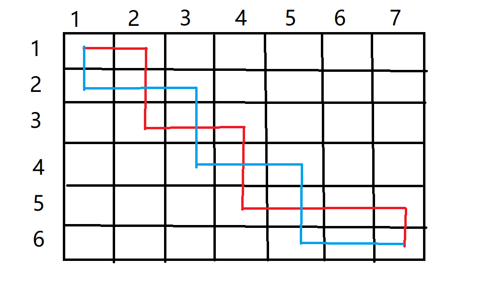
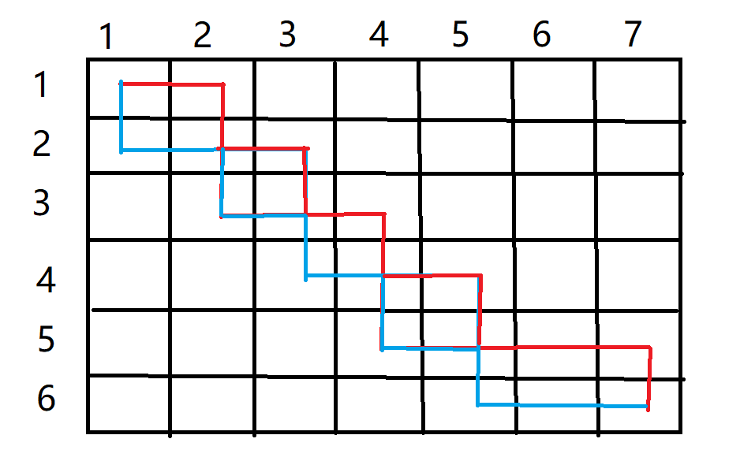

# 数字三角形模型

## AcWing 1015. 摘花生

https://www.acwing.com/problem/content/1017/

Hello Kitty想摘点花生送给她喜欢的米老鼠。

她来到一片有网格状道路的矩形花生地(如下图)，从西北角进去，东南角出来。

地里每个道路的交叉点上都有种着一株花生苗，上面有若干颗花生，经过一株花生苗就能摘走该它上面所有的花生。

Hello Kitty只能向东或向南走，不能向西或向北走。

问Hello Kitty最多能够摘到多少颗花生。

 

#### 输入格式

第一行是一个整数T，代表一共有多少组数据。

接下来是T组数据。

每组数据的第一行是两个整数，分别代表花生苗的行数R和列数 C。

每组数据的接下来R行数据，从北向南依次描述每行花生苗的情况。每行数据有C个整数，按从西向东的顺序描述了该行每株花生苗上的花生数目M。

#### 输出格式

对每组输入数据，输出一行，内容为Hello Kitty能摘到得最多的花生颗数。

#### 数据范围

1≤*T*≤100,1≤*R*,*C*≤100,0≤*M*≤1000

#### 输入样例：

```
2
2 2
1 1
3 4
2 3
2 3 4
1 6 5
```

#### 输出样例：

```
8
16
```

```c++
#include <bits/stdc++.h>

using namespace std;
const int N = 110;
int n, m, f[N][N];

void solve() {
    cin >> n >> m;
    for (int i = 1; i <= n; ++i) {
        for (int j = 1; j <= m; ++j) {
            scanf("%d", &f[i][j]);
            f[i][j] = max(f[i - 1][j], f[i][j - 1]) + f[i][j];
        }
    }
    cout << f[n][m] << endl;
}

int main() {
    int t;
    cin >> t;
    while (t--) solve();
    return 0;
}
```


## AcWing 1018. 最低通行费

https://www.acwing.com/problem/content/1020/

一个商人穿过一个 *N*×*N* 的正方形的网格，去参加一个非常重要的商务活动。

他要从网格的左上角进，右下角出。

每穿越中间 1 个小方格，都要花费 1 个单位时间。

商人必须在 (2*N*−1) 个单位时间穿越出去。

而在经过中间的每个小方格时，都需要缴纳一定的费用。

这个商人期望在规定时间内用最少费用穿越出去。

请问至少需要多少费用？

注意：不能对角穿越各个小方格（即，只能向上下左右四个方向移动且不能离开网格）。

#### 输入格式

第一行是一个整数，表示正方形的宽度 *N*。

后面 *N* 行，每行 *N* 个不大于 100 的正整数，为网格上每个小方格的费用。

#### 输出格式

输出一个整数，表示至少需要的费用。

#### 数据范围

1≤*N*≤100

#### 输入样例：

```
5
1  4  6  8  10
2  5  7  15 17
6  8  9  18 20
10 11 12 19 21
20 23 25 29 33
```

#### 输出样例：

```
109
```

#### 样例解释

样例中，最小值为 109=1+2+5+7+9+12+19+21+33

```c++
#include <bits/stdc++.h>

using namespace std;
const int N = 110;
int n, m, f[N][N];

int main() {
    cin >> n;
    memset(f, 0x3f, sizeof f);
    f[1][0] = 0;
    for (int i = 1; i <= n; ++i) {
        for (int j = 1; j <= n; ++j) {
            scanf("%d", &f[i][j]);
            f[i][j] = min(f[i - 1][j], f[i][j - 1]) + f[i][j];
        }
    }
    cout << f[n][n] << endl;
    return 0;
}
```

本题要求我们在 2n−1 的时间内，从起点走到终点

因此，得出结论，我们的走的路线不是完全随机的，而是遵循最短路的原则

也就是说，每次移动，至少要使曼哈顿距离缩短 1

于是，规定了我们每次在不越过边界的情况下只能向右或向下移动

总结出该条性质以后，本题的模型就可以完全套用AcWing 1015. 摘花生了

> AcWing 1015. 摘花生
>
> https://www.acwing.com/problem/content/1017/


## AcWing 1027. 方格取数

https://www.acwing.com/problem/content/1029/

设有 N×N 的方格图，我们在其中的某些方格中填入正整数，而其它的方格中则放入数字0。如下图所示：

 

某人从图中的左上角 A 出发，可以向下行走，也可以向右行走，直到到达右下角的 B 点。

在走过的路上，他可以取走方格中的数（取走后的方格中将变为数字0）。

此人从 A 点到 B 点共走了两次，试找出两条这样的路径，使得取得的数字和为最大。

#### 输入格式

第一行为一个整数N，表示 N×N 的方格图。

接下来的每行有三个整数，第一个为行号数，第二个为列号数，第三个为在该行、该列上所放的数。

行和列编号从 1 开始。

一行“0 0 0”表示结束。

#### 输出格式

输出一个整数，表示两条路径上取得的最大的和。

#### 数据范围

*N*≤10

#### 输入样例：

```
8
2 3 13
2 6 6
3 5 7
4 4 14
5 2 21
5 6 4
6 3 15
7 2 14
0 0 0
```

#### 输出样例：

```
67
```

```c++
#include <bits/stdc++.h>

using namespace std;
const int N = 15;

int n, f[2 * N][N][N], w[N][N];

int main() {
    cin >> n;
    int a, b, c;
    while (cin >> a >> b >> c) w[a][b] = c;
    for (int k = 2; k <= n + n; ++k) {
        for (int i1 = 1; i1 <= n; ++i1) {
            for (int i2 = 1; i2 <= n; ++i2) {
                int j1 = k - i1, j2 = k - i2;
                if (j1 >= 1 && j2 >= 1 && j1 <= n && j2 <= n) {
                    int &x = f[k][i1][i2];
                    int t = w[i1][j1];
                    if (i1 != i2) t += w[i2][j2];
                    x = max(x, f[k - 1][i1 - 1][i2 - 1] + t);
                    x = max(x, f[k - 1][i1][i2 - 1] + t);
                    x = max(x, f[k - 1][i1 - 1][i2] + t);
                    x = max(x, f[k - 1][i1][i2] + t);
                }
            }
        }
    }
    cout << f[n + n][n][n] << endl;
    return 0;
}
```


## AcWing 275. 传纸条

https://www.acwing.com/activity/content/problem/content/1286/

小渊和小轩是好朋友也是同班同学，他们在一起总有谈不完的话题。

一次素质拓展活动中，班上同学安排坐成一个 *m* 行 *n* 列的矩阵，而小渊和小轩被安排在矩阵对角线的两端，因此，他们就无法直接交谈了。

幸运的是，他们可以通过传纸条来进行交流。

纸条要经由许多同学传到对方手里，小渊坐在矩阵的左上角，坐标 (1,1)，小轩坐在矩阵的右下角，坐标 (*m*,*n*)。

从小渊传到小轩的纸条只可以向下或者向右传递，从小轩传给小渊的纸条只可以向上或者向左传递。 

在活动进行中，小渊希望给小轩传递一张纸条，同时希望小轩给他回复。

班里每个同学都可以帮他们传递，但只会帮他们一次，也就是说如果此人在小渊递给小轩纸条的时候帮忙，那么在小轩递给小渊的时候就不会再帮忙，反之亦然。 

还有一件事情需要注意，全班每个同学愿意帮忙的好感度有高有低（注意：小渊和小轩的好心程度没有定义，输入时用 0 表示），可以用一个 0∼100 的自然数来表示，数越大表示越好心。

小渊和小轩希望尽可能找好心程度高的同学来帮忙传纸条，即找到来回两条传递路径，使得这两条路径上同学的好心程度之和最大。

现在，请你帮助小渊和小轩找到这样的两条路径。

#### 输入格式

第一行有 2 个用空格隔开的整数 *m* 和 *n*，表示学生矩阵有 *m* 行 *n* 列。

接下来的 *m* 行是一个 *m*×*n* 的矩阵，矩阵中第 *i* 行 *j* 列的整数表示坐在第 *i* 行 *j* 列的学生的好心程度，每行的 *n* 个整数之间用空格隔开。

#### 输出格式

输出一个整数，表示来回两条路上参与传递纸条的学生的好心程度之和的最大值。

#### 数据范围

1≤*n*,*m*≤50

#### 输入样例：

```
3 3
0 3 9
2 8 5
5 7 0
```

#### 输出样例：

```
34
```

```c++
#include <bits/stdc++.h>

using namespace std;
const int N = 55;

int n, f[2 * N][N][N], w[N][N], m;

int main() {
    cin >> n >> m;
    for (int i = 1; i <= n; ++i) 
        for (int j = 1; j <= m; ++j) scanf("%d", &w[i][j]);
    
    for (int k = 2; k <= n + m; ++k) {
        for (int i1 = max(k - m, 1); i1 <= n && i1 <= k - 1; ++i1) {
            for (int i2 = max(k - m, 1); i2 <= n && i2 <= k - 1; ++i2) {
                int j1 = k - i1, j2 = k - i2;
                int &x = f[k][i1][i2];
                int t = w[i1][j1];
                if (i1 != i2) t += w[i2][j2];
                x = max(x, f[k - 1][i1 - 1][i2 - 1] + t);
                x = max(x, f[k - 1][i1][i2 - 1] + t);
                x = max(x, f[k - 1][i1 - 1][i2] + t);
                x = max(x, f[k - 1][i1][i2] + t);
            }
        }
    }
    cout << f[n + m][n][n] << endl;
    return 0;
}
```

注意本道题目的范围计算是在循环初始条件和结束条件中进行的，而方格取数是在循环内部单独加入`if`来判断的。

**证明传纸条为何可以使用方格取数的代码：**

首先， 从右下角回传可以等价为从左上角同时传两次。要想两个路径除了起点和终点之外没有交点，那么肯定有一条路径完全位于另一条的上方。

现在考虑路径有交点的情况：

这种情况其实转换起来很简单，只要把位于红色线段上方的蓝色线段交换颜色就可以了，也就是说当红色处于蓝色的下方的时候，将红色的路径换成从蓝色的那段走是等效的（因为两条路径加起来经过的节点完全没有变)。

就可以得到：

但是这个时候虽然满足了红色路径完全在蓝色的上方，但是却有交点。但是因为所有节点的权值都为非负数，那么可以证明这种情况永远不可能是最优解。比如以交点（2，2）为例，蓝色从（3，1）绕道或者红色从（1，3）处绕道一定不会比两条路径都从（2，2)处走差。

绕过交点之后，可以得到蓝色虚线的方案，该方案一定不会比之前的两个实线的方案更差。（当然该方案也不一定是最优的，还要确定应该由蓝色还是红色来走原来的交点的位置。

结论：

不论是在**方格取数**中，还是在本题中，最优解永远不会由两段相交的路径组成。
那么代码中的相关位置的判断在事实上是起到了上述的确定是让蓝色还是红色走虚线的效果。

**y总代码**

通过循环语句实现状态转移，而不是并列四个差不多的计算语句

```c++
#include <cstdio>
#include <cstring>
#include <iostream>
#include <algorithm>

using namespace std;

const int N = 55;

int n, m;
int g[N][N];
int f[N * 2][N][N];

int main() {
    scanf("%d%d", &n, &m);
    for (int i = 1; i <= n; i++)
        for (int j = 1; j <= m; j++)
            scanf("%d", &g[i][j]);

    for (int k = 2; k <= n + m; k++)
        for (int i = max(1, k - m); i <= n && i < k; i++)
            for (int j = max(1, k - m); j <= n && j < k; j++)
                for (int a = 0; a <= 1; a++)
                    for (int b = 0; b <= 1; b++) {
                        int t = g[i][k - i];
                        if (i != j || k == 2 || k == n + m) // 除了起点和终点之外，其余每个格子只能走一次
                        {
                            t += g[j][k - j];
                            f[k][i][j] = max(f[k][i][j], f[k - 1][i - a][j - b] + t);
                        }
                    }
    printf("%d\n", f[n + m][n][n]);
    return 0;
}
```


# 最长上升子序列模型

## AcWing 1017. 怪盗基德的滑翔翼

https://www.acwing.com/problem/content/description/1019/

怪盗基德是一个充满传奇色彩的怪盗，专门以珠宝为目标的超级盗窃犯。

而他最为突出的地方，就是他每次都能逃脱中村警部的重重围堵，而这也很大程度上是多亏了他随身携带的便于操作的滑翔翼。

有一天，怪盗基德像往常一样偷走了一颗珍贵的钻石，不料却被柯南小朋友识破了伪装，而他的滑翔翼的动力装置也被柯南踢出的足球破坏了。

不得已，怪盗基德只能操作受损的滑翔翼逃脱。

假设城市中一共有N幢建筑排成一条线，每幢建筑的高度各不相同。

初始时，怪盗基德可以在任何一幢建筑的顶端。

他可以选择一个方向逃跑，但是不能中途改变方向（因为中森警部会在后面追击）。

因为滑翔翼动力装置受损，他只能往下滑行（即：只能从较高的建筑滑翔到较低的建筑）。

他希望尽可能多地经过不同建筑的顶部，这样可以减缓下降时的冲击力，减少受伤的可能性。

请问，他最多可以经过多少幢不同建筑的顶部(包含初始时的建筑)？

#### 输入格式

输入数据第一行是一个整数K，代表有K组测试数据。

每组测试数据包含两行：第一行是一个整数N，代表有N幢建筑。第二行包含N个不同的整数，每一个对应一幢建筑的高度h，按照建筑的排列顺序给出。

#### 输出格式

对于每一组测试数据，输出一行，包含一个整数，代表怪盗基德最多可以经过的建筑数量。

#### 数据范围

1≤*K*≤100

1≤*N*≤100

0<*h*<10000

#### 输入样例：

```
3
8
300 207 155 299 298 170 158 65
8
65 158 170 298 299 155 207 300
10
2 1 3 4 5 6 7 8 9 10
```

#### 输出样例：

```
6
6
9
```

```c++
#include <bits/stdc++.h>

using namespace std;
const int N = 100;
int n, a[N], q1[N], q2[N];

void solve() {
    cin >> n;
    for (int i = 0; i < n; ++i) scanf("%d", &a[i]);
    memset(q1, 0, sizeof q1);  //  清不清空没关系
    memset(q2, 0, sizeof q2);  //  但是为了一个好的习惯还是要清空一下
    int len1 = 0;
    q1[0] = -2e9;
    for (int i = 0; i < n; ++i) {
        int l = 0, r = len1;
        while (l < r) {
            int mid = l + r + 1 >> 1;
            if (q1[mid] < a[i]) l = mid;
            else r = mid - 1;
        }
        len1 = max(len1, r + 1);
        q1[r + 1] = a[i];
    }

    int len2 = 0;
    q2[0] = -2e9;
    for (int i = n - 1; i >= 0; --i) {
        int l = 0, r = len2;
        while (l < r) {
            int mid = l + r + 1 >> 1;
            if (q2[mid] < a[i]) l = mid;
            else r = mid - 1;
        }
        len2 = max(r + 1, len2);
        q2[r + 1] = a[i];
    }
    cout << max(len1, len2) << endl;
}

int main() {
    int t;
    cin >> t;
    while (t--) solve();
    return 0;
}
```


## AcWing 1014. 登山

https://www.acwing.com/problem/content/1016/

五一到了，ACM队组织大家去登山观光，队员们发现山上一共有N个景点，并且决定按照顺序来浏览这些景点，即每次所浏览景点的编号都要大于前一个浏览景点的编号。

同时队员们还有另一个登山习惯，就是不连续浏览海拔相同的两个景点，并且一旦开始下山，就不再向上走了。

队员们希望在满足上面条件的同时，尽可能多的浏览景点，你能帮他们找出最多可能浏览的景点数么？

#### 输入格式

第一行包含整数N，表示景点数量。

第二行包含N个整数，表示每个景点的海拔。

#### 输出格式

输出一个整数，表示最多能浏览的景点数。

#### 数据范围

2≤*N*≤1000

#### 输入样例：

```
8
186 186 150 200 160 130 197 220
```

#### 输出样例：

```
4
```

```c++
#include <bits/stdc++.h>

using namespace std;
const int N = 1010;
int n, a[N], q1[N], q2[N], ll[N], rr[N];
bool st1[N], st2[N];

void solve() {
    cin >> n;
    for (int i = 0; i < n; ++i) scanf("%d", &a[i]);
    int len1 = 0;
    q1[0] = -2e9;
    for (int i = 0; i < n; ++i) {
        int l = 0, r = len1;
        while (l < r) {
            int mid = l + r + 1 >> 1;
            if (q1[mid] < a[i]) l = mid;
            else r = mid - 1;
        }
        len1 = max(len1, r + 1);
        q1[r + 1] = a[i];
        ll[i] = len1;
        if (a[i] == q1[len1]) st1[i] = true;
    }

    int len2 = 0;
    q2[0] = -2e9;
    for (int i = n - 1; i >= 0; --i) {
        int l = 0, r = len2;
        while (l < r) {
            int mid = l + r + 1 >> 1;
            if (q2[mid] < a[i]) l = mid;
            else r = mid - 1;
        }
        len2 = max(r + 1, len2);
        q2[r + 1] = a[i];
        rr[i] = len2;
        if (a[i] == q2[len2]) st2[i] = true;
    }
    int res = 0;
    for (int i = 0; i < n; ++i) {
        if (st1[i] && st2[i]) res = max(res, ll[i] + rr[i] - 1);
        else res = max(res, ll[i] + rr[i]);
    }
    cout << res << endl;
}

int main() {
    solve();
    return 0;
}
```

这种方式需要通过两个`bool`数组来优化解决左右都将重点作为最长子序列终点的问题

但是y总代码就避免了这种问题

```c++
#include <iostream>
#include <algorithm>

using namespace std;
const int N = 1010;
int n;
int h[N];
int f[N], g[N];

int main() {
    scanf("%d", &n);
    for (int i = 0; i < n; i++) scanf("%d", &h[i]);

    for (int i = 0; i < n; i++) {
        f[i] = 1;
        for (int j = 0; j < i; j++)
            if (h[i] > h[j])
                f[i] = max(f[i], f[j] + 1);
    }

    for (int i = n - 1; i >= 0; i--) {
        g[i] = 1;
        for (int j = n - 1; j > i; j--)
            if (h[i] > h[j])
                g[i] = max(g[i], g[j] + 1);
    }
    int res = 0;
    for (int i = 0; i < n; i++) res = max(res, f[i] + g[i] - 1);
    printf("%d\n", res);
    return 0;
}
```


## AcWing 482. 合唱队形

https://www.acwing.com/problem/content/484/

*N* 位同学站成一排，音乐老师要请其中的 (*N*−*K*) 位同学出列，使得剩下的 *K* 位同学排成合唱队形。     

合唱队形是指这样的一种队形：设 *K* 位同学从左到右依次编号为 1，2…，*K*，他们的身高分别为 *T*1，*T*2，…，*TK*，  则他们的身高满足 *T*1<…<*Ti*>*Ti+1*>…>*TK*(1≤*i*≤*K*)。     

你的任务是，已知所有 *N* 位同学的身高，计算最少需要几位同学出列，可以使得剩下的同学排成合唱队形。

#### 输入格式

输入的第一行是一个整数 *N*，表示同学的总数。

第二行有 *N* 个整数，用空格分隔，第 *i* 个整数 *Ti* 是第 *i* 位同学的身高(厘米)。

#### 输出格式

输出包括一行，这一行只包含一个整数，就是最少需要几位同学出列。

#### 数据范围

2≤*N*≤100
130≤*Ti*≤230

#### 输入样例：

```
8
186 186 150 200 160 130 197 220
```

#### 输出样例：

```
4
```

```c++
#include <bits/stdc++.h>

using namespace std;
const int N = 110;
int n, a[N], q1[N], q2[N], ll[N], rr[N];

void solve() {
    cin >> n;
    for (int i = 0; i < n; ++i) scanf("%d", &a[i]);
    int len1 = 0;
    q1[0] = -2e9;
    for (int i = 0; i < n; ++i) {
        int l = 0, r = len1;
        while (l < r) {
            int mid = l + r + 1 >> 1;
            if (q1[mid] < a[i]) l = mid;
            else r = mid - 1;
        }
        len1 = max(len1, r + 1);
        q1[r + 1] = a[i];
        ll[i] = len1;
    }

    int len2 = 0;
    q2[0] = -2e9;
    for (int i = n - 1; i >= 0; --i) {
        int l = 0, r = len2;
        while (l < r) {
            int mid = l + r + 1 >> 1;
            if (q2[mid] < a[i]) l = mid;
            else r = mid - 1;
        }
        len2 = max(r + 1, len2);
        q2[r + 1] = a[i];
        rr[i] = len2;
    }
    int res = 0;
    for (int i = 0; i < n - 1; ++i) {
        if (a[i] < a[i + 1]) res = max(res, ll[i] + rr[i + 1]);
    }
    cout << (res != 0 ? n - res : len1 + len2) << endl;
}

int main() {
    solve();
    return 0;
}
```

需要对于`3 150 150 150`这种数据进行特殊处理

但是y总代码就避免了这种问题

```c++
#include <iostream>
#include <algorithm>

using namespace std;
const int N = 1010;
int n;
int h[N];
int f[N], g[N];

int main() {
    scanf("%d", &n);
    for (int i = 0; i < n; i++) scanf("%d", &h[i]);

    for (int i = 0; i < n; i++) {
        f[i] = 1;
        for (int j = 0; j < i; j++)
            if (h[i] > h[j])
                f[i] = max(f[i], f[j] + 1);
    }

    for (int i = n - 1; i >= 0; i--) {
        g[i] = 1;
        for (int j = n - 1; j > i; j--)
            if (h[i] > h[j])
                g[i] = max(g[i], g[j] + 1);
    }
    int res = 0;
    for (int i = 0; i < n; i++) res = max(res, f[i] + g[i] - 1);
    printf("%d\n", n - res);
    return 0;
}
```


## AcWing 1012. 友好城市

https://www.acwing.com/problem/content/1014/

Palmia国有一条横贯东西的大河，河有笔直的南北两岸，岸上各有位置各不相同的N个城市。

北岸的每个城市有且仅有一个友好城市在南岸，而且不同城市的友好城市不相同。

每对友好城市都向政府申请在河上开辟一条直线航道连接两个城市，但是由于河上雾太大，政府决定避免任意两条航道交叉，以避免事故。

编程帮助政府做出一些批准和拒绝申请的决定，使得在保证任意两条航线不相交的情况下，被批准的申请尽量多。

#### 输入格式

第1行，一个整数N，表示城市数。

第2行到第n+1行，每行两个整数，中间用1个空格隔开，分别表示南岸和北岸的一对友好城市的坐标。

#### 输出格式

仅一行，输出一个整数，表示政府所能批准的最多申请数。

#### 数据范围

1≤*N*≤5000
0≤*xi*≤10000

#### 输入样例：

```
7
22 4
2 6
10 3
15 12
9 8
17 17
4 2
```

#### 输出样例：

```
4
```

```c++
#include<bits/stdc++.h>

using namespace std;
const int N = 5010;
int n, q[N];

struct node {
    int a, b;

    bool operator<(const node &w) const {
        return b < w.b;
    }
} d[N];

int main() {
    cin >> n;
    for (int i = 0; i < n; ++i) cin >> d[i].a >> d[i].b;
    sort(d, d + n);

    q[0] = -2e9;
    int len = 0;
    for (int i = 0; i < n; ++i) {
        int l = 0, r = len;
        while (l < r) {
            int mid = l + r + 1 >> 1;
            if (q[mid] < d[i].a) l = mid;
            else r = mid - 1;
        }
        len = max(len, r + 1);
        q[r + 1] = d[i].a;
    }
    cout << len << endl;
    return 0;
}
```

可以发现，**上坐标从小到大枚举选择到的桥，其对应下坐标也必然是从小到大的**


该方案中，在上坐标排序的情况下，下坐标次序不是从小到大的，则必然不合法（会有相交）

于是，这题就变成了：桥以上坐标从小到大排序后，找出下坐标的最长上升子序列长度


## AcWing 1016. 最大上升子序列和

https://www.acwing.com/problem/content/1018/

一个数的序列 *bi*，当 *b*1<*b*2<…<*bS* 的时候，我们称这个序列是上升的。

对于给定的一个序列(*a*1,*a*2,…,*aN*)，我们可以得到一些上升的子序列(*ai*1,*ai*2,…,*a**i**K*)，这里1≤*i*1<*i*2<…<*iK*≤*N*。

比如，对于序列(1,7,3,5,9,4,8)，有它的一些上升子序列，如(1,7),(3,4,8)等等。

这些子序列中和最大为18，为子序列(1,3,5,9)的和。

你的任务，就是对于给定的序列，求出最大上升子序列和。

注意，最长的上升子序列的和不一定是最大的，比如序列(100,1,2,3)的最大上升子序列和为100，而最长上升子序列为(1,2,3)。

#### 输入格式

输入的第一行是序列的长度N。

第二行给出序列中的N个整数，这些整数的取值范围都在0到10000(可能重复)。

#### 输出格式

输出一个整数，表示最大上升子序列和。

#### 数据范围

1≤*N*≤1000

#### 输入样例：

```
7
1 7 3 5 9 4 8
```

#### 输出样例：

```
18
```

```c++
#include <bits/stdc++.h>

using namespace std;
const int N = 1010;
int n, a[N], f[N];

int main() {
    cin >> n;
    for (int i = 0; i < n; ++i) cin >> a[i];
    int res = 0;
    for (int i = 0; i < n; ++i) {
        f[i] = a[i];
        for (int j = 0; j < i; ++j) {
            if (a[j] < a[i]) {
                f[i] = max(f[i], f[j] + a[i]);
            }
        }
        res = max(res, f[i]);
    }
    cout << res << endl;
    return 0;
}
```


## AcWing 1010. 拦截导弹

https://www.acwing.com/problem/content/1012/

某国为了防御敌国的导弹袭击，发展出一种导弹拦截系统。

但是这种导弹拦截系统有一个缺陷：虽然它的第一发炮弹能够到达任意的高度，但是以后每一发炮弹都不能高于前一发的高度。

某天，雷达捕捉到敌国的导弹来袭。

由于该系统还在试用阶段，所以只有一套系统，因此有可能不能拦截所有的导弹。

输入导弹依次飞来的高度（雷达给出的高度数据是不大于30000的正整数，导弹数不超过1000），计算这套系统最多能拦截多少导弹，如果要拦截所有导弹最少要配备多少套这种导弹拦截系统。

#### 输入格式

共一行，输入导弹依次飞来的高度。

#### 输出格式

第一行包含一个整数，表示最多能拦截的导弹数。

第二行包含一个整数，表示要拦截所有导弹最少要配备的系统数。

#### 数据范围

雷达给出的高度数据是不大于 30000 的正整数，导弹数不超过 1000。

#### 输入样例：

```
389 207 155 300 299 170 158 65
```

#### 输出样例：

```
6
2
```

**y总做法**

```c++
#include<bits/stdc++.h>

using namespace std;

const int N = 1010;

int n;
int h[N], f[N], q[N];

int main() {
    string line;
    getline(cin, line);
    stringstream ssin(line);
    while (ssin >> h[n]) n++;

    int res = 0, cnt = 0;
    for (int i = 0; i < n; i++) {
        f[i] = 1;
        for (int j = 0; j < i; j++)
            if (h[i] <= h[j])
                f[i] = max(f[i], f[j] + 1);
        res = max(res, f[i]);

        int k = 0;
        while (k < cnt && q[k] < h[i]) k++;
        if (k == cnt) q[cnt++] = h[i];
        else q[k] = h[i];
    }
    printf("%d\n", res);
    printf("%d\n", cnt);
    return 0;
}
```

第一问显然每套导弹拦截系统拦截导弹高度为不升子序列，求最长的不升子序列就好了
第二问求导弹拦截系统的个数可以转化为求最长上升子序列长度

需要注意这么一个易错点:
输入的时候`int n=0;while(cin>>h[++n]);`会出错，为什么呢？他会导致明明输入了8个数，结果n=9,h数组中最后一个数字为0。
这是为什么呢？因为赋值操作需要先找到变量的地址，然后再进行读入，也就是说最后一次跳出循环是因为`cin`返回值使得我们跳出了`while`循环，而在这之前，我们已经完成了`++n`的操作。

**洛谷题解区代码**

该题在洛谷的测试数据经过了加强，必须要O(nlogn)的时间复杂度才可以过

注意这种方法求最长不上升子序列的代码，非常的巧妙！

```c++
#include <bits/stdc++.h>

using namespace std;

const int N = 2e5 + 5;
int a[N], x, n, dp[N], maxn;
int g[N], cnt;

int main() {
    while (cin >> x) a[++n] = x;
    g[0] = 2e9;
    for (int i = 1; i <= n; i++) {
        if (a[i] <= g[cnt]) g[++cnt] = a[i];
        else {
            int l = 1, r = cnt;
            while (l < r) {
                int mid = l + r >> 1;
                if (g[mid] < a[i]) r = mid;
                else l = mid + 1;
            }
            g[l] = a[i];
        }
    }
    cout << cnt << endl;   // 最长不上升子序列
    cnt = 0;
    g[0] = -2e9;
    for (int i = 1; i <= n; i++) {
        if (a[i] > g[cnt]) g[++cnt] = a[i];
        else {
            int l = 1, r = cnt;
            while (l < r) {
                int mid = l + r >> 1;
                if (g[mid] >= a[i]) r = mid;
                else l = mid + 1;
            }
            g[l] = a[i];
        }
    }
    cout << cnt << endl;   // 最长上升子序列
    return 0;
}
```

注意`for`循环中两个`if`的条件是完全相反的！


## AcWing 187. 导弹防御系统

https://www.acwing.com/problem/content/description/189/

为了对抗附近恶意国家的威胁，*R* 国更新了他们的导弹防御系统。

一套防御系统的导弹拦截高度要么一直 **严格单调** 上升要么一直 **严格单调** 下降。

例如，一套系统先后拦截了高度为 3 和高度为 4 的两发导弹，那么接下来该系统就只能拦截高度大于 4 的导弹。

给定即将袭来的一系列导弹的高度，请你求出至少需要多少套防御系统，就可以将它们全部击落。

#### 输入格式

输入包含多组测试用例。

对于每个测试用例，第一行包含整数 *n*，表示来袭导弹数量。

第二行包含 *n* 个**不同的**整数，表示每个导弹的高度。

当输入测试用例 *n*=0 时，表示输入终止，且该用例无需处理。

#### 输出格式

对于每个测试用例，输出一个占据一行的整数，表示所需的防御系统数量。

#### 数据范围

1≤*n*≤50

#### 输入样例：

```
5
3 5 2 4 1
0 
```

#### 输出样例：

```
2
```

```c++
#include <bits/stdc++.h>

using namespace std;
const int N = 55;

int n;
int h[N];
int up[N], down[N];
int ans;

void dfs(int u, int su, int sd) {
    if (su + sd >= ans) return;
    if (u == n) {
        ans = min(ans, su + sd);
        return;
    }

    int k = 0;
    while (k < su && up[k] >= h[u]) k++;
    if (k < su) {
        int t = up[k];
        up[k] = h[u];
        dfs(u + 1, su, sd);
        up[k] = t;
    } else {
        up[k] = h[u];
        dfs(u + 1, su + 1, sd);
    }

    k = 0;
    while (k < sd && down[k] <= h[u]) k++;
    if (k < sd) {
        int t = down[k];
        down[k] = h[u];
        dfs(u + 1, su, sd);
        down[k] = t;
    } else {
        down[k] = h[u];
        dfs(u + 1, su, sd + 1);
    }
}

int main() {
    while (cin >> n) {
        if (n == 0) return 0;
        for (int i = 0; i < n; ++i) cin >> h[i];
        ans = n;
        dfs(0, 0, 0);
        cout << ans << endl;
    }
    return 0;
}
```

导弹防御系统很自然的想到`LIS`算法，不过这里的条件是一套防御系统的导弹拦截高度要么一直上升要么一直下降，所以用`LIS`算法是不正确的

贪心的思想： 每次加入到一个末尾元素与当前数最接近的递增或递减序列（末尾元素小于`h[u]`且最大的或大于`h[u]`且最小的）

所以可以用两个数组`up[i]`和`down[i]`分别表示第i个递增序列和和递减序列的末尾元素，然后搜索时，每次按照以上原则尽可能加入到编号靠前的序列就是满足上述思想的方案。

而`LIS`中，最核心的思想在于能否将一个元素加入到序列中，只与这个序列目前的最后一个元素有关
这道题就用了这个关键的思想。
用`up[k]`和`down[k]`记录第`k`套上升（下降）系统目前所拦截的最后一个导弹
`dfs(u,v,t)`意味着已有`u`个上升，`v`个下降，正在处理第`t`个数

按理说，每拿到一个新的数字应该将它所有能放入的序列都放一遍的
但扩展节点时却存在一个贪心策略，大大节省了时间。
假设现在要把一个数放入一个上升序列，那么一定是所有能放入的上升序列中，最后一个元素最大的那一个。
其实想想也是，既然每个数字都要放到一个序列中，
对于上升序列，肯定是目前越小越有用，既然能放入大的里面，何必浪费一个小的呢
注意到其实`up[i]`按这种策略已经是排好序的了，所以只用找最先碰到的一个就行了


# 背包模型

## AcWing 423. 采药

https://www.acwing.com/problem/content/425/

辰辰是个天资聪颖的孩子，他的梦想是成为世界上最伟大的医师。

为此，他想拜附近最有威望的医师为师。

医师为了判断他的资质，给他出了一个难题。

医师把他带到一个到处都是草药的山洞里对他说：“孩子，这个山洞里有一些不同的草药，采每一株都需要一些时间，每一株也有它自身的价值。我会给你一段时间，在这段时间里，你可以采到一些草药。如果你是一个聪明的孩子，你应该可以让采到的草药的总价值最大。”

如果你是辰辰，你能完成这个任务吗？

#### 输入格式

输入文件的第一行有两个整数 *T* 和 *M*，用一个空格隔开，*T* 代表总共能够用来采药的时间，*M* 代表山洞里的草药的数目。

接下来的 *M* 行每行包括两个在 1 到 100 之间（包括 1 和 100）的整数，分别表示采摘某株草药的时间和这株草药的价值。

#### 输出格式

输出文件包括一行，这一行只包含一个整数，表示在规定的时间内，可以采到的草药的最大总价值。

#### 数据范围

1≤*T*≤1000
1≤*M*≤100

#### 输入样例：

```
70 3
71 100
69 1
1 2
```

#### 输出样例：

```
3
```

```c++
#include <bits/stdc++.h>

using namespace std;
const int N = 110, M = 1010;
int n, v[N], w[N], f[M], t;

int main() {
    cin >> t >> n;
    for (int i = 1; i <= n; ++i) cin >> v[i] >> w[i];
    for (int i = 1; i <= n; ++i) {
        for (int j = t; j >= v[i]; --j) {
            f[j] = max(f[j], f[j - v[i]] + w[i]);
        }
    }
    cout << f[t];
    return 0;
}
```


## AcWing 1024. 装箱问题

https://www.acwing.com/problem/content/1026/

有一个箱子容量为 V，同时有 n 个物品，每个物品有一个体积（正整数）。

要求 n 个物品中，任取若干个装入箱内，使箱子的剩余空间为最小。

#### 输入格式

第一行是一个整数 V，表示箱子容量。

第二行是一个整数 n，表示物品数。

接下来 n 行，每行一个正整数（不超过10000），分别表示这 n 个物品的各自体积。

#### 输出格式

一个整数，表示箱子剩余空间。

#### 数据范围

0<*V*≤20000
0<*n*≤30

#### 输入样例：

```
24
6
8
3
12
7
9
7
```

#### 输出样例：

```
0
```

```c++
#include <bits/stdc++.h>

using namespace std;
const int N = 35, M = 20010;
int n, v[N], w[N], f[M], t;

int main() {
    cin >> t >> n;
    for (int i = 1; i <= n; ++i) {
        cin >> v[i];
        w[i] = v[i];
    }
    for (int i = 1; i <= n; ++i) {
        for (int j = t; j >= v[i]; --j) {
            f[j] = max(f[j], f[j - v[i]] + w[i]);
        }
    }
    cout << t - f[t] << endl;
    return 0;
}
```


## AcWing 1022. 宠物小精灵之收服

https://www.acwing.com/problem/content/1024/

宠物小精灵是一部讲述小智和他的搭档皮卡丘一起冒险的故事。

一天，小智和皮卡丘来到了小精灵狩猎场，里面有很多珍贵的野生宠物小精灵。

小智也想收服其中的一些小精灵。

然而，野生的小精灵并不那么容易被收服。

对于每一个野生小精灵而言，小智可能需要使用很多个精灵球才能收服它，而在收服过程中，野生小精灵也会对皮卡丘造成一定的伤害（从而减少皮卡丘的体力）。

当皮卡丘的体力小于等于0时，小智就必须结束狩猎（因为他需要给皮卡丘疗伤），而使得皮卡丘体力小于等于0的野生小精灵也不会被小智收服。

当小智的精灵球用完时，狩猎也宣告结束。

我们假设小智遇到野生小精灵时有两个选择：收服它，或者离开它。

如果小智选择了收服，那么一定会扔出能够收服该小精灵的精灵球，而皮卡丘也一定会受到相应的伤害；如果选择离开它，那么小智不会损失精灵球，皮卡丘也不会损失体力。

小智的目标有两个：主要目标是收服尽可能多的野生小精灵；如果可以收服的小精灵数量一样，小智希望皮卡丘受到的伤害越小（剩余体力越大），因为他们还要继续冒险。

现在已知小智的精灵球数量和皮卡丘的初始体力，已知每一个小精灵需要的用于收服的精灵球数目和它在被收服过程中会对皮卡丘造成的伤害数目。

请问，小智该如何选择收服哪些小精灵以达到他的目标呢？

#### 输入格式

输入数据的第一行包含三个整数：N，M，K，分别代表小智的精灵球数量、皮卡丘初始的体力值、野生小精灵的数量。

之后的K行，每一行代表一个野生小精灵，包括两个整数：收服该小精灵需要的精灵球的数量，以及收服过程中对皮卡丘造成的伤害。

#### 输出格式

输出为一行，包含两个整数：C，R，分别表示最多收服C个小精灵，以及收服C个小精灵时皮卡丘的剩余体力值最多为R。

#### 数据范围

0<*N*≤1000
0<*M*≤500,
0<*K*≤100

#### 输入样例1：

```
10 100 5
7 10
2 40
2 50
1 20
4 20
```

#### 输出样例1：

```
3 30
```

#### 输入样例2：

```
10 100 5
8 110
12 10
20 10
5 200
1 110
```

#### 输出样例2：

```
0 100
```

```c++
#include<bits/stdc++.h>

using namespace std;
const int N = 1010;
int n, m, k, v[N], vv[N], f[N][N];

int main() {
    cin >> n >> m >> k;
    for (int i = 1; i <= k; ++i) cin >> v[i] >> vv[i];

    for (int i = 1; i <= k; ++i) {
        for (int j = n; j >= v[i]; --j) {
            for (int p = m; p >= vv[i]; --p) {
                f[j][p] = max(f[j][p], f[j - v[i]][p - vv[i]] + 1);
            }
        }
    }
    int i = m;
    while (i > 0 && f[n][m - 1] == f[n][i - 1]) --i;
    cout << f[n][m - 1] << " " << m - i << endl;
    return 0;
}
```

要从最后的结果开始往前搜索，直到可以捕捉的精灵数量和最后的结果不同的时候停止

注意是从两个限制变量的第二个开始倒着枚举！

输出`f[n][m - 1]`是因为`f[n][m]`是做不到的，使`m`减小到 0 的操作不存在


## AcWing 278. 数字组合

https://www.acwing.com/problem/content/280/

给定 *N* 个正整数 *A*1,*A*2,…,*AN*，从中选出若干个数，使它们的和为 *M*，求有多少种选择方案。

#### 输入格式

第一行包含两个整数 *N* 和 *M*。

第二行包含 *N* 个整数，表示 *A*1,*A*2,…,*AN*。

#### 输出格式

包含一个整数，表示可选方案数。

#### 数据范围

1≤*N*≤100
1≤*M*≤10000,
1≤*Ai*≤1000
 答案保证在 int 范围内。

#### 输入样例：

```
4 4
1 1 2 2
```

#### 输出样例：

```
3
```

```c++
#include <bits/stdc++.h>

using namespace std;
const int N = 110, M = 1e5 + 10;
int n, m, a[N], f[M];

int main() {
    cin >> n >> m;
    for (int i = 1; i <= n; ++i) cin >> a[i];
    sort(a, a + n);
    f[0] = 1;
    for (int i = 1; i <= n; ++i) {
        for (int j = m; j >= a[i]; --j) {
            f[j] += f[j - a[i]];
        }
    }
    cout << f[m] << endl;
    return 0;
}
```


## AcWing 1023. 买书

https://www.acwing.com/problem/content/1025/

小明手里有n元钱全部用来买书，书的价格为10元，20元，50元，100元。

问小明有多少种买书方案？（每种书可购买多本）

#### 输入格式

一个整数 n，代表总共钱数。

#### 输出格式

一个整数，代表选择方案种数。

#### 数据范围

0≤*n*≤1000

#### 输入样例1：

```
20
```

#### 输出样例1：

```
2
```

#### 输入样例2：

```
15
```

#### 输出样例2：

```
0
```

#### 输入样例3：

```
0
```

#### 输出样例3：

```
1
```

```c++
#include <bits/stdc++.h>

using namespace std;
const int N = 5, M = 1010;
int n, m, a[N] = {0, 10, 20, 50, 100}, f[M];

int main() {
    cin >> m;
    n = 4;
    f[0] = 1;
    for (int i = 1; i <= n; ++i) {
        for (int j = a[i]; j <= m; ++j) {
            f[j] += f[j - a[i]];
        }
    }
    cout << f[m] << endl;
    return 0;
}
```


## AcWing 1021. 货币系统

https://www.acwing.com/problem/content/1023/

给你一个n种面值的货币系统，求组成面值为m的货币有多少种方案。

#### 输入格式

第一行，包含两个整数n和m。

接下来n行，每行包含一个整数，表示一种货币的面值。

#### 输出格式

共一行，包含一个整数，表示方案数。

#### 数据范围

*n*≤15,*m*≤3000

#### 输入样例：

```
3 10
1
2
5
```

#### 输出样例：

```
10
```

```c++
#include <bits/stdc++.h>

using namespace std;
typedef long long int LL;
const int N = 20, M = 3010;
int n, m, a[N];
LL f[M];

int main() {
    cin >> n >> m;
    for (int i = 1; i <= n; ++i) cin >> a[i];
    f[0] = 1;
    for (int i = 1; i <= n; ++i) {
        for (int j = a[i]; j <= m; ++j) {
            f[j] += f[j - a[i]];
        }
    }
    cout << f[m] << endl;
    return 0;
}
```


## AcWing 532. 货币系统

https://www.acwing.com/problem/content/534/

在网友的国度中共有 *n* 种不同面额的货币，第 *i* 种货币的面额为 *a*[*i*]，你可以假设每一种货币都有无穷多张。

为了方便，我们把货币种数为 *n*、面额数组为 *a*[1..*n*] 的货币系统记作 (*n*,*a*)。 

在一个完善的货币系统中，每一个非负整数的金额 *x* 都应该可以被表示出，即对每一个非负整数 *x*，都存在 *n* 个非负整数 *t*[*i*] 满足 *a*[*i*]×*t*[*i*] 的和为 *x*。

然而，在网友的国度中，货币系统可能是不完善的，即可能存在金额 *x* 不能被该货币系统表示出。

例如在货币系统 *n*=3, *a*=[2,5,9] 中，金额 1,3 就无法被表示出来。 

两个货币系统 (*n*,*a*) 和 (*m*,*b*) 是等价的，当且仅当对于任意非负整数 *x*，它要么均可以被两个货币系统表出，要么不能被其中任何一个表出。 

现在网友们打算简化一下货币系统。

他们希望找到一个货币系统 (*m*,*b*)，满足 (*m*,*b*) 与原来的货币系统 (*n*,*a*) 等价，且 *m* 尽可能的小。

他们希望你来协助完成这个艰巨的任务：找到最小的 *m*。

#### 输入格式

输入文件的第一行包含一个整数 *T*，表示数据的组数。

接下来按照如下格式分别给出 *T* 组数据。 

每组数据的第一行包含一个正整数 *n*。

接下来一行包含 *n* 个由空格隔开的正整数 *a*[*i*]。

#### 输出格式

输出文件共有 *T* 行，对于每组数据，输出一行一个正整数，表示所有与 (*n*,*a*) 等价的货币系统 (*m*,*b*) 中，最小的 *m*。

#### 数据范围

1≤*n*≤100
1≤*a*[*i*]≤25000
1≤*T*≤20

#### 输入样例：

```
2 
4 
3 19 10 6 
5 
11 29 13 19 17 
```

#### 输出样例：

```
2
5
```

```c++
#include <bits/stdc++.h>

using namespace std;
const int N = 110, M = 25010;
int n, t, a[N], f[M];

int main() {
    cin >> t;
    while (t--) {
        cin >> n;
        for (int i = 0; i < n; ++i) cin >> a[i];
        sort(a, a + n);
        memset(f, 0, sizeof f);
        int res = 0;
        f[0] = 1;
        for (int i = 0; i < n; ++i) {
            if (!f[a[i]]) res++;
            for (int j = a[i]; j <= a[n - 1]; ++j) f[j] += f[j - a[i]];
        }
        cout << res << endl;
    }
    return 0;
}
```


## AcWing 6. 多重背包问题 III

https://www.acwing.com/problem/content/6/

有 *N* 种物品和一个容量是 *V* 的背包。

第 *i* 种物品最多有 *si* 件，每件体积是 *vi*，价值是 *wi*。

求解将哪些物品装入背包，可使物品体积总和不超过背包容量，且价值总和最大。
 输出最大价值。

#### 输入格式

第一行两个整数，*N*，*V*(0<*N*≤1000, 0<*V*≤20000)，用空格隔开，分别表示物品种数和背包容积。

接下来有 *N* 行，每行三个整数 *vi*,*wi*,*si*，用空格隔开，分别表示第 *i* 种物品的体积、价值和数量。

#### 输出格式

输出一个整数，表示最大价值。

#### 数据范围

0<*N*≤1000

0<*V*≤20000
0<*vi*,*wi*,*si*≤20000

##### 提示

本题考查多重背包的单调队列优化方法。

#### 输入样例

```
4 5
1 2 3
2 4 1
3 4 3
4 5 2
```

#### 输出样例：

```
10
```

```c++
#include <bits/stdc++.h>

using namespace std;
const int M = 20010;
int f[M], g[M], q[M];
int n, m;

int main() {
    cin >> n >> m;
    for (int i = 0; i < n; ++i) {
        int v, w, s;
        cin >> v >> w >> s;
        memcpy(g, f, sizeof g);
        for (int j = 0; j < v; ++j) {
            int h = 0, t = -1;
            for (int k = j; k <= m; k += v) {
                if (h <= t && q[h] < k - s * v) h++;
                if (h <= t) f[k] = max(g[k], g[q[h]] + (k - q[h]) / v * w);
                while (h <= t && g[k] >= g[q[t]] + (k - q[t]) / v * w) t--;
                q[++t] = k;
            }
        }
    }
    cout << f[m] << endl;
    return 0;
}
```


## AcWing 1019. 庆功会

https://www.acwing.com/problem/content/1021/

为了庆贺班级在校运动会上取得全校第一名成绩，班主任决定开一场庆功会，为此拨款购买奖品犒劳运动员。

期望拨款金额能购买最大价值的奖品，可以补充他们的精力和体力。

#### 输入格式

第一行二个数n，m，其中n代表希望购买的奖品的种数，m表示拨款金额。

接下来n行，每行3个数，v、w、s，分别表示第I种奖品的价格、价值（价格与价值是不同的概念）和能购买的最大数量（买0件到s件均可）。

#### 输出格式

一行：一个数，表示此次购买能获得的最大的价值（注意！不是价格）。

#### 数据范围

*n*≤500,*m*≤6000
*v*≤100,*w*≤1000,*s*≤10

#### 输入样例：

```
5 1000
80 20 4
40 50 9
30 50 7
40 30 6
20 20 1
```

#### 输出样例：

```
1040
```

```c++
#include <bits/stdc++.h>

using namespace std;
const int M = 20010;
int f[M], g[M], q[M];
int n, m;

int main() {
    cin >> n >> m;
    for (int i = 0; i < n; ++i) {
        int v, w, s;
        cin >> v >> w >> s;
        memcpy(g, f, sizeof g);
        for (int j = 0; j < v; ++j) {
            int h = 0, t = -1;
            for (int k = j; k <= m; k += v) {
                if (h <= t && q[h] < k - s * v) h++;
                if (h <= t) f[k] = max(g[k], g[q[h]] + (k - q[h]) / v * w);
                while (h <= t && g[k] >= g[q[t]] + (k - q[t]) / v * w) t--;
                q[++t] = k;
            }
        }
    }
    cout << f[m] << endl;
    return 0;
}
```


## AcWing 7. 混合背包问题

https://www.acwing.com/problem/content/7/

有 *N* 种物品和一个容量是 *V* 的背包。

物品一共有三类：

- 第一类物品只能用1次（01背包）；
- 第二类物品可以用无限次（完全背包）；
- 第三类物品最多只能用 *si* 次（多重背包）；

每种体积是 *vi*，价值是 *wi*。

求解将哪些物品装入背包，可使物品体积总和不超过背包容量，且价值总和最大。 输出最大价值。

#### 输入格式

第一行两个整数，*N*，*V*，用空格隔开，分别表示物品种数和背包容积。

接下来有 *N* 行，每行三个整数 *vi*,*wi*,*si*，用空格隔开，分别表示第 *i* 种物品的体积、价值和数量。

- *si*=−1表示第 *i* 种物品只能用1次；
- *si*=0表示第 *i* 种物品可以用无限次；
- *si*>0表示第 *i* 种物品可以使用 *si*次；

#### 输出格式

输出一个整数，表示最大价值。

#### 数据范围

0<*N*,*V*≤1000

0<*vi*,*wi*≤1000

−1≤*si*≤1000

#### 输入样例

```
4 5
1 2 -1
2 4 1
3 4 0
4 5 2
```

#### 输出样例：

```
8
```

```c++
#include <bits/stdc++.h>

using namespace std;
const int N = 1010;
int n, m, f[N], q[N], g[N];

int main() {
    cin >> n >> m;
    for (int i = 0; i < n; ++i) {
        int v, w, s;
        cin >> v >> w >> s;
        if (s == -1) {
            for (int j = m; j >= v; --j) f[j] = max(f[j], f[j - v] + w);
        } else if (s == 0) {
            for (int j = v; j <= m; ++j) f[j] = max(f[j], f[j - v] + w);
        } else {
            memcpy(g, f, sizeof g);
            for (int j = 0; j < v; ++j) {
                int h = 0, t = -1;
                for (int k = j; k <= m; k += v) {
                    if (h <= t && k - s * v > q[h]) ++h;
                    if (h <= t) f[k] = max(g[k], g[q[h]] + (k - q[h]) / v * w);
                    while (h <= t && g[k] >= g[q[t]] + (k - q[t]) / v * w) --t;
                    q[++t] = k;
                }
            }
        }
    }
    cout << f[m] << endl;
    return 0;
}
```


## AcWing 8. 二维费用的背包问题

https://www.acwing.com/problem/content/8/

有 *N* 件物品和一个容量是 *V* 的背包，背包能承受的最大重量是 *M*。

每件物品只能用一次。体积是 *vi*，重量是 *mi*，价值是 *wi*。

求解将哪些物品装入背包，可使物品总体积不超过背包容量，总重量不超过背包可承受的最大重量，且价值总和最大。 输出最大价值。

#### 输入格式

第一行三个整数，*N*,*V*,*M*，用空格隔开，分别表示物品件数、背包容积和背包可承受的最大重量。

接下来有 *N* 行，每行三个整数 *vi*,*mi*,*wi*，用空格隔开，分别表示第 *i* 件物品的体积、重量和价值。

#### 输出格式

输出一个整数，表示最大价值。

#### 数据范围

0<*N*≤1000

0<*V*,*M*≤100

0<*vi*,*mi*≤100

0<*wi*≤1000

#### 输入样例

```
4 5 6
1 2 3
2 4 4
3 4 5
4 5 6
```

#### 输出样例：

```
8
```

```c++
#include <bits/stdc++.h>

using namespace std;
const int N = 1010;
int n, f[N][N], V, M;

int main() {
    cin >> n >> V >> M;
    for (int i = 0; i < n; ++i) {
        int v, m, w;
        cin >> v >> m >> w;
        for (int j = V; j >= v; --j) {
            for (int k = M; k >= m; --k) {
                f[j][k] = max(f[j][k], f[j - v][k - m] + w);
            }
        }
    }
    cout << f[V][M] << endl;
    return 0;
}
```


## AcWing 1020. 潜水员

https://www.acwing.com/problem/content/1022/

潜水员为了潜水要使用特殊的装备。

他有一个带2种气体的气缸：一个为氧气，一个为氮气。

让潜水员下潜的深度需要各种数量的氧和氮。

潜水员有一定数量的气缸。

每个气缸都有重量和气体容量。

潜水员为了完成他的工作需要特定数量的氧和氮。

他完成工作所需气缸的总重的最低限度的是多少？

例如：潜水员有5个气缸。每行三个数字为：氧，氮的（升）量和气缸的重量：

```
3 36 120

10 25 129

5 50 250

1 45 130

4 20 119
```

如果潜水员需要5升的氧和60升的氮则总重最小为249（1，2或者4，5号气缸）。

你的任务就是计算潜水员为了完成他的工作需要的气缸的重量的最低值。

#### 输入格式

第一行有2个整数 *m*，*n*。它们表示氧，氮各自需要的量。

第二行为整数 *k* 表示气缸的个数。

此后的 *k* 行，每行包括*ai*，*bi*，*ci*，3个整数。这些各自是：第 *i* 个气缸里的氧和氮的容量及气缸重量。

#### 输出格式

仅一行包含一个整数，为潜水员完成工作所需的气缸的重量总和的最低值。

#### 数据范围

1≤*m*≤21
1≤*n*≤79
1≤*k*≤1000
1≤*ai*≤21
1≤*bi*≤79
1≤*ci*≤800

#### 输入样例：

```
5 60
5
3 36 120
10 25 129
5 50 250
1 45 130
4 20 119
```

#### 输出样例：

```
249
```

```c++
#include <bits/stdc++.h>

using namespace std;
const int N = 22, M = 80;
int n, m, k, f[N][M];

int main() {
    cin >> n >> m >> k;
    memset(f, 0x3f, sizeof f);
    f[0][0] = 0;
    while (k--) {
        int a, b, c;
        cin >> a >> b >> c;
        for (int i = n; i >= 0; --i) {
            for (int j = m; j >= 0; --j) {
                f[i][j] = min(f[i][j], f[max(0, i - a)][max(0, j - b)] + c);
            }
        }
    }
    cout << f[n][m] << endl;
    return 0;
}
```


## AcWing 1013. 机器分配

https://www.acwing.com/problem/content/1015/

总公司拥有 *M* 台 **相同** 的高效设备，准备分给下属的 *N* 个分公司。

各分公司若获得这些设备，可以为国家提供一定的盈利。盈利与分配的设备数量有关。

问：如何分配这M台设备才能使国家得到的盈利最大？

求出最大盈利值。分配原则：每个公司有权获得任意数目的设备，但总台数不超过设备数 *M*。

#### 输入格式

第一行有两个数，第一个数是分公司数 *N*，第二个数是设备台数 *M*；

接下来是一个 *N*×*M* 的矩阵，矩阵中的第 *i* 行第 *j* 列的整数表示第 *i* 个公司分配 *j* 台机器时的盈利。

#### 输出格式

第一行输出最大盈利值；

接下 *N* 行，每行有 2 个数，即分公司编号和该分公司获得设备台数。

答案不唯一，输出任意合法方案即可。

#### 数据范围

1≤*N*≤10
1≤*M*≤15

#### 输入样例：

```
3 3
30 40 50
20 30 50
20 25 30
```

#### 输出样例：

```
70
1 1
2 1
3 1
```

**DP**

```c++
#include <iostream>

using namespace std;

const int N = 20;

int n, m;
int w[N][N];
int f[N][N];
int path[N], cnt;

void dfs(int i, int j) {
    if (!i) return;
    //寻找当前状态f[i][j]是从上述哪一个f[i-1][k]状态转移过来的
    for (int a = j; a >= 0; --a) {
        if (f[i - 1][j - a] + w[i][a] == f[i][j]) {
            path[cnt++] = a;
            dfs(i - 1, j - a);
            return;
        }
    }
}

int main() {
    cin >> n >> m;
    for (int i = 1; i <= n; ++i)
        for (int j = 1; j <= m; ++j)
            cin >> w[i][j];
    for (int i = 1; i <= n; ++i)
        for (int j = 1; j <= m; ++j)
            for (int k = 0; k <= j; ++k)
                f[i][j] = max(f[i][j], f[i - 1][j - k] + w[i][k]);
    cout << f[n][m] << endl;
    dfs(n, m);
    for (int i = cnt - 1, id = 1; i >= 0; --i, ++id)
        cout << id << " " << path[i] << endl;
    return 0;
}
```

> 洛谷要求方案结果输出字典序
>
> https://www.luogu.com.cn/problem/P2066

注意两个`DFS`的区别：

**字典序**

正解

```c++
void dfs(int i, int j) {
    if (!i) return;
    //寻找当前状态f[i][j]是从上述哪一个f[i-1][k]状态转移过来的
    for (int a = j; a >= 0; --a) {
        if (f[i - 1][j - a] + w[i][a] == f[i][j]) {
            path[cnt++] = a;
            dfs(i - 1, j - a);
            return;
        }
    }
}
```

**字典序的逆序**

```c++
void dfs(int i, int j) {
    if (!i) return;
    //寻找当前状态f[i][j]是从上述哪一个f[i-1][k]状态转移过来的
    for (int a = 0; a <= j; ++a) {
        if (f[i - 1][j - a] + w[i][a] == f[i][j]) {
            path[cnt++] = a;
            dfs(i - 1, j - a);
            return;
        }
    }
}
```

因为输出结果需要字典序，所以肯定是越靠后的公司所占的机器数量越多

在搜索的时候使从最后一个公司开始搜索，所以枚举占用的机器数量的时候也要从大到小枚举


**暴力DFS**

```c++
#include<bits/stdc++.h>

using namespace std;
int n, m, a[20][20], pau[20], f[20], ans;
//f[i]是答案机器数，pau是当前假设的机器数量

void dfs(int Nnum, int Nans, int Nm) {
    //Nnum是现在的公司编号，Nans是现在的盈利，Nm是剩余的机器
    if (Nm < 0) return;
    if (Nnum == n + 1) {
        if (Nans > ans) {
            ans = Nans;
            for (int i = 1; i <= n; i++) f[i] = pau[i];
        }
        return;
    }
    //i枚举这个公司用多少台机器
    for (int i = 0; i <= m; i++) {
        pau[Nnum] = i;
        dfs(Nnum + 1, Nans + a[Nnum][i], Nm - i);
    }
}

int main() {
    scanf("%d%d", &n, &m);
    for (int i = 1; i <= n; i++)
        for (int j = 1; j <= m; j++)
            scanf("%d", &a[i][j]);
    dfs(1, 0, m);
    printf("%d\n", ans);
    for (int i = 1; i <= n; i++)
        printf("%d %d\n", i, f[i]);
    return 0;
}
```

`DFS`保证找到最大答案的时候就是字典序最少的，因为我从1号-n号枚举用的多少机器，用的机器数量也是由少到多。当最后得到答案相等的情况下就不用需要比较字典序了，直接return，只有碰到大小不一的时候才更新答案机器数


## AcWing 426. 开心的金明

https://www.acwing.com/problem/content/428/

金明今天很开心，家里购置的新房就要领钥匙了，新房里有一间他自己专用的很宽敞的房间。更让他高兴的是，妈妈昨天对他说：“你的房间需要购买哪些物品，怎么布置，你说了算，只要不超过$N$元钱就行”。今天一早金明就开始做预算，但是他想买的东西太多了，肯定会超过妈妈限定的$N$元。于是，他把每件物品规定了一个重要度，分为$5$等：用整数$1-5$表示，第$5$等最重要。他还从因特网上查到了每件物品的价格（都是整数元）。他希望在不超过$N$元（可以等于$N$元）的前提下，使每件物品的价格与重要度的乘积的总和最大。

设第$j$件物品的价格为$v[j]$，重要度为$w[j]$，共选中了$k$件物品，编号依次为$j_1,j_2,…,j_k$，则所求的总和为：

$v[j_1] \times w[j_1]+v[j_2] \times w[j_2]+ …+v[j_k] \times w[j_k]$。

请你帮助金明设计一个满足要求的购物单。

#### 输入格式

第一行，为$2$个正整数，用一个空格隔开：$n,m$（其中$N(<30000)$表示总钱数，$m(<25)$为希望购买物品的个数。）

从第$2$行到第$m+1$行，第$j$行给出了编号为$j-1$的物品的基本数据，每行有$2$个非负整数$ v p$（其中$v$表示该物品的价格$(v \le 10000)$，$p$表示该物品的重要度($1-5$)

#### 输出格式

$1$个正整数，为不超过总钱数的物品的价格与重要度乘积的总和的最大值$(<100000000)$。

#### 样例 #1

#### 样例输入 #1

```
1000 5
800 2
400 5
300 5
400 3
200 2
```

#### 样例输出 #1

```
3900
```

#### 提示

NOIP 2006 普及组 第二题

```c++
#include <bits/stdc++.h>

using namespace std;

const int N = 30, M = 30010;
int n, m, w[N], v[N];
int f[M];

int main() {
    cin >> n >> m;
    for (int i = 1; i <= m; ++i) cin >> v[i] >> w[i];

    for (int i = 1; i <= m; ++i)
        for (int j = n; j >= v[i]; --j) {
            f[j] = max(f[j], f[j - v[i]] + v[i] * w[i]);
        }

    cout << f[n];
    return 0;
}
```


## AcWing 10. 有依赖的背包问题

https://www.acwing.com/problem/content/10/

有 *N* 个物品和一个容量是 *V* 的背包。

物品之间具有依赖关系，且依赖关系组成一棵树的形状。如果选择一个物品，则必须选择它的父节点。

如下图所示：
  

如果选择物品5，则必须选择物品1和2。这是因为2是5的父节点，1是2的父节点。

每件物品的编号是 *i*，体积是 *vi*，价值是 *wi*，依赖的父节点编号是 *pi*。物品的下标范围是 1…*N*。

求解将哪些物品装入背包，可使物品总体积不超过背包容量，且总价值最大。

输出最大价值。

#### 输入格式

第一行有两个整数 *N*，*V*，用空格隔开，分别表示物品个数和背包容量。接下来有 *N* 行数据，每行数据表示一个物品。

第 *i* 行有三个整数 *vi*,*wi*,*pi*，用空格隔开，分别表示物品的体积、价值和依赖的物品编号。 如果 *pi*=−1，表示根节点。 

**数据保证所有物品构成一棵树。**

#### 输出格式

输出一个整数，表示最大价值。

#### 数据范围

1≤*N*,*V*≤100

1≤*vi*,*wi*≤100

父节点编号范围：

- 内部结点：1≤*pi*≤*N*
- 根节点 *pi*=−1

#### 输入样例

```
5 7
2 3 -1
2 2 1
3 5 1
4 7 2
3 6 2
```

#### 输出样例：

```
11
```

**y总思路**

```c++
#include <bits/stdc++.h>

using namespace std;
const int N = 110;
int n, m, f[N][N], idx, h[N], e[N], ne[N], v[N], w[N];

void add(int a, int b) {
    e[idx] = b;
    ne[idx] = h[a];
    h[a] = idx++;
}

void dfs(int u) {
    for (int i = h[u]; ~i; i = ne[i]) {
        int son = e[i];
        dfs(son);
        for (int j = m - v[u]; j >= 0; --j) {
            for (int k = 0; k <= j; ++k) {
                f[u][j] = max(f[u][j], f[u][j - k] + f[son][k]);
            }
        }
    }
    for (int i = m; i >= v[u]; i--) f[u][i] = f[u][i - v[u]] + w[u];
    for (int i = 0; i < v[u]; i++) f[u][i] = 0;
}

int main() {
    cin >> n >> m;
    int root = 0;
    memset(h, -1, sizeof h);
    for (int i = 1; i <= n; ++i) {
        int p;
        cin >> v[i] >> w[i] >> p;
        if (p == -1) root = i;
        else add(p, i);
    }
    dfs(root);
    cout << f[root][m] << endl;
    return 0;
}
```


**另外一种不同的理解思路**

```c++
#include <bits/stdc++.h>

using namespace std;
const int N = 110;
int n, m, f[N][N], idx, h[N], e[N], ne[N], v[N], w[N];

void add(int a, int b) {
    e[idx] = b;
    ne[idx] = h[a];
    h[a] = idx++;
}

void dfs(int u) {
    //点u必须选，所以初始化f[u][v[u] ~ m]= w[u]
    for (int i = v[u]; i <= m; i++) f[u][i] = w[u];
    for (int i = h[u]; ~i; i = ne[i]) {
        int son = e[i];
        dfs(son);
        //j的范围为v[u]~m, 小于v[u]无法选择以u为子树的物品
        for (int j = m; j >= v[u]; j--)
        {
            //分给子树y的空间不能大于j-v[u],不然都无法选根物品u
            for (int k = 0; k <= j - v[u]; k++)
            {
                f[u][j] = max(f[u][j], f[u][j - k] + f[son][k]);
            }
        }
    }
}

int main() {
    cin >> n >> m;
    int root = 0;
    memset(h, -1, sizeof h);
    for (int i = 1; i <= n; ++i) {
        int p;
        cin >> v[i] >> w[i] >> p;
        if (p == -1) root = i;
        else add(p, i);
    }
    dfs(root);
    cout << f[root][m] << endl;
    return 0;
}
```

思路略区别于yxc的思路
`DFS`在遍历到 x 结点时，先考虑一定选上根节点 x ，因此初始化 f[x][v[x] ~ m] = w[x]
在分组背包部分：
j 的范围 [ m , v[x] ] 小于v[x]则没有意义因为连根结点都放不下；
k 的范围 [ 0 , j-v[x] ]，当大于j-v[x]时分给该子树的容量过多，剩余的容量连根节点的物品都放不下了；


## AcWing 11. 背包问题求方案数

https://www.acwing.com/problem/content/11/

有 *N* 件物品和一个容量是 *V* 的背包。每件物品只能使用一次。

第 *i* 件物品的体积是 *vi*，价值是 *wi*。

求解将哪些物品装入背包，可使这些物品的总体积不超过背包容量，且总价值最大。

输出 **最优选法的方案数**。注意答案可能很大，请输出答案模 10^9^+7 的结果。

#### 输入格式

第一行两个整数，*N*，*V*，用空格隔开，分别表示物品数量和背包容积。

接下来有 *N* 行，每行两个整数 *vi*,*wi*，用空格隔开，分别表示第 *i* 件物品的体积和价值。

#### 输出格式

输出一个整数，表示 **方案数** 模 109+7 的结果。

#### 数据范围

0<*N*,*V*≤1000

0<*vi*,*wi*≤1000

#### 输入样例

```
4 5
1 2
2 4
3 4
4 6
```

#### 输出样例：

```
2
```

```c++
#include <bits/stdc++.h>

using namespace std;
const int N = 1010, mod = 1e9 + 7;
int n, m, f[N], g[N];

int main() {
    cin >> n >> m;
    g[0] = 1;
    for (int i = 0; i < n; ++i) {
        int v, w;
        cin >> v >> w;
        for (int j = m; j >= v; --j) {
            int maxv = max(f[j], f[j - v] + w);
            int cnt = 0;
            if (maxv == f[j]) cnt += g[j];
            if (maxv == f[j - v] + w) cnt += g[j - v];
            g[j] = cnt %= mod;
            f[j] = maxv;
        }
    }
    int res = 0, cnt = 0;
    for (int i = 0; i <= m; ++i) res = max(res, f[i]);
    for (int i = 0; i <= m; ++i) if (res == f[i]) cnt = (cnt + g[i]) % mod;
    cout << cnt << endl;
    return 0;
}
```


## AcWing 12. 背包问题求具体方案

https://www.acwing.com/problem/content/12/

有 *N* 件物品和一个容量是 *V* 的背包。每件物品只能使用一次。

第 *i* 件物品的体积是 *vi*，价值是 *wi*。

求解将哪些物品装入背包，可使这些物品的总体积不超过背包容量，且总价值最大。

输出 **字典序最小的方案**。这里的字典序是指：所选物品的编号所构成的序列。物品的编号范围是 1…*N*。

#### 输入格式

第一行两个整数，*N*，*V*，用空格隔开，分别表示物品数量和背包容积。

接下来有 *N* 行，每行两个整数 *vi*,*wi*，用空格隔开，分别表示第 *i* 件物品的体积和价值。

#### 输出格式

输出一行，包含若干个用空格隔开的整数，表示最优解中所选物品的编号序列，且该编号序列的字典序最小。

物品编号范围是 1…*N*。

#### 数据范围

0<*N*,*V*≤1000

0<*vi*,*wi*≤1000

#### 输入样例

```
4 5
1 2
2 4
3 4
4 6
```

#### 输出样例：

```
1 4
```

```c++
#include<bits/stdc++.h>

using namespace std;
const int N = 1010;
int n, m, f[N][N], v[N], w[N];

int main() {
    cin >> n >> m;
    for (int i = 1; i <= n; ++i) cin >> v[i] >> w[i];
    for (int i = n; i; --i) {
        for (int j = 0; j <= m; ++j) {
            f[i][j] = f[i + 1][j];
            if (j >= v[i]) f[i][j] = max(f[i][j], f[i + 1][j - v[i]] + w[i]);
        }
    }
    int j = m;
    for (int i = 1; i <= n; ++i) {
        if (j >= v[i] && f[i][j] == f[i + 1][j - v[i]] + w[i]) {
            cout << i << " ";
            j -= v[i];
        }
    }
    return 0;
}
```

由于题目要求求字典序最小的方案，因此从1到n中，每个物品有3种情况

- 只能选，则必须选
- 不能选，则必不选
- 可选可不选，则必须选，在前面物品能选的情况下优先选择前面的物品

为了满足上述条件，因此需要从第n个物品遍历到第1个物品，求出当前背包的最大总价值`f[1][m]`

再从第1个物品遍历到第n个物品，其中f[i][j]为当前最优情况，若满足：

- `f[i][j] == f[i + 1][j]`,则表示`f[i][j]`是从`f[i + 1][j]`状态转移过来的
- `f[i][j] == f[i + 1][j - v[i]] + w[i]`，则表示`f[i][j]`是从`f[i + 1][j - v[i]]`状态转移过来的

从而找出字典序最小的路径方案


## AcWing 734. 能量石

https://www.acwing.com/problem/content/736/

岩石怪物杜达生活在魔法森林中，他在午餐时收集了 *N* 块能量石准备开吃。 

由于他的嘴很小，所以一次只能吃一块能量石。 

能量石很硬，吃完需要花不少时间。

吃完第 *i* 块能量石需要花费的时间为 *Si* 秒。

杜达靠吃能量石来获取能量。 

不同的能量石包含的能量可能不同。 

此外，能量石会随着时间流逝逐渐失去能量。 

第 *i* 块能量石最初包含 *Ei* 单位的能量，并且每秒将失去 *Li* 单位的能量。 

当杜达开始吃一块能量石时，他就会立即获得该能量石所含的全部能量（无论实际吃完该石头需要多少时间）。 

能量石中包含的能量最多降低至 0。

请问杜达通过吃能量石可以获得的最大能量是多少？

#### 输入格式

第一行包含整数 *T*，表示共有 *T* 组测试数据。

每组数据第一行包含整数 *N*，表示能量石的数量。

接下来 *N* 行，每行包含三个整数 *Si*,*Ei*,*Li*。

输出格式

每组数据输出一个结果，每个结果占一行。

结果表示为 `Case #x: y`，其中 *x* 是组别编号（从 1 开始），*y* 是可以获得的最大能量值。

#### 数据范围

1≤*T*≤10,
1≤*N*≤100,
1≤*Si*≤100,
1≤*Ei*≤10^5^,
0≤*Li*≤10^5^

#### 输入样例：

```
3
4
20 10 1
5 30 5
100 30 1
5 80 60
3
10 4 1000
10 3 1000
10 8 1000
2
12 300 50
5 200 0
```

#### 输出样例：

```
Case #1: 105
Case #2: 8
Case #3: 500
```

#### 样例解释

在样例＃1中，有 *N*=4 个宝石。杜达可以选择的一个吃石头顺序是：

- 吃第四块石头。这需要 5 秒，并给他 80 单位的能量。
- 吃第二块石头。这需要 5 秒，并给他 5 单位的能量（第二块石头开始时具有 30 单位能量，5 秒后失去了 25 单位的能量）。
- 吃第三块石头。这需要 100 秒，并给他 20 单位的能量（第三块石头开始时具有 30 单位能量，10 秒后失去了 10 单位的能量）。
- 吃第一块石头。这需要 20 秒，并给他 0 单位的能量（第一块石头以 10 单位能量开始，110 秒后已经失去了所有的能量）。

他一共获得了 105 单位的能量，这是能获得的最大值，所以答案是 105。

在样本案例＃2中，有 *N*=3 个宝石。

无论杜达选择吃哪块石头，剩下的两个石头的能量都会耗光。

所以他应该吃第三块石头，给他提供 8 单位的能量。

在样本案例＃3中，有 *N*=2 个宝石。杜达可以：

- 吃第一块石头。这需要 12 秒，并给他 300 单位的能量。
- 吃第二块石头。这需要 5 秒，并给他 200 单位的能量（第二块石头随着时间的推移不会失去任何能量！）。

所以答案是 500。

**y总二维版本**

```c++
#include <iostream>
#include <algorithm>

using namespace std;
const int N = 110, M = 10010;
int n;
struct Stone {
    int s, e, l;
} stones[N];

bool cmp(Stone a, Stone b) {
    return a.s * b.l < b.s * a.l;
}

int f[N][M];

int main() {
    int T;
    cin >> T;
    for (int C = 1; C <= T; C++) {
        cin >> n;
        int m = 0;
        for (int i = 1; i <= n; i++) {
            int s, e, l;
            cin >> s >> e >> l;
            stones[i] = {s, e, l};
            m += s;
        }
        sort(stones + 1, stones + 1 + n, cmp);
        for (int i = 1; i <= n; i++)
            for (int j = 0; j <= m; j++) {
                f[i][j] = f[i - 1][j];
                if (j >= stones[i].s) {
                    int s = stones[i].s, e = stones[i].e, l = stones[i].l;
                    f[i][j] = max(f[i][j], f[i - 1][j - s] + max(0, e - l * (j - s)));
                }
            }
        int res = 0;
        for (int i = 0; i <= m; i++) res = max(res, f[n][i]);
        printf("Case #%d: %d\n", C, res);
    }
    return 0;
}
```


**一维版本**

```c++
#include<iostream>
#include<cstdio>
#include<algorithm>
#include<cstring>

using namespace std;
const int N = 110, M = 10010;
struct Stone {
    int s, e, l;
} stones[N];
int f[M];

bool cmp(Stone a, Stone b) {
    return a.s * b.l < b.s * a.l;
}

int main() {
    int T;
    cin >> T;
    int kase = 0;
    while (T--) {
        int m = 0;
        int n;
        cin >> n;
        for (int i = 1; i <= n; i++) {
            int s, e, l;
            cin >> s >> e >> l;
            stones[i] = {s, e, l};
            m += s;
        }
        sort(stones + 1, stones + 1 + n, cmp);
        memset(f, 0, sizeof(f));
        for (int i = 1; i <= n; i++) {
            int e = stones[i].e, s = stones[i].s, l = stones[i].l;
            for (int j = m; j >= s; j--)
                f[j] = max(f[j], f[j - s] + max(0, e - l * (j - s)));
        }
        int res = 0;
        for (int i = 0; i <= m; i++) res = max(res, f[i]);
        printf("Case #%d: %d\n", ++kase, res);
    }
    return 0;
}
```

> 贪心证明过程及一维最优解：
>
> https://www.acwing.com/solution/content/4639/


## AcWing 487. 金明的预算方案

https://www.acwing.com/problem/content/489/

金明今天很开心，家里购置的新房就要领钥匙了，新房里有一间金明自己专用的很宽敞的房间。

更让他高兴的是，妈妈昨天对他说：“你的房间需要购买哪些物品，怎么布置，你说了算，只要不超过N元钱就行”。

今天一早，金明就开始做预算了，他把想买的物品分为两类：主件与附件，附件是从属于某个主件的，下表就是一些主件与附件的例子：

 

如果要买归类为附件的物品，必须先买该附件所属的主件。

每个主件可以有0个、1个或2个附件。

附件不再有从属于自己的附件。

金明想买的东西很多，肯定会超过妈妈限定的N元。

于是，他把每件物品规定了一个重要度，分为5等：用整数1~5表示，第5等最重要。

他还从因特网上查到了每件物品的价格（都是10元的整数倍）。

他希望在不超过N元（可以等于N元）的前提下，使每件物品的价格与重要度的乘积的总和最大。

设第j件物品的价格为v[j]，重要度为w[j]，共选中了k件物品，编号依次为*j*1，*j*2，…，*jk*，则所求的总和为：

*v*[*j*1]∗*w*[*j*1]+*v*[*j*2]∗*w*[*j*2]+…+*v*[*jk*]∗*w*[*jk*]（其中*为乘号）

请你帮助金明设计一个满足要求的购物单。

#### 输入格式

输入文件的第1行，为两个正整数，用一个空格隔开：N m，其中N表示总钱数，m为希望购买物品的个数。

从第2行到第m+1行，第j行给出了编号为j-1的物品的基本数据，每行有3个非负整数v p q，其中v表示该物品的价格，p表示该物品的重要度（1~5），q表示该物品是主件还是附件。

如果q=0，表示该物品为主件，如果q>0，表示该物品为附件，q是所属主件的编号。

#### 输出格式

输出文件只有一个正整数，为不超过总钱数的物品的价格与重要度乘积的总和的最大值（<200000）。

#### 数据范围

*N*<32000,*m*<60,*v*<10000

#### 输入样例：

```
1000 5
800 2 0
400 5 1
300 5 1
400 3 0
500 2 0
```

#### 输出样例：

```
2200
```

```c++
#include <bits/stdc++.h>

using namespace std;
typedef pair<int, int> PII;
const int M = 32010, N = 65;
PII master[N];
vector<PII> sv[N];
int n, m, f[M];

int main() {
    cin >> m >> n;
    for (int i = 1; i <= n; ++i) {
        int v, p, q;
        cin >> v >> p >> q;
        if (!q) master[i] = {v, v * p};
        else sv[q].push_back({v, v * p});
    }
    for (int i = 1; i <= n; ++i) {
        if (master[i].first) {
            for (int j = m; j >= 0; --j) {
                for (int k = 0; k < 1 << sv[i].size(); ++k) {
                    int v = master[i].first, w = master[i].second;
                    for (int u = 0; u < sv[i].size(); u++) {
                        if (k >> u & 1) {
                            v += sv[i][u].first;
                            w += sv[i][u].second;
                        }
                    }
                    if (j >= v) {
                        f[j] = max(f[j], f[j - v] + w);
                    }
                }
            }
        }
    }
    cout << f[m] << endl;
    return 0;
}
```

主要学习如何进行二进制的枚举？

背包内必须选择主件！


## AcWing 1049. 大盗阿福

https://www.acwing.com/problem/content/1051/

阿福是一名经验丰富的大盗。趁着月黑风高，阿福打算今晚洗劫一条街上的店铺。

这条街上一共有 *N* 家店铺，每家店中都有一些现金。

阿福事先调查得知，只有当他同时洗劫了两家相邻的店铺时，街上的报警系统才会启动，然后警察就会蜂拥而至。

作为一向谨慎作案的大盗，阿福不愿意冒着被警察追捕的风险行窃。

他想知道，在不惊动警察的情况下，他今晚最多可以得到多少现金？

#### 输入格式

输入的第一行是一个整数 *T*，表示一共有 *T* 组数据。

接下来的每组数据，第一行是一个整数 *N* ，表示一共有 *N* 家店铺。

第二行是 *N* 个被空格分开的正整数，表示每一家店铺中的现金数量。

每家店铺中的现金数量均不超过1000。

#### 输出格式

对于每组数据，输出一行。

该行包含一个整数，表示阿福在不惊动警察的情况下可以得到的现金数量。

#### 数据范围

1≤*T*≤50
1≤*N*≤105

#### 输入样例：

```
2
3
1 8 2
4
10 7 6 14
```

#### 输出样例：

```
8
24
```

#### 样例解释

对于第一组样例，阿福选择第2家店铺行窃，获得的现金数量为8。

对于第二组样例，阿福选择第1和4家店铺行窃，获得的现金数量为10+14=24。

```c++
#include <bits/stdc++.h>

using namespace std;
const int N = 1e5 + 10;
int n, t, f[N][2], w[N];

int main() {
    cin >> t;
    while (t--) {
        cin >> n;
        for (int i = 1; i <= n; ++i) scanf("%d", &w[i]);
        f[0][1] = 0, f[0][0] = 0;
        for (int i = 1; i <= n; ++i) {
            f[i][0] = max(f[i - 1][0], f[i - 1][1]);
            f[i][1] = f[i - 1][0] + w[i];
        }
        cout << max(f[n][0], f[n][1]) << endl;
    }
    return 0;
}
```

**滚动数组优化版本**

```c++
#include <bits/stdc++.h>

using namespace std;
const int N = 1e5 + 10;

int n;
int w[N];
int f[2][2];

void solve() {
    memset(f, -0x3f, sizeof f);
    f[0][0] = 0;

    cin >> n;
    for (int i = 1; i <= n; ++i) cin >> w[i];
    for (int i = 1; i <= n; ++i) {
        f[i & 1][0] = max(f[(i - 1) & 1][1], f[(i - 1) & 1][0]);
        f[i & 1][1] = f[(i - 1) & 1][0] + w[i];
    }
    cout << max(f[n & 1][0], f[n & 1][1]) << endl;
}

int main() {
    int T = 1;
    cin >> T;
    while (T--) solve();
    return 0;
}
```


## AcWing 1057. 股票买卖 IV

https://www.acwing.com/problem/content/1059/

给定一个长度为 *N* 的数组，数组中的第 *i* 个数字表示一个给定股票在第 *i* 天的价格。

设计一个算法来计算你所能获取的最大利润，你最多可以完成 *k* 笔交易。

注意：你不能同时参与多笔交易（你必须在再次购买前出售掉之前的股票）。一次买入卖出合为一笔交易。

#### 输入格式

第一行包含整数 *N* 和 *k*，表示数组的长度以及你可以完成的最大交易笔数。

第二行包含 *N* 个不超过 10000 的正整数，表示完整的数组。

#### 输出格式

输出一个整数，表示最大利润。

#### 数据范围

1≤*N*≤10~5~
1≤*k*≤100

#### 输入样例1：

```
3 2
2 4 1
```

#### 输出样例1：

```
2
```

#### 输入样例2：

```
6 2
3 2 6 5 0 3
```

#### 输出样例2：

```
7
```

#### 样例解释

样例1：在第 1 天 (股票价格 = 2) 的时候买入，在第 2 天 (股票价格 = 4) 的时候卖出，这笔交易所能获得利润 = 4-2 = 2 。

样例2：在第 2 天 (股票价格 = 2) 的时候买入，在第 3 天 (股票价格 = 6) 的时候卖出, 这笔交易所能获得利润 = 6-2 = 4 。随后，在第 5 天 (股票价格 = 0) 的时候买入，在第 6 天 (股票价格 = 3) 的时候卖出, 这笔交易所能获得利润 =  3-0 = 3 。共计利润 4+3 = 7.

```c++
#include <bits/stdc++.h>

using namespace std;
const int M = 1e5 + 10, N = 105;
int n, k, f[M][N][2], w[M];

int main() {
    cin >> n >> k;
    for (int i = 1; i <= n; ++i) scanf("%d", &w[i]);

    memset(f, -0x3f, sizeof f);
    for (int i = 0; i <= n; ++i) f[i][0][0] = 0;

    for (int i = 1; i <= n; ++i) {
        for (int j = 1; j <= k; ++j) {
            f[i][j][0] = max(f[i - 1][j][0], f[i - 1][j][1] + w[i]);
            f[i][j][1] = max(f[i - 1][j][1], f[i - 1][j - 1][0] - w[i]);
        }
    }
    int res = 0;
    for (int i = 0; i <= k; ++i) res = max(res, f[n][i][0]);
    cout << res << endl;
    return 0;
}
```

状态表示f~i,j,k~集合：考虑前 i 天的股票，第 i 天的决策是 k，且完成的完整交易数为 j 的方案，k 为 1 说明持有股票，k 为 0 说明不持有股票

**初始化的方式说明了一切的起点只能是`f[0][0][0]`**

**滚动数组优化**

```c++
#include <iostream>
#include <cstring>

using namespace std;

const int N = 1e5 + 10, M = 110;

int n, k;
int w[N];
int f[2][M][2];

int main() {
    cin >> n >> k;
    for (int i = 1; i <= n; ++i) cin >> w[i];

    memset(f, -0x3f, sizeof f);
    f[0][0][0] = 0; //初始状态f[0][0][0]

    for (int i = 1; i <= n; ++i) {
        for (int j = 0; j <= k; ++j) {
            f[i & 1][j][0] = f[(i - 1) & 1][j][0];
            if (j) f[i & 1][j][0] = max(f[i & 1][j][0], f[(i - 1) & 1][j - 1][1] + w[i]);
            f[i & 1][j][1] = max(f[(i - 1) & 1][j][1], f[(i - 1) & 1][j][0] - w[i]);
        }
    }

    int res = 0;
    for (int j = 0; j <= k; ++j) res = max(res, f[n & 1][j][0]); //目标状态f[n][j][0]

    cout << res << endl;

    return 0;
}
```


## AcWing 1058. 股票买卖 V

https://www.acwing.com/problem/content/1060/

给定一个长度为 *N* 的数组，数组中的第 *i* 个数字表示一个给定股票在第 *i* 天的价格。

设计一个算法计算出最大利润。在满足以下约束条件下，你可以尽可能地完成更多的交易（多次买卖一支股票）:

- 你不能同时参与多笔交易（你必须在再次购买前出售掉之前的股票）。
- 卖出股票后，你无法在第二天买入股票 (即冷冻期为 1 天)。

#### 输入格式

第一行包含整数 *N*，表示数组长度。

第二行包含 *N* 个不超过 10000 的正整数，表示完整的数组。

#### 输出格式

输出一个整数，表示最大利润。

#### 数据范围

1≤*N*≤10^5^

#### 输入样例：

```
5
1 2 3 0 2
```

#### 输出样例：

```
3
```

#### 样例解释

对应的交易状态为: [买入, 卖出, 冷冻期, 买入, 卖出]，第一笔交易可得利润 2-1 = 1，第二笔交易可得利润 2-0 = 2，共得利润 1+2 = 3。

```c++
#include <bits/stdc++.h>

using namespace std;
const int N = 1e5 + 10, INF = 0x3f3f3f3f;
int n, w[N], f[N][3];

int main() {
    cin >> n;
    f[0][0] = -INF;
    f[0][1] = -INF;
    f[0][2] = 0;
    for (int i = 1; i <= n; ++i) scanf("%d", &w[i]);
    for (int i = 1; i <= n; ++i) {
        f[i][0] = max(f[i - 1][0], f[i - 1][2] - w[i]);
        f[i][1] = f[i - 1][0] + w[i];
        f[i][2] = max(f[i - 1][2], f[i - 1][1]);
    }
    cout << max(f[n][1], f[n][2]) << endl;
    return 0;
}
```


## AcWing 1052. 设计密码

https://www.acwing.com/problem/content/1054/

你现在需要设计一个密码 *S*，*S*

 需要满足：

- *S* 的长度是 *N*
- *S* 只包含小写英文字母
- *S* 不包含子串 *T*

例如：*abc* 和 *abcde* 是 *abcde* 的子串，*abd* 不是 *abcde* 的子串。

请问共有多少种不同的密码满足要求？

由于答案会非常大，请输出答案模 10^9^+7 的余数。

#### 输入格式

第一行输入整数N，表示密码的长度。

第二行输入字符串T，T中只包含小写字母。

#### 输出格式

输出一个**正整数**，表示总方案数模 10^9^+7 后的结果。

#### 数据范围

1≤*N*≤50
1≤|*T*|≤*N*，|*T*|是*T*的长度。

#### 输入样例1：

```
2
a
```

#### 输出样例1：

```
625
```

#### 输入样例2：

```
4
cbc
```

#### 输出样例2：

```
456924
```

```c++
#include <bits/stdc++.h>

using namespace std;
const int N = 55, mod = 1e9 + 7;
int n, ne[N], f[N][N], m;
char str[N];

int main() {
    cin >> n >> str + 1;
    m = strlen(str + 1);
    for (int i = 2, j = 0; i <= m; ++i) {
        while (j && str[i] != str[j + 1]) j = ne[j];
        if (str[i] == str[j + 1]) j++;
        ne[i] = j;
    }
    f[0][0] = 1;
    for (int i = 0; i < n; ++i) {
        for (int j = 0; j < m; ++j) {
            for (char k = 'a'; k <= 'z'; ++k) {
                int u = j;
                while (u && k != str[u + 1]) u = ne[u];
                if (k == str[u + 1]) u++;
                if (u < m) f[i + 1][u] = (f[i + 1][u] + f[i][j]) % mod;
            }
        }
    }
    int res = 0;
    for (int i = 0; i < m; ++i) res = (res + f[n][i]) % mod;
    cout << res << endl;
    return 0;
}
```

**该问题还是要从状态机的角度考虑比较简单**

状态表示：集合`f[i,j]`： 一个长度为 i 的密码，且后缀与模式串匹配的最大长度为 j 的方案

所以把所有`f[n][0~m-1]`加起来即为总方案数


## AcWing 1072. 树的最长路径

https://www.acwing.com/problem/content/1074/

给定一棵树，树中包含 *n* 个结点（编号1~*n*）和 *n*−1 条无向边，每条边都有一个权值。

现在请你找到树中的一条最长路径。

换句话说，要找到一条路径，使得使得路径两端的点的距离最远。

注意：路径中可以只包含一个点。

#### 输入格式

第一行包含整数 *n*。

接下来 *n*−1 行，每行包含三个整数 *ai*,*bi*,*ci*，表示点 *ai* 和 *bi* 之间存在一条权值为 *ci* 的边。

#### 输出格式

输出一个整数，表示树的最长路径的长度。

#### 数据范围

1≤*n*≤10000,
1≤*ai*,*bi*≤*n*,
−10^5^≤*ci*≤10^5^

#### 输入样例：

```
6
5 1 6
1 4 5
6 3 9
2 6 8
6 1 7
```

#### 输出样例：

```
22
```

```c++
#include <bits/stdc++.h>

using namespace std;
const int N = 20010;
int n, h[N / 2], ne[N], e[N], w[N], idx, ans;

void add(int a, int b, int c) {
    e[idx] = b;
    w[idx] = c;
    ne[idx] = h[a];
    h[a] = idx++;
}

int dfs(int x, int fa) {
    int d1 = 0, d2 = 0;
    int dist = 0;
    for (int i = h[x]; ~i; i = ne[i]) {
        int j = e[i];
        if (j == fa) continue;
        int d = dfs(j, x) + w[i];
        dist = max(dist, d);
        if (d >= d1) d2 = d1, d1 = d;
        else if (d > d2) d2 = d;
    }
    ans = max(ans, d1 + d2);
    return dist;
}

int main() {
    memset(h, -1, sizeof h);
    cin >> n;
    for (int i = 0; i < n - 1; ++i) {
        int a, b, c;
        scanf("%d%d%d", &a, &b, &c);
        add(a, b, c);
        add(b, a, c);
    }
    dfs(1, -1);
    cout << ans << endl;
    return 0;
}
```

这是一道比较经典的 树形DP 题目，我们来一步步来剖析这个问题

我们知道：树上 任意两点 的路径是 唯一 确定的，因此我们可以暴力枚举 起点 和 终点 找出最长路径

如果这样做的话，我们来思考一下时间复杂度：

    枚举 起点 和 终点 — O(n2)

找出两点之间的路径长度 — O(logn)

    这里找出两点之间的路径有很多种做法，预处理 st 表然后倍增求LCA、树链剖分、Link-Cut Tree

但是光是枚举 起点 和 终点，时间复杂度 就直接拉满了，显然这种做法不可取

既然这 O(n2)

条路径不能 一一枚举，那么有什么方式可以把他们 分类枚举 呢？

我们考虑换一种 枚举方式：枚举路径的 起点和终点 →

枚举路径的 中间节点

我们先讨论一下，对于给定拓扑结构的树里的任意节点，经过他的路径有哪些：


观察我标出的 红色节点，那么经过他的路径有：

1. 以其 子树中的某个节点 作为 起点，以他作为 终点 的 粉色路径
2. 以其 子树中的某个节点 作为 起点，以 子树中的某个节点 作为 终点 的 蓝色路径
3. 以其 子树中的某个节点 作为 起点，以 非其子树的节点 作为 终点 的 橙色路径

对于第 1 种情况，我们可以直接递归处理其子树，找出到当前子树根节点最长的路径长度即可

对于第 2 种情况，我们在处理第 1 种情况时，顺便找出 1 类路径的 次长路径把 最长 和 次长 拼在一起，就是我们要的第 2 种情况

而对于第 3 种情况，我们可以把它归类为其 祖先节点 的第 1,2 种情况，让其 祖先节点 去处理即可


## AcWing 1073. 树的中心

https://www.acwing.com/problem/content/1075/

给定一棵树，树中包含 *n* 个结点（编号1~*n*）和 *n*−1 条无向边，每条边都有一个权值。

请你在树中找到一个点，使得该点到树中其他结点的最远距离最近。

#### 输入格式

第一行包含整数 *n*。

接下来 *n*−1 行，每行包含三个整数 *ai*,*bi*,*ci*，表示点 *ai* 和 *bi* 之间存在一条权值为 *ci* 的边。

#### 输出格式

输出一个整数，表示所求点到树中其他结点的最远距离。

#### 数据范围

1≤*n*≤10000,
1≤*ai*,*bi*≤*n*,
1≤*ci*≤10^5^

#### 输入样例：

```
5 
2 1 1 
3 2 1 
4 3 1 
5 1 1
```

#### 输出样例：

```
2
```

```c++
#include <bits/stdc++.h>

using namespace std;
const int N = 10010, M = 20010, INF = 0x3f3f3f3f;
int n, idx, h[N], w[M], e[M], ne[M];
int d1[N], d2[N], p1[N], up[N];
bool is_leaf[N];

void add(int a, int b, int c) {
    ne[idx] = h[a];
    e[idx] = b;
    w[idx] = c;
    h[a] = idx++;
}

int dfsdown(int u, int father) {
    d1[u] = d2[u] = -INF;
    for (int i = h[u]; ~i; i = ne[i]) {
        int j = e[i];
        if (j == father) continue;
        int d = dfsdown(j, u) + w[i];
        if (d >= d1[u]) {
            d2[u] = d1[u];
            d1[u] = d;
            p1[u] = j;
        } else if (d > d2[u]) {
            d2[u] = d;
        }
    }
    if (d1[u] == -INF) {
        d1[u] = d2[u] = 0;
        is_leaf[u] = true;
    }
    return d1[u];
}

void dfsup(int u, int father) {
    for (int i = h[u]; ~i; i = ne[i]) {
        int j = e[i];
        if (j == father) continue;
        if (p1[u] == j) up[j] = max(up[u], d2[u]) + w[i];
        else up[j] = max(up[u], d1[u]) + w[i];
        dfsup(j, u);
    }
}

int main() {
    cin >> n;
    memset(h, -1, sizeof h);
    for (int i = 0; i < n - 1; ++i) {
        int a, b, c;
        cin >> a >> b >> c;
        add(a, b, c);
        add(b, a, c);
    }
    dfsdown(1, -1);
    dfsup(1, -1);
    int res = d1[1];
    for (int i = 2; i <= n; ++i) {
        if (is_leaf[i]) res = min(res, up[i]);
        else res = min(res, max(d1[i], up[i]));
    }
    cout << res << endl;
    return 0;
}
```

用 d1[u],d2[u],up[u],p1[u],p2[u]分别存一下需要的信息，这些数据存的是：

- d1[u]：存下u节点向下走的最长路径的长度
- d2[u]：存下u节点向下走的第二长的路径的长度
- p1[u]：存下u节点向下走的最长路径是从哪一个节点下去的
- p2[u]：存下u节点向下走的第二长的路径是从哪一个节点走下去的
- up[u]：存下u节点向上走的最长路径的长度


## AcWing 1075. 数字转换

https://www.acwing.com/problem/content/1077/

如果一个数 *x* 的约数之和 *y*（不包括他本身）比他本身小，那么 *x* 可以变成 *y*，*y* 也可以变成 *x*。

例如，4 可以变为 3，1 可以变为 7。

限定所有数字变换在不超过 *n* 的正整数范围内进行，求不断进行数字变换且不出现重复数字的最多变换步数。

#### 输入格式

输入一个正整数 *n*

#### 输出格式

输出不断进行数字变换且不出现重复数字的最多变换步数。

#### 数据范围

1≤*n*≤50000

#### 输入样例：

```
7
```

#### 输出样例：

```
3
```

#### 样例解释

一种方案为：4→3→1→7

```c++
#include <bits/stdc++.h>

using namespace std;
const int N = 50010;

int n, idx, ans, h[N], ne[N], e[N];
int sum[N];
bool st[N];

void add(int a, int b) {
    e[idx] = b;
    ne[idx] = h[a];
    h[a] = idx++;
}

int dfs(int u) {
    int d1 = 0, d2 = 0;
    for (int i = h[u]; ~i; i = ne[i]) {
        int j = e[i];
        int d = dfs(j) + 1;
        if (d >= d1) d2 = d1, d1 = d;
        else if (d > d2) d2 = d;
    }
    ans = max(ans, d1 + d2);
    return d1;
}

int main() {
    cin >> n;
    memset(h, -1, sizeof h);
    for (int i = 1; i <= n; ++i) {
        for (int j = 2; j <= n / i; ++j) {
            sum[j * i] += i;
        }
    }
    for (int i = 2; i <= n; ++i) {
        if (sum[i] < i) {
            add(sum[i], i);
            st[i] = true;
        }
    }
    for (int i = 1; i <= n; ++i) {
        if (!st[i]) dfs(i);
    }
    cout << ans << endl;
    return 0;
}
```

**注意：**

1. 我们可以确定树的方向，也就是说树是由有向边构成的
2. 注意`x`和`y`的范围，均是【1—N】的范围，所以中间的`for`遍历要从`i=2`开始


## AcWing 1074. 二叉苹果树

https://www.acwing.com/problem/content/1076/

有一棵二叉苹果树，如果树枝有分叉，一定是分两叉，即没有只有一个儿子的节点。

这棵树共 *N* 个节点，编号为 1 至 *N*，树根编号一定为 1。

我们用一根树枝两端连接的节点编号描述一根树枝的位置。

一棵苹果树的树枝太多了，需要剪枝。但是一些树枝上长有苹果，给定需要保留的树枝数量，求最多能留住多少苹果。

这里的保留是指最终与1号点连通。

#### 输入格式

第一行包含两个整数 *N* 和 *Q*，分别表示树的节点数以及要保留的树枝数量。

接下来 *N*−1 行描述树枝信息，每行三个整数，前两个是它连接的节点的编号，第三个数是这根树枝上苹果数量。

#### 输出格式

输出仅一行，表示最多能留住的苹果的数量。

#### 数据范围

1≤*Q*<*N*≤100.

*N*≠1, 每根树枝上苹果不超过 30000 个。

#### 输入样例：

```
5 2
1 3 1
1 4 10
2 3 20
3 5 20
```

#### 输出样例：

```
21
```

```c++
#include<bits/stdc++.h>

using namespace std;
const int N = 105;
int n, m, idx, h[N], ne[N * 2], w[N * 2], e[N * 2];
int f[N][N];

void add(int a, int b, int c) {
    ne[idx] = h[a];
    e[idx] = b;
    w[idx] = c;
    h[a] = idx++;
}

int dfs(int u, int father) {
    for (int i = h[u]; ~i; i = ne[i]) {
        if (e[i] == father) continue;
        dfs(e[i], u);
        for (int j = m; j >= 0; --j) {
            for (int k = 0; k + 1 <= j; ++k) {
                f[u][j] = max(f[u][j], f[u][j - k - 1] + f[e[i]][k] + w[i]);
            }
        }
    }
}

int main() {
    cin >> n >> m;
    memset(h, -1, sizeof h);
    for (int i = 0; i < n - 1; ++i) {
        int a, b, c;
        cin >> a >> b >> c;
        add(a, b, c);
        add(b, a, c);
    }
    dfs(1, -1);
    cout << f[1][m] << endl;
    return 0;
}
```

每一个点都是一个背包

【注】这里 `k` 最大枚举到 `j−1` 是因为如果计算该节点对父节点的贡献，必须保留他到父节点的入边


## AcWing 323. 战略游戏

https://www.acwing.com/problem/content/325/

鲍勃喜欢玩电脑游戏，特别是战略游戏，但有时他找不到解决问题的方法，这让他很伤心。

现在他有以下问题。

他必须保护一座中世纪城市，这条城市的道路构成了一棵树。

每个节点上的士兵可以观察到所有和这个点相连的边。

他必须在节点上放置最少数量的士兵，以便他们可以观察到所有的边。

你能帮助他吗？

例如，下面的树：

 

只需要放置 1 名士兵（在节点 1 处），就可观察到所有的边。

#### 输入格式

输入包含多组测试数据，每组测试数据用以描述一棵树。

对于每组测试数据，第一行包含整数 *N*，表示树的节点数目。

接下来 *N* 行，每行按如下方法描述一个节点。

节点编号：(子节点数目) 子节点 子节点 …

节点编号从 0 到 *N*−1，每个节点的子节点数量均不超过 10，每个边在输入数据中只出现一次。

#### 输出格式

对于每组测试数据，输出一个占据一行的结果，表示最少需要的士兵数。

#### 数据范围

0<*N*≤1500,
 一个测试点所有 *N* 相加之和不超过 300650。

#### 输入样例：

```
4
0:(1) 1
1:(2) 2 3
2:(0)
3:(0)
5
3:(3) 1 4 2
1:(1) 0
2:(0)
0:(0)
4:(0)
```

#### 输出样例：

```
1
2
```

```c++
#include <bits/stdc++.h>

using namespace std;
const int N = 1510;
int n, idx, h[N], e[N], ne[N];
int f[N][2];
bool st[N];

void add(int a, int b) {
    e[idx] = b;
    ne[idx] = h[a];
    h[a] = idx++;
}

void dfs(int u) {
    f[u][1] = 1;
    f[u][0] = 0;
    for (int i = h[u]; ~i; i = ne[i]) {
        int j = e[i];
        dfs(j);
        f[u][0] += f[j][1];
        f[u][1] += min(f[j][0], f[j][1]);
    }
}

int main() {
    while (cin >> n) {
        memset(h, -1, sizeof h);
        memset(st, false, sizeof st);
        idx = 0;
        for (int i = 0; i < n; ++i) {
            int id, cnt;
            scanf("%d:(%d)", &id, &cnt);
            while (cnt--) {
                int g;
                cin >> g;
                add(id, g);
                st[g] = true;
            }
        }
        int root = 0;
        while (st[root]) ++root;
        dfs(root);
        cout << min(f[root][0], f[root][1]) << endl;
    }
    return 0;
}
```


## AcWing 1077. 皇宫看守

https://www.acwing.com/problem/content/1079/

太平王世子事件后，陆小凤成了皇上特聘的御前一品侍卫。

皇宫各个宫殿的分布，呈一棵树的形状，宫殿可视为树中结点，两个宫殿之间如果存在道路直接相连，则该道路视为树中的一条边。

已知，在一个宫殿镇守的守卫不仅能够观察到本宫殿的状况，还能观察到与该宫殿直接存在道路相连的其他宫殿的状况。

大内保卫森严，三步一岗，五步一哨，每个宫殿都要有人全天候看守，在不同的宫殿安排看守所需的费用不同。

可是陆小凤手上的经费不足，无论如何也没法在每个宫殿都安置留守侍卫。

帮助陆小凤布置侍卫，在看守全部宫殿的前提下，使得花费的经费最少。

#### 输入格式

输入中数据描述一棵树，描述如下：

第一行 *n*，表示树中结点的数目。

第二行至第 *n*+1 行，每行描述每个宫殿结点信息，依次为：该宫殿结点标号 *i*，在该宫殿安置侍卫所需的经费 *k*，该结点的子结点数 *m*，接下来 *m* 个数，分别是这个结点的 *m* 个子结点的标号 *r*1,*r*2,…,*rm*。

对于一个 *n* 个结点的树，结点标号在 1 到 *n* 之间，且标号不重复。

#### 输出格式

输出一个整数，表示最少的经费。

#### 数据范围

1≤*n*≤1500

#### 输入样例：

```
6
1 30 3 2 3 4
2 16 2 5 6
3 5 0
4 4 0
5 11 0
6 5 0
```

#### 输出样例：

```
25
```

#### 样例解释：

在2、3、4结点安排护卫，可以观察到全部宫殿，所需经费最少，为 16 + 5 + 4 = 25。

```c++
#include <bits/stdc++.h>

using namespace std;

const int N = 1510;

int n;
int h[N], w[N], e[N], ne[N], idx;
int f[N][3];
bool st[N];

void add(int a, int b) {
    e[idx] = b, ne[idx] = h[a], h[a] = idx++;
}

void dfs(int u) {
    f[u][2] = w[u];
    int sum = 0;
    for (int i = h[u]; ~i; i = ne[i]) {
        int j = e[i];
        dfs(j);
        f[u][0] += min(f[j][1], f[j][2]);
        f[u][2] += min(min(f[j][0], f[j][1]), f[j][2]);
        sum += min(f[j][1], f[j][2]);
    }
    f[u][1] = 1e9;
    for (int i = h[u]; ~i; i = ne[i]) {
        int j = e[i];
        f[u][1] = min(f[u][1], sum - min(f[j][1], f[j][2]) + f[j][2]);
    }
}

int main() {
    cin >> n;

    memset(h, -1, sizeof h);
    for (int i = 1; i <= n; i++) {
        int id, cost, cnt;
        cin >> id >> cost >> cnt;
        w[id] = cost;
        while (cnt--) {
            int ver;
            cin >> ver;
            add(id, ver);
            st[ver] = true;
        }
    }
    int root = 1;
    while (st[root]) root++;
    dfs(root);
    cout << min(f[root][1], f[root][2]) << endl;
    return 0;
}
```

在 **战略游戏** 中，题目要求的放置方案是 **每条边** 都被 **观察** 到，而本题则是要求 **每个点** 都被 **观察** 到

本题的要求相对于 **战略游戏** ，稍稍增加了一些难度，原因如下：

如果只是要求 **每条边** 被 **观察** 到，那么我们在处理 **父节点** 时，枚举到一个 **子节点** 就可以直接进行讨论：

1. 父节点 **放置** 哨兵，所有子节点都 **可放可不放** 哨兵
2. 父节点 **不放** 哨兵，所有子节点 **都要放置** 哨兵

但是在本题的 要求 中，每条边 变成了 每个点 就会出现如下三种情况

1. 父节点 **放置** 哨兵，所有子节点都 **可放可不放** 哨兵
2. 父节点 **不放** 哨兵，但是他至少有一个 子节点 **放置哨兵**，观察住了他
3. 父节点 **不放** 哨兵，但 **父节点 的 父节点** 放置哨兵观察，则 子节点 **可放可不放** 哨兵

这样每个结点就有 **三种情况** 要转移，简略**状态机**模型如下：

1. 被父节点观察
2. 被子节点观察
3. 被自己来观察


## AcWing 135. 最大子序和

https://www.acwing.com/problem/content/137/

输入一个长度为 *n* 的整数序列，从中找出一段长度不超过 *m* 的连续子序列，使得子序列中所有数的和最大。

**注意：** 子序列的长度至少是 1。

#### 输入格式

第一行输入两个整数 *n*,*m*。

第二行输入 *n* 个数，代表长度为 *n* 的整数序列。

同一行数之间用空格隔开。

#### 输出格式

输出一个整数，代表该序列的最大子序和。

#### 数据范围

1≤*n*,*m*≤300000, 保证所有输入和最终结果都在 int 范围内。

#### 输入样例：

```
6 4
1 -3 5 1 -2 3
```

#### 输出样例：

```
7
```

```c++
#include<bits/stdc++.h>

using namespace std;
const int N = 300010;
int n, m, s[N], f[N], q[N];

int main() {
    cin >> n >> m;
    for (int i = 1; i <= n; ++i) {
        scanf("%d", &s[i]);
        s[i] += s[i - 1];
    }
    int hh = 0, tt = 0;
    int res = -1e9;
    for (int i = 1; i <= n; ++i) {
        if (q[hh] < i - m) hh++;
        res = max(res, s[i] - s[q[hh]]);
        while (hh <= tt && s[q[tt]] >= s[i]) tt--;
        q[++tt] = i;
    }
    cout << res << endl;
    return 0;
}
```


加入队列之前进行判断，第一次开始的时候要把位置`0`加入队列，所以`tt=0`


## AcWing 1087. 修剪草坪

https://www.acwing.com/problem/content/1089/

在一年前赢得了小镇的最佳草坪比赛后，FJ 变得很懒，再也没有修剪过草坪。

现在，新一轮的最佳草坪比赛又开始了，FJ 希望能够再次夺冠。

然而，FJ 的草坪非常脏乱，因此，FJ 只能够让他的奶牛来完成这项工作。

FJ 有 *N* 只排成一排的奶牛，编号为 1 到 *N*。

每只奶牛的效率是不同的，奶牛 *i* 的效率为 *Ei*。

编号相邻的奶牛们很熟悉，如果 FJ 安排超过 *K* 只编号连续的奶牛，那么这些奶牛就会罢工去开派对。

因此，现在 FJ 需要你的帮助，找到最合理的安排方案并计算 FJ 可以得到的最大效率。

注意，方案需满足不能包含超过 *K* 只编号连续的奶牛。

#### 输入格式

第一行：空格隔开的两个整数 *N* 和 *K*；

第二到 *N*+1 行：第 *i*+1 行有一个整数 *Ei*。

#### 输出格式

共一行，包含一个数值，表示 FJ 可以得到的最大的效率值。

#### 数据范围

1≤*N*≤105,
0≤*Ei*≤109

#### 输入样例：

```
5 2
1
2
3
4
5
```

#### 输出样例：

```
12
```

#### 样例解释

FJ 有 5 只奶牛，效率分别为 1、2、3、4、5。

FJ 希望选取的奶牛效率总和最大，但是他不能选取超过 2 只连续的奶牛。

因此可以选择第三只以外的其他奶牛，总的效率为 1 + 2 + 4 + 5 = 12。

```c++
#include <bits/stdc++.h>

using namespace std;
using LL = long long int;
const int N = 1e5 + 10;
LL n, m, f[N], w[N], q[N];

int main() {
    cin >> n >> m;
    for (int i = 1; i <= n; ++i) scanf("%lld", &w[i]);
    int hh = 0, tt = -1;
    for (int i = 0; i <= n; ++i) {
        if (hh <= tt && q[hh] < i - m - 1)++hh;
        f[i] = f[q[hh]] + w[i];
        while (hh <= tt && f[q[tt]] >= f[i]) --tt;
        q[++tt] = i;
    }
    LL res = 0;
    for (int i = 1; i <= n; ++i) res += w[i];
    LL ans = 5e18;
    for (int i = n - m; i <= n; i++)ans = min(ans, f[i]);

    cout << res - ans << endl;
    return 0;
}
```


## AcWing 1088. 旅行问题

https://www.acwing.com/problem/content/1090/

John 打算驾驶一辆汽车周游一个环形公路。

公路上总共有 *n* 个车站，每站都有若干升汽油（有的站可能油量为零），每升油可以让汽车行驶一千米。

John 必须从某个车站出发，一直按顺时针（或逆时针）方向走遍所有的车站，并回到起点。

在一开始的时候，汽车内油量为零，John 每到一个车站就把该站所有的油都带上（起点站亦是如此），行驶过程中不能出现没有油的情况。

任务：判断以每个车站为起点能否按条件成功周游一周。

#### 输入格式

第一行是一个整数 *n*，表示环形公路上的车站数；

接下来 *n* 行，每行两个整数 *pi*,*di*，分别表示表示第 *i* 号车站的存油量和第 *i* 号车站到 **顺时针方向** 下一站的距离。

#### 输出格式

输出共 *n* 行，如果从第 *i* 号车站出发，一直按顺时针（或逆时针）方向行驶，能够成功周游一圈，则在第 *i* 行输出 TAK，否则输出 NIE。

#### 数据范围

3≤*n*≤106
0≤*pi*≤2×109,
0≤*di*≤2×109

#### 输入样例：

```
5
3 1
1 2
5 2
0 1
5 4
```

#### 输出样例：

```
TAK
NIE
TAK
NIE
TAK
```

```c++
#include <bits/stdc++.h>
using namespace std;
typedef long long LL;

const int N = 2e6 + 10;

int n;
int oil[N], dist[N];
LL s[N];
int q[N];
bool ans[N];

int main()
{
    scanf("%d", &n);
    for (int i = 1; i <= n; i ++ )
    {
        scanf("%d%d", &oil[i], &dist[i]);
        s[i] = s[i + n] = oil[i] - dist[i];
    }
    for (int i = 1; i <= n * 2; i ++ ) s[i] += s[i - 1];

    int hh = 0, tt = -1;
    for (int i = n * 2; i >= 0; i -- )
    {
        if (q[hh] > i + n) hh ++ ;
        if (i < n)
        {
            if (s[i] <= s[q[hh]]) ans[i + 1] = true;
        }
        while (hh <= tt && s[q[tt]] >= s[i]) tt -- ;
        q[ ++ tt] = i;
    }

    dist[0] = dist[n];
    for (int i = 1; i <= n; i ++ ) s[i] = s[i + n] = oil[i] - dist[i - 1];
    for (int i = 1; i <= n * 2; i ++ ) s[i] += s[i - 1];

    hh = 0, tt = -1;
    for (int i = 1; i <= n * 2; i ++ )
    {
        if (q[hh] < i - n) hh ++ ;
        if (i > n)
        {
            if (s[i] >= s[q[hh]]) ans[i - n] = true;
        }
        while (hh <= tt && s[q[tt]] <= s[i]) tt -- ;
        q[ ++ tt] = i;
    }

    for (int i = 1; i <= n; i ++ )
        if (ans[i]) puts("TAK");
        else puts("NIE");

    return 0;
}
```


## AcWing 1089. 烽火传递

https://www.acwing.com/problem/content/1091/

烽火台是重要的军事防御设施，一般建在交通要道或险要处。

一旦有军情发生，则白天用浓烟，晚上有火光传递军情。

在某两个城市之间有 *n* 座烽火台，每个烽火台发出信号都有一定的代价。

为了使情报准确传递，在连续 *m* 个烽火台中至少要有一个发出信号。

现在输入 *n*,*m* 和每个烽火台的代价，请计算在两城市之间准确传递情报所需花费的总代价最少为多少。

#### 输入格式

第一行是两个整数 *n*,*m*，具体含义见题目描述；

第二行 *n* 个整数表示每个烽火台的代价 *ai*。

#### 输出格式

输出仅一个整数，表示最小代价。

#### 数据范围

1≤*m*≤*n*≤2×10^5^
0≤*ai*≤1000

#### 输入样例：

```
5 3
1 2 5 6 2
```

#### 输出样例：

```
4
```

```c++
#include <bits/stdc++.h>

using namespace std;
const int N = 2e5 + 10;
int n, m, f[N], w[N], q[N];

int main() {
    cin >> n >> m;
    for (int i = 1; i <= n; ++i) scanf("%d", &w[i]);

    int hh = 0, tt = -1;
    for (int i = 0; i <= n; ++i) {
        if (hh <= tt && q[hh] < i - m) ++hh;
        f[i] = f[q[hh]] + w[i];
        while (hh <= tt && f[q[tt]] >= f[i]) --tt;
        q[++tt] = i;
    }
    int res = 2e9;
    for (int i = n - m + 1; i <= n; ++i) res = min(res, f[i]);
    cout << res << endl;
    return 0;
}
```


## AcWing 1090. 绿色通道

https://www.acwing.com/problem/content/1092/

高二数学《绿色通道》总共有 *n* 道题目要抄，编号 1,2,…,*n*，抄第 *i* 题要花 *ai* 分钟。

小 Y 决定只用不超过 *t* 分钟抄这个，因此必然有空着的题。

每道题要么不写，要么抄完，不能写一半。

下标连续的一些空题称为一个空题段，它的长度就是所包含的题目数。

这样应付自然会引起马老师的愤怒，最长的空题段越长，马老师越生气。

现在，小 Y 想知道他在这 *t* 分钟内写哪些题，才能够尽量减轻马老师的怒火。

由于小 Y 很聪明，你只要告诉他最长的空题段至少有多长就可以了，不需输出方案。

#### 输入格式

第一行为两个整数 *n*,*t*。

第二行为 *n* 个整数，依次为 *a*1,*a*2,…,*an*。

#### 输出格式

输出一个整数，表示最长的空题段至少有多长。

#### 数据范围

0<*n*≤5×10^4^
0<*ai*≤3000
0<*t*≤10^8^

#### 输入样例：

```
17 11
6 4 5 2 5 3 4 5 2 3 4 5 2 3 6 3 5
```

#### 输出样例：

```
3
```

```c++
#include <bits/stdc++.h>

using namespace std;
const int N = 2e5 + 10;
int n, t, f[N], w[N], q[N];

bool check(int m) {
    int hh = 0, tt = -1;
    memset(f, 0, sizeof f);
    memset(q, 0, sizeof q);
    for (int i = 0; i <= n; ++i) {
        if (hh <= tt && q[hh] < i - m - 1) hh++;
        f[i] = f[q[hh]] + w[i];
        while (hh <= tt && f[q[tt]] >= f[i]) tt--;
        q[++tt] = i;
    }
    int res = 2e9;
    for (int i = n - m; i <= n; ++i) res = min(res, f[i]);
    if (res <= t) return true;
    else return false;
}


int main() {
    cin >> n >> t;
    for (int i = 1; i <= n; ++i) scanf("%d", &w[i]);

    int l = 0, r = n;
    while (l < r) {
        int mid = l + r >> 1;
        if (check(mid))r = mid;
        else l = mid + 1;
    }
    cout << l << endl;
    return 0;
}
```


## AcWing 1091. 理想的正方形

https://www.acwing.com/problem/content/1093/

有一个 *a*×*b* 的整数组成的矩阵，现请你从中找出一个 *n*×*n* 的正方形区域，使得该区域所有数中的最大值和最小值的差最小。

#### 输入格式

第一行为三个整数，分别表示 *a*,*b*,*n* 的值；

第二行至第 *a*+1 行每行为 *b* 个非负整数，表示矩阵中相应位置上的数。

#### 输出格式

输出仅一个整数，为 *a*×*b* 矩阵中所有"n*×*n 正方形区域中的最大整数和最小整数的差值"的最小值。

#### 数据范围

2≤*a*,*b*≤1000,
*n*≤*a*,*n*≤*b*,*n*≤100, 矩阵中的所有数都不超过 10^9^

#### 输入样例：

```
5 4 2
1 2 5 6
0 17 16 0
16 17 2 1
2 10 2 1
1 2 2 2
```

#### 输出样例：

```
1
```

```c++
#include <bits/stdc++.h>

using namespace std;
typedef long long int LL;
const int N = 1010, mod = 998244353;
int n, m, a, s[N][N], q[N], qq[N], maxx[N][N], minn[N][N];

int main() {
    cin >> n >> m >> a;
    for (int i = 1; i <= n; ++i)
        for (int j = 1; j <= m; ++j) scanf("%d", &s[i][j]);

    for (int j = 1; j <= m; ++j) {
        int h = 0, t = -1;
        memset(q, 0, sizeof q);
        for (int i = 1; i <= n; ++i) {
            if (h <= t && i - a + 1 > q[h]) h++;
            while (h <= t && s[q[t]][j] <= s[i][j]) t--;
            q[++t] = i;
            if (i - a + 1 >= 1) maxx[i - a + 1][j] = s[q[h]][j];
        }
    }
    for (int j = 1; j <= m; ++j) {
        int h = 0, t = -1;
        memset(q, 0, sizeof q);
        for (int i = 1; i <= n; ++i) {
            if (h <= t && i - a + 1 > q[h]) h++;
            while (h <= t && s[q[t]][j] >= s[i][j]) t--;
            q[++t] = i;
            if (i - a + 1 >= 1) minn[i - a + 1][j] = s[q[h]][j];
        }
    }
    int ans = 2e9 + 12;
    for (int i = 1; i <= n - a + 1; ++i) {
        int h = 0, t = -1;
        int hh = 0, tt = -1;
        memset(q, 0, sizeof q);
        memset(qq, 0, sizeof qq);
        for (int j = 1; j <= m; ++j) {
            if (h <= t && j - a + 1 > q[h]) h++;
            while (h <= t && maxx[i][q[t]] <= maxx[i][j]) t--;
            q[++t] = j;
            if (hh <= tt && j - a + 1 > qq[hh]) hh++;
            while (hh <= tt && minn[i][qq[tt]] >= minn[i][j]) tt--;
            qq[++tt] = j;
            if (j - a + 1 >= 1) {
                ans = min(ans, maxx[i][q[h]] - minn[i][qq[hh]]);
            }
        }
    }
    cout << ans << endl;
    return 0;
}
```
