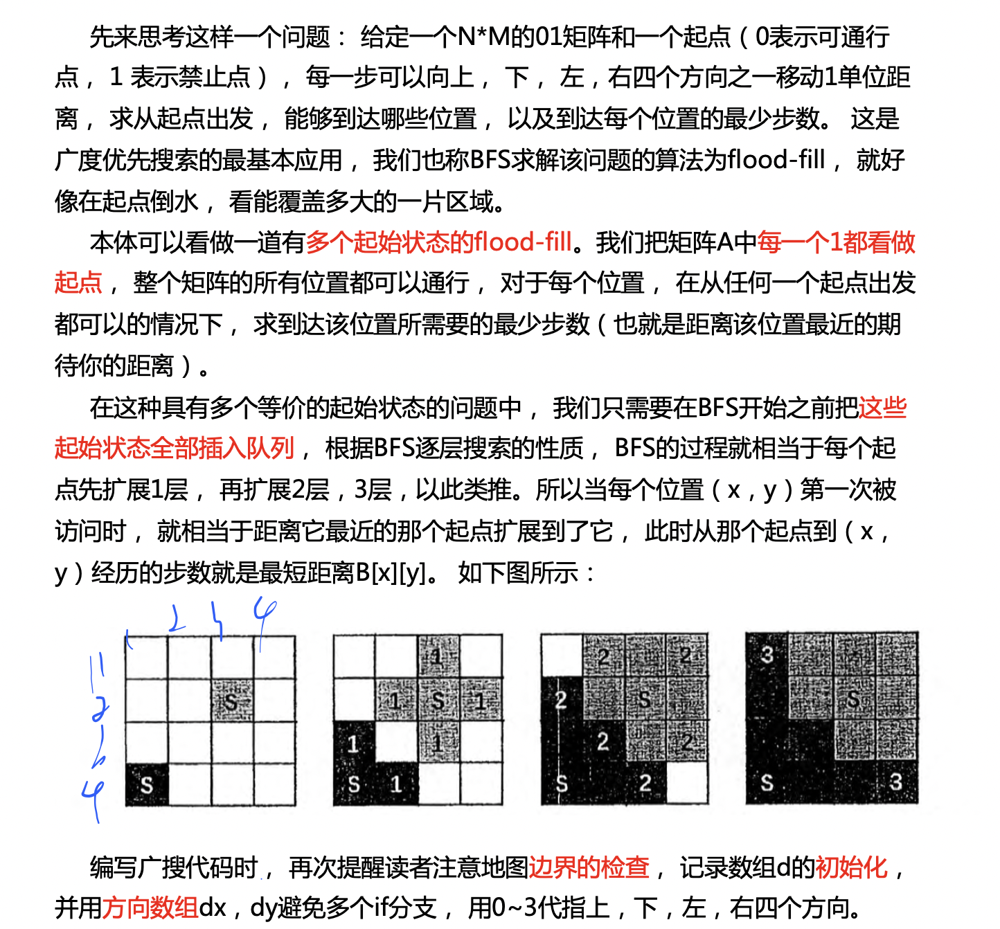

## AcWing 1097. 池塘计数

https://www.acwing.com/problem/content/1099/

农夫约翰有一片 *N*∗*M* 的矩形土地。

最近，由于降雨的原因，部分土地被水淹没了。

现在用一个字符矩阵来表示他的土地。

每个单元格内，如果包含雨水，则用”W”表示，如果不含雨水，则用”.”表示。

现在，约翰想知道他的土地中形成了多少片池塘。

每组相连的积水单元格集合可以看作是一片池塘。

每个单元格视为与其上、下、左、右、左上、右上、左下、右下八个邻近单元格相连。

请你输出共有多少片池塘，即矩阵中共有多少片相连的”W”块。

#### 输入格式

第一行包含两个整数 *N* 和 *M*。

接下来 *N* 行，每行包含 *M* 个字符，字符为”W”或”.”，用以表示矩形土地的积水状况，字符之间没有空格。

#### 输出格式

输出一个整数，表示池塘数目。

#### 数据范围

1≤*N*,*M*≤1000

#### 输入样例：

```
10 12
W........WW.
.WWW.....WWW
....WW...WW.
.........WW.
.........W..
..W......W..
.W.W.....WW.
W.W.W.....W.
.W.W......W.
..W.......W.
```

#### 输出样例：

```
3
```

```c++
#include <bits/stdc++.h>

using namespace std;
const int N = 1005;
typedef pair<int, int> PII;
int n, m, cnt;
char g[N][N];
bool st[N][N];
PII q[N * N];

void bfs(int x, int y) {
    int h = 0, t = -1;
    q[++t] = {x, y};
    st[x][y] = true;
    while (h <= t) {
        auto s = q[h++];
        for (int i = s.first - 1; i <= s.first + 1; ++i) {
            for (int j = s.second - 1; j <= s.second + 1; ++j) {
                if (i == s.first && j == s.second) continue;
                if (i < 0 || j < 0 || i >= n || j >= m) continue;
                if (g[i][j] == '.' || st[i][j]) continue;
                q[++t] = {i, j};
                st[i][j] = true;
            }
        }
    }
}

int main() {
    cin >> n >> m;
    for (int i = 0; i < n; ++i) scanf("%s", g[i]);

    for (int i = 0; i < n; ++i) {
        for (int j = 0; j < m; ++j) {
            if (g[i][j] == 'W' && !st[i][j]) {
                bfs(i, j);
                cnt++;
            }
        }
    }
    cout << cnt << endl;
    return 0;
}
```


## AcWing 1098. 城堡问题

https://www.acwing.com/problem/content/1100/

```
    1   2   3   4   5   6   7  
   #############################
 1 #   |   #   |   #   |   |   #
   #####---#####---#---#####---#
 2 #   #   |   #   #   #   #   #
   #---#####---#####---#####---#
 3 #   |   |   #   #   #   #   #
   #---#########---#####---#---#
 4 #   #   |   |   |   |   #   #
   #############################
           (图 1)

   #  = Wall   
   |  = No wall
   -  = No wall

   方向：上北下南左西右东。
```

图1是一个城堡的地形图。

请你编写一个程序，计算城堡一共有多少房间，最大的房间有多大。

城堡被分割成 *m*∗*n*个方格区域，每个方格区域可以有0~4面墙。

注意：墙体厚度忽略不计。

#### 输入格式

第一行包含两个整数 *m* 和 *n*，分别表示城堡南北方向的长度和东西方向的长度。

接下来 *m* 行，每行包含 *n* 个整数，每个整数都表示平面图对应位置的方块的墙的特征。

每个方块中墙的特征由数字 *P* 来描述，我们用1表示西墙，2表示北墙，4表示东墙，8表示南墙，*P* 为该方块包含墙的数字之和。

例如，如果一个方块的 *P* 为3，则 3 = 1 + 2，该方块包含西墙和北墙。

城堡的内墙被计算两次，方块(1,1)的南墙同时也是方块(2,1)的北墙。

输入的数据保证城堡至少有两个房间。

#### 输出格式

共两行，第一行输出房间总数，第二行输出最大房间的面积（方块数）。

#### 数据范围

1≤*m*,*n*≤50,
0≤*P*≤15

#### 输入样例：

```
4 7 
11 6 11 6 3 10 6 
7 9 6 13 5 15 5 
1 10 12 7 13 7 5 
13 11 10 8 10 12 13 
```

#### 输出样例：

```
5
9
```

```c++
#include <bits/stdc++.h>

using namespace std;
const int N = 55;
typedef pair<int, int> PII;
int n, m, cnt, area;
int g[N][N];
bool st[N][N];
PII q[N * N];

int bfs(int x, int y) {
    int dx[4] = {0, -1, 0, 1}, dy[4] = {-1, 0, 1, 0};
    int h = 0, t = -1;
    q[++t] = {x, y};
    st[x][y] = true;
    int area = 0;
    while (h <= t) {
        auto s = q[h++];
        area++;
        for (int i = 0; i < 4; ++i) {
            int a = s.first + dx[i], b = s.second + dy[i];
            if (a < 0 || b < 0 || a >= n || b >= m) continue;
            if (st[a][b]) continue;
            if (g[s.first][s.second] >> i & 1) continue;
            q[++t] = {a, b};
            st[a][b] = true;
        }
    }
    return area;
}

int main() {
    cin >> n >> m;
    for (int i = 0; i < n; ++i) {
        for (int j = 0; j < m; ++j) {
            cin >> g[i][j];
        }
    }
    for (int i = 0; i < n; ++i) {
        for (int j = 0; j < m; ++j) {
            if (!st[i][j]) {
                area = max(area, bfs(i, j));
                cnt++;
            }
        }
    }
    cout << cnt << endl;
    cout << area << endl;
    return 0;
}
```

**注意是如何判断墙的？（二进制）**


## AcWing 1106. 山峰和山谷

https://www.acwing.com/problem/content/1108/

FGD小朋友特别喜欢爬山，在爬山的时候他就在研究山峰和山谷。

为了能够对旅程有一个安排，他想知道山峰和山谷的数量。

给定一个地图，为FGD想要旅行的区域，地图被分为 *n*×*n* 的网格，每个格子 (*i*,*j*) 的高度 *w*(*i*,*j*) 是给定的。

若两个格子有公共顶点，那么它们就是相邻的格子，如与 (*i*,*j*) 相邻的格子有(*i*−1,*j*−1),(*i*−1,*j*),(*i*−1,*j*+1),(*i*,*j*−1),(*i*,*j*+1),(*i*+1,*j*−1),(*i*+1,*j*),(*i*+1,*j*+1)。

我们定义一个格子的集合 *S* 为山峰（山谷）当且仅当：

1. *S* 的所有格子都有相同的高度。
2. *S* 的所有格子都连通。
3. 对于 *s* 属于 *S*，与 *s* 相邻的 *s*′ 不属于 *S*，都有 *ws*>*ws*′（山峰），或者 *ws*<*ws*（山谷）。
4. 如果周围不存在相邻区域，则同时将其视为山峰和山谷。

你的任务是，对于给定的地图，求出山峰和山谷的数量，如果所有格子都有相同的高度，那么整个地图即是山峰，又是山谷。

#### 输入格式

第一行包含一个正整数 *n*，表示地图的大小。

接下来一个 *n*×*n* 的矩阵，表示地图上每个格子的高度 *w*。

#### 输出格式

共一行，包含两个整数，表示山峰和山谷的数量。

#### 数据范围

1≤*n*≤1000,
0≤*w*≤10^9^

#### 输入样例1：

```
5
8 8 8 7 7
7 7 8 8 7
7 7 7 7 7
7 8 8 7 8
7 8 8 8 8
```

#### 输出样例1：

```
2 1
```

#### 输入样例2：

```
5
5 7 8 3 1
5 5 7 6 6
6 6 6 2 8
5 7 2 5 8
7 1 0 1 7
```

#### 输出样例2：

```
3 3
```

#### 样例解释

样例1：

 

样例2：


```c++
#include <bits/stdc++.h>

using namespace std;
const int N = 1005;
typedef pair<int, int> PII;
int n;
int g[N][N];
bool st[N][N];
PII q[N * N];
int peak, valley;

void bfs(int x, int y, bool &has_higher, bool &has_lower) {
    int h = 0, t = -1;
    q[++t] = {x, y};
    st[x][y] = true;
    while (h <= t) {
        auto s = q[h++];
        for (int i = s.first - 1; i <= s.first + 1; i++)
            for (int j = s.second - 1; j <= s.second + 1; j++) {
                if (i == s.first && j == s.second) continue;
                if (i < 0 || i >= n || j < 0 || j >= n) continue;
                if (g[i][j] != g[s.first][s.second]) // 边界
                {
                    if (g[i][j] > g[s.first][s.second]) has_higher = true;
                    else has_lower = true;
                } else if (!st[i][j]) {
                    q[++t] = {i, j};
                    st[i][j] = true;
                }
            }
    }
}

int main() {
    cin >> n;
    for (int i = 0; i < n; ++i) {
        for (int j = 0; j < n; ++j)
            scanf("%d", &g[i][j]);
    }

    for (int i = 0; i < n; ++i) {
        for (int j = 0; j < n; ++j) {
            if (!st[i][j]) {
                bool has_higher = false, has_lower = false;
                bfs(i, j, has_higher, has_lower);
                if (!has_higher) peak++;
                if (!has_lower) valley++;
            }
        }
    }
    cout << peak << " " << valley << endl;
    return 0;
}
```


## AcWing 1076. 迷宫问题

https://www.acwing.com/problem/content/1078/

给定一个 *n*×*n* 的二维数组，如下所示：

```
int maze[5][5] = {

0, 1, 0, 0, 0,

0, 1, 0, 1, 0,

0, 0, 0, 0, 0,

0, 1, 1, 1, 0,

0, 0, 0, 1, 0,

};
```

它表示一个迷宫，其中的1表示墙壁，0表示可以走的路，只能横着走或竖着走，不能斜着走，要求编程序找出从左上角到右下角的最短路线。

数据保证至少存在一条从左上角走到右下角的路径。

#### 输入格式

第一行包含整数 n。

接下来 *n* 行，每行包含 *n* 个整数 0 或 1，表示迷宫。

#### 输出格式

输出从左上角到右下角的最短路线，如果答案不唯一，输出任意一条路径均可。

按顺序，每行输出一个路径中经过的单元格的坐标，左上角坐标为 (0,0)，右下角坐标为 (*n*−1,*n*−1)。

#### 数据范围

0≤*n*≤1000

#### 输入样例：

```
5
0 1 0 0 0
0 1 0 1 0
0 0 0 0 0
0 1 1 1 0
0 0 0 1 0
```

#### 输出样例：

```
0 0
1 0
2 0
2 1
2 2
2 3
2 4
3 4
4 4
```

```c++
#include <bits/stdc++.h>

using namespace std;
const int N = 1010;
typedef pair<int, int> PII;
int n;
int g[N][N];
PII q[N * N];
int dx[4] = {1, -1, 0, 0};
int dy[4] = {0, 0, 1, -1};
PII pre[N][N];

int main() {
    cin >> n;
    for (int i = 0; i < n; ++i) {
        for (int j = 0; j < n; ++j)
            scanf("%d", &g[i][j]);
    }

    int hh = 0, tt = -1;
    q[++tt] = {n - 1, n - 1};
    memset(pre, -1, sizeof pre);
    pre[n - 1][n - 1] = {0, 0};
    while (hh <= tt) {
        auto t = q[hh++];
        for (int i = 0; i < 4; ++i) {
            int a = t.first + dx[i], b = t.second + dy[i];
            if (a < 0 || b < 0 || a >= n || b >= n) continue;
            if (g[a][b]) continue;
            if (pre[a][b].first != -1) continue;
            q[++tt] = {a, b};
            pre[a][b] = t;
        }
    }
    PII end = {0, 0};
    while (true) {
        printf("%d %d\n", end.first, end.second);
        if (end.first == n - 1 && end.second == n - 1) break;
        end = pre[end.first][end.second];
    }
    return 0;
}
```

**注意这种记录路径的方式**


## AcWing 188. 武士风度的牛

https://www.acwing.com/problem/content/190/

农民 John 有很多牛，他想交易其中一头被 Don 称为 The Knight 的牛。

这头牛有一个独一无二的超能力，在农场里像 Knight 一样地跳（就是我们熟悉的象棋中马的走法）。

虽然这头神奇的牛不能跳到树上和石头上，但是它可以在牧场上随意跳，我们把牧场用一个 *x*，*y* 的坐标图来表示。

这头神奇的牛像其它牛一样喜欢吃草，给你一张地图，上面标注了 The Knight 的开始位置，树、灌木、石头以及其它障碍的位置，除此之外还有一捆草。

现在你的任务是，确定 The Knight 要想吃到草，至少需要跳多少次。

The Knight 的位置用 `K` 来标记，障碍的位置用 `*` 来标记，草的位置用 `H` 来标记。

这里有一个地图的例子：

```
             11 | . . . . . . . . . .
             10 | . . . . * . . . . . 
              9 | . . . . . . . . . . 
              8 | . . . * . * . . . . 
              7 | . . . . . . . * . . 
              6 | . . * . . * . . . H 
              5 | * . . . . . . . . . 
              4 | . . . * . . . * . . 
              3 | . K . . . . . . . . 
              2 | . . . * . . . . . * 
              1 | . . * . . . . * . . 
              0 ----------------------
                                    1 
                0 1 2 3 4 5 6 7 8 9 0 
```

The Knight 可以按照下图中的 *A*,*B*,*C*,*D*… 这条路径用 5 次跳到草的地方（有可能其它路线的长度也是 5）：

```
             11 | . . . . . . . . . .
             10 | . . . . * . . . . .
              9 | . . . . . . . . . .
              8 | . . . * . * . . . .
              7 | . . . . . . . * . .
              6 | . . * . . * . . . F<
              5 | * . B . . . . . . .
              4 | . . . * C . . * E .
              3 | .>A . . . . D . . .
              2 | . . . * . . . . . *
              1 | . . * . . . . * . .
              0 ----------------------
                                    1
                0 1 2 3 4 5 6 7 8 9 0
```

**注意：** 数据保证一定有解。

#### 输入格式

第 1 行： 两个数，表示农场的列数 *C* 和行数 *R*。

第 2..*R*+1 行: 每行一个由 *C* 个字符组成的字符串，共同描绘出牧场地图。

#### 输出格式

一个整数，表示跳跃的最小次数。

#### 数据范围

1≤*R*,*C*≤150

#### 输入样例：

```
10 11
..........
....*.....
..........
...*.*....
.......*..
..*..*...H
*.........
...*...*..
.K........
...*.....*
..*....*..
```

#### 输出样例：

```
5
```

```c++
#include <bits/stdc++.h>

using namespace std;
const int N = 155;
typedef pair<int, int> PII;
int n, m;
int dist[N][N];
char g[N][N];
PII q[N * N];
int dx[] = {-2, -1, 1, 2, 2, 1, -1, -2};
int dy[] = {1, 2, 2, 1, -1, -2, -2, -1};

int bfs() {
    int sx, sy;
    for (int i = 0; i < n; ++i) {
        for (int j = 0; j < m; ++j) {
            if (g[i][j] == 'K') {
                sx = i;
                sy = j;
            }
        }
    }
    memset(dist, -1, sizeof dist);
    int hh = 0, tt = -1;
    q[++tt] = {sx, sy};
    dist[sx][sy] = 0;
    while (hh <= tt) {
        auto t = q[hh++];
        for (int i = 0; i < 8; i++) {
            int a = t.first + dx[i], b = t.second + dy[i];
            if (a < 0 || a >= n || b < 0 || b >= m) continue;
            if (g[a][b] == '*') continue;
            if (dist[a][b] != -1) continue;
            if (g[a][b] == 'H') return dist[t.first][t.second] + 1;

            dist[a][b] = dist[t.first][t.second] + 1;
            q[++tt] = {a, b};
        }
    }
    return -1;
}

int main() {
    cin >> m >> n;
    for (int i = 0; i < n; ++i) cin >> g[i];
    cout << bfs() << endl;
    return 0;
}
```


## AcWing 1100. 抓住那头牛

https://www.acwing.com/problem/content/1102/

农夫知道一头牛的位置，想要抓住它。

农夫和牛都位于数轴上，农夫起始位于点 *N*，牛位于点 *K*。

农夫有两种移动方式：

1. 从 *X* 移动到 *X*−1 或 *X*+1，每次移动花费一分钟
2. 从 *X* 移动到 2∗*X*，每次移动花费一分钟

假设牛没有意识到农夫的行动，站在原地不动。

农夫最少要花多少时间才能抓住牛？

#### 输入格式

共一行，包含两个整数N和K。

#### 输出格式

输出一个整数，表示抓到牛所花费的最少时间。

#### 数据范围

0≤*N*,*K*≤10^5^

#### 输入样例：

```
5 17
```

#### 输出样例：

```
4
```

```c++
#include <bits/stdc++.h>

using namespace std;
const int N = 2e5 + 10;
int dist[N];
int q[N];
int n, k;

int bfs() {
    memset(dist, -1, sizeof dist);
    int hh = 0, tt = -1;
    q[++tt] = n;
    dist[n] = 0;
    while (hh <= tt) {
        int t = q[hh++];
        if (t == k) return dist[k];
        if (t + 1 < N && dist[t + 1] == -1) {
            dist[t + 1] = dist[t] + 1;
            q[++tt] = t + 1;
        }
        if (t - 1 >= 0 && dist[t - 1] == -1) {
            dist[t - 1] = dist[t] + 1;
            q[++tt] = t - 1;
        }
        if (2 * t < N && dist[2 * t] == -1) {
            dist[2 * t] = dist[t] + 1;
            q[++tt] = 2 * t;
        }
    }
    return -1;
}

int main() {
    cin >> n >> k;
    cout << bfs() << endl;
    return 0;
}
```


## AcWing 173. 矩阵距离

https://www.acwing.com/problem/content/175/

给定一个 N 行 M 列的 01 矩阵 A，`A[i][j]` 与 `A[k][l]`

之间的曼哈顿距离定义为：

`dist(A[i][j],A[k][l])=|i−k|+|j−l|`

输出一个 N 行 M 列的整数矩阵 B，其中：

`B[i][j]=min1≤x≤N,1≤y≤M,A[x][y]=1，dist(A[i][j],A[x][y])`

#### 输入格式

第一行两个整数 *N*,*M*。

接下来一个 *N* 行 *M* 列的 01 矩阵，数字之间没有空格。

#### 输出格式

一个 *N* 行 *M* 列的矩阵 *B*，相邻两个整数之间用一个空格隔开。

#### 数据范围

1≤*N*,*M*≤1000

#### 输入样例：

```
3 4
0001
0011
0110
```

#### 输出样例：

```
3 2 1 0
2 1 0 0
1 0 0 1
```

```c++
#include <bits/stdc++.h>

using namespace std;
typedef pair<int, int> PII;
const int N = 1010;
int n, m;
PII q[N * N];
char g[N][N];
int dist[N][N];
int dx[4] = {1, -1, 0, 0};
int dy[4] = {0, 0, 1, -1};

void bfs() {
    memset(dist, -1, sizeof dist);
    int hh = 0, tt = -1;
    for (int i = 0; i < n; ++i) {
        for (int j = 0; j < m; ++j) {
            if (g[i][j] == '1') {
                q[++tt] = {i, j};
                dist[i][j] = 0;
            }
        }
    }

    while (hh <= tt) {
        PII t = q[hh++];
        for (int i = 0; i < 4; ++i) {
            int a = t.first + dx[i], b = t.second + dy[i];
            if (a < 0 || b < 0 || a >= n || b >= m) continue;
            if (dist[a][b] != -1) continue;
            dist[a][b] = dist[t.first][t.second] + 1;
            q[++tt] = {a, b};
        }
    }
}

int main() {
    cin >> n >> m;
    for (int i = 0; i < n; ++i) cin >> g[i];
    bfs();
    for (int i = 0; i < n; ++i) {
        for (int j = 0; j < m; ++j) {
            printf("%d ", dist[i][j]);
        }
        puts("");
    }
    return 0;
}
```




## AcWing 1107. 魔板

https://www.acwing.com/problem/content/1109/

Rubik 先生在发明了风靡全球的魔方之后，又发明了它的二维版本——魔板。

这是一张有 8 个大小相同的格子的魔板：

```
1 2 3 4
8 7 6 5
```

我们知道魔板的每一个方格都有一种颜色。

这 8 种颜色用前 8 个正整数来表示。

可以用颜色的序列来表示一种魔板状态，规定从魔板的左上角开始，沿顺时针方向依次取出整数，构成一个颜色序列。

对于上图的魔板状态，我们用序列 (1,2,3,4,5,6,7,8) 来表示，这是基本状态。

这里提供三种基本操作，分别用大写字母 A，B，C 来表示（可以通过这些操作改变魔板的状态）：

A：交换上下两行；
B：将最右边的一列插入到最左边；
C：魔板中央对的4个数作顺时针旋转。

下面是对基本状态进行操作的示范：

A：

```
8 7 6 5
1 2 3 4
```

B：

```
4 1 2 3
5 8 7 6
```

C：

```
1 7 2 4
8 6 3 5
```

对于每种可能的状态，这三种基本操作都可以使用。

你要编程计算用最少的基本操作完成基本状态到特殊状态的转换，输出基本操作序列。

**注意**：数据保证一定有解。

#### 输入格式

输入仅一行，包括 8 个整数，用空格分开，表示目标状态。

#### 输出格式

输出文件的第一行包括一个整数，表示最短操作序列的长度。 

如果操作序列的长度大于0，则在第二行输出字典序最小的操作序列。

#### 数据范围

输入数据中的所有数字均为 1 到 8 之间的整数。

#### 输入样例：

```
2 6 8 4 5 7 3 1
```

#### 输出样例：

```
7
BCABCCB
```

```c++
#include <cstring>
#include <iostream>
#include <algorithm>
#include <unordered_map>
#include <queue>

using namespace std;

char g[2][4];
unordered_map<string, pair<char, string>> pre;
unordered_map<string, int> dist;

void set(string state) {
    for (int i = 0; i < 4; i++) g[0][i] = state[i];
    for (int i = 7, j = 0; j < 4; i--, j++) g[1][j] = state[i];
}

string get() {
    string res;
    for (int i = 0; i < 4; i++) res += g[0][i];
    for (int i = 3; i >= 0; i--) res += g[1][i];
    return res;
}

string move0(string state) {
    set(state);
    for (int i = 0; i < 4; i++) swap(g[0][i], g[1][i]);
    return get();
}

string move1(string state) {
    set(state);
    int v0 = g[0][3], v1 = g[1][3];
    for (int i = 3; i > 0; i--) {
        g[0][i] = g[0][i - 1];
        g[1][i] = g[1][i - 1];
    }
    g[0][0] = v0, g[1][0] = v1;
    return get();
}

string move2(string state) {
    set(state);
    int v = g[0][1];
    g[0][1] = g[1][1];
    g[1][1] = g[1][2];
    g[1][2] = g[0][2];
    g[0][2] = v;
    return get();
}

int bfs(string start, string end) {
    if (start == end) return 0;

    queue<string> q;
    q.push(start);
    dist[start] = 0;

    while (!q.empty()) {
        auto t = q.front();
        q.pop();

        string m[3];
        m[0] = move0(t);
        m[1] = move1(t);
        m[2] = move2(t);

        for (int i = 0; i < 3; i++)
            if (!dist.count(m[i])) {
                dist[m[i]] = dist[t] + 1;
                pre[m[i]] = {'A' + i, t};
                q.push(m[i]);
                if (m[i] == end) return dist[end];
            }
    }

    return -1;
}

int main() {
    int x;
    string start, end;
    for (int i = 0; i < 8; i++) {
        cin >> x;
        end += char(x + '0');
    }

    for (int i = 1; i <= 8; i++) start += char('0' + i);

    int step = bfs(start, end);

    cout << step << endl;

    string res;
    while (end != start) {
        res += pre[end].first;
        end = pre[end].second;
    }

    reverse(res.begin(), res.end());

    if (step > 0) cout << res << endl;

    return 0;
}
```


## AcWing 175. 电路维修

https://www.acwing.com/problem/content/177/

达达是来自异世界的魔女，她在漫无目的地四处漂流的时候，遇到了善良的少女翰翰，从而被收留在地球上。

翰翰的家里有一辆飞行车。

有一天飞行车的电路板突然出现了故障，导致无法启动。

电路板的整体结构是一个 *R* 行 *C* 列的网格（*R*,*C*≤500），如下图所示。

 

每个格点都是电线的接点，每个格子都包含一个电子元件。

电子元件的主要部分是一个可旋转的、连接一条对角线上的两个接点的短电缆。

在旋转之后，它就可以连接另一条对角线的两个接点。

电路板左上角的接点接入直流电源，右下角的接点接入飞行车的发动装置。

达达发现因为某些元件的方向不小心发生了改变，电路板可能处于断路的状态。

她准备通过计算，旋转最少数量的元件，使电源与发动装置通过若干条短缆相连。

不过，电路的规模实在是太大了，达达并不擅长编程，希望你能够帮她解决这个问题。

**注意**：只能走斜向的线段，水平和竖直线段不能走。

#### 输入格式

输入文件包含多组测试数据。

第一行包含一个整数 *T*，表示测试数据的数目。

对于每组测试数据，第一行包含正整数 *R* 和 *C*，表示电路板的行数和列数。

之后 *R* 行，每行 *C* 个字符，字符是`"/"`和`"\"`中的一个，表示标准件的方向。

#### 输出格式

对于每组测试数据，在单独的一行输出一个正整数，表示所需的最小旋转次数。

如果无论怎样都不能使得电源和发动机之间连通，输出 `NO SOLUTION`。

#### 数据范围

1≤*R*,*C*≤500,
1≤*T*≤5

#### 输入样例：

```
1
3 5
\\/\\
\\///
/\\\\
```

#### 输出样例：

```
1
```

#### 样例解释

样例的输入对应于题目描述中的情况。

只需要按照下面的方式旋转标准件，就可以使得电源和发动机之间连通。


```c++
#include <iostream>
#include <cstring>
#include <algorithm>
#include <deque>

using namespace std;
using PII = pair<int, int>;

const int N = 510;

char g[N][N];
int st[N][N], dist[N][N];
int dx[4] = {-1, -1, 1, 1};
int dy[4] = {-1, 1, 1, -1};
int k, n, m;
int ix[4] = {-1, -1, 0, 0};
int iy[4] = {-1, 0, 0, -1};

int bfs() {
    memset(st, 0, sizeof st);
    memset(dist, 0x3f, sizeof dist);
    dist[0][0] = 0;

    char cs[5] = "\\/\\/";

    deque<PII> q;
    q.push_front({0, 0});

    while (q.size()) {
        auto t = q.front();
        q.pop_front();

        int a = t.first, b = t.second;

        if (a == n && b == m) return dist[n][m];

        if (st[a][b]) continue;
        st[a][b] = true;

        for (int i = 0; i < 4; i++) {
            int u = a + dx[i], v = b + dy[i];
            if (u < 0 || v < 0 || u > n || v > m) continue;

            int ga = a + ix[i], gb = b + iy[i];
            int w = (g[ga][gb] != cs[i]);
            int d = dist[a][b] + w;
            if (d < dist[u][v]) {
                dist[u][v] = d;
                if (!w) q.push_front({u, v});
                else q.push_back({u, v});
            }
        }
    }
    return -1;
}

int main() {
    cin >> k;
    while (k--) {
        cin >> n >> m;
        for (int i = 0; i < n; i++)
            for (int j = 0; j < m; j++)
                cin >> g[i][j];

        if (n + m & 1) puts("NO SOLUTION");
        else printf("%d\n", bfs());
    }
    return 0;
}
```

**算法分析：**

双端队列

**解决问题：**

双端队列主要解决图中边的权值只有0或者1的最短路问题

**操作：**

每次从队头取出元素，并进行拓展其他元素时

- 若拓展某一元素的边权是0，则将该元素插入到队头
- 若拓展某一元素的边权是1，则将该元素插入到队尾

与堆优化Dijkstra 一样，必须在出队时才知道每个点最终的最小值，而和一般的bfs不一样


首先明确的一点是，这里是图中的格子和点是不一样的，点是格子上的角角上的点，每个点都有4个方向可以走，分别对应的是左上角，右上角，右下角，左下角

**解释 dx dy 和 ix iy 偏移数组** 


## AcWing 190. 字串变换

https://www.acwing.com/solution/content/5434/

#### 题目描述

已知有两个字串 $A,B$ 及一组字串变换的规则（至多 $6$ 个规则），形如：

- $A_1\to B_1$。
- $A_2\to B_2$。

规则的含义为：在 $A$ 中的子串 $A_1$ 可以变换为 $ B_1$，$A_2$ 可以变换为 $B_2\cdots$。

例如：$A=\texttt{abcd}$，$B＝\texttt{xyz}$，

变换规则为：

- $\texttt{abc}\rightarrow\texttt{xu}$，$\texttt{ud}\rightarrow\texttt{y}$，$\texttt{y}\rightarrow\texttt{yz}$。

则此时，$A$ 可以经过一系列的变换变为 $B$，其变换的过程为：

- $\texttt{abcd}\rightarrow\texttt{xud}\rightarrow\texttt{xy}\rightarrow\texttt{xyz}$。

共进行了 $3$ 次变换，使得 $A$ 变换为 $B$。

#### 输入格式

第一行有两个字符串 $A,B$。

接下来若干行，每行有两个字符串 $A_i,B_i$，表示一条变换规则。

#### 输出格式

若在 $10$ 步（包含 $10$ 步）以内能将 $A$ 变换为 $B$，则输出最少的变换步数；否则输出 `NO ANSWER!`。

#### 样例 #1

#### 样例输入 #1

```
abcd xyz
abc xu
ud y
y yz
```

#### 样例输出 #1

```
3
```

#### 提示

对于 $100\%$ 数据，保证所有字符串长度的上限为 $20$。

**【题目来源】**

NOIP 2002 提高组第二题

```c++
#include <iostream>
#include <cstring>
#include <algorithm>
#include <queue>
#include <unordered_map>

using namespace std;

const int N = 6;

int n;
string A, B;
string a[N], b[N];

int extend(queue<string> &q, unordered_map<string, int> &da, unordered_map<string, int> &db, string a[N], string b[N]) {
    int d = da[q.front()];
    while (q.size() && da[q.front()] == d) {
        auto t = q.front();
        q.pop();

        for (int i = 0; i < n; i++)
            for (int j = 0; j < t.size(); j++)
                if (t.substr(j, a[i].size()) == a[i]) {
                    string r = t.substr(0, j) + b[i] + t.substr(j + a[i].size());
                    if (db.count(r)) return da[t] + db[r] + 1;
                    if (da.count(r)) continue;
                    da[r] = da[t] + 1;
                    q.push(r);
                }
    }

    return 11;
}

int bfs() {
    if (A == B) return 0;
    queue<string> qa, qb;
    unordered_map<string, int> da, db;

    qa.push(A), qb.push(B);
    da[A] = db[B] = 0;

    int step = 0;
    while (qa.size() && qb.size()) {
        int t;
        if (qa.size() < qb.size()) t = extend(qa, da, db, a, b);
        else t = extend(qb, db, da, b, a);

        if (t <= 10) return t;
        if (++step == 10) return -1;
    }

    return -1;
}

int main() {
    cin >> A >> B;
    while (cin >> a[n] >> b[n]) n++;

    int t = bfs();
    if (t == -1) puts("NO ANSWER!");
    else cout << t << endl;

    return 0;
}
```


## AcWing 179. 八数码

https://www.acwing.com/problem/content/181/

在一个 3×3 的网格中，1∼8 这 8 个数字和一个 `X` 恰好不重不漏地分布在这 3×3 的网格中。

例如：

```
1 2 3
X 4 6
7 5 8
```

在游戏过程中，可以把 `X` 与其上、下、左、右四个方向之一的数字交换（如果存在）。

我们的目的是通过交换，使得网格变为如下排列（称为正确排列）：

```
1 2 3
4 5 6
7 8 X
```

例如，示例中图形就可以通过让 `X` 先后与右、下、右三个方向的数字交换成功得到正确排列。

交换过程如下：

```
1 2 3   1 2 3   1 2 3   1 2 3
X 4 6   4 X 6   4 5 6   4 5 6
7 5 8   7 5 8   7 X 8   7 8 X
```

把 `X` 与上下左右方向数字交换的行动记录为 `u`、`d`、`l`、`r`。

现在，给你一个初始网格，请你通过最少的移动次数，得到正确排列。

#### 输入格式

输入占一行，将 3×3 的初始网格描绘出来。

例如，如果初始网格如下所示：

```
1 2 3 
x 4 6 
7 5 8 
```

则输入为：`1 2 3 x 4 6 7 5 8`

#### 输出格式

输出占一行，包含一个字符串，表示得到正确排列的完整行动记录。

如果答案不唯一，输出任意一种合法方案即可。

如果不存在解决方案，则输出 `unsolvable`。

#### 输入样例：

```
2  3  4  1  5  x  7  6  8 
```

#### 输出样例

```
ullddrurdllurdruldr
```

```c++
#include <cstring>
#include <iostream>
#include <algorithm>
#include <queue>
#include <unordered_map>

using namespace std;

int f(string state) {
    int res = 0;
    for (int i = 0; i < state.size(); i++)
        if (state[i] != 'x') {
            int t = state[i] - '1';
            res += abs(i / 3 - t / 3) + abs(i % 3 - t % 3);
        }
    return res;
}

string bfs(string start) {
    int dx[4] = {-1, 0, 1, 0}, dy[4] = {0, 1, 0, -1};
    char op[4] = {'u', 'r', 'd', 'l'};

    string end = "12345678x";
    unordered_map<string, int> dist;
    unordered_map<string, pair<string, char>> prev;
    priority_queue<pair<int, string>, vector<pair<int, string>>, greater<pair<int, string>>> heap;

    heap.push({f(start), start});
    dist[start] = 0;

    while (heap.size()) {
        auto t = heap.top();
        heap.pop();

        string state = t.second;

        if (state == end) break;

        int step = dist[state];
        int x, y;
        for (int i = 0; i < state.size(); i++)
            if (state[i] == 'x') {
                x = i / 3, y = i % 3;
                break;
            }
        string source = state;
        for (int i = 0; i < 4; i++) {
            int a = x + dx[i], b = y + dy[i];
            if (a >= 0 && a < 3 && b >= 0 && b < 3) {
                swap(state[x * 3 + y], state[a * 3 + b]);
                if (!dist.count(state) || dist[state] > step + 1) {
                    dist[state] = step + 1;
                    prev[state] = {source, op[i]};
                    heap.push({dist[state] + f(state), state});
                }
                swap(state[x * 3 + y], state[a * 3 + b]);
            }
        }
    }

    string res;
    while (end != start) {
        res += prev[end].second;
        end = prev[end].first;
    }
    reverse(res.begin(), res.end());
    return res;
}

int main() {
    string g, c, seq;
    while (cin >> c) {
        g += c;
        if (c != "x") seq += c;
    }

    int t = 0;
    for (int i = 0; i < seq.size(); i++)
        for (int j = i + 1; j < seq.size(); j++)
            if (seq[i] > seq[j])
                t++;

    if (t % 2) puts("unsolvable");
    else cout << bfs(g) << endl;

    return 0;
}
```


## AcWing 1112. 迷宫

一天Extense在森林里探险的时候不小心走入了一个迷宫，迷宫可以看成是由 *n*∗*n*

 的格点组成，每个格点只有2种状态，`.`和`#`，前者表示可以通行后者表示不能通行。

同时当Extense处在某个格点时，他只能移动到东南西北(或者说上下左右)四个方向之一的相邻格点上，Extense想要从点A走到点B，问在不走出迷宫的情况下能不能办到。

如果起点或者终点有一个不能通行(为#)，则看成无法办到。

**注意**：A、B不一定是两个不同的点。

#### 输入格式

第1行是测试数据的组数 *k*，后面跟着 *k* 组输入。

每组测试数据的第1行是一个正整数 *n*，表示迷宫的规模是 *n*∗*n* 的。

接下来是一个 *n*∗*n* 的矩阵，矩阵中的元素为`.`或者`#`。

再接下来一行是 4 个整数 *ha*,*la*,*hb*,*lb*，描述 *A* 处在第 *ha* 行, 第 *la* 列，*B* 处在第 *hb* 行, 第 *lb* 列。

注意到 *ha*,*la*,*hb*,*lb* 全部是从 0 开始计数的。

#### 输出格式

k行，每行输出对应一个输入。

能办到则输出“YES”，否则输出“NO”。

#### 数据范围

1≤*n*≤100

#### 输入样例：

```
2
3
.##
..#
#..
0 0 2 2
5
.....
###.#
..#..
###..
...#.
0 0 4 0
```

#### 输出样例:

```
YES
NO
```

```c++
#include <bits/stdc++.h>

using namespace std;
const int N = 110;
int n;
char g[N][N];
bool st[N][N];
int xa, ya, xb, yb;
int dx[4] = {1, -1, 0, 0};
int dy[4] = {0, 0, 1, -1};

bool dfs(int x, int y) {
    if (g[x][y] == '#') return false;
    if (x == xb && y == yb) return true;
    for (int i = 0; i < 4; ++i) {
        int a = x + dx[i];
        int b = y + dy[i];
        if (a < 0 || b < 0 || a >= n || b >= n) continue;
        if (st[a][b]) continue;
        st[a][b] = true;
        if (dfs(a, b)) return true;
    }
    return false;
}

int main() {
    int t;
    cin >> t;
    while (t--) {
        cin >> n;
        memset(st, false, sizeof st);
        for (int i = 0; i < n; ++i) cin >> g[i];
        cin >> xa >> ya >> xb >> yb;
        if (dfs(xa, ya)) puts("YES");
        else puts("NO");
    }
    return 0;
}
```


## AcWing 1113. 红与黑

https://www.acwing.com/problem/content/1115/

有一间长方形的房子，地上铺了红色、黑色两种颜色的正方形瓷砖。

你站在其中一块黑色的瓷砖上，只能向相邻（上下左右四个方向）的黑色瓷砖移动。

请写一个程序，计算你总共能够到达多少块黑色的瓷砖。

#### 输入格式

输入包括多个数据集合。

每个数据集合的第一行是两个整数 *W* 和 *H*，分别表示 *x* 方向和 *y* 方向瓷砖的数量。

在接下来的 *H* 行中，每行包括 *W* 个字符。每个字符表示一块瓷砖的颜色，规则如下

- ‘.’：黑色的瓷砖；
- ‘#’：红色的瓷砖；
- ‘@’：黑色的瓷砖，并且你站在这块瓷砖上。该字符在每个数据集合中唯一出现一次。

当在一行中读入的是两个零时，表示输入结束。

#### 输出格式

对每个数据集合，分别输出一行，显示你从初始位置出发能到达的瓷砖数(记数时包括初始位置的瓷砖)。

#### 数据范围

1≤*W*,*H*≤20

#### 输入样例：

```
6 9 
....#. 
.....# 
...... 
...... 
...... 
...... 
...... 
#@...# 
.#..#. 
0 0
```

#### 输出样例：

```
45
```

```c++
#include <bits/stdc++.h>

using namespace std;
const int N = 25;
int n, m;
char g[N][N];
bool st[N][N];
int dx[4] = {1, -1, 0, 0};
int dy[4] = {0, 0, 1, -1};
int cnt;

void dfs(int x, int y) {
    st[x][y] = true;
    for (int i = 0; i < 4; ++i) {
        int a = x + dx[i];
        int b = y + dy[i];
        if (a < 0 || b < 0 || a >= n || b >= m) continue;
        if (g[a][b] != '.')continue;
        if (st[a][b]) continue;
        cnt++;
        dfs(a, b);
    }
}

int main() {
    while (cin >> m >> n) {
        if (m == 0 && n == 0) break;
        memset(st, false, sizeof st);
        cnt = 0;
        for (int i = 0; i < n; ++i) cin >> g[i];
        int a, b;
        for (int i = 0; i < n; ++i) {
            for (int j = 0; j < m; ++j) {
                if (g[i][j] == '@') {
                    a = i;
                    b = j;
                }
            }
        }
        cnt++;
        dfs(a, b);
        cout << cnt << endl;
    }
    return 0;
}
```


## AcWing 1116. 马走日

https://www.acwing.com/problem/content/1118/

马在中国象棋以日字形规则移动。

请编写一段程序，给定 *n*∗*m* 大小的棋盘，以及马的初始位置 (*x*，*y*)，要求不能重复经过棋盘上的同一个点，计算马可以有多少途径遍历棋盘上的所有点。

#### 输入格式

第一行为整数 *T*，表示测试数据组数。每一组测试数据包含一行，为四个整数，分别为棋盘的大小以及初始位置坐标 *n*,*m*,*x*,*y*。

#### 输出格式

每组测试数据包含一行，为一个整数，表示马能遍历棋盘的途径总数，若无法遍历棋盘上的所有点则输出 0。

#### 数据范围

1≤*T*≤9,
1≤*m*,*n*≤9,
1≤*n*×*m*≤28,
0≤*x*≤*n*−1,
0≤*y*≤*m*−1

#### 输入样例：

```
1
5 4 0 0
```

#### 输出样例：

```
32
```

```c++
#include <bits/stdc++.h>

using namespace std;
const int N = 13;
int n, m, cnt, t, x, y;
bool st[N][N];
int dx[8] = {1, 2, 2, 1, -1, -2, -2, -1};
int dy[8] = {2, 1, -1, -2, -2, -1, 1, 2};

void dfs(int x, int y, int num) {
    if (num == m * n) {
        cnt++;
        return;
    }
    st[x][y] = true;
    for (int i = 0; i < 8; ++i) {
        int a = x + dx[i];
        int b = y + dy[i];
        if (a < 0 || b < 0 || a >= n || b >= m) continue;
        if (st[a][b]) continue;
        dfs(a, b, num + 1);
    }
    st[x][y] = false;
}

int main() {
    cin >> t;
    while (t--) {
        cin >> n >> m >> x >> y;
        memset(st, false, sizeof st);
        dfs(x, y, 1);
        cout << cnt << endl;
        cnt = 0;
    }
    return 0;
}
```


## AcWing 1117. 单词接龙

https://www.acwing.com/problem/content/1119/

单词接龙是一个与我们经常玩的成语接龙相类似的游戏。

现在我们已知一组单词，且给定一个开头的字母，要求出以这个字母开头的最长的“龙”，每个单词最多被使用两次。

在两个单词相连时，其重合部分合为一部分，例如 beast 和 astonish ，如果接成一条龙则变为 beastonish。

我们可以任意选择重合部分的长度，但其长度必须大于等于1，且严格小于两个串的长度，例如 at 和 atide 间不能相连。

#### 输入格式

输入的第一行为一个单独的整数 *n* 表示单词数，以下 *n* 行每行有一个单词（只含有大写或小写字母，长度不超过20），输入的最后一行为一个单个字符，表示“龙”开头的字母。

你可以假定以此字母开头的“龙”一定存在。

#### 输出格式

只需输出以此字母开头的最长的“龙”的长度。

#### 数据范围

*n*≤20，单词随机生成。

#### 输入样例：

```
5
at
touch
cheat
choose
tact
a
```

#### 输出样例：

```
23
```

#### 提示

连成的“龙”为 atoucheatactactouchoose。

**自己写得解法一**

```c++
#include<bits/stdc++.h>

using namespace std;
const int N = 35;
int n, len;
string s[N];
char head;
int sum[N];

string con(string a, string b) {
    if (a.find(b, (int) (a.length() - b.length() + 1)) != -1) return "00";
    for (int i = a.length() - 1; i >= max(1, (int) (a.length() - b.length() + 1)); --i) {
        int j = i;
        int k = 0;
        while (j < a.length()) {
            if (a[j] == b[k]) k++, j++;
            else break;
        }
        if (j == a.length()) {
            string ans;
            for (int w = 0; w < i; ++w) ans += a[w];
            ans += b;
            return ans;
        }
    }
    return "00";
}

void dfs(string temp) {
    len = max(len, (int) temp.length());
    for (int i = 0; i < n; ++i) {
        if (sum[i] > 0) {
            string ss = con(temp, s[i]);
            if (ss != "00") {
                sum[i]--;
                dfs(ss);
                sum[i]++;
            }
        }
    }
}

int main() {
    cin >> n;
    for (int i = 0; i < n; ++i) cin >> s[i];
    cin >> head;
    for (int i = 0; i < n; ++i) {
        if (head == s[i][0]) {
            for (int i = 0; i < n; ++i) sum[i] = 2;
            sum[i]--;
            dfs(s[i]);
            sum[i]++;
        }
    }
    cout << len;
    return 0;
}
```

**y总代码**

```c++
#include <cstring>
#include <iostream>
#include <algorithm>

using namespace std;
const int N = 21;

int n;
string word[N];
int g[N][N];
int used[N];
int ans;

void dfs(string dragon, int last) {
    ans = max((int) dragon.size(), ans);

    used[last]++;

    for (int i = 0; i < n; i++)
        if (g[last][i] && used[i] < 2)
            dfs(dragon + word[i].substr(g[last][i]), i);

    used[last]--;
}

int main() {
    cin >> n;
    for (int i = 0; i < n; i++) cin >> word[i];
    char start;
    cin >> start;

    for (int i = 0; i < n; i++)
        for (int j = 0; j < n; j++) {
            string a = word[i], b = word[j];
            for (int k = 1; k < min(a.size(), b.size()); k++)
                if (a.substr(a.size() - k, k) == b.substr(0, k)) {
                    g[i][j] = k;
                    break;
                }
        }

    for (int i = 0; i < n; i++)
        if (word[i][0] == start)
            dfs(word[i], i);

    cout << ans << endl;

    return 0;
}
```


## AcWing 165. 小猫爬山

https://www.acwing.com/problem/content/167/

翰翰和达达饲养了 *N* 只小猫，这天，小猫们要去爬山。

经历了千辛万苦，小猫们终于爬上了山顶，但是疲倦的它们再也不想徒步走下山了（呜咕>_<）。

翰翰和达达只好花钱让它们坐索道下山。

索道上的缆车最大承重量为 *W*，而 *N* 只小猫的重量分别是 *C*1、*C*2……*CN*。

当然，每辆缆车上的小猫的重量之和不能超过 *W*。

每租用一辆缆车，翰翰和达达就要付 1 美元，所以他们想知道，最少需要付多少美元才能把这 *N* 只小猫都运送下山？

#### 输入格式

第 1 行：包含两个用空格隔开的整数，*N* 和 *W*。

第 2..*N*+1 行：每行一个整数，其中第 *i*+1 行的整数表示第 *i* 只小猫的重量 *C**i*。

#### 输出格式

输出一个整数，表示最少需要多少美元，也就是最少需要多少辆缆车。

#### 数据范围

1≤*N*≤18,
1≤*Ci*≤*W*≤108

#### 输入样例：

```
5 1996
1
2
1994
12
29
```

#### 输出样例：

```
2
```

```c++
#include <bits/stdc++.h>

using namespace std;
const int N = 20;
int n, m;
int sum[N];
int w[N];
int ans = 2e9;

void dfs(int u, int k) {
    if (k >= ans) return;
    if (u == n) ans = k;

    for (int i = 0; i < k; ++i) {
        if (sum[i] + w[u] <= m) {
            sum[i] += w[u];
            dfs(u + 1, k);
            sum[i] -= w[u];
        }
    }

    sum[k] = w[u];
    dfs(u + 1, k + 1);
    sum[k] = 0;
}

int main() {
    cin >> n >> m;
    for (int i = 0; i < n; ++i)cin >> w[i];
    sort(w, w + n);
    reverse(w, w + n);
    dfs(0, 0);
    cout << ans << endl;
    return 0;
}
```

我们可以将小猫的体重从大到小排序，这样我们的搜索树就会缩短许多，至于为什么，因为我们的剩余空间就变小了,然后可选择的猫也就少了

**搜索的顺序很重要**