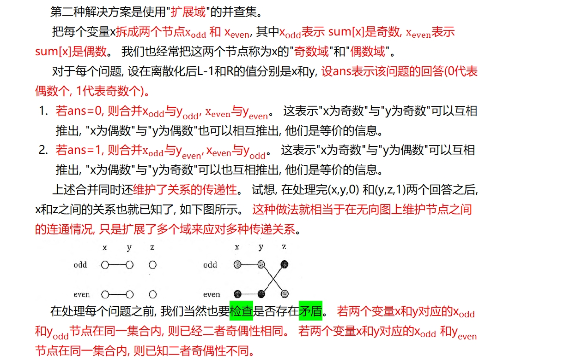
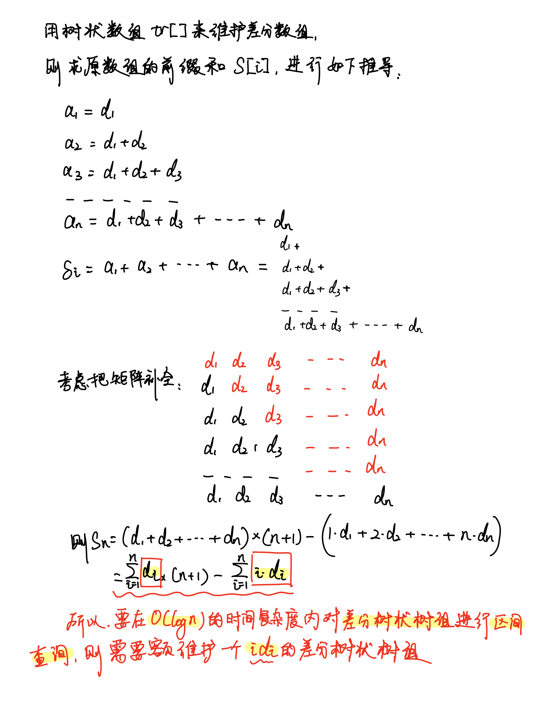

## AcWing 1250. 格子游戏

https://www.acwing.com/problem/content/1252/

Alice和Bob玩了一个古老的游戏：首先画一个 *n*×*n* 的点阵（下图 *n*=3 ）。

接着，他们两个轮流在相邻的点之间画上红边和蓝边：

 

直到围成一个封闭的圈（面积不必为 1）为止，“封圈”的那个人就是赢家。因为棋盘实在是太大了，他们的游戏实在是太长了！

他们甚至在游戏中都不知道谁赢得了游戏。

于是请你写一个程序，帮助他们计算他们是否结束了游戏？

#### 输入格式

输入数据第一行为两个整数 *n* 和 *m*。*n*表示点阵的大小，*m* 表示一共画了 *m* 条线。

以后 *m* 行，每行首先有两个数字 (*x*,*y*)，代表了画线的起点坐标，接着用空格隔开一个字符，假如字符是 *D*，则是向下连一条边，如果是 *R* 就是向右连一条边。

输入数据不会有重复的边且保证正确。

#### 输出格式

输出一行：在第几步的时候结束。

假如 *m* 步之后也没有结束，则输出一行“draw”。

#### 数据范围

1≤*n*≤200
1≤*m*≤24000

#### 输入样例：

```
3 5
1 1 D
1 1 R
1 2 D
2 1 R
2 2 D
```

#### 输出样例：

```
4
```

```c++
#include <bits/stdc++.h>

using namespace std;
const int N = 40010;
int n, m, p[N];

int get(int a, int b) {
    return a * n + b;
}

int find(int x) {
    if (p[x] != x) p[x] = find(p[x]);
    return p[x];
}

int main() {
    cin >> n >> m;
    for (int i = 0; i <= n * n; ++i) p[i] = i;
    int res = 0;
    for (int i = 1; i <= m; ++i) {
        int x, y;
        char d;
        cin >> x >> y >> d;
        x--;
        y--;
        int a = get(x, y);
        int b;
        if (d == 'D') b = get(x + 1, y);
        else b = get(x, y + 1);
        int pa = find(a), pb = find(b);
        if (pa == pb) {
            res = i;
            break;
        } else {
            p[pa] = pb;
        }
    }
    if (res == 0)cout << "draw" << endl;
    else cout << res << endl;
    return 0;
}
```

实现小细节

注意到这个地图是二维的，而存点时下表是一维的

所以存点时，我们让点 `f[i][j]` 对应下标 `n * i + j`，注意`i`和`j`要从 0 开始


## AcWing 1252. 搭配购买

https://www.acwing.com/problem/content/1254/

Joe觉得云朵很美，决定去山上的商店买一些云朵。

商店里有 *n* 朵云，云朵被编号为 1,2,…,*n*，并且每朵云都有一个价值。

但是商店老板跟他说，一些云朵要搭配来买才好，所以买一朵云则与这朵云有搭配的云都要买。

但是Joe的钱有限，所以他希望买的价值越多越好。

#### 输入格式

第 1 行包含三个整数 *n*，*m*，*w*，表示有 *n* 朵云，*m* 个搭配，Joe有 *w* 的钱。

第 2∼*n*+1

行，每行两个整数 *ci*，*di* 表示 *i* 朵云的价钱和价值。

第 *n*+2∼*n*+1+*m* 行，每行两个整数 *ui*，*vi*，表示买 *ui* 就必须买 *vi*，同理，如果买 *vi* 就必须买 *ui*。

#### 输出格式

一行，表示可以获得的最大价值。

#### 数据范围

1≤*n*≤10000,
0≤*m*≤5000,
1≤*w*≤10000,
1≤*ci*≤5000,
1≤*di*≤100,
1≤*ui*,*vi*≤*n*

#### 输入样例：

```
5 3 10
3 10
3 10
3 10
5 100
10 1
1 3
3 2
4 2
```

#### 输出样例：

```
1
```

```c++
#include <bits/stdc++.h>

using namespace std;
const int N = 10010;
int n, m, vol, p[N], f[N], v[N], w[N];

int find(int x) {
    if (p[x] != x) p[x] = find(p[x]);
    return p[x];
}

int main() {
    cin >> n >> m >> vol;
    for (int i = 0; i <= n; ++i) p[i] = i;
    for (int i = 1; i <= n; ++i) cin >> v[i] >> w[i];
    while (m--) {
        int a, b;
        cin >> a >> b;
        int pa = find(a), pb = find(b);
        if (pa != pb) {
            v[pb] += v[pa];
            w[pb] += w[pa];
            p[pa] = pb;
        }
    }

    for (int i = 1; i <= n; ++i) {
        if (p[i] == i) {
            for (int j = vol; j >= v[i]; --j) {
                f[j] = max(f[j], f[j - v[i]] + w[i]);
            }
        }
    }
    cout << f[vol] << endl;
    return 0;
}
```

注意一定要判断`pa!=pb`再更新数组，因为我们这里维护了两个额外的数组`v`和`w`，第二次更新同一个值，`p`数组的大小不会变，但是`v`和`w`会翻倍


## AcWing 237. 程序自动分析

https://www.acwing.com/activity/content/problem/content/1581/

在实现程序自动分析的过程中，常常需要判定一些约束条件是否能被同时满足。

考虑一个约束满足问题的简化版本：假设 *x*1,*x*2,*x*3,… 代表程序中出现的变量，给定 *n* 个形如 *xi*=*xj* 或 *xi*≠*xj* 的变量相等/不等的约束条件，请判定是否可以分别为每一个变量赋予恰当的值，使得上述所有约束条件同时被满足。

例如，一个问题中的约束条件为：*x*1=*x*2，*x*2=*x*3，*x*3=*x*4，*x*1≠*x*4，这些约束条件显然是不可能同时被满足的，因此这个问题应判定为不可被满足。

现在给出一些约束满足问题，请分别对它们进行判定。

#### 输入格式

输入文件的第 1 行包含 1 个正整数 *t*，表示需要判定的问题个数，注意这些问题之间是相互独立的。

对于每个问题，包含若干行：

第 1 行包含 1 个正整数 *n*，表示该问题中需要被满足的约束条件个数。

接下来 *n* 行，每行包括 3 个整数 *i*,*j*,*e*，描述 1 个相等/不等的约束条件，相邻整数之间用单个空格隔开。若 *e*=1，则该约束条件为 *xi*=*xj*；若 *e*=0，则该约束条件为 *xi*≠*xj*。

#### 输出格式

输出文件包括 *t* 行。

输出文件的第 *k* 行输出一个字符串 `YES` 或者 `NO`，`YES` 表示输入中的第 *k* 个问题判定为可以被满足，`NO` 表示不可被满足。

#### 数据范围

1≤*n*≤10^5^

1≤*i*,*j*≤10^9^

#### 输入样例：

```
2
2
1 2 1
1 2 0
2
1 2 1
2 1 1
```

#### 输出样例：

```
NO
YES
```

保序离散化

```c++
#include<bits/stdc++.h>

using namespace std;
const int N = 2e6 + 10;
int n, t, p[N];
vector<int> v;

struct node {
    int i, j, e;

    bool operator<(const node &W) const {
        return e > W.e;
    }
} s[N];

int find(int x) {
    if (p[x] != x) p[x] = find(p[x]);
    return p[x];
}

int get(int x) {
    int l = 0, r = v.size() - 1;
    while (l < r) {
        int mid = l + r + 1 >> 1;
        if (v[mid] <= x) l = mid;
        else r = mid - 1;
    }
    return l + 1;
}

void solve() {
    cin >> n;
    v.erase(v.begin(), v.end());
    memset(s, 0, n * sizeof(node));
    for (int i = 1; i < 200010; ++i) p[i] = i;
    for (int i = 0; i < n; ++i) {
        scanf("%d%d%d", &s[i].i, &s[i].j, &s[i].e);
        v.push_back(s[i].i);
        v.push_back(s[i].j);
    }
    sort(s, s + n);
    sort(v.begin(), v.end());
    v.erase(unique(v.begin(), v.end()), v.end());
    for (int i = 0; i < n; ++i) {
        int a = get(s[i].i);
        int b = get(s[i].j);
        int pa = find(a);
        int pb = find(b);
        if (s[i].e) {
            p[pa] = pb;
        } else {
            if (pa == pb) {
                puts("NO");
                return;
            }
        }
    }
    puts("YES");
    return;
}

int main() {
    cin >> t;
    while (t--) {
        solve();
    }
    return 0;
}
```

不保序的离散化

```c++
#include<bits/stdc++.h>

using namespace std;
const int N = 200010;
int n, m;
int p[N];
unordered_map<int, int> S;

struct Query {
    int x, y, e;
} query[N];

int get(int x) {
    if (S.count(x) == 0) S[x] = ++n;
    return S[x];
}

int find(int x) {
    if (p[x] != x) p[x] = find(p[x]);
    return p[x];
}

int main() {
    int T;
    scanf("%d", &T);
    while (T--) {
        n = 0;
        S.clear();
        scanf("%d", &m);
        for (int i = 0; i < m; i++) {
            int x, y, e;
            scanf("%d%d%d", &x, &y, &e);
            query[i] = {get(x), get(y), e};
        }

        for (int i = 1; i <= n; i++) p[i] = i;

        // 合并所有相等约束条件
        for (int i = 0; i < m; i++)
            if (query[i].e == 1) {
                int pa = find(query[i].x), pb = find(query[i].y);
                p[pa] = pb;
            }

        // 检查所有不等条件
        bool has_conflict = false;
        for (int i = 0; i < m; i++)
            if (query[i].e == 0) {
                int pa = find(query[i].x), pb = find(query[i].y);
                if (pa == pb) {
                    has_conflict = true;
                    break;
                }
            }

        if (has_conflict) puts("NO");
        else puts("YES");
    }
    return 0;
}
```


## AcWing 239. 奇偶游戏

https://www.acwing.com/activity/content/problem/content/1582/

小 *A* 和小 *B* 在玩一个游戏。

首先，小 *A* 写了一个由 0 和 1 组成的序列 *S*，长度为 *N*。

然后，小 *B* 向小 *A* 提出了 *M* 个问题。

在每个问题中，小 *B* 指定两个数 *l* 和 *r*，小 *A* 回答 *S*[*l*∼*r*] 中有奇数个 1 还是偶数个 1。

机智的小 *B* 发现小 *A* 有可能在撒谎。

例如，小 *A* 曾经回答过 *S*[1∼3] 中有奇数个 1，*S*[4∼6] 中有偶数个 1，现在又回答 *S*[1∼6] 中有偶数个 1，显然这是自相矛盾的。

请你帮助小 *B* 检查这 *M* 个答案，并指出在至少多少个回答之后可以确定小 *A* 一定在撒谎。

即求出一个最小的 *k*，使得 01 序列 *S* 满足第 1∼*k* 个回答，但不满足第 1∼*k*+1 个回答。

#### 输入格式

第一行包含一个整数 *N*，表示 01 序列长度。

第二行包含一个整数 *M*，表示问题数量。

接下来 *M* 行，每行包含一组问答：两个整数 *l* 和 *r*，以及回答 `even` 或 `odd`，用以描述 *S*[*l*∼*r*] 中有偶数个 1 还是奇数个 1。

#### 输出格式

输出一个整数 *k*，表示 01 序列满足第 1∼*k* 个回答，但不满足第 1∼*k*+1 个回答，如果 01 序列满足所有回答，则输出问题总数量。

#### 数据范围

*N*≤10^9^,*M*≤5000

#### 输入样例：

```
10
5
1 2 even
3 4 odd
5 6 even
1 6 even
7 10 odd
```

#### 输出样例：

```
3
```

**扩展域并查集**

```c++
#include <bits/stdc++.h>

using namespace std;
const int N = 40010, Base = N / 2;

int n, m;
int p[N];
unordered_map<int, int> S;

int get(int x) {
    if (S.count(x) == 0) S[x] = ++n;
    return S[x];
}

int find(int x) {
    if (p[x] != x) p[x] = find(p[x]);
    return p[x];
}

int main() {
    cin >> n >> m;
    n = 0;

    for (int i = 0; i < N; i++) p[i] = i;

    int res = m;
    for (int i = 1; i <= m; i++) {
        int a, b;
        string type;
        cin >> a >> b >> type;
        a = get(a - 1), b = get(b);

        if (type == "even") {
            if (find(a + Base) == find(b)) {
                res = i - 1;
                break;
            }
            p[find(a)] = find(b);
            p[find(a + Base)] = find(b + Base);
        } else {
            if (find(a) == find(b)) {
                res = i - 1;
                break;
            }
            p[find(a + Base)] = find(b);
            p[find(a)] = find(b + Base);
        }
    }
    cout << res << endl;
    return 0;
}
```



**扩展域并查集的本质是合并条件，而朴素并查集的本质是合并元素，注意区别！**


## AcWing 238. 银河英雄传说

https://www.acwing.com/problem/content/240/

有一个划分为 *N* 列的星际战场，各列依次编号为 1,2,…,*N*。

有 *N* 艘战舰，也依次编号为 1,2,…,*N*，其中第 *i* 号战舰处于第 *i* 列。

有 *T* 条指令，每条指令格式为以下两种之一：

1. `M i j`，表示让第 *i* 号战舰所在列的全部战舰保持原有顺序，接在第 *j* 号战舰所在列的尾部。
2. `C i j`，表示询问第 *i* 号战舰与第 *j* 号战舰当前是否处于同一列中，如果在同一列中，它们之间间隔了多少艘战舰。

现在需要你编写一个程序，处理一系列的指令。

#### 输入格式

第一行包含整数 *T*，表示共有 *T* 条指令。

接下来 *T* 行，每行一个指令，指令有两种形式：`M i j` 或 `C i j`。

其中 *M* 和 *C* 为大写字母表示指令类型，*i* 和 *j* 为整数，表示指令涉及的战舰编号。

#### 输出格式

你的程序应当依次对输入的每一条指令进行分析和处理： 

如果是 `M i j` 形式，则表示舰队排列发生了变化，你的程序要注意到这一点，但是不要输出任何信息； 

如果是 `C i j` 形式，你的程序要输出一行，仅包含一个整数，表示在同一列上，第 *i* 号战舰与第 *j* 号战舰之间布置的战舰数目，如果第 *i* 号战舰与第 *j* 号战舰当前不在同一列上，则输出 −1。

#### 数据范围

*N*≤30000,*T*≤500000

#### 输入样例：

```
4
M 2 3
C 1 2
M 2 4
C 4 2
```

#### 输出样例：

```
-1
1
```

```c++
#include <bits/stdc++.h>

using namespace std;
const int N = 30010;
int n, t, p[N], d[N], sz[N];

int find(int x) {
    if (p[x] != x) {
        int rt = find(p[x]);
        d[x] += d[p[x]];
        p[x] = rt;
    }
    return p[x];
}

int main() {
    n = 30000;
    for (int i = 1; i <= n; ++i) p[i] = i, sz[i] = 1;
    cin >> t;
    while (t--) {
        char op[2];
        int a, b;
        scanf("%s%d%d", op, &a, &b);
        int ra = find(a), rb = find(b);
        if (op[0] == 'M') {
            if (ra != rb) {
                d[ra] += sz[rb];
                sz[rb] += sz[ra];
                p[ra] = rb;
            }
        } else {
            if (ra != rb) puts("-1");
            else printf("%d\n", max(0, abs(d[a] - d[b]) - 1));
        }
    }
    return 0;
}
```


## AcWing 241. 楼兰图腾

在完成了分配任务之后，西部 314 来到了楼兰古城的西部。

相传很久以前这片土地上(比楼兰古城还早)生活着两个部落，一个部落崇拜尖刀(`V`)，一个部落崇拜铁锹(`∧`)，他们分别用 `V` 和 `∧` 的形状来代表各自部落的图腾。

西部 314 在楼兰古城的下面发现了一幅巨大的壁画，壁画上被标记出了 *n* 个点，经测量发现这 *n* 个点的水平位置和竖直位置是两两不同的。

西部 314 认为这幅壁画所包含的信息与这 *n* 个点的相对位置有关，因此不妨设坐标分别为 (1,*y*1),(2,*y*2),…,(*n*,*yn*)，其中 *y*1∼*yn* 是 1 到 *n* 的一个排列。

西部 314 打算研究这幅壁画中包含着多少个图腾。

如果三个点 (*i*,*yi*),(*j*,*yj*),(*k*,*yk*) 满足 1≤*i*<*j*<*k*≤*n* 且 *yi*>*yj*,*yj*<*yk*，则称这三个点构成 `V` 图腾;

如果三个点 (*i*,*yi*),(*j*,*yj*),(*k*,*yk*) 满足 1≤*i*<*j*<*k*≤*n* 且 *yi*<*yj*,*yj*>*yk*，则称这三个点构成 `∧` 图腾;

西部 314 想知道，这 *n* 个点中两个部落图腾的数目。

因此，你需要编写一个程序来求出 `V` 的个数和 `∧` 的个数。

#### 输入格式

第一行一个数 *n*。

第二行是 *n* 个数，分别代表 *y*1，*y*2,…,*yn*。

#### 输出格式

两个数，中间用空格隔开，依次为 `V` 的个数和 `∧` 的个数。

#### 数据范围

对于所有数据，*n*≤200000，且输出答案不会超过 *int*64。
*y*1∼*yn* 是 1 到 *n* 的一个排列。

#### 输入样例：

```
5
1 5 3 2 4
```

#### 输出样例：

```
3 4
```

```c++
#include <bits/stdc++.h>

using namespace std;
using LL = long long int;
const int N = 2e5 + 10;
int n, tr[N], down[N], up[N], x[N];

int lowbit(int x) {
    return x & -x;
}

void add(int x) {
    for (int i = x; i < N; i += lowbit(i)) {
        tr[i]++;
    }
}

int query(int x) {
    int res = 0;
    for (int i = x; i; i -= lowbit(i)) {
        res += tr[i];
    }
    return res;
}

int main() {
    cin >> n;
    LL res1 = 0, res2 = 0;
    for (int i = 1; i <= n; ++i) {
        scanf("%d", &x[i]);
        down[i] = query(x[i]);
        up[i] = i - down[i] - 1;
        add(x[i]);
    }
    memset(tr, 0, sizeof tr);
    for (int i = n; i; i--) {
        res1 += (LL) up[i] * (query(N - 3) - query(x[i]));
        res2 += (LL) down[i] * query(x[i]);
        add(x[i]);
    }
    cout << res1 << " " << res2 << endl;
    return 0;
}
```

- 从左向右依次遍历每个数a[i]，使用树状数组统计在i位置之前所有比a[i]大的数的个数、以及比a[i]小的数的个数。统计完成后，将a[i]加入到树状数组。
- 从右向左依次遍历每个数a[i]，使用树状数组统计在i位置之后所有比a[i]大的数的个数、以及比a[i]小的数的个数。统计完成后，将a[i]加入到树状数组。


## AcWing 242. 一个简单的整数问题

https://www.acwing.com/problem/content/248/

给定长度为 *N* 的数列 *A*，然后输入 *M* 行操作指令。

第一类指令形如 `C l r d`，表示把数列中第 *l*∼*r* 个数都加 *d*。

第二类指令形如 `Q x`，表示询问数列中第 *x* 个数的值。

对于每个询问，输出一个整数表示答案。

#### 输入格式

第一行包含两个整数 *N* 和 *M*。

第二行包含 *N* 个整数 *A*[*i*]。

接下来 *M* 行表示 *M* 条指令，每条指令的格式如题目描述所示。

#### 输出格式

对于每个询问，输出一个整数表示答案。

每个答案占一行。

#### 数据范围

1≤*N*,*M*≤10^5^,
|*d*|≤10000,
|*A*[*i*]|≤10^9^

#### 输入样例：

```
10 5
1 2 3 4 5 6 7 8 9 10
Q 4
Q 1
Q 2
C 1 6 3
Q 2
```

#### 输出样例：

```
4
1
2
5
```


## AcWing 243. 一个简单的整数问题2

https://www.acwing.com/problem/content/244/

给定一个长度为 *N* 的数列 *A*，以及 *M* 条指令，每条指令可能是以下两种之一：

1. `C l r d`，表示把 *A*[*l*],*A*[*l*+1],…,*A*[*r*] 都加上 *d*。
2. `Q l r`，表示询问数列中第 *l*∼*r* 个数的和。

对于每个询问，输出一个整数表示答案。

#### 输入格式

第一行两个整数 *N*,*M*。

第二行 *N* 个整数 *A*[*i*]。

接下来 *M* 行表示 *M* 条指令，每条指令的格式如题目描述所示。

#### 输出格式

对于每个询问，输出一个整数表示答案。

每个答案占一行。

#### 数据范围

1≤*N*,*M*≤10^5^,
|*d*|≤10000,
|*A*[*i*]|≤10^9^

#### 输入样例：

```
10 5
1 2 3 4 5 6 7 8 9 10
Q 4 4
Q 1 10
Q 2 4
C 3 6 3
Q 2 4
```

#### 输出样例：

```
4
55
9
15
```

```c++
#include <bits/stdc++.h>

using namespace std;
using LL = long long int;
const int N = 1e5 + 10;

int n, m, a[N];
LL tr1[N];  // 维护b[i]的前缀和
LL tr2[N];  // 维护b[i] * i的前缀和

int lowbit(int x) {
    return x & -x;
}

void add(LL tr[], int x, LL d) {
    for (int i = x; i < N; i += lowbit(i)) tr[i] += d;
}

LL query(LL tr[], int x) {
    LL res = 0;
    for (int i = x; i; i -= lowbit(i)) res += tr[i];
    return res;
}

LL sumall(int x) {
    return query(tr1, x) * (x + 1) - query(tr2, x);
}

int main() {
    cin >> n >> m;
    for (int i = 1; i <= n; i++) scanf("%d", &a[i]);
    for (int i = 1; i <= n; ++i) {
        add(tr1, i, a[i] - a[i - 1]);
        add(tr2, i, (LL) (a[i] - a[i - 1]) * i);
    }
    while (m--) {
        string op;
        int l, r;
        cin >> op >> l >> r;
        if (op == "Q") {
            cout << sumall(r) - sumall(l - 1) << endl;
        } else {
            LL d;
            cin >> d;
            add(tr1, l, d);
            add(tr1, r + 1, -d);
            add(tr2, l, l * d);
            add(tr2, r + 1, -(r + 1) * d);
        }
    }
    return 0;
}
```



```c++
LL tr1[N];  // 维护b[i]的前缀和
LL tr2[N];  // 维护b[i] * i的前缀和
```

**重点在于维护两个树状数组**


## AcWing 244. 谜一样的牛

https://www.acwing.com/problem/content/245/

有 *n* 头奶牛，已知它们的身高为 1∼*n* 且各不相同，但不知道每头奶牛的具体身高。

现在这 *n* 头奶牛站成一列，已知第 *i* 头牛前面有 *Ai* 头牛比它低，求每头奶牛的身高。

#### 输入格式

第 1 行：输入整数 *n*。

第 2..*n* 行：每行输入一个整数 *Ai*，第 *i* 行表示第 *i* 头牛前面有 *Ai* 头牛比它低。 （注意：因为第 1 头牛前面没有牛，所以并没有将它列出）

#### 输出格式

输出包含 *n* 行，每行输出一个整数表示牛的身高。

第 *i* 行输出第 *i* 头牛的身高。

#### 数据范围

1≤*n*≤10^5^

#### 输入样例：

```
5
1
2
1
0
```

#### 输出样例：

```
2
4
5
3
1
```

```c++
#include <bits/stdc++.h>

using namespace std;
const int N = 1e5 + 10;
int n, a[N], tr[N], ans[N];

int lowbit(int x) {
    return x & -x;
}

void add(int x, int d) {
    for (int i = x; i <= n; i += lowbit(i)) tr[i] += d;
}

int query(int x) {
    int res = 0;
    for (int i = x; i; i -= lowbit(i)) res += tr[i];
    return res;
}

int main() {
    cin >> n;
    for (int i = 2; i <= n; i++) {
        scanf("%d", &a[i]);
    }
    for (int i = 1; i <= n; ++i) add(i, 1);
    for (int i = n; i; --i) {
        int l = 1, r = n;
        int k = a[i] + 1;
        while (l < r) {
            int mid = l + r >> 1;
            if (query(mid) >= k) r = mid;
            else l = mid + 1;
        }
        ans[i] = r;
        add(r, -1);
    }
    for (int i = 1; i <= n; ++i) cout << ans[i] << endl;
    return 0;
}
```

**前缀和不可以更新**

**树状数组维护的前缀和可以更新**