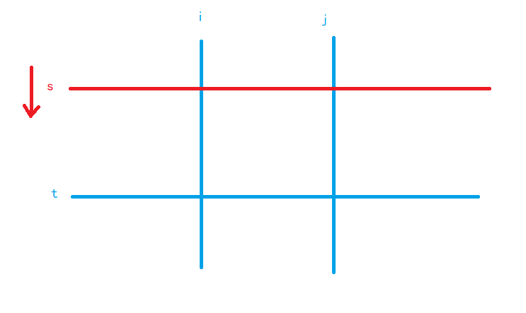

# A

## AcWing 4644. 求和

https://www.acwing.com/problem/content/4647/

给定 *n* 个整数 *a*1,*a*2,⋅⋅⋅,*an* ，求它们两两相乘再相加的和，即

*S*=*a*1⋅*a*2+*a*1⋅*a*3+⋅⋅⋅+*a*1⋅*an*+*a*2⋅*a*3+⋅⋅⋅+*an*−2⋅*an*−1+*an*−2⋅*an*+*an*−1⋅*an*

#### 输入格式

输入的第一行包含一个整数 *n*

第二行包含 *n* 个整数 *a*1,*a*2,⋅⋅⋅,*an*

#### 输出格式

输出一个整数 *S*，表示所求的和。

请使用合适的数据类型进行运算。

#### 数据范围

对于 30%的数据，1≤*n*≤1000，1≤*ai*≤100。
对于所有评测用例，1≤*n*≤200000，1≤*ai*≤1000

#### 输入样例：

```
4
1 3 6 9
```

#### 输出样例：

```
117
```

```c++
#include <bits/stdc++.h>

using namespace std;
typedef long long int LL;

int main() {
    int n;
    cin >> n;
    LL s1 = 0, s2 = 0;
    while (n--) {
        int x;
        scanf("%d", &x);
        s1 += x;
        s2 += x * x;
    }
    printf("%lld", (s1 * s1 - s2) / 2);
    return 0;
}
```


## AcWing 4645. 选数异或

https://www.acwing.com/problem/content/4648/

给定一个长度为 *n* 的数列 *A*1,*A*2,⋅⋅⋅,*An* 和一个非负整数 *x*，给定 *m* 次查询，每次询问能否从某个区间 [*l*,*r*] 中选择**两个下标不同的数**使得他们的异或等于 *x*

#### 输入格式

输入的第一行包含三个整数 *n*,*m*,*x*

第二行包含 *n* 个整数 *A*1,*A*2,⋅⋅⋅,*An* 接下来 *m* 行，每行包含两个整数 *li*,*ri* 表示询问区间 [*li*,*ri*]

#### 输出格式

对于每个询问，如果该区间内存在两个数的异或为 *x*

则输出 `yes`，否则输出 `no`。

#### 数据范围

对于 20% 的评测用例，1≤*n*,*m*≤100；
对于 40% 的评测用例，1≤*n*,*m*≤1000；
对于所有评测用例，1≤*n*,*m*≤100000，0≤*x*<220，1≤*li*≤*ri*≤*n*，0≤*Ai*<220

#### 输入样例：

```
4 4 1
1 2 3 4
1 4
1 2
2 3
3 3
```

#### 输出样例：

```
yes
no
yes
no
```

#### 样例解释

显然整个数列中只有 2,3 的异或为 1。

```c++
#include <bits/stdc++.h>

using namespace std;
const int N = 1e5 + 10, M = (1 << 20) + 10;
int n, m, x;
int last[M], g[N];

int main() {
    cin >> n >> m >> x;
    for (int i = 1; i <= n; ++i) {
        int a;
        scanf("%d", &a);
        g[i] = max(g[i - 1], last[a ^ x]);
        last[a] = i;
    }
    while (m--) {
        int l, r;
        scanf("%d%d", &l, &r);
        if (g[r] >= l) puts("yes");
        else puts("no");
    }
    return 0;
}
```


# B

## AcWing 4402. 刷题统计

https://www.acwing.com/problem/content/4405/

小明决定从下周一开始努力刷题准备蓝桥杯竞赛。

他计划周一至周五每天做 *a* 道题目，周六和周日每天做 *b* 道题目。

请你帮小明计算，按照计划他将在第几天实现做题数大于等于 *n* 题？

#### 输入格式

输入一行包含三个整数 *a*,*b* 和 *n*

#### 输出格式

输出一个整数代表天数。

#### 数据范围

对于 50% 的评测用例，1≤*a*,*b*,*n*≤10^6^，
对于 100% 的评测用例，1≤*a*,*b*,*n*≤10^18^

#### 输入样例：

```
10 20 99
```

#### 输出样例：

```
8
```

```c++
#include <bits/stdc++.h>

using namespace std;
typedef long long int LL;

int main() {
    LL a, b, n;
    cin >> a >> b >> n;
    LL sum = 0, day = 0;
    LL tot = 5 * a + 2 * b;
    if (tot < n) {
        day += n / tot * 7;
        sum += tot * (n / tot);
    }

    while (sum < n) {
        for (int i = 0; i < 5; ++i) {
            if (sum >= n) break;
            sum += a;
            day++;
        }
        for (int i = 0; i < 2; ++i) {
            if (sum >= n) break;
            sum += b;
            day++;
        }
    }
    cout << day << endl;
    return 0;
}
```

```c++
#include <iostream>
#include <cstring>
#include <algorithm>

using namespace std;

typedef long long LL;

int main() {
    LL a, b, n;

    cin >> a >> b >> n;

    LL s = 5 * a + 2 * b;
    LL res = n / s * 7;
    n %= s;

    LL d[] = {a, a, a, a, a, b, b};
    for (int i = 0; n > 0; i++) {
        n -= d[i];
        res++;
    }

    cout << res << endl;
    return 0;
}
```


## AcWing 4403. 修剪灌木

https://www.acwing.com/problem/content/4406/

爱丽丝要完成一项修剪灌木的工作。

有 *N* 棵灌木整齐的从左到右排成一排。

爱丽丝在每天傍晚会修剪一棵灌木，让灌木的高度变为 0 厘米。

爱丽丝修剪灌木的顺序是从最左侧的灌木开始，每天向右修剪一棵灌木。

当修剪了最右侧的灌木后，她会调转方向，下一天开始向左修剪灌木。

直到修剪了最左的灌木后再次调转方向。

然后如此循环往复。

灌木每天从早上到傍晚会长高 1厘米，而其余时间不会长高。

在第一天的早晨，所有灌木的高度都是 0 厘米。爱丽丝想知道每棵灌木最高长到多高。

#### 输入格式

一个正整数 *N* ，含义如题面所述。

#### 输出格式

输出 *N* 行，每行一个整数，第行表示从左到右第 *i* 棵树最高能长到多高。

#### 数据范围

对于 30% 的数据，*N*≤10，
对于 100% 的数据，1<*N*≤10000

#### 输入样例：

```
3
```

#### 输出样例：

```爱丽丝要完成一项修剪灌木的工作。
4
2
4
```

```c++
#include <bits/stdc++.h>

using namespace std;
const int N = 10010;
int n, a[N];

int main() {
    cin >> n;
    for (int i = 1; i <= n; ++i) {
        a[i] = max((i - 1) * 2, (n - i) * 2);
    }
    for (int i = 1; i <= n; ++i) printf("%d\n", a[i]);
    return 0;
}
```

```c++
#include <iostream>
#include <algorithm>

using namespace std;

int main() {
    int n;
    cin >> n;

    for (int i = 1; i <= n; i++)
        cout << max(i - 1, n - i) * 2 << endl;

    return 0;
}
```


## AcWing 4404. X 进制减法

https://www.acwing.com/problem/content/4407/

进制规定了数字在数位上逢几进一。

*X* 进制是一种很神奇的进制，因为其每一数位的进制并不固定！

例如说某种 *X* 进制数，最低数位为二进制，第二数位为十进制，第三数位为八进制，则 *X* 进制数 321 转换为十进制数为 65。

现在有两个 *X* 进制表示的整数 *A* 和 *B*，但是其具体每一数位的进制还不确定，只知道 *A* 和 *B* 是同一进制规则，且每一数位最高为 *N* 进制，最低为二进制。

请你算出 *A*−*B* 的结果最小可能是多少。

请注意，你需要保证 *A* 和 *B* 在 *X* 进制下都是合法的，即每一数位上的数字要小于其进制。

#### 输入格式

第一行一个正整数 *N*，含义如题面所述。

第二行一个正整数 *Ma*，表示 *X* 进制数 *A* 的位数。

第三行 *Ma* 个用空格分开的整数，表示 *X* 进制数 *A* 按从高位到低位顺序各个数位上的数字在十进制下的表示。

第四行一个正整数 *Mb*，表示 *X* 进制数 *B* 的位数。

第五行 *Mb* 个用空格分开的整数，表示 *X* 进制数 *B* 按从高位到低位顺序各个数位上的数字在十进制下的表示。

请注意，输入中的所有数字都是十进制的。

#### 输出格式

输出一行一个整数，表示 *X* 进制数 *A*−*B* 的结果的最小可能值转换为十进制后再模 1000000007 的结果。

#### 数据范围

对于 30% 的数据，*N*≤10;*Ma*,*Mb*≤8， 对于 100% 的数据，2≤*N*≤1000;1≤*Ma*,*Mb*≤100000;*A*≥*B*

#### 输入样例：

```
11
3
10 4 0
3
1 2 0
```

#### 输出样例：

```
94
```

#### 样例解释

当进制为：最低位 2 进制，第二数位 5 进制，第三数位 11 进制时，减法得到的差最小。

此时 *A* 在十进制下是 108，*B* 在十进制下是 14，差值是 94。

```c++
#include <bits/stdc++.h>

using namespace std;
typedef long long int LL;
const int N = 1e5 + 10, mod = 1000000007;
int n, a[N], b[N], l1, l2;
LL d[N];

int main() {
    cin >> n;
    cin >> l1;
    for (int i = 0; i < l1; ++i) scanf("%d", &a[i]);
    cin >> l2;
    for (int i = l1 - l2; i < l1; ++i) scanf("%d", &b[i]);
    for (int i = 1; i < l1; ++i) d[i] = max(2, max(a[i], b[i]) + 1);
    d[l1] = 1;
    for (int i = l1 - 1; i > 0; --i) d[i] = (d[i] * d[i + 1]) % mod;
    LL ans = 0;
    int i = 0;
    for (int i = 0; i < l1; ++i) {
        ans = ((a[i] - b[i]) * d[i + 1] + ans + mod) % mod;
    }
    cout << ans;
    return 0;
}
```

**所有的 P 进制 都取到可能值中最小的那个**

```c++
#include <iostream>
#include <algorithm>

using namespace std;

typedef long long LL;

const int N = 100010, MOD = 1000000007;

int n, m1, m2, m;
int a[N], b[N];

int main() {
    scanf("%d", &n);
    scanf("%d", &m1);
    for (int i = m1 - 1; i >= 0; i--) scanf("%d", &a[i]);
    scanf("%d", &m2);
    for (int i = m2 - 1; i >= 0; i--) scanf("%d", &b[i]);

    int m = max(m1, m2);

    int res = 0;
    for (int i = m - 1; i >= 0; i--)
        res = (res * (LL) max({2, a[i] + 1, b[i] + 1}) + a[i] - b[i]) % MOD;

    printf("%d\n", res);
    return 0;
}
```


## AcWing 4404. X 进制减法

https://www.acwing.com/problem/content/4408/

给定一个 *N*×*M* 的矩阵 *A*，请你统计有多少个子矩阵 (最小 1×1，最大 *N*×*M*) 满足子矩阵中所有数的和不超过给定的整数 *K*?

#### 输入格式

第一行包含三个整数 *N*,*M* 和 *K*。之后 *N* 行每行包含 *M* 个整数，代表矩阵 *A*。

#### 输出格式

一个整数代表答案。

#### 数据范围

对于 30% 的数据，*N*,*M*≤20

对于 70% 的数据，*N*,*M*≤100

对于 100% 的数据，1≤*N*,*M*≤500;0≤`A[i][j]`≤1000;1≤*K*≤2.5×108。

#### 输入样例：

```
3 4 10
1 2 3 4
5 6 7 8
9 10 11 12
```

#### 输出样例：

```
19
```

#### 样例解释

满足条件的子矩阵一共有 19，包含：

- 大小为 1×1 的有 10 个。
- 大小为 1×2 的有 3 个。
- 大小为 1×3 的有 2 个。
- 大小为 1×4 的有 1 个。
- 大小为 2×1 的有 3 个。

```c++
#include <bits/stdc++.h>

using namespace std;
typedef long long int LL;
const int N = 510;
int n, k, m;
int a[N][N];

int main() {
    cin >> n >> m >> k;
    for (int i = 1; i <= n; i++) {
        for (int j = 1; j <= m; j++) {
            scanf("%d", &a[i][j]);
            a[i][j] += a[i - 1][j] + a[i][j - 1] - a[i - 1][j - 1];
        }
    }

    LL ans = 0;
    for (int i = 1; i <= m; ++i)
        for (int j = i; j <= m; ++j) {
            for (int s = 1, t = 1; t <= n; ++t) {
                while (s <= t && a[t][j] - a[s - 1][j] - a[t][i - 1] + a[s - 1][i - 1] > k) s++;
                if (s <= t) ans += t - s + 1;
            }
        }
    cout << ans;
    return 0;
}
```

优化的方法是：
枚举子矩阵的左边界`i` 和右边界`j`
用 快指针`t`枚举 `子矩阵的下边界`，慢指针`s`维护 `子矩阵的上边界` (s ≤ t)
如果得到的子矩阵的权值和 大于 k，则慢指针`s`前进，而子矩阵和必将单调不增
慢指针`s`继续前进（如图），直到 子矩阵的和 不大于`k`，慢指针没必要前进了，因为该子矩阵的所有宽度为 `j - i + 1` 的子矩阵（总共 `t - s + 1` 种）一定满足要求，更新该情况对答案的贡献 `t - s + 1`；反之，如果慢指针`s`越界（s > t），则不操作，直接进入下层循环




# C

## AcWing 4652. 纸张尺寸

https://www.acwing.com/problem/content/4655/

在 ISO 国际标准中定义了 A0 纸张的大小为 1189mm×841mm，将 A0 纸沿长边对折后为 A1 纸，大小为 841mm×594mm，在对折的过程中长度直接取下整（实际裁剪时可能有损耗）。

将 A1 纸沿长边对折后为 A2 纸，依此类推。

输入纸张的名称，请输出纸张的大小。

#### 输入格式

输入一行包含一个字符串表示纸张的名称，该名称一定是 A0、A1、A2、A3、A4、A5、A6、A7、A8、A9 之一。

#### 输出格式

输出两行，每行包含一个整数，依次表示长边和短边的长度。

#### 输入样例1：

```
A0
```

#### 输出样例1：

```
1189
841
```

#### 输入样例2：

```
A1
```

#### 输出样例2：

```
841
594
```

**自己写的**

把数据预先处理好，存入数组

```c++
#include<bits/stdc++.h>

using namespace std;
typedef pair<int, int> PII;

const int N = 15;
PII s[N];

int main() {
    int a = 1189, b = 841;
    for (int i = 0; i < 10; i++) {
        s[i].first = a;
        s[i].second = b;
        a /= 2;
        if (b > a) swap(a, b);
    }

    string ss;
    cin >> ss;

    cout << s[ss[1] - '0'].first << endl;
    cout << s[ss[1] - '0'].second << endl;
    return 0;
}
```

**从网上看到的别人写的算法**

不开辟数组，也不提前预处理好所有数据，根据需要处理，要求处理到第几个就处理到第几个

```c++
#include<bits/stdc++.h>

using namespace std;
typedef pair<int, int> PII;

int main() {
    int a = 1189, b = 841;

    string ss;
    cin >> ss;

    int m = ss[1] - '0';

    while (m--) {
        a > b ? a >>= 1 : b >>= 1;
    }
    cout << (a > b ? a : b) << endl;
    cout << (a < b ? a : b) << endl;
    return 0;
}
```

**y总代码**

```c++
#include <iostream>
#include <cstring>
#include <algorithm>

using namespace std;

int main()
{
    int n;
    scanf("A%d", &n);
    int x = 1189, y = 841;
    while (n -- )
    {
        x /= 2;
        if (x < y) swap(x, y);
    }

    printf("%d\n%d\n", x, y);
    return 0;
}
```

y总处理这种输入的方法也值得学习


## AcWing 4644. 求和

https://www.acwing.com/problem/content/description/4647/

给定 nn 个整数 a1,a2,⋅⋅⋅,an，求它们两两相乘再相加的和，即

S=a1⋅a2+a1⋅a3+⋅⋅⋅+a1⋅an+a2⋅a3+⋅⋅⋅+an−2⋅an−1+an−2⋅an+an−1⋅an

#### 输入格式

输入的第一行包含一个整数 n。

第二行包含 n 个整数 a1,a2,⋅⋅⋅,an

#### 输出格式

输出一个整数 S，表示所求的和。

请使用合适的数据类型进行运算。

#### 数据范围

对于 30% 的数据，1≤n≤1000，1≤ai≤100
对于所有评测用例，1≤n≤200000，1≤ai≤1000

#### 输入样例：

```
4
1 3 6 9
```

#### 输出样例：

```
117
```

**自己写的**

```c++
#include<bits/stdc++.h>

using namespace std;
typedef long long int LL;
const int N = 200010;
int a[N], s[N];
int n;

int main() {
    cin >> n;

    for (int i = 1; i <= n; i++) {
        scanf("%d", &a[i]);
        s[i] = a[i] + s[i - 1];
    }

    LL res = 0;
    int k = 1;
    for (int i = 1; i < n; i++) {
        res += (LL) a[i] * (s[n] - s[k++]);//注意这里需要强制类型转换
    }
    cout << res;
    return 0;
}
```

利用前缀和处理的思路如下所示：


**y总代码**

```c++
#include <iostream>
#include <cstring>
#include <algorithm>

using namespace std;

typedef long long LL;

int main()
{
    int n;
    scanf("%d", &n);

    LL s1 = 0, s2 = 0;
    while (n -- )
    {
        int x;
        scanf("%d", &x);
        s1 += x, s2 += x * x;
    }

    printf("%lld\n", (s1 * s1 - s2) / 2);
    return 0;
}
```

利用数学算式化简来解决问题


## AcWing 4653. 数位排序

https://www.acwing.com/problem/content/submission/4656/

小蓝对一个数的数位之和很感兴趣，今天他要按照数位之和给数排序。

当两个数各个数位之和不同时，将数位和较小的排在前面，当数位之和相等时，将数值小的排在前面。

例如，2022 排在 409 前面，因为 2022 的数位之和是 6，小于 409 的数位之和 13。

又如，6 排在 2022 前面，因为它们的数位之和相同，而 6 小于 2022。

给定正整数 n，m，请问对 1 到 n 采用这种方法排序时，排在第 m 个的元素是多少？

#### 输入格式

输入第一行包含一个正整数 n。

第二行包含一个正整数 m。

#### 输出格式

输出一行包含一个整数，表示答案。

#### 数据范围

对于 30% 的评测用例，1≤m≤n≤300
对于 50% 的评测用例，1≤m≤n≤1000
对于所有评测用例，1≤m≤n≤106

#### 输入样例：

```
13
5
```

#### 输出样例：

```
3
```

#### 样例解释

1 到 13 的排序为：1,10,2,11,3,12,4,13,5,6,7,8,9。

第 5 个数为 3。

**自己写的**

```c++
#include <bits/stdc++.h>

using namespace std;
const int N = 1e6 + 10;
typedef pair<int, int> PII;
int n, m;
PII a[N];

int main() {
    cin >> n >> m;
    for (int i = 0; i < n; ++i) {
        int x = i + 1;
        int s = 0;
        while (x) {
            s += x % 10;
            x /= 10;
        }
        a[i] = {s, i + 1};
    }
    sort(a, a + n);
    printf("%d\n", a[m - 1].second);
    return 0;
}
```


## AcWing 4645. 选数异或

https://www.acwing.com/problem/content/4648/

给定一个长度为 *n* 的数列 *A*1,*A*2,⋅⋅⋅,*An* 和一个非负整数 *x*，给定 *m* 次查询，每次询问能否从某个区间 [*l*,*r*] 中选择**两个下标不同的数**使得他们的异或等于 *x*

#### 输入格式

输入的第一行包含三个整数 *n*,*m*,*x*

第二行包含 *n* 个整数 *A*1,*A*2,⋅⋅⋅,*An* 接下来 *m* 行，每行包含两个整数 *li*,*ri* 表示询问区间 [*li*,*ri*]

#### 输出格式

对于每个询问，如果该区间内存在两个数的异或为 *x*

则输出 `yes`，否则输出 `no`。

#### 数据范围

对于 20% 的评测用例，1≤*n*,*m*≤100；
对于 40% 的评测用例，1≤*n*,*m*≤1000；
对于所有评测用例，1≤*n*,*m*≤100000，0≤*x*<220，1≤*li*≤*ri*≤*n*，0≤*Ai*<220

#### 输入样例：

```
4 4 1
1 2 3 4
1 4
1 2
2 3
3 3
```

#### 输出样例：

```
yes
no
yes
no
```

#### 样例解释

显然整个数列中只有 2,3 的异或为 1。

```c++
#include <bits/stdc++.h>

using namespace std;
const int N = 1e5 + 10, M = (1 << 20) + 10;
int n, m, x;
int last[M], g[N];

int main() {
    cin >> n >> m >> x;
    for (int i = 1; i <= n; ++i) {
        int a;
        scanf("%d", &a);
        g[i] = max(g[i - 1], last[a ^ x]);
        last[a] = i;
    }
    while (m--) {
        int l, r;
        scanf("%d%d", &l, &r);
        if (g[r] >= l) puts("yes");
        else puts("no");
    }
    return 0;
}
```

首先根据异或性质可得出：$a⊕b=x⇔a⊕x=b$

也就是说，对于已经给出的 `a` 数组，可以求出每一个 a~i~ 对应的异或值。

这是考虑设 `fi` 表示当`i`为右端点时，`[1,i]` 中所有的合法异或值对中最大的左端点。当询问区间 `[l,r]` 时，只需检验 `fr` 是否在区间内即可。


## AcWing 4655. 重新排序

https://www.acwing.com/problem/content/description/4658/

给定一个数组 A 和一些查询 Li,Ri，求数组中第 Li 至第 Ri 个元素之和。

小蓝觉得这个问题很无聊，于是他想重新排列一下数组，使得最终每个查询结果的和尽可能地大。

小蓝想知道相比原数组，所有查询结果的总和最多可以增加多少?

#### 输入格式

输入第一行包含一个整数 n。

第二行包含 n 个整数 A1,A2,⋅⋅⋅,An，相邻两个整数之间用一个空格分隔。

第三行包含一个整数 m 表示查询的数目。

接下来 m 行，每行包含两个整数 Li、Ri，相邻两个整数之间用一个空格分隔。

#### 输出格式

输出一行包含一个整数表示答案。

#### 数据范围

对于 30% 的评测用例，n,m≤50
对于 50% 的评测用例，n,m≤500
对于 70% 的评测用例，n,m≤5000
对于所有评测用例，1≤n,m≤10^5^，1≤Ai≤10^6^，1≤Li≤Ri≤n

#### 输入样例：

```
5
1 2 3 4 5
2
1 3
2 5
```

#### 输出样例：

```
4
```

#### 样例解释

原来的和为 6+14=20，重新排列为 (1,4,5,2,3) 后和为 10+14=24，增加了 4。

**自己写的**

利用一个前缀和数组和一个差分数组

前缀和数组记录重新排列前的答案

差分数组用来记录被询问的次数

对差分数组求一个前缀和，得到被询问的次数，然后把被询问次数按照从大到小排序，把原数组从大到小排序，求 d[i] * a[i] 的乘积，这样就<u>不用求重新排序后的数列</u>

```c++
#include<bits/stdc++.h>

using namespace std;
const int N = 1e5 + 10;
typedef long long LL;

int a[N];
LL s[N];
int d[N];
int n, m;

int main() {
    cin >> n;
    for (int i = 1; i <= n; i++) {
        scanf("%d", &a[i]);
        s[i] = s[i - 1] + a[i];
    }
    
    cin >> m;
    LL ans1 = 0, ans2 = 0;
    for (int i = 0; i < m; i++) {
        int l, r;
        cin >> l >> r;
        d[l] += 1;
        d[r + 1] -= 1;
        ans1 += s[r] - s[l - 1];
    }

    for (int i = 1; i <= n; i++) d[i] += d[i - 1];

    sort(d, d + n + 1, greater<>());
    sort(a, a + n + 1, greater<>());

    for (int i = 0; d[i]; ++i) ans2 += (LL) d[i] * a[i];

    cout << ans2 - ans1;
    return 0;
}
```

有一个巨大的坑点：本题会爆 int ，所以要开 LL 但是一定要**注意强制类型转换**

```c++
for (int i = 0; d[i]; ++i) ans2 += (LL) d[i] * a[i];
```

变量`ans2`是 LL 类型，而 `d`数组和`a`数组是 int 类型，所以一定要强制类型转换
