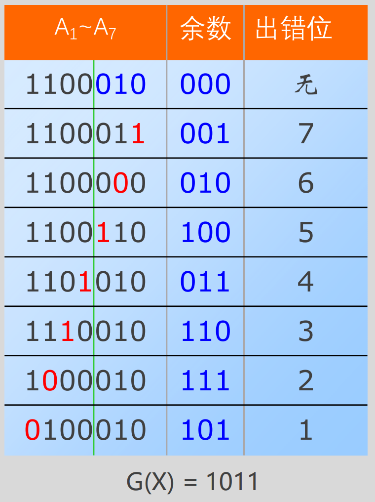

> 计算机组成原理教材-谭志虎版本-教材课后部分答案详解：
>
> https://blog.csdn.net/qq_54422132/article/details/128133607


# 第六章作业概念题部分

CPU的基本功能是什么？从实现其功能的角度分析，它应该由哪些部件组成？

CPU的基本功能是执行计算机指令，控制和协调计算机系统中的各个部件进行数据的处理和传输。从实现其功能的角度分析，CPU应该由以下几个部件组成：

1. 控制单元（Control Unit）：控制单元负责解释指令、生成控制信号和时序信号，并将它们发送到相应的部件。

2. 算术逻辑单元（Arithmetic Logic Unit，简称ALU）：ALU是执行算术和逻辑运算的核心部件，如加、减、乘、除、与、或、非等运算。

3. 寄存器（Register）：寄存器是CPU内部的高速存储器，用于存放指令、数据和地址等信息，以及中间结果的暂存器。

4. 缓存（Cache）：缓存是一种高速的存储器，用于临时存放CPU需要访问的数据和指令，以提高访问速度。

5. 总线接口单元（Bus Interface Unit，简称BIU）：BIU负责连接CPU和主存之间的总线，完成数据和指令的读取和写入操作。

6. 时钟（Clock）：时钟产生CPU的时序脉冲信号，使CPU内部的各部件同步工作，保证计算机系统的稳定性和可靠性。

这些部件共同协作，实现CPU的基本功能。当CPU接收到指令时，控制单元解释指令并生成相应的控制信号和时序信号，将它们发送到ALU、寄存器、缓存等部件，完成数据的处理和传输。


CPU内部有哪些寄存器？功能分别是什么？哪些是程序员可见的？哪些是必须的？

CPU内部有多个寄存器，不同的CPU可能具有不同的寄存器组织结构。下面列举一些常见的寄存器和它们的功能：

1. 程序计数器（Program Counter，PC）：用于存储下一条指令的地址。

2. 指令寄存器（Instruction Register，IR）：用于存储当前执行的指令。

3. 累加器（Accumulator，ACC）：用于存储算术和逻辑操作中的中间结果。

4. 数据寄存器（Data Register，DR）：用于存储数据。

5. 地址寄存器（Address Register，AR）：用于存储内存地址。

6. 标志寄存器（Flag Register，FR）：用于存储运算结果的状态信息，如进位、溢出、零标志等。

7. 堆栈指针（Stack Pointer，SP）：用于指向堆栈顶部。

8. 基址寄存器（Base Register，BR）：用于存储基地址，用于访问相对地址。

9. 数组索引寄存器（Index Register，X、Y）：用于存储数组索引或循环计数值。

其中，程序计数器、指令寄存器、累加器、标志寄存器和堆栈指针是程序员可见的寄存器。而数据寄存器、地址寄存器、基址寄存器和数组索引寄存器等则是程序员不可见的寄存器。

在这些寄存器中，程序计数器、指令寄存器、累加器和标志寄存器都是必须的，因为它们分别用于存储下一条指令的地址、当前执行的指令、运算结果和状态信息。而堆栈指针、数据寄存器、地址寄存器、基址寄存器和数组索引寄存器等则视具体实现而定，某些情况下可能不需要或可以被其它部件所代替。


什么是取值周期？取值周期内应该完成哪些工作？

取值周期（Fetch Cycle）是CPU执行指令时的一个重要阶段，通常也被称为取指令周期。在这个阶段，CPU从内存中获取下一条指令并将其存储到指令寄存器中，以便后续执行。

取值周期一般包括以下几个步骤：

1. 确定下一条指令的地址：根据程序计数器中存储的地址或者跳转指令中存储的目标地址，确定下一条指令的实际地址。

2. 将指令从内存中读取到指令缓存或指令寄存器中：CPU通过总线接口单元向内存发送读取指令的请求，并等待内存返回相应的数据。

3. 存储指令到指令寄存器中：一旦指令被从内存中读取出来，CPU将其存储到指令寄存器中，以备后续执行。

取值周期完成后，指令已经被存储到指令寄存器中，CPU可以开始执行该指令。取值周期对于CPU正常运行非常重要，因为它保证了CPU能够正确地、顺序地执行指令，并且避免出现指令执行错误或混乱的情况。


计算机为什么要设置时许系统？说明指令周期、机器周期、时钟周期的含义

计算机设置时许系统是为了保证计算机硬件部件之间的协调和同步，从而实现正确、高效地处理数据。时许系统包括时序控制电路和时钟信号生成器两个部分。

指令周期（Instruction Cycle）是CPU执行一条指令所需要的基本时间单位。它包含取值周期（Fetch Cycle）、译码周期（Decode Cycle）、执行周期（Execute Cycle）和写回周期（Write Back Cycle）等多个阶段。在每个指令周期中，CPU都会执行一条完整的指令，或者完成该指令的一部分操作。

机器周期（Machine Cycle）是CPU执行一个操作所需的时间，它通常包括若干个时钟周期。例如，CPU读取一个字节的数据需要一个机器周期，而一个机器周期可能需要多个时钟周期来完成。

时钟周期（Clock Cycle）是时钟信号的一个完整周期，也就是时钟信号从一个边沿到下一个边沿的时间。时钟周期的长度取决于CPU的主频，对于一个主频为1GHz的CPU来说，每个时钟周期的长度就是1纳秒。时钟周期通常用于表示CPU内部各种事件的发生时间，如取值周期、译码周期、执行周期和写回周期等。

时序控制电路通过时钟信号控制CPU内部各个部件的工作时序，保证CPU能够正确地执行指令。时钟信号生成器则负责产生CPU的时钟信号，为时序控制电路提供稳定、精确的时钟信号，从而保证整个计算机系统的稳定性和可靠性。


简述传统三级时序和现代时序的差异

传统的三级时序系统是指CPU内部的时序控制电路分为取指周期、执行周期和访存周期三个阶段，每个阶段由不同的控制信号和时序信号控制。这种三级时序系统的主要特点是结构简单、易于实现，但是存在一些缺陷，如时序控制精度低、时序容量受限等问题。

现代时序系统则采用了更加复杂的时序控制电路，以提高时序控制精度和容量，并支持更多的指令集和操作。现代时序系统通常包括以下几个特点：

1. 多级流水线：现代时序系统采用多级流水线技术，将CPU执行指令的过程分为多个阶段，在不同的时钟周期内完成不同的操作，从而提高指令执行效率。

2. 动态指令调度：现代时序系统可以在执行指令的同时，动态地重新排序指令，以提高指令的执行效率。

3. 高速缓存：现代时序系统通常搭载高速缓存，以提高数据的访问速度和效率。

4. 预测技术：现代时序系统可以根据程序的运行情况，预测下一条指令的地址和执行方式，以提高指令执行效率。

5. 超标量技术：现代时序系统支持超标量技术，可以同时执行多条指令，以进一步提高指令执行效率。

综上所述，现代时序系统相比传统的三级时序系统具有更高的时序控制精度和容量，支持更多的指令集和操作，并且通过复杂的技术手段，大幅提高了指令执行效率。


比较单周期MIPS处理器与多周期MIPS处理器的差异

单周期MIPS处理器和多周期MIPS处理器是两种不同的CPU设计方法，它们在实现时序控制的方式、指令执行效率等方面存在差异。

1. 实现时序控制的方式：单周期MIPS处理器采用一条总线对所有部件进行统一的控制，每个指令都需要花费一个完整的时钟周期来完成，因此它的时序控制较为简单。而多周期MIPS处理器则采用多条总线对不同的部件进行分别控制，每个指令可以根据需要花费多个时钟周期来完成，因此它的时序控制较为复杂。

2. 指令执行效率：单周期MIPS处理器的指令执行时间固定为一个时钟周期，因此无法利用流水线技术提高指令执行效率。而多周期MIPS处理器可以将指令执行过程分成多个阶段，在不同的时钟周期内完成不同的操作，从而可以利用流水线技术提高指令执行效率。

3. 硬件成本：由于单周期MIPS处理器中所有指令的执行时间相同，因此需要大量的硬件资源来支持所有指令的执行。而多周期MIPS处理器通过分阶段执行，可以共享某些硬件资源，从而减少了硬件成本。

4. 设计复杂度：单周期MIPS处理器的设计相对简单，因为所有指令的执行时间相同，需要的硬件资源也比较明确。而多周期MIPS处理器的设计比较复杂，因为需要考虑不同指令之间的时序关系和资源共享等问题。

综上所述，单周期MIPS处理器与多周期MIPS处理器在实现时序控制的方式、指令执行效率、硬件成本和设计复杂度等方面都存在差异。单周期MIPS处理器适合于对性能要求不高的应用场景，而多周期MIPS处理器则适合于对性能要求较高的应用场景。


组合逻辑控制器与微程序控制器各有什么特点？

组合逻辑控制器和微程序控制器是CPU常用的两种指令执行方式，它们各有特点。

1. 组合逻辑控制器

组合逻辑控制器是一种基于组合逻辑电路实现的指令执行方式。在这种执行方式下，每一条指令被翻译成由组合逻辑电路构成的硬件电路，当CPU执行指令时，硬件电路会根据输入信号输出相应的控制信号，从而完成指令执行。

组合逻辑控制器的特点是：

- 硬件结构简单，易于实现；
- 执行速度快，响应时间短；
- 没有中间状态，指令执行结果可靠。

2. 微程序控制器

微程序控制器是一种基于微程序设计思想实现的指令执行方式。在这种执行方式下，CPU的控制逻辑被翻译成一组微指令序列，每个微指令对应一个操作，CPU通过执行不同的微指令序列来完成不同的指令执行。

微程序控制器的特点是：

- 能够支持多种指令集和操作码；
- 灵活性高，可以根据需要增加或修改微指令序列；
- 可以通过微指令的跳转和分支实现指令执行的控制流程。

综上所述，组合逻辑控制器和微程序控制器各有特点。组合逻辑控制器适用于执行速度要求较高、指令集和操作码比较固定的场景；而微程序控制器适用于需要支持多种指令集和操作码、控制流程复杂、需求灵活性高的场景。


说明程序与微程序、指令与微指令的异同

程序（Program）和微程序（Microprogram）是两种不同的指令执行方式，指令（Instruction）和微指令（Microinstruction）是在这两种指令执行方式下使用的不同概念。

1. 程序与微程序

程序是一组按照特定顺序排列的指令序列，用于描述计算机进行某项操作的过程。程序可由高级语言编写，然后通过编译器转换成二进制码，并存储在计算机的内存中。

微程序是一组按照特定顺序排列的微指令序列，用于描述计算机进行某项操作的控制流程。微程序通常由计算机设计师手工编写，并存储在计算机的控制存储器中。

2. 指令与微指令

指令是CPU执行的最小操作单位，它包含了操作码、寄存器地址、立即数等信息，用于指导CPU完成某项操作。

微指令是微程序中的最小操作单位，它包含了控制信号、地址信息等内容，用于指导CPU完成某个阶段的指令执行。

总体上，程序和微程序都是用于指导计算机执行某项操作的指令序列，但它们所描述的内容不同。指令和微指令则是两个不同的执行单元，它们分别用于描述程序和微程序执行的最小操作单位。在计算机执行指令时，CPU会根据指令中的操作码解析出相应的微指令序列，并按照微指令序列执行指令。这种指令执行方式可以使CPU更加灵活、可扩展，支持多种不同的计算机架构和指令集。


微指令有哪几种编码方法？它们是如何实现的？

微指令的编码方法通常可以分为以下几种：

1. 垂直编码法

垂直编码法是最早的微程序编码方法，它使用一位二进制数表示每个微命令，将所有命令按照顺序排列，组成微指令。这种编码方法简单明了，但是编码效率较低，随着微程序规模的扩大，编码长度会逐渐变长。

2. 水平编码法

水平编码法采用类似于操作系统中的位示图方式，对每一条微指令用一个比特串来表示。该比特串被划分为若干字段，每个字段代表一个控制信号或者地址。使用这种编码方法，可以实现高效地存储和压缩微程序，提高微程序的运行效率。

3. 微指令跳转编码法

微指令跳转编码法通过引入微指令跳转机制，使得每条微指令都可以包含一个跳转地址字段。当执行到该微指令时，CPU将会根据跳转地址字段跳转到另一个微程序的地址，从而完成控制流程的跳转。这种编码方法可以支持复杂的控制流程、实现更加灵活的微程序设计。

4. 微码存储器编码法

微码存储器编码法是一种将微指令存储在专门的微码存储器中的编码方法，它可以实现高速访问和执行微指令。常见的微码存储器包括PROM、EPROM、EEPROM等，其中EPROM采用了非挥发性存储技术，可以保证微程序的长期存储和使用。

这些编码方法各有优缺点，具体选择哪种编码方法主要取决于微程序的规模、复杂度、性能要求以及实际应用场景等因素。


简述微程序控制器和硬布线控制器的设计方法

微程序控制器和硬布线控制器是两种不同的CPU指令执行方式，它们在设计方法上也有很大差异。

1. 微程序控制器

微程序控制器是一种基于微指令序列实现的指令执行方式。在这种执行方式下，CPU的控制逻辑被翻译成一组微指令序列，每个微指令对应一个操作，CPU通过执行不同的微指令序列来完成不同的指令执行。

微程序控制器的设计方法主要包括以下几个步骤：

- 根据CPU的指令集和操作码设计一组微指令集合；
- 设计微指令的控制信号、地址信息等内容；
- 将微指令按照特定的顺序排列，形成微指令序列；
- 将微指令序列存储在控制存储器中，以供CPU进行指令执行时使用。

2. 硬布线控制器

硬布线控制器是一种基于组合逻辑电路实现的指令执行方式。在这种执行方式下，每一条指令被翻译成由组合逻辑电路构成的硬件电路，当CPU执行指令时，硬件电路会根据输入信号输出相应的控制信号，从而完成指令执行。

硬布线控制器的设计方法主要包括以下几个步骤：

- 根据CPU的指令集和操作码设计一组逻辑电路；
- 将逻辑电路按照特定的顺序排列，形成硬件电路；
- 将硬件电路实现在芯片上，并与CPU的其他部分进行连接。

相比于硬布线控制器，微程序控制器具有更高的灵活性和可扩展性。由于微程序采用软件方式实现指令控制，因此可以根据需要随时修改微指令序列，从而支持多种不同的指令集和操作码。而硬布线控制器则固化了指令集和操作码，无法进行修改和扩展。但是，由于微程序控制器需要访问控制存储器来获取微指令，因此其速度相对较慢，而硬布线控制器则具有更快的执行速度和更小的延迟。


# CRC如何检错

想必看到这片文章的同学，已经对CRC校验码的生成过程和理论依据如数家珍，但是却很少有详细讲述CRC是如何纠错的。关于CRC校验码生成的理论，前人之述备矣，我也就不赘述了，不了解的同学可以搜索CRC相关知识。下面以一道例题来把CRC检验的整个过程讲述一遍，重点是讲述如何纠错。

至于CRC能不能纠错，可以参见下面这两篇文章：

1. [循环冗余码CRC可不可以纠错](https://blog.csdn.net/weilaidedakejilu/article/details/120210241)
2. [计组与计网数据编码之数据保证—奇偶校验，汉明码(海明码)与循环冗余码CRC以及异或的应用、看完之后做题不迷茫](https://blog.csdn.net/weilaidedakejilu/article/details/120212507)


例题：

现在我们拥有信息位1100和生成多项式G(X)=1011，通过模2除生成校验码1100010，对此有如下表格，即不同出错位与余数的对应表，实际上计算机并不知道这个表格，这个表格是我们人为计算的得出的，计算机仅仅知道此情况下第一位出错的余数是101。



现在假设接受到的校验码是1100011，这个数与G(X)=1011作模二除结果是001，与我们发送的校验码1100010相比较，很明显最后一位出错了，我们用下划线标注上这一位。用于观察计算过程中这一位的变化情况。事实上，计算机不知道001对应哪一位出错了，计算机只知道第一位出错的余数是101**（注意，文末有对这句话的解释，先搞懂整个流程怎么做的，再去探究细节原因）**。


提前说明几点问题：

1. 纠错利用的原理是出错状态下的余数补0后，继续与G(X)进行模二除，重复操作会产生循环。
2. 循环左移是指，把校验码往左移，校验码最左边的一位移动到最右边，直观上就像是一个环庄，所以叫循环左移。看到这里你可能还不懂，没关系，通过一个例子，你就肯定会明白了。


开始纠错

| 情况说明                                                     | 校验码当前情况 | 运算                | 余数 |
| ------------------------------------------------------------ | -------------- | ------------------- | ---- |
| 发现出错，开始纠错                                           | 1100011        | 1100011与G(X)模二除 | 001  |
| 校验码循环左移，同时余数001补0，成为0010，与G(X) 模二除      | 1000111        | 0010与G(X)模二除    | 010  |
| 校验码循环左移，同时余数010补0，成为0100，与G(X) 模二除      | 0001111        | 0100与G(X)模二除    | 100  |
| 校验码循环左移，同时余数100补0，成为1000，与G(X) 模二除      | 0011110        | 1000与G(X)模二除    | 011  |
| 校验码循环左移，同时余数011补0，成为0110，与G(X) 模二除      | 0111100        | 0110与G(X)模二除    | 110  |
| 校验码循环左移，同时余数110补0，成为1100，与G(X) 模二除      | 1111000        | 1100与G(X)模二除    | 111  |
| 校验码循环左移，同时余数111补0，成为1110，与G(X) 模二除      | 1110001        | 1110与G(X)模二除    | 101  |
| 发现当前余数位101，已知101代表第一位出错，把第一位与1进行异或运算(或取反运算)，纠错 | 0110001        | 无运算              | 无   |
| 校验码循环左移，同时余数101补0，成为1010，与G(X) 模二除      | 1100010        | 1010与G(X)模二除    | 001  |
| 此时发现余数已经回到了原来的001，说明循环左移移动了一圈，同时在出错位移动到第一位的时候我们把出错位纠正了，现在原本出错的位置又回到了原来的地方，并且数据也已经更正了。结果为110010与我们的发送的原校验码一致。 |                |                     |      |


现在我们可以总结纠错的**基本思想**：

1. 不论出错在哪一位，均要通过出错位循环左移到最左边一位上来进行纠正。
2. 不为0的余数具有循环特征，即在余数后面补上一个0后除以多项式，将得到下一个余数。继续在新余数的基础上补零除以生成多项式，重复该操作，最终余数能循环到最开始的余数，CRC由此得名。
3. CRC就是利用不为0余数的循环特性，在循环计算余数的同时，将收到的CRC编码同步循环左移，当余数循环到等于最左边位出错对应的余数时，表明出错位已经移到了CRC码的最左边，对出错位进行纠错
4. 继续进行余数的循环计算，并同步移动CRC编码，当余数回到最开始的值时，纠错后的CRC码也回到了最开始的位置。至此，纠错任务完成。


CRC的纠错过程才是其精髓所在，了解之后不由的感叹：“妙不可言，计算机前辈们都是神级大佬”。最后，祝愿大家好好学习，变得更强。至于计算机是怎么知道第一位出错时的余数，可以参见下面这篇文章，写的很好

[计算机组成原理：循环冗余校验码CRC具备“一位纠错”功能的思考与探索](https://blog.csdn.net/qq_52161487/article/details/128783648)


> 来源：https://blog.csdn.net/limaodx/article/details/116559204
>
> 原文处可以查看手算的循环过程


# 对比硬布线控制器和微程序控制器

硬布线控制器和微程序控制器各有什么优缺点？

硬布线控制器（也称为定制电路）和微程序控制器是两种不同的计算机控制方式。它们各自有一些优缺点，下面我将为你详细介绍一下：

硬布线控制器：
优点：
1. 硬布线控制器可以执行简单、重复的任务，因为其结构相对简单，没有微指令控制的高级语言翻译等复杂流程。
2. 能够实现极高的执行速度，因为其结构直接对底层硬件进行编程和控制。
3. 由于其结构固定，可以避免软件漏洞和安全问题。

缺点：
1. 硬布线控制器的设计和制造成本较高，特别是在需要更改电路功能时，需要重新设计和制造整个控制器。
2. 不灵活，仅能执行预先定义好的操作。如果需要修改程序或增加新功能，则需要重新设计和制造整个控制器。
3. 在面对复杂的任务和算法时，硬布线控制器的执行效率可能会降低。

微程序控制器：
优点：
1. 微程序控制器使用高级语言编写的微指令控制，因此具有更高的灵活性和可编程性。
2. 可以通过修改微指令控制来实现新功能的添加或程序的修改，而无需重新设计和制造整个控制器。
3. 对于复杂算法和任务，微程序控制器具有更高的执行效率。

缺点：
1. 微程序控制器的设计和制造成本较高，特别是在需要更改电路功能时，需要重新设计和制造整个控制器。
2. 因为需要翻译高级语言到微指令，所以执行速度可能会受到影响。
3. 软件漏洞和安全问题可能会存在。


# DMA操作

DMA是英文Direct Memory Access的缩写，即直接内存访问。在计算机中，当一个外设需要与主存储器进行数据传输时，一般的方法是通过CPU来完成数据传输，这种方式被称为“程序控制I/O”，也就是由CPU对I/O设备进行操作。而采用DMA方式时，数据传输不再经过CPU，而是由DMA控制器直接将数据从I/O设备读取到内存或者从内存写入到I/O设备。这样可以减轻CPU的负担，提高数据传输效率。


# 计算机系统概述

## 计算机系统层次结构

### 计算机系统的组成

硬件系统和软件系统共同构成了一个完整的计算机系统。

硬件是指有形的物理设备，是计算机系统中实际物理装置的总称。

软件是指在硬件上运行的程序和相关的数据及文档。

### 计算机硬件的基本组成

#### 早期的冯诺依曼机

- 计算机硬件系统由运算器、存储器、控制器、输入设备和输出设备5大部件组成
- 指令和数据以同等地位存储在存储器中，并可按地址寻访
- 指令和数据均用二进制代码表示
- 指令由操作码和地址码组成，操作码指出操作的类型，地址码指出操作数的地址
- 指令在存储器内按顺序存放。通常，指令是顺序执行的，在特定条件下可根据运算结构或根据设定的条件改变执行顺序
- 早期的冯诺依曼机以运算器为中心，输入输出设备通过运算器与存储器传送数据

**存储程序的概念（冯诺依曼机的思想）**

将指令以代码的形式事先输入计算机的主存储器，然后按其在存储器中的首地址执行程序的第一条指令，以后就按该程序的规定顺序执行其他指令，直至程序执行结束

#### 现代计算机的组织结构

- 在微处理器问世之前，运算器和控制器分离
- 现在发展为以存储器为核心

#### 计算机的功能部件

- 输入设备：输入设备的主要功能是将程序和数据以机器所能识别和接受的信息形式输入计算机
- 输出设备：输出设备的主要任务是将计算机处理的结果以人们所能接受的形式或其他系统所要求的信息形式输出
- 存储器：是计算机的存储部件，用来存放程序和数据
  - 主存储器：CPU能够直接访问的存储器
    - 存储体：存放二进制信息
    - 地址寄存器`MAR()`:存放访存地址，经过地址译码后找到所选的存储单元
    - 数据寄存器`MDR()`:用于暂存要从存储器中读或写的信息
    - 时序控制逻辑用于传输存储器操作所需的各种时序信号
    - 主存储器由许多**存储单元**组成，每个存储单元包含若干**存储元件**，每个存储元件存储一位二进制代码。存储单元可存储一串二进制代码，称其为**存储字**，存储字的字长为**存储字长**
  - 辅助存储器：辅助存储器中的信息必须调入主存后，才能被CPU访问

- 运算器：运算器是计算机的执行部件，用于进行算术运算逻辑运算。算术运算是按算术运算规则进行的运算。
  - 算术逻辑单元`(Arithmetic and Logical Unit,ALU)`：运算器的核心
  - 若干寄存器：累加器`ACC`、乘商寄存器`MQ`、操作数寄存器`X`，变址寄存器`IX`、基址寄存器`BR`
  - 程序状态寄存器`PSW`：也称标志寄存器，用于存放ALU运算得到的一些标志信息或处理机的状态信息
- 控制器：是计算机的指挥中心
  - 程序计数器`PC`:用来存放当前欲执行指令的地址，可以自动加1形成下一条指令的地址，与主存`MAR`之间有一条直捷通路
  - 指令寄存器`IR`:用来存放当前的指令，其内容来自主存的`MDR`
  - 控制单元`CU`：指令中的操作码`OP(IR)`送至CU，用以分析指令并发出各种微操作命令序列

### 计算机软件的分类

#### 系统软件和应用软件

- **系统软件**：是一组保证计算机系统高效、正确运行的基础软件，通常作为系统资源提供给用户使用，DBS不同于DBMS
- **应用软件**：是指用户为解决某个应用领域中的各类问题而编制的程序

#### 三个级别的语言

- 机器语言：又称二进制代码语言，是计算机唯一可以直接识别和执行的语言
- 汇编语言：用英文单词或其缩写代替二进制指令代码。必须经过汇编程序这一系统软件的翻译，转换成机器语言后，才能在计算机的硬件系统上执行
- 高级语言：通常需要经过编译程序编译成汇编语言，然后得到机器语言后才能执行

### 计算机的工作过程

- 把程序和数据装入主存储器
- 把源程序转换成可执行文件
- 从可执行文件的首地址开始逐条执行指令

#### 从源程序到可执行文件

1. 预处理阶段：预处理`cpp`对源程序`hello.c`以字符`#`开头的命令进行处理。输出结果是以一个`.i`为扩展名的源文件`hello.i`
2. 编译阶段：编译器`ccl`对预处理后的源程序进行编译，生成一个汇编语言源程序`hello.s`
3. 汇编阶段：汇编器`as`将`hello.s`翻译成机器语言指令，把这些指令打包成一个称为可重定位目标文件的`hello.o`,它是一种二进制文件
4. 链接阶段：链接器`ld`将多个可重定位目标文件和标准库函数合并成一个可执行文件`hello`。

#### 指令执行过程的描述

见5章

### 计算机系统的多级层次结构

| 名称           | 名称             | 功能                           |
| -------------- | ---------------- | ------------------------------ |
| 虚拟器`M4`     | 高级语言机器     | 用来编译程序翻译成汇编语言程序 |
| 虚拟机`M3`     | 汇编语言机器     | 用汇编程序翻译成语言程序       |
| 虚拟机`M2`     | 操作系统机器     | 用机器语言解释操作系统         |
| 传统机`M1`     | 用机器语言的机器 | 用微程序解释机器指令           |
| 微程序机器`M0` | 微指令系统       | 又硬件直接执行微指令           |

## 计算机的性能指标

### 计算机的主要性能指标

- 机器字长：指计算机进行一次整数运算所能处理的二进制数据的位数，一般等于内部寄存器的大小

- 数据通路带宽：指数据总线一次所能并行传送信息的位数，等于外部数据总线宽度

- 主存容量：主存储器所能存储信息的最大容量，一般用字节或字数X字长来描述

- 运算速度

  - 吞吐量和响应时间

    - 吞吐量：系统在单位时间内处理请求的数量。主要取决于主存的存取周期
    - 响应时间：指从用户向计算机发送一个请求，到系统对该请求作出响应并获得所需结果的等待时间

  - 主频和`CPU`时钟周期

    - `CPU`时钟周期：是CPU中最小的时间单位，执行指令的每个动作至少需要一个时钟周期，是主频的倒数
    - 主频(`CPU`时钟频率)：即其内部主时钟的频率。主频越高，完成指令的一个执行步骤所用的时间越短，执行指令的速度越快

  - `CPI(Clock cycle Pre Instruction)`：执行一条指令所需的时钟周期数

  - CPU执行时间：`CPU执行时间=CPU时钟周期数/主频=(指令条数xCPI)/主频`

  - `MIPS(Million Instructions Pre Second)`：`MIPS=指令条数/(执行时间*10^6)=主频/(CPIx10^6)`

  - MFLOPS，GFLOPS，TFLOPS，EFLOPS，ZFLOPS：每秒执行多少次浮点运算

    - `MFLOPS(Mega Floating-point Operations Pre second)`：每秒执行多少百万次浮点运算
    - `GFLOPS(Giga Floating-point Operations Pre second)`：每秒执行多少十亿次浮点运算
    - `TFLOPS(Tera Floating-point Operations Pre second)`：每秒执行多少万亿次浮点运算

    在描述存储量的时间，通常用2的幂次表示；在描述性能、速率等时，通常用10的幂次表示

### 几个专业术语

- 系列机
- 兼容
- 软件可移植性
- 固件

# 数据的表示和运算

## 数制与编码

### 进位计数制及其相互转换

#### 使用二进制进行编码的原因

- 二进制只有两种状态，使用有两个稳定状态的物理器件就可以表示二进制的每一位
- 二进制位`1`和`0`正好与逻辑值“真”、“假”对应，为计算机实现逻辑运算和程序中的逻辑判断提供了便利条件
- 二进制的编码和运算规则都很简单，通过逻辑门电路能方便地实现算术运算

#### 进制计数法

- 基数：每个数位所用的的不同数码的个数称为**基数**
- 位权：每个数码所表示的数值等于该数值本身乘以一个与它所在位数相关的常数，这个常数就是**位权**

#### 不同进制数之间的相互转换

- 二进制数转换为八进制数和十六进制数：在转换时以小数点为界。其整数部分，从小数点开始往左数，将一串二进制数分为3位一组或4位一组，在数的最左边可依据需要加“0”补齐；对于小数部分，从小数点开始往右数，也将一串二进制数分为3位一组或4为一组，然后分别用对应的二进制数或十六进制数取代
- 任意进制数转换为十进制数：数码和权值相加即可

- 十进制数转换为二进制数：基数乘除法
  - 除基取余法（整数部分的转换）：整数部分除基取余，最先取得的余数为数的最低位，最后取得的余数为数的最高位，商为0时结束
  - 乘基取整法（小数部分对的转换）：小数部分乘基取整，最先取得的整数为数的最高位，最后取得的整数为数的最低位，乘积为`1.0`时结束
  - 不是每一个十进制小数都可以准确的用二进制表示，如`0.3`，但每一个二进制小数都可以用十进制小数表示

### 真值和机器数

- 真值是机器数所代表的实际值
- 机器数是把符号数字化的数

### 字符与字符串

#### 字符编码ASCII码

- 7位二进制编码的ASCII码，每个字节的最高位保持0，用于奇偶校验
- 编码值`0~31`为控制字符，用于通信控制或设备的功能控制
- 编码值`32`是空格`SP`
- 编码值`32~126`共`95`个字符为可印刷字符
- 编码值`127`是`DEL`码

#### 汉字的表示和编码

- $国标码=(区位码)_{16}+2020H$
- $汉字内码=(国标码)_{16}+8080H$

## 定点数的表示与运算

### 定点数的表示

#### 无符号数和有符号数的表示

- 无符号数：整个机器字长的全部二进制位均为数值位，没有符号位，相当于数的绝对值
- 有符号数：将符号位放在有效数字的前面，组成有符号数

#### 机器数的定点表示

- 定点小数：纯小数，约定小数点位置在符号位之后，有效数值部分最高位之前
- 定点整数：纯整数，约定小数点位置在有效数值部分最低位之后

#### 源码、补码、反码、移码

- 原码：用机器数的最高位表示该数的符号，其余的各位表示数的绝对值
- 补码：与原码相比，符号位不变，正数数值位不变，负数数值位取反加1，0的表示唯一
- 反码：符号位不变，正数数值位不变，负数数值位取反。0的表示不唯一
- 补码的算术移位：将$[x]_{补}$的符号位与数值位一起右移一位并保持原符号位的数值不变，可实现除法功能
- 变形补码：又称模4补码，双符号位的补码小数，符号位00表示正，11表示负
- 移码：$[x]_{移}=2^n+x,机器字长为n+1$，或者补码符号位取反得到移码，0表示唯一

### 定点数的运算

#### 定点数的移位运算

- 算术移位：算术移位的对象是有符号数，在移位过程中符号位保持不变

  |      | 码制             | 添加代码 |
  | ---- | ---------------- | -------- |
  | 正数 | 原码、补码、反码 | 0        |
  | 负数 | 原码             | 0        |
  |      | 补码             | 左移添0  |
  |      | 补码             | 右移添1  |
  |      | 反码             | 1        |

- 逻辑移位：逻辑移位将操作数视为无符号数，添0补齐

- 循环移位：循环移位分为带进位标志位CF的循环移位和不带进位标志位的循环移位

#### 原码定点数的加减法运算

- 加法规则：先判断符号位，若相同，则绝对值相加，结果符号位不变；若不同，则做减法，绝对值大的数减去绝对值小的数，结果符号位与绝对值大的数相同
- 减法规则：两个原码表示的数相减，首先将减数符号取反，然后将被减数与符号取反后的减数按原码加法进行运算

#### 补码定点数加减法运算

$[A+B]_{补}=[A]_{补}+[B]_{补}(mod\  M)$

$[A-B]_{补}=[A]_{补}+[-B]_{补}(mod \ M)$

$[-B]_{补}$可通过对$[B]_{补}$连同符号位在内，每位取反，末位加1获得

#### 符号扩展

- 正数的符号扩展：添加0

- 负数的符号扩展
  - 原码：同正数
  - 补码：整数添1，小数添0
  - 反码：添1

#### 溢出概念和判别方法

- 概念
  - 溢出：指运算结果超过了数的表示范围
  - 上溢：大于机器所能表示的最大正数
  - 下溢：小于机器所能表示的最小负数

- 溢出判断方法
  - 采用一位符号位
  - 采用双符号位
  - 采用一位符号诶根据数据位的进位情况判断溢出

#### 定点数的乘法运算

- 原码一位乘法

  1. 被乘数和乘数均取绝对值参加运算，符号为$x_s \oplus x_y$
  2. 部分积的长度同被乘数，取`n+1`位，以便存放乘法过程中绝对值大于等于1的值，初值为0
  3. 从乘数的最低位$y_n$开始判断：若$y_n=1$，则部分积加上被乘数$|x|$，然后右移一位；若$y_n=0$，则部分积加上0，然后右移一位
  4. 重复3，判断`n`次

     注意：部分积和被乘数通常取双符号位，避免运算时出现绝对值大于1的情况

- 补码一位乘法(`Booth算法`)

  1. 符号位参与运算，运算的数均以补码表示

  2. 被乘数一般取双符号位参与运算，部分积取双符号位，初值为0，乘数可取单符号位

  3. 乘数末位增设附加位$y_{n+1}$,且初值为0

  4. 根据$(y_{n},y_{n+1})$的取值来确定操作

     | 部分积  | 乘数$y_n$ | 附加位$y_{n+1}$ | 操作                          |
     | ------- | --------- | --------------- | ----------------------------- |
     | 初值为0 | 0         | 0               | 部分积右移一位                |
     |         | 0         | 1               | 部分积加$[X]_{补}$，右移一位  |
     |         | 1         | 0               | 部分积加$[-X]_{补}$，右移一位 |
     |         | 1         | 1               | 部分积右移一位                |

  5. 移位按补码右移规则进行

  6. 按照上述算法进行n+1步操作，但n+1步不再移位，仅根据$y_n$与$y_{n+1}$的比较结果做相应的运算

- 乘法运算总结

  | 乘法类型     |          | 符号位 |      | 累加次数 |      | 移位 |          |
  | ------------ | :------- | ------ | ---- | -------- | ---- | ---- | -------- |
  |              | 参与运算 | 部分积 | 乘数 |          | 方向 | 次数 | 每位次数 |
  | 原码一位乘法 | 否       | 2位    | 0位  | n        | 右   | n    | 1        |
  | 补码一位乘法 | 是       | 2位    | 1位  | n+1      | 右   | n    | 1        |

#### 定点数的除法运算

- 原码除法运算（不恢复余数法）
  1. 符号位不参加运算

  2. 先用被除数减去除数（$|X|-|Y|=|X|+(-|Y|)=|X|+[-|Y|]_{补}$），

     - 当余数为正时
       - 商上1
       - 余数和商左移一位
       - 再减去除数；
     - 当余数为负时
       - 商上0
       - 余数和商左移一位
       - 再加上除数

  3. 当n+1步余数为负时，需加上$|Y|$得到n+1步正确的余数（余数与被除数同号）

     `被除数（余数） |  商  |  说明`

- 补码除法运算（加减交替法）
  1. 符号位参加运算，除数与被除数均用补码表示，商和余数也用补码表示
  2. 若被除数与除数同号，则被除数减去除数；若被除数与除数异号，则被除数加上除数
  3. 若余数与除数同号，则商上1，余数左移一位减去除数；若余数与除数异号，则商上0，余数左移一位加上除数
  4. 重复执行`3`步操作`n`次
  5. 若对商的精度没有特殊要求，则一般采用“末位恒置1”法

| 除法类型       | 符号位参与运算 | 加减次数 | 移位方向 | 次数 | 说明                       |
| -------------- | :------------- | -------- | -------- | ---- | -------------------------- |
| 原码加减交替法 | 否             | N+1或N+2 | 左       | N    | 若最终余数为负，需恢复余数 |
| 补码加减交替法 | 是             | N+1      | 左       | N    | 商末位恒置一               |

### C语言中的整数类型及类型转换

- 有符号数和无符号数的转换：位值保持不变，仅改变了解释这些位的方式
- 不同字长整数之间的转换：大字长变量向小字长变量强制类型转换时，系统把多余的高位字长部分直接截断，低位直接赋值，因此也是一种保持位值的处理方式；短字长整数到长字长整数的转换，不仅要使相应的位值相同，高位部分还会扩展为原数字的符号位

### 数据的存储和排列

#### 数据的大端方式和小端方式存储

- 通常用最低有效字节`LSB`和最高有效字节`MSB`来分别表示数的低位和高位

- 大端方式按从最高有效字节到最低有效字节的顺序存储数据，即最高有效字节存放在前面
- 小端方式按从最低有效字节到最高有效字节的顺序存储数据，即最低有效字节存放在前面
- 在阅读小端方式存储的机器代码时，要注意字节是按相反顺序显示的

#### 数据按边界对齐方式存储

- 数据按边界对齐方式存放，半字地址一定是2的整数倍，字地址一定是4的整数倍，这样无论所取的数据是字节，半字还是字，均可一次访存取出。所存储的数据不满足上述要求时，通过填充空白字节使其符合要求。
- 数据不按边界对齐方式存储时，可以充分利用存储空间，但半字长或字长的指令可能会存储在两个存储字中，此时需要两次访存，并且对高低字节的位置进行调整，连接之后才能得到所要的指令或数据，从而影响了指令的执行效率

## 浮点数的表示与运算

### 浮点数的表示

#### 浮点数的表示格式

$N=r^E \times M$

- `r`是浮点数阶码的底（隐含），与尾数的基数相同
- `E`和`M`都是有符号的定点数，`E`为阶码，`M`为尾数
- 阶符$J_f$和阶码的位数`m`共同反映浮点数的表示范围及小数点的实际位置
- 数符$S_f$代表浮点数的符号；尾数的位数`n`反映浮点数的精度

#### 规格化浮点数

|              | 左规                        | 右规                        |
| ------------ | --------------------------- | --------------------------- |
| 操作         | 尾数算术左移一位、阶码减`1` | 尾数算术右移一位、阶码加`1` |
| 操作次数     | 可能要进行多次              | 只需进行一次                |
| 需要移位情况 | 00.0xx或11.1                | 10.xxx或01.xxx              |

- $[-\frac{1}{2}]_{补}=1.1000$不是规格数，需要左移一次
- 基数不同，浮点数的规格化形式也不同。当基数为4时，原码规格化形式的尾数最高两位不全为0；当基数为8时，原码规格化形式的尾数最高3位不全为0

#### IEEE 754 标准

| $m_s$ | $E$                  | $M$                  |
| ----- | -------------------- | -------------------- |
| 数符  | 阶码部分，用移码表示 | 尾数部分，用原码表示 |

| 类型       | 数符 | 阶码 | 尾数数值 | 总位数 | 偏置值H | 偏置值D |
| ---------- | ---- | ---- | -------- | ------ | ------- | ------- |
| 短浮点数   | 1    | 8    | 23       | 32     | 7FH     | 127     |
| 长浮点数   | 1    | 11   | 52       | 64     | 3FFH    | 1023    |
| 临时浮点数 | 1    | 15   | 64       | 80     | 3FFFH   | 16383   |

- 为了使尾数能多表示一位有效位，最高位`1`一般被隐含，隐含的这一位是整数，尾数数值比表中的还要多一位
- **存储浮点数阶码部分之前，偏置值要先加到阶码真值上**
- 浮点数阶码转换为真值时要减去偏置值：$(-1)^s \times 1.M\times 2^{E-127}$

**IEEE 875 浮点数的范围**

| 格式   | 最小值                | 最大值                                |
| ------ | --------------------- | ------------------------------------- |
| 单精度 | $1.0\times2^{1-127}$  | $1.0\times2^{127} \times (2-2^{-23})$ |
| 双精度 | $1.0\times2^{1-1023}$ | $1.0\times2^{1023} \times (2-2^{52})$ |

#### 定点数VS浮点数

- 数值的表示范围

  若定点数和浮点数的字长相同，则浮点表示法所能表示的数值范围将远远大于定点表示法

- 精度

  浮点数扩大了数的表示范围，但是精度降低了

- 数的运算

  浮点数不仅要做尾数的运算，还要做阶码的运算，结果还要规格化

- 溢出问题

  在定点运算中，当运算结果超出数的表示范围时，发生溢出

  浮点运算中，运算结果超出尾数表示范围不一定溢出，只有规格化后阶码超出所能表示的范围时，才发生溢出

### 浮点数的加减运算

1. 对阶

   先求阶差，然后以小阶向大阶看齐的原则，将阶码小的尾数向右移一位，阶加1，直到阶相等

2. 尾数求和

3. 规格化

4. 舍入-对阶和右规时

   - 0舍1入法：在尾数右移时，被移去的最高数值位为0，则舍去；被移去的最高数值位矢1，则在尾数的末位加1
   - 恒置1法：尾数右移时，无论丢掉的最高数值位是1还是0，都使右移后的尾数末位恒置1

5. 溢出判断

   - 阶码的符号位出现“01”时，上溢，进入中断处理
   - 阶码的符号位出现“10”时，下溢，按机器零处理

6. C语言中的浮点数类型及类型转换

   - `char->int->long->double`
   - `float->double`

## 算术逻辑单元

### 串行加法器和并行加法器

#### 一位全加器

和表达式：$S_i=A_i \oplus B_i \oplus C_{i-1}$

进位表达式：$C_i=A_iB_i+(A_i \oplus B_i)C_{i-1}$

#### 串行加法器

在串行加法器中，只有一个全加器，数据逐位串行送入加法器中进行运算。若操作数长`n`位，则加法就要分`n`次进行，每次产生一位和，并且串行逐位地送回寄存器

#### 并行加法器

并行加法器中的每个全加器都有一个从低位送来的进位输入和一个传送给高位的进位输出。通常将传输进位信号的逻辑线路连接起来构成的进位网络称为进位链。

- 进位表达式$C_i=G_i+P_iG_{i-1}$

- $G_i$是进位产生函数，$G_i=A_iB_i$
- $P_i$是进位传递函数，$P_i=A_i \oplus B_i$

进位分为**串行进位**和**并行进位**

### 算术逻辑单元的功能和结构

- 带标志加法器

- 算术逻辑单元

  `ALU`是一种功能较强的组合逻辑电路，它能进行多种算术运算和逻辑运算

- 补码加减运算部件

# 存储系统

## 存储器概述

### 存储器的分类

#### 按在计算机中的作用分类

- 主存储器：简称主存，又称内存储器（内存），用来存放计算机运行期间所需的大量程序和数据。CPU可以直接随机的对其进行访问，也可以和高速缓冲存储区（`Cache`）及辅助存储器交换数据。其特点是容量较小，存取速度较快、每位价格较高
- 辅助存储器：简称辅存，又称外存储器（外存），是主存储器的后援存储器，用来存放当前暂时不用的程序和数据，以及一些需要永久保存的信息，它不能与`CPU`直接交换信息。特点是容量极大、存取速度较慢、单位成本较低
- 高速缓冲器：简称`Cache`，位于主存和`CPU`之间，用来存放正在执行的程序段和数据，以便`CPU`能高速的使用它们。`Cache`的存取速度可与`CPU`的速度相匹配，但存储容量小、价格高

#### 按存储介质分类

- 磁表面存储器（磁盘、磁带）
- 磁芯存储器
- 半导体存储器
- 光盘存储器

#### 按存取方式分类

- 随机存储器`RAM(Random Access MEmory)`。存储器的任何一个存储单元的内容都可以随机存取，而且存取时间与存储单元的物理位置无关。其优点是读写方便，主要用作主存或高速缓冲存储器
- 只读存储器`ROM(Read Only Memory)`。存储器的内容只能随机读出而不能写入。信息一旦写入存储器就固定不变。广义上的只读存储器已可通过电擦除等方式进行写入
- 串行访问存储器。对存储单元进行读写操作时，需按其物理位置的先后顺序寻址，包括顺序存取存储器（磁带）与直接存取存储器（磁盘、光盘）

#### 按信息的可保存性分类

- 易失性存储器：断电后存储信息即消失的存储器，RAM
- 非易失性存储器：断电后信息仍然保持的存储器，ROM，磁表面存储器和光存储器
- 破坏性读出：若某个存储单元所存储的信息被读出时，原存储信息被破坏，则称为破坏性读出
- 非破坏性读出：被读单元原存储信息不被破坏，需要再生信息

### 存储器的性能指标

- 存储容量=存储字数X字长
- 单位成本：每位价格=总成本/总容量
- 存储速度：数据传输率=数据的宽度/存储周期
  - 存取时间$T_a$：存取时间是指从启动一次存储器操作到完成该操作所经历的时间，分为读出时间和写入时间
  - 存取周期$T_m$：存取周期又称读写周期或访问周期。它是指存储器进行一次完整的读写操作所需的全部时间，即连续两次独立访问存储器操作之间所需的最小时间间隔。一般大于存取时间
  - 主存带宽$B_m$：主存带宽又称数据传输率，表示每秒从主存进出信息的最大数量。

## 存储器的层次化结构

### 多层次存储系统

- Cache—主存层次：主要解决CPU和主存速度不匹配的问题。之间的数据调动由硬件完成
- 主存—辅存层次：主要解决存储系统的容量问题。之间的数据调动由硬件和操作系统完成

## 半导体随机存储器

### SRAM和DRAM

#### SRAM的工作原理

- 随机存储器SRAM的存储元是用双稳态触发器（六晶体管MOS）来记忆信息的，因此即使信息被读出后，它仍然保持原状态而不需要再生

- SRMA的存取速度快，但集成度低，功耗较大，所以一般用来组成高速缓冲存储器

#### DRAM的工作原理

- 动态随机存储器`DRAM`是利用存储元电路中栅极电容上的电荷来存储信息的，DRAM的基本存储元通常只使用一个晶体管，所以密度较高。
- DRAM采用地址复用技术，地址线是原来的1/2，地址信号分行列两次传送
- DRAM电容上的电荷每隔一段时间必须刷新，通常取为`2ms`,称为刷新周期

##### 刷新方式

| 特点 | 集中刷新                                                     | 分散刷新                                                     | 异步刷新                                                     |
| ---- | ------------------------------------------------------------ | ------------------------------------------------------------ | ------------------------------------------------------------ |
| 描述 | 指在一个刷新周期内，利用一段固定时间，一次对存储器的所有行进行逐一再生，在此期间停止对存储器的读写操作，称为“死时间”，又称访存“死区”。 | 把对每行的刷新分散到各个工作周期中。一个存储器的系统工作周期分为两部分：前半部分用于正常读写或保持；后半部分用于刷新 | 将刷新周期除以行数，得到两次刷新操作之间的时间间隔t，利用逻辑电路每隔时间t产生一次刷新请求 |
| 优点 | 读写操作时不受刷新工作的影响                                 | 没有死区                                                     | 这样可以避免使CPU连续等待过长的时间，而且减少了刷新次数，从根本上提高了整机的工作效率 |
| 缺点 | 在集中刷新周期内不能访问存储器                               | 加长了系统的存取周期，降低了整机的速度                       |                                                              |

##### 注意

- 刷新对CPU是透明的，即刷新不依赖于外部的访问
- 动态RAM的刷新单位是行，由芯片内部自信生成行地址
- 刷新操作类似于读操作，但刷新时不需要选片，即整个存储器中的所有芯片同时被刷新

- 一次完整的刷新过程只占用一个存储周期，读出信息经过刷新放大器后重新写回，只进行一次访存

#### 存储器芯片的内部结构


- 存储体（存储矩阵）：存储体是存储单元的集合，它由行选择线X和列选择线Y来选择所访问单元，存储器的相同行、列上的位同时被读出或写入
- 地址译码器：用来将地址转换为译码输出线上的高电平，以便驱动相应的读写电路
- I/O控制电路：用以控制被选中的单元的读出或写入，具有放大信息的作用
- 片选控制信号：单个芯片容量太小，往往满足不了计算机对存储器容量的要求，因此需要一定数量的芯片进行存储器的扩展。在访问某个字时，必须选中该存储器所在的芯片，而其他芯片不被选中，因此需要有片选控制信号
- 读写控制信号：根据CPU给出的是读命令还是写命令，控制被选中单元进行读或写

#### 存储器的读写周期

- RAM的读周期
  - 读出时间$t_A$：从给出有效地址开始，到读出所选中单元的内容并在外部数据总线上稳定的出现所需时间
  - $\overline{CS}$地址片选信号：必须保持到数据稳定输出
  - $t_{CO}$：片选的保持时间
  - $\overline{WE}$：在读周期中为高电平
  - 读周期时间$t_{RC}$：表示存储芯片进行两次连续读操作所必须间隔的时间，它总是大于等于读出时间


- RAM的写周期
  - 片选信号$\overline{CS}$和写命令信号$\overline{WE}$必须都为低电平
  - 为使数据总线上的信息能够可靠的写入存储器，要求$\overline{CS}$与$\overline{WE}$信号相"与"的宽度至少为$t_W$
  - 为了保证地址变化期间不会发生错误写入而破坏存储器的信息，$\overline{WE}$在地质变化期间必须是高电平
  - 为了保证那个有效数据的可靠写入，地址有效的时间至少应为$t_{WC}=t_{AW}+t_{W}+t_{WR}$
  - 为了保证在$\overline{WE}$和$\overline{CS}$变无效前能把数据可靠的写入，要求写入的数据必须在$t_{DW}$以前在数据总线上已经稳定


#### SRAM$VS$DRAM

| 特点       | SRAM     | DRAM     |
| ---------- | -------- | -------- |
| 存储信息   | 触发器   | 电容     |
| 破坏性读出 | 非       | 是       |
| 需要刷新   | 不要     | 需要     |
| 送行列地址 | 同时送   | 分两次送 |
| 运行速度   | 快       | 慢       |
| 集成度     | 低       | 高       |
| 发热量     | 大       | 小       |
| 存储成本   | 高       | 低       |
| 主要用途   | 高速缓存 | 主机内存 |

### 只读存储器

#### 只读存储器ROM的特点

- 结构简单，位密度比可读写存储器的高
- 具有非易失性，可靠性高

#### ROM的类型

- 掩模式只读存储器`MROM(Masked ROM)`：生产芯片时写入，写入后任何人都无法改变其内容。优点是可靠性高，集成度高，价格便宜；缺点是灵活性差
- 一次可编程只读存储器`PROM(Programmable ROM)`：允许用户利用专门的设备写入自己的程序，一旦写入，内容无法改变
- 可擦除可编程只读存储器`EPROM(Erasable Programmable)`：可多次改写。分为紫外线擦除`UVEPROM`和电擦除`EEPROM`
- 闪速存储器`Flash Memory`：在不加电的情况下长期保存信息，又能在线进行快速擦除与重写
- 固态硬盘`Solid State Drivers,SSD`：读写速度快，低功耗，价格高

### 主存储器的基本组成


- 基于单元是具有两种稳态的能表示二进制0和1的物理器件
- 编制单位是指具有相同地址的那些存储元件构成的一个单位，可以按字节编址，也可以按字编址
- 地址线的位数决定了主存地址空间得到最大可寻址范围，有时主存的实际存储容量所需的地址线小于CPU寻址所用地址线
- 数据线数和地址线数共同反映存储体容量的大小
- 指令执行过程中需要访问主存时，`CPU`首先把被访问单元的地址送到`MAR`中，然后通过地址线将主存地址送到主存中的地址寄存器，以便地址译码器进行译码选中相应单元，同时`CPU`将读写信号通过控制线送到主存的读写控制电路。
  - 如果是写操作，那么`CPU`同时将要写的信息送到`MDR`中，在读写控制电路的控制下，经数据线将信号写入选中的单元
  - 如果是读操作，那么主存读出选中单元的内容送到数据线，然后送到`MDR`中

## 主存储器与CPU的连接

### 连接原理

- 主存储器通过数据总线、地址总线和控制总线与CPU连接
- 数据总线的位数与工作频率的乘积正比于数据传输率
- 地址总线的位数决定了可寻址的最大内存空间
- 控制总线指出总线周期的类型和本次输入输出操作完成的时刻

### 主存容量的扩展

#### 位扩展法

- 将多个存储芯片的地址端、片选端和读写控制端相应并连，数据端分别引出
- 仅采用位扩展时，各芯片连接地址线的方式相同那个，但连接数据线的方式不同，在某一时刻选中所有的芯片，所以片选信号$\overline{CS}$要连接到所有芯片

#### 字扩展法

- 将芯片的地址线、数据线、读写控制线相应并联，而由片选信号来区分各芯片的地址范围
- 仅采用字扩展时，各芯片连接地址线的方式相同，连接数据线的方式也想通，但在某一时刻只需选中部分芯片，所以通过片选信号$\overline{CS}$或采用译码器设计连接到相应的芯片

#### 字位同时扩展法

### 存储芯片的地址分配和片选

片选信号的产生分为线选法和译码片选法

|      | 线选法                                                       | 译码片选法                                           |
| ---- | ------------------------------------------------------------ | ---------------------------------------------------- |
| 描述 | 用除片内寻址外的高位地址线直接分别接至各个存储芯片的片选端，当某地址线信号为0时，就选中与之对应的存储芯片 | 用除片内寻址外的高位地址线通过地址译码器产生片选信号 |
| 优点 | 不需要地址译码器                                             |                                                      |
| 缺点 | 地址空间不连续，选片的地址线必须分时为低电平，不能充分利用系统的存储空间，造成地址资源的浪费 |                                                      |

### 存储器与CPU的连接

- 合理选择存储芯片
  - `ROM`存放系统程序、标准子程序和各类常数
  - `RAM`是为用户编程而设置的
- 地址线的连接
  - 将`CPU`地址线的低位与存储芯片的地址线相连，以选择芯片中的某一单元，这部分的译码是由芯片的片内逻辑完成的
  - `CPU`的高位则在扩充存储芯片时使用，用来选择存储芯片，这部分译码由外接译码器逻辑完成
- 数据线的连接
  - 相等时可以直接相连；不相等时需要对存储芯片扩位
- 读写命令线的连接
- 片选线的连接
  - 片选有效信号与`CPU`的访存控制信号$\overline{MREQ}$有关

## 双端口RAM和多模块存储器

### 双端口RAM

同一个存储器有左右两个独立的端口，分别具有两组独立的地址线、数据线和读写控制线，允许两个独立的控制器同时异步地访问存储单元

### 多模块存储器

思想：同时从存储器中取出`n`条指令，就可充分利用`CPU`资源，提高运行速度。

#### 单体多字存储器

存储器中只有一个存储体，每个存储单元存储m个字，总线宽度也为m个字。一次并行读出m个字，地址必须顺序排列并处于同一存储单元。

缺点：指令和数据在主存内必须是连续存放的，一旦遇到转移指令，或操作数不能连续存放，这种方法的效果就不明显

#### 多体并行存储器

多体并行存储器由多体模块组成。每个模块都有相同的容量和存取速度，各模块都有独立的读写控制电路、地址寄存器和数据寄存器。他们既能并行工作，又能交叉工作

|          | 高位交叉编址                                                 | 低位交叉编址                                                 |
| -------- | ------------------------------------------------------------ | ------------------------------------------------------------ |
| 概念     | 高位地址表示体号，低位地址为体内地址                         | 低位地址表示体号，高位地址为体内地址                         |
| 译码方式 | 把低位的体内地址送到由高位体号确定的模块内进行译码           | 把高位的体内地址送到由低位体号确定的模块内进行译码           |
| 地址存放 | 模块内的地址是连续的，存取方式仍是串行存取，因此这种存储器仍是顺序存储器 | 程序连续存放在相邻模块中，因此称采用此编址方式的存储器为交叉存储器 |
| 效果     | `CPU`按顺序访问存储模块，存储模块不能被并行访问，不能提高存储器的吞吐率 | 可在不改变每个模块存取周期的前提下，采用流水线的方式存取，提高存储器的带宽 |

- 低位交叉编址中，存储器交叉模块数应大于等于$m=T/r$，m称为交叉存取度。没进过r时间延迟后启动下一个模块，交叉存储器要求器模块术必须大于等于m，以保证启动某模块后经过$m \times r$的时间后再次启动该模块时，其上次的存取操作已经完成。连续存取m个字的时间为$t_1=T+(m-1)r$

## 高速缓冲存储器

### 程序访问的局部性原理

- 时间局部性：时间局部性是指在最近的未来要用到的信息，很可能是现在正在使用的信息，因为程序中存在死循环
- 空间局限性：空间局限性是指在最近的未来要用到的信息，很可能与现在正在使用的信息在存储空间上是邻近的，因为指令通常是顺序存放、顺序执行的，数据一般也是以向量、数组等形式簇聚在一起的
- 高速缓冲技术就是利用程序访问的局部性原理，把程序中正在使用的部分存放在一个高速的、容量较小的`Cache`中，使`CPU`的访存操作大多数针对`Cache`进行，从而大大提高程序的执行速度

### Cache的基本工作原理

- `Cache`和主存都被划分为相等的块，`Cache`块又称`Cache`行，每块由若干字节组成，块的长度称为块长(`Cache`行长)

- `CPU`与`Cache`之间的数据交换以字为单位，而`Cache`与主存之间的数据交换以`Cache`块为单位

- `CPU`欲访问的信息已在`Cache`中的比率称为`Cache`的命中率

### Cache和主存的映射方式

- 地址映射：地址映射是指把主存地址空间映射到`Cache`地址空间，即把存放在主存中的信息按照某种规则装入`Cache`
- 主存字块标记：在`Cache`中要为每块加一个标记，指明它是主存中哪一块的副本。
- 有效位：为了说明`Cache`行中的信息是否有效，每个`Cache`行需要一个有效位
- 主存有$2^m$块，`Cache`有$2^c$块

#### 直接映射

- 主存中的每一块只能装入`Cache`中的唯一位置
- 映射关系：`j`是`Cache`的块号，`i`是主存的块号

$$
j =i\mod2^c
$$

- 访问过程
  - 首先根据访存地址中间的`c`位，找到对应的`Cache`行
  - 将对应`Cache`行中的标记和主存地址的高`t`位比较
  - 若相等且有效位为`1`，则访问`Cache`“命中”
  - 若不相等或有效位为`0`，此时CPU从主存中读出该地址所在的一块信息送到对应的`Cache`行中，将有效位置`1`，并将标记设置为地址中的高`t`位，同时将该地址中的内容送`CPU`
- 主存地址

| 主存字块标记（标记） | Cache字块地址 | 字块内地址 |
| -------------------- | ------------- | ---------- |
| $t=m-c$              | $c$           | $b$        |

#### 全相联映射

- 主存中的一块可以存入`Cache`中的任何位置，每行的标记用于指出该行取自主存的哪一块

- 访问过程：与所有`Cache`行的标记进行对比
- 主存地址

| 主存字块标记（标记） | 字块内地址 |
| -------------------- | ---------- |
| $m=t+c$              | $b$        |

#### 组相联映射

- 将`Cache`空间分成大小相同的组，主存的一个数据块可以装入一组内的任何一个位置，即组间采取直接映射，而组内采取全相联映射

- 映射关系：`Q`为组数，每组有`r`块，`j`是`Cache`行的组号， `i`是主存的块号

$$
j = i \mod Q
$$

- 访问过程
  - 首先根据访存地址中间的组号找到对应的`Cache`组
  - 将对应`Cache`组中每个行的标记与主存地址的高位标记进行比较
  - 若有一个相等且有效位为`1`，则访问`Cache`命中，此时根据主存地址中的，在对应`Cache`行中存取信息
  - 若都不相等或虽然相等但有效位为`0`，则不命中，此时`CPU`从主存中独处该地址所在的一块信息送到对应`Cache`组的任何一个空闲行中，将有效位置`1`，并设置标记，同时将该地址中的内容送到`CPU`

- 主存地址

| 主存字块标记（标记） | 组地址（组号） | 字块内地址 |
| -------------------- | -------------- | ---------- |
| $s=t+r$              | $q=c-r$        | $b$        |

#### VS

- 直接映射的命中率最低，全相联映射的命中率最高
- 直接映射的判断开销最小，所需时间最短，全相联映射的判断开销最大、所需时间最长
- 直接映射标记所占的额外空间开销最少，全相联映射标记所占的额外空间开销最大

### Cache中主存块的替换算法

- 随机算法`RAND`：随机的确定替换的Cache块。实现简单，但未依据程序访问的局部性原理，因此可能命中率较低
- 先进先出算法`FIFO`：选择最早调入的行进行替换。容易实现，但也未依据程序访问的局部性原理，因为最早进入的主存块也可能是目前经常要用的
- 近期最少使用算法`LRU`：依据程序访问的局部性原理，选择近期内长久未访问过的`Cache`行作为替换的行，平均命中率要比`FIFO`高，是堆栈类算法。每个`Cache`行设置一个计数器，用来记录主存块的使用情况
  - 命中时，所命中的行的计数器清零，比其低的计数器加`1`，其余不变
  - 未命中且还有空闲行时，新装入的块的计数器置`0`，其余全加`1`
  - 未命中且无空闲行时，计数值最大的信息块被淘汰，新装行的块的计数器置`0`，其余全加`1`

- 最不经常使用算法`LFU`：将一段时间被访问此数最少的存储行换出。每行也设置一个计数器，新行建立后从`0`开始计数，每访问一次，被访问的行计数器加`1`，需要替换时比较各特定行的计数值，将计数值最小的行换出

### Cache写策略

#### 对于Cache写命中`write hit`

- 全写法(写直通法，`write-through`)
  - 当`CPU`对`Cache`写命中时，必须把数据同时写入`Cache`和主存。当某一块需要替换时，直接覆盖即可。
  - 优点是实现简单，能随时保持主存数据的正确性；缺点是增加了访存次数，降低了`Cache`的效率
  - 写缓冲：为减少全写法直接写入主存的时间损耗，在`Cache`和主存之间加一个写缓冲`write buffer`。`CPU`同时写数据到`Cache`和写缓冲中，写缓冲再控制将内容写入主存。
- 写回法`write-back`
  - 当`CPU`对`Cache`写命中时，只修改`Cache`的内容，而不立即写入主存，只有当此块被换出时才写回主存。
  - 减少了访存次数，但存在不一致的隐患
  - 每个`Cache`行必须设置一个标志位(脏位)，以反映此块是否被`CPU`修改过

#### Cache写不命中

- 写分配法(`write-allocate`)：加载主存中的块到`Cache`中，然后更新这个`Cache`块。它试图利用程序的空间局部性，但缺点是每次不命中都需要从主存中读取一块
- 非写分配法(`not-write-allocate`)法：只写入主存，不进行调块

### Cache容量

- 存储容量
- 标记阵列容量：行数X每行位数
  - 有效位（一定存在，不包含字块内地址）
  - 标记位（一定存在）
  - 一致性维护位：写回法需要
  - 替换算法控制位

## 虚拟存储器

### 虚拟存储器的概念

虚拟存储器将主存或辅存的地址空间统一编址，形成一个庞大的地址空间，在这个空间内，用户可以自由编程，而不必在乎实际的主存容量和程序在主存中实际的存放位置。

用户编程允许涉及的地址称为**虚地址**或**逻辑地址**，虚地址对应的存储空间称为**虚拟存储空间**或**程序空间**。实际的主存单元地址称为**实地址**或**物理地址**，实地址对应的是**主存地址空间**，也称**实地址空间**。

`CPU`使用虚拟地址时，由辅助硬件找出虚地址和实地址之间的对应关系，并判断这个虚地址对应的存储单元内容是否已装入主存，若已存在主存中，则通过地址变换，`CPU`可直接访问主存指示的实际单元；若不存在主存中，则把包含这个字的一页或一段调入主存后再由`CPU`访问。若主存已满，则采用替换算法置换主存中的一页或一段。

在实际的物理存储层次上，所编程序和数据在操作系统管理下，先送入磁盘，然后操作系统将当前运行所需要的部分调入主存，供`CPU`使用，其余暂不运行的部分则留在磁盘中。

### 页式虚拟存储器

以**页为基本单位**的虚拟存储器称为页式虚拟存储器。虚拟空间与主存空间都被划分为同样大小的页，主存的页称为**虚页**。把虚拟地址分为两个字段：**虚页号**和**页内地址**。虚拟地址到物理地址的转换是由**页表**实现的。页表是一张存放在主存中的虚页号和实页号的对照表，它记录程序的虚页调入主存时被安排在主存中的位置。

#### 页表


- 有效位：也称装入位，用来表示对应页面是否在主存中，若为`1`，则表示该虚拟页已从外存调入主存，此时页表项存放该页的物理页号；若为`0`，则表示没有调入主存，此时页表项可以存放该页的磁盘地址。
- 脏位：也称修改位，用来表示页面是否被修改过，虚存机制中采用回写策略，利用脏位可判断替换时是否需要写回磁盘。
- 引用位：也称使用位，用来配合替换策略进行设置。

##### 地址变换过程


`CPU`执行指令时，需要先将虚拟地址转换为主存物理地址。每个进程都有一个**页表基址寄存器**，存放该进程的页表首地址，然后根据虚拟地址高位部分的**虚拟页号**找到对应的**页表项**，若装入位为`1`，则取出**物理页号**，和虚拟地址低位部分的页内地址拼接，形成**实际物理地址**；若装入位为`0`，则说明缺页，需要操作系统进行缺页处理。

##### 评价

- 优点：页表长度固定，页表简单，调入方便
- 缺点：由于程序不可能正好是页面的整数倍，最后一页的零头将无法利用而造成浪费，并且页不是逻辑上的独立实体，所以处理、保护和共享都不及段式虚拟存储器方便

#### 快表

把页表项存放在高速缓冲器组成的快表`TLB`中。相应的把存放在主存中的页表称为慢表`Page`

#### 具有TLB和Cache的多级存储系统


##### TLB、Page、Cache三种缺失的可能组合情况

| 序号 | TLB  | Page | Cache | 说明                                                         | 访问主存次数 |
| ---- | ---- | ---- | ----- | ------------------------------------------------------------ | ------------ |
| 1    | 命中 | 命中 | 命中  | `TLB`命中则`Page`一定命中，信息在主存，就可能在`Cache`中     | 0            |
| 2    | 命中 | 命中 | 缺失  | `TLB`命中则`Page`一定命中，信息在主存，也可能不在`Cache`中   | 1            |
| 3    | 缺失 | 命中 | 命中  | `TLB`缺失但`Page`可能命中，信息在主存，就可能在`Cache`中     | 1            |
| 4    | 缺失 | 命中 | 缺失  | `TLB`缺失但`Page`可能命中，信息在主存，也可能不在`Cache`中   | 2            |
| 5    | 缺失 | 缺失 | 缺失  | `TLB`缺失则`Page`也可能缺失，信息不在主存，也不一定在`Cache`中 | 2            |

### 段式虚拟存储器

段式虚拟存储器中的段式按照**程序的逻辑结构**划分的，各个段的长度因程序而异。把虚拟地址分为两部分：**段号**和**段内地址**。虚拟地址到实地址之间的变换是由**段表**来实现的。段表是程序的逻辑段和主存中存放位置的对照表。段表的每行记录与某个段对应的段号、装入位、段起点和段长等信息。

#### 地址变换过程

`CPU`根据虚拟地址访存时，首先根据段号与段表基地址拼接成对应的段表行，然后根据该段表行的装入位判断该段是否已调入主存。已调入主存时，从段表读出该段在主存中的起始地址，与段内地址相加，得到对应的主存实地址。


#### 评价

- 优点：段的分界与程序的自然分界相对应，因而具有逻辑独立性，使得它易于编译、管理、修改和保护，也便于多道程序的共享
- 缺点：因为段长度可变，分配空间不便，容易在段间留下碎片，不好利用，造成浪费

### 段页式虚拟存储器

把程序按逻辑结构分段，每段再划分为固定大小的页，主存空间也划分为大小相等的页，程序对主存的调入、调出仍**以页为基本传递单位**。每个程序对应一个段表，每段对应一个页表，段的长度必须是页长的整数倍，段的起点必须是某一页的起点。

虚地址分为段号、段内页号、页内地址三部分。

#### 地址变换过程

- 首先根据段号得到段表地址

- 然后从段表中取出该段的页表起始地址，与虚地址段内页号合成，得到页表地址

- 最后从页表中取出实页号，与页内地址拼接形成主存实地址

#### 评价

- 优点：兼具页式和段式虚拟存储器的优点，可以按段实现共享和保护
- 缺点：在地址变换过程中需要两次查表，系统开销较大

### 虚拟存储器和Cache的比较

#### 相同之处

- 最终目标都是为了提高系统性能，两者都有容量、速度、价格的梯度
- 都把数据划分为小信息块，并作为基本的传递单位，虚拟系统的信息快更大
- 都有地址的映射、替换算法、更新策略等问题
- 依据程序的局部性原理应用“快速缓存的思想”，将活跃的数据放在相对高速的部件中

#### 不同之处

- `Cache`主要解决系统速度，而虚拟存储器却是为了解决主存容量
- `Cache`全由硬件实现，是硬件存储器，对所有程序员透明；而虚拟存储器由`OS`和硬件共同实现，是逻辑上的存储器，对系统程序员不透明，对应用程序员透明
- 对于不命中性能影响，因为`CPU`的速度约为`Cache`的10倍，主存的速度为硬盘的100倍以上，因此虚拟存储器系统不命中时对系统性能影响更大
- `CPU`与`Cache`和主存都建立了直接访问的通路，而辅存与CPU没有直接通路。也就是说在`Cache`不命中时主存能和`CPU`直接通信，同时将数据调入`Cache`；而虚拟存储器系统不命中时，只能先由硬盘调入主存，而不能直接和`CPU`通信

# 指令系统

## 指令格式

- 指令：是指示计算机执行某种操作的命令

- 指令系统：一台计算机的所有指令的集合构成该机的指令系统，也称指令集

### 指令的基本格式

| 操作码字段                                                   | 地址码字段                                                   |
| ------------------------------------------------------------ | ------------------------------------------------------------ |
| 操作码指出指令中该指令应该执行什么性质的操作以及具有何种功能。 | 地址码给出备操作的信息的地址，包括参加运算的一个或多个操作数所在的地址、运算结果的保存地址、程序的转移地址、被调用的子程序的入口地址等 |

- 指令的长度与机器字长没有固定的关系
  - 单字长指令（指令长度等于机器字长的指令）、半字长指令、双字长指令
  - 定长指令子结构：所有指令的长度是相同的
  - 变长指令字结构：各种指令的长度随指令功能而定

#### 指令格式分类

- 零地址指令`[OP]`
  - 不需要操作数的指令，如空操作指令、停机指令、关中断指令等
  - 零地址的运算类指令仅用在堆栈计算机中。通常参与运算的两个操作数隐含地从栈顶和次栈顶弹出，送到运算器进行运算，运算结果再隐含地压入堆栈
- 一地址指令`[OP|A_1]`
  - 只有目的操作数的单操作数指令，按`A_1`地址读取操作数，进行`OP`操作后，结果存放回原地址：$OP(A_1) \rightarrow A_1$
  - 隐含约定目的地址的双操作数指令，按指令地址`A_1`可读取源操作数，指令可隐含约定另一个操作数由`ACC`累加器提供，运算结果也将存放在`ACC`中：$(ACC)OP(A_1) \rightarrow ACC$
- 二地址指令`[OP|A_1|A_2]`
  - $(A_1)OP(A_2) \rightarrow A_1$
- 三地址指令`[OP|A_1|A_2|A_3]`
  - $(A_1)OP(A_2) \rightarrow A_3$
- 四地址指令`[OP|A_1|A_2|A_3|A_4]`
  - $(A_1)OP(A_2) \rightarrow A_3,A_4=下一条将要执行指令的地址$

### 定长操作码指令格式

定长操作码指令在指令的最高部分分配固定的若干位表示操作码

### 扩展操作码指令格式

最常见的变长操作码方法是扩展操作码，它使操作码的长度随地址码的减少而增加

设计扩展操作码指令格式时，需要注意：

- 不允许短码是长码的前缀，即短操作码不能与长操作码的前面部分的代码相同
- 各指令的操作码不能重复
- 对使用频率较高的指令分配较短的操作码，对使用频率较低的指令分配较长的操作码


### 指令的操作类型

- 数据传送

  传送指令通常有寄存器之间的传送`MOV`，从内存单元读取数据到`CPU`寄存器`LOAD`，从`CPU`寄存器写数据到内存单元`STORE`等

- 算术和逻辑运算

  加`ADD`，减`SUB`，比较`CMP`，乘`MUL`，除`DIV`，加1`INC`，减1`DEC`，与`AND`，或`OR`，取反`NOT`，异或`XOR`等

- 移位操作

  移位指令主要有算术移位，逻辑移位，循环移位等

- 转移操作（控制指令）

  转移指令主要有无条件转移`JMP`，条件转移`BRANCH`，调用`CALL`，返回`RET`，陷阱`TRAP`等

  执行调用指令时必须保存下一条指令的地址（返回地址），当子程序执行结束时，根据返回地址返回主程序继续执行；而转移指令则不返回执行

- 输入和输出操作

  这类指令用于完成`CPU`与外部设备交换数据或传送控制命令及状态信息

## 指令的寻址方式

### 指令寻址和数据寻址

- 指令寻址：寻找下一条要执行的指令地址
  - 顺序寻址：可通过程序计数器`PC`加`1`(1个指令字长)，自动形成下一条指令的地址
  - 跳跃寻址：通过转移类指令实现。所谓跳跃，是指下条指令的地址码不由程序计数器给出，而由本条指令给出下条指令地址的计算方式。是否跳跃可能受到状态寄存器和操作数的控制，而跳跃到的地址分为绝对地址和相对地址，跳跃的结果是当前指令修改`PC`值，所以下一条指令仍然通过程序计数器`PC`给出
- 数据寻址：寻找操作数的地址称为数据寻址`[操作码|寻址特征|形式特征A]`

### 常见的数据寻址方式

| 寻址方式       | 寻址公式        | 访存次数 |                |
| -------------- | --------------- | -------- | -------------- |
| 隐含寻址       | 程序指定        | 0        |                |
| 立即寻址       | $A$是操作数本身 | 0        |                |
| 直接寻址       | $EA=A$          | 1        |                |
| 间接寻址       | $EA=(A)$        | 2        |                |
| 寄存器寻址     | $EA=R_i$        | 0        |                |
| 寄存器间接寻址 | $EA=(R_i)$      | 1        |                |
| 相对寻址       | $EA=(PC)+A$     | 1        | 适用于多道程序 |
| 基址寻址       | $EA=(BR)+A$     | 1        |                |
| 变址寻址       | $EA=(IX)+A$     | 1        | 适用于访问数组 |

- 堆栈寻址

  堆栈是存储器中一块特定的、按后进先出原则管理的存储区，该存储区中读写单元的地址是用一个特定的寄存器给出的，该寄存器称为堆栈指针`SP`。通常情况下，在读写堆栈中的一个单元的前后都伴有自动完成对`SP`内容的增量或减量操作

  - 硬堆栈：寄存器堆栈
  - 软堆栈：从主存中划出一段区域来做堆栈是最合算且最常用的方法。

### X86汇编指令入门

#### 相关寄存器

为了向后兼容，`EAX`，`EBX`，`ECX`，`EDX`的高两位字节和低两位字节可以独立使用，`E`为`Extended`，表示32位的寄存器。例如`EAX`的低两位字节称为`AX`，而`AX`的高低字节又可分别作为两个8位寄存器，分别称为`AH`和`AL`。


#### 寻址模式和内存分配

- 寻址模式

  寻址方式较为灵活，最多只能利用两个32位寄存器和一个32位的有符号常数相加计算出一个内存地址

```assembly
mov eax, [ebx]			;将ebx值指示的内存地址中的4字节传送到eax
mov [var], ebx			;将ebx值传送到var值指示的内存地址中
mov eax, [esi-4]		;将esi-4值指示的内存地址中的4字节传送到eax
mov [esi+eax], cl		;将cl值传送到esi+eax值指示的内存地址中
mov edx, [esi+4*ebx]	;将esi+4*ebx指示的内存地址中的4字节传送到edx
;错误示例
mov eax, [ebx-ecx]		;错误，只能用加法
mov [eax+esi+edi], ebx	;错误，最多只能有两个寄存器参与运算
```

- 数据类型长度规定
  - `DB(Data Byte)`
  - `DW(Data Word,2Bytes)`
  - `DD(Double Word,4Bytes)`

```assembly
mov byte ptr [ebx], 2	;将2以单字节形式传送到ebx值指示的内存地址中
mov word ptr [ebx], 2	;将2以双字节形式传送到ebx值指示的内存地址中
mov dword ptr [ebx], 2	;将2以四字节形式传送到ebx值指示的内存地址中
```

#### 常用指令

| 标记    | 说明                                                         |
| ------- | ------------------------------------------------------------ |
| `<reg>` | 表示任意寄存器，若其后带有数字，则指示其位数，如`<reg32>`表示32位寄存器 |
| `<mem>` | 表示内存地址                                                 |
| `<con>` | 表示8,16或32位常数，如`<con16>`表示16位常数                  |

- 数据传送指令

| `mov` | 将第二个操作数赋值到第一个操作数，但不能用于直接从内存复制到内存 |
| ----- | ------------------------------------------------------------ |

```assembly
mov <reg>,<reg>
mov <reg>,<mem>
mov <mem>,<reg>
mov <reg>,<con>
mov <mem>,<con>
;举例
mov eax, ebx			;将ebx值复制到eax
mov byte ptr [var], 5	;将5保存到var值指示的内存地址的一字节中
```

| `push` | 将操作数压入内存的栈，常用于函数调用。ESP是栈顶，压栈前先将ESP值减4（栈增长方向与内存地址增长方向相反），然后将操作数压入ESP指示的地址 |
| ------ | ------------------------------------------------------------ |

```assembly
push <reg32>
push <mem>
push <const32>
;栈中元素固定为32位
push eax		;将eax值压栈
push [var]		;将var值指示的内存地址的4字节压栈
```

| `pop` | 与push指令相反，pop指令执行的是出栈工作，出栈前先将ESP指示的地址中的内容出栈，然后将ESP值加4 |
| ----- | ------------------------------------------------------------ |

```assembly
pop edi		;弹出栈顶元素送到edi
pop [ebx]	;弹出栈顶元素送到ebx值指示的内存地址的4字节中
```

- 算术和逻辑运算指令

| `add/sub` | add指令将两个操作数相加，相加的结果保存到第一个操作数中。sub指令用于两个操作数相减，相减的结果保存到第一个操作数中 |
| --------- | ------------------------------------------------------------ |

```assembly
add <reg>,<reg>  /  sub <reg>,<reg>
add <reg>,<mem>  /  sub <reg>,<mem>
add <mem>,<reg>  /  sub <mem>,<reg>
add <reg>,<con>  /  sub <reg>,<con>
add <mem>,<con>  /  sub <mem>,<con>
;
sub eax, 10					;eax <-- eax-10
add byte ptr [var], 10		;10与var值指示的内存地址的一字节值相加，并将结果保存在var值指示的内存地址的字节中
```

| `inc/dec` | `inc`、`dec`指令分别表示将操作数自加1，自减1 |
| --------- | -------------------------------------------- |

```assembly
inc <reg>  /  dec <reg>
inc <mem>  /  dec <mem>
;
dec eax					;eax值自减1
inc dword ptr [var]		;var值指示的内存地址的4字节值相加1
```

| `imul` | 带符号整数乘法指令，它有两种格式：1. 两个操作数，将两个操作数相乘，并将结果保存在第一个操作数中，第一个操作数必须为寄存器；2. 三个操作数，将第二个和第三个操作数相乘，并将结果保存在第一个操作数中，第一个操作数必须为寄存器 |
| ------ | ------------------------------------------------------------ |

```assembly
imul <reg32>,<reg32>
imul <reg32>,<mem>
imul <reg32>,<reg32>,<con>
imul <reg32>,<mem>,<con>
;乘法结果可能溢出，则编译器溢出标志OF=1，以使CPU调出溢出异常处理程序
imul eax, [var]		;eax  <-- eax * [var]
imul esi, edi, 25	;esi  <-- edi * 25
```

| `idiv` | 带符号整数除法指令，它只有一个操作数，即除数，而被除数则为 `edx:eax` 中的内容,操作结果有两个部分：商和余数，商送到`eax`，余数送到`edx` |
| ------ | ------------------------------------------------------------ |

```assembly
idiv <reg32>
idiv <mem>
;
idiv ebx
idiv dword ptr [var]
```

| `and/or/xor` | 分贝时逻辑与、逻辑或、逻辑异或操作指令，用于操作数的位操作，操作结果放在第一个操作数中 |
| ------------ | ------------------------------------------------------------ |

```assembly
add <reg>,<reg>	 /  or <reg>,<reg>  /  xor <reg>,<reg>
add <reg>,<mem>	 /  or <reg>,<mem>  /  xor <reg>,<mem>
add <mem>,<reg>	 /  or <mem>,<reg>  /  xor <mem>,<reg>
add <reg>,<con>	 /  or <reg>,<con>  /  xor <reg>,<con>
add <mem>,<con>	 /  or <mem>,<con>  /  xor <mem>,<con>
;
and eax, 0fH	;将eax中的前28位全部置0，最后4位保持不变
xor edx, edx	;置edx中内容为0
```

| `not` | not指令是位单爪指令，将操作数中的每一位翻转 |
| ----- | ------------------------------------------- |

```assembly
not <reg>
not <mem>
;
not byte ptr [var]	;将var值指示的内存地址的一字节的所有为翻转
```

| `neg` | 取负指令 |
| ----- | -------- |

```assembly
neg <reg>
neg <mem>
;
neg eax		;eax <-- -eax
```

| `shl/shr` | 逻辑移位指令，`shl`为逻辑左移，`shr`为逻辑右移，第一个操作数表示被操作数，第二个操作数指示移位的位数 |
| --------- | ------------------------------------------------------------ |

```assembly
shl <reg>,<con8>  /  shr <reg>,<con8>
shl <mem>,<con8>  /  shr <mem>,<con8>
shl <reg>,<cl>  /  shr <reg>,<cl>
shl <mem>,<cl>  /  shr <mem>,<cl>
;
shl eax, 1		;将eax值左移1位，相当于乘以2
shr ebx, cl		;将ebx值右移n位(n为cl中的值)，相当于除以2^n
```

- 控制流指令

| `jmp` | 控制IP转移到label所指示的地址 |
| ----- | ----------------------------- |

```assembly
jmp <label>
;
jmp begin	;转移到begin标记的指令执行
```

| `jcondition` | 条件转移指令，它依据处理机状态字中的一系列条件状态转移。处理机状态字中包括指示最后一个算术运算结果是否为0，运算结果是否为负数等 |
| ------------ | ------------------------------------------------------------ |

```assembly
je <label> (jump when equal)
jne <label> (jump when not equal)
jz <label> (jump when last result was zero)
jg <label> (jump when greater than)
jge <label> (jump when greater than or equal to)
jl <label> (jump when less than)
jle <label> (jump when less than or equal to)
;
cmp eax, ebx
jle done	;如果eax的值小于等于ebx值，跳转到done指示的指令执行，否则执行下一条指令
```

| `cmp` | 用于比较两个操作数的值，并根据比较结果设置处理状态字中的条件码 |
| ----- | ------------------------------------------------------------ |

```assembly
cmp <reg>,<reg>
cmp <reg>,<mem>
cmp <mem>,<reg>
cmp <reg>,<con>
;
cmp dword ptr [var], 10
jne loop	;如果var指示的内存地址的4字节内容等于10，则继续执行下一条指令；否则跳转到loop指示的指令执行
```

| `call/ret` | 这两条指令分别实现子程序的调用和返回。call指令首先将当前执行指定地址入栈，然后无条件转移到由标签指示的指令。与其他简单的跳转指令不同，call指令保存调用之前的地址信息（当call指令结束后，返回调用之前的地址）。ret指令实现子程序的返回机制，ret指令弹出栈中保存的指令地址，然后无条件转移到保存的指令地址执行。call和ret是函数调用中最关键的两条指令 |
| ---------- | ------------------------------------------------------------ |

```assembly
call <label>
ret
```

### CISC VS RISC

|                  | CISC                                 | RISC                                 |
| ---------------- | ------------------------------------ | ------------------------------------ |
| 概念             | **复杂指令系统计算机**               | **精简指令系统计算机**               |
| 指令系统         | 复杂，庞大                           | 简单，精简                           |
| 指令数目         | $>200$                               | $<100$                               |
| 指令字长         | 不固定                               | 定长                                 |
| 可访存指令       | 不加限制                             | 只有`Load/Store`指令                 |
| 各种指令执行时间 | 相差较大                             | 绝大多数在一个周期内完成             |
| 各种指令使用频度 | 相差较大                             | 都比较常用                           |
| 通用寄存器数量   | 较少                                 | 多                                   |
| 目标代码         | 难以用优化编译生成高效的目标代码程序 | 采用优化的编译程序，生成代码较为高级 |
| 控制方式         | 绝大多数为微程序控制                 | 绝大多数为组合逻辑控制               |
| 指令流水线       | 可以通过一定方式实现                 | 必须实现                             |

# 中央处理器

## CPU的功能和基本结构

### CPU的功能

- 控制器：负责协调并控制计算机各部件执行程序的指令序列，包括取指令、分析指令和执行指令
- 运算器：对数据进行加工

- CPU的具体功能
  - 指令控制：完成取指令、分析指令和执行指令的操作，即程序的顺序控制
  - 操作控制：一条指令的功能往往由若干操作信息的组合来实现。CPU管理并产生由内存取出的每条指令的操作信号，把各种操作信号送往相应的部件，从而控制这些部件按指令的要求进行动作
  - 时间控制：对各种操作加以时间上的控制。时间控制要为每条指令按时间顺序提供应有的控制信号
  - 数据加工：对数据进行算术和逻辑运算
  - 中断处理：对计算机运行过程中出现的异常情况和特殊请求进行处理

### CPU的基本结构

#### 运算器

运算器接收从控制器送来的命令并执行相应的动作，对数据进行加工和处理。运算器是计算机对数据进行加工处理的中心。

| 结构             | 简称  | 功能                                                         |
| ---------------- | ----- | ------------------------------------------------------------ |
| 算术逻辑单元     | `ALU` | 主要功能是进行算术/逻辑运算                                  |
| 暂存寄存器       |       | 用于暂存从主存读来的数据，该数据不能存放在通用寄存器中，否则会破坏其原有内容。暂存寄存器对应用程序员是透明的 |
| 累加寄存器       | `ACC` | 属于通用寄存器，用于暂时存放ALU运算的结果信息，可以作为加法运算的一个输入端 |
| 通用寄存器组     |       | `AX`,`BX`,`CX`,`DX`,`SP`等，用于存放操作数和各种地址信息等。`SP`是堆栈指针，用于指示栈顶的地址 |
| 程序状态字寄存器 | `PSW` | 保留由算术逻辑运算指令或测试指令的结果而建立的各种状态信息，如溢出标志`OF`，符号标志`SF`，零标志`ZF`，进位标志`CF`等 |
| 移位器           |       | 对操作数或运算结果进行移位运算                               |
| 计数器           | `CT`  | 控制乘除运算的操作步数                                       |

#### 控制器

控制器的基本功能是执行指令，每条指令的执行是由控制器发出的一组微操作实现的。控制器有**硬布线控制器**和**微程序控制器**两种类型。

控制器的工作原理是，根据指令操作码、指令的执行步骤和条件信号来形成当前计算机各部件要用到的各种控制信号。计算机整机个硬件系统在这些控制信号的控制下协同运行，产生预期的执行效果

| 结构             | 简称  | 功能                                                         |
| ---------------- | ----- | ------------------------------------------------------------ |
| 程序计数器       | `PC`  | 用于指出下一条指令在主存中的存放地址。`CPU`根据`PC`的内容取主存中取指令。因程序中指令是顺序执行的，所以`PC`有自增功能 |
| 指令寄存器       | `IR`  | 用于保存当前正在执行的那条指令                               |
| 指令译码器       |       | 仅对操作码字段进行译码，向控制器提供特定的操作信号           |
| 存储器地址寄存器 | `MAR` | 用于存放要访问的主存单元的地址                               |
| 存储器数据寄存器 | `MDR` | 用于存放向主存写入的信息或从主存读出的信息                   |
| 时序系统         |       | 用语产生各种时序信号，他们都有统一时钟`CLOCK`分频得到        |
| 微操作信号发生器 |       | 根据`IR`的内容、`PSW`的内容及时序信号，产生控制整个计算机系统所需的各种控制信号，其结构有组合逻辑型和存储逻辑型两种 |

## 指令执行过程

### 指令周期

指令周期包含若干机器周期，一个机器周期又包含若干时钟周期。有定长的机器周期，也有不定长的机器周期。

- 取指周期：从主存中取出指令代码并存放在IR中
- 间址周期：取操作数有效地址
- 执行周期：根据IR中的指令字的操作码和操作数通过ALU操作产生执行结果。
- 中断周期：处理中断请求。

### 指令周期的数据流

#### 取值周期

`PC`中存放的是地址，根据此地址从内存单元中取出的是指令，并存放在指令寄存器`IR`中


- `PC`①`MAR`②地址总线③主存
- `CU`发出控制信号④控制总线⑤主存
- 主存⑥数据总线⑦`MDR`⑧`IR`(存放指令)
- `CU`发出读命令⑨`PC`内容加`1`

#### 间址周期


- `Ad(IR)`①`MDR`②地址总线③主存
- `CU`发出读命令④控制总线⑤主存
- 主存⑥数据总线⑦`MDR`(存放有效地址)

#### 执行周期(略)

#### 中断周期


假设程序断点存入堆栈中，并用SP指示栈顶指针，而且进栈操作是先修改栈顶指针，后存入数据

- `CU`控制将`SP`减`1`，`SP`①`MAR`②地址总线③主存
- `CU`发出写命令④控制总线⑤主存
- `PC`⑥`MDR`⑦数据总线⑧主存(程序断点存入主存)

- `CU`(中断服务程序的入口地址)⑨`PC`

### 指令执行方案

- 单指令周期：对所有指令都选用相同的执行时间来完成。指令之间串行执行。指令周期取决于执行时间最长的指令的执行时间
- 多指令周期：对不同类型的指令选用不同的执行步骤来执行。指令之间串行执行。
- 流水线方案：指令之间可以并行执行的方案，称为流水线方案，其追求的目标是力争在每个时钟脉冲周期完成一条指令的执行过程。通过在每个时钟周期启动一条指令，尽量让多条指令同时运行，但各自处在不同的执行步骤中。

## 数据通路的功能和基本结构

### 数据通路的功能

- 数据通路：数据在功能部件之间传送的路径。数据通路描述了信息从什么地方开始，中间经过哪个寄存器或多路开关，最后传送到哪个寄存器。数据通路的**功能**是实现`CPU`内部的运算器与寄存器及寄存器之间的数据交换。
- 数据通路部件：数据通路上的部件。
- 执行部件/功能部件：数据通路中专门进行数据运算的部件。
- 控制部件：控制部件更具每条指令功能的不同生成对数据通路的控制信号，并正确控制指令的执行流程。

### 数据通路的基本结构

- `CPU`内部单总线方式：将所有寄存器的输入端和输出端都连接到一条公共通路上，效率低
- `CPU`内部三总线方式：将所有寄存器的输入端和输出端都连接到多条公共通路上，同时在多个总线上传送不同数据，效率高
- 专用数据通路方式：根据指令执行过程中的数据和地址的流动方向安排连接线路，避免使用共享的总线，性能较高，但硬件量较大。


1. 寄存器之间的数据传送

   寄存器之间的数据传送可通过`CPU`内部总线完成。现以`PC`寄存器为例，把`PC`内容送到`MAR`。

   - `PC->Bus`,  `PCout`有效，`PC`内容送总线

   - `Bus->MAR`,`MARin`有效，总线内容送`MAR`

2. 主存与`CPU`之间的数据传送

   主存与`CPU`之间的数据传送也要借助`CPU`内部总线完成。现以`CPU`从主存读取指令为例

   - `PC->Bus->MAR`,`PCout`和`MARin`有效，现行指令地址`->MAR`

   - `1->R`,CU发读指令
   - `MEM(MAR)->MDR`,`MDRin`有效
   - `MDR->Bus->IR`,`MDRout`和`IRin`有效，现行指令`->IR`

3. 执行算术或逻辑运算

   执行算术或逻辑操作时，由于`ALU`本身是没有内部存储功能的组合电路，因此如要执行加法运算，相加的两个数必须在`ALU`的两个输入端同时有效。暂存器`Y`即用于该目的。先将一个操作数经`CPU`内部总线送入暂存器`Y`保存，`Y`的内容在`ALU`的左输入端始终有效，再将另一个操作数经总线直接送到`ALU`的右输入端。这样两个操作数都送入了`ALU`，运算结果暂存在暂存器`Z`中

   - `AD(IR)->Bus->MAR`，`MDRout`和`MARin`有效
   - `1->R`，`CU`发读指令
   - `MEM->数据线->MDR`，操作数从`存储器->数据线->MDR`
   - `MDR->Bus->Y`，`MDRout`和`Yin`有效，`操作数->Y`
   - `(ACC)+(Y)->Z`,`ACCout`和`ALUin`有效，`CU`向`ALU`发加命令，`结果->Z`
   - `z->ACC`，`Zout`和`ACCin`有效，`结果->ACC`

## 控制器的功能和工作原理

### 控制器的功能和结构


- 运算器部件通过数据总线与内存储器、输入输出设备传送数据
- 输入设备和输出设备通过接口电路与总线相连
- 内存储器、输入设备和输出设备从地址总线接收地址信息，从控制总线得到控制信号，通过数据总线与其他部件传送数据
- 控制器部件从数据总线接收指令信息，从运算器部件接收指令转移地址，送出指令地址到地址总线，还要向系统中的部件提供他们运行所需要的控制信号

##### 控制器的主要功能

- 从主存中取出一条指令，并指出下一条指令在主存中的位置
- 对指令进行译码或测试，产生相应的操作控制信号，以便启动规定的动作
- 指挥并控制CPU、主存、输入和输出设备之间的数据流动方向

根据控制器产生微操作控制信号的方式的不同，控制器可分为硬布线控制器和微程序控制器

### 硬布线控制器

硬布线控制器的基本原理是根据指令的要求、当前的时序及外部和内部的状态，按时间的顺序发送一系列微操作控制信号。它由复杂的组合逻辑门电路和一些触发器构成，因此又称组合逻辑控制器

#### 硬布线控制单元图


`CU`的输入信号的来源

- 经指令译码器译码产生的指令信息
- 时序系统产生的机器周期信号和节拍信号
- 来自执行单元的反馈信号即标志

#### 硬布线控制器的时序系统及微操作

- 时钟周期：用时钟信号控制节拍发生器，可以产生节拍，每个节拍的宽度正好对应一个时钟周期。在每个节拍内机器可完成一个或几个需同时执行的操作
- 机器周期：机器周期可视为所有指令执行过程中的一个基准时间。不同指令的操作不同，指令周期也不同。访问一次存储器的时间是固定的，因此通常以存取周期作为基准时间，即内存中读取一个指令字的最短时间作为机器周期。在存储字长等于指令字长的前提下，取值周期也可视为机器周期

- 指令周期
- 微操作命令分析：控制单元具有发出各种操作命令序列的功能。这些命令与指令有关，而且必须按一定次序发出。

##### 取指周期的微操作命令

```assembly
PC->MAR			;现行指令地址->MAR
1->R			;命令存储器读
M(MAR)->MDR		;现行指令从存储器中读至MDR
MDR->IR			;现行指令->IR
OP(IR)->CU		;指令的操作码->CU译码
(PC)+1->PC		;形成下一条指令的地址
```

##### 间址周期的微操作命令

```assembly
Ad(IR)->MAR		;将指令字中的地址码(形式地址)->MAR
1->R			;命令存储器读
M(MAR)->MDR		;将有效地址从存储器读至MDR
```

##### 执行周期的微操作命令

- 非访存指令

```assembly
CLA		;清ACC		 0->ACC
COM		;取反			ACC'->ACC
SHR		;算术右移	   L(ACC)->R(ACC),ACC_0->ACC_0
CSL		;循环左移	   R(ACC)->L(ACC),ACC_0->ACC_n
STP		;停机指令	   0->G
```

- 访存指令

```assembly
ADD X 	;加法指令	Ad(IR)->MAR
1->R
M(MAR)->MDR
(ACC)+(MDR)->ACC
STA X 	;访存指令	Ad(IR)->MAR
1->W
ACC->MDR
MDR->M(MAR)
LDA X	;取数指令	Ad(IR)->MAR
1->R
M(MAR)->MDR
MDR->ACC
```

- 转移指令

```assembly
JMP X		;无条件转移			Ad(IR)->PC
BAN X		;条件转移(负则转)	   A_0·Ad(IR)+A_0'·(PC)->PC
```

#### CPU的控制方式

- 同步控制方式：系统有一个统一的时钟，所有的控制信号均来自这个统一的时钟信号。通常以最长的微操作序列和最烦琐的微操作作为标准，采取完全统一的，具有相同时间间隔和相同数目的节拍作为机器周期来运行不同的指令
- 异步控制方式：不存在基准时标信号，各部件按自身固有的速度工作，通过应答方式进行联络
- 联合控制方式：介于同步、异步之间。对不同的指令的微操作实行大部分同步，小部分异步

#### 硬布线控制单元设计步骤

（具体内容略）

- 列出微操作命令的操作时间表
- 进行微操作信号综合
- 画出微操作命令的逻辑图

### 微程序控制器

微操作控制器采用存储逻辑实现，把微操作信号代码化，使每条机器指令转化称为一段微操作并存入一个专门的存储器中，微操作控制信号由微指令产生

#### 微程序控制的基本概念

- 微命令与微操作：

  - 一条机器指令可以分解成一个微操作序列。
  - 将控制部件向执行部件发出的各种控制命令称为微命令，它是构成控制序列的最小单位。
  - 微命令和微操作是一一对应的。微命令是微操作的控制信号，微操作是微命令的执行过程。微命令有相容性和互斥性之分。

- 微指令与微周期：

  - **微指令**是若干微命令的集合
  - 存放微指令的控制存储器的单元地址称为**微地址**

  - 一条微指令包含两个信息
    - 操作控制字段：微操作码字段，用于产生某一步操作所需的各种操作控制信号
    - 顺序控制字段：微地址码字段，用于控制产生下一条要执行的微指令地址
  - 微周期指从控制存储器中读取一条微指令并执行相应的微操作所需要的时间

- 主存储器与控制存储器

  - 主存储器用于存放程序和数据，在CPU外部，用RAM实现
  - 控制存储器(CM)用于存放微程序，在CPU内部，用ROM实现

- 程序与微程序：
  - 程序是指令的有序集合，用于完成特定的功能
  - 微程序是微指令饿的有序集合，一条指令的功能由一段微程序来实现

- 四个寄存器
  - 地址寄存器`MAR`：用于存放主存的读写地址
  - 位地址寄存器`CMAR`：用于存放控制存储器的读写微指令的地址
  - 指令寄存器`IR`：用于存放从主存中读出的指令
  - 微指令寄存器`CMDR`：用于存放从控制存储器中读出的微指令

#### 微程序控制器组成和工作过程

##### 微程序控制器的基本组成


- 控制存储器：微程序控制器的核心部件，用于存放各指令对应的微程序，`ROM`组成
- 微指令寄存器：用于存放从`CM`中取出的微指令，它的位数同微指令字长相等
- 微地址形成部件：用于产生初始微地址和后继微地址，以保证微指令的连续执行
- 微地址寄存器：接收微地址形成部件送来的微地址，为在`CM`中读取微指令作准备

##### 微程序控制器的工作过程

1. 执行取微指令公共操作。在机器开始运行时，自动将取值微程序的入口地址送入`CMAR`，并从`CM`中读出相应的微程序送入`CMDR`。取值微程序的入口地址一般为`CM`的`0`号单元，当取值微程序执行完成后，从主存中取出的机器指令就已存入指令寄存器中
2. 由机器指令的操作码字段通过微地址形成部件产生该机器指令所对应的微程序的入口地址，并送入`CMAR`

3. 从`CM`中逐条取出对应的微指令并执行

4. 执行完对应于一条机器指令的一个微程序后，又回到取指微程序的入口地址，继续第`1`步

#### 微指令的编码方式

又称微指令的控制方式，是指如何对微指令的控制字段进行编码，以形成控制信号。编码的目标是在保证速度的情况下，尽量缩短微指令字长

- 直接编码方式
  - 定义：微指令的微命令字段中每位都代表一个微命令。每个1微命令1对应并控制数据通路中的一个微操作。无须进行译码。
  - 特点：执行速度快，操作并行信号，微指令字长过大，`n`个微命令要求微指令的操作码字段有`n`位。

- 字段直接编码方式

  - 定义：将微指令的微命令字段分为若干小字段，把互斥性微命令组合在同一字段中，把相容性微命令组合在不同字段中，每个字段独立编码，每种编码代表一个微命令且各字段编码含义单独定义，与其他字段无关。
  - 原则
    - 互斥性微命令分在同一段内，相容性微命令分在不同段中
    - 每个小段中包含的信息位不能太多，否则将增加译码线路的复杂性和译码时间
    - 一般每小段还要留出一个状态，表示本字段不发出任何微命令

- 字段间接编码方式

  一个字段的某些微命令需由另一个字段中的某些微命令来解释。削弱了微指令的并行控制能力，是字段直接编码方式的一种辅助手段

#### 微指令的地址形成方式

- 直接由微指令的下地址字段指出：微指令格式中设置一个下地址字段，由微指令的下地址字段直接指出后继微指令的地址，这种方式又称**断定方式**
- 根据机器指令的操作码形成：机器指令取值指令寄存器后，微指令的地址由操作码经地址形成部件形成

- 更多方式
  - 增量计数器法
  - 根据个最终标志决定微指令分支转移的地址
  - 通过网络测试形成
  - 由硬件直接产生微程序入口地址
  - 电源加电后，第一条微指令的地址可由专门的硬件电路产生，也可由外部直接向`CMAR`输入微指令的地址，这个地址即为取值周期微程序的入口地址

#### 微指令的格式

- 水平型微指令

  从编码方式看，直接编码，字段直接编码，字段间直接编码和混合编码都属于水平型微指令。指令字中的一位对应一个控制信号，一条水平型微指令定义并执行几种并行的基本操作

  | $A_1$~$A_n$ | 判断测试字段 | 后继地址字段 |
  | ----------- | ------------ | ------------ |
  | 操作控制    | 顺序控制1    | 顺序控制2    |

- 垂直型微指令

  在微指令中设置微操作码字段，采用微操作码变异吗，有微操作码规定微指令的功能，一条垂直微指令只能定义并执行一种基本操作

  | `uOP`    | `Rd`     | `Rs`   |
  | -------- | -------- | ------ |
  | 微操作码 | 目的地址 | 源地址 |

- 混合型微指令：在垂直型的基础上增加一些不太复杂的并行操作。微指令较短，仍便于编写；微程序也不长，执行速度加快

- 水平型微指令$VS$垂直型微指令
  - 水平型微指令并行操作能力强、效率高、灵活性强；垂直型微指令则较差
  - 水平型微指令执行一条指令的时间段；垂直型微指令执行的时间长
  - 由水平型微指令解释指令的微程序，具有微指令字较长但微程序短的特点；垂直型微指令则与之相反
  - 水平型微指令用户难以掌握；垂直型微指令与指令比较相似，相对容易掌握

#### 微程序控制单元的设计步骤

- 写出对应机器指令的微操作命令及节拍安排

| 节拍  | 取指操作                       |
| ----- | ------------------------------ |
| $T_0$ | `PC->MAR,1->R`                 |
| $T_1$ | `Ad(CMDR)->CMAR`               |
| $T_2$ | `M(MAR)->MDR,(PC)+1->PC`       |
| $T_3$ | `Ad(CMDR)->CMAR`               |
| $T_4$ | `MDR->IR`                      |
| $T_5$ | `OP(IR)->微地址形成部件->CMAR` |

​	微指令和机器指令相联系，每执行完一条微指令后要得到下一条微指令的地址，故机器指令完成后需要`Ad(CMDR)->CMAR`

- 确定微指令格式

  包括微指令的编码方式、后继微指令地址的形成方式和微指令字长等

  根据微操作个数决定采用何种编码方式，以确定微指令的操作控制字段的位数。由微指令数确定微指令的顺序控制字段的位数。

- 编写微指令码点：根据操作控制字段每位代表的微操作命令，编写每条微指令的码点

#### 动态微程序设计和毫微程序设计

- 动态微程序设计：能根据用户的要求改变微程序，需要可写控制寄存器的支持
- 毫微程序设计：硬件不由微程序直接控制，而是通过存放在第二级控制存储器中的毫微程序来解释的，这个第二级控制存储器就称为毫微存储器，直接控制硬件的是毫微微指令

#### 硬布线和微程序控制器的特点

| 项目     | 微程序控制器                                                 | 硬布线控制器                                                 |
| -------- | ------------------------------------------------------------ | ------------------------------------------------------------ |
| 工作原理 | 微操作控制信号以微程序的形式存放在控制存储器中，执行指令时读出即可 | 微操作控制信号可由组合逻辑电路根据当前的指令码、、状态和时序，即时产生 |
| 执行速度 | 慢                                                           | 快                                                           |
| 规整性   | 较规整                                                       | 烦琐、不规整                                                 |
| 应用场合 | `CISC CPU`                                                   | `RISC CPU`                                                   |
| 易扩充性 | 易扩充修改                                                   | 困难                                                         |

## 指令流水线

### 指令流水线的基本概念

#### 指令流水的定义

根据计算机不同，具体分法不同。一条指令的执行过程可分为如下阶段

- 取值：根据PC内容访问主存储器，取出一条指令送到`IR`中
- 分析：对指令操作码进行译码，按照给定的寻址方式和地址字段中的内容形成操作数饿的有效地址EA，并从有效地址EA中取出操作数
- 执行：根据操作码字段，完成指令规定的功能，即把运算结果写到通用寄存器或主存中

当多条指令在处理器中执行时，可采用下面两种方式

1. 顺序执行方式：$T=3nt$

2. 流水线执行方式

   $T=(2+n)t$

   每个时钟周期都有一条指令进入流水线，处理机中同时有3条指令在执行，每个时钟周期都有一条指令完成，每条指令的时钟周期数都为1

**流水线设计的原则**

指令流水线个数以最复杂指令所用的功能个数为准，流水段的长度以最复杂的操作所花时间为准。

为了利于实现指令流水线，指令集应具有如下特征

- 指令长度尽量一直，有利于简化取指令和指令译码操作
- 指令格式应尽量规整，尽量保证源寄存器的位置相同，有利于指令未知时就可取寄存器操作数
- 采用`Load/Store`指令，其他指令都不能访问存储器，有利于减少操作步骤
- 数据和指令在存储器中对齐存放

#### 流水线的表示方法

时空图

#### 流水线方式的特点

- 把一个任务(一条指令或一个操作)分解为几个有联系的子任务，每个子任务由一个专门的功能部件来执行，并依靠多个功能部件并行工作来缩短程序的执行时间。
- 流水线每个功能段部件后面都要有一个缓冲寄存器， 或称锁存器，其作用是保存本流水段的执行结果，供给下一流水段使用。
- 流水线中各功能段的时间应尽量相等，否则将引起堵塞、断流。

- 只有连续不断地提供同一种任务时才能发挥流水线的效率，所以在流水线中处理的必须是连续任务。在采用流水线方式工作的处理机中，要在软件和硬件设计等多方面尽量为流水线提供连续的任务。
- 流水线需要有装入时间和排空时间。装入时间是指第一个任务进入流水线到输出流水线的时间。排空时间是指最后一一个任 务进入流水线到输出流水线的时间。

### 流水线的分类

|                  |                                                              |
| ---------------- | ------------------------------------------------------------ |
| 部件功能级流水线 | 将复杂的算术逻辑运算组成流水线工作方式                       |
| 处理机级流水线   | 把一条指令解释过程分为多个子过程                             |
| 处理机间流水     | 每个处理机完成某一专门任务，各个处理机得到的结果需存放在与下一个处理机共享的存储器中 |
| 单功能流水线     | 指只能实现一种固定的专门功能的流水线                         |
| 多功能流水线     | 指通过各段时间的不同连接方式可以同时或不同时地实现多种功能的流水线 |
| 动态流水线       | 在同一时间内，当某些段正在实现某种运算时，另一些段缺正在进行另一种运算。这样对提高 |
| 静态流水线       | 在同一时间内，流水线的各段只能按同一种功能的连接方式工作     |
| 线性流水线       | 从输入到输出，每个功能段只允许经过一次，不存在反馈回路。     |
| 非线性流水线     | 存在反馈回路，从输入到输出的过程中，某些功能段将数次通过流水线，这种流水线适合进行线性递归的计算 |

#### 影响流水线的因素

| 冲突                 | 含义                                           | 解决措施                                                     |
| -------------------- | ---------------------------------------------- | ------------------------------------------------------------ |
| 资源冲突（结构冒险） | 由于多条指令在同一时刻争用同一资源而形成的冲突 | 暂停周期、单独设置数据存储器和指令存储器                     |
| 数据冲突（数据冒险） | 下条指令会用到当前指令计算出的结果             | 硬件阻塞和软件插入"NOP"指令、数据旁路技术、通过编译器对数据相关的1指令编译优化的方法，调整指令顺序来解决数据相关 |
| 控制冲突（控制冒险） | 一条指令要确定下一条指令的位置                 | 分支预测、预取转移成功和不成功指令、加快和提前形成条件码、提高转移方向的猜准率 |

### 流水线的性能指标

- 流水线的吞吐量

  单位时间内流水线所完成的任务数量

  $TP=\frac{n}{T_k}=\frac{n}{(k+n-1)\Delta}$

- 流水线的加速比

  不适用流水线所用的时间与使用流水线所用的时间之比

  $S=\frac{T_0}{T_k}=\frac{kn}{k+n-1}$

- 流水线的效率

  流水线的设备利用率。在时空涂上，流水线的效率定义为完成`n`个任务占用的时空区有效面积，与`n`个任务所用的时间及`k`个流水段所围成的时空区总面积之比

  $E=\frac{T_0}{kT_k}$

### 超标量流水线

- 超标量流水线技术

  每个时钟周期内可并发多条独立指令，即以并行操作方式将两条或多条指令编译并执行

- 超流水线技术

  在一个时钟周期内再分段，在一个时钟周期内一个功能部件使用多次

- 超长指令字

  由编译程序挖掘出指令间潜在的并行性，将多条能并行操作的指令组合成一条具有多个操作码字段的超长指令字

# 总线

## 总线概述

### 总线基本概念

#### 总线的定义

总线是一组能为多个部件分时共享的公共信息传送线路。

- 分时：同一时刻只允许有一个部件向总线发送信息
- 共享：同一时刻可同时从总线上接收相同的信息

#### 总线设备

- 主设备：获得总线控制权的设备
- 从设备：被主设备访问的设备，他只能响应从主设备发来的各种总线命令

#### 总线特点

机械特性（尺寸、形状）、电气特性（传输方向和有效的电平范围）、功能特性（每根传输线的功能）、时间特性（信号和时序的关系）

#### 总线的猝发传输方式

在一个总线周期内传输存储地址连续的多个数据字的总线传输方式

### 总线的分类

- 片内总线

  芯片内部的总线

- 系统总线

  计算机系统内各功能部件之间相互连接的总线

  - 数据总线

    用来传输各功能部件之间的数据信息，是双向传输总线，位数与机器字长、存储字长有关

  - 地址总线

    用来指出数据总线上源数据或目的数据所在主存单元或IO端口的地址，它是单向传输总线，地址总线的位数与主存地址的大小有关

  - 控制总线

    输出的是控制信息，包括CPU送出的控制命令和主存返回CPU的反馈信号

- 通信总线

  在计算机系统之间或计算机系统与其他系统之间传送信息的总线

#### 其他分类

按时序控制方式可将总线划分为同步总线和异步总线，还可按数据传输格式将总线划分为并行总线和串行总线

### 系统总线的结构

|            | 优点                                                       | 缺点                                                         |
| ---------- | ---------------------------------------------------------- | ------------------------------------------------------------ |
| 单总线结构 | 结构简单；易于介入新的设备                                 | 带宽低、负载重，多个部件只能争用唯一的总线，且不支持并发传送操作 |
| 双总线结构 | 将低俗IO设备从单总线上分离出来，实现了存储总线和IO总线分离 | 需要增加通道等硬件设备                                       |
| 三总线结构 | 提高了IO设备的性能，使其更快地响应命令，提高系统吞吐量     | 系统工作效率低                                               |


### 总线的性能指标

| 总线的~  | 概念                                                         |
| -------- | ------------------------------------------------------------ |
| 传输周期 | 指一次总线操作所需的时间，简称**总线周期**。通常由若干总线时钟周期构成 |
| 时钟周期 | 即机器的时钟周期。计算机有一个同一的时钟，以控制整个计算机的各个部件，总线也要受此时钟的控制 |
| 工作频率 | 总线上各种操作的频率，是总线周期的倒数                       |
| 时钟频率 | 即机器的时钟频率，是时钟周期的倒数                           |
| 总线宽度 | 又称总线位宽，是总线上同时能够传输的数据位数，通常指数据总线的根数 |
| 总线带宽 | 总线的数据传输率，即单位时间内总线上可传输数据的位数，通常用每秒传送信息的字节数来衡量。 |
| 总线复用 | 指一种信号线在不同时间传输不同的信息，因此可以使用较少的线传输更多的信息 |
| 信号线数 | 地址总线、数据总线、控制总线3种总线数的总和称为信号线数。**总线带宽=总线工作频率X总线宽度** |

## 总线仲裁

### 集中仲裁方式


### 分布仲裁方式

不需要中央仲裁器，每个潜在的主模块都有自己的仲裁号和仲裁器。当他们由总线请求时，就会把它们各自唯一的仲裁号发送到共享的仲裁总线上，每个仲裁器将从仲裁总线上得到的仲裁号与自己的仲裁号比较。

## 总线操作和定时

总线定时是指总线在双方交换数据的过程中需要时间上配合关系的控制

### 总线传输的4个阶段

- 申请分配阶段

  由需要使用总线的主模块提出申请，经总线仲裁机构决定降下一个传输周期的总线使用权授予某一申请者。也可将此阶段细分为传输请求和总线仲裁两个阶段

- 寻址阶段

  取得使用权的主模块通过总线发出本次要访问的从模块的地址及有关命令，启动参与本次传输的从模块

- 传输阶段

  主模块和从模块进行数据交换，可单向或双向进行数据传送

- 结束阶段

  主模块的有关信息均从系统总线上撤除，让出总线使用权

### 同步定时方式

同步定时方式是指系统采用一个统一的时钟信号来协调发送和接收双方的传送定时关系。时钟产生相等的时间间隔，每个时间间隔构成一个总线周期。在一个总线周期中，发送方和接收方可以进行一次数据传送。因为采用统一的时钟，每个部件或设备发送或接收信息都在固定的总线传送周期中，一个总线的传送周期结束，下一个总线的传送周期开始。

- 优点：传送速度快，具有较高的传输速率；总线控制逻辑简单
- 缺点：主从设备属于强制性同步；不能及时进行数据通信的有效性检验，可靠性较差

同步通信适用于总线长度较短及总线所接部件的存取时间比较接近的系统

### 异步定时方式

- 优点：总线周期长度可变，能保证两个工作速度相差很大的部件或设备之间可靠的进行信息交换，自动适应时间的配合
- 缺点：比同步控制方式稍复杂一些，速度比同步定时方式慢

| 异步定时方式 | 概念                                                         |
| ------------ | ------------------------------------------------------------ |
| 不互锁方式   | 主设备发出请求信号后，不必等到接到从设备的回答信号，而是经过一段时间便撤销请求信号。<br>而从设备在接到请求信号后，发出回答信号，并经过一段时间后自动撤销“回答”信号 |
| 半互锁方式   | 主设备发出请求信号后，必须在接到从设备的回答信号后，才撤销请求信号，有互锁的关系。<br>而从设备在接到请求信号后，发出回答信号，但不必等待获知主设备的请求信号已经撤销，<br>而是隔一段时间后自动撤销回答信号，不存在互锁关系。 |
| 全互锁方式   | 主设备发出请求信号后，必须在从设备回答后才撤销请求信号。<br>从设备发出回答信号后，必须在获知主设备请求信号已撤销后，再撤销其回答信号。 |


## 总线标准

|               |                                                           |                    |                                                              |
| ------------- | --------------------------------------------------------- | ------------------ | :----------------------------------------------------------- |
| `ISA`         | `Industry Standard Architecture`                          | 工业标准体系结构   | `ISA`总线是最早出现的微型计算机的系统总线，应用在`IBM`的`AT`机上 |
| `EISA`        | `Extended Industry Standard Architecture`                 | 扩展`ISA`          | `EISA`总线是为配合32位`CPU`而设计的扩展总线，`EISA`对`ISA`完全兼容 |
| `VESA`        | `Video Electronics Standard Association`                  | 视频电子标准写回   | `VESA`总线是一个32位标准的计算机局部总线，是针对多媒体`PC`要求高速传送活动图像的大量数据应运而生 |
| `PCI`         | `Peripheral Component Interconnect`                       | 外部设备互连       | `PCI`总线是高性能的32位或64位总线，是专为高度集成的外围设备、扩充插板和处理器/存储器系统设计的互连机制。<br/>目前常用的`PCI`适配有显卡、声卡、网卡等。<br/>`PCI`总线支持即插即用。`PCI`总像是一个与处理器时钟频率无关的高速外围总线，属于局部总线。<br/>`PCI`总线是一个与处理器时钟频率无关的高速外围总线 |
| `PCI-Express` | `PCI-E`                                                   |                    | `PCI-Express`是最新的总线和接口标准，它将全面取代现行的`PCI`和`AGP`，最终统一标准 |
| `AGP`         | `Accelerate Graphics Port`                                | 加速图形接口       | `AGP`是一种视频接口标准，专用与连接主存和图形存储器，属于局部总线。`AGP`技术为传输视频和三维图形数据提供了切实可行的解决方案 |
| `RS-232C`     | `Recommended Standard`                                    |                    | `RS-232C`是由美国电子工业协会`EIA`推荐的一种串行通信总线，是应用于串行二进制交换的数据终端设备`DTE`和数据通信设备`DCE`之间的标准接口 |
| `USB`         | `Universal Serial Bus`                                    | 通用串行总线       | `USB`是一种连接外部设备的`IO`总线，属于设备总线。具有即插即用、热插拔等优点，有很强的连接性 |
| `PCMCIA`      | `Personal Computer Memory Card International Association` |                    | `PCMCIA`是广泛应用于笔记本电脑的一种接口标准，是一个用于扩展功能的小型插槽。`PCMCI`A具有即插即用功能 |
| `IDE`         | `Integrated Drive Electronics`                            | 集成设备电路       | 又称`ATA`，是一种`IDE`接口磁盘驱动器接口类型，硬盘和光驱通过`IDE`接口与主板连接 |
| `SCSI`        | `Small Computer System Interface`                         | 小型计算机系统接口 | `SCSI`是一种用于计算机和智能设备之间系统级接口的独立处理器标准。`SCSI`是一种智能的通用接口标准。 |
| `SATA`        | `Serial Advanced Technology Attachment`                   | 串行高级技术附件   | `SATA`是一种基于行业标准的串行硬件驱动器接口。是由多公司共同提出的硬盘接口规范。 |

# 输入/输出系统

## I/O系统基本概念

### 输入/输出系统

输入输出是以主机为中心而言的。将信息从外部设备传送到主机称为输入，反之称为输出

- 外部设备：包括输入输出设备及通过输入输出接口才能访问的外存储设备
- 接口：在各个外设与主机之间传输数据时进行各种协调工作的逻辑部件。协调包括传输过程中速度的匹配、电平和格式转换等
- 输入设备：用于向计算机系统输入命令和文本
- 输出设备：用于将计算机系统中的信息输出到计算机外部设备进行显示、交换的部件
- 外存设备：指除计算机内存及`CPU`缓存等外的存储器

`I/O`系统由`I/O`软件和`I/O`硬件两部分构成

1. `I/O`软件：包括驱动程序、用户程序、管理程序、升级补丁等。通常采用`I/O`指令和通道指令实现`CPU`与`I/O`设备的信息交换
2. `I/O`硬件：包括外部设备、设备控制器和接口、`I/O`总线等。通过设备控制器来控制`I/O`设备的具体动态；通过`I/O`接口与主机相连

### I/O控制方式

- 程序查询方式：由`CPU`通过程序不断查询`I/O`设备是否已做好准备，从而控制`I/O`设备与主机交换信息
- 程序中断方式：只在`I/O`设备准备就绪并向`CPU`发出中断请求时才予以响应
- `DMA`方式：主存和`I/O`设备之间有一条直接数据通路，当主存和`I/O`设备交换信息时，无须调用中断服务程序
- 通道方式：在系统中设有通道控制部件，每个通道都挂接若干外设，主机在执行`I/O`命令时，只需启动有关通道，通道将执行通道程序，从而完成`I/O`操作

## 外部设备

### 输入设备

- 键盘

  通常以矩阵的形式排列按键。工作步骤：1. 查出按下的是哪个键 2. 将该键翻译成能被主机接收的编码 3. 将编码传送给主机

- 鼠标

  分为机械式和光电式

### 输出设备

#### 显示器

| 主要参数         | 含义                                                         |
| ---------------- | ------------------------------------------------------------ |
| 屏幕大小         | 对角线长度表示                                               |
| 分辨率           | 所能表示的像素个数                                           |
| 灰度级           |                                                              |
| 刷新             | 光电只能保存极短的时间便会消失，为此必须在光点消失之前再重新扫描显示一遍 |
| 刷新频率         | 指单位时间内扫描整个屏幕内容的次数                           |
| 显示存储器`VRAM` | 把一帧图像信息存储在<br>`VRAM`中`VRAM`容量$=$分辨率$\times$灰度级位数<br>`VRAM`带宽$=$分辨率$\times$灰度级位数$\times$帧频 |

1. 阴极射线管`CRT`显示器

   按照显示信息内容不同，可分为字符显示器、图形显示器和图像显示器；按扫描方式不同，可分为光栅扫描和随机扫描两种扫描器

2. 液晶显示器`LCD`
3. `LED`显示器：在亮度、功耗、可视角度和刷新速率等方面与都强于`LCD`

#### 打印机

 按工作原理，分为击打式和非击打式；按工作方式，分为点阵打印机、针式打印机、喷墨打印机、激光打印机

### 外存储器

又称辅助存储器

#### 硬盘存储器

- 硬盘设备的组成

  - 存储区域
    - 磁头数`Heads`：即记录面数，表示硬盘共有多少个磁头，磁头用于读取/写入盘片上记录面的信息，一个记录面对应一个磁头
    - 柱面数`Cylinders`：表示硬盘每面盘片上有多少磁道。在一个盘组中，不同记录面的相同编号的磁道构成一个圆柱面
    - 扇区数`Sectors`：表示每条磁道上有多少个扇区
  - 硬盘存储器的组成：由磁盘驱动器、磁盘控制器和盘片组成
    - 硬盘驱动器：核心部件是磁头组件和盘片组件，温彻斯特盘是一种可移动磁头固定盘片的硬盘存储器
    - 磁盘控制器：硬盘存储器和主机的接口，主流的标准有`IDE`、`SCS`I、`SATTA`等

- 磁记录原理

  - 原理：磁头和磁性记录介质相对运动时，通过电磁转换完成读写操作
  - 编码方法：按照某种方案，把一连串二进制信息交换成存储介质磁层中一个磁化翻转状态的序列
  - 磁记录方式：通常采用调频制`FM`和改进型调频制`MFM`的记录方式

- 磁盘的性能指标

  - 磁盘的容量
    - 非格式化容量：磁记录表面可利用的磁化单元总数
    - 格式化容量：按照某种特定的记录格式，可存储的信息总量
  - 记录密度
    - 道密度：沿磁盘半径方向单位长度上的磁道数
    - 位密度：磁道单位长度上能记录的二进制代码位数
    - 面密度：位密度和道密度的乘积
  - 平均存取时间：寻道时间+旋转延迟时间+传输时间
  - 数据传输率：$D_r=rN$，磁盘转数为$r$转/秒，每条磁道容量为`N`字节

- 磁盘地址

  | 驱动器号 | 柱面号 | 盘面号 | 扇区号 |
  | -------- | ------ | ------ | ------ |

- 硬盘的工作过程

  寻址、读盘、写盘。

  每个操作都对应一个控制字，硬盘工作时，第一步是去控制字，第二步是执行控制字

#### 硬盘阵列

`RAID`（廉价冗余磁盘阵列）是指将多个独立的物理磁盘组成一个独立的逻辑盘，数据在多个物理盘上分割交叉存储，并行访问，具有更好的存储性能、可靠性和安全性

- `RAID0`：无冗余和无校验的磁盘阵列
- `RAID1`：镜像磁盘阵列
- `RAID2`：采用纠错的海明码的磁盘阵列
- `RAID3`：位交叉奇偶校验的磁盘阵列
- `RAID4`：块交叉奇偶校验的磁盘阵列
- `RAID5`：无独立校验的奇偶校验的磁盘阵列

#### 固态硬盘

`Flash Memory`

## I/O接口

IO接口是主机和外设之间的交接界面，通过接口可以实现主机和外设之间的信息交换

### I/O接口的功能

- 实现主机和外设的通信联络控制。解决主机与外设时序配合问题，协调不同工作速度的外设和主机之间交换信息，以保证整个计算机能统一、协调地工作
- 进行地址译码和设备选择。CPU送来选择外设的地址码后，接口必须对地址进行译码以产生设备选择信息，使主机能和指定外设交换信息
- 实现数据缓冲。CPU与外设之间的速度往往不匹配，为消除速度差异，接口必须设置数据缓冲寄存器，用于数据的暂存，以避免因速度不一致而丢失数据
- 信息格式的转换。外设与主机两者的电平、数据格式都可能存在差异，接口应提供计算机与外设的信号格式的转换功能，如电平转换、并/串或串/并转换、模/数/或数/模转换等
- 传送控制命令和状态信息。CPU要启动某一外设时，通过接口中的命令寄存器向外设发出启动命令；外设准备就绪时，则将“准备好”状态信息送回接口中的状态寄存器，并反馈给CPU。外设向CPU提出中断请求时，CPU也应有相应的响应信号反馈给外设。

### I/O接口的基本接口


### I/O接口的类型

- 按数据传送方式可分为**并行接口**和**串行接口**，接口要完成数据格式的转换
- 按主机访问IO设备的控制方式可分为**程序查询接口**、**中断接口**和**DMA接口**
- 按功能选择的灵活性可分为**可编程接口**和**不可编程接口**

### I/O端口及其编址

I/O端口是指接口电路可被`CPU`直接访问的寄存器，主要由数据端口、状态端口和控制端口，若干端口加上相应的控制逻辑电路组成**接口**。通常CPU能对数据端口执行读写操作，但对状态端口只能执行读操作，对控制端口只能执行写操作。

对`IO`端口的编址方式可分为存储器**统一编址**和**独立编址**两种

- 统一编址，又称**存储器映射方式**，用统一的访存指令就可以访问`IO`端口
  - 优点：不需要专门的输入输出指令，可使`CPU`访问`IO`的操作更灵活、更方便，还可使端口有较大的编址空间
  - 缺点：端口占用存储器地址，使内存容量变小，而且利用存储器编址的`IO`设备进行数据输入输出操作，执行速度较慢
- 独立编址，又称**IO映射方式**，`IO`端口逇地址空间与主存地址空间是两个独立的地址空间，因而无法从地址码的形式上区分，需要设置专门的`IO`指令来访问`IO`端口
  -  优点：输入输出指令与存储器指令有明显区别，程序编制清晰，便于理解
  - 缺点：输入输出指令较少，一般只能对端口进行传送操作，尤其需要`CPU`提供存储器读写、`IO`设备读写两组控制信号，增加了控制的复杂性

## IO方式

### 程序查询方式

信息交换的控制完全由主机执行程序实现，程序查询方式接口中设置一个数据缓冲寄存器和一个设备状态寄存器。主机进行IO操作时，先发出询问信号，读取设备的状态并根据设备状态决定下一步操作究竟是进行数据传送还是等待。

#### 工作流程

1. CPU执行初始化程序，并预置传送参数
2. 向IO接口发出命令字，启动IO设备
3. 从外设接口读取其状态信息
4. CPU不断查询IO设备状态，直到外设准备就绪
5. 传送一次数据
6. 修改地址和计数器参数
7. 判断传送是否结束若无结束则转第`3`步，直到计数器为`0`

在这种控制方式下，CPU一旦启动IO，就必须停止线性程序的运行，并在现行中插入一段程序。程序查询方式的主要特点是CPU有踏步等待现象，CPU与IO串行工作。


### 程序中断方式

#### 异常和中断

1. 异常：CPU内部引起的异常，分为硬故障中断和程序性异常

   根据发生异常的报告方式和返回方式不同，内部异常可分为

   - 故障`Fault`：指在引起故障等指令启动后、执行结束前被检测到的异常事件
   - 自陷`Trap`：自陷也称陷阱或陷入，它是预先安排的一种异常事件。
   - 终止`Abort`：在执行指令的过程中发生了使计算机无法继续执行的硬件故障

2. 外部中断

   外中断是指来自CPU外部、与CPU执行指令无关的事件引起的中断，包括IO设备发出的IO中断，外部信号中断以及各种定时器引起的时钟中断等。

3. 外中断和内部异常的不同点
   - 缺页和溢出等异常事件是由特定指令在执行过程中产生的，而中断不和任何指令相关联，也不阻止任何指令的完成
   - 异常的检测是由CPU自身完成的，不必通过外部的某个信号通知CPU。对于中断，CPU必须通过总线获取中断源的标识信息，才能获知哪个设备发生了何种中断

#### 中断的基本概念

程序中断是指在计算机执行现行程序的构成中，出现某些急需处理的异常情况或特殊请求，CPU暂时中止现行程序，转而去对这些异常情况或特殊请求进行处理，处理完毕后又自动返回到现行程序的断点处，继续执行原程序

##### 程序中断的作用

- 实现CPU与IO设备的并行工作
- 处理硬件故障和软件错误
- 实现人机交互，用户干预机器需要用到中断系统
- 实现多道程序、分时操作，多道程序的切换需借助于中断系统
- 实时处理需要借助中断系统来实现快速响应
- 实现应用程序和操作系统的切换，称为“软中断”


#### 程序中断方式工作流程

1. 中断请求

   中断源是请求CPU中断的设备或事件。中断系统需对每个中断源设置中断请求标记触发器`INTR`。这些触发器可组成中断请求标记寄存器，该寄存器可集中在CPU中，也可分散在各个中断源中。

   - 内中断皆为不可屏蔽中断。
   - 通过INTR信号线发出的外中断是可屏蔽中断，在关中断的情况下不会被响应。
   - 通过NMI信号发出的是不可屏蔽中断，即使在观众的情况下也会被响应。

2. 中断判优

   - 硬件故障中断>软件中断
   - 不可屏蔽中断>可屏蔽中断
   - `DMA`请求>`IO`设备传送的中断请求
   - 高速设备>低俗设备
   - 实时设备>普通设备

3. CPU响应中断的条件

   - 中断源有中断请求
   - CPU允许中断及开中断
   - 一条指令执行完毕，且没有更紧迫的任务

   CPU响应中断的时间是每条指令执行阶段的结束时刻

4. 中断响应

   CPU响应中断后，经过某些操作，转去执行中断服务程序。这些操作是由硬件直接实现的，称为**中断隐指令**。

   中断隐指令不是指令系统中的一条真正的指令，它没有操作码，所以中断隐指令是一种不允许也不可能为用户使用的特殊指令。

   完成的操作如下：

   - 关中断：CPU响应中断后，首先要保护程序的断点和现场信息，在保护端点和现场的过程中，CPU不能响应更高级中断源的中断请求
   - 保护断点：为保证在中断服务程序执行完毕后能正确的返回到原来的程序，必须将原来程序的断点保存起来
   - 引出中断服务程序：实质是取出中断服务程序的入口地址并传给程序计数器

5. 中断向量

   中断向量是中断服务程序的入口地址

   中断向量地址是指中断服务程序的入口地址的地址

6. 中断处理过程

   

#### 多重中断和中断屏蔽技术

中断屏蔽技术主要用于多重中断。CPU要具备多重中断的功能，必须满足下列条件

- 在中断服务程序中提前设置开中断指令

- 优先级别高的中断源有权中断优先级别低的中断源

  每个中断源都有一个屏蔽触发器，1表示屏蔽该中断源的请求，0表示可以正常申请，所有屏蔽触发器组合在一起便构成一个屏蔽字寄存器，屏蔽字寄存器的内容称为屏蔽字

### DMA方式

DMA方式是一种完全由硬件进行成组信息传送的控制方式，它具有程序中断方式的优点，即在数据准备阶段，CPU与外设并行工作。

DMA方式在外设与内存之间开闭一条直接数据通道，信息传送不再经过CPU，降低了CPU在传送数据时的开销，因此称为**直接存储器存取方式**。

这种方式适用于磁盘机、磁带机等高速设备大批量数据的传送。在DMA方式中，中断的作用仅限于故障和正常传送结束时的处理。

#### DMA方式的优点

- 它使主存与CPU的固定联系脱钩，主存既可被CPU访问，又可被外设访问
- 在数据传送时，主存地址的确定、传送数据的计数等都由硬件电路直接实现
- 主存中要开辟专用缓冲区，及时供给和接收外设的数据
- DMA传送速度较快，CPU和外设并行工作，提高了系统效率
- DMA在传送开始前要通过程序进行预处理，结束后要通过中断方式进行后处理

#### DMA控制器的组成

**DMA控制器的功能**

- 接受外设发出的DMA请求，并向CPU发出总线请求
- CPU响应此总线请求，发出总线响应信号，接管总线控制权，进入DMA操作周期
- 确定传送数据的主存单元地址及长度，并自动修改主存地址计数和传送长度计数
- 规定数据在主存和外设间的传送方向，发出读写控制信号，执行数据传送操作
- 向CPU报告DMA操作的结束


**DMA控制器的组成**

- 主存地址计数器：存放要交换数据的主存地址
- 传送长度计数器：记录传送数据的长度，计数溢出时，数据即传送完毕，自动发中断请求信号
- 数据缓冲寄存器：暂存每次传送的数据
- DMA请求触发器：每当IO设备准备好数据后，给出一个控制信号，使DMA请求触发器置位
- 控制状态逻辑：由控制和时序电路及状态标志组成，用于指定传送方向，修改传送参数，并对DMA请求信号和CPU响应信号进行协调和同步
- 中断机构：当一个数据块传送完毕后触发中断机构，向`CPU`提出中断请求

#### DMA的传送方式

主存和IO设备之间交换信息时，不通过CPU。但当IO设备和CPU同时访问主存时，可能发生冲突，为了有效使用主存，DMA控制器与CPU通常采用一下3种方式使用主存

- 停止CPU访存
- 周期挪用：传送玩一个数据后立即释放总线，是一种单字传送方式
- DMA和CPU交替访存：用于CPU的工作周期比主存存取周期长的情况

#### DMA的传送过程


#### DMA方式和中断方式的区别

- 中断方式是程序的切换，需要保护和恢复现场；而DMA方式除了预处理和后处理，其他时候不占用CPU的任何资源
- 对中断请求的响应只能发生在每条指令执行完毕时；而对DMA请求的响应可以发生在每个机器周期结束时，只要CPU不占用总线就可被响应
- 中断传送过程需要CPU的干预；而DMA传送过程不需要CPU的干预，因此数据传输率非常高，适合于高速外设的成组数据传送
- DMA请求的优先级高于中断请求
- 中断方式具有对异常事件的处理能力，而DMA方式仅局限于传送数据块的IO操作
- 从数据传送来看，中断方式靠程序传送，DMA方式靠硬件传送

