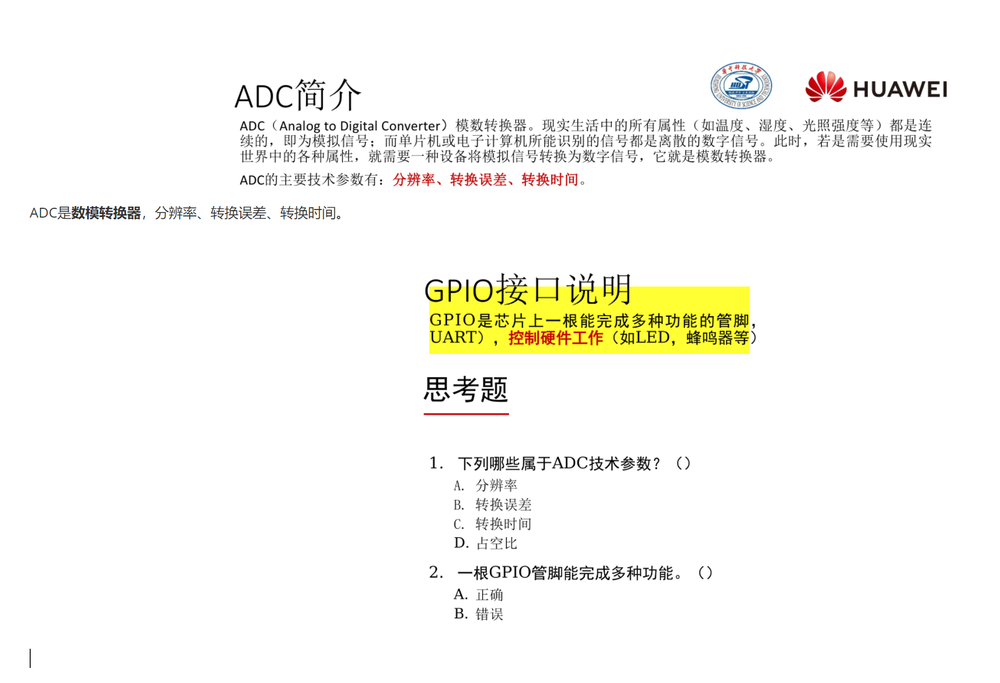
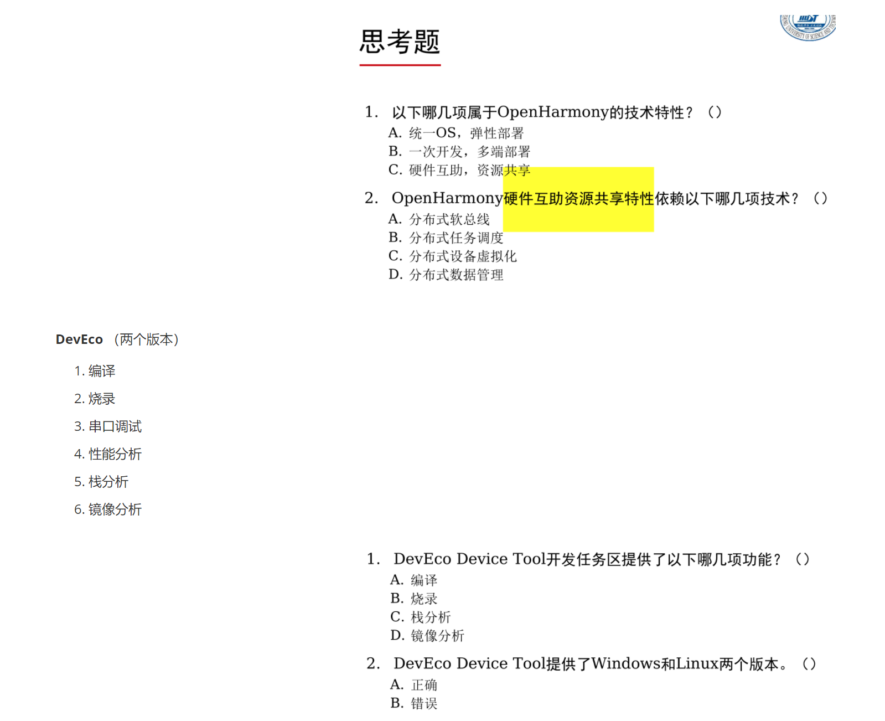

> 理论课

[成绩评定：理论课](操作系统课件复习/考试复习版本合订版.pdf#page=4&selection=4,0,4,3)

> 实验课程

[实验报告提交要求以及实验课成绩评定](操作系统课件复习/考试复习版本合订版.pdf#page=5&selection=7,0,7,4)

# 操作系统基本概念

操作系统：
1. 软件和硬件资源的分配
2. 控制和协调并发活动
3. 提供用户接口

两个关键：
1. 管理并调度资源
2. 为用户提供接口

> 操作系统的地位

[操作系统的地位](操作系统课件复习/考试复习版本合订版.pdf#page=13&selection=4,0,4,7)

机器语言之上，汇编语言以下

> 操作系统的功能

[操作系统的功能](操作系统课件复习/考试复习版本合订版.pdf#page=16&selection=0,0,1,0)

> OS会在任何时候和任何地点暂停或继续任何程序的运行

## 操作系统的功能

- 进程管理
	- 进程控制：创建，暂停，唤醒，撤销
	- 进程调度：调度策略，优先级
	- 进程通信：进程间通信
- 内存管理、存储管理
	- 内存分配
	- 内存共享
	- 内存保护
	- 内存扩充
	- 虚拟内存
- 设备管理
	- 设备的分配和回收
	- 设备的驱动机制/传输控制
	- 为应用提供统一接口访问设备（设备无关性）
	- 高效存取/设备缓冲机制
- 文件管理
	- 文件用户接口
	- 存储空间管理
	- 文件的操作
	- 目录的操作
	- 存取权限管理

> 操作系统的性能/评价指标

[操作系统的性能/评价指标](操作系统课件复习/考试复习版本合订版.pdf#page=24&selection=0,7,2,4)

- 吞吐率
- 资源利用率
- 响应能力
- 可移植性
- 可靠性

## 操作系统发展的四个典型阶段

- 手工操作（无操作系统）
- 单道批处理系统（[CPU和外设效率低](操作系统课件复习/考试复习版本合订版.pdf#page=34&selection=0,0,2,4)）
	- 管理员将多个作业输入到**磁盘**形成作业队列
	- 监控程序（也叫做监督程序，起着操作系统的作用）依次自动处理磁盘中每个作业
	- 装入—运行—撤出—装入—运行—撤出
	- 两种实现方式：
		- 联机批处理：主机负责运算，同时控制输入/输出；系统效率低
		- 脱机批处理：主机负责运算，卫星机负责输入/输出；系统效率高（脱机指的是是否脱离主机）
- 多道批处理系统
	- **内存**中存放多道程序，当某道程序因为某种原因（例如请求I/O时）不能继续运行时，监控程序/OS便调度另一道程序投入运行，这样使CPU尽量处于忙碌状态，提高系统效率。
	- [多道程序设计思想：有个图片值得一看](操作系统课件复习/考试复习版本合订版.pdf#page=38&selection=0,0,0,8)
		- 实现资源共享
			- 时分：分成多个时段：不同进程错开时段使用
			- 空分：分成多个单元：不同进程使用不同单元
		- 多个程序同时在计算机/虚拟机上运行
	- 60年代硬件的两个重大进展：
		- 中断技术：CPU收到外部信号（中断信号）后，转去处理外部事件，处理完毕后回到中断处（断点）继续原来工作
		- 通道技术：专门处理外设与内存之间数据传输的处理机
	- 缺点：
		- 作业处理时间长
		- 运行过程不确定
		- 交互能力差
- 分时操作系统
	- 交互性高
	- 响应快速
	- 多任务/多用户
	- 中断技术
	- 大规模集成电路
	- 多终端计算机
		- 用户通过终端连接主机，通过终端与主机交互。
		- 主机采用**分时技术**轮流为每个终端服务。

分时技术：主机以很短的“时间片”为单位，把CPU轮流地分配给每个作业（终端/用户）使用，直到全部作业被运行完。

[分时操作系统的实例](操作系统课件复习/考试复习版本合订版.pdf#page=44&selection=27,0,27,9)

Linux：50ms或者可设置
Windows：？

[操作系统的进一步发展](操作系统课件复习/考试复习版本合订版.pdf#page=50&selection=4,0,4,10)

## 各种操作系统

- 实时操作系统/嵌入式操作系统
	- 硬实时系统
	- 软实时系统
	- [典型实时操作系统](操作系统课件复习/考试复习版本合订版.pdf#page=54&selection=4,0,4,8)
- 嵌入式系统使用的操作系统
	- 实时操作系统 ∈ 嵌入式操作系统
- 多处理机系统
	- 包含两个或多个功能相当的处理器（CPU）
	- 共享：内存，I/O通道、外设
	- 单一操作系统控制
	- 具有一定的并行处理能力
- 网络操作系统
	- 通过协议将多台计算机互连实现资源共享和信息传递的计算机系统。
	- 网络操作系统 = 普通操作系统 + 网络通信 + 网络服务
	- 主机独立自治
	- 通信协议
	- IP/端口的标识
- 分布式操作系统
	- 分布式系统：通过网络将多个通用资源部件互联，并能对资源进行全局统一管理和调度的计算机系统。
	- 可运行分布式程序
	- 主机自治又相互协调
	- 可扩展性 | 高可靠性
	- 与计算机网络的区别
		- 支持单点登录（虚拟为“单台”计算机）
		- 支持资源透明存取（计算机网络：通过IP指明主机）
		- 支持合作运算（计算机网络：不支持）

[操作系统“虚拟计算机”的概念](操作系统课件复习/考试复习版本合订版.pdf#page=67&selection=0,0,0,14)
操作系统“虚拟计算机”的概念：面对用户，裸机配置操作系统后称为操作系统虚拟机

## 操作系统的逻辑结构

逻辑结构指的是OS的设计和实现思路

### 逻辑结构的种类

- 整体式结构（单体式结构，宏内核结构，也就是常说的微内核和大内核）
- 层次式结构
- 微内核结构

#### 整体式结构

- 以模块为基本单位构建，每个模块具有特定的功能
- 操作系统由大量过程构成。每个过程都有明确参数列表、返回值类型。大多数过程是可以相互间调用。

优点：
- 模块的设计、编码和调试独立
- 模块之间可以自由调用

缺点：
- 错误容易扩散
- 开发和维护困难
- 可伸缩性差

[整体式OS实例：也就是所谓的大内核结构](操作系统课件复习/考试复习版本合订版.pdf#page=73&selection=0,0,0,7)：
- Linux
- Unix

#### 分层结构

功能模块按调用次序排若干层，各层单向依赖或单向调用。
分层原则：
- 最底层：硬件相关
- 较低层：共性的、活跃的服务
- 中间层：按调用次序/消息传递顺序
- 最顶层：用户策略/用户交互
层次结构的优点：
- 结构清晰，避免循环调用
- 整体问题局部化，系统的正确性容易保证
- 有利于操作系统的移植、维护、扩充

#### 微内核结构

操作系统 = 微内核 + 核外服务器


##### 微内核

- 足够小，提供OS最基本的核心功能和服务
- 实现与硬件紧密相关的处理
- 实现一些较基本的功能
- 负责客户和服务器间的通信

##### 核外服务器

- 完成OS绝大部分功能，等待客户提出请求
- 由若干服务器或进程共同构成，例如：进程/线程服务器，虚存服务器，设备管理服务器等，以进程形式运行在用户态

[典型的微内核操作系统](操作系统课件复习/考试复习版本合订版.pdf#page=79&selection=8,0,8,10)：HarmonyOS

[微内核和单体内核（宏内核）比较](操作系统课件复习/考试复习版本合订版.pdf#page=80&selection=2,0,2,15)


# 操作系统依赖的基础硬件

- CPU
- 内存
- 中断
- 时钟

## CPU

三总线：地址总线 | 数据总线 | 控制总线

三总线连接CPU、RAM和ROM、IO接口


### CPU结构

控制单元 | 运算单元 | 寄存器组

### CPU功能

按一定逻辑流程执行指令流

#### 特权指令

类别：
- 涉及外部设备的输入/输出指令
- 修改特殊寄存器的指令
- 改变机器状态的指令

举例：
- LGDT/LIDT/CLTS：装载特殊寄存器
- STI/CTI：允许和禁止中断
- HALT：停止CPU的工作
- IN/OUT：执行I/O操作

### CPU态

- CPU的工作模式
- 对资源和指令使用权限的描述

- 核态
	- 能够访问所有资源和执行所有指令
	- 管理程序/OS内核
- 用户态
	- 仅能访问部分资源，其它资源受限
	- 用户程序
- 管态
	- 介于核态和用户态之间

硬件和OS对CPU的观察：
- 硬件按“态”来区分CPU的状态
- OS按“进程”来区分CPU的状态

Ring 0 ~ Ring 3 （Ring 0 最核心， Ring 3最外层）

段Segment：一段连续的内存
段描述符Descriptor：描述段的属性， 8字节
- 段基址
- 段界限
- 段属性
	- 段类型
	- 该段的特权级（D.P.L）
	- 是否在内存
	- ……

案例：[程序段A访问程序段B时的权限检查](操作系统课件复习/考试复习版本合订版.pdf#page=93&selection=5,4,5,20)

【案例】程序段A访问程序段B时的权限检查（态）
JMP B 或 CALL B
程序A的特权级：
- CPL = 0..3（当前特权级）
- RPL = 0..3（请求特权级）
程序B的特权级
- DPL=0..3（描述符特权级）

> 基本原则：同级可访问

|  | 特权级（低→高） | 特权级（高→低） | 相同特权级 |
| ---- | ---- | ---- | ---- |
| 一致代码段 | Yes | No | Yes |
| 非一致代码段 | No | No | Yes |
| 数据段 | No | Yes | Yes |

用户态向核态转换：
- 用户请求OS提供服务
- 用户进程产生错误（内部中断）
- 用户态企图执行特权指令
- 发生中断

核态向用户态转换的情形：
- 一般是中断返回：IRET

## 内存

理想存储体系：速度快，容量大，成本低
实际存储体系：
- 寄存器
- 高速缓存cache
- 主存
- 硬盘

## 中断机制

定义：指CPU对突发的外部事件的反应过程或机制

CPU收到外部信号（中断信号）后，停止当前工作，转去处理该外部事件，处理完毕后回到原来工作的中断处（断点）继续原来的工作。

中断源：引起系统中断的事件称为中断源

中断类型：
- 强迫中断和自愿中断
- 外中断（中断）和内中断（俘获）
- 外中断：不可屏蔽中断和可屏蔽中断

断点：程序中断的地方
- 将要执行的下一条指令的地址
- CS：IP（FLAGS、SS、SP）

现场：程序正确运行所依赖的信息集合。
eg：PSW（程序状态字）、相关寄存器、断点

现场的处理
现场：进入中断服务程序之前：CPU→栈
现场恢复：退出中断服务程序之后：栈→CPU

### 中断响应过程

- 识别中断源
- 保护断点
- 保护现场
- 进入中断服务程序
- 恢复现场
- 中断返回

中断响应的实质：
- 交换指令执行地址
- 交换CPU的态
- 涉及到的工作：
	- 现场保护和恢复
	- 参数传递（通信）

引入中断的目的：
- 实现并发活动
- 实现实时处理
- 故障自动处理

## 基本输入输出系统/BIOS

### BIOS简介

系统BIOS是固件（firmware），地址范围：F0000- FFFFF
系统BIOS作用是当加电或复位开始执行时加电自检（POST）

### POST加电自检

按下PowerOn或Reset开始执行POST
初始化基本硬件：
- CPU
- 内存
- 显卡
自检错误通过喇叭鸣叫提示

计算机首条指令在（ FFFF0 ）单元
```
JMP POST ; 加电自检
```


### CMOS设置

交互式设置系统参数

### 基本I/O服务

BIOS中断
BIOS使用的中断类型号为10H ~ 1FH


例：INT 13H 软盘I/O调用的子功能 （例：02H读扇区）


> 读第21号扇区到内存10000h处
> 注：假定每个磁道有18个扇区
> 

### POST之后

依次查找其它设备并初始化

查找显卡，执行显卡BIOS(C0000-C7FFF)
查找IDE控制器，执行IDE BIOS (C8000-CBFFF)
显示启动信息：各组件版权信息......
查找/设置其他外设：
- 配置寄存器
- 启动设备BIOS

### 系统自举/加载OS

- 现场引导方式：OS文件存储在本地存储设备
- 下载引导方式：OS文件存储在网络存储设备

现场引导方式示意图：


### 操作系统的启动

#### 实模式

实模式（实地址模式，REAL MODE）
- 按照8086方法访问0~FFFFFh空间
- 寻址方式：物理地址(20位) = 段地址：偏移地址
- CPU单任务运行

实模式的1M空间
- 前面640K 【00000 -- 9FFFF】 ：基本内存
- 中间128K 【A0000 -- BFFFF】 ：显卡显存
- 末尾256K 【C0000 -- FFFFF】 ：BIOS

> 实模式和保护模式的区别：
> https://blog.csdn.net/cqwei1987/article/details/107369171

实模式：（即实地址访问模式）是Intel公司80286及以后的x86(80386,80486和80586等)兼容处理器（CPU）的一种操作模式。

实模式被特殊定义为20位地址内存可访问空间上，这就意味着它的容量是2的20次幂（1M）的可访问内存空间（物理内存和BIOS-ROM），软件可通过这些地址直接访问BIOS程序和外围硬件。

实模式下处理器没有硬件级的内存保护概念和多道任务的工作模式。但是为了向下兼容，所以80286及以后的x86系列兼容处理器仍然是开机启动时工作在实模式下。80186和早期的处理器仅有一种操作模式，就是后来我们所定义的实模式。

实模式虽然能访问到1M的地址空间，但是由于BIOS的映射作用（即BIOS占用了部分空间地址资源），所以真正能使用的物理内存空间（内存条），也就是在640k到924k之间。
1M地址空间组成是由16位的段地址和16位的段内偏移地址组成的。

用公式表示为：物理地址 = 左移4位的段地址 + 偏移地址。

实模式寻址采用和8086相同的16位段和偏移量，最大寻址空间1MB，最大分段64KB。可以使用32位指令。32位的x86 CPU用做高速的8086。

> 刚才说了8086CPU数据总线为16位，其地址总线为20位，这样它能寻址的能力其实是2^20=1MB，这也就是实模式下CPU的最大寻址能力。

#### 保护模式

寻址方式：段(16位)和偏移量(32位)，寻址4GB
CPU支持多任务

>  实模式和保护模式的区别：
> https://blog.csdn.net/cqwei1987/article/details/107369171

286处理器体系结构引入了地址保护模式的概念，处理器能够对内存及一些其他外围设备做硬件级的保护设置（保护设置实质上就是屏蔽一些地址的访问）。

保护模式：寻址采用32位段和偏移量，最大寻址空间4GB，最大分段4GB (Pentium Pre及以后为64GB)。在保护模式下CPU可以进入虚拟8086方式，这是在保护模式下的实模式程序运行环境。

#### 实模式和保护模式的区别

>  实模式和保护模式的区别：
> https://blog.csdn.net/cqwei1987/article/details/107369171

实模式和保护模式的区别：从表面上看，保护模式和实模式并没有太大的区别，二者都使用了内存段、中断和设备驱动来处理硬件，但二者有很多不同之处。我们知道，在实模式中内存被划分成段，每个段的大小为64KB，而这样的段地址可以用16位来表示。内存段的处理是通过和段寄存器相关联的内部机制来处理的，这些段寄存器（CS、DS、 SS和ES）的内容形成了物理地址的一部分。具体来说，最终的物理地址是由16位的段地址和16位的段内偏移地址组成的。用公式表示为：物理地址 = 左移4位的段地址 + 偏移地址。

在保护模式下，段是通过一系列被称之为“描述符表”的表所定义的。段寄存器存储的是指向这些表的指针。用于定义内存段的表有两种：全局描述符表(GDT) 和局部描述符表(LDT)。**GDT是一个段描述符数组，其中包含所有应用程序都可以使用的基本描述符**。在实模式中，段长是固定的(为64KB)，而在保护模式中，段长是可变的，其最大可达4GB。**LDT也是段描述符的一个数组。与GDT不同，LDT是一个段，其中存放的是局部的、不需要全局共享的段描述符**。**每一个操作系统都必须定义一个GDT，而每一个正在运行的任务都会有一个相应的LDT**。每一个描述符的长度是8个字节。当段寄存器被加载的时候，段基地址就会从相应的表入口获得。描述符的内容会被存储在一个程序员不可见的影像寄存器(shadow register)之中，以便下一次同一个段可以使用该信息而不用每次都到表中提取。物理地址由16位或者32位的偏移加上影像寄存器中的基址组成。

保护模式同实模式的根本区别是进程内存受保护与否。可寻址空间的区别只是这一原因的果。**实模式将整个物理内存看成分段的区域**，程序代码和数据位于不同区域，系统程序和用户程序没有区别对待，而且每一个指针都是指向"实在"的物理地址。这样一来，用户程序的一个指针如果指向了系统程序区域或其他用户程序区域，并改变了值，那么对于这个被修改的系统程序或用户程序，其后果就很可能是灾难性的。

为了克服这种低劣的内存管理方式，处理器厂商开发出保护模式。这样，**物理内存地址不能直接被程序访问，程序内部的地址（虚拟地址）要由操作系统转化为物理地址去访问，程序对此一无所知**。至此，进程（这时我们可以称程序为进程了）有了严格的边界，任何其他进程根本没有办法访问不属于自己的物理内存区域，甚至在自己的虚拟地址范围内也不是可以任意访问的，因为有一些虚拟区域已经被放进一些公共系统运行库。这些区域也不能随便修改，若修改就会有：SIGSEGV（linux 段错误）；非法内存访问对话框（windows 对话框）。

CPU启动环境为16位实模式，之后可以切换到保护模式。但从保护模式无法切换回实模式。

#### 启动过程

从加电到用户工作环境准备好的过程

- 初始引导
- 核心初始化
- 系统初始化

##### 初始引导

把OS内核装入内存并使之开始工作接管计算机系统
引导程序：MBR（Master BOOT Record）


过程：
1. 加电，然后执行第一条指令`JMP POST`
2. BIOS中的启动程序运行
3. 启动程序：
	1. 读取0面0道第1扇区内容（MBR）
	2. 加载MBR中的引导程序到内存
4. 引导程序：
	1. 根据相关参数，读取硬盘指定位置的文件到内存
	2. 加载硬盘上的OS内核，并初始化基本参数

##### 核心初始化

OS内核初始化系统的核心数据
工作：
- 各种寄存器的初始化
- 存储系统和页表初始化
- 核心进程构建

##### 系统初始化

为用户使用系统作准备，使系统处于待命状态
工作：
- 初始化文件系统
- 初始化网络系统
- 初始化控制台
- 初始化图形界面

#### DOS的启动过程

1. POST：加电后BIOS启动主机自检程序
2. 初始引导：
	1. BIOS从MBR读入引导程序，装入内存的特定位置
	2. 引导程序运行将io.sys及msdos.sys读入内存
	3. DOS运行起来取代BIOS接管整个系统
3. 核心初始化：操作系统读入config.sys配置系统核心
4. 系统初始化：读入Command.com，执行autoexec.bat，系统待命

#### Windows的启动过程

1. POST：加电后BIOS启动主机自检程序
2. 初始引导：
	1. BIOS从MBR读入引导程序，装入内存的特定位置
	2. 引导程序启动DOS7.0，调入操作系统核心
	3. WINDOWS开始接管系统
3. 核心初始化：资源状态、核心数据等初始化
4. 系统初始化：GUI界面生成、系统处于待命/消息接受状态

#### LINUX的启动过程

1. POST
2. MBR
3. KERNEL映像
4. KERNEL映像一边自解压一边执行
5. 内核初始化
6. 内核启动
7. init进程启动

三个案例：[利用Grub手工启动OS](操作系统课件复习/考试复习版本合订版.pdf#page=127&selection=2,1,5,2)

#### MBR

Main Boot Record
MBR 也就是主引导记录，位于主启动扇区（硬盘的 0 磁道、0 柱面、1 扇区）中，主要记录了启动引导程序和磁盘的分区表，存放引导代码。


启动引导程序的作用：加载操作系统内核

> https://blog.csdn.net/u010783226/article/details/106069699

MBR提供BootLoader或启动管理
- 直接指向引导代码加载OS
- 提供启动选项菜单
- 跳转到PBR以加载特定OS BootLoader


## 操作系统的安装过程

把OS映像拷贝到存储空间：拷贝/安装位置：硬盘
写启动相关代码和数据：
- MBR
- PBR
- 521字节

多操作系统安装：
- MBR重写 vs. MBR追加
- 安装顺序

## 操作系统的生成

根据硬件环境和用户需要，配置和构建操作系统

操作系统生成的前提：
- 操作系统由模块构成
- 有交互式配置工具
- 有映像构建（build）工具
- **内核开源**

eg：Linux操作系统生成
1. 获取内核源码
2. 配置内核
3. 重新编译新内核
4. 编译和安装模块
5. 配置启动选项

# 用户界面

## 用户环境

用户环境：桌面环境和命令行环境
用户环境的构造：按照用户要求和硬件特性安装和配置操作系统
- 提供操作命令和界面
- 提供系统用户手册

## 用户界面

操作系统提供给用户控制计算机的机制（用户接口）

包含：操作界面和系统调用（系统功能调用）

### 操作界面

- 图形用户接口
- 操作命令（普通命令）例如：[DOS典型命令](操作系统课件复习/考试复习版本合订版.pdf#page=153&selection=0,0,0,10)和[Linux典型命令](操作系统课件复习/考试复习版本合订版.pdf#page=154&selection=4,0,5,4)
- 批处理和脚本程序：在控制台环境下自动处理一批命令
	- Windows：批处理程序（bat/PowerShell）
	- Linux：Shell脚本程序

批处理的特点：
- 普通命令的集合，按批执行，由command解释执行
- 支持变量替换、条件、转移、循环、注释等语法
- 文件后缀*.BAT，**解释执行**

#### 脚本程序

脚本程序是有一定逻辑顺序和语法结构的命令序列，能完成较复杂的功能和人机交互。
Shell脚本程序是文本文件（具有可执行属性X）

运行脚本程序的三个方法：
1. 直接运行（用缺省版本Shell运行脚本程序）
2. 在命令行上指定某个特定版本Shell执行脚本
3. 在脚本首行指定特定Shell执行当前脚本

Shell是操作系统与用户的交互机制（操作界面）


通过Shell（/控制台）执行用户命令
组织和管理用户命令的执行和结果展示

> [Shell的发展与分类](操作系统课件复习/考试复习版本合订版.pdf#page=164&selection=7,0,8,6)
> 

[Bash主要功能](操作系统课件复习/考试复习版本合订版.pdf#page=165&selection=4,0,5,4)

#### 重定向操作

[重定向操作的例子（windows）](操作系统课件复习/考试复习版本合订版.pdf#page=166&selection=0,0,2,1)

[标准输入/输出设备（文件）](操作系统课件复习/考试复习版本合订版.pdf#page=167&selection=0,0,2,8)


[重定向操作（Linux）](操作系统课件复习/考试复习版本合订版.pdf#page=170&selection=0,0,2,1)

把命令缺省输入来源或输出方向修改为其他文件/设备

#### Linux管道

程序相连，一个程序的输出作为另一程序的输入
管道操作符 |
“|”符用于连接左右两个命令，将|左边命令的执行结果（输出）作为|右边命令的输入

### 系统调用

系统调用(System Call，System Service Call)，操作系统内核为应用程序提供的服务/函数。

eg：printf,exit,fopen,fgetc,21H(09)
printf 特点：涉及显卡和进程操作
利用DOS 21H中断显示字符串（09号功能）

特点：
- 内核实现
- 存取核心资源或硬件
- 调用过程产生自愿中断，用户态 ↔ 核态


#### 系统调用表

全部系统调用的入口列表
- 有序排列
- 系统调用号：系统调用的唯一编号


#### 系统调用的一般调用形式

访管指令： SVC X
SVC = SuperVisor Call
X = 系统调用的编号

[DOS的系统调用（部分）](操作系统课件复习/考试复习版本合订版.pdf#page=179&selection=4,0,4,12)
[Linux的系统调用（部分）](操作系统课件复习/考试复习版本合订版.pdf#page=180&selection=4,0,4,14)
[DOS：9号系统调用（屏幕输出字符串）(输出Hello)](操作系统课件复习/考试复习版本合订版.pdf#page=182&selection=4,2,4,30)
[DOS：1号系统调用(键盘输入字符) (键盘输入1/2?)](操作系统课件复习/考试复习版本合订版.pdf#page=183&selection=4,2,4,30)
[Linux：4号系统调用(写文件）（屏幕输出字符串）](操作系统课件复习/考试复习版本合订版.pdf#page=185&selection=4,2,4,28)
[Linux的系统调用表](操作系统课件复习/考试复习版本合订版.pdf#page=186&selection=3,0,4,11)

总结：
系统调用的一般调用形式`SVC N`
具体OS中系统调用的调用形式：
- DOS： `INT 21H + AH`
- Linux：`INT 80H + EAX`    例子：[80H中断的中断服务程序system_call( )](操作系统课件复习/考试复习版本合订版.pdf#page=198&selection=0,0,2,14)

INT XXH = SVC指令
AH/EAX = 系统调用的编号：N

#### 系统调用的执行过程

（中断的过程）


隐式系统调用
- 系统API函数
- 在高级语言中使用
- 包含INT 80h指令（软中断）

Linux系统调用的工作原理


[案例：read系统调用的工作原理](操作系统课件复习/考试复习版本合订版.pdf#page=194&selection=0,0,2,9)
[系统调用表](操作系统课件复习/考试复习版本合订版.pdf#page=197&selection=6,0,6,5)

#### SYS_CALL_TABLE的结构

```
.data
ENTRY(sys_call_table) 
.long SYMBOL_NAME(sys_ni_syscall) // 0 
.long SYMBOL_NAME(sys_exit) // 1 
.long SYMBOL_NAME(sys_fork) // 2 
.long SYMBOL_NAME(sys_read) // 3 
.long SYMBOL_NAME(sys_write) // 4 
.long SYMBOL_NAME(sys_open) // 5	
```
Ref：/usr/src/linux/arch/i386/kernel/entry.S

#### 系统调用编号的声明

格式： # define __NR_CallName ID

```
#define __NR_exit 1 /* exit 的系统功能号 */
#define __NR_fork 2 /* fork 的系统功能号 */ 
#define __NR_read 3 /* read 的系统功能号 */ 
#define __NR_write 4 /* write 的系统功能号 */ 
#define __NR_open 5 /* open 的系统功能号 */ 
#define __NR_close 6 /* close 的系统功能号 */
```

Linux-source-2.6.38  ./arch/x86/include/asm/unistd_32.h

#### 系统调用函数的声明

`.long sys_XXXX`

XXX是函数名，有前缀sys_修饰，`./kernel/sys.c`
添加位置是末尾，且注意添加顺序，注意修饰词 `asmlinkage`

# 进程管理

## 进程概念

程序运行在并发环境中的问题
- 运行过程不确定
- 结果不可再现
- 程序运行被干扰（开放性）
- 程序的概念不足描述运行过程并确保结果正确！

新概念：进程
- 对运行过程施加制约或管理
- 运行过程——进程 

进程定义：进程是程序在并发环境下，在某个数据集合上的一次运行活动。
数据集合：软/硬件环境，多个进程共存/共享的环境。

## 进程特征

- 动态性：进程是程序的一次执行过程，动态产生/消亡
- 并发性：进程可以同其他进程一起向前推进
- 异步性：进程按各自速度向前推进
- 独立性：进程是系统分配资源和调度CPU的单位

进程与程序的区别：
- 动态与静态
	- 进程是动态的：程序的一次执行过程
	- 程序是静态的：一组指令的有序集合
- 暂存与长存
	- 进程是暂存的：在内存驻留
	- 程序是长存的：在介质上长期保存
- 程序和进程的对应：一个程序可能有多个进程

## 进程的状态

- 运行状态：进程已经占有CPU，在CPU上运行
- 就绪状态：具备运行条件但由于无CPU，暂时不能运行
- 阻塞状态：因为等待某项服务完成或信号来到而不能运行的状态，例如等待：系统调用，I/O操作，合作进程的服务或信号

进程状态的变迁：进程的状态可以依据一定的条件相互转化
[进程状态的变迁](操作系统课件复习/考试复习版本合订版.pdf#page=213&selection=5,0,5,7)

具有新建(new)和终止(terminate)状态的进程状态：
运行 | 就绪 | 阻塞 + 新建 | 终止


支持挂起(suspend)和解挂(resume)操作的进程状态


有没有下列状态转换？
阻塞→运行
就绪→阻塞

[案例：Linux进程的状态1](操作系统课件复习/考试复习版本合订版.pdf#page=217&selection=0,0,2,5)
[案例：Linux进程的状态2](操作系统课件复习/考试复习版本合订版.pdf#page=218&selection=0,0,2,5)
[案例：ps命令（显示Process状态）](操作系统课件复习/考试复习版本合订版.pdf#page=219&selection=0,0,4,3)
[案例：ps命令（显示Process状态）ps aux](操作系统课件复习/考试复习版本合订版.pdf#page=220&selection=0,0,4,3)以及[STAT字段的含义](操作系统课件复习/考试复习版本合订版.pdf#page=221&selection=8,0,9,5)
[案例：查看不可中断的睡眠态(D)](操作系统课件复习/考试复习版本合订版.pdf#page=222&selection=0,0,2,3)
[案例：查看僵尸态(Z)](操作系统课件复习/考试复习版本合订版.pdf#page=223&selection=0,0,2,3)

## 进程控制块

进程控制块(Process Control Block，PCB)，进程控制块(Process Control Block，PCB)
PCB是进程的标志
创建进程时创建PCB；进程撤销后PCB同时撤销。
**进程 ＝ 程序 ＋ PCB**


PCB中的基本成员：
- name（ID）：进程名称（标识符）
- state：状态/status
- priority：优先级
- start_addr：程序入口地址
- next：指向下一个PCB的指针
- cpu_status：现场保留区(堆栈)
- comm_info：进程通信机制/信号机制
- process_family：家族关系
- own_resource：资源清单

Linux进程控制块PCB：task_struct
- 进程状态
- 进程调度信息
- 标识符
- 进程通信信息
- 链接信息
- 时间和计时器
- 文件系统 
- 虚拟内存信息
- 处理器信息/现场保留区

进程队列或进程遍历相关的成员
所有进程放在一个双向链表中： task list

## 进程的上下文

> Linux：上下文，进程上下文和中断上下文概念，上下文切换
> https://blog.csdn.net/lqy971966/article/details/119103989

### 上下文context

上下文简单说来就是一个环境，相对于进程而言，就是进程执行时的环境
**具体来说就是各个变量和数据，包括所有的寄存器变量、进程打开的文件、内存信息等**

### 进程的上下文

可以说：当一个进程在执行时，CPU的所有寄存器中的值、进程的状态以及堆栈中的内容被称为该进程的上下文
也可以说：**所谓的“进程上下文”，可以看作是用户进程传递给内核的这些参数以及内核要保存的那一整套的变量和寄存器值和当时的环境等**

### 进程切换

当内核需要切换到另一个进程时，它需要保存当前进程的所有状态，即保存当前进程的上下文，以便在再次执行该进程时，能够切换回中断时的状态执行下去。

分时系统的进程切换过程：
- 进程的上下文在CPU中交换
- 换入进程上下文进入CPU（从栈+PCB上来）
- 换出进程上下文离开CPU（到栈+PCB上去）


## 进程控制

进程控制的概念：在进程生存全期间，对其全部行为的控制

四个典型的进程控制：
- 创建
- 撤销
- 阻塞
- 唤醒


### 创建进程

创建一个具有指定标识（ID）的进程

参数：进程标识、优先级、进程起始地址、CPU初始状态、 资源清单等

过程：
1. 创建一个空白PCB
2. 赋予进程标识符ID
3. 为进程分配空间
4. 初始化PCB（默认值）
5. 插入相应的进程队列（新进程插入就绪队列）


### 进程撤销

撤销一个指定的进程，收回进程所占有的资源，撤销该进程的PCB

进程撤销的时机/事件：
- 正常结束
- 异常结束
- 外界干预

参数：撤销进程的ID

进程撤销的实现：
1. 在PCB队列中检索出该PCB
2. 获取该进程的状态
3. 若该进程处在运行态，立即终止该进程
	1. 先“撤销”子进程（递归/可选）
	2. 或将子进程挂接到init进程下
4. 释放进程占有的资源
5. 将进程从PCB队列中移除

### 进程阻塞

停止进程执行，变为阻塞

阻塞的时机/事件：
- 请求系统服务：由于某种原因，OS不能立即满足进程的要求
- 启动某种操作：进程启动某操作，阻塞等待该操作完成
- 新数据尚未到达：A进程要获得B进程的中间结果，A进程等待
- 无新工作可作：进程完成任务后，自我阻塞，等待新任务到达（idle进程：pause）

参数：
- 阻塞原因
- 不同原因构建有不同的阻塞队列

进程阻塞的实现：
1. 停止运行
2. 将PCB “运行态”改“阻塞态”
3. 插入对应的阻塞队列
4. 转调度程序

### 进程唤醒

唤醒处于阻塞队列当中的某个进程

引起唤醒的时机/事件：
- 系统服务由不满足到满足
- IO完成
- 新数据到达
- 提出新请求

参数：进程的标识

> Linux 0.11 进程睡眠和唤醒

[Linux 0.11 进程睡眠和唤醒](操作系统课件复习/考试复习版本合订版.pdf#page=250&selection=1,0,3,7)

## 进程控制原语

原语：由若干指令构成的具有特定功能的函数，具有原子性，其操作不可分割

进程控制原语：创建原语 | 撤消原语 | 阻塞原语 | 唤醒原语

## Windows进程控制

[Windows进程控制](操作系统课件复习/考试复习版本合订版.pdf#page=254&selection=2,0,2,11)：有很多实际的代码，比如通过编程启动一个程序或者打开记事本

创建Windows新进程：
1. 创建进程内核对象，创建虚拟地址空间
2. 装载EXE和/或DLL的代码和数据到地址空间中
3. 创建主线程和线程内核对象
4. 启动主线程，进入主函数main

[案例：CreateProcess应用例子：自动执行一批程序](操作系统课件复习/考试复习版本合订版.pdf#page=259&selection=0,0,5,1)

## Linux进程控制

创建进程——fork   `pid_t pid = fork( )`

父进程和子进程：
- 子进程：新建的进程
- 父进程：fork( )的调用者
- 子进程是父进程的复制
- 父进程和子进程并发运行

> Linux系统——fork()函数详解(看这一篇就够了！！！)
> https://blog.csdn.net/cckluv/article/details/109169941

- pid_t fork(void);    //pid_t为int类型，进行了重载
- pid_t getpid();    // 获取当前进程的 pid 值
- pid_t getppid();    //获取当前进程的父进程 pid 值

`fork`用于创建一个进程，所创建的进程复制父进程的**代码段/数据段/BSS段/堆/栈等所有用户空间信息**
在内核中操作系统重新为其申请了一个PCB，并使用父进程的PCB进行初始化


我们将 A 进程， 也就是调用 fork 的进程称之为**父进程**， 而新的进程（B 进程）称之为**子进程**。

看个例子
```
int main()
{
	pid_t fpid; //fpid表示fork函数返回的值
	int count = 0;
	fpid = fork();
	if (fpid < 0)
		printf("error in fork!");
	else if (fpid == 0) {
		printf("i am the child process, my process id is %d/n", getpid());// 获取当前进程的 pid 值
		printf("我是爹的儿子/n");
		count++;
	}
	else {
		printf("i am the parent process, my process id is %d/n", getpid());// 获取当前进程的 pid 值
		printf("我是孩子他爹/n");
		count++;
	}
	printf("统计结果是: %d/n", count);
	return 0;
}
```

输出结果：  
i am the child process, my process id is 5574  
我是爹的儿子  
统计结果是: 1  
i am the parent process, my process id is 5573  
我是孩子他爹  
统计结果是: 1

为什么两个进程的fpid不同呢，这与fork函数的特性有关。

fork调用的一个奇妙之处就是它仅仅被调用一次，却能够返回两次，它可能有三种不同的返回值：
- 在父进程中，fork返回新创建子进程的进程ID
- 在子进程中，fork返回0
- 如果出现错误，fork返回一个负值

因此我们可以通过fork返回的值来判断当前进程是子进程还是父进程。
**注： fork 调用生成的新进程与其父进程谁先执行不一定，哪个进程先执行要看系统的进程调度策略**

举个例子来解释fpid的值为什么在父子进程中不同：“fpid，也就是fork函数的返回值相当于链表，进程形成了链表，父进程的fpid(p 意味point)指向子进程的进程id，因为子进程没有子进程，所以其fpid为0

**还有人可能疑惑为什么不是从#include处开始复制代码的，这是因为fork是把进程当前的情况拷贝一份，执行fork时，进程已经执行完了int count=0；fork只拷贝下一个要执行的代码到新的进程。**

看到这里大家对fork()有个大致了解了，让我们来看个例题：
```
int main(void)
{
	int i = 0;
	printf("i son/pa ppid pid  fpid/n");
	//ppid指当前进程的父进程pid
	//pid指当前进程的pid,
	//fpid指fork返回给当前进程的值
	for (i = 0; i<2; i++){
		pid_t fpid = fork();
		if (fpid == 0)
			printf("%d child  %4d %4d %4d/n", i, getppid(), getpid(), fpid);
		else
			printf("%d parent %4d %4d %4d/n", i, getppid(), getpid(), fpid);
	}
	return 0;
}
```

运行结果是：
```
    i son/pa ppid pid  fpid
    0 parent 2043 3224 3225
    0 child  3224 3225    0
    1 parent 2043 3224 3226
    1 parent 3224 3225 3227
    1 child     1 3227    0
    1 child     1 3226    0 
```

我们来一步步分析：

第一步： 在父进程中，指令执行到for循环中，i=0，接着执行fork，fork执行完后，系统中出现两个进程，分别是p3224和p3225（后面都用pxxxx表示进程id为xxxx的进程）。可以看到父进程p3224的父进程是p2043，子进程p3225的父进程正好是p3224。
我们用一个链表来表示这个关系： **p2043->p3224->p3225**
第一次fork后，p3224（父进程）的变量为i=0，fpid=3225（fork函数在父进程中返向子进程id）
所以打印出结果：  
**0 parent 2043 3224 3225**
**0 child 3224 3225 0**

第二步： 假设父进程p3224先执行，当进入下一个循环时，i=1，接着执行fork，系统中又新增一个进程p3226
对于此时的父进程：**p2043->p3224（当前进程）->p3226（被创建的子进程）**
对于子进程p3225，执行完第一次循环后，i=1，接着执行fork，系统中新增一个进程p3227
对于此进程：**p3224->p3225（当前进程）->p3227（被创建的子进程）**
从输出可以看到p3225原来是p3224的子进程，现在变成p3227的父进程。父子是相对的，这个大家应该容易理解。只要当前进程执行了fork，该进程就变成了父进程了，就打印出了parent。
所以打印出结果是：
**1 parent 2043 3224 3226**
**1 parent 3224 3225 3227**

这里不免有个问题：到p3226，p3227的父进程难道不该是p3224和p3225吗，怎么会是1呢？这里得讲到进程的创建和死亡的过程，在p3224和p3225执行完第二个循环后，main函数就该退出了，也即进程该死亡了，因为它已经做完所有事情了。p3224和p3225死亡后，p3226，p3227就没有父进程了，这在操作系统是不被允许的，所以p3226，p3227的父进程就被置为p1了，p1是永远不会死亡的。

`fork()`的执行过程
1. 申请PID
2. 申请PCB结构
3. 复制父进程的PCB
4. 将子进程的运行状态设置为不可执行的
5. 将子进程中的某些属性清零，某些保留，某些修改
6. 复制父进程的页（用到了写时拷贝技术）

**写时拷贝技术：** 父子进程在初始阶段共享所有的数据（全局、 栈区、 堆区、 代码）， 内核会将所有的区域设置为只读。 当父子进程中任意一个进程试图修改其中的数据时， 内核才会将要修改的数据所在的区域（页） 拷贝一份。
画个图就很好理解了：

写时拷贝后：（当子进程要将Hello的H改写为W的时候，才进行拷贝）


fork出错可能有两种原因：
- 当前的进程数已经达到了系统规定的上限，这时errno的值被设置为EAGAIN
- 系统内存不足，这时errno的值被设置为ENOMEM

#### fork函数的实现

`fork()`执行流程：
- 分配task_struct结构
- 拷贝父进程
	- 复制页表：复制正文段、用户数据段及系统数据段
	- 复制task_struct：修改task_struct小部分内容
- 把新进程加入进程列表
- 置新进程为就绪状态
-  fork ( ) → sys_fork ( ) → do_fork( )

[fork()——源代码](操作系统课件复习/考试复习版本合订版.pdf#page=277&selection=1,5,3,3)

#### do_fork

[do_fork()](操作系统课件复习/考试复习版本合订版.pdf#page=274&selection=0,0,0,11)

- 为子进程分配task_struct（Linux下的PCB结构体）
- 初始化子进程task_struct
- 复制父进程的file，fs，sighand，mm等信息
- ……

#### exec函数族

进程执行特定的功能（不同于父进程的功能）：
Linux启动后第1个进程是`init`进程，其他进程都是`init`子孙进程，为什么某个进程功能都不一样呢？

> linux进程---exec族函数
> https://blog.csdn.net/u014530704/article/details/73848573
> exec族函数的作用：我们用fork函数创建新进程后，经常会在新进程中调用exec函数去执行另外一个程序。当进程调用exec函数时，该进程被**完全替换**为新程序。因为调用exec函数并不创建新进程，所以前后进程的ID并没有改变。

exec函数族（包括若干函数）:
功能：在子进程空间运行指定的“可执行程序”
步骤：
1. 根据文件名找到相应的可执行程序
2. 可执行程序的内容填入子进程的地址空间
返回：
- **exec调用成功：进入新进程且不再返回**
- **exec调用失败：继续从调用点向下执行**

[exec函数族](操作系统课件复习/考试复习版本合订版.pdf#page=288&selection=0,0,1,3)

fork常规用法：
```
//子进程复制父进程
if (pid == 0){
	//子进程
}else if (pid > 0){
	//父进程
}

//子进程执行不同的程序
if (pid == 0){
	//子进程
	exec(“Exe File Name”);
}else if (pid > 0){
	//父进程
}
```

例子：服务器的多客户工作模型


#### Linux进程控制函数

- fork( ) 创建进程
- wait( ) 阻塞
- exit( ) 结束进程
- sleep( ) 休眠进程

##### 进程的阻塞wait( )

进程调用`wait(int &status)`阻塞自己

检测有无子进程结束？
- 没有：继续阻塞：等待子进程结束
- 有：收集该子进程信息并彻底销毁它，返回

`Status`接收子进程退出时的退出代码
- status：按位处理
- 若忽略子进程的退出信息`pid = wait(NULL)`

[进程的阻塞wait( )代码](操作系统课件复习/考试复习版本合订版.pdf#page=296&selection=0,0,1,7)

##### 进程的终结exit( )

调用`void exit(int status)`终结进程

进程终结时要释放资源并向父进程报告
- 利用status向父进程报告结束时的退出代码
- 变为僵尸状态，保留部分PCB信息供wait收集
	- 正常结束还是异常结束
	- 占用总系统cpu时间
	- 缺页中断次数
- 调用`schedule()`函数，选择新进程运行

[进程的终结exit( )代码](操作系统课件复习/考试复习版本合订版.pdf#page=295&selection=0,0,1,7)

##### 进程的休眠Sleep( )

`Sleep( int nSecond)`

- 进程暂停执行nSecond秒
- 系统暂停调度该进程
- 相当于windows挂起操作resume( )，挂起指定秒

[思考](操作系统课件复习/考试复习版本合订版.pdf#page=298&selection=0,0,0,2)：
- 指出程序运行步骤？
- pid_1和pid_2有什么关系？


## 线程

回顾进程的并发性：进程与进程可以并发运行（共享CPU）
进程是系统中共享CPU的最小的并发单位：
- 进程内部的指令和函数都是串行执行的
- 若多个任务要并发，则必须设计相应数量的程序

[如何在一个程序内实现两个函数的并发？](操作系统课件复习/考试复习版本合订版.pdf#page=301&selection=0,0,2,16)
answer：线程技术

### 线程的定义

线程是进程内创建的可运行模块/指令序列，能执行指定的任务，进程内可以定义多个线程，线程和线程可以并发运行。

### 线程的意义

线程提高了系统的并发性能：
- 线程的并发粒度比进程更细
- 更充分地发挥CPU的性能

线程的应用成本更低，更灵活：
- 进程为线程提供资源和地址空间
- 线程的创建，撤销和管理成本更低
- 线程间通信更容易，更灵活

### 创建线程的方法

#### Windows

CreateThread( TaskFunction)函数

功能：创建一个线程同时为其指定任务(TaskFunction)
原型：
```
HANDLE CreateThread(LPSECURITY_ATTRIBUTES lpThreadAttributes, 
					DWORD dwStackSize,  
					LPTHREAD_ROUTINE ThreadFunction, /*线程函数*/
					LPVOID lpParameter /*线程函数的参数*/ );

//线程函数原型
DWORD ThreadFunction (LPVOID lpParameter)
```

[线程技术的应用场景](操作系统课件复习/考试复习版本合订版.pdf#page=307&selection=0,0,0,9)

### 现代操作系统线程模型

进程 = 资源集 + 线程组


优点：
- 线程是进程内部更细的并发单位
- 线程相比于进程的优点：成本低 | 通信灵活
- 创建线程的方法`CreateThread/clone/pthread_create/kthread_create`
- 线程的应用场景：多任务并发

问题：
- 程序难以调试
- 并发过程难以控制
- 线程安全问题

### 进程和线程的对比

进程：
- 程序代码：代码不一定专有，可共用
- 系统堆栈空间：专用
- 进程控制块(PCB)：接受调度和记录资源
- 有独立的存储空间：**专有且内含用户空间**

线程：
- 共享进程的存储空间
	- 没有用户空间：内核线程
	- 共享用户空间：用户线程
- 轻量级进程
	- Light Weight Process，LWP
	- 共享进程空间和资源

### 线程的状态变迁


### Linux线程和分类

- 内核线程
- 用户线程

#### 内核线程

Kernel Thread
创建函数：kthread_create( )
创建、运行和撤销都在内核完成，由内核驱动
内核线程没有独立的地址空间mm=NULL，只在内核空间运行，不切换到用户空间

#### 用户线程

User Thread
通过pthread线程库创建和管理
线程库提供同步和调度的方法
用户线程不是真正的调度实体，内核对它们一无所知
- 当一个进程被抢占时，它的所有用户线程都被抢占
- 当一个用户线程被阻塞时，它会阻塞其所属的进程

## 进程的相互制约关系

进程互斥的定义（与资源共享有关系）：多个进程共享具有独占性的资源时，必须确保各进程互斥地存取资源，即确保没有任何两个进程同时存取资源。

进程内设定特定区域，所有进程互斥地访问这些区域

临界资源
- 例：共享变量 i
- 一次只允许一个进程独占访问（使用）的资源
- 临界资源的访问具有排他性

临界区
- 进程中访问临界资源的程序段
- 并发进程不能同时进入“临界区”

## 进程的同步关系

进程的同步关系：干合作进程为了共同完成一个任务，需要相互协调运行步伐：一个进程A开始某个操作之前要求另一个进程B必须已经完成另一个操作，否则进程A只能等待。


eg：司机和售票员之间的操作属于同步关系
- 司机：起步，行驶，停车
- 售票员：关门，售票，开门
操作规范：同步要求
- 司机起步前售票员先关门，否则司机等待
- 售票员开门前司机先停车，否则售票员等待

进程的同步关系的另一种解释：合作进程中某些操作之间需要满足某种先后关系或某个操作能否进行需要某个前提条件满足，否则只能等待。

*互斥关系属于特殊的同步关系*

## 同步机制

1. 当进程的某个操作不能执行时（即运行条件不满足时）能让该进程立即暂停执行
2. 当暂停的操作条件一旦满足时，能被立即唤醒继续运行
3. 同步进制在实现上需要满足原子性

临界资源
- 例：共享变量 i
- 一次只允许一个进程独占访问（使用）的资源
- 临界资源的访问具有排他性

临界区
- 进程中访问临界资源的程序段
- 并发进程不能同时进入“临界区”

访问临界区的方法：
硬件方法：中断屏蔽 | 测试并设置 | 交换指令
软件方法：锁机制 | 信号量

### 中断屏蔽

进入临界区前执行“关中断”指令
离开临界区后执行“开中断”指令

### 测试并设置 

测试并设置指令(Test and Set)
```
TS(boolean *lock)
```

```
if (lock == 1) lock = 0;
```

### 交换指令

```
SWAP(int *a, int *b)
```

```
Temp = a;
a = Temp;
a = b;
```

### 锁机制

基本原理
设置一个“标志”S：临界资源可用还是不可用？1:0
在进入临界区之前检查标志是否“可用”：
- 若为“不可用”状态：进程在临界区之外等待
- 若为“可用”状态：进入临界区,并将标志修改为“不可用”，然后在临界区内访问临界资源
退出临界区时：将标志修改为“可用”状态

#### 上锁操作

 步骤（定义了锁标志S）：
 1. 检测锁S的状态（0或1?）
 2. 如果S=0，则返回第1步
 3. 如果S=1，则置其为0

```
LOCK(int S) {  
	while (S == 0); // 测试锁  
	S = 0; //上锁  
}
```

#### 开锁操作

把锁S的状态置1

#### 用锁机制访问临界区

目标：确保临界区中任何时候最多只有1个进程运行于其中


步骤：
1. 初始化锁的状态S = 1 ( 可用)
2. 进入临界区之前执行上锁Lock(s)操作
3. 离开临界区之后执行开锁unLock(s)操作

#### 设计临界区访问机制的四个原则

忙则等待：当临界区忙时，其他进程必须在临界区外等待
空闲让进：当无进程处于临界区时，任何有权进程可进入临界区
有限等待：进程进入临界区的请求应在有限时间内得到满足
让权等待：进程在进入临界区的过程中，如果临界区不空，则该进程应该主动放弃CPU，进入阻塞状态，以免该进程无谓地占用CPU，降低系统效率。

> 思考：程序中把临界区设大些好，还是设小些好？
> 一般来说， **临界区应尽量小**，以减少锁的持有时间，提高并发效率

### 信号量机制

[信号灯机制](操作系统课件复习/考试复习版本合订版.pdf#page=346&selection=0,0,0,5)

定义一个数据结构为一个二元矢量（S，q）
S：整数，初值非负（S又称信号量）
q：队列(进程PCB集合)，初值为空集

两个操作：
- P操作（函数或过程）： P(S,q)
- V操作（函数或过程）： V(S,q)
 P，V是荷兰语：Passeren通过，Vrijgeven释放

#### P操作

P操作的原理（P(S,q) ，简记P(S)）
第1步：S值减1
第2步：判断S<0
- 若S大于或等于零，该进程继续
- 若S小于零，该进程阻塞并加入到q中，转调度函数

P操作可能使进程在调用处阻塞
同时S的初值很重要！

#### V操作

V操作的原理（V(S,q) ，简记V(S)）
第1步：S值加1
第2步：判断S <= 0
- 若S大于零，该进程继续
- 若S小于或等于零，该进程继续同时从q中唤醒一个进程

V操作可能会唤醒另一个正阻塞的进程

#### P-V操作的应用

- 实现进程互斥
- 实现进程同步

##### 实现进程互斥

实现对临界区的互斥访问
- 1个临界资源：允许最多1个进程处于临界区
- M个临界资源：允许最多M个进程同时处于临界区

应用过程：
1. S的初值设置要合理
2. 进入临界区之前先执行P操作（可能会阻塞当前进程）
3. 离开临界区之后再执行V操作（可能会唤醒某个进程）

[实现进程互斥的例子](操作系统课件复习/考试复习版本合订版.pdf#page=352&selection=0,0,0,9)


##### 实现进程同步

同步机制实质：
- 运行条件不满足时，能让进程暂停
- 运行条件满足时，能让进程立即继续

P-V操作应用于进程同步的基本思路：
1. 定义有意义的信号量S，并设置合适的初值。不合理的初值不仅达不到同步的目的，还会发生死锁。
2. 在有条件执行的关键操作之前执行P操作——当条件不满足的时候可暂停当前进程
3. 在完成作为其他进程的执行条件的关键操作之后执行V操作——可能会唤醒其他进程

[实现进程同步的例子：司机vs售票员1](操作系统课件复习/考试复习版本合订版.pdf#page=356&selection=0,0,2,3)
[实现进程同步的例子：司机vs售票员2](操作系统课件复习/考试复习版本合订版.pdf#page=357&selection=0,0,2,3)


##### 同步例子——共享缓冲区

共享缓冲区的输入和输出

###### 单缓冲区

假定：缓冲区只能存放1个数据
进程INPUT和进程OUTPUT共享一个缓冲区Buffer
INPUT把数据输入Buffer
OUTPUT从Buffer中读出数据

同步要求 （输出数据不重复不遗漏）:
- 仅当Buffer有数据时，OUTPUT才能输出，否则必须等待
- 仅当Buffer有空位时，INPUT才能输入，否则必须等待

```
int Data ＝0; /*缓冲区中有无数据？0：没数据，1：有数据 */
int Space＝1; /*缓冲区中有无空位？0：没空位，1：有空位 */
```


###### 多缓冲区

假定：缓冲区能够存放5个数据
进程INPUT和进程OUTPUT共享一个缓冲区Buffer
INPUT把数据输入Buffer
OUTPUT从Buffer中读出数据

同步要求 （输出数据不重复不遗漏）:
- 仅当Buffer有数据时，OUTPUT才能输出，否则必须等待
- 仅当Buffer有空位时，INPUT才能输入，否则必须等待

### 生产者和消费者问题

一群生产者（Producer）通过缓冲区向一群消费者（Consumer）提供产品（数据）。共享缓冲区。


满足：
- 缓冲区满时不能存；缓冲区空时不能取（消费）
- 每个时刻生产者或消费者只能有1个存或取缓冲区

```
int Data = 0 ; /* 信号量：缓冲区中数据的个数，初值0 */
int Space = 5; /*信号量：缓冲区中空位的个数，初值5 */
int mutex = 1; /*信号量：缓冲区互斥使用，初值1，可用 */
```


### 读者和编者问题

问题描述：有一本书
有读者读书；有多个读者
有编者编书；有多个编者

要求：
允许多个读者同时读
不允许读者、编者同时操作
不允许多个编者同时操作

```
int ReadCount = 0 ; /* 读者计数 */
int mutex = 1 ; /* 互斥量：ReadCount是临界资源 */
int editor = 1 ; /*互斥量： 编者对编者和读者的互斥*/
```


> 读者写者问题（超详细讲解
> https://blog.csdn.net/weixin_45774311/article/details/115023659

读者写者问题
- 允许多个读者可以同时对文件执行读操作
- 只允许一个写者往文件写信息
- 任一写者在完成写操作之前不允许其他读者后写者工作
- 写者执行写操作前，应该让已有的读者或者写者全部退出

**读者优先**

初始化
```
semaphore wmutex=1;//实现对文件的互斥访问，表示当前是否有进程在访问共享文件
int readcount=0;//记录当前有多少个读进程在访问文件
semaphore rmutex;//用于保证对readcount变量的互斥访问
```

写者
```
writer(){
	while(1){
		P(editor);//写之前加锁
		写文件...
		V(editor);//写之后解锁
	}
}
```

读者
```
reader(){
	while(1){
		P(rmutex);//各读进程互斥访问readcount
		readcount++;//访问文件读进程数+1
		if(readcount==1)
			P(editor);//写进程加锁，不允许在读操作过程中执行写操作，这个P操作只会在readcount==1成立时执行
		V(rmutex);
		读文件...           //上面这一部分使得多个读者能够同时访问
		P(rmutex);//各读进程互斥访问raeadcount
		readcount--;//每当一个读进程完成读操作，读者数量-1
		if(readcount==0)
			V(editor);//当没有读者，读操作结束后，写进程解锁
		V(rmutex);
	}
}
```

**写者优先（本质是读写公平，而非写者优先）**

初始化
```
semaphore rw=1; //用于实现对共享文件的互斥访问 
int count = 0; //记录当前有几个读进程在访问文件 
semaphore mutex = 1; //用于保证对count变量的互斥访问 
semaphore w = 1; //用于实现“写优先”
```

写者
```
writer() {  
	while (1) {  
		P(w);  
		P(rw);  
		写文件… 
		V(rw);  
		V(w);  
	}  
}
```

读者
```
reader() {  
	while (1) {  
		P(w);  
		P(mutex);  
		if (count == 0) P(rw);  
		count++;  
		V(mutex);  
		V(w);  
		读文件… 
		P(mutex);  
		count--;  
		if (count == 0) V(rw);  
		V(mutex);  
	}  
}
```

结论：
在这种算法中，连续进入的多个读者可以同时读文件
写者和其他进程不能同时访问文件
写者不会饥饿，但也并不是真正的“写优先”，而是相对公平的先来先服务原则。
有的书上把这种算法称为“读写公平法”

## Windwos同步机制与应用

- 临界区对象（CRITICAL_SECTION）（锁）
	- EnterCriticalSection( )上锁操作
	- LeaveCriticalSection( )开锁操作
- 互斥量对象（Handle）（锁）
	- ReleaseMutex( )开锁操作
- 事件对象（Handle）
	- BOOL SetEvent ( ) V操作
- 信号量对象（Handle）
	- ReleaseSemaphore( ) V操作
- 等待机制（Handle）
	- WaitForSingleObject( )——上锁操作 / P操作
	- WaitForMultipleObject( )——P操作


## 进程通信（IPC/Linux）

- 信号（Signal）
- 管道（Pipe）
- 有名管道
- 消息队列
- 共享内存
- 信号量
- 套接字

# 资源分配与调度

三个经典的同步问题：
- 生产者-消费者问题：同步和互斥混合
- 读者-写者问题：互斥问题
- 哲学家就餐问题

## 哲学家就餐问题

[哲学家就餐问题](操作系统课件复习/考试复习版本合订版.pdf#page=377&selection=0,0,0,7)

五个哲学家围坐圆桌边，桌上有1盘面和5支筷子


要求：用1双 | 每次取1支 |身边 | 吃完才放下

`int S[5] = { 1, 1, 1, 1, 1};`
S[i]信号量： i号筷子是否可用：1可用，0不可用
每个哲学家左手边筷子与该哲学家编号相同


思考：若5个线程先后在P(S[i])处”就绪”，结果怎样？ answer：死锁

## 死锁

### 死锁定义

两个或多个进程无限期地等待永远不会发生的条件的一种系统状态。
结果：每个进程都永远阻塞

每个哲学家都无限期地等待邻座放下筷子
而邻座没有吃完之前不会放下筷子
而邻座缺一只筷子永远都无法吃完

死锁的另一个定义：在两个或多个进程中，每个进程都已持有某种资源，但又继续申请其它进程已持有的某种资源。
每个进程都拥有其运行所需的部分资源，但又不足够运行，从而每个进程都不能向前推进，陷于阻塞状态。这种状态称死锁。

### 死锁的起因

- 系统资源有限：**资源数目不足以满足所有进程的需要**，引起进程对资源的竞争而产生死锁
- 并发进程的推进顺序不当：进程在运行过程中，**请求和释放资源的顺序不当**，导致进程产生死锁


关于死锁的一些结论：
- 陷入死锁的进程至少是2个
- 参与死锁的进程至少有2个已经占有资源
- 参与死锁的所有进程都在等待资源
- 参与死锁的进程是当前系统中所有进程的子集
- 死锁会浪费大量系统资源，甚至导致系统崩溃

### 死锁的四个必要条件

- 互斥条件：资源具有独占性，进程互斥使用资源
- 不剥夺条件：资源被访问完之前（即在释放前）不能被其他进程剥夺
- 部分分配条件：进程所需资源逐步分配，需要时临时申请（等待分配），也就是说每个进程占有一些资源，同时申请新资源
- 环路条件：多个进程构成环路，环中每个进程已占用的资源被前一进程申请，而自己所需新资源又被环中后一进程所占用

### 解决死锁的策略

#### 预防死锁

通过设置某些限制条件，破坏死锁四个必要条件中的一个或多个，来防止死锁

- 破坏互斥条件——难
- 破坏不剥夺条件——代价大
- 破坏部分分配条件——预先静态分配
- 破坏环路条件——有序资源分配

预防死锁较易实现，（早期）广泛使用
缺点：由于限制太严格，导致资源利用率和吞吐量降低

#### 避免死锁

在资源的分配过程中，用某种方法分析该次分配是否可能导致死锁？
会，不分配
不会，分配

分析方法：银行家算法——不做要求
只需要较弱的限制条件，可获得较高的资源利用率和系统吞吐量。
缺点：实现较难

#### 检测和恢复死锁

允许死锁发生，但可通过检测机制及时检测出死锁状态，并精确确定与死锁有关的进程和资源，然后采取适当措施，将系统中已发生的死锁清除，将进程从死锁状态解脱出来

检测方法：复杂
恢复方法：撤消或挂起一些进程，以回收一些资源
缺点：实现难度大

### 预先静态分配法

目的：破坏部分分配条件
策略：进程运行前将所需全部资源一次性分配给它。因此进程在运行过程中不再提出资源请求，从而避免出现阻塞或者死锁
特点：进程仅当其所需全部资源可用时才开始运行
缺点：
- 应用设计和执行开销增大：进程运行前估算资源需求
- 执行可能被延迟：进程所需资源不能全部满足时
- 资源利用率低：资源被占而不用

改进：资源分配的单位由进程改为程序步

### 有序资源分配法

目的：破坏环路条件，使得环路无法构成
策略：
- 系统中的每个资源分配有一个唯一序号
- 进程每次申请资源时只能申请序号更大的资源：如果进程已占有资源的序号最大为M，则下次只能申请序号大于M的资源，而不能再申请序号小于或等于M的资源

> 如何证明按此规则分配资源系统不会死锁？
> 思考：按此规则，某进程申请资源时，是否一定能马上得到？

具体实现：分配资源时检查资源序号是否符合递增规定：
- 若不符合则拒绝（并撤销该进程）
- 若符合：
	- 资源可用则予以分配
	- 资源不可用则不分配，陷于阻塞

# 处理机调度（进程调度）

## 进程调度概念

在队列中按某种策略选择最合适的对象(执行相应操作)

## 进程调度分类

- 长程调度（宏观调度/作业调度）【作业：**后备作业队列**→内存】
- 中程调度（交换调度）【进程：就绪(内存)→**交换空间**】
- 短程调度（进程调度）【进程：就绪(内存)→CPU】
- I/O调度（设备调度）【进程：阻塞(设备)→就绪】

注意：后备作业队列和交换空间都在磁盘

三层调度的联系、对比


### 长程调度

用户向系统提交一个作业 ≈ 用户让操作系统启动一个程序（来处理一个具体的任务）

高级调度（作业调度）。按一定的原则从外存的作业后备队列中挑选一个作业调入内存，并创建进程。每个作业只调入一次，调出一次。作业调入时会建立PCB，调出时才撤销PCB。

简化理解：好几个程序需要启动，到底先启动哪一个。

### 短程调度/进程调度

按照某种策略从就绪队列中选取一个进程，将处理机分配给它

进程调度的目标：
- 响应速度尽可能快
- 进程处理的时间尽可能短
- 系统吞吐量尽可能大
- 资源利用率尽可能高
- 对所有进程要公平
- 避免饥饿
- 避免死锁

> 上述部分原则之间存在自相矛盾

进程调度的目标（两个量化的衡量指标）：
- 周转时间/平均周转时间
- 带权周转时间/平均带权周转时间

### 中程调度

内存不够时，可将某些进程的数据调出外存。等内存空闲或者进程需要运行时再重新调入内存。

暂时调到外存等待的进程状态为挂起状态。被挂起的进程PCB会被组织成挂起队列

中级调度（内存调度）——按照某种策略决定将哪个**处于挂起状态的进程重新调入内存**。

一个进程可能会被多次调出、调入内存，因此中级调度发生的频率要比高级调度更高。

暂时调到外存等待的进程状态为挂起状态（挂起态，suspend）
挂起态又可以进一步细分为就绪挂起、阻塞挂起两种状态

注意“挂起”和“阻塞”的区别：两种状态都是暂时不能获得CPU的服务，但挂起态是将进程映像调到外存去了，而阻塞态下进程映像还在内存中。
有的操作系统会把就绪挂起、阻塞挂起分为两个挂起队列，甚至会根据阻塞原因不同再把阻塞挂起进程进一步细分为多个队列。

#### 周转时间

是指作业从被提交到给系统开始，到作业完成为止的这段时间间隔

它包括四个部分：
1. 作业在外存后备队列上等待作业调度（长程调度）的时间
2. 进程在就绪队列上等待进程调度（短程调度）的时间
3. 进程在CPU上的执行时间
4. 进程等待IO操作完成的时间

周转时间 = 作业完成时间 - 作业提交时间

意义：说明进程在系统中停留时间的长短

#### 平均周转时间

平均周转时间 = 各个作业周转时间之和 / 作业数

平均周转时间越短意味着：平均停留时间越短，系统吞吐量越大，资源利用率越高

#### 带权周转时间

带权周转时间 = 作业周转时间 / 作业实际运行时间
			=（作业完成时间 - 作业提交时间）/ 作业实际运行的时间

意义：进程在系统中的相对停留时间

#### 带权平均周转时间

平均带权周转时间 = 各个作业带权周转时间之和 / 作业数

所有进程的带权周转时间的平均

## 进程调度算法

典型调度算法：
- 先来先服务调度（First Come First Serve）
- 短作业优先调度算法（Short Job First）
- 响应比高者优先调度算法
- 优先数调度算法
- 循环轮转调度法（ROUND-ROBIN）
- 可变时间片轮转调度法
- 多重时间片循环调度法

### 先来先服务调度

按照作业进入系统的时间先后次序来挑选作业，先进入系统的作业优先被运行。
特点 ：
- 只考虑作业等候时间，不考虑作业大小（运行时间）
- 晚来的作业会等待较长时间
- 不利于晚来但是很短的作业

### 短作业优先调度算法

只考虑作业的大小，也就是运行时间，选取时间最短的作业投入运行

特点/缺点：
- 忽视了作业等待时间
- 早来的长作业会长时间等待（资源“饥饿”）

### 响应比高者优先调度算法

响应比定义：作业的响应时间和与运行时间的比值
响应比 = 响应时间 / 运行时间
        = （等待时间 + 运行时间）/ 运行时间
        = 1 + 等待时间 / 运行时间
        = 加权周转时间（即时的）

算法细节：调度作业时计算作业列表中每个作业的响应比，选择响应比最高的作业优先投入运行，每次调度时重新计算和比较剩余作业的响应比

特点：
- 响应比 = 1 + 等待时间 / 运行时间
- 有利于短作业
- 有利于等候已久的作业
- 兼顾长作业

### 优先数调度算法

根据进程优先数，把CPU分配给最高的进程
**进程优先数 = 静态优先数 + 动态优先数**

静态优先数：进程创建时确定，在整个进程运行期间不再改变
动态优先数：动态优先数在进程运行期间可以改变

静态优先数的确定：
- 基于进程所需的资源多少
- 基于程序运行时间的长短
- 基于进程的类型【IO/CPU，前台/后台，核心/用户】

动态优先数的确定：
- 当进程使用CPU超过一定时长时，此时可以减少该进程的优先数
- 当进程等待时间超过一定时长时，此时可以增加该进程的优先数（与上面那一条的本质其实是一样的）
- 当进行I/O操作后，这可能是一个偏IO的进程，用户需要有良好的交互性，所以可以增加优先数；也可以认为该进程之后仍然需要进行IO操作，所以也可以降低该进程的优先数

Linux进程优先级（task_struct（PCB）成员变量）
- priority / 静态优先数
- counter / 动态优先数

counter会被初始化为priority的值，然后进行动态的变化
实际上counter就是静态优先数 + 动态优先数，也就意味着counter就是实际用于比较的优先数

[Linux进程优先级](操作系统课件复习/考试复习版本合订版.pdf#page=414&selection=5,0,6,5)


### 循环轮转调度法

把所有就绪进程按先进先出的原则排成队列，新来进程加到队列末尾。
进程以时间片q为单位轮流使用CPU。刚刚运行了一个时间片的进程排到队列末尾，等候下一轮调度。
队列逻辑上是环形的。

优点：
- 公平性：每个就绪进程有平等机会获得CPU
- 交互性：每个进程等待`(N-1)*q`的时间就可以重新获得CPU

时间片q的大小：
- 太大：交互性差，甚至退化成FCFS调度算法（时间片太长，进入一个时间片直接就算完了）
- 太小：进程切换频繁，系统开销增加

## 调度方式

调度方式：当一进程正在CPU上运行时，若有更高优先级的进程进入就绪，系统如何对待新进程（分配CPU）

调度方式：
- 非抢占方式
- 抢占方式

### 非抢占方式

让正在运行的进程继续运行，直到该进程完成或发生某事件而进入“完成”或“阻塞”状态时，才把CPU分配给新来的更高优先级的进程


### 抢占方式

让正在运行的进程立即暂停，立即把CPU分配给新来的优先级更高的进程


非抢占方式与抢占方式的对比


## Linux进程调度

基本特点：
- 基于优先级调度
- 支持普通进程也支持实时进程，实时进程优于普通进程
- 普通进程公平使用CPU时间

[LINUX进程优先级](操作系统课件复习/考试复习版本合订版.pdf#page=423&selection=5,0,6,5)

> 华中科技大学操作系统MOOC第六章进程调度——6.3Linux进程调度
> https://www.icourse163.org/learn/HUST-1003405007?tid=1471551465#/learn/content?type=detail&id=1256732274&cid=1289855554

### Linux进程类型

- 普通进程
	- 采取**动态优先级**来调度
	- 调度程序周期性地修改动态优先级来避免饥饿
- 实时进程
	- 采取**静态优先级**来调度
	- 由用户预先指定，以后不会改变


### 两种优先级

静态优先级：进程创建时指定或者由用户修改
动态优先级：
- 在进程运行期间可以根据调度策略改变
- 非实时进程采用动态优先级，由调度程序计算
- 只要进程占用CPU，优先级就会随着时间流逝而不断缩小
- task_struct的counter表示动态优先级

`task_struct`结构中有两个元素：
- rt_priority：实时进程特有的优先级：rt_priority+1000
- policy：进程的调度策略，用来区分实时进程和普通进程——`SCHED_OTHER(0)||SCHED_FIFO(1)||SCHED_RR(2)`

### 实时进程调度策略

- SCHED_FIFO(1)——先进先出
- SCHED_RR(2)——时间片轮转

SCHED_FIFO(1)——先进先出
当前实时进程一直占用CPU直到退出或者阻塞或者被抢占
阻塞后再就绪时被添加到同优先级的队列的末尾

SCHED_RR(2)——时间片轮转
与其它实时进程以Round-Robin方式共同使用CPU
确保同优先级的多个进程可以共享CPU

### 普通进程调度策略

SCHED_OTHER(0)——动态优先级
counter成员表示动态优先级


Linux普通进程调度的基本原理


### 调度策略的改变

通过系统调用`sched_setscheduler()`改变调度策略
实时进程的子孙进程也是实时进程

### 调度策略的依据

 主要是根据`task_struct`结构中的成员变量
 - policy：进程的调度策略，用来区分实时进程和普通进程——`SCHED_OTHER(0)||SCHED_FIFO(1)||SCHED_RR(2)`
 - priority：进程（包括实时进程和普通进程）的静态优先级
 - rt_priority：实时进程特有的静态优先级：rt_priority+1000
 - counter：普通进程在当前一轮调度中还能连续运行的时间片数量
	 - 单位是时钟滴答tick
	 - counter越大，优先级越高，可获得越多CPU时间
	 - 新一轮调度开始时`counter = priority`
	 - 时钟中断服务程序`counter--`
	 - 特定情形`counter = counter + △`
	 - 所有进程的counter都减到0后重新开始新一轮调度
	 - 新建的子进程counter是从父进程的counter中继承一半——这样可以防止用户无限制地创建后代进程而长期占用CPU资源

### 调度时机

调度函数schedule函数：在可运行队列中查找最高优先数进程并把CPU切换给它，总体来看包含两个部分：选择和切换

MOOC解释
- 中断处理过程中直接调用schedule( )函数
	- 时钟中断、IO中断、系统调用和异常
	- 内核被动调度的情形
- 中断处理过程返回用户态时直接调用schedule( )，（必须根据need_resched标记）
- **内核进程可以直接调用schedule( )函数进行进程切换**
	- 内核主动调用的情形，不用经过中断处理过程
- **用户态进程只能通过陷入内核之后再中断处理过程中被动调度**（必须根据need_resched标记）

老师线下课解释
调度时机：
- 直接调度
	- 时钟中断 | do_timer( )
	- 当资源无法满足时阻塞进程
	- sleep_on( )
- 间接调度 / 松散调度
	- 进程从内核态返回到用户态前，检查need_resched == 1

[do_timer( ) 函数](操作系统课件复习/考试复习版本合订版.pdf#page=429&selection=0,5,2,2)

schedule( )函数工作流程：
1. 选择进程
	1. 扫描可运行队列，选择一个合适进程
	2. 优先级最高 | counter最大 | goodness( )
2. 切换进程
	1. 当前进程 → 新进程 （进程的上下文切换）

### 抢占/不可抢占


# 内存管理

## 存储管理的功能

内存可存放数据。程序执行前需要先放到内存中才能被CPU处理——缓和CPU与硬盘之间的速度矛盾

存储管理的功能：
- 地址映射
- 存储扩充/虚拟存储
- 内存分配
- 存储保护

存储器功能需求：
- 容量足够大
- 速度足够快
- 信息永久保存


三级存储体系：
- 内存
- 辅存
- cache
- 基本思想
	- 用辅存支援内存，提高容量
	- 用cache支援内存，提升效率

多道程序并行带来的问题：
- 保护：禁止程序间的越权访问 | 越界访问
- 共享：代码和数据共享，节省内存

### 地址映射

地址重定位，地址重映射
定义：把程序中的地址（虚拟地址，虚地址，逻辑地址，相对地址）变换成真实的内存地址（实地址，物理地址，绝对地址）的过程

虚拟地址/源程序地址：地址，变量，标号，函数名

#### 逻辑地址

目标模块/装入模块：使用内部的线性地址：[0~N)

#### 实际地址

内存单元的绝对地址（数据实际存放位置）

单道程序环境中：
- 程序装入的起始地址可以预知
- 程序中直接指明数据/指令的物理地址

多道程序环境中：
- 程序不能预知装入的地址
- 程序中无法明确地使用物理地址

#### 固定地址映射

编程或编译时确定逻辑地址和物理地址映射关系

特点：
- 程序加载时必须加载到指定的内存区域
- 容易产生地址冲突，运行失败

程序中使用的绝对地址，可在编译或汇编时给出，也可由程序员直接赋予
通常情况下都是编译或汇编时再转换为绝对地址
**只适用于单道程序环境**，不能适应多道程序环境

#### 静态地址映射

编译、链接后的装入模块的地址都是从0开始的，指令中使用的地址、数据存放的地址都是相对于起始地址而言的逻辑地址。可根据内存的当前情况，将装入模块装入到内存的适当位置。装入时对地址进行“重定位”，将逻辑地址变换为物理地址（地址变换是在**装入时一次完成**的）。

静态重定位的特点是在一个作业装入内存时，**必须分配其要求的全部内存空间，如果没有足够的内存，就不能装入该作业**。作业一旦进入内存后，在**运行期间就不能再移动，也不能再申请内存空间**。

程序装入时由操作系统完成逻辑地址到物理地址的映射
保证程序在运行之前所有地址都绑定到主存
映射方式：物理地址MA = 装入基址BA + 虚拟地址VA

> 静态地址映射不需要重定位寄存器（基址寄存器BAR）的原因是仅仅需要知道装入基址BA就可以

特点：
- 程序运行之前确定映射关系
- 程序占用连续的内存空间，也就是说还是占据一段内存
- 程序装入后不能移动，如果移动必须放回原来位置

#### 动态地址映射

又称动态运行时装入。编译、链接后的装入模块的地址都是从0开始的。装入程序把装入模块装入内存后，并不会立即把逻辑地址转换为物理地址，而是把地址转换推迟到程序真正要执行时才进行。因此**装入内存后所有的地址依然是逻辑地址**。这种方式需要一个重定位寄存器的支持。

并且这种映射方式将程序分配到不连续的存储区中；在程序运行前只需装入它的部分代码即可投入运行，然后在程序运行期间，根据需要动态申请分配内存；便于程序段的共享，可以向用户提供一个比存储空间大得多的地址空间。

定义：在程序执行过程中把逻辑地址转换为物理地址

映射方式：
- 物理地址MA = 装入基址BA + 虚拟地址VA
- 装入基址：基址寄存器BAR

实现动态地址映射的思路
- 切换进程的同时切换基址寄存器BAR
- IR = 指令寄存器——提供VA


程序可分配到不连续的多块内存中存放

例：程序 = 段A + 段B + 段C

按段编译：段内地址：线性地址[0~N)
按段装入：不同段放入不同内存块，每段维护一个段寄存器——段的重定位寄存器
段式存储管理
段的切换

动态地址映射的特点：
- 程序占用的内存空间可动态变化，若程序移动及时更新基址BA
- 程序不要求占用连续的内存空间，需要记录每段放置的基址BA
- 便于多个进程共享代码，共享代码作为独立的一段存放

缺点：
- 硬件支持（MMU：内存管理单元）
- 软件复杂

> 王道考研：[链接的三种方式](操作系统课件复习/王道考研操作系统1-5章合并.pdf#page=237&selection=286,0,287,2)

### 存储扩充/虚拟存储

虚拟存储需要解决的问题：
- 问题1：程序过大或过多时，内存不够，不能运行
- 问题2：多个程序并发时地址冲突，不能运行

问题1的解决方案：覆盖技术 | 交换技术 | 虚拟存储的原理
借助辅存在逻辑上扩充内存，解决内存不足

迁入：装入将要运行的部分到内存，从辅存临时调入内存
迁出：把不运行部分暂存到辅存上，尽量腾空内存

实现存储扩充（虚拟存储）的前提：
1. 有适当容量的内存
2. 有足够大的辅存
3. 有地址变换机构

虚拟地址的应用：
- 页式虚拟存储
- 段式虚拟存储

### 内存分配

为程序运行分配足够的内存空间，这些内存空间需要包括

需要解决的问题：
- 放置策略：程序调入到内存哪个/哪些区域
- 调入策略：何时把要运行的程序调入内存？（预调策略 | 请调策略）
- 淘汰策略：迁出（/淘汰）哪些程序以腾出内存空间

### 存储保护

保证内存中的多道程序只能在给定区域活动，并且互不干扰

- 防止访问越界
- 防止访问越权


方法：
- 界址寄存器
- 存储键保护
- *段式虚拟内存管理*
- *页式虚拟内存管理*

界址寄存器：
- 上限地址寄存器/下限地址寄存器
	- 程序访问内存时硬件自动将目的地址与下限寄存器和上限寄存器中界限比较，判断是否越界
- 基址寄存器和限长寄存器
- 适于连续物理分区中的情形

存储键保护：适于不连续物理分块的情形，也可用于共享中的权限

## 物理内存管理

物理内存管理方法：
- 单一区存储管理（不分区存储管理）
- 分区存储管理
- 内存覆盖技术
- 内存交换技术

### 单一区存储管理

用户区不分区，完全被一个程序占用


优点：简单不需复杂硬件支持
缺点：程序占用整个内存，内存浪费，利用率低

应用场景：适于单用户单任务OS
例：DOS、嵌入式系统

### 分区存储管理

把用户区分为若干大小不等的分区，供不同程序使用
注意！是把用户区进行分区，系统区域不知道是什么管理策略！


分类：
- 固定分区：**系统初始化**时分区
- 动态分区：**程序装入时**临时分区

#### 固定分区

固定分区特点：
- **运行时分区的大小和位置不变**
- **分区大小不同**，适应不同程序需求

分区表：记录分区的位置、大小和占用标志


当某用户程序要装入内存时，由操作系统内核程序根据用户程序大小检索该表，从中找到一个能满足大小的、未分配的分区，将之分配给该程序，然后修改状态为“已分配”

固定分区的缺点：
- 浪费内存：当程序比所占用的分区小时浪费内存
- 大程序可能无法运行：程序比最大分区大时
- 程序过多无法运行

应用建议：程序的装入数量和顺序要与分区的数量、大小顺序尽量保持一致。

[固定分区例子](操作系统课件复习/考试复习版本合订版.pdf#page=469&selection=0,0,0,4)

#### 动态分区

在程序装入时动态创建分区，分区与程序大小相等

动态分区的特点：
- 分区的个数和大小都可以改变
- 存在内部碎片和外部碎片

动态分区需要解决的问题：
- 分区的选择
- 分区的分配
- 分区的回收
- 内存碎片问题

eg：程序序列
1. 程序1（20K）
2. 程序2（16k）
3. 程序3（24k）
4. 程序4（30K）


分区回收：收回占用分区，以便重新分配
例：
1. 程序1（20K）：结束
2. 程序3（24k）：结束
分区再分配
例：
1. 程序5（22K）：装入
2. 程序6（17K）：装入


##### 内存碎片

内存碎片：
- 过小的空闲区
- 难以实际利用

**回收时要考虑释放区和相邻区的合并**

**外部碎片：在所有分区之外的碎片（单独的分区）**
例：动态分区的某分区分割后剩下的部分
**内部碎片：分区内部出现的碎片。**
例：固定分区的某分区剩下部分
例：分⻚系统引起的⻚内碎片

>外部碎片和内部碎片的区别：
>https://blog.csdn.net/haiross/article/details/38704945
>- 内部碎片就是已经被分配出去（能明确指出属于哪个进程）却不能被利用的内存空间
>- 内部碎片是处于（操作系统分配的用于装载某一进程的内存）区域内部或页面内部的存储块。占有这些区域或页面的进程并不使用这个存储块。而在进程占有这块存储块时，系统无法利用它。直到进程释放它，或进程结束时，系统才有可能利用这个存储块。
>- 外部碎片指的是还没有被分配出去（不属于任何进程），但由于太小了无法分配给申请内存空间的新进程的内存空闲区域。
>- 外部碎片是处于任何两个已分配区域或页面之间的空闲存储块。这些存储块的总和可以满足当前申请的长度要求，但是由于它们的地址不连续或其他原因，使得系统无法满足当前申请。
>- **单道连续分配**只有内部碎片
>- **多道固定连续分配**既有内部碎片，又有外部碎片
>- **多道可变连续分配**只有外部碎片。
>- 总之，在内存上，外部碎片是位于任何两个**操作系统分配的用于装载进程的内存区域**或页面之间的空闲区域，内部碎片是位于一个**操作系统分配的用于装载进程的内存区域**或页面内部的空闲区域。

> 题目： https://bbs.csdn.net/topics/270051173


[单一连续分配](操作系统课件复习/王道考研操作系统1-5章合并.pdf#page=251&selection=8,0,8,6)
在单一连续分配方式中，内存被分为系统区和用户区
- 系统区通常位于内存的低地址部分，用于存放操作系统相关数据
- 用户区用于存放用户进程相关数据
内存中只能有一道用户程序，用户程序独占整个用户区空间


优点：
- 实现简单
- 无外部碎片
- 可以采用覆盖技术扩充内存
- 不一定需要采取内存保护（eg：早期的 PC 操作系统 MS-DOS） 

缺点：
- 只能用于单用户、单任务的操作系统中
- 有内部碎片
- 存储器利用率极低

[多道固定连续分配](操作系统课件复习/王道考研操作系统1-5章合并.pdf#page=251&selection=84,0,84,6)

20世纪60年代出现了支持多道程序的系统，为了能在内存中装入多道程序，且这些程序之间又不会相互干扰，于是将整个用户空间划分为若干个固定大小的分区，在每个分区中只装入一道作业，这样就形成了最早的、最简单的一种可运行多道程序的内存管理方式。


分区大小相等导致其缺乏灵活性，但是很适合用于用一台计算机控制多个相同对象的场合（比如：钢铁厂有n个相同的炼钢炉，就可把内存分为n个大小相等的区域存放n个炼钢炉控制程序）

[多道可变连续分配](操作系统课件复习/王道考研操作系统1-5章合并.pdf#page=251&selection=84,0,84,6)


分区大小不等的情况增加了灵活性，可以满足不同大小的进程需求。根据常在系统中运行的作业大小情况进行划分（比如：划分多个小分区、适量中等分区、少量大分区）

##### 分区选择（放置策略）

空闲区表：描述内存空闲区的位置和大小的数据结构

分区选择
选择一个足够大的空闲区（给用户程序使用）

分区选择策略：
- 地址最小的空闲区：空闲区表按地址递增排序（首次适应法）
- 地址最大的空闲区：空闲区表按地址递减排序
- 最小的空闲区：空闲区表按大小递减排序（最佳适应法）
- 最大的空闲区：空闲区表按大小递增排序（最差适应法）

##### 首次适应法

排序方式：空闲区表按首址递增排序
目的：尽可能先利用低地址空间
算法思想：每次都从低地址开始查找，找到第一个能满足大小的空闲分区
如何实现：空闲分区以地址递增的次序排列。每次分配内存时顺序查找空闲分区链（或空闲分区表），找到大小能满足要求的第一个空闲分区。

##### 最佳适应法

排序方式：空闲区表按大小递增排序
目的：尽量先选中满足要求的最小空闲区
算法思想：由于动态分区分配是一种连续分配方式，为各进程分配的空间必须是连续的一整片区域。因此为了保证当“大进程”到来时能有连续的大片空间，可以尽可能多地留下大片的空闲区，即，优先使用更小的空闲区。
如何实现：空闲分区按容量递增次序链接。每次分配内存时顺序查找空闲分区链（或空闲分区表），找到大小能满足要求的第一个空闲分区。

缺点：每次都选最小的分区进行分配，会留下越来越多的、很小的、难以利用的内存块。因此这种方法会产生很多的外部碎片。

##### 最坏适应法

又称最大适应算法
排序方式：空闲区表按大小递减排序
目的：
- 尽量先使用最大的空闲区
- 仅作一次查找就可找到所要分区
算法思想：为了解决最佳适应算法的问题——即留下太多难以利用的小碎片，可以在每次分配时优先使用最大的连续空闲区，这样分配后剩余的空闲区就不会太小，更方便使用。
如何实现：空闲分区按容量递减次序链接。每次分配内存时顺序查找空闲分区链（或空闲分区表），找到大小能满足要求的第一个空闲分区。

缺点：每次都选最大的分区进行分配，虽然可以让分配后留下的空闲区更大，更可用，但是这种方式会导致较大的连续空闲区被迅速用完。如果之后有“大进程”到达，就没有内存分区可用了。

#### 分区分配

功能：从用户选中的分区中分配/分割所需大小给用户，剩余部分（若有）依然作为空闲区登记

注意：分割空闲区时一般把底部（低地址空间）分割给用户

碎片问题：
- 容易产生内存碎片：内存反复分配和分割
- 首次适应法 | 最佳适应法 | 最坏适应法

解决碎片的办法：
- 规定门限值：分割空闲区时，若剩余部分小于门限值，则此空闲区不进行分割，而是全部分配给用户
- 内存拼接技术：将所有空闲区集中一起构成一个大的空闲区（也可以把程序分拆几个部分装入不同分区，充分利用碎片）

内存拼接的时机：
- 释放区回收的时候：这样会导致拼接频率过大，系统开销大
- 系统找不到足够大的空闲区的时候：空闲区的管理复杂
- 定期：空闲区的管理复杂

拼接技术的缺点：
- 消耗系统资源
- 离线拼接
- 重新定义作业

解决碎片的办法（续）
把程序分拆几个部分装入不同分区，充分利用碎片


### 内存覆盖技术

目的：在较小的内存空间中运行较大的程序

将内存分为两个区：常驻区和覆盖区
常驻区：被某段单独且固定地占用的区域，可划分多个
覆盖区：能被多段共用（覆盖）的区域， 可划分多个


#### 工作原理

覆盖技术的工作原理：
- 程序分成若干代码段或数据段
- 将程序常用的段（核心段）装入常驻区
- 将程序不常用段装入覆盖区
	- 正运行的段处于覆盖区
	- 暂时不运行的段放在硬盘中（覆盖文件）
	- 即将运行的段装入覆盖区（覆盖旧内容）

覆盖技术的意义：减少程序对内存需求

#### 覆盖的例子

内存（110K）：一个常驻区，两个覆盖区
程序（190K）：多个模块（段）


#### 覆盖的缺点

编程复杂：程序员划分程序模块并确定覆盖关系
程序执行时间长：从外存装入内存耗时

### 内存交换技术

交换（对换）技术的设计思想：内存空间紧张时，系统将内存中某些进程暂时换出外存，把外存中某些已具备运行条件的进程换入内存（进程在内存与磁盘间动态调度）

对换技术——Swapping
采用交换技术的OS：UNIX，Linux，Windows

#### 原理

内存不够时把进程写到磁盘（换出/Swap Out ）
当进程要运行时重新写回内存（换入/Swap In ）

#### 优点

增加进程并发数
不考虑程序结构

#### 缺点

换入和换出增加CPU开销
对换单位太大（整个进程）

#### 需要考虑的问题

程序换入时的地址重定位
减少对换传送的信息量
外存对换空间的管理方法


王道：
1. 具有对换功能的操作系统中，通常把磁盘空间分为文件区和对换区两部分。文件区主要用于存放文件，主要追求存储空间的利用率，因此对文件区空间的管理采用离散分配方式；对换区空间只占磁盘空间的小部分，被换出的进程数据就存放在对换区。由于对换的速度直接影响到系统的整体速度，因此对换区空间的管理主要追求换入换出速度，因此通常对换区采用连续分配方式（学过文件管理章节后即可理解）。总之，对换区的I/O速度比文件区的更快
2. 交换通常在许多进程运行且内存吃紧时进行，而系统负荷降低就暂停。例如：在发现许多进程运行时经常发生缺页，就说明内存紧张，此时可以换出一些进程； 如果缺页率明显下降，就可以暂停换出
3. 可优先换出阻塞进程；可换出优先级低的进程；为了防止优先级低的进程在被调入内存后很快又被换出，有的系统还会考虑进程在内存的驻留时间
4. 注意：PCB 会常驻内存，不会被换出到外存

## 虚拟内存管理

### 页式内存管理

#### 页式内存管理介绍

页式内存管理的目的：小内存中运行大程序和多个程序，减少程序运行对内存的需求

程序和内存的划分：程序和内存都划成等大小（例 4KB）的小片：页面和页框

程序的装入方式：程序以页面为单位装入页框，内存以页框为单位使用

>页框和页表
>https://blog.csdn.net/qq_51377092/article/details/124490941

页框（物理块）：将内存空间分成一个个大小相等的分区（页框号或物理块号从0开始）


页（页面）：将进程的逻辑地址空间也分为与页框大小相等的一个个部分， 每个部分称为一个“页”或“页面” 。每个页面也有一个编号，即“页号”，页号也是从0开始


操作系统以页框为单位为各个进程分配内存空间。进程的每个页面分别放入一个页框中。也就是说，进程的页面与内存的页框有一一对应的关系。各个页面不必连续存放，可以放到不相邻的各个页框中。

因为要将进程中的页分别装入多个可以不相邻接的页框（物理块）中，且由于进程中的最后一页经常装不满一块，所以会产生内部碎片。
（注：内部碎片是指分配给某进程的内存区域，有些部分没用上。如：分配给进程A共计4M的空间，而该进程只占用了3M，剩余1M没使用，为内部碎片。）
（注：进程的最后一个页面可能没有一个页框那么大。也就是说，分页存储有可能产生内部碎片，因此页框不能太大，否则可能产生过大的内部碎片造成浪费）

#### 页式内存管理的原理

程序运行的局部性：在任何有限时段内程序的运行活动一般局限在有限范围内。

王道考研给出的定义更加清晰：
时间局部性：如果执行了程序中的某条指令，那么不久后这条指令很有可能再次执行；如果某个数据被访问过，不久之后该数据很可能再次被访问。（因为程序中存在大量的循环）
空间局部性：一旦程序访问了某个存储单元，在不久之后，其附近的存储单元也很有可能被访问。（因为很多数据在内存中都是连续存放的）

每次要访问一个逻辑地址，都需要查询内存中的页表。由于局部性原理，可能连续很多次查到的都是同一个页表项

仅把程序的局部装入内存中：
- 仅把当前时段涉及的部分页面装入内存(可让程序短暂运行)
- 运行过程逐步装入新页面，已运行过的旧页面可删除
- 意义：确保有限时段内程序只占用了少量的内存

进程装入和使用内存的原则：局部装入，不断更新
只把程序部分页装入内存便可运行
页在内存中占用的页框不必相邻
需要新页时，按需从硬盘调入内存
不再运行的页及时删除，腾出空间


页式虚拟内存管理需要解决的问题
虚拟地址如何组织或表达？页式地址
虚拟地址如何转化为物理地址（地址映射）？地址映射的过程

#### 页式系统中的地址

虚拟地址VA是线性的，从0开始
VA分成页号P和页内偏移W
页号（P）：所处页编号 = VA / 页大小
页内偏移（W）：所处页内的偏移 = VA%页大小

例子
VA = 2500；页面大小1KB
P = 2500 / 1024 = 2
W = 2500 % 1024 = 452

[P和W的另一种计算方法(移位和位与)](操作系统课件复习/考试复习版本合订版.pdf#page=494&selection=0,0,6,1)：
页号P = VA >> n = $VA \; / \;2^{n}$
页内偏移W = VA低 n 位 = $VA\;\&\&\;2^{n-1}$ = $VA\; \% \; 2^{n}$


[王道考研-如何确定一个逻辑地址对应的页号和页内偏移量](操作系统课件复习/王道考研操作系统1-5章合并.pdf#page=269&selection=211,0,211,3)


分页存储管理的逻辑地址结构如下所示：

地址结构包含两个部分：前一部分为页号，后一部分为页内偏移量 W。在上图所示的例子中，地址长度为 32 位，其中 0~11位 为“页内偏移量”，或称“页内地址”；12~31 位为“页号”

如果有 K 位表示“页内偏移量”，则说明该系统中一个页面的大小是 $2^{K}$ 个内存单元——4096KB占12位
如果有 M 位表示“页号”，则说明在该系统中，一个进程最多允许有 $2^{M}$ 个页面

> 有些奇葩题目中页面大小有可能不是2的整数次幂，这种情况还是得用最原始的方法计算
> 页号 = 逻辑地址 / 页面长度 （取除法的整数部分）
> 页内偏移量 = 逻辑地址 % 页面长度（取除法的余数部分）

在分页存储管理（页式管理）的系统中，只要确定了每个页面的大小，逻辑地址结构就确定了。
因此，页式管理中地址是一维的。即，只要给出一个逻辑地址，系统就可以自动地算出页号、页内偏移量两个部分，并不需要显式地告诉系统这个逻辑地址中，页内偏移量占多少位。

#### 页面映射表/页表

记录页面与页框（块）之间的对应关系。也叫页表。注：页表通常存在PCB（进程控制块）中


页号：登记程序地址的页号（每个页表项的长度是相同的，页号是“隐含”的）
页框号：登记页所在的物理页号
页面其他特性：登记含存取权限在内的其他特性

1. 一个进程对应一张页表
2. 进程的每个页面对应一个页表项
3. 每个页表项由“页号”和“页框号（块号）”组成
4. 页表记录进程页面和实际存放的内存块之间的映射关系
5. 每个页表项的长度是相同的


#### 地址映射过程

[举个例子：](操作系统课件复习/考试复习版本合订版.pdf#page=497&selection=4,0,4,6)
`MOV AX, 12688`
执行时共访问了内存几次？

首先要将虚拟地址（页式地址）转化为物理地址，也就是VA = 12688，MA = ？（页 = 4KB）
P = VA / 页大小 = 12688 / 4096 = 3
W = VA % 页大小 = 12688 % 4096 = 400
由页表基址寄存器得到页表位置，查页表，查页框号，得到 P’ = 8
计算MA = P‘ * 页大小 + 页内偏移W = 8 x 4098 + 400 = 33168


> 页表的地址：页表基址寄存器

> 执行时共访问了内存几次？
> 两次
> 访问页表算是一次，得到实际地址之后再访问数据又是一次

王道考研的地址映射和访存过程


#### 页表的建立

操作系统为每个进程建立一个页表，页表在内存中的起始地址 F 和页表长度 M 存放在进程控制块中，页表的内容由内核负责填充和更新
当前进程的页表驻留在内存
进程未执行时，页表的始址和页表长度放在进程控制块（PCB）中，当进程被调度时，操作系统内核会把它们放到页表寄存器中。
页表基址：页表基址寄存器


#### 缺页中断

缺页中断的定义：当程序要访问的目标页面不在内存时，程序将被迫临时中断
缺页中断的处理：立即将所缺页面装入内存，也就是将页面从硬盘拷贝到内存

缺页中断降低了程序实时性

[例：目的页不在内存产生异常](操作系统课件复习/考试复习版本合订版.pdf#page=501&selection=0,0,0,4)

扩充有 中断位 I 和 辅存地址 的页表


中断位I ——标识该页是否在内存？
- 若I =１，不在内存
- 若I =０，在内存

辅存地址——该页在辅存上的位置

扩充有访问位（引用位）和修改位（Dirty）的页表


访问位——标识该页最近是否被访问？
- ０——最近没有被访问
- １——最近已被访问

修改位——标识该页的数据是否已被修改？
- ０——该页未被修改
- １——该页已被修改

#### 缺页中断处理程序

中断处理程序把所缺的页从页表指出的辅存地址调入内存的某个页框中，并更新页表中该页对应的页框号以及修改中断位 I 为0

#### 访存指令的执行过程

（含缺页中断处理）


缺页率 f = 缺页次数 / 访问页面总次数
命中率 = 1 – f

王道考研的地址映射和访存过程


#### 淘汰策略

选择淘汰哪一页的规则称淘汰策略

页面抖动：页面在内存和辅存间频繁交换的现象，“抖动”会导致系统效率下降

好的淘汰策略：页面抖动较少，具有较低的缺页率（高命中率）

常用的淘汰算法：
- 最佳算法（OPT算法）
- 先进先出淘汰算法（FIFO算法）
- 最久未使用淘汰算法（LRU算法）
- 最不经常使用（LFU）算法

##### 最佳算法（OPT）

淘汰不再需要或最远将来才会用到的页面

例子：

分配3个页框。页面序列：A,B,C,D,A,B,E,A,B,C,D,E。分析其按照OPT算法淘汰页面的缺页情况


缺页次数 ＝ 7
缺页率 ＝ 7 / 12 = 58%

理论上最佳，实践中该算法无法实现
最佳置换算法可以保证最低的缺页率，但实际上，只有在进程执行的过程中才能知道接下来会访问到的是哪个页面。操作系统无法提前预判页面访问序列。因此，最佳置换算法是无法实现的。

王道


##### 先进先出淘汰算法（FIFO）

淘汰在内存中停留时间最长的页面
每次选择淘汰的页面是最早进入内存的页面

实现方法：把调入内存的页面根据调入的先后顺序排成一个队列，需要换出页面时选择队头页面即可。队列的最大长度取决于系统为进程分配了多少个内存块。

页框数为3。页面序列：A,B,C,D,A,B,E,A,B,C,D,E，分析其按照FIFO算法淘汰页面的缺页情况


缺页次数 ＝ 9

缺页率 ＝ 9 / 12 = 75%

优点：
- 实现简单：页面按进入内存的时间排序，淘汰队头页面
- 进程按顺序访问地址空间时抖动较少，缺页率较低

异常现象：
- 对于一些特定的访问序列，分配页框越多，缺页率越高
- 重做：页框数为4。页面序列：A,B,C,D,A,B,E,A,B,C,D,E，分析其按照FIFO算法淘汰页面的缺页情况

FIFO异常的例子

分配4页框，页面序列：A,B,C,D,A,B,E,A,B,C,D,E。分析其按照FIFO算法进行页面淘汰时的缺页情况


缺页次数 ＝10， 缺页率 ＝ 10 / 12 = 83%

刚刚换出的页面马上又要换入内存，刚刚换入的页面马上又要换出外存，这种频繁的页面调度行为称为抖动，或颠簸。产生抖动的主要原因是进程频繁访问的页面数目高于可用的物理块数（分配给进程的物理块不够）

> 为进程分配的物理块太少，会使进程发生抖动现象。为进程分配的物理块太多，又会降低系统整体的并发度，降低某些资源的利用率

王道考研：
Belady 异常——当为进程分配的物理块数增大时，缺页次数不减反增的异常现象。
只有 FIFO 算法会产生 Belady 异常。另外，FIFO算法虽然实现简单，但是该算法与进程实际运行时的规律不适应，因为先进入的页面也有可能最经常被访问。因此，FIFO算法在某些情况下性能非常差。

##### 最久未使用淘汰算法（LRU）

淘汰最长时间未被使用的页面

3个页框，页面序列：A,B,C,D,A,B,E,A,B,C,D,E。分析其按照LRU算法进行页面淘汰时的缺页情况


缺页次数 ＝10， 缺页率 ＝ 10 / 12 = 83%

王道


**在手动做题时，若需要淘汰页面，可以逆向检查此时在内存中的几个页面号。在逆向扫描过程中最后一个出现的页号就是要淘汰的页面。**

LRU的实现方法（硬件方法）
页面设置一个移位寄存器R，页面被访问则重置1
周期性地（周期很短）将所有页面的R左移1位（右边补0）
当需要淘汰页面时选择R值最大的页，因为R值越大，对应页未被使用的时间越长


R的位数越多且移位周期越小就越精确，但硬件成本也越高
若R的位数太少，可能同时出现多个为0页面情况，难以比较

LRU的实现方法（近似算法）
利用页表访问位，页面被访问时其值由硬件置1
软件周期性（T）地将所有访问位置0
当淘汰页面时根据该页访问位来判断是否淘汰：
- 访问位为1：不淘汰：在时间T内，该页被访问过
- 访问位为0：可以淘汰：在时间T内，该页未被访问过
难点：周期T难定
- 太小，访问位为0的页过多，找不到合适的页淘汰
- 太大，全部页的访问位都为1，找不到合适的页淘汰

王道实现方法：赋予每个页面对应的页表项中，用访问字段记录该页面自上次被访问以来所经历的时间t。当需要淘汰一个页面时，选择现有页面中 t 值最大的，即最近最久未使用的页面。

##### 最不经常使用算法（LFU）

选择到当前时间为止被访问次数最少的页面
每页设置访问计数器，每当页面被访问时，该页面的访问计数器加1
发生缺页中断时，淘汰计数值最小的页面，并将所有计数清零

#### 影响缺页次数的因素

- 淘汰算法
- 分配给进程的页框数：页框越少，越容易缺页
- 页本身的大小：页面越小，容易缺页

页面的大小选择
- 页面的常见大小：2的整数次幂：1KB，2KB, 4KB
- 页面太大：浪费内存：极限是分区存储
- 页面太小：页面增多，页表长度增加，浪费内存；换页频繁，系统效率低

分级存储体系：CACHE + 内存 + 辅存


页表在内存
快表在cache！

#### 快表

快表，又称联想寄存器（TLB， translation lookaside buffer ），是一种访问速度比内存快很多的高速缓存（TLB不是内存！），用来存放最近访问的页表项的副本，可以加速地址变换的速度。与此对应，内存中的页表常称为慢表。

快表的特点

快表是普通页表（慢表）的部分内容的复制
地址映射时优先访问快表，若在快表中找到所需数据，则称为“命中”，没有命中时，需要访问慢表，同时更新快表
合理的页面调度策略能使快表具有较高命中率


#### 地址映射过程（存在快表）


王道考研：存在快表情况下的地址映射过程（主要是多了越界检查这个步骤）


访问一个逻辑地址的访存次数：
- 没有快表的情况：两次访存
- 存在快表的情况下：
	- 快表命中，只需一次访存
	- 快表未命中，需要两次访存

[例题](操作系统课件复习/考试复习版本合订版.pdf#page=526&selection=0,0,0,2)

对于利用快表的分页系统，假定CPU的一次访问内存时间为1μs，访问快表时间忽略不计。如果快表命中率为85%。那么进程完成一次内存读写的期望/平均消耗时间是多少？

若能通过快表完成，则只需1次访问内存 1us 概率 = 85%
若不能，则需要2次访问内存 2us 概率 = 15%
平均时间1μs * 85% + 2μs * 15% = 1.15μs

[王道考研：引入快表后，地址的变换过程，文字描述](操作系统课件复习/王道考研操作系统1-5章合并.pdf#page=279&selection=8,0,8,13)

#### 页面的共享

代码共享的例子——文本编辑器占用多少内存？

文本编辑器： 150KB代码段和50KB数据段
有10文本编辑器进程在并发
占用内存 = 10 x（150＋50）KB ＝ 2M
如果共享代码段
占用内存 = 150 + 10 x 50 = 650KB

页面共享机制
在页表中填上被共享代码（共享页框）的页框号


共享代码/共享页框在内存只有一份存储

#### 二级页表

页表实现时的问题


根据页号查询页表的方法：K 号页对应的页表项存放位置 = 页表始址 + K * 4
要在所有的页表项都连续存放的基础上才能用一般方法找到页表项

问题：
- 页表全部装入过度消耗内存（4MB，1K个页框）
- 难以找到连续1K个页框存放页表

根据局部性原理可知，很多时候，进程在一段时间内只需要访问某几个页面就可以正常运行了。因此没有必要让整个页表都常驻内存。

[系统中用户进程最多有多少页](操作系统课件复习/王道考研操作系统1-5章合并.pdf#page=283&selection=8,0,8,9)

策略：把页表(4MB)分拆成1K个小页表(4KB)且分散存放

小页表含1K条记录
小页表的大小是4K
小页表占一个页框

为了对小页表进行管理和查找，另设置一个叫**页目录**的表，记录每个小页表的存放位置（即页框号）

> 对于页目录表，王道给出的解释：
> 把页表再分页并离散存储，然后再建立一张页表记录页表各个部分的存放位置，称为页目录表，或称外层页表，或称顶层页表

#### 地址映射过程（二级页表）

二级页表的结构：


两级页表结构的逻辑地址结构：


利用二级页表进行查找的过程：


1. 按照地址结构将逻辑地址拆分成三部分
2. 从PCB中读出页目录表始址，再根据一级页号查页目录表，找到下一级页表在内存中的存放位置
3. 根据二级页号查二级页表，找到最终想访问的内存块号
4. 结合页内偏移地址得到物理地址

两级页表的访存次数分析（假设没有快表机构）：
1. 访问内存中的页目录表
2. 访问内存中的二级页表
3. 访问目标内存单元

若分为两级页表后，页表依然很长，则可以采用更多级页表，一般来说各级页表的大小不能超过一个页面

如果只分为两级页表，则一级页号占 18 位，也就是说页目录表中最多可能有$2^{18}$个页表项，显然，一个页面是放不下这么多页表项的

#### 页式系统的缺点

页面划分无逻辑含义
页的共享不灵活
页内碎片

### 段式存储管理

#### 进程分段

把进程按逻辑意义划分为多个段，每段有段名，长度不定，进程由多段组成


段式内存管理系统的内存分配
以段为单位装入，每段分配连续的内存
段和段不要求相邻

由于是按逻辑功能模块划分，用户编程更方便，程序的可读性更高

#### 段表

每个段对应一个段表项（SMT，Segment Memory Table），其中记录了该段在内存中的起始位置（又称“基址”）和段的长度


各个段表项的长度是相同的，记录每段在内存中映射的位置
段号S ：段的编号（唯一的）
段长L ：该段的长度
基地址B ：段在内存中的地址


由于段表项长度相同，因此段号可以是隐含的，不占存储空间

#### 段式系统的虚拟地址

段式虚拟地址VA包含段号S和段内偏移W


#### 段式地址的映射过程

1. 逻辑地址VA分离出(S, W)
2. 以S为索引查询段表，检索段号S，查询该段基地址B和长度L
3. 物理地址MA＝ B+W

#### 段式地址的映射机制


王道考研给出的段地址变换过程：


#### 段表的扩充

基本字段：段号，长度，基址
扩展字段：中断位，访问位，修改位，R/W/X


#### 段的共享

共享段在内存中只有一份存储
需要共享的模块都可以设置为单独的段
共享段写入相关进程的段表

#### 段式系统的缺点

每段需要连续的存储空间
段的最大尺寸受到内存大小的限制
在辅存中管理可变尺寸的段比较困难

### 段式系统与页式系统比较

地址空间的区别：
- 页式系统：一维地址空间，程序员只需给出一个记忆符即可表示一个地址
- 段式系统：二维地址空间，程序员在标识一个地址时，既要给出段名，也要给出段内地址

段与页的区别
- 段长可变 vs 页面大小固定
- 段的划分有意义 vs 页面无意义
- 段方便共享 vs 页面不方便共享（相对）
- 段用户可见 vs 页面用户不可见
- 段偏移有溢出 vs 页面偏移无溢出

页是信息的物理单位。分页的主要目的是为了实现离散分配，提高内存利用率。分页仅仅是系统管理上的需要，完全是系统行为，对用户是不可见的。

段是信息的逻辑单位。分段的主要目的是更好地满足用户需求。一个段通常包含着一组属于一个逻辑模块的信息。分段对用户是可见的，用户编程时需要显式地给出段名。

页的大小固定且由系统决定。段的长度却不固定，决定于用户编写的程序。

分段比分页更容易实现信息的共享和保护。
不能被修改的代码称为纯代码或可重入代码（不属于临界资源），这样的代码是可以共享的。
可修改的代码是不能共享的（比如，有一个代码段中有很多变量，各进程并发地同时访问可能造成数据不一致）

### 段页式存储管理

在段式存储管理中结合页式存储管理技术
在段中划分页面


#### 段页式地址

将进程按逻辑模块分段，再将各段分页（如每个页面4KB）
再将内存空间分为大小相同的内存块/页框/页帧/物理块
进程前将各页面分别装入各内存块中

段页式系统的逻辑地址结构由段号S、页号P和页内位移W组成：


段号的位数决定了每个进程最多可以分几个段
页号位数决定了每个段最大有多少页
页内偏移量决定了页面大小、内存块大小是多少

“分段”对用户是可见的，程序员编程时需要显式地给出段号、段内地址。而将各段“分页”对用户是不可见的。系统会根据段内地址自动划分页号和页内偏移量。 **因此，段页式管理的地址结构二维的。**

#### 段页式地址映射

段页式地址的映射机构：同时采用段表和页表实现地址映射

系统为每个进程建立一个段表：**段表给出每段的页表基地址及页表长度**
每个段建立一个页表：**页表给出段内每页对应的页框**


每个段对应一个段表项，每个段表项由段号、页表长度、页表存放块号（页表起始地址）组成每个段表项长度相等，段号是隐含的。
每个页面对应一个页表项，每个页表项由页号、页面存放的内存块号组成。每个页表项长度相等，页号是隐含的。

王道：


### i386和Linux存储管理

#### 实模式（Real Mode）

实模式阶段：计算机加电前一段时间处于实模式

实模式内存空间：
- 20位物理地址
- 1MB内存空间
- 分段机制：段地址(16位) ：偏移地址(16位)

##### 实模式寄存器

[实模式寄存器](操作系统课件复习/考试复习版本合订版.pdf#page=548&selection=4,0,4,6)


##### 实模式寻址

逻辑地址：段地址(16位) ：偏移地址(16位)

物理地址 = 段地址左移4位 + 偏移地址


#### 保护模式


>  实模式和保护模式的区别：
> https://blog.csdn.net/cqwei1987/article/details/107369171

286处理器体系结构引入了地址保护模式的概念，处理器能够对内存及一些其他外围设备做硬件级的保护设置（保护设置实质上就是屏蔽一些地址的访问）。

保护模式：寻址采用32位段和偏移量，最大寻址空间4GB，最大分段4GB (Pentium Pre及以后为64GB)。在保护模式下CPU可以进入虚拟8086方式，这是在保护模式下的实模式程序运行环境。

#### 实模式和保护模式的区别

>  实模式和保护模式的区别：
> https://blog.csdn.net/cqwei1987/article/details/107369171

实模式和保护模式的区别：从表面上看，保护模式和实模式并没有太大的区别，二者都使用了内存段、中断和设备驱动来处理硬件，但二者有很多不同之处。我们知道，在实模式中内存被划分成段，每个段的大小为64KB，而这样的段地址可以用16位来表示。内存段的处理是通过和段寄存器相关联的内部机制来处理的，这些段寄存器（CS、DS、 SS和ES）的内容形成了物理地址的一部分。具体来说，最终的物理地址是由16位的段地址和16位的段内偏移地址组成的。用公式表示为：物理地址 = 左移4位的段地址 + 偏移地址。

在保护模式下，段是通过一系列被称之为“描述符表”的表所定义的。段寄存器存储的是指向这些表的指针。用于定义内存段的表有两种：全局描述符表(GDT) 和局部描述符表(LDT)。**GDT是一个段描述符数组，其中包含所有应用程序都可以使用的基本描述符**。在实模式中，段长是固定的(为64KB)，而在保护模式中，段长是可变的，其最大可达4GB。**LDT也是段描述符的一个数组。与GDT不同，LDT是一个段，其中存放的是局部的、不需要全局共享的段描述符**。**每一个操作系统都必须定义一个GDT，而每一个正在运行的任务都会有一个相应的LDT**。每一个描述符的长度是8个字节。当段寄存器被加载的时候，段基地址就会从相应的表入口获得。描述符的内容会被存储在一个程序员不可见的影像寄存器(shadow register)之中，以便下一次同一个段可以使用该信息而不用每次都到表中提取。物理地址由16位或者32位的偏移加上影像寄存器中的基址组成。

保护模式同实模式的根本区别是进程内存受保护与否。可寻址空间的区别只是这一原因的果。**实模式将整个物理内存看成分段的区域**，程序代码和数据位于不同区域，系统程序和用户程序没有区别对待，而且每一个指针都是指向"实在"的物理地址。这样一来，用户程序的一个指针如果指向了系统程序区域或其他用户程序区域，并改变了值，那么对于这个被修改的系统程序或用户程序，其后果就很可能是灾难性的。

为了克服这种低劣的内存管理方式，处理器厂商开发出保护模式。这样，**物理内存地址不能直接被程序访问，程序内部的地址（虚拟地址）要由操作系统转化为物理地址去访问，程序对此一无所知**。至此，进程（这时我们可以称程序为进程了）有了严格的边界，任何其他进程根本没有办法访问不属于自己的物理内存区域，甚至在自己的虚拟地址范围内也不是可以任意访问的，因为有一些虚拟区域已经被放进一些公共系统运行库。这些区域也不能随便修改，若修改就会有：SIGSEGV（linux 段错误）；非法内存访问对话框（windows 对话框）。

CPU启动环境为16位实模式，之后可以切换到保护模式。但从保护模式无法切换回实模式。

> https://www.icourse163.org/learn/HUST-1003405007?tid=1471551465#/learn/content?type=detail&id=1256732290&sm=1

##### 保护模式寻址

- 优化分段管理机制
- 支持分⻚管理机制
- 4GB内存空间（32位）

保护模式下CPU特性：
- 支持多任务
- 支持特权级机制
- 扩展寄存器和新增寄存器
	- EAX~EDX，EIP，ESP，ESI，EDI，EFLAGS
	- CR0~CR4，GDTR，LDTR，IDTR，TR

##### 段描述符


属性的描述：
- DPL：描述符特权级别 Descriptor Privilege Level
- P：Present，是否在内存中（1：在内存）
- G：段的粒度（段长计量单位）
	- G=0，字节 (段最长1M)
	- G=1，页面4KB（段最长4G）
- S | TYPE：描述符的类型和特性
	- S=1（存储段）| S=0（系统段）
	- TYPE=4位：存取属性、特性类型。读、写、访问标志等。


# 设备管理

## 设备类型和特征

[设备类型和特征](操作系统课件复习/考试复习版本合订版.pdf#page=573&selection=0,0,0,7)

两种常见设备：
字符设备：传输的基本单位是字符。例：键盘、串口
块设备：传输的基本单位是块。例：硬盘，磁盘

设备管理的目标：
- 提高设备读写效率——设备缓冲机制
- 提高设备利用率——设备分配（设备调度）
- 为用户提供统一接口——实现设备对用户透明

## 设备管理的功能

### 状态跟踪

记录设备的基本属性、状态、操作接口及进程访问信息
设备控制块（Device Control Block，DCB)


设备名：设备的物理名
设备属性：设备当前状态（一组属性）
命令转换表：设备操作接口，包括设备I/O例程（可为NULL）

### 设备分配

功能：按一定策略安全地分配和管理各种设备
按相应算法把设备分配给请求该设备的进程，并把未分到设备的进程放入设备等待队列


### 设备映射

设备逻辑名/友好名（Friendly Name）
用户编程时使用的名字（文件名/设备文件名）

设备物理名
- I/O系统中实际安装的设备
- 物理名：设备端口、中断号或主/次设备号等

设备映射
逻辑设备到物理设备的转换（每个逻辑设备都对应一类特定的物理设备）
逻辑名到物理名的转换

设备独立性/设备无关性
用户程序中使用统一接口访问逻辑设备，而不用考虑对应物理设备的特殊结构和操作方式

### 设备控制/设备驱动

设备驱动：
- 对物理设备进行I/O操作（IN/OUT指令）
- 把应用对设备的读/写请求转换为对设备I/O操作
- 应用读写请求采用文件接口
	- open/read/write/close
	- 设备是文件


设备驱动程序特点：
- 设备驱动程序与硬件密切相关
- 设备必须要配置驱动程序
- 驱动程序一般由设备厂商根据操作系统要求编写

### 缓冲区管理

I/O缓冲区管理
- 开辟和管理I/O缓冲区
- 提高读写效率


## 缓冲技术

缓冲作用
- 连接不同数据传输速度的设备
- 协调数据记录大小的不一致
- 正确执行应用程序的语义拷贝

### 连接不同数据传输速度的设备

例子：CPU（设备驱动）与设备（控制器）之间传输数据
改进：内存中增加缓冲区


### 协调数据记录大小的不一致

进程之间或CPU与设备之间的数据记录大小不一致
例：进程（结构）：设备（字节）


例：不同网络层之间的数据记录：帧、包、文件


### 正确执行应用程序的语义拷贝

例子：利用write(Data, Len)向磁盘写入数据Data，确保写入磁盘的Data是调用时刻的Data
方法：
1. 方法1：应用等待内核写完磁盘再返回（实时性差）
2. 方法2：应用仅等内核写完内存即返回，事后由内核把缓冲区写到磁盘（实时性好）


## Linux缓冲机制应用（块设备）

典型的块设备：硬盘、软盘、RAM DISK等

块（block）和扇区
硬盘读/写/寻址：扇区
文件读/写/寻址：块
$块 = 2^{n} * 扇区$
Linux块 = 1KB (n=1)

### Linux缓冲机制

- 内存开辟高速缓冲区
- 提前读/延后写

#### 提前读

进程读时，其所需数据已被提前读到了缓冲区中，不需要启动外设去执行读操作

#### 延后写

进程写时，数据先存在缓冲区，等到特定事件发生或足够时间后（已延迟），再启动外设完成写入

#### 提前读与延后写

磁盘类的块设备
提高进程与外设数据传输效率
减少访问设备次数，提高设备访问的效率
内存开辟高速缓冲区


### 高速缓冲区（内存区）

按块分为缓冲块（数据块），与磁盘块对应
缓冲头（buffer_head）：描述缓冲块


[缓冲头buffer_head的内部结构](操作系统课件复习/考试复习版本合订版.pdf#page=598&selection=5,0,8,1)

进程读写设备数据：进程read/write →文件访问请求 → 块读取bread( )

块读取函数bread（设备号，块号）
1. 以（设备号，块号）为索引搜索高速缓冲区，查找对应的缓冲块
	1. 若找到，直接读回
	2. 若没有找到
		1. 分配一个新缓冲块
		2. 调用ll_rw_block( )读相应磁盘块到新分配的缓冲块

## 缓冲的组成

缓冲的组成形式：
- Cache：高速缓冲寄存器【CPU ↔ 内存】
- 设备内部缓冲区：外设或I/O接口的内部缓冲区【端口】
- 内存缓冲区：应用广泛，使用灵活【CPU ↔ 接口/外设】，有的是应用开辟，有的是内核开辟
- 辅存缓冲区：开辟在辅存上【 暂存内存数据，SWAP】

## 缓冲的实现

### 单缓冲

缓冲区仅有1个单元


### 双缓冲

缓冲区有2个单元


### 环形缓冲

在双缓冲的基础上增加了更多的单元，并让首尾两个单元在逻辑上相连


起始指针pStart
输入指针pWrite
输出指针pRead

### 缓冲池

多个缓冲区
可供若干个进程共享
可以支持输入，也可以支持输出
提高缓冲区利用率，减少内存浪费


## 设备驱动程序

[设备驱动程序](操作系统课件复习/考试复习版本合订版.pdf#page=607&selection=0,4,0,10)


驱动程序（读/写设备的状态）：
- 定义设备操作接口与文件操作接口之间的映射
- 负责解释进程的I/O系统调用，即将其转换成I/O控制模块认识的命令形式。
- 实现设备的注册函数和注销函数
	- 设备注册：将用户定义的设备加入到系统的设备数组
	- 设备注销：释放设备，将设备从系统的设备数组删除

驱动程序的基本接口（均在图中画出）：
- 面向用户程序的接口
- 面向I/O管理器的接口
- 面向设备的接口

[编译驱动程序，安装/删除驱动程序，创建设备文件](操作系统课件复习/考试复习版本合订版.pdf#page=615&selection=0,0,1,8)

### 驱动程序在系统中的地位

#### 面向用户程序的接口

- 设备的打开与释放
- 设备的读写操作
- 设备的控制操作
- 设备的中断处理
- 设备的轮询处理


#### 面向I/O管理器的接口

- 注册函数
- 注销函数
- 必需的数据结构


#### 面向设备的接口

实现设备的端口操作：
- 无条件传送
- 查询传送
- 中断传送
- DMA传送

Linux设备的分类
- 字符设备：传输的基本单位是字符。例：键盘、串口
- 块设备：传输的基本单位是块。例：硬盘，磁盘
- 网络设备：采用socket套接字接口访问，在全局空间有唯一名字，如eth0、eth1

### 驱动程序工作在核态

驱动程序工作在内核态
[应用程序和驱动程序之间传送数据用到的函数](操作系统课件复习/考试复习版本合订版.pdf#page=621&selection=0,0,0,9)

## 设备文件

硬件设备作为文件看待
使用文件操作接口来完成设备的打开、关闭、读写和I/O控制等操作
**仅字符设备和块设备通过设备文件访问**

> 创建设备文件：mknod

主设备号：
- 标识该设备种类，标识驱动程序
- 主设备号的范围：1-255
- Linux内核支持动态分配主设备号
次设备号：
- 标识同一设备驱动程序的不同硬件设备

[驱动注册过程发生变化](操作系统课件复习/考试复习版本合订版.pdf#page=625&selection=0,0,1,5)

## 设备分配

设备分类：
- 独占设备（不可抢占设备（普通外设或资源））
	- 使用时独占，释放后才能被其它进程申请到
	- 先申请，后使用（主动）
- 共享设备（可抢占设备（CPU，内存，硬盘））
	- 允许多个作业或进程同时使用
	- 不申请，直接用（被动 + 主动）
- 虚拟设备：借助虚拟技术，在共享设备上模拟独占设备

## 设备分配方法

### 独享分配

针对独占设备
流程：申请→占用→释放
指进程使用设备之前先申请，申请成功开始使用，直到使用完再释放
若设备已经被占用，则进程会被阻塞，被挂入设备对应的等待队列等待设备可用之时被唤醒

### 共享分配

针对共享设备
典型共享设备：硬盘
当进程申请使用共享设备时，操作系统能立即为其分配共享设备的一块空间（空分方式），不让进程产生阻塞
共享分配随时申请，随时可得

### 虚拟分配

虚拟技术：在一类物理设备上模拟另一类物理设备的技术。**通常借助辅存部分区域模拟独占设备，将独占设备转化为共享设备。**

虚拟设备：用来模拟独占设备的**辅存区域**称为虚拟设备，具有独占设备的逻辑特点。
- 输入井：模拟输入设备的辅存区域
- 输出井：模拟输出设备的辅存区域

虚拟分配：当进程申请独占设备时将对应虚拟设备分配给它
首先，采用共享分配为进程分配虚拟设备
其次，将虚拟设备与对应的独占设备关联


进程运行中仅与虚拟设备交互，提高了运行效率

虚拟分配例子：SPOOLing系统

#### SPOOLing系统

SPOOLing是虚拟技术和虚拟分配的实现
外部设备同时联机操作 | 假脱机输入/输出         （这里的脱机指的是脱离主机）

SPOOLing系统的结构


SPOOLing系统的结构（硬件）
输入井和输出井——磁盘上开辟的两个存储区域：
- 输入井模拟脱机输入时的磁盘
- 输出井模拟脱机输出时的磁盘

输入缓冲区和输出缓冲区——内存中开辟的存储区域：
- 输入缓冲区：暂存输入数据，以后再传送到输入井
- 输出缓冲区：暂存输出数据，以后再传送到输出设备

预输入程序：控制信息从独占设备输入到辅存，模拟脱机输入的卫星机
缓输出程序：控制信息从辅存输出到独占设备，模拟脱机输出的卫星机
输入表：独占设备↔虚拟设备
输出表：独占设备↔虚拟设备
井管理程序：控制用户程序和辅存之间的信息交换

SPOOLing的例子


SPOOLing系统的优点：
- “提高”了I/O速度
- 将独占设备改造为“共享”设备，实现了虚拟设备功能

# 文件系统

## 文件

文件是计算机系统存放信息的一种形式，由若干信息项有序构成
文件具有唯一的文件名
用户通过读写指针来存取文件的信息项


## 文件分类

按文件的用途分类：
- 系统文件
- 库文件
- 用户文件

按文件的操作权限分类：
- 只读文件
- 只写文件
- 可执行文件
- 可读可写文件
- 不保护文件

按文件的存储时间分类：
- 永久文件
- 临时文件

按文件的性质分类：
- 普通文件
- 目录文件
- 设备文件

## 文件系统

管理文件的机构称为文件系统，实现文件的创建、撤消、读写、修改、复制和存取控制等
方便用户以文件名存取文件
管理文件存储设备的空间和存取，高效利用存储空间和高效存取文件

## 文件结构

### 文件的逻辑结构

- 记录式文件
- 流式文件


#### 记录式文件

信息项是**记录**，记录包含若干成员

特点：
- 文件头部保存记录长和记录数信息
- 浪费存储空间

分类：
- 定长记录文件
- 不定长记录文件

#### 流式文件

信息项是**字节**

特点：
- 文件长度就是字节的数量
- 文件无需额外说明信息或控制信息

> 现代OS把文件当流式文件，由应用解释

### 文件的存取方法

#### 顺序存取

从前到后的顺序依次对文件信息项进行读/写，直到定位到目标信息项为止

#### 随机存取

直接定位到文件目标信息项进行读/写
适合流式文件或定长记录文件

### 文件的物理结构

文件在存储设备上的存储结构
强调合理利用储存空间，缩短I/O时间

文件的物理结构类型：
- 连续文件
- 串联文件
- 索引文件

#### 连续文件

连续文件指文件存放在连续的存储块中
文件的存储块顺序与逻辑块顺序一致且连续
文件目录记录文件长度（块数）和首个存储块号


特点：
- 文件建立时给出文件最大长度和文件起始位置
- 支持顺序存取和随机存取
- 顺序存取速度快（寻道次数和寻道时间最少）

缺点：
- 文件不易动态增长
- 预留空间容易造成浪费
- 造成外部碎片问题

#### 串联文件

串联文件存放在离散的存储块中，每个存储块包含一个链接指针记录下一个存储块位置
文件目录记录文件首个存储块号


特点：
- 串联文件可以显著消除存储碎片
- 创建文件时无须知道文件长度
- 文件动态增长时可动态分配存储块，支持文件增、删、改等操作

缺点：
- 随机访问效率极低（仅适合顺序访问方式）
- 如果某个链接指针损坏，文件后面将无法访问

实例：FAT文件系统

##### FAT文件系统

File Allocation Table，FAT，文件分配表
文件分配表是一维数组，与存储设备空间对应，元素与存储块一一有序对应，每个元素存放文件下一个逻辑块所在存储块的块号


##### FAT16文件系统

存储块（簇）= 64个扇区
FAT元素16位宽，存储块（簇）数 ≤ $2^{16}$ 
磁盘容量 ≤ $2^{16}$ 簇  * 64扇区 * 512字节 = 2GB

> https://blog.csdn.net/yeruby/article/details/41978199
> 文件系统的缺点：磁盘利用效率低  
　因为在Windows系统中，磁盘文件的分配是以“簇”为单位的，一个簇只分配给一个文件使用，不管FAT16这个文件占用整个簇容量的多少。由于这个原因，即使一个很小的文件，它也要占用了一个簇，剩余的空间便全部闲置在那里，形成了磁盘空间的浪费。由于分区表容量的限制，FAT16支持的分区越大，磁盘上每个簇的容量也越大，造成的浪费也越大。

> 计算机存储术语: 扇区，磁盘块，页
> https://zhuanlan.zhihu.com/p/117375905

磁盘上的每个磁道被等分为若干个弧段，这些弧段称之为扇区。
硬盘的物理读写以扇区为基本单位。通常情况下每个扇区的大小是 512 字节。
注意，扇区是磁盘物理层面的概念，操作系统是不直接与扇区交互的，而是与多个连续扇区组成的磁盘块交互。由于扇区是物理层面的概念，所以无法在系统中进行大小的更改。

磁盘块是文件系统读写数据的最小单位，也叫磁盘簇。
扇区是磁盘最小的物理存储单元，操作系统将相邻的扇区组合在一起，形成一个块，对块进行管理。
每个磁盘块可以包括 2、4、8、16、32 或 64 个扇区。
磁盘块是操作系统所使用的逻辑概念，而非磁盘的物理概念。

操作系统不能对磁盘扇区直接寻址操写，主要原因是扇区数量庞大，因此才将多个连续扇区组合一起操作。

页是内存的最小存储单位。页的大小通常为磁盘块大小的 $2^{n}$ 倍

总结两个逻辑单位：
- 页：内存操作的基本单位
- 磁盘块：磁盘操作的基本单位

##### FAT32文件系统

FAT元素32位宽

#### 索引文件

文件存放在不连续的存储块中，系统建立索引表记录文件逻辑块和存储块的对应关系

- 文件目录记录文件名和对应的索引表
- 索引表记录文件逻辑块和存储块的对应关系


索引文件特点：
- 读取索引文件时应先读取索引表
- 索引表本身占据额外的存储区域——缺点
- 支持顺序和随机存取
- 支持文件动态增长、插入、删除等

索引文件实例：ext系列文件系统（inode索引节点文件）

## 磁盘存储空间管理

磁盘存储空间管理：管理和记录磁盘空间使用情况

磁盘空闲存储块管理方法：
- 空闲文件目录
- 空闲块链
- 位示图

### 空闲文件目录

空闲文件：连续的空闲存储块组成的特殊文件

存储设备上所有的空闲文件就代表了存储设备上的全部空闲空间

空闲文件目录：**为所有空闲文件建立的目录**
记录空闲文件的**首块号**和**存储块数**（或其他方式）


### 空闲块链

空闲块链：把所有空闲存储块用链表链接在一起
- 当申请空闲块时，**从链表头部摘取空闲块**
- 当回收存储块时，**把空闲块加在链表尾部**


### 位示图

一块特殊内存区域，每一位（bit）对应一个存储块，值1表示存储块空闲，0表示已占用


## 文件目录

文件目录：记录文件的文件名、存放地址以及属性
文件目录的功能：实现“按名存取”——系统根据文件名能找到指定文件

FCB 的有序集合称为“文件目录”
一个FCB就是一个文件目录项
FCB 中包含了文件的基本信息（文件名、物理地址、逻辑结构、物理结构等），存取控制信息（是否可读/可写、禁止访问的用户名单等），使用信息（如文件的建立时间、修改时间等）。
**最重要，最基本的还是文件名、文件存放的物理地址**

### 目录文件

是文件目录的实现，由文件目录项构成

目录本身就是一种有结构文件，由一条条记录组成，每条记录对应一个在该放在该目录下的文件。


### 文件目录项

描述文件基本信息、使用信息和存取控制信息等
- 文件基本信息：文件名、存储位置(存储块号)等
- 使用信息：属性、大小、建立时间、修改时间等
- 存取控制信息：文件存取权限


示例：MS-DOS的文件目录项（FAT文件系统，32B）


属性（1字节）：
- 示例1：00000001 仅读文件
- 示例2：00000010 隐含文件

#### 索引节点

什么是索引节点？
除了文件名之外的文件描述信息都放到这里来

示例：i_node索引节点的文件目录项(Minix文件)
包含文件名和索引表编号（即索引节点号）

检索文件时**根据索引节点号访问索引节点**
**索引节点中包含文件的索引表和文件属性**

[王道课件：索引节点](操作系统课件复习/王道考研操作系统1-5章合并.pdf#page=352&selection=257,0,257,4)

其实在查找各级目录的过程中只需要用到“文件名”这个信息，只有文件名匹配时，才需要读出文件的其他信息。因此可以考虑让目录表“瘦身”来提升效率。

思考有何好处？
假设一个FCB是64B，磁盘块的大小为1KB，则每个盘块中只能存放16个FCB。若一个文件目录中共有640个目录项，则共需要占用 640/16 = 40 个盘块。因此按照某文件名检索该目录，平均需要查询320 个目录项，平均需要启动磁盘20次（每次磁盘I/O读入一块）。
若使用索引结点机制，文件名占14B，索引结点指针站2B，则每个盘块可存放64个目录项，那么按文件名检索目录平均只需要读入 320/64 = 5 个磁盘块。显然，这将大大提升文件检索速度。

当找到文件名对应的目录项时，才需要将索引结点调入内存，索引结点中记录了文件的各种信息，包括文件在外存中的存放位置，根据“存放位置”即可找到文件。
存放在外存中的索引结点称为“磁盘索引结点”，当索引结点放入内存后称为“内存索引结点”。
相比之下内存索引结点中需要增加一些信息，比如：文件是否被修改、此时有几个进程正在访问该文件等。

#### 目录结构

##### 单级目录

检索文件时根据索引节点号访问索引节点，索引节点中包含文件的索引表和文件属性


特点：简单、易于理解和实现
缺点：查找速度慢 | 不允许重名 | 不便于文件共享

在创建一个文件时，需要先检查目录表中有没有重名文件，确定不重名后才能允许建立文件，并将新文件对应的目录项插入目录表中。
显然，单级目录结构不适用于多用户操作系统。

##### 二级目录

第一级称为主目录(MFD)，第二级称为子目录或用户目(UFD)
每个用户有一个子目录(用户目录)

优点：解决文件重名的问题，不同用户可以使用相同名字


早期的多用户操作系统，采用两级目录结构。分为主文件目录（MFD，Master File Directory）和用户文件目录（UFD，User Flie Directory）。

主文件目录记录用户名及相应用户文件目录的存放位置
用户文件目录由该用户的文件FCB组成

两级目录结构允许不同用户的文件重名，也可以在目录上实现实现访问限制（检查此时登录的用户名是否匹配）。但是两级目录结构依然缺乏灵活性，用户不能对自己的文件进行分类。

##### 多级目录（树形目录）

多级目录结构，二级目录结构的扩充
目录结构如同倒置的树，树根是主目录(根目录)，枝结点是子目录，树叶描述文件


示例：Linux目录结构


#### 文件全名

- 文件全名：从根目录到文件为止整个通路上所有目录、子目录和文件的名字用”/”顺序连接构成的字符串称为文件全名
- 路径名：文件全名中由目录和子目录组成的部分（每个文件都有惟一的路径名）

路径名的表达形式：
- 绝对路径名：从根目录直到文件的路径
- 相对路径名：从指定目录到文件的路径

#### 文件属性

指定文件的类型、操作特性和存取保护等信息
文件的属性一般存放在文件的（目录 / 文件）中

示例：MS-DOS的文件目录项，文件属性（特指读写/隐藏等属性）占1个字节
- 00000001：文件仅读
- 00000010：隐含文件


## 文件和目录的操作

### 文件操作

- 创建文件
- 写文件
- 读文件
- 文件定位
- 删除文件
- 截短文件
- 属性设置和读取

搜索：当用户要使用一个文件时，系统要根据文件名搜索目录，找到该文件对应的目录项
创建文件：创建一个新文件时，需要在其所属的目录中增加一个目录项
删除文件：当删除一个文件时，需要在目录中删除相应的目录项

### 目录操作

- 创建目录
- 删除目录

对文件的访问系统首先要检查访问权限

仅允许执行 (E)
仅允许读 (R)
仅允许写 (W)
仅允许在文件尾写 (A)
仅允许对文件进行修改(U)
允许改变文件的存取枚限(C)
允许取消文件(D)

权限可进行组合

显示目录：用户可以请求显示目录的内容，如显示该目录中的所有文件及相应属性
修改目录：某些文件属性保存在目录中，因此这些属性变化时需要修改相应的目录项（如：文件重命名）

# 鸿蒙专题复习

[鸿蒙专题复习](操作系统课件复习/考试复习版本合订版.pdf#page=691&selection=8,0,8,6)

多种设备之间能够实现硬件互助、资源共享，依赖的关键技术包括分布式软总线、分布式设备虚拟化、分布式数据管理、分布式任务调度等。





# MOOC作业链接

华中科技大学操作系统慕课答案-第1~3章单元测试

https://blog.csdn.net/qq_46106285/article/details/121127950


【MOOC】华中科技大学操作系统慕课答案-第4~6章+第7章单元测试

第4-6章答案

https://blog.csdn.net/qq_46106285/article/details/121599790


第七章答案

https://blog.csdn.net/qq_44861675/article/details/111609000?utm_source=app&app_version=4.21.0&code=app_1562916241&uLinkId=usr1mkqgl919blen


【MOOC】华中科技大学操作系统慕课答案-期末测试题

https://blog.csdn.net/qq_46106285/article/details/121954487


# MOOC内容整理

## 第1~3章

### 单选题

1　下列说法错误的是 。 

A. 手工操作阶段，资源利用率低的原因是因为程序的准备和撤销都需要手工完成。 

B. 单道批处理系统中CPU和外设交替工作和空闲。

√C. 单道批处理系统效率之所以比手工操作效率高，核心原因是因为可以按批处理作业。 

D. 多道批处理系统尽量让CPU和外设处于忙碌状态，提升资源利用效率。

>   C. 由于**磁带录入到处理器中的速度比纸带快得多**，所以单道批处理系统一定程度上缓和了人机速度矛盾，资源利用率有所提升。 

2　‍关于分时技术说法错误的是 。 

A. 分时技术让CPU以时间片为单位轮流为终端服务。 

B. 分时技术允许内存中同时存放多道程序。 

C. 分时技术中每个终端等待固定时间间隔可以再次获得CPU的服务。 

√D. 分时技术中仅当程序需要执行I/O操作时才把CPU让给其他程序，尽量让CPU处于忙碌状态。

>   D. 分时技术把处理机的运行时间分为很短的时间片，**按时间片**轮流把处理机分给各联机作业使用；如果某个作业在分配给他的时间片用完之前计算还未完成，该作业就暂时中断，等待下一轮继续计算。 

3　‍多道程序设计是指 。 

A. 允许多个程序同时进入CPU运行 

√B. 允许多个程序同时进入内存并行运行 

C. 程序段执行不是顺序的 

D. 同一个程序可以对应多个不同的进程

>   多道程序设计：允许多个程序（作业）同时进入一个计算机系统的**内存**并启动进行交替计算的方法，也就是，计算机中可以**同时存放多道程序**，**从宏观上来看它们是并行的**，多道程序都同时处于运行过程中，但都未运行结束，但是微观上是串行的，轮流占用CPU交替执行，引入多道程序设计技术的根本目的是提高CPU的利用率，充分发挥计算机系统部件的并行性。 A. 仍然是轮流占用CPU，只是同时进入内存。 C. 微观上仍是串行的。 D. 无关项。 

4　​多道程序设计技术可以\___ 单位时间的任务量，对每个任务来说，其完成时间比单道执行所需时间可能要\__。

A. 增加，减少 

√B. 增加，延长 

C. 减少，延长 

D. 减少，减少

>   多道批处理系统尽量让CPU和外设处于忙碌状态，可以增加单位时间的任务量。 但是管理程序会有额外的时间开销，可能会延长单个任务执行时间。 

5　‏20世纪60年代，\___ 技术的出现导致操作系统对多道程序的支持能力和操作系统的并发性能的提高起到了重大的推动作用。 

A. 虚拟存储管理技术 

B. SPOOLing技术 

C. 集成电路技术 

√D. 通道和中断技术

>   多道程序尽量让CPU和外设处于忙碌状态；操作系统的并发在不考虑多CPU的情况下，本质上是快速交替运行的进程。 通道通常指I/O通道，它的出现将对I/O设备的管理从计算机主机中分离出来，中断技术让我们得以在适当的位置切换进程，因此它们的出现大大地推动了操作系统对多道程序的支持能力和操作系统的并发性能。 

6　​当处理器处于核态时，处理器可以执行的指令应该是 。 

A. 非特权指令 

B. 仅限于特权指令

√C. 一切指令

D. 访管指令

>   核态就是最高权限啦。 

7　​关于操作系统启动过程说法错误的是： 
A. 启动程序属于BIOS的一部分。 
B. 安装操作系统的时候会修改甚至重写MBR。 
√C. 引导程序采用文件的方式存在于硬盘。 
D. GRUB是一个典型的引导程序。

>   C. 引导程序确实在辅存中（准确来说是MBR中），但并不是以文件的形式，**文件系统是在系统初始化之后才建立的**。
>   引导程序的主要功能是把操作系统的核心部分放到主存中，并让系统呈可接受命令的状态。 
>   A. BIOS是计算机开机之后第一个“可执行程序”，将引导CPU识别并加载主板上的重要硬件和集成元件，如硬盘、显卡、声卡以及各种接口，然后按照预设顺序读取存储器上操作系统的**引导文件**，通过设置的启动模式找到引导分区装载操作系统，如DOS、Windows、Linux等。 B. MBR：主引导扇区。安装的时候要确定操作系统选项和参数值，可能会修改引导的方式于是改MBR。 D. GNU GRUB 和GRUB是GRand Unified Bootloader的缩写，它是一个多重操作系统启动管理器。 

8　‏关于操作系统的生成说法错误的是 
A. 操作系统生成的本质是根据用户需求和硬件配置编写和编译一个新的内核； 
B. 生成Linux内核的需要使用内核配置工具，例如menuconfig，配置内核模块和参数。 
C. 可以通过增加新的系统调用来增强Linux内核的功能。 
√D. 不同版本的Linux内核裁剪，编译，配置的过程没有任何差别。

>   D. 那肯定是有差别的。 A. B. C. 都太对了。 B. menuconfig是一套图像化配置工具，是Linux平台用于管理代码工程、模块及功能的实用工具。 

9　‌用户使用系统调用的目的是 。 
√A. 请求系统服务 
B. 终止系统服务 
C. 申请系统资源 
D. 释放系统资源

>   系统调用是利用访管指令定义的指令，是用户在程序一级请求操作系统服务的一种手段。 补充：它不是一条简单的硬指令，而是带有一定功能号的访管指令。它的功能并非直接由硬件直接提供，而是操作系统中的一段程序完成的，即由软件方法实现的。有显示调用和隐式调用之分。 

10　‏有关系统功能调用的描述错误的是 。 
A. 应用程序使用系统功能调用会引起中断。 
√B. 高级语言中不能使用系统功能调用，只有汇编程序中通过INT指令使用。 
C. 在LINUX操作系统中，每一个系统功能调用都有一个确定的编号。 
D. 应用程序通过系统功能调用可以进入核态。

>   B. 高级语言中只是往往隐式调用了而已。 
>   A. 对的，访管中断。 
>   C. 对的，linux就是这样。 
>   D. 对的


11　‎CPU状态分为系统态和用户态，从用户态转换到系统态的唯一途径是 。 
A. 修改程序状态字 
B. 中断屏蔽 
√C. 使用系统调用 
D. 进程调度程序

>   C. 使用系统调用会发生访管中断，并由用户态转为管态。 这不一定是唯一的方式，但这肯定是可行的途径。题目的bug忽略就好。 A. 这是目的，不是途径，否则谁都能改就乱套了。 B. 无关项。  D. 没必要转换，所以它错。 
>   中断屏蔽：处理器必须接受和处理来自NMI的中断请求。在80386系统中，处理器在响应NMI的中断向量号固定为2。为了避免不可屏蔽中断的嵌套，当接受到一个NMI中断请求时，处理器自动屏蔽所有的NMI的中断请求，直到执行中断指令IRET后才重新开放NMI中断请求，所以，NMI处理程序应以IRET指令结束。 说人话就是：为了避免CPU上一个中断还没处理完就去处理下一个中断，可以设中断屏蔽，暂时不接受下一个中断请求。


12　‏用户界面（或接口）是操作系统提供给用户与计算机交流的外部机制。用户界面可以分为两类，它们是 。 
√A. 操作界面和系统功能调用 
B. 操作界面和图形界面 
C. 系统功能调用和API函数界面 
D. 图形界面和键盘命令界面

>   用户界面（又称接口），可分为操作界面（又称操作命令）和程序界面（又称系统功能调用）。有很多别称，所以这题可能会出错。笔者画了一下选项涉及的名词的关系，如下图所示：
>   


### 填空题

13　‏操作系统的管理CPU资源的功能叫 (进程) 功能。

14　‎分时系统的特点是具有多路调制性，独占性和 (交互) 性。

15　‌分时技术共享CPU的时间单位是 (时间片) 。

16　‏第一个采用分时技术实现的实用且广泛使用的操作系统是 (UNIX) 。

17　​实模式下CPU能访问的内存地址空间大小是 (1M) 。

18　‏BIOS的中文名称是 (基本输入输出系统) 。

19　‌CPU复位后执行的第一条指令的20位绝对物理地址是 (FFFF0) 。（16进制）

20　‍操作系统启动的三个步骤先后是 (初始引导) ，核心初始化，系统初始化。

21　‌在Windows中和Linux脚本程序类似的一种编程语言叫 (批处理程序) 。

22　‏Linux系统中，系统调用功能是利用 (80) 号中断实现的。（16进制）

>   Linux的系统调用通过int 80h实现。 参考文章： 


### 判断题

23　‏不安装操作系统的话，计算机无法运行任何指令或程序。 
A. 对 
√B. 错

>   加电后通过JUMP POST指令跳转执行BIOS中的启动程序，启动程序加载MBR上的引导程序。再通过引导程序去找是否安装了操作系统。 由此可以看出，即使没有操作系统，系统也会运行很多指令和程序。 


24　‍单道批处理系统作业的启动与结束以手工方式进行，作业串行地在系统中运行。 
A. 对 
√B. 错

>   这是手工处理方式。 


25　‌严格来讲，分时系统中程序的执行过程是不能够完全重现的。 
√A. 对 
B. 错

>   如果真要严格来讲，每一秒钟都是不能重来的，那肯定不能完全重现啦，就没有能完全重现的东西。 不过这题意思可能就只是说分时系统先安排谁再安排谁不太确定。但是假如总共只有一个程序，分时系统难道不能重现？ 但再揣测一下题意，都说“严格来讲”、“完全”了，还是算它对。 


26　‍现代操作系统譬如Linux不会因为内存太小而使得某个程序无法运行。 
√A. 对 
B. 错

>   因为是虚拟的。 不过实际上还是会因为内存太小有的运行不了。但这种情况我们可以理解为运行了但是失败了，而不是无法运行。(试图说服自己) 


27　‎层次结构操作系统，确保各层之间只能是单向依赖或单向调用。 
√A. 对 
B. 错

28　​Linux操作系统是一个典型的微内核结构的操作系统。 
A. 对 
√B. 错

>   unix一开始就是一体化（宏内核）的，linux由unix发展过来的，出于性能等考虑，也没有必须改的原因，就没大改设计结构。 


29　‍根据对资源和机器指令的使用权限，处理机工作状态区分为实模式和保护模式。 
A. 对 
√B. 错

>   权限和状态有关，是说用户态核态管态之类的。 实模式和保护模式都是CPU的工作模式，而CPU的工作模式是指CPU的寻址方式、寄存器大小等用来反应CPU在该环境下如何工作的概念。 


30　​对用户来说，中断的发生都是随机的，任何类型的中断都不可事先预知。 
A. 对 
√B. 错

>   用户可以自己安排中断，比如申请系统调用。 


31　‎用户界面的核心目的就是为用户提供操作计算机的方法和接口。 
√A. 对 
B. 错

32　‍在WINDOWS中编程时调用的WIN32 API函数都是系统调用。 
A. 对 
√B. 错

>   这些API是系统提供的，但是也有纯粹为了方便程序员而提供的API，那些不涉及申请系统服务。 


33　‌Linux Shell脚本程序在运行之前需要使用gcc编译为应用程序才能运行。 
A. 对 
√B. 错

>   众所周知，shell脚本是在shell里直接运行的。 

## 第4~6章

### 单选题

1　‎关于进程错误的说法是 。 
A. 进程的运行全过程不可重现。 
√B. 一个程序只能生成一个进程。 
C. 进程具有异步性。 
D. 多个并发进程共享CPU。

> B一定错，一个程序可以生成多个进程。 A可对可错，A因为现在的操作系统进程调度过程都非常复杂，所以全过程不可重现。C/D一般情况是正确的。

2　​关于进程状态说法错误的是 。 
√A. 单CPU的系统中处于运行态的进程可以有多个。 
B. 进程在整个生存期间会根据不同条件转换状态。 
C. 阻塞态的进程即便给它CPU它也无法运行。 
D. 处于就绪态的进程都在等待CPU。

> A. 运行态它就是占用CPU的进程，像申请了I/O设备的就是阻塞态了。

3　‏关进程控制块PCB说法错误的是 。 
A. PCB是进程存在的标志 
B. Linux中定义PCB的数据结构是task_struct。 
√C. 进程生存期间PCB成员变量的值一直保持不变。 
D. 创建进程的时候创建PCB数据结构。

4　‍进程创建后的状态是 。 
√A. 就绪态 
B. 运行态 
C. 阻塞态 
D. 核态

5　‎关于进程控制说法错误的是 。​ 
A. 进程生存期间都受操作系统控制。 
B. 进程控制采用原语实现。 
C. 进程被唤醒的条件和被阻塞的原因一致。
√D. 进程被撤销时操作系统收回其占用资源，但是不释放相应的PCB。

> D. 根据进程撤销原语，撤销的时候是要释放相应的PCB的。 C选项可以理解成：解铃还须系铃人。

6　‍下列应用场景中不适合采用线程的是 。 
A. 多个功能需要并发的地方 
B. 需要改善窗口交互性的地方 
C. 需要改善程序结构的地方 
√D. 应用程序的初始化

> C可以把一个任务分成多个子任务并行完成，改善程序结构，使用多线程。 D可能它就是主线程的任务吧。

7　‌关于临界资源和临界区的说法错误的是 。 
A. 临界资源是一个共享变量。 
B. 临界区是程序中的某个片段。 
C. 临界区中含有对临界资源的存取操作。 
√D. 线程内定义的变量可以是临界资源。

> D. 线程内定义的不是公共变量。 A中的变量应该是广义的“变量”，而不仅仅指程序的标识符变量。

8　‎关于临界资源和临界区的说法错误的是 。 
A. 临界区不允许两个或多个进程同时进入。 
√B. 有限等待原则要求程序员尽量把临界区设置大一些。 
C. 让权等待可以让系统工作效率更高。 
D. 同一个线程内可以设置多个不同的临界区。

> B. 有限等待。 对请求访问的进程，应保证能在有限的时间内进入临界区（保证不会饥饿）。 如果临界区设置得过大，一个进程占用的时间就会过长，别的进程就会饥饿。

9　​关于锁进制的说法错误的是 。 
A. 锁机制设置一个标志表示临界区是否可用。 
B. 锁机制只能解决进程互斥的问题。 
C. 锁机制满足忙则等待和空闲让进的原则 
√D. 锁机制满足有限等待和让权等待的原则

> 在这个课程里面锁机制不满足让权等待原则，emm，明明能改进的说。B选项也有点绝对化。

10　‍关于P-V操作的说法错误的是 。‌ 
A. P-V操作是比锁机制更灵活的同步进制。 
B. P-V操作可以用于控制进程间的同步和互斥。 
C. P-V操作的核心是两个函数，用来对信号灯和进程进行控制。 
√D. P操作和V操作都会把信号量加1。

11　​关于P-V操作的说法错误的是 。‏
A. P操作可能会阻塞调用进程。 
B. V操作会把信号量加1。 
√C. P操作可以唤醒一个进程。 
D. P操作和V操作在所有并发进程中成对出现。

> C. P操作只能保证在还剩信号量的时候，能让这个进程能够继续执行下去；V操作才能唤醒沉睡的进程。 D有点绝对。问了老师，解答是：我们用信号量及PV操作来实现进程的同步和互斥。PV操作属于进程的低级通信。每个程序中用户实现互斥的P、V操作必须成对出现，先做P操作，进临界区，后做V操作，出临界区。若有多个分支，要认真检查其成对性。

12　​关于P-V操作解决同步问题的说法正确的是 。 
A. 一般在关键操作之前执行V操作。 
B. 一般在关键操作之后执行P操作。 
C. 信号量S的定义可以随意定义。 
√D. 信号量S的初值设置不对可能导致进程并发过程出错。

13　‌关于Windwos的同步进制不正确的是 。 
√A. 临界区机制CRITICAL_SECTION可以用于进程间的同步。 
B. WaitForMultipleObjects函数可能会使调用线程阻塞。 
C. 信号量机制Semaphore允许指定个数的线程同时访问临界区。 
D. ReleaseSemaphore函数具有P-V操作中的V操作的作用。

> A. 临界区在使用时以CRITICAL_SECTION结构对象保护共享资源，并分别用EnterCriticalSection()和LeaveCriticalSection()函数去标识和释放一个临界区。 它和锁很像。 C选项，临界资源一次最多只允许一个进程(线程)访问，但一个临界区对应的可能不止一个临界资源，因此在信号量中可做到多个线程同时访问临界区。

14　‎关于Linux进程的不正确的说法是 。‎ 
√A. fork函数具有两个返回值。 
B. wait函数会阻塞进程直到其一个子进程结束为止。 
C. exit函数可以在结束进程的时候传递参数给父进程。 
D. sleep函数会让调用者进程挂起若干时间。

> A. fork只有一个返回值，但在子进程和父进程都会分别返回一次，并且返回值不同。 补充：子进程除了进程标识、时间变量等不同，其余(包括系统栈)均继承于父进程。本来，父子进程都会返回newproc(建立子进程映像的函数)的下一个单元。但父进程返回时，会使原返回地址加2，跳过汇编指令clr r0，所以返回子进程标识数。而子进程会把父进程标识数送入栈内r0保护单元，但不会跳过清零指令，因此返回0。 B. wait()函数用于使父进程（也就是调用wait()的进程）阻塞，直到一个子进程结束或者该进程接收到了一个指定的信号为止。

15　‏关于死锁不正确的说法是 。​ 
A. 资源数量不够不一定产生死锁。 
B. 每个死锁的进程一定在等待某个资源。 
C. 每个死锁的进程一定持有某个资源。 
√D. 五个哲学家并发就餐的过程一定会发生死锁。

### 填空题

16　‍Windows中创建进程的函数名是 CreateProcess 。

> system,WinExec,ShellExecute,CreateProcess都错了，不知道答案是什么。

17　‏Linux中创建进程的函数名是 fork 。

18　‍Windows中创建线程的函数名是 CreateThread 。

19　‏只考虑作业等候时间的进程调度算法叫 先来先服务算法 。

20　​同时考虑作业等候时间和作业大小的进程调度算法叫 响应比高者优先调度算法 。

### 判断题

21　​用于科学计算的进程一般都是偏CPU的进程。 √A. 对 B. 错

22　‏进程是程序的一次具体运行过程。 √A. 对 B. 错

23　​在Winodws7中，进程是CPU的调度单位。 A. 对 √B. 错

> 线程。

24　‎异步性会使得每个进程都按自己的逻辑和速度向前运行。 √A. 对 B. 错

25　‌阻塞的进程获得相应服务或信号后会立即开始运行。 A. 对 √B. 错

> 先转为就绪态。

26　‍进程控制是非常重要的过程，所以采用原语实现。 √A. 对 B. 错

27　‏线程的并发粒度比进程更细，有利于提升系统并发效率。 √A. 对 B. 错

28　‍利用VS等主流IDE开发的Windows程序缺省都是多线程程序。 A. 对 √B. 错

> 这题我凭直觉在选。但后来去看了一下VS的默认设置…… 如下两图：
> 
> 
> 不知道用了多线程DLL库的算不算多线程程序。我去问问。 问了说是不算。 可能缺省只有main主线程。

29　​线程函数都具有特定的函数原型。 √A. 对 B. 错

30　​同步机制的实质是当进程运行条件不满足时，能让进程暂停。 √A. 对 B. 错

## 第 7 章

1. 地址映射是指把程序中的虚拟地址变换成【 】中的真实地址的过程。——内存

2. 分区存储管理包括固定分区和【 】两种。——动态分区

3. 按空闲区位置（首址）递增排序的放置策略叫【 】适应算法。——首次

4. 按空闲区大小的递增排序的放置策略叫【 】适应算法。——最佳

5. 尽量保留较大空闲区的放置策略叫【 】适应算法。 ——最差

6. 页面放置策略中，最容易产生页面碎片的算法是【 】适应算法——最佳

7. 虚拟内存管理的实现思路用到了程序运行的【 】原理，即程序在一个有限的时间段内访问的代码和数据往往集中在有限的地址范围内。——局部

8. 页式内存管理方案中，内存以【 】为单位分配使用。——页

9. 假定虚拟地址是20200505，页面大小是4K字节。则该地址所在页号是【 】。（请写十进制数）——4931 
	   P = 20200505/（4 * 1024） = 4931，W = 3129

10. 假定虚拟地址是20200505，页面大小是4K字节。则该地址的页内偏移是【 】。（请写十进制数字）——3129

11. 记录页面和页框之间对应关系的数据结构叫【 】——页表

12. 页面共享原理是在不同进程的页表中填上相同的【 】，使得多个进程能访问相同的内存空间，从而实现页面共享。——页框号

13. 在地址映射过程中，当所要访问的目的页不在内存时，系统产生的中断叫【 】。——缺页中断

14. 好的淘汰策略应该具有具有较低的【 】且页面抖动较少。——缺页率

15. 淘汰最长时间未被使用的页面的淘汰策略叫【 】算法。（请使用英文简写）——LRU

16. 段表记录每段在内存中映射的位置，包括段号，【 】，段基地址等三个基本要素。——段长

17. 采用二级页表的页式内存管理（不考虑快表）时，访问一个数据需要访问【 】 次内存才能最终获得存取数据。——3

18. 如果发生缺页，引发缺页的线性地址保存在【 】寄存器中。（填写寄存器名字）——CR2

19. 在CR3寄存中包含有页目录基址的高【 】位。——20

20. 在X86 CPU 架构下的三种地址，逻辑地址先转化为【 】，再转化为物理地址。——线性地址

21. Cache是三级存储体系中速度最快，存储容量最大的一类。（判断）——错

22. 固定地址映射由程序员或编译器完成地址映射，容易产生地址冲突，运行失败。（判断）——错

23. 存储保护功能是指防止访问越界和防止访问越权。（判断）——对

24. 静态地址映射和动态地址映射计算物理地址时都是用虚拟地址加上基址。（判断）——对

25. 虚拟内存管理的目标之一是使得大的程序能在较小的内存中运行。（判断）——对

26. 采用固定分区的系统在程序装入前，内存已被分区，且每个分区大小都相同，不再改变。（判断）——错，大小可以不同

27. 动态分区比固定分区更容易产生碎片。（判断）——对，固定了程序大小，个数、装入顺序，内存利用率特别高

28. 内存碎片是指内存损坏而导致不能使用的区域。（判断)——错

29. 在页式地址映射过程中，快表的作用是尽量减少内存访问次数。(判断)——对

30. 缺页中断处理程序的作用就是把相应页面的数据从写入到硬盘中。（判断）——错，写入到快表

31. 最佳算法（OPT算法）淘汰以后不再需要或最远的将来才会用到的页面，是实际应用中性能最好的淘汰算法。（判断）——错

32. 采用内存覆盖技术存储系统，调入一个模块时可以临时将其随意将其放在一个足够大的覆盖区上。（判断）——错

33. 使用内存交换技术（Swapping）可以增加进程并发数。（判断）——对

34. 提高程序的局部性可以有效降低系统的缺页率。（判断）——对

35. 段页式系统的地址映射过程需要既需要段表，也需要页表，而且段表和页表都需要多个。（判断）——错

36. 控制寄存器CR0的PG位作用是控制实模式和保护模式的选择。（判断）——错，是PE位

## 期末考试

### 单选题

1　‎当操作系统处理缺页中断的时候，CPU处在 。 
A. 用户态 
√B. 核态 
C. 不确定的状态
D. 空闲状态

2　‌操作系统的用户界面可以分为两类，它们是 。 
√A. 操作界面和系统功能调用 
B. 操作界面和图形界面 
C. 系统功能调用和API函数界面 
D. 图形界面和键盘命令界面

3　‎采用最佳适应算法实现分区存储管理时，内存空闲区队列 。 
A. 按首地址增加顺序排列 
B. 按释放的先后顺序排列 
√C. 按空闲区大小递增顺序排列 
D. 按空闲区大小递减顺序排列

4　‏站在用户角度来看，文件系统的主要目的是 。 
√A. 实现按文件名存取文件 
B. 实现虚拟存储 
C. 提高外存的读写速度 
D. 用于存储系统文件

5　​有关系统功能调用的描述错误的是 。 
A. 应用程序使用系统功能调用会引起中断。 
√B. 高级语言中不能使用系统功能调用，只用汇编程序才能通过INT指令使用。
C. 在LINUX中，每一个系统功能调用都有一个确定的编号。
D. 应用同程序通过系统功能调用可以进入核态。

6　‌进程从运行状态到阻塞状态可能是由于 。 
A. 调度程序的调度 
B. 现进程的时间片用完 
C. 现进程执行了V操作 
√D. 现进程执行了P操作

> 进程阻塞的实现：
1. 停止运行
2. 将PCB “运行态”改“阻塞态”
3. 插入对应的阻塞队列
4. 转调度程序
> 时间片用完之后进程会进入就绪态，等待下一轮时间片的分配

7　‌关于死锁的一些结论，不正确是 。 
√A. 参与死锁的进程可能只有1个； 
B. 参与死锁的进程至少有2个已经占有资源； 
C. 参与死锁的所有进程都在等待资源； 
D. 如果死锁发生，会浪费大量系统资源；

8　​在分区存储管理中，有关碎片的说法不正确的是 。 
A. 碎片问题之所以存在是因为程序要求占有连续内存才能运行。 
√B. 固定分区会产生碎片，而动态分区不会产生碎片。 
C. 页式存储管理系统尽管能充分利用内存，但是也不能完全避免碎片出现。 
D. 分区分割之前通过门槛比较可以一定程度上减少碎片问题。

> 固定分区产生内部碎片，动态分区产生外部碎片
> 页式存储会产生页内碎片

9　‍关于“虚拟存储”概念，下列有关说法不正确的是 。 
A. 虚拟存储的功能之一就是要在小内存空间中运行大型程序。 
√B. 虚拟存储可以在没有任何物理内存的情况下虚拟足够大的内存空间来运行程序。
C. 段页式存储管理系统也属于虚拟存储的一种重要实现方式。 
D. 对时间有严格时限要求的实时操作系统不适合采用虚拟存储管理系统。

> 段页式存储管理系统搭配交换技术可以实现虚拟存储

10　‏多道程序设计技术是指 。 
A. 有多个程序同时进入CPU运行。 
√B. 有多个程序同时进入主存并行运行。 
C. 程序段执行不是顺序的。 
D. 同一个程序可以对应多个不同的进程。

> 多道程序设计：允许多个程序（作业）同时进入一个计算机系统的**内存**并启动进行交替计算的方法，也就是，计算机中可以**同时存放多道程序**，**从宏观上来看它们是并行的**，多道程序都同时处于运行过程中，但都未运行结束，但是微观上是串行的，轮流占用CPU交替执行，引入多道程序设计技术的根本目的是提高CPU的利用率，充分发挥计算机系统部件的并行性。 A. 仍然是轮流占用CPU，只是同时进入内存。 C. 微观上仍是串行的。 D. 无关项。 

11　‍系统调用的目的是 。 
√A. 请求系统服务 
B. 终止系统服务 
C. 申请系统资源 
D. 释放系统资源

12　‌甲、乙两个旅行社为旅客到某航空公司订飞机票。形成互斥的资源是 。
√A. 飞机票 
B. 旅行社 
C. 航空公司 
D. 旅行社和航空公司

13　‍原语是 。 
A. 一条机器指令 
√B. 按一定逻辑组合完成特定功能的若干机器指令。
C. 一条特定的机器指令 
D. 中途能中断的指令

14　‌在P操作定义中，使进程进入阻塞状态的条件是 。 
A. S>0 
B. S=0 
√C. S<0 
D. S<>0

15　‎关于临界区说法不正确的是 。 
A. 临界区与并发程序中共享变量的存取有关。 
B. 临界区的设置不宜太太也不宜太小。 
C. 锁机制可以实现临界区的互斥访问。 
√D. 一个程序最多只能设置一个临界区。

16　‎动态地址映射是在程序的 过程中进行的。 
√A. 执行 
B. 编译 
C. 装入 
D. 修改

> 固定地址映射：编程或编译时确定逻辑地址和物理地址映射关系
> 静态地址映射：装入时对地址进行“重定位”
> 动态地址映射：在程序执行过程中把逻辑地址转换为物理地址

17　‍经过 ，目标程序可以不经过任何改动而装入物理内存单元直接运行。 
A. 静态地址映射 
B. 动态地址映射 
√C. 固定地址映射 
D. 存储扩充

18　‌分区存储管理中是在主存的 进行分区。 
A. 系统区域 
√B. 用户区域 
C. 程序区域 
D. 整个区域

> 分区式存储管理是把内存分为一些大小相等或不等的分区，操作系统占用其中一个分区，**其余的分区由应用程序使用**，每个应用程序占用一个或几个分区。分区式存储管理虽然可以支持并发，但难以进行内存分区的共享。

19　‍ 是指将作业不需要或暂时不需要的部分移到外存，腾出内存调入其他模块。 
A. 覆盖技术 
√B. 交换技术 
C. 虚拟技术 
D. 物理扩充

> 交换技术定义：当内存不够时将进程写入磁盘，当进程要运行时重新写回内存。 覆盖是内存中有可以被覆盖的覆盖区。

20　​在页式存储管理中，若所需页面不在内存中，则会引起 。 
A. 输入输出中断 
B. 时钟中断 
C. 越界中断 
√D. 缺页中断

21　‎在段页式存储管理中，系统中 。 
A. 每个进程一个段表，一个页表 
B. 进程的每个段一个段表一个页表 
C. 每个进程一个页表，每个段一个段表 
√D. 每个进程一个段表，每个段一个页表

22　​下列说法错误的是 。 
A. 利用有序资源分配法的目的是破坏环路条件。 
√B. 利用有序资源分配法，可以避免进程阻塞。 
C. 有序资源分配法会降低资源使用效率。 
D. 有序资源分配法保证并发进程不发生死锁。

> 只是不死锁，该阻塞还是会阻塞

23　‌关于P-V操作解决同步问题的说法正确的是 。 
A. 一般在关键操作之前执行V操作。 
B. 一般在关键操作之后执行P操作。 
C. 信号量S的定义可以随意定义。 
√D. 信号量S的初值设置不对可能导致并发过程出错。

24　​关于分时技术说法错误的是 。 
A. 分时技术把CPU以时间片为单位轮流为每个终端服务。 
B. 分时技术允许内存中同时存放多道程序。 
C. Linux采用分时技术支持多用户多任务按时间片共享CPU。 
√D. Windows 7不支持多用户，不是利用分时技术的操作系统。

25　‌关于文件目录说法错误的是 。 
A. 文件目录的实质是记录文件名和存放地址的对应关系。 
B. 文件目录具有将文件名转换为外存物理位置的功能。 
√C. 文件的各种属性记录在文件里面，没有记录在文件目录中。 
D. 文件目录也是一个特殊的文件，称为目录文件。

> 文件目录即文件名址录，它是一张记录所有文件的名字及其存放地址的目录表。表中还应包括关于文件的说明和控制方面的信息。

26　‌关于操作系统的逻辑结构说法错误的是 。 
A. 整体式结构以模块为基本单位构建。 
B. 层次结构把具有共性的服务放置在较低层。 
√C. 层次结构把活跃的服务放置在较高层。 
D. 层次结构有利于操作系统的移植。

> 硬件最底层，共性服务和活跃服务较低层。

27　‌关于设备管理有关的说法错误的是 。 
A. 物理设备是指I/O系统中实际安装的设备。 
B. 逻辑设备是指应用软件通过逻辑名使用的设备。 
C. 逻辑设备是一类物理设备的抽象。 
√D. 每个逻辑设备都对应唯一一个特定的物理设备。

> 一类。

28　‍关于设备驱动程序说法错误的是 。 
A. 设备驱动程序的实现与硬件密切相关。 
B. 操作系统一般仅对与设备驱动程序的接口提出要求。 
√C. 设备驱动程序工作在用户态。 
D. 设备驱动程序的本质就是实现设备的文件操作接口。

> I/O请求会触发中断，肯定不是用户态。 设备驱动程序：控制设备I/O工作的核心模块。它负责解释进程的I/O系统调用，即将其转换成I/O控制模块认识的命令形式。物理设备工作完成后会引起相应的中断处理。

29　‍关于Intel CPU内存管理机制说法错误的是 。 
A. 是否启用保护模式取决于CR0寄存器的PE位。 
B. 无论在实模式下还是保护模式下，段寄存器都是16位。 
C. 段描述符（Descriptor）是描述一段内存属性的数据结构。 
√D. 段描述符（Descriptor）是一个32位（bit）的数据结构。

> 段寄存器(CS、DS、ES、SS、FS、GS)中存放的是选择子(Selector) 选择子是指向某个段描述符的索引 描述符(Descriptor)是一个64bit的数据结构(包含段起始地址、限界、属性)。

30　‌关于Intel CPU内存管理机制说法错误的是 。 
√A. 局部描述符表LDT（Local Descriptor Table）中描述的内存每个进程可以访问的。 
B. 中断描述符表IDT(Interrupt Descriptor Table)包含有与中断服务程序相关的段描述符。 
C. 在保护模式下段寄存器的内容用于选择GDT或LDT中的某个描述符。 
D. 在保护模式下段寄存器的内容包含有访问权限控制的参数。

> 只有局部的可以访问。

### 填空题

31　​采用二级页式存储管理时，执行一条访存指令访问某个内存单元（假定不会发生缺页）时，在最坏情况下需要访问内存 3 次。

> 访问一级页表找到一个页号，再用页号访问二级页表找到该页的物理块号，然后再计算得到物理地址访问内存中的数据。

32　‏若页式系统地址宽度16位，页大小为2K。则页式虚拟地址的高 5 位表示页号。

> 2K=11位，一页要占11位，所以用来表示出页号的只有(16-11)即5位。

33　‌在段页式存储系统中，执行一条访存指令访问某个内存单元（假定不会发生缺段缺页）时，在最坏情况下需要访问内存 3 次。

> 段页式存储管理方式即先将用户程序分成若干个段，再把每个段分成若干个页，并为每一个段赋予一个段名。 第一次是查询段表，第二次是根据段号查询页表，第三次是访问目标内存单元。 ‏

34　‌Windows2000以及之上版本的操作系统，其设备驱动程序的入口函数名称是 DriverEntry 。

35　​Linux中动态加载模块（例如驱动程序）使用的命令是 insmod 。

36　‌从逻辑结构的意义上划分文件类型，可以分为流式文件和 记录 文件。

37　‍Intel 80386 CPU进行地址转换时，逻辑地址先转化为 线性 地址，再转化为物理地址。

38　‍假设操作系统的地址宽度32位，页大小4KB。某进程的页表中有如下5条记录（假定每条记录的结构是[页号:页框号:中断位I]）：[0:NULL:1],[1:13:0], [2:14:0], [3:NULL:1],[4:18:0]。则该进程中的虚拟地址17408对应的物理地址是 74752 （请写成十进制数字）。

> 17408/4096=4.25，说明页号为4，页内偏移为4096×0.25=1024。查表得页框号为18，中断位为0说明没有缺页。物理地址为18×4096+1024=74752。

39　‌假设操作系统的地址宽度32位，页大小4KB。某进程的页表中有如下5条记录（假定每条记录的结构是[页号:页框号:中断位I]）：[0:NULL:1],[1:13:0], [2:14:0], [3:NULL:1],[4:18:0]。该进程访问虚拟地址408时发生的异常现象叫 缺页 。‏

40　‍表示外存存储空间占用情况时，利用内存若干个字节，每位（bit）表示相应存储块是空闲还是被占用的方法叫 位示图 。

### 判断题

41　‎中断在什么时候发生程序员在任何情况下都无法预知。 A. 对 √B. 错

42　‎多道批处理系统的特点就是把CPU时间分成小片轮流地为多个作业服务。 A. 对 √B. 错

> 分时才多片，多道只是：这个进程不用CPU了就给别的进程用。

43　‍处于阻塞态的进程当运行条件满足后立即进入运行状态。 A. 对 √B. 错

> 先就绪态

44　‎WINDOWS 10中线程是资源分配和CPU调度的基本单位。 A. 对 √B. 错

> 进程是操作系统资源分配的基本单位，对于有多线程的系统，线程是任务调度和执行的基本单位。

45　​如果系统中资源总数不足，则进程一定会发生死锁。 A. 对 √B. 错

> 回顾一下死锁的必要条件：互斥、非抢占、部分分配、环路。

46　‏利用P-V机制控制并发过程时，如果信号量S小于0，其绝对值表示相应阻塞队列中进程的个数。 √A. 对 B. 错

47　​最久未使用页面淘汰算法将驻留在内存中时间最久的页面淘汰。 A. 对 √B. 错

48　‌GDTR和LDTR寄存器中存放的内容是相应描述符表的绝对地址。 A. 对 √B. 错

> LDTR寄存器存放的是相对GDT的地址。 全局描述符表GDT：在整个系统中，全局描述符表GDT只有一张(一个处理器对应一个GDT)，GDT可以被放在内存的任何位置，但CPU必须知道GDT的入口，也就是基地址放在哪里。 寄存器GDTR：用来存放GDT的入口地址，GDTR中存放的是GDT在内存中的基地址和其表长界限。 局部描述符表LDT（Local Descriptor Table）局部描述符表可以有若干张，每个任务可以有一张。我们可以这样理解GDT和LDT：GDT为一级描述符表，LDT为二级描述符表。LDT和GDT从本质上说是相同的，只是LDT嵌套在GDT之中。 LDTR：记录局部描述符表的起始位置，与GDTR不同，LDTR的内容是一个段选择子。 **可见都记录的是入口地址，但是LDTR记录的是可变的，要找到局部符表的绝对地址，还需要结合GDT的地址计算。**

49　‎同步机制的实质是当进程运行条件不满足时，能让进程即刻暂停，而条件一旦满足，则及时唤醒它。 √A. 对 B. 错

50　‌空闲文件是指当前没有任何用户存取使用的文件。 A. 对 √B. 错

> 空闲文件：把连续空闲区看成一个特殊文件，由多个连续空闲块组成。


