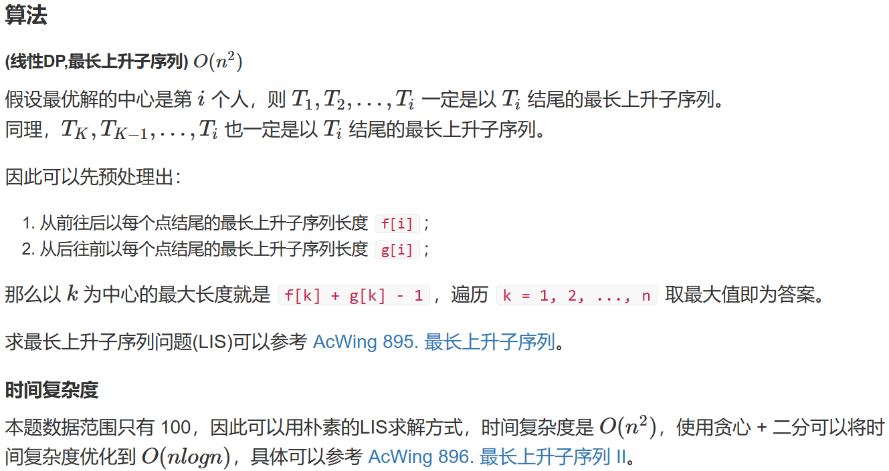
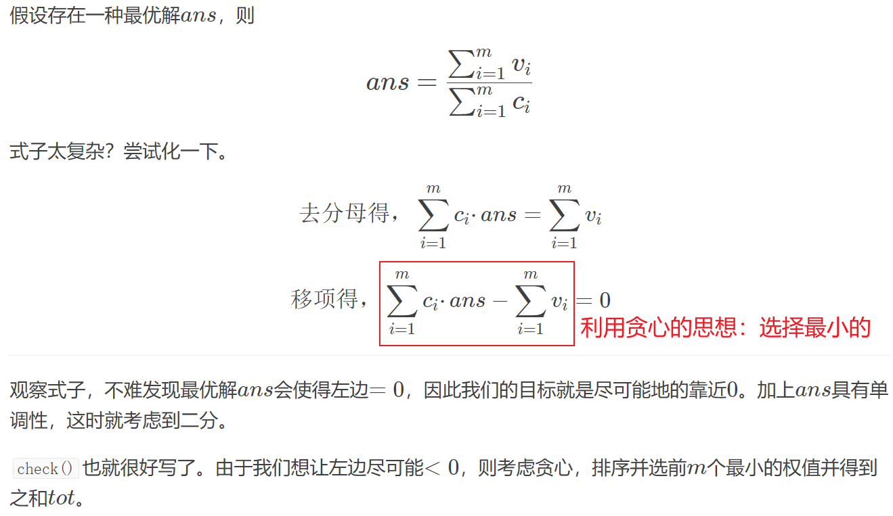

https://www.luogu.com.cn/training/111#problems

这个题单的名字就可以给人很大的启发，二分只是一种思考方式，具体来说有两种方式：

- 二分答案——当答案是单调的时候就可以考虑使用二分答案的方法了
- 二分查找


# 【深基13.例1】查找

## 题目描述

输入 $n$ 个不超过 $10^9$ 的单调不减的（就是后面的数字不小于前面的数字）非负整数 $a_1,a_2,\dots,a_{n}$，然后进行 $m$ 次询问。对于每次询问，给出一个整数 $q$，要求输出这个数字在序列中第一次出现的编号，如果没有找到的话输出 $-1$ 。

## 输入格式

第一行 $2$ 个整数 $n$ 和 $m$，表示数字个数和询问次数。

第二行 $n$ 个整数，表示这些待查询的数字。

第三行 $m$ 个整数，表示询问这些数字的编号，从 $1$ 开始编号。

## 输出格式

输出一行，$m$ 个整数，以空格隔开，表示答案。

## 样例 #1

### 样例输入 #1

```
11 3
1 3 3 3 5 7 9 11 13 15 15
1 3 6
```

### 样例输出 #1

```
1 2 -1
```

## 提示

数据保证，$1 \leq n \leq 10^6$，$0 \leq a_i,q \leq 10^9$，$1 \leq m \leq 10^5$

本题输入输出量较大，请使用较快的 IO 方式。

```c++
#include<bits/stdc++.h>

using namespace std;
const int N = 1000010;
int a[N];
int n, m;

int main() {
    cin >> n >> m;
    for (int i = 0; i < n; ++i)scanf("%d", &a[i]);
    while (m--) {
        int q, l = 0, r = n - 1;
        scanf("%d", &q);
        while (l < r) {
            int mid = l + r >> 1;
            if (a[mid] >= q)r = mid;
            else l = mid + 1;
        }
        if (a[l] == q)printf("%d ", l + 1);
        else printf("-1 ");
    }
    return 0;
} 
```

就是普通的二分查找


# A-B 数对

## 题目背景

出题是一件痛苦的事情！

相同的题目看多了也会有审美疲劳，于是我舍弃了大家所熟悉的 A+B Problem，改用 A-B 了哈哈！

## 题目描述

给出一串正整数数列以及一个正整数 $C$，要求计算出所有满足 $A - B = C$ 的数对的个数（不同位置的数字一样的数对算不同的数对）。

## 输入格式

输入共两行。

第一行，两个正整数 $N,C$。

第二行，$N$ 个正整数，作为要求处理的那串数。

## 输出格式

一行，表示该串正整数中包含的满足 $A - B = C$ 的数对的个数。

## 样例 #1

### 样例输入 #1

```
4 1
1 1 2 3
```

### 样例输出 #1

```
3
```

## 提示

对于 $75\%$ 的数据，$1 \leq N \leq 2000$。

对于 $100\%$ 的数据，$1 \leq N \leq 2 \times 10^5$，$0 \leq a_i <2^{30}$,$1 \leq C < 2^{30}$。

2017/4/29 新添数据两组

**双指针的做法**

```c++
#include<bits/stdc++.h>

typedef long long int LL;
using namespace std;
const int N = 2e5 + 10;
map<int, int> m;
int s[N];

int main() {
    int n, c;
    cin >> n >> c;

    for (int i = 0; i < n; ++i) {
        int a;
        scanf("%d", &a);
        m[a] += 1;
    }

    int k = 0;
    for (auto t: m) s[k++] = t.first;
    sort(s, s + k);

    long long int res = 0;
    for (int i = 0, j = 0; j < k;) {
        if (s[j] - s[i] < c) j++;
        else if (s[j] - s[i] == c) {
            res += (LL) m[s[j]] * m[s[i]];
            j++;
            i++;
        } else i++;
    }
    cout << res;
    return 0;
}
```

**二分查找的做法**

```c++
#include<bits/stdc++.h>

using namespace std;
const int N = 2e5 + 10;
int n, a[N], c;
long long int res;

void tt(int x) {
    x = c + x;
    int l = 0, r = n - 1;
    while (l < r) {
        int mid = l + r >> 1;
        if (a[mid] >= x) r = mid;
        else l = mid + 1;
    }
    if (a[l] != x) return;
    int ll = l;
    l = 0, r = n - 1;
    while (l < r) {
        int mid = l + r + 1 >> 1;
        if (a[mid] <= x) l = mid;
        else r = mid - 1;
    }
    int rr = l;
    res += rr - ll + 1;
    return;
}

int main() {
    cin >> n >> c;
    for (int i = 0; i < n; ++i) scanf("%d", &a[i]);
    sort(a, a + n);
    for (int i = 0; i < n; ++i) tt(a[i]);
    cout << res;
}
```

> 这个题和AcWing上二分的题目有点类似
>
> https://www.acwing.com/problem/content/791/


# [COCI 2011/2012 #5] EKO / 砍树

## 题目描述

伐木工人 Mirko 需要砍 $M$ 米长的木材。对 Mirko 来说这是很简单的工作，因为他有一个漂亮的新伐木机，可以如野火一般砍伐森林。不过，Mirko 只被允许砍伐一排树。

Mirko 的伐木机工作流程如下：Mirko 设置一个高度参数 $H$（米），伐木机升起一个巨大的锯片到高度 $H$，并锯掉所有树比 $H$ 高的部分（当然，树木不高于 $H$ 米的部分保持不变）。Mirko 就得到树木被锯下的部分。例如，如果一排树的高度分别为 $20,15,10$ 和 $17$，Mirko 把锯片升到 $15$ 米的高度，切割后树木剩下的高度将是 $15,15,10$ 和 $15$，而 Mirko 将从第 $1$ 棵树得到 $5$ 米，从第 $4$ 棵树得到 $2$ 米，共得到 $7$ 米木材。

Mirko 非常关注生态保护，所以他不会砍掉过多的木材。这也是他尽可能高地设定伐木机锯片的原因。请帮助 Mirko 找到伐木机锯片的最大的整数高度 $H$，使得他能得到的木材至少为 $M$ 米。换句话说，如果再升高 $1$ 米，他将得不到 $M$ 米木材。

## 输入格式

第 $1$ 行 $2$ 个整数 $N$ 和 $M$，$N$ 表示树木的数量，$M$ 表示需要的木材总长度。

第 $2$ 行 $N$ 个整数表示每棵树的高度。

## 输出格式

$1$ 个整数，表示锯片的最高高度。

## 样例 #1

### 样例输入 #1

```
4 7
20 15 10 17
```

### 样例输出 #1

```
15
```

## 样例 #2

### 样例输入 #2

```
5 20
4 42 40 26 46
```

### 样例输出 #2

```
36
```

## 提示

对于 $100\%$ 的测试数据，$1\le N\le10^6$，$1\le M\le2\times10^9$，树的高度 $<10^9$，所有树的高度总和 $>M$。

```c++
#include<bits/stdc++.h>

using namespace std;
const int N = 1e6 + 10;
int n;
long long int m, h[N];

bool check(int x) {
    long long int t = 0;
    for (int i = 0; i < n; ++i) t += h[i] > x ? h[i] - x : 0;
    if (t >= m) return true;
    else return false;
}

int main() {
    cin >> n >> m;
    for (int i = 0; i < n; ++i) scanf("%lld", &h[i]);
    int l = 0, r = 1e9;
    while (l < r) {
        int mid = l + r + 1 >> 1;
        if (check(mid)) l = mid;
        else r = mid - 1;
    }
    cout << l;
    return 0;
}
```

这个题是二分答案的情况。

利用二分枚举每一个可能的答案进行判断


# [NOIP2001 提高组] 一元三次方程求解

## 题目描述

有形如：$a x^3 + b x^2 + c x + d = 0$  这样的一个一元三次方程。给出该方程中各项的系数（$a,b,c,d$ 均为实数），并约定该方程存在三个不同实根（根的范围在 $-100$ 至 $100$ 之间），且根与根之差的绝对值 $\ge 1$。要求由小到大依次在同一行输出这三个实根(根与根之间留有空格)，并精确到小数点后 $2$ 位。

提示：记方程 $f(x) = 0$，若存在 $2$ 个数 $x_1$ 和 $x_2$，且 $x_1 < x_2$，$f(x_1) \times f(x_2) < 0$，则在 $(x_1, x_2)$ 之间一定有一个根。

## 输入格式

一行，$4$ 个实数 $a, b, c, d$。

## 输出格式

一行，$3$ 个实根，从小到大输出，并精确到小数点后 $2$ 位。

## 样例 #1

### 样例输入 #1

```
1 -5 -4 20
```

### 样例输出 #1

```
-2.00 2.00 5.00
```

## 提示

**【题目来源】**

NOIP 2001 提高组第一题

```c++
#include<bits/stdc++.h>

using namespace std;
double a, b, c, d;

double f(double x) {
    return a * x * x * x + b * x * x + c * x + d;
}

void check(double x1, double x2) {
    double l = x1, r = x2, mid;
    while (r - l > 0.001) {
        mid = (l + r) / 2;
        if (f(l) * f(mid) > 0)l = mid;
        else r = mid;
    }
    printf("%.2lf ", l);
}

int main() {
    cin >> a >> b >> c >> d;
    for (double i = -100.1; i <= 100.01; i += 1) {
        if (f(i) * f(i + 1) <= 0) {
            check(i, i + 1);
            i += 0.00001;
        }
    }
    return 0;
}
```

利用步进来确定二分的左右端点

注意：`a`、`b`、`c`、`d`是实数而非整数，需要用`double`存储


# 烦恼的高考志愿

## 题目背景

计算机竞赛小组的神牛 V 神终于结束了高考，然而作为班长的他还不能闲下来，班主任老 t 给了他一个艰巨的任务：帮同学找出最合理的大学填报方案。可是 v 神太忙了，身后还有一群小姑娘等着和他约会，于是他想到了同为计算机竞赛小组的你，请你帮他完成这个艰巨的任务。

## 题目描述

现有 $m$ 所学校，每所学校预计分数线是 $a_i$。有 $n$ 位学生，估分分别为 $b_i$。

根据 $n$ 位学生的估分情况，分别给每位学生推荐一所学校，要求学校的预计分数线和学生的估分相差最小（可高可低，毕竟是估分嘛），这个最小值为不满意度。求所有学生不满意度和的最小值。

## 输入格式

第一行读入两个整数 $m,n$。$m$ 表示学校数，$n$ 表示学生数。

第二行共有 $m$ 个数，表示 $m$ 个学校的预计录取分数。第三行有 $n$ 个数，表示 $n$ 个学生的估分成绩。

## 输出格式

输出一行，为最小的不满度之和。

## 样例 #1

### 样例输入 #1

```
4 3
513 598 567 689
500 600 550
```

### 样例输出 #1

```
32
```

## 提示

数据范围：

对于 $30\%$ 的数据，$1\leq n,m\leq1000$，估分和录取线 $\leq10000$；

对于 $100\%$ 的数据，$1\leq n,m\leq100000$，估分和录取线 $\leq 1000000$ 且均为正整数。

```c++
#include<bits/stdc++.h>

using namespace std;
const int N = 1e5 + 10;
int n, m, a[N];
long long int res;

void tt(int u) {
    int l = 0, r = m - 1;
    while (l < r) {
        int mid = l + r + 1 >> 1;
        if (a[mid] <= u) l = mid;
        else r = mid - 1;
    }
    if (l == 0 && a[l] > u) res += a[l] - u;
    else if (l == m - 1) res += u - a[l];
    else res += min(u - a[l], a[l + 1] - u);
    return;
}

int main() {
    cin >> m >> n;
    for (int i = 0; i < m; ++i) scanf("%d", &a[i]);
    sort(a, a + m);
    for (int i = 0; i < n; ++i) {
        int b;
        scanf("%d", &b);
        tt(b);
    }
    cout << res;
    return 0;
}
```

对于每一个同学的成绩，利用二分查找到第一个分数线比他预估分数低的学校，比较即可

注意特判分数线最低和分数线最高的情况


# 木材加工

## 题目背景

要保护环境

## 题目描述

木材厂有 $n$ 根原木，现在想把这些木头切割成 $k$ 段长度**均**为 $l$ 的小段木头（木头有可能有剩余）。

当然，我们希望得到的小段木头越长越好，请求出 $l$ 的最大值。

木头长度的单位是 $\text{cm}$，原木的长度都是正整数，我们要求切割得到的小段木头的长度也是正整数。

例如有两根原木长度分别为 $11$ 和 $21$，要求切割成等长的 $6$ 段，很明显能切割出来的小段木头长度最长为 $5$。

## 输入格式

第一行是两个正整数 $n,k$，分别表示原木的数量，需要得到的小段的数量。

接下来 $n$ 行，每行一个正整数 $L_i$，表示一根原木的长度。

## 输出格式

仅一行，即 $l$ 的最大值。

如果连 $\text{1cm}$ 长的小段都切不出来，输出 `0`。

## 样例 #1

### 样例输入 #1

```
3 7
232
124
456
```

### 样例输出 #1

```
114
```

## 提示

#### 数据规模与约定

对于 $100\%$ 的数据，有 $1\le n\le 10^5$，$1\le k\le 10^8$，$1\le L_i\le 10^8(i\in[1,n])$。

```c++
#include<bits/stdc++.h>

using namespace std;
const int N = 1e5 + 10;
int n, k, a[N];

bool check(int u) {
    int res = 0;
    for (int i = 0; i < n; ++i) {
        res += a[i] / u;
    }
    if (res >= k) return true;
    else return false;
}

int main() {
    cin >> n >> k;
    for (int i = 0; i < n; ++i) scanf("%d", &a[i]);

    int l = 0, r = 1e8 + 10;
    while (l < r) {
        int mid = l + r + 1 >> 1;
        if (check(mid)) l = mid;
        else r = mid - 1;
    }
    cout << l;
    return 0;
} 
```

这个题目属于是二分答案。


# [NOIP2015 提高组] 跳石头

## 题目背景

一年一度的“跳石头”比赛又要开始了!

## 题目描述

这项比赛将在一条笔直的河道中进行，河道中分布着一些巨大岩石。组委会已经选择好了两块岩石作为比赛起点和终点。在起点和终点之间，有 $N$ 块岩石（不含起点和终点的岩石）。在比赛过程中，选手们将从起点出发，每一步跳向相邻的岩石，直至到达终点。

为了提高比赛难度，组委会计划移走一些岩石，使得选手们在比赛过程中的最短跳跃距离尽可能长。由于预算限制，组委会至多从起点和终点之间移走 $M$ 块岩石（不能移走起点和终点的岩石）。

## 输入格式

第一行包含三个整数 $L,N,M$，分别表示起点到终点的距离，起点和终点之间的岩石数，以及组委会至多移走的岩石数。保证 $L \geq 1$ 且 $N \geq M \geq 0$。

接下来 $N$ 行，每行一个整数，第 $i$ 行的整数 $D_i( 0 < D_i < L)$， 表示第 $i$ 块岩石与起点的距离。这些岩石按与起点距离从小到大的顺序给出，且不会有两个岩石出现在同一个位置。

## 输出格式

一个整数，即最短跳跃距离的最大值。

## 样例 #1

### 样例输入 #1

```
25 5 2 
2
11
14
17 
21
```

### 样例输出 #1

```
4
```

## 提示

### 输入输出样例 1 说明

将与起点距离为 $2$和 $14$ 的两个岩石移走后,最短的跳跃距离为 $4$(从与起点距离 $17$ 的岩石跳到距离 $21$ 的岩石,或者从距离 $21$ 的岩石跳到终点)。

### 数据规模与约定

对于 $20\%$的数据，$0 \le M \le N \le 10$。    
对于 $50\%$ 的数据，$0 \le M \le N \le 100$。  
对于 $100\%$的数据，$0 \le M \le N \le 50000,1 \le L 
 \le 10^9$。

```c++
#include<bits/stdc++.h>

using namespace std;
const int N = 5e4 + 10;
int l, m, n, a[N];

bool check(int u) {
    int res = 0;
    int b[N];
    memcpy(b, a, sizeof b);
    for (int i = 1; i <= n + 1; ++i) {
        if (b[i] < u) {
            b[i + 1] += b[i];
            res++;
        }
    }
    if (res <= m) return true;
    else return false;
}

int main() {
    cin >> l >> n >> m;
    if (n == 0) {
        cout << l;
        return 0;
    }
    for (int i = 1; i <= n; ++i) scanf("%d", &a[i]);
    a[n + 1] = l - a[n];
    for (int i = n; i > 0; --i) a[i] = a[i] - a[i - 1];
    if (m == 0) {
        int minn = 1e9 + 9;
        for (int i = 1; i <= n + 1; i++) {
            minn = min(minn, a[i]);
        }
        cout << minn;
        return 0;
    }
    int l = 0, r = 1e9 + 3;
    while (l < r) {
        int mid = l + r + 1 >> 1;
        if (check(mid)) l = mid;
        else r = mid - 1;
    }
    cout << l;
    return 0;
}
```

这个题也是二分答案。

具体来说就是枚举每一个可能结果，判断是否是答案，只不过这里是根据二分进行枚举，会非常快。

`a[0]`是起点，`a[n+1]`是终点

`a[i]`表示的是第`i`个石头距离第`i-1`个石头的距离

每次判断当前的石头是否可以删除，记得要把下一个石头的距离更新。

代码删除终点的操作逻辑上是删除终点的上一个，也就是最后一个石头。这里会把距离更新到下一个石头，虽然这个石头逻辑上不存在，但是不影响前面的判断。


# [TJOI2007]路标设置

## 题目背景

B 市和 T 市之间有一条长长的高速公路，这条公路的某些地方设有路标，但是大家都感觉路标设得太少了，相邻两个路标之间往往隔着相当长的一段距离。为了便于研究这个问题，我们把公路上相邻路标的最大距离定义为该公路的“空旷指数”。

## 题目描述

现在政府决定在公路上增设一些路标，使得公路的“空旷指数”最小。他们请求你设计一个程序计算能达到的最小值是多少。请注意，公路的起点和终点保证已设有路标，公路的长度为整数，并且原有路标和新设路标都必须距起点整数个单位距离。

## 输入格式

第 $1$ 行包括三个数 $L,N,K$，分别表示公路的长度，原有路标的数量，以及最多可增设的路标数量。


第 $2$ 行包括递增排列的 $N$ 个整数，分别表示原有的 $N$ 个路标的位置。路标的位置用距起点的距离表示，且一定位于区间 $[0,L]$ 内。

## 输出格式

输出 $1$ 行，包含一个整数，表示增设路标后能达到的最小“空旷指数”值。

## 样例 #1

### 样例输入 #1

```
101 2 1
0 101
```

### 样例输出 #1

```
51
```

## 提示

公路原来只在起点和终点处有两个路标，现在允许新增一个路标，应该把新路标设在距起点 $50$ 或 $51$ 个单位距离处，这样能达到最小的空旷指数 $51$。

$50\%$ 的数据中，$2 \leq N \leq 100$，$0 \leq K \leq 100$。

$100\%$ 的数据中，$2 \leq N \leq 100000$, $0 \leq K \leq100000$。

$100\%$ 的数据中，$0 < L \leq 10000000$。

```c++
#include<bits/stdc++.h>

using namespace std;
const int N = 1e5 + 10;
int n, k, L, a[N];

bool check(int x) {
    if (x == 0) return false;
    long long int res = 0;
    for (int i = 1; i <= n; ++i) {
        if (a[i] == 0) continue;
        if (a[i] > x) {
            if (a[i] % x == 0) res--;
            res += a[i] / x;// 注意这里要大于指数才可以除 
        }
    }
    if (res > k) return false;
    else return true;
}

int main() {
    cin >> L >> n >> k;
    for (int i = 1; i <= n; ++i) scanf("%d", &a[i]);
    if (a[n] != L) {
        a[n + 1] = L;
        n++;
    }
    for (int i = n; i > 1; --i) a[i] -= a[i - 1];
    if (k == 0) {
        int maxx = 0;
        for (int i = 1; i <= n; ++i) maxx = max(maxx, a[i]);
        cout << maxx;
        return 0;
    }
    int l = 0, r = L;
    while (l < r) {
        int mid = l + r >> 1;
        if (check(mid)) r = mid;
        else l = mid + 1;
    }
    cout << l;
    return 0;
}
```

经过排查终于找到了之前程序的bug。

之前的程序最后一个hack测试点一直过不去，hack测试点一直报告浮点数错误。经过排查之后发现，**所谓的浮点数错误实际上就是除数是0导致的**。

虽然hack测试点不可见，但是推测一下可能的测试集：

```
1 2 123
0 1
// 该测试集表示路总长为1，有两个路标，可以再添加123个路标
```

按照上述测试集，原有代码会发生**除数是0**的情况，同时没有在`check`函数内部检查参数`x`是否为`0`。


# 数列分段 Section II

## 题目描述

对于给定的一个长度为N的正整数数列 $A_{1\sim N}$，现要将其分成 $M$（$M\leq N$）段，并要求每段连续，且每段和的最大值最小。

关于最大值最小：

例如一数列 $4\ 2\ 4\ 5\ 1$ 要分成 $3$ 段。

将其如下分段：

$$[4\ 2][4\ 5][1]$$

第一段和为 $6$，第 $2$ 段和为 $9$，第 $3$ 段和为 $1$，和最大值为 $9$。

将其如下分段：

$$[4][2\ 4][5\ 1]$$

第一段和为 $4$，第 $2$ 段和为 $6$，第 $3$ 段和为 $6$，和最大值为 $6$。

并且无论如何分段，最大值不会小于 $6$。

所以可以得到要将数列 $4\ 2\ 4\ 5\ 1$ 要分成 $3$ 段，每段和的最大值最小为 $6$。

## 输入格式

第 $1$ 行包含两个正整数 $N,M$。  

第 $2$ 行包含 $N$ 个空格隔开的非负整数 $A_i$，含义如题目所述。

## 输出格式

一个正整数，即每段和最大值最小为多少。

## 样例 #1

### 样例输入 #1

```
5 3
4 2 4 5 1
```

### 样例输出 #1

```
6
```

## 提示

对于 $20\%$ 的数据，$N\leq 10$。

对于 $40\%$ 的数据，$N\leq 1000$。

对于 $100\%$ 的数据，$1\leq N\leq 10^5$，$M\leq N$，$A_i < 10^8$， 答案不超过 $10^9$。

```c++
#include<bits/stdc++.h>

using namespace std;
const int N = 1e5 + 10;
int n;
long long int h[N], m;

bool check(long long int x) {
    long long int res = 0;
    int ans = 0;
    for (int i = 0; i < n; ++i) {
        if (h[i] > x) return false;
        if (res + h[i] > x) {
            ans++;
            res = h[i];
        } else {
            res += h[i];
        }
    }
    if (res) ++ans;
    if (ans <= m) return true;
    else return false;
}

int main() {
    cin >> n >> m;
    for (int i = 0; i < n; ++i) scanf("%lld", &h[i]);
    long long int l = 0, r = 1e17;
    while (l < r) {
        long long int mid = l + r >> 1;
        if (check(mid)) r = mid;
        else l = mid + 1;
    }
    cout << l;
    return 0;
}
```

`ans`用来判断分组

`res`是每个分段的和


# 银行贷款

## 题目描述

当一个人从银行贷款后，在一段时间内他（她）将不得不每月偿还固定的分期付款。这个问题要求计算出贷款者向银行支付的利率。假设利率按月累计。

## 输入格式

三个用空格隔开的正整数。

第一个整数表示贷款的原值，第二个整数表示每月支付的分期付款金额，第三个整数表示分期付款还清贷款所需的总月数。

## 输出格式

一个实数，表示该贷款的月利率（用百分数表示），四舍五入精确到 $0.1\%$。

## 样例 #1

### 样例输入 #1

```
1000 100 12
```

### 样例输出 #1

```
2.9
```

## 提示

数据保证，$1 \leq$ 贷款的原值，分期付款金额 $\leq 2^{31}-1$，$1 \leq$ 月数 $\leq 3000$。

```c++
#include<bits/stdc++.h>

using namespace std;
double total, part, l = 0, r = 10, mid;
int month;

bool check() {
    double sum = 0;
    for (int i = 1; i <= month; ++i) {
        sum += part / pow(1 + mid, i);
    }
    if (sum >= total)return true;
    return false;
}

int main() {
    cin >> total >> part >> month;
    while (r - l > 0.00001) {
        mid = (l + r) / 2;
        if (check()) l = mid;
        else r = mid;
    }
    printf("%.1lf", mid * 100);
    return 0;
} 
```


# kotori的设备

## 题目背景

kotori 有 $n$ 个可同时使用的设备。

## 题目描述

第 $i$ 个设备每秒消耗 $a_i$ 个单位能量。能量的使用是连续的，也就是说能量不是某时刻突然消耗的，而是匀速消耗。也就是说，对于任意实数，在 $k$ 秒内消耗的能量均为 $k\times a_i$ 单位。在开始的时候第 $i$ 个设备里存储着 $b_i$ 个单位能量。

同时 kotori 又有一个可以给任意一个设备充电的充电宝，每秒可以给接通的设备充能 $p$ 个单位，充能也是连续的，不再赘述。你可以在任意时间给任意一个设备充能，从一个设备切换到另一个设备的时间忽略不计。

kotori 想把这些设备一起使用，直到其中有设备能量降为  $0$。所以 kotori 想知道，在充电器的作用下，她最多能将这些设备一起使用多久。

## 输入格式

第一行给出两个整数 $n,p$。

接下来 $n$ 行，每行表示一个设备，给出两个整数，分别是这个设备的 $a_i$ 和 $b_i$。

## 输出格式

如果 kotori 可以无限使用这些设备，输出 $-1$。

否则输出 kotori 在其中一个设备能量降为 $0$ 之前最多能使用多久。

设你的答案为 $a$，标准答案为 $b$，只有当 $a,b$ 满足 $\dfrac{|a-b|}{\max(1,b)} \leq 10^{-4}$ 的时候，你能得到本测试点的满分。

## 样例 #1

### 样例输入 #1

```
2 1
2 2
2 1000
```

### 样例输出 #1

```
2.0000000000
```

## 样例 #2

### 样例输入 #2

```
1 100
1 1
```

### 样例输出 #2

```
-1
```

## 样例 #3

### 样例输入 #3

```
3 5
4 3
5 2
6 1
```

### 样例输出 #3

```
0.5000000000
```

## 提示

对于 $100\%$ 的数据，$1\leq n\leq 100000$，$1\leq p\leq 100000$，$1\leq a_i,b_i\leq100000$。

```c++
#include<bits/stdc++.h>

using namespace std;
const int N = 1e5 + 10;
struct tt {
    int a, b;
} ti[N];
int n;
double p;

bool check(double x) {
    double chong = p * x;
    for (int i = 0; i < n; ++i) {
        chong -= ti[i].a * x > ti[i].b ? ti[i].a * x - ti[i].b : 0;
    }
    if (chong < 0) return false;
    else return true;
}

int main() {
    cin >> n >> p;
    long long int tot = 0;
    for (int i = 0; i < n; ++i) {
        scanf("%d%d", &ti[i].a, &ti[i].b);
        tot += ti[i].a;
    }
    if (tot <= p) {
        cout << -1;
        return 0;
    }
    double l = 0, r = 3000000001.0;
    while (r - l > 0.00001) {
        double mid = (l + r) / 2;
        if (check(mid)) l = mid;
        else r = mid;
    }
    printf("%lf\n", l);
    return 0;
}
```

本题也是二分答案

首先要注意`tot`会爆`int`，所以要开`long long int`

其次是要熟悉`double`型的二分过程，`double`型的二分过程右端点可以取到`3000000001.0`，取小了会导致一些答案错误


# [NOIP2004 提高组] 合唱队形

## 题目描述

$n$ 位同学站成一排，音乐老师要请其中的 $n-k$ 位同学出列，使得剩下的 $k$ 位同学排成合唱队形。

合唱队形是指这样的一种队形：设 $k$ 位同学从左到右依次编号为 $1,2,$ … $,k$，他们的身高分别为 $t_1,t_2,$ … $,t_k$，则他们的身高满足 $t_1< \cdots <t_i>t_{i+1}>$ … $>t_k(1\le i\le k)$。

你的任务是，已知所有 $n$ 位同学的身高，计算最少需要几位同学出列，可以使得剩下的同学排成合唱队形。

## 输入格式

共二行。

第一行是一个整数 $n$（$2\le n\le100$），表示同学的总数。

第二行有 $n$ 个整数，用空格分隔，第 $i$ 个整数 $t_i$（$130\le t_i\le230$）是第 $i$ 位同学的身高（厘米）。

## 输出格式

一个整数，最少需要几位同学出列。

## 样例 #1

### 样例输入 #1

```
8
186 186 150 200 160 130 197 220
```

### 样例输出 #1

```
4
```

## 提示

对于 $50\%$ 的数据，保证有 $n \le 20$。

对于全部的数据，保证有 $n \le 100$。




> 895. 最长上升子序列https://www.acwing.com/problem/content/description/897/
> 896. 最长上升子序列 IIhttps://www.acwing.com/problem/content/description/898/


**DP：最长上升子序列做法（带二分优化）**

```c++
#include <bits/stdc++.h>

using namespace std;
const int N = 110;
int n, a[N], q1[N], q2[N], ll[N], rr[N];

void solve() {
    cin >> n;
    for (int i = 0; i < n; ++i) scanf("%d", &a[i]);
    int len1 = 0;
    q1[0] = -2e9;
    for (int i = 0; i < n; ++i) {
        int l = 0, r = len1;
        while (l < r) {
            int mid = l + r + 1 >> 1;
            if (q1[mid] < a[i]) l = mid;
            else r = mid - 1;
        }
        len1 = max(len1, r + 1);
        q1[r + 1] = a[i];
        ll[i] = len1;
    }

    int len2 = 0;
    q2[0] = -2e9;
    for (int i = n - 1; i >= 0; --i) {
        int l = 0, r = len2;
        while (l < r) {
            int mid = l + r + 1 >> 1;
            if (q2[mid] < a[i]) l = mid;
            else r = mid - 1;
        }
        len2 = max(r + 1, len2);
        q2[r + 1] = a[i];
        rr[i] = len2;
    }
    int res = 0;
    for (int i = 0; i < n - 1; ++i) {
        if (a[i] < a[i + 1]) res = max(res, ll[i] + rr[i + 1]);
    }
    cout << (res != 0 ? n - res : len1 + len2) << endl;
}

int main() {
    solve();
    return 0;
}
```


**DP：最长上升子序列做法（不带二分优化）**

```c++
#include <cstdio>
#include <cstring>
#include <iostream>
#include <algorithm>

using namespace std;
const int N = 110;

int n;
int h[N];
int f[N], g[N];

int main() {
    scanf("%d", &n);
    for (int i = 1; i <= n; i++) scanf("%d", &h[i]);
    for (int i = 1; i <= n; i++) {
        f[i] = 1;
        for (int j = 1; j < i; j++)
            if (h[j] < h[i])
                f[i] = max(f[i], f[j] + 1);
    }

    for (int i = n; i; i--) {
        g[i] = 1;
        for (int j = n; j > i; j--)
            if (h[j] < h[i])
                g[i] = max(g[i], g[j] + 1);
    }
    int res = 0;
    for (int i = 1; i <= n; i++) res = max(res, f[i] + g[i] - 1);
    printf("%d\n", n - res);
    return 0;
}
```


# 寻找段落

## 题目描述

给定一个长度为 $n$ 的序列 $a$，定义 $a_i$ 为第 $i$ 个元素的价值。现在需要找出序列中最有价值的“段落”。段落的定义是长度在 $[S, T]$ 之间的连续序列。最有价值段落是指平均值最大的段落。

**段落的平均值** 等于 **段落总价值** 除以 **段落长度**。

## 输入格式

第一行一个整数 $n$，表示序列长度。

第二行两个整数 $S$ 和 $T$，表示段落长度的范围，在 $[S, T]$ 之间。

第三行到第 $n+2$ 行，每行一个整数表示每个元素的价值指数。

## 输出格式

一个实数，保留 $3$ 位小数，表示最优段落的平均值。

## 样例 #1

### 样例输入 #1

```
3
2 2
3
-1
2
```

### 样例输出 #1

```
1.000
```

## 提示

【数据范围】

对于 $30\%$ 的数据有 $n \le 1000$。

对于 $100\%$ 的数据有 $1 \le n \le 100000$，$1 \le S \le T \le n$，$-{10}^4 \le a_i \le {10}^4$。

【题目来源】

tinylic 改编

```c++
#include <bits/stdc++.h>

using namespace std;
const int N = 1e5 + 10;
int n, a[N], s, t;
double f[N];

bool check(double mid) {
    for (int i = 1; i <= n; ++i) f[i] = f[i - 1] + (double) a[i] - mid;
    int hh = 1, tt = 0, q[N];
    // 队列中始终保持最小值
    for (int i = s; i <= n; ++i) {
        while (hh <= tt && f[q[tt]] > f[i - s]) tt--;
        q[++tt] = i - s;
        while (hh <= tt && q[hh] < i - t) hh++;
        if (hh <= tt && f[i] - f[q[hh]] > 0) return true;
    }
    return false;
}

int main() {
    cin >> n >> s >> t;
    for (int i = 1; i <= n; ++i) scanf("%d", &a[i]);
    double l = -2e9, r = 2e9;
    while (r - l > 0.00001) {
        double mid = (l + r) / 2.0;
        if (check(mid)) l = mid;
        else r = mid;
    }
    printf("%.3lf", l);
    return 0;
}
```


红色线段是我们要维护的单调队列，队列内部维护一个最小值。


# 书的复制

## 题目背景

大多数人的错误原因：尽可能让前面的人少抄写，如果前几个人可以不写则不写，对应的人输出 `0 0` 。

不过，已经修改数据，保证每个人都有活可干。

## 题目描述

现在要把 $m$ 本有顺序的书分给 $k$ 个人复制（抄写），每一个人的抄写速度都一样，一本书不允许给两个（或以上）的人抄写，分给每一个人的书，必须是连续的，比如不能把第一、第三、第四本书给同一个人抄写。

现在请你设计一种方案，使得复制时间最短。复制时间为抄写页数最多的人用去的时间。

## 输入格式

第一行两个整数 $m,k$。

第二行 $m$ 个整数，第 $i$ 个整数表示第 $i$ 本书的页数。

## 输出格式

共 $k$ 行，每行两个整数，第 $i$ 行表示第 $i$ 个人抄写的书的起始编号和终止编号。 $k$ 行的起始编号应该从小到大排列，如果有多解，则尽可能让前面的人少抄写。

## 样例 #1

### 样例输入 #1

```
9 3
1 2 3 4 5 6 7 8 9
```

### 样例输出 #1

```
1 5
6 7
8 9
```

## 提示

$1\le k \le m \le 500$。

```c++
#include <bits/stdc++.h>

using namespace std;

const int N = 550;
int m, k, q[N], a[N];
typedef pair<int, int> PII;

bool check(int mid) {
    int res = 0;
    int num = 1;
    for (int i = 0; i < m; ++i) {
        if (a[i] > mid) return false;
        if (res + a[i] <= mid) res += a[i];
        else {
            num++;
            res = a[i];
        }
    }
    if (num <= k) return true;
    else return false;
}

int main() {
    cin >> m >> k;
    for (int i = 0; i < m; ++i) cin >> a[i];
    int l = 0, r = 2e9;
    while (l < r) {
        int mid = l + r >> 1;
        if (check(mid)) r = mid;
        else l = mid + 1;
    }
    stack<PII> s;
    int res = 0;
    int ed = m;
    for (int i = m - 1; i >= 0; --i) {
        if (res + a[i] > l) {
            s.push({i + 2, ed});
            res = a[i];
            ed = i + 1;
        } else {
            res += a[i];
        }
    }
    if (res) {
        s.push({1, ed});
    }
    while (s.size()) {
        auto t = s.top();
        s.pop();
        cout << t.first << " " << t.second << endl;
    }
    return 0;
}
```

注意题目中要求：**尽可能让前面的人少抄写**


# 营救

## 题目背景

“咚咚咚……”“查水表！”原来是查水表来了，现在哪里找这么热心上门的查表员啊！小明感动得热泪盈眶，开起了门……

## 题目描述

妈妈下班回家，街坊邻居说小明被一群陌生人强行押上了警车！妈妈丰富的经验告诉她小明被带到了 $t$ 区，而自己在 $s$ 区。

该市有 $m$ 条大道连接 $n$ 个区，一条大道将两个区相连接，每个大道有一个拥挤度。小明的妈妈虽然很着急，但是不愿意拥挤的人潮冲乱了她优雅的步伐。所以请你帮她规划一条从 $s$ 至 $t$ 的路线，使得经过道路的拥挤度最大值最小。

## 输入格式

第一行有四个用空格隔开的 $n$，$m$，$s$，$t$，其含义见【题目描述】。

接下来 $m$ 行，每行三个整数 $u, v, w$，表示有一条大道连接区 $u$ 和区 $v$，且拥挤度为 $w$。

**两个区之间可能存在多条大道**。

## 输出格式

输出一行一个整数，代表最大的拥挤度。

## 样例 #1

### 样例输入 #1

```
3 3 1 3
1 2 2
2 3 1
1 3 3
```

### 样例输出 #1

```
2
```

## 提示

#### 数据规模与约定

- 对于 $30\%$ 的数据，保证 $n\leq 10$。
- 对于 $60\%$ 的数据，保证 $n\leq 100$。
- 对于 $100\%$ 的数据，保证 $1 \leq n\leq 10^4$，$1 \leq m \leq 2 \times 10^4$，$w \leq 10^4$，$1 \leq s, t \leq n$。且从 $s$ 出发一定能到达 $t$ 区。

---

#### 样例输入输出 1 解释

小明的妈妈要从 $1$ 号点去 $3$ 号点，最优路线为 $1$->$2$->$3$。

**二分答案+并查集判断**

```c++
#include <bits/stdc++.h>

using namespace std;

const int N = 2e4 + 10;
int n, m, s, t, p[N];
struct node {
    int u, v, w;
} a[N];

int find(int x) {
    if (p[x] != x) p[x] = find(p[x]);
    return p[x];
}

bool check(int mid) {
    for (int i = 1; i <= n; ++i) p[i] = i;
    for (int i = 0; i < m; ++i) {
        if (a[i].w <= mid) {
            int aa = find(a[i].u), bb = find(a[i].v);
            if (aa != bb) {
                p[aa] = bb;
            }
        }
    }
    return find(s) == find(t);
}

int main() {
    cin >> n >> m >> s >> t;
    for (int i = 0; i < m; ++i) {
        cin >> a[i].u >> a[i].v >> a[i].w;
    }
    int l = 0, r = 1e4 + 5;
    while (l < r) {
        int mid = l + r >> 1;
        if (check(mid)) r = mid;
        else l = mid + 1;
    }
    cout << l << endl;
}
```


# KC 喝咖啡

## 题目描述

话说 KC 和 SH 在福州的时候常常跑去 85°C 喝咖啡或者其他的一些什么东西。

这天，KC 想要喝一杯咖啡，服务员告诉他，现在有 $n$ 种调料，这杯咖啡只可以加入其中的 $m$ 种（当然 KC 一定会加入 $m$ 种，不会加入少于 $m$ 种的调料），根据加入的调料不同，制成这杯咖啡要用的时间也不同，得到的咖啡的美味度也不同。

KC 在得知所有的 $n$ 种调料后，作为曾经的化竞之神的他，马上就知道了所有调料消耗的时间 $c _ i$ 以及调料的美味度 $v _ i$。由于 KC 急着回去刷题，所以他想尽快喝到这杯咖啡，但他又想喝到美味的咖啡，所以他想出了一个办法，他要喝到 $\dfrac{\sum v _ i}{\sum c _ i}$ 最大的咖啡，也就是单位时间的美味度最大的咖啡。

现在，KC 把调料信息告诉了 SH，要 SH 帮他算出喝到的咖啡的 $\dfrac{\sum v _ i}{\sum c _ i}$，但 SH 不想帮 KC 算这东西，于是 KC 就只能拜托你来算了。

注释：$\sum$ 表示求和，所以 $\dfrac{\sum v _ i}{\sum c _ i}$ 表示美味度的总和除以消耗时间的总和。

## 输入格式

输入数据共三行。

第一行为一个整数 $n, m$，表示调料种数和能加入的调料数。

接下来两行，每行为 $n$ 个数，第一行第 $i$ 个整数表示调料 $i$ 的美味度 $v _ i$，第二行第 $i$ 个整数表示调料 $i$ 消耗的时间 $c _ i$。

## 输出格式

一个实数 $T$，表示 KC 喝的咖啡的最大 $\dfrac{\sum v _ i}{\sum c _ i}$，保留三位小数。

## 样例 #1

### 样例输入 #1

```
3 2
1 2 3
3 2 1
```

### 样例输出 #1

```
1.667
```

## 提示

**样例 1 解释**：

KC 选 $2$ 号和 $3$ 号调料，$\dfrac{\sum v _ i}{\sum c _ i} = \dfrac{2 + 3}{2 + 1} = 1.667$。

可以验证不存在更优的选择。

**数据范围**：

对 $20 \%$ 的数据：$1 \leq n \leq 5$。

对 $50 \%$ 的数据：$1 \leq n \leq 10$。

对 $80 \%$ 的数据：$1 \leq n \leq 50$。

对 $100 \%$ 的数据：$1 \leq n \leq 200, 1 \leq m \leq n, 1 \leq c[i], v[i] \leq 1 \times 10 ^ 4$。

数据保证答案不超过 $1000$。

**二分答案+贪心判断**

```c++
#include <bits/stdc++.h>

using namespace std;
const int N = 210;

struct node {
    double v, c;
    double b;

    bool operator<(const node &w) const {
        return b < w.b;
    }
} a[N];

int n, m;

bool check(double mid) {
    for (int i = 0; i < n; ++i) {
        a[i].b = a[i].c * mid - a[i].v;
    }
    sort(a, a + n);
    double vv = 0, cc = 0;
    for (int i = 0; i < m; ++i) {
        vv += a[i].v;
        cc += a[i].c;
    }
    if (vv / cc > mid)return true;
    else return false;
}

int main() {
    cin >> n >> m;
    for (int i = 0; i < n; ++i) cin >> a[i].v;
    for (int i = 0; i < n; ++i) cin >> a[i].c;

    double l = 0, r = 1001;
    while (r - l > 0.00001) {
        double mid = (l + r) / 2.0;
        if (check(mid)) l = mid;
        else r = mid;
    }
    printf("%.3lf", r);
    return 0;
}
```




# LIS

## 题面翻译

- 给定一个长为 $n$ 的序列 $a_i$，求这个序列的最长单调上升子序列长度。
- $1 \le n \le10^5 $。

## 题目描述

[problemUrl]: https://atcoder.jp/contests/chokudai_S001/tasks/chokudai_S001_h

数列 $ a $ から好きな整数を好きなだけ取り除き、単調増加な数列を作るとき、その数列の長さの最大値を求めなさい。

## 输入格式

## 输出格式

## 样例 #1

### 样例输入 #1

```
5
3 1 5 4 2
```

### 样例输出 #1

```
2
```

## 样例 #2

### 样例输入 #2

```
6
1 2 3 4 5 6
```

### 样例输出 #2

```
6
```

## 样例 #3

### 样例输入 #3

```
7
7 6 5 4 3 2 1
```

### 样例输出 #3

```
1
```

## 样例 #4

### 样例输入 #4

```
20
19 11 10 7 8 9 17 18 20 4 3 15 16 1 5 14 6 2 13 12
```

### 样例输出 #4

```
6
```

## 提示

### 制約

- $ 1\ \leq\ N\ \leq\ 100,000 $

```c++
#include <bits/stdc++.h>

using namespace std;

const int N = 1e5 + 10;
int n, a[N], q[N];

int main() {
    cin >> n;
    for (int i = 0; i < n; ++i) cin >> a[i];
    int len = 0;
    for (int i = 0; i < n; ++i) {
        int l = 0, r = len;
        while (l < r) {
            int mid = l + r + 1 >> 1;
            if (q[mid] < a[i]) l = mid;
            else r = mid - 1;
        }
        len = max(len, r + 1);
        q[r + 1] = a[i];
    }
    cout << len << endl;
    return 0;
}
```


> https://www.acwing.com/problem/content/898/
