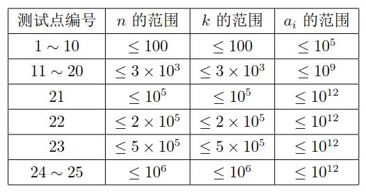

https://www.luogu.com.cn/training/200#problems

# 最大子段和

## 题目描述

给出一个长度为 $n$ 的序列 $a$，选出其中连续且非空的一段使得这段和最大。

## 输入格式

第一行是一个整数，表示序列的长度 $n$。

第二行有 $n$ 个整数，第 $i$ 个整数表示序列的第 $i$ 个数字 $a_i$。

## 输出格式

输出一行一个整数表示答案。

## 样例 #1

### 样例输入 #1

```
7
2 -4 3 -1 2 -4 3
```

### 样例输出 #1

```
4
```

## 提示

#### 样例 1 解释

选取 $[3, 5]$ 子段 $\{3, -1, 2\}$，其和为 $4$。

#### 数据规模与约定

- 对于 $40\%$ 的数据，保证 $n \leq 2 \times 10^3$。
- 对于 $100\%$ 的数据，保证 $1 \leq n \leq 2 \times 10^5$，$-10^4 \leq a_i \leq 10^4$。


```c++
#include<bits/stdc++.h>

using namespace std;
int n, temp;
int sum, maxsum = INT_MIN;

int main() {
    cin >> n;
    while (n--) {
        scanf("%d", &temp);
        sum += temp;
        maxsum = maxsum > sum ? maxsum : sum;
        if (sum < 0) sum = 0;
    }
    cout << maxsum;
    return 0;
}
```

**非常巧妙的判断最大字段和的方法！**


# 地毯

## 题目背景

此题约为NOIP提高组Day2T1难度。

## 题目描述

在 $n\times n$ 的格子上有 $m$ 个地毯。

给出这些地毯的信息，问每个点被多少个地毯覆盖。

## 输入格式

第一行，两个正整数 $n,m$。意义如题所述。

接下来 $m$ 行，每行两个坐标 $(x_1,y_1)$ 和 $(x_2,y_2)$，代表一块地毯，左上角是 $(x_1,y_1)$，右下角是 $(x_2,y_2)$。

## 输出格式

输出 $n$ 行，每行 $n$ 个正整数。

第 $i$ 行第 $j$ 列的正整数表示 $(i,j)$ 这个格子被多少个地毯覆盖。

## 样例 #1

### 样例输入 #1

```
5 3
2 2 3 3
3 3 5 5
1 2 1 4
```

### 样例输出 #1

```
0 1 1 1 0
0 1 1 0 0
0 1 2 1 1
0 0 1 1 1
0 0 1 1 1
```

## 提示

### 样例解释

覆盖第一个地毯后：

| $0$  | $0$  | $0$  | $0$  | $0$  |
| :--: | :--: | :--: | :--: | :--: |
| $0$  | $1$  | $1$  | $0$  | $0$  |
| $0$  | $1$  | $1$  | $0$  | $0$  |
| $0$  | $0$  | $0$  | $0$  | $0$  |
| $0$  | $0$  | $0$  | $0$  | $0$  |

覆盖第一、二个地毯后：

| $0$  | $0$  | $0$  | $0$  | $0$  |
| :--: | :--: | :--: | :--: | :--: |
| $0$  | $1$  | $1$  | $0$  | $0$  |
| $0$  | $1$  | $2$  | $1$  | $1$  |
| $0$  | $0$  | $1$  | $1$  | $1$  |
| $0$  | $0$  | $1$  | $1$  | $1$  |

覆盖所有地毯后：

| $0$  | $1$  | $1$  | $1$  | $0$  |
| :--: | :--: | :--: | :--: | :--: |
| $0$  | $1$  | $1$  | $0$  | $0$  |
| $0$  | $1$  | $2$  | $1$  | $1$  |
| $0$  | $0$  | $1$  | $1$  | $1$  |
| $0$  | $0$  | $1$  | $1$  | $1$  |

---

### 数据范围

对于 $20\%$ 的数据，有 $n\le 50$，$m\le 100$。

对于 $100\%$ 的数据，有 $n,m\le 1000$。


```c++
#include<bits/stdc++.h>

using namespace std;
const int N = 1010;
int b[N][N];

void insert(int x, int y, int xx, int yy) {
    b[x][y] += 1;
    b[xx + 1][y] -= 1;
    b[x][yy + 1] -= 1;
    b[xx + 1][yy + 1] += 1;
}

int main() {
    int n, m;
    cin >> n >> m;

    for (int i = 0; i < m; i++) {
        int x, y, xx, yy;
        cin >> x >> y >> xx >> yy;
        insert(x, y, xx, yy);
    }

    for (int i = 1; i <= n; ++i)
        for (int j = 1; j <= n; ++j)
            b[i][j] = b[i][j] + b[i - 1][j] + b[i][j - 1] - b[i - 1][j - 1];

    for (int i = 1; i <= n; ++i) {
        for (int j = 1; j <= n; ++j)
            printf("%d ", b[i][j]);
        printf("\n");
    }

    return 0;
}
```

先差分再做前缀和


# 海底高铁

## 题目描述

该铁路经过 $N$ 个城市，每个城市都有一个站。不过，由于各个城市之间不能协调好，于是乘车每经过两个相邻的城市之间（方向不限），必须单独购买这一小段的车票。第 $i$ 段铁路连接了城市 $i$ 和城市 $i+1(1\leq i<N)$。如果搭乘的比较远，需要购买多张车票。第 $i$ 段铁路购买纸质单程票需要 $A_i$ 博艾元。

虽然一些事情没有协调好，各段铁路公司也为了方便乘客，推出了 IC 卡。对于第 $i$ 段铁路，需要花 $C_i$ 博艾元的工本费购买一张 IC 卡，然后乘坐这段铁路一次就只要扣 $B_i(B_i<A_i)$ 元。IC 卡可以提前购买，有钱就可以从网上买得到，而不需要亲自去对应的城市购买。工本费不能退，也不能购买车票。每张卡都可以充值任意数额。对于第 $i$ 段铁路的 IC 卡，无法乘坐别的铁路的车。

Uim 现在需要出差，要去 $M$ 个城市，从城市 $P_1$ 出发分别按照 $P_1,P_2,P_3,\cdots,P_M$ 的顺序访问各个城市，可能会多次访问一个城市，且相邻访问的城市位置不一定相邻，而且不会是同一个城市。

现在他希望知道，出差结束后，至少会花掉多少的钱，包括购买纸质车票、买卡和充值的总费用。

## 输入格式

第一行两个整数，$N,M$。

接下来一行，$M$ 个数字，表示 $P_i$。

接下来 $N-1$ 行，表示第 $i$ 段铁路的 $A_i,B_i,C_i$。

## 输出格式

一个整数，表示最少花费

## 样例 #1

### 样例输入 #1

```
9 10
3 1 4 1 5 9 2 6 5 3
200 100 50
300 299 100
500 200 500
345 234 123
100 50 100
600 100 1
450 400 80
2 1 10
```

### 样例输出 #1

```
6394
```

## 提示

$2$ 到 $3$ 以及 $8$ 到 $9$ 买票，其余买卡。

对于 $30\%$ 数据 $M=2$。

对于另外 $30\%$ 数据 $N\leq1000，M\leq1000$。

对于 $100\%$ 的数据 $M,N\leq 10^5，A_i,B_i,C_i\le10^5$。

```c++
#include <bits/stdc++.h>

using namespace std;
typedef long long int LL;
const int N = 1e5 + 10;
int n, m;
LL s[N], A[N], B[N], C[N];

int main() {
    cin >> n >> m;
    int last;
    cin >> last;
    for (int i = 0; i < m - 1; ++i) {
        int p;
        scanf("%d", &p);
        if (last < p) {
            s[last] += 1;
            s[p] -= 1;
        } else {
            s[p] += 1;
            s[last] -= 1;
        }
        last = p;
    }
    for (int i = 1; i <= n; ++i) s[i] += s[i - 1];
    for (int i = 1; i <= n - 1; ++i) scanf("%d%d%d", &A[i], &B[i], &C[i]);
    LL ans = 0;
    for (int i = 1; i <= n - 1; ++i) {
        if (s[i]) {
            LL s1 = s[i] * A[i];
            LL s2 = C[i] + B[i] * s[i];
            ans += min(s1, s2);
        }
    }
    cout << ans;
    return 0;
}
```


# 最大加权矩形

## 题目描述

为了更好的备战 NOIP2013，电脑组的几个女孩子 LYQ,ZSC,ZHQ 认为，我们不光需要机房，我们还需要运动，于是就决定找校长申请一块电脑组的课余运动场地，听说她们都是电脑组的高手，校长没有马上答应他们，而是先给她们出了一道数学题，并且告诉她们：你们能获得的运动场地的面积就是你们能找到的这个最大的数字。

校长先给他们一个 $n\times n$ 矩阵。要求矩阵中最大加权矩形，即矩阵的每一个元素都有一权值，权值定义在整数集上。从中找一矩形，矩形大小无限制，是其中包含的所有元素的和最大 。矩阵的每个元素属于 $[-127,127]$ ,例如

```plain
 0 –2 –7  0 
 9  2 –6  2
-4  1 –4  1 
-1  8  0 –2
```

在左下角：

```plain
9  2
-4  1
-1  8
```

和为 $15$。

几个女孩子有点犯难了，于是就找到了电脑组精打细算的 HZH，TZY 小朋友帮忙计算，但是遗憾的是他们的答案都不一样，涉及土地的事情我们可不能含糊，你能帮忙计算出校长所给的矩形中加权和最大的矩形吗？

## 输入格式

第一行：$n$，接下来是 $n$ 行 $n$ 列的矩阵。

## 输出格式

最大矩形（子矩阵）的和。

## 样例 #1

### 样例输入 #1

```
4
0 -2 -7 0
 9 2 -6 2
-4 1 -4  1 
-1 8  0 -2
```

### 样例输出 #1

```
15
```

## 提示

$1 \leq n\le 120$

```c++
#include<bits/stdc++.h>

using namespace std;
const int N = 150;
int n, a[N][N];

int main() {
    cin >> n;
    for (int i = 1; i <= n; ++i) {
        for (int j = 1; j <= n; ++j) {
            scanf("%d", &a[i][j]);
            a[i][j] += a[i - 1][j] + a[i][j - 1] - a[i - 1][j - 1];
        }
    }
   
    int ans = -2e9;
    for (int i = 1; i <= n; ++i)
        for (int j = 1; j <= n; ++j)
            for (int x = i + 1; x <= n; ++x)
                for (int y = j + 1; y <= n; ++y) {
                    ans = max(ans, a[x][y] - a[i - 1][y] - a[x][j - 1] + a[i - 1][j - 1]);
                }
    cout << ans;
    return 0;
} 
```

暴力枚举居然可以过？？？

题解里面有矩阵压缩的DP解法，但是我不会


# 领地选择

## 题目描述

作为在虚拟世界里统帅千军万马的领袖，小 Z 认为天时、地利、人和三者是缺一不可的，所以，谨慎地选择首都的位置对于小 Z 来说是非常重要的。

首都被认为是一个占地 $C\times C$ 的正方形。小 Z 希望你寻找到一个合适的位置，使得首都所占领的位置的土地价值和最高。

## 输入格式

第一行三个整数 $N,M,C$，表示地图的宽和长以及首都的边长。

接下来 $N$ 行每行 $M$ 个整数，表示了地图上每个地块的价值。价值可能为负数。

## 输出格式

一行两个整数 $X,Y$，表示首都左上角的坐标。

## 样例 #1

### 样例输入 #1

```
3 4 2
1 2 3 1
-1 9 0 2
2 0 1 1
```

### 样例输出 #1

```
1 2
```

## 提示

对于 $60\%$ 的数据，$N,M\le 50$。

对于 $90\%$ 的数据，$N,M\le 300$。

对于 $100\%$ 的数据，$1\le N,M\le 10^3$，$1\le C\le \min(N,M)$。

```c++
#include <bits/stdc++.h>

using namespace std;
typedef long long int LL;
const int N = 1e3 + 10;
LL n, m, c, a[N][N], xx, yy, tot = -2e9;

int main() {
    cin >> n >> m >> c;
    for (int i = 1; i <= n; ++i)
        for (int j = 1; j <= m; ++j)
            scanf("%d", &a[i][j]);

    for (int i = 1; i <= n; ++i)
        for (int j = 1; j <= m; ++j)
            a[i][j] = a[i][j] + a[i - 1][j] + a[i][j - 1] - a[i - 1][j - 1];

    for (int i = n - c + 1; i >= 1; --i) {
        for (int j = m - c + 1; j >= 1; --j) {
            int sum = a[i + c - 1][j + c - 1] - a[i + c - 1][j - 1] - a[i - 1][j + c - 1] + a[i - 1][j - 1];
            if (sum > tot) {
                tot = sum;
                xx = i;
                yy = j;
            }
        }
    }
    cout << xx << " " << yy;
    return 0;
}
 
```

标准的二维前缀和


# 【CSGRound2】光骓者的荣耀

## 题目背景


小 K 又在做白日梦了。他进入到他的幻想中，发现他打下了一片江山。

## 题目描述

小 K 打下的江山一共有 $n$ 个城市，城市 $i$ 和城市 $i+1$ 有一条双向高速公路连接，走这条路要耗费时间 $a_i$。

小 K 为了关心人民生活，决定定期进行走访。他每一次会从 $1$ 号城市到 $n$ 号城市并在经过的城市进行访问。其中终点必须为城市 $n$。

不仅如此，他还有一个传送器，传送半径为 $k$，也就是可以传送到 $i-k$ 和 $i+k$。如果目标城市编号小于 $1$ 则为 $1$，大于 $n$ 则为 $n$。

但是他的传送器电量不足，只能传送一次，况且由于一些原因，他想尽量快的完成访问，于是就想问交通部部长您最快的时间是多少。

注意：**他可以不访问所有的城市，使用传送器不耗费时间**。

## 输入格式

两行，第一行 $n,k$。

第二行 $n-1$ 个整数，第 $i$  个表示$a_i$。

## 输出格式

一个整数，表示答案。

## 样例 #1

### 样例输入 #1

```
4 0
1 2 3
```

### 样例输出 #1

```
6
```

## 样例 #2

### 样例输入 #2

```
4 1
1 2 3
```

### 样例输出 #2

```
3
```

## 提示

### 样例解释 1：

样例 1,2 的图示均为以下图片：


不使用传送器直接走，答案为 $6$，可以证明这个是最小值。

### 样例解释 2：

在 $3$ 处使用，传送到 $4$，答案为 $3$，可以证明这个是最小值。

### 数据范围：

对于所有数据，$a_i > 0$



**前缀和**

```c++
#include<bits/stdc++.h>

typedef long long int LL;
using namespace std;
const int N = 1e6 + 10;
LL a[N];
int n, k;

int main() {
    cin >> n >> k;
    for (int i = 1; i < n; ++i) scanf("%lld", &a[i]);
    if (1 + k >= n) {
        cout << 0;
        return 0;
    }
    for (int i = 1; i < n; ++i) a[i] += a[i - 1];
    LL maxx = 0;
    for (int i = 0; i + k < n; ++i) maxx = max(a[i + k] - a[i], maxx);
    cout << a[n - 1] - maxx;
    return 0;
}
```

**DP**

```c++
#include<bits/stdc++.h>

using namespace std;
long long dp[1000009][2], a[1000009], ans;
int n, k;

int main() {
    cin >> n >> k;
    for (int i = 1; i <= n - 1; i++) cin >> a[i];
    for (int i = 2; i <= n; i++) {
        dp[i][0] = dp[i - 1][0] + a[i - 1];
        if (i > k)dp[i][1] = dp[i - k][0];
        dp[i][1] = min(dp[i - 1][1] + a[i - 1], dp[i][1]);//状态转移方程
    }
    cout << dp[n][1] << endl;//输出
    return 0;
} 
```

话说此题 dp 也不难想

根据Part3可得每次跳k最优；

那么 dp 公式就出来了

`dp[i][0]` 表示第i个包括前面都不跳

`dp[i][1]` 表示第i个跳

则状态转移公式就出来了

`dp[i][0]=dp[i−1][0]+a[i]`

`dp[i][1]=dp[i−k][0]`

再扫一遍即可~
