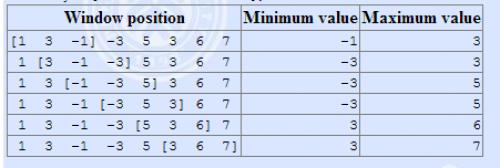

# 滑动窗口 /【模板】单调队列

## 题目描述

有一个长为 $n$ 的序列 $a$，以及一个大小为 $k$ 的窗口。现在这个从左边开始向右滑动，每次滑动一个单位，求出每次滑动后窗口中的最大值和最小值。

例如：

The array is $[1,3,-1,-3,5,3,6,7]$, and $k = 3$。



## 输入格式

输入一共有两行，第一行有两个正整数 $n,k$。
第二行 $n$ 个整数，表示序列 $a$

## 输出格式

输出共两行，第一行为每次窗口滑动的最小值   
第二行为每次窗口滑动的最大值

## 样例 #1

### 样例输入 #1

```
8 3
1 3 -1 -3 5 3 6 7
```

### 样例输出 #1

```
-1 -3 -3 -3 3 3
3 3 5 5 6 7
```

## 提示

【数据范围】    
对于 $50\%$ 的数据，$1 \le n \le 10^5$；  
对于 $100\%$ 的数据，$1\le k \le n \le 10^6$，$a_i \in [-2^{31},2^{31})$。

```c++
#include<bits/stdc++.h>

using namespace std;
const int N = 2e6 + 10;
int n, k;
int a[N];
int q[N];

int main() {
    cin >> n >> k;
    for (int i = 0; i < n; ++i) scanf("%d", &a[i]);
    int hh = 0, tt = -1;
    for (int i = 0; i < n; ++i) {
        if (i - k + 1 > q[hh]) hh++;
        while (hh <= tt && a[q[tt]] > a[i]) tt--;
        q[++tt] = i;
        if (i >= k - 1) printf("%d ", a[q[hh]]);
    }
    cout << endl;
    hh = 0, tt = -1;
    for (int i = 0; i < n; ++i) {
        if (i - k + 1 > q[hh]) hh++;
        while (hh <= tt && a[q[tt]] < a[i]) tt--;
        q[++tt] = i;
        if (i >= k - 1) printf("%d ", a[q[hh]]);
    }
    return 0;
} 
```


# 切蛋糕

## 题目描述

今天是小 Z 的生日，同学们为他带来了一块蛋糕。这块蛋糕是一个长方体，被用不同色彩分成了 $n$ 个相同的小块，每小块都有对应的幸运值。

小 Z 作为寿星，自然希望吃到的蛋糕的幸运值总和最大，但小 Z 最多又只能吃 $m(m\le n)$ 小块的蛋糕。

请你帮他从这 $n$ 小块中找出**连续**的 $k(1 \le k\le m)$ 块蛋糕，使得其上的总幸运值最大。

**形式化地**，在数列 $\{p_n\}$ 中，找出一个子段 $[l,r](r-l+1\le m)$，最大化 $\sum\limits_{i=l}^rp_i$。

## 输入格式

第一行两个整数 $n,m$。分别代表共有 $n$ 小块蛋糕，小 Z 最多只能吃 $m$ 小块。

第二行 $n$ 个整数，第 $i$ 个整数 $p_i$ 代表第 $i$ 小块蛋糕的幸运值。

## 输出格式

仅一行一个整数，即小 Z 能够得到的最大幸运值。

## 样例 #1

### 样例输入 #1

```
5 2
1 2 3 4 5
```

### 样例输出 #1

```
9
```

## 样例 #2

### 样例输入 #2

```
6 3
1 -2 3 -4 5 -6
```

### 样例输出 #2

```
5
```

## 提示

#### 数据规模与约定

- 对于 $20\%$ 的数据，有 $1\le n\le100$。
- 对于 $100\%$ 的数据，有 $1\le n\le5\times 10^5$，$|p_i|≤500$。

保证答案的绝对值在 $[0,2^{31}-1]$ 之内。

```c++
#include <bits/stdc++.h>

using namespace std;
const int N = 5e5 + 10;

int n, m, sum[N];
deque<int> q;
int ans, a;

int main() {
    scanf("%d%d", &n, &m);
    for (int i = 1; i <= n; i++) {
        scanf("%d", &a);
        sum[i] = sum[i - 1] + a;
    }
    q.push_back(0);  // 赋初始值
    for (int i = 1; i <= n; i++) {
        while (q.front() + m < i) q.pop_front();
        ans = max(ans, sum[i] - sum[q.front()]);
        while (!q.empty() && sum[q.back()] >= sum[i]) q.pop_back();
        q.push_back(i);
    }
    printf("%d\n", ans);
    return 0;
}
```

**我发现题解中大多数用单调队列做的都是错的！！**（不仅是用单调队列，题解中其他的方法基本都能被hack）

不信你试试`5 2 5 4 3 2 1`，题解中大多数输出的都是7或者`1 1 5`，输出的都是`0`，主要是这道题数据太水了

**所以我决定来给出一个用STL做的正确解法，不能误导别人呀**

所以管理员你就让我过了吧

其他题解之所以会被hack是因为他们光顾着维护队列单调递增（前缀和递增才会保证最大），忘了万一数据是单调递减怎么办。所以我们应该在维护递增之前就判断现在的答案是否为最优。为了达到这个目的我们应该先给队列赋初值0，因为`sum[i]-sum[q.front()]`这一句，不赋初值就出bug了，正好赋初值之后就可以避免第一个值是最大的，其余都是负的（如`5 2 1 -10 -10 -10 -10 -10`）这种丧心病狂的数据了。


# 队列安排

## 题目描述

一个学校里老师要将班上 $N$ 个同学排成一列，同学被编号为 $1\sim N$，他采取如下的方法：

1. 先将 $1$ 号同学安排进队列，这时队列中只有他一个人；

2. $2\sim N$ 号同学依次入列，编号为 $i$ 的同学入列方式为：老师指定编号为 $i$ 的同学站在编号为 $1\sim(i-1)$ 中某位同学（即之前已经入列的同学）的左边或右边；

3. 从队列中去掉 $M$ 个同学，其他同学位置顺序不变。

在所有同学按照上述方法队列排列完毕后，老师想知道从左到右所有同学的编号。

## 输入格式

第一行一个整数 $N$，表示了有 $N$ 个同学。

第 $2\sim N$ 行，第 $i$ 行包含两个整数 $k,p$，其中 $k$ 为小于 $i$ 的正整数，$p$ 为 $0$ 或者 $1$。若 $p$ 为 $0$，则表示将 $i$ 号同学插入到 $k$ 号同学的左边，$p$ 为 $1$ 则表示插入到右边。

第 $N+1$ 行为一个整数 $M$，表示去掉的同学数目。

接下来 $M$ 行，每行一个正整数 $x$，表示将 $x$ 号同学从队列中移去，如果 $x$ 号同学已经不在队列中则忽略这一条指令。

## 输出格式

一行，包含最多 $N$ 个空格隔开的整数，表示了队列从左到右所有同学的编号。

## 样例 #1

### 样例输入 #1

```
4
1 0
2 1
1 0
2
3
3
```

### 样例输出 #1

```
2 4 1
```

## 提示

**【样例解释】**

将同学 $2$ 插入至同学 $1$ 左边，此时队列为：

`2 1`

将同学 $3$ 插入至同学 $2$ 右边，此时队列为：

`2 3 1`  

将同学 $4$ 插入至同学 $1$ 左边，此时队列为：

`2 3 4 1`  

将同学 $3$ 从队列中移出，此时队列为：

`2 4 1`  

同学 $3$ 已经不在队列中，忽略最后一条指令

最终队列：

`2 4 1`  

**【数据范围】**

对于 $20\%$ 的数据，$1\leq N\leq 10$。

对于 $40\%$ 的数据，$1\leq N\leq 1000$。

对于 $100\%$ 的数据，$1<M\leq N\leq 10^5$。

**本题目仅仅是标签上有单调队列，但是没用到单调队列**

```c++
#include<iostream>
#include<cstdio>
#include<cstdlib>
#include<cstring>

using namespace std;
const int mx = 1e5 + 10;
int n, m;
struct T {
    int l, r;
    //每个同学的“左右手” 
    int d;
    //表示同学是否输出 
} t[mx] = {0};

void add(int i, int k, int f)
{
    if (f == 1) {
        // 把k插入到i的右边
        t[k].r = t[i].r;
        t[k].l = i;
        t[i].r = k;
        t[t[k].r].l = k;
    } else {
        // 把k插入到i的左边
        t[k].r = i;
        t[k].l = t[i].l;
        t[i].l = k;
        t[t[k].l].r = k;
    }
}

int main() {
    int x, k, f;
    cin >> n;
    //等于1表示插入到右边
    add(0, 1, 1);
    for (int i = 2; i <= n; i++) {
        cin >> x >> f;
        add(x, i, f);
    }
    cin >> m;
    while (m--) {
        cin >> x;
        //将该同学标记为不输出 
        t[x].d = 1;
    }
    for (int i = t[0].r; i; i = t[i].r) {
        if (t[i].d == 0)
            cout << i << " ";
    }
    return 0;
}
```


# 扫描

## 题目描述

有一个 $1 \times n$ 的矩阵，有 $n$ 个整数。

现在给你一个可以盖住连续 $k$ 个数的木板。

一开始木板盖住了矩阵的第 $1 \sim k$ 个数，每次将木板向右移动一个单位，直到右端与第 $n$ 个数重合。

每次移动前输出被覆盖住的数字中最大的数是多少。

## 输入格式

第一行两个整数 $n,k$，表示共有 $n$ 个数，木板可以盖住 $k$ 个数。

第二行 $n$ 个整数，表示矩阵中的元素。

## 输出格式

共 $n - k + 1$ 行，每行一个整数。

第 $i$ 行表示第 $i \sim i + k - 1$ 个数中最大值是多少。

## 样例 #1

### 样例输入 #1

```
5 3
1 5 3 4 2
```

### 样例输出 #1

```
5
5
4
```

## 提示

对于 $20\%$ 的数据，$1 \leq k \leq n \leq 10^3$。

对于 $50\%$ 的数据，$1 \leq k \leq n \leq 10^4$。

对于 $100\%$ 的数据，$1 \leq k \leq n \leq 2 \times 10^6$，矩阵中的元素大小不超过 $10^4$ 并且均为正整数。

```c++
#include<bits/stdc++.h>

using namespace std;
const int N = 2e6 + 10;
int n, k;
int a[N];
int q[N];

int main() {
    cin >> n >> k;
    for (int i = 0; i < n; ++i) scanf("%d", &a[i]);
    int hh = 0, tt = -1;
    for (int i = 0; i < n; ++i) {
        if (i - k + 1 > q[hh]) hh++;
        while (hh <= tt && a[q[tt]] < a[i]) tt--;
        q[++tt] = i;
        if (i >= k - 1) printf("%d\n", a[q[hh]]);
    }
    return 0;
} 
```


# 求m区间内的最小值

## 题目描述

一个含有 $n$ 项的数列，求出每一项前的 $m$ 个数到它这个区间内的最小值。若前面的数不足 $m$ 项则从第 $1$ 个数开始，若前面没有数则输出 $0$。

## 输入格式

第一行两个整数，分别表示 $n$，$m$。

第二行，$n$ 个正整数，为所给定的数列 $a_i$。

## 输出格式

$n$ 行，每行一个整数，第 $i$ 个数为序列中 $a_i$ 之前 $m$ 个数的最小值。

## 样例 #1

### 样例输入 #1

```
6 2
7 8 1 4 3 2
```

### 样例输出 #1

```
0
7
7
1
1
3
```

## 提示

对于 $100\%$ 的数据，保证 $1\le m\le n\le2\times10^6$，$1\le a_i\le3\times10^7$。

```c++
#include<bits/stdc++.h>

using namespace std;
const int N = 2e6 + 10;
int n, m;
int a[N];
int q[N];

int main() {
    cin >> n >> m;
    for (int i = 1; i <= n; ++i) scanf("%d", &a[i]);
    cout << 0 << endl;
    int hh = 0, tt = -1;
    q[0] = 1;
    for (int i = 1; i < n; ++i) {
        if (i - m + 1 > q[hh]) hh++;
        while (hh <= tt && a[q[tt]] >= a[i]) --tt;
        q[++tt] = i;
        printf("%d\n", a[q[hh]]);
    }
    return 0;
} 
```


# 寻找段落

## 题目描述

给定一个长度为 $n$ 的序列 $a$，定义 $a_i$ 为第 $i$ 个元素的价值。现在需要找出序列中最有价值的“段落”。段落的定义是长度在 $[S, T]$ 之间的连续序列。最有价值段落是指平均值最大的段落。

**段落的平均值** 等于 **段落总价值** 除以 **段落长度**。

## 输入格式

第一行一个整数 $n$，表示序列长度。

第二行两个整数 $S$ 和 $T$，表示段落长度的范围，在 $[S, T]$ 之间。

第三行到第 $n+2$ 行，每行一个整数表示每个元素的价值指数。

## 输出格式

一个实数，保留 $3$ 位小数，表示最优段落的平均值。

## 样例 #1

### 样例输入 #1

```
3
2 2
3
-1
2
```

### 样例输出 #1

```
1.000
```

## 提示

【数据范围】

对于 $30\%$ 的数据有 $n \le 1000$。

对于 $100\%$ 的数据有 $1 \le n \le 100000$，$1 \le S \le T \le n$，$-{10}^4 \le a_i \le {10}^4$。

【题目来源】

tinylic 改编

```c++
#include <bits/stdc++.h>

using namespace std;
const int N = 1e5 + 10;
int n, a[N], s, t;
double f[N];

bool check(double mid) {
    for (int i = 1; i <= n; ++i) f[i] = f[i - 1] + (double) a[i] - mid;
    int hh = 1, tt = 0, q[N];
    // 队列中始终保持最小值
    for (int i = s; i <= n; ++i) {
        while (hh <= tt && f[q[tt]] > f[i - s]) tt--;
        q[++tt] = i - s;
        while (hh <= tt && q[hh] < i - t) hh++;
        if (hh <= tt && f[i] - f[q[hh]] > 0) return true;
    }
    return false;
}

int main() {
    cin >> n >> s >> t;
    for (int i = 1; i <= n; ++i) scanf("%d", &a[i]);
    double l = -2e9, r = 2e9;
    while (r - l > 0.00001) {
        double mid = (l + r) / 2.0;
        if (check(mid)) l = mid;
        else r = mid;
    }
    printf("%.3lf", l);
    return 0;
}
```


红色线段是我们要维护的单调队列，队列内部维护一个最小值。


# 质量检测

## 题目描述

为了检测生产流水线上总共 $N$ 件产品的质量，我们首先给每一件产品打一个分数 $A$ 表示其品质，然后统计前 $M$ 件产品中质量最差的产品的分值 $Q[m] = min\{A_1, A_2, ... A_m\}$，以及第 2 至第 $M + 1$ 件的 $Q[m + 1], Q[m + 2] $... 最后统计第 $N - M + 1$ 至第 $N$ 件的 $Q[n]$。根据 $Q$ 再做进一步评估。

请你尽快求出 $Q$ 序列。

## 输入格式

输入共两行。

第一行共两个数 $N$、$M$，由空格隔开。含义如前述。

第二行共 $N$ 个数，表示 $N$ 件产品的质量。

## 输出格式

输出共 $N - M + 1$ 行。

第 1 至 $N - M + 1$ 行每行一个数，第 $i$ 行的数 $Q[i + M - 1]$。含义如前述。

## 样例 #1

### 样例输入 #1

```
10 4
16 5 6 9 5 13 14 20 8 12
```

### 样例输出 #1

```
5
5
5
5
5
8
8
```

## 提示

[数据范围]

30%的数据，$N \le 1000$

100%的数据，$N \le 100000$

100%的数据，$M \le N, A \le 1 000 000$

```c++
#include <bits/stdc++.h>

using namespace std;
const int N = 1000010;
int n, k;
int a[N];
int q[N];

int main() {
    scanf("%d%d", &n, &k);
    for (int i = 0; i < n; i++) scanf("%d", &a[i]);
    int hh = 0, tt = -1;
    for (int i = 0; i < n; i++) {
        if (hh <= tt && i - k + 1 > q[hh]) hh++;
        while (hh <= tt && a[q[tt]] >= a[i]) tt--;
        q[++tt] = i;
        if (i >= k - 1) printf("%d\n", a[q[hh]]);
    }
    return 0;
} 
```


# [蓝桥杯 2018 省 B] 日志统计

## 题目描述

小明维护着一个程序员论坛。现在他收集了一份“点赞”日志，日志共有 $N$ 行。其中每一行的格式是 `ts id`，表示在 $ts$ 时刻编号 $id$ 的帖子收到一个“赞”。

现在小明想统计有哪些帖子曾经是“热帖”。如果一个帖子曾在任意一个长度为 $D$ 的时间段内收到不少于 $K$ 个赞，小明就认为这个帖子曾是“热帖”。

具体来说，如果存在某个时刻 $T$ 满足该帖在 $[T,T+D)$ 这段时间内（注意是左闭右开区间）收到不少于 $K$ 个赞，该帖就曾是“热帖”。

给定日志，请你帮助小明统计出所有曾是“热帖”的帖子编号。

## 输入格式

第一行包含三个整数 $N$、$D$ 和 $K$。

以下 $N$ 行每行一条日志，包含两个整数 $ts$ 和 $id$。

## 输出格式

按从小到大的顺序输出热帖 $id$。每个 $id$ 一行。

## 样例 #1

### 样例输入 #1

```
7 10 2  
0 1  
0 10    
10 10  
10 1  
9 1
100 3  
100 3
```

### 样例输出 #1

```
1  
3
```

## 提示

对于 $50\%$ 的数据，$1 \le K \le N \le 1000$。

对于 $100\%$ 的数据，$1 \le K \le N \le 10^5$，$0 \le id, ts \le 10^5$。

时限 1 秒, 256M。蓝桥杯 2018 年第九届省赛

**本题更像是一个双指针的问题**

```c++
#include<bits/stdc++.h>

using namespace std;
const int N = 1e5 + 10;
typedef pair<int, int> PII;

PII logs[N];
int k, n, d;
int cnt[N];
bool st[N];

int main() {
    cin >> n >> d >> k;
    for (int i = 0; i < n; i++) scanf("%d%d", &logs[i].first, &logs[i].second);
    sort(logs, logs + n);
    for (int i = 0, j = 0; i < n; ++i) {
        int id = logs[i].second;
        cnt[id]++;
        while (logs[i].first - logs[j].first >= d) {
            cnt[logs[j].second]--;
            ++j;
        }
        if (cnt[id] >= k) st[id] = true;
    }
    for (int i = 0; i < 1e5 + 8; i++) if (st[i]) printf("%d\n", i);
    return 0;
}
```

