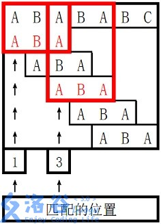

# 【模板】KMP字符串匹配

## 题目描述

给出两个字符串 $s_1$ 和 $s_2$，若 $s_1$ 的区间 $[l, r]$ 子串与 $s_2$ 完全相同，则称 $s_2$ 在 $s_1$ 中出现了，其出现位置为 $l$。  
现在请你求出 $s_2$ 在 $s_1$ 中所有出现的位置。

定义一个字符串 $s$ 的 border 为 $s$ 的一个**非 $s$ 本身**的子串 $t$，满足 $t$ 既是 $s$ 的前缀，又是 $s$ 的后缀。  
对于 $s_2$，你还需要求出对于其每个前缀 $s'$ 的最长 border $t'$ 的长度。

## 输入格式

第一行为一个字符串，即为 $s_1$。  
第二行为一个字符串，即为 $s_2$。

## 输出格式

首先输出若干行，每行一个整数，**按从小到大的顺序**输出 $s_2$ 在 $s_1$ 中出现的位置。  
最后一行输出 $|s_2|$ 个整数，第 $i$ 个整数表示 $s_2$ 的长度为 $i$ 的前缀的最长 border 长度。

## 样例 #1

### 样例输入 #1

```
ABABABC
ABA
```

### 样例输出 #1

```
1
3
0 0 1
```

## 提示

### 样例 1 解释

 。

对于 $s_2$ 长度为 $3$ 的前缀 `ABA`，字符串 `A` 既是其后缀也是其前缀，且是最长的，因此最长 border 长度为 $1$。


### 数据规模与约定

**本题采用多测试点捆绑测试，共有 3 个子任务**。

- Subtask 1（30 points）：$|s_1| \leq 15$，$|s_2| \leq 5$。
- Subtask 2（40 points）：$|s_1| \leq 10^4$，$|s_2| \leq 10^2$。
- Subtask 3（30 points）：无特殊约定。

对于全部的测试点，保证 $1 \leq |s_1|,|s_2| \leq 10^6$，$s_1, s_2$ 中均只含大写英文字母。

```c++
#include <bits/stdc++.h>

using namespace std;
const int M = 1e6 + 10;
int n, m;
int ne[M];
char s[M], p[M];// p 是子串    s是给出的序列 

int main() {
    cin >> s + 1 >> p + 1;
    n = strlen(p + 1);
    m = strlen(s + 1);

    // 求出 next 数组 
    for (int i = 2, j = 0; i <= n; i++) {
        while (j && p[i] != p[j + 1]) j = ne[j];
        if (p[i] == p[j + 1]) j++;
        ne[i] = j;
    }

    // 利用 next 数组进行匹配 
    for (int i = 1, j = 0; i <= m; i++) {
        while (j && s[i] != p[j + 1]) j = ne[j];
        if (s[i] == p[j + 1]) j++;
        if (j == n) {
            printf("%d\n", i - n + 1);
            j = ne[j];
        }
    }
    for (int i = 1; i <= n; ++i) cout << ne[i] << " ";
    return 0;
}
```


# [BOI2009]Radio Transmission 无线传输

## 题目描述

给你一个字符串 $s_1$，它是由某个字符串 $s_2$ 不断自我连接形成的（保证至少重复 $2$ 次）。但是字符串 $s_2$ 是不确定的，现在只想知道它的最短长度是多少。

## 输入格式

第一行一个整数 $L$，表示给出字符串的长度。 

第二行给出字符串 $s_1$ 的一个子串，全由小写字母组成。

## 输出格式

仅一行，表示 $s_2$ 的最短长度。

## 样例 #1

### 样例输入 #1

```
8
cabcabca
```

### 样例输出 #1

```
3
```

## 提示

#### 样例输入输出 1 解释
对于样例，我们可以利用 $\texttt{abc}$ 不断自我连接得到 $\texttt{abcabcabc}$，读入的 $\texttt{cabcabca}$，是它的子串。

#### 规模与约定
对于全部的测试点，保证 $1 < L \le 10^6$。

```c++
#include <bits/stdc++.h>

using namespace std;
const int N = 1e6 + 10;
int n, ne[N];
char s[N];

int main() {
    cin >> n >> s + 1;
    for (int i = 2, j = 0; i <= n; ++i) {
        while (j && s[i] != s[j + 1]) j = ne[j];
        if (s[i] == s[j + 1]) j++;
        ne[i] = j;
    }
    cout << n - ne[n] << endl;
    return 0;
}
```


# 魔族密码

## 题目描述

风之子刚走进他的考场，就……

花花：当当当当~~偶是魅力女皇——花花！！^^（华丽出场，礼炮，鲜花）

风之子：我呕……（杀死人的眼神）快说题目！否则……-\_-###

花花：……咦~~好冷~~我们现在要解决的是魔族的密码问题（自我陶醉：搞不好魔族里面还会有人用密码给我和菜虫写情书咧，哦活活，当然是给我的比较多拉\*^\_^\*）。魔族现在使用一种新型的密码系统。每一个密码都是一个给定的仅包含小写字母的英文单词表，每个单词至少包含1个字母，至多75个字母。如果在一个由一个词或多个词组成的表中，除了最后一个以外，每个单词都被其后的一个单词所包含，即前一个单词是后一个单词的前缀，则称词表为一个词链。例如下面单词组成了一个词链：

i
int
integer

但下面的单词不组成词链：

integer

intern
现在你要做的就是在一个给定的单词表中取出一些词，组成最长的词链，就是包含单词数最多的词链。将它的单词数统计出来，就得到密码了。

风之子：密码就是最长词链所包括的单词数阿……

花花：活活活，还有，看你长得还不错，给你一个样例吧：

## 输入格式

这些文件的格式是，第一行为单词表中的单词数N（1<=N<=2000），下面每一行有一个单词，按字典顺序排列，中间也没有重复的单词咧！！

## 输出格式

你要提交的文件中只要在第一行输出密码就行啦^^

## 样例 #1

### 样例输入 #1

```
5
i
int
integer
intern
internet
```

### 样例输出 #1

```
4
```

```c++
#include <bits/stdc++.h>

using namespace std;
const int N = 2010;
int n;
string s[N];
int f[N];

int main() {
    cin >> n;
    for (int i = 0; i < n; ++i) cin >> s[i];
    for (int i = 0; i < n; ++i) f[i] = 1;
    for (int i = 0; i < n; ++i) {
        for (int j = i + 1; j < n; ++j) {
            if (s[j].find(s[i]) == 0) {
                f[j] = max(f[j], f[i] + 1);
            }
        }
    }
    int res = 0;
    for (int i = 0; i < n; i++) res = res > f[i] ? res : f[i];
    cout << res << endl;
    return 0;
}
```


# 于是他错误的点名开始了

## 题目背景

XS中学化学竞赛组教练是一个酷爱炉石的人。

他会一边搓炉石一边点名以至于有一天他连续点到了某个同学两次，然后正好被路过的校长发现了然后就是一顿欧拉欧拉欧拉（详情请见已结束比赛 CON900）。

## 题目描述

这之后校长任命你为特派探员，每天记录他的点名。校长会提供化学竞赛学生的人数和名单，而你需要告诉校长他有没有点错名。（为什么不直接不让他玩炉石。）

## 输入格式

第一行一个整数 $n$，表示班上人数。

接下来 $n$ 行，每行一个字符串表示其名字（互不相同，且只含小写字母，长度不超过 $50$）。

第 $n+2$ 行一个整数 $m$，表示教练报的名字个数。

接下来 $m$ 行，每行一个字符串表示教练报的名字（只含小写字母，且长度不超过 $50$）。

## 输出格式

对于每个教练报的名字，输出一行。

如果该名字正确且是第一次出现，输出 `OK`，如果该名字错误，输出 `WRONG`，如果该名字正确但不是第一次出现，输出 `REPEAT`。

## 样例 #1

### 样例输入 #1

```
5  
a
b
c
ad
acd
3
a
a
e
```

### 样例输出 #1

```
OK
REPEAT
WRONG
```

## 提示

- 对于 $40\%$ 的数据，$n\le 1000$，$m\le 2000$。
- 对于 $70\%$ 的数据，$n\le 10^4$，$m\le 2\times 10^4$。
- 对于 $100\%$ 的数据，$n\le 10^4$，$m≤10^5$。

---

$\text{upd 2022.7.30}$：新增加一组 Hack 数据。

```c++
#include <bits/stdc++.h>

using namespace std;
int n, m;
map<string, int> q;

int main() {
    cin >> n;
    for (int i = 0; i < n; ++i) {
        string s;
        cin >> s;
        q[s] = 1;
    }
    cin >> m;
    for (int i = 0; i < m; ++i) {
        string s;
        cin >> s;
        if (q.count(s) == 0) cout << "WRONG" << endl;
        else if (q.count(s) == 1) {
            if (q[s] == 1) {
                cout << "OK" << endl;
                q[s] = 2;
            } else {
                cout << "REPEAT" << endl;
            }
        }
    }
    return 0;
}
```