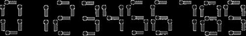

https://www.luogu.com.cn/training/108#problems

# 统计方形（数据加强版）

## 题目背景

1997年普及组第一题

## 题目描述

有一个 $n \times m$ 方格的棋盘，求其方格包含多少正方形、长方形（不包含正方形）。

## 输入格式

一行，两个正整数 $n,m$（$n \leq 5000,m \leq 5000$）。

## 输出格式

一行，两个正整数，分别表示方格包含多少正方形、长方形（不包含正方形）。

## 样例 #1

### 样例输入 #1

```
2 3
```

### 样例输出 #1

```
8 10
```

对于这道题，我们先考虑第一个问题

**一、算正方形的个数**

1.如果我们<u>固定了正方形的右下角</u>`(i,j)`,你能不能算出此时可能的正方形的个数？

2.显然，此时答案为`Min(i,j)`.

3.所以可以枚举右下角，计算此时答案，求和即可。

**二、算长方形个数**

1.其实算长方形并不常见，但算矩形大家应该经常遇到，所以如果你会算矩形，再联系第一个问题，那答案就转化为 `矩形个数-正方形个数`.

2.像求解正方形个数一样，固定矩形右下角`(i,j)`,显然此时矩形个数为`i*j`.

3.同理，求和即可.

时间复杂度：O(n*m)，是挺慢的，其实可以写成一个式子

**固定左上角虽然思路和右下角一样，但实现起来没有右下角简易**

**主要是学习固定某一个点来枚举所有可能的正方形和矩形的思路，同时会发现固定右下角的代码实现难度会低于固定左上角**

```c++
#include<bits/stdc++.h>

using namespace std;
typedef long long int LL;
LL n, m, sum1, sum2; // sum1 正方形  sum2 矩形 

int main() {
    cin >> n >> m;
    for (int i = 1; i <= n; ++i) {
        for (int j = 1; j <= m; ++j) {
            sum1 += min(i, j);
            sum2 += i * j;
        }
    }
    cout << sum1 << " " << sum2 - sum1;
    return 0;
}
```

记得开 `long long int`


# 烤鸡

## 题目背景

猪猪 Hanke 得到了一只鸡。

## 题目描述

猪猪 Hanke 特别喜欢吃烤鸡（本是同畜牲，相煎何太急！）Hanke 吃鸡很特别，为什么特别呢？因为他有 $10$ 种配料（芥末、孜然等），每种配料可以放 $1$ 到 $3$ 克，任意烤鸡的美味程度为所有配料质量之和。

现在， Hanke 想要知道，如果给你一个美味程度 $n$ ，请输出这 $10$ 种配料的所有搭配方案。

## 输入格式

一个正整数 $n$，表示美味程度。

## 输出格式

第一行，方案总数。

第二行至结束，$10$ 个数，表示每种配料所放的质量，按字典序排列。

如果没有符合要求的方法，就只要在第一行输出一个 $0$。

## 样例 #1

### 样例输入 #1

```
11
```

### 样例输出 #1

```
10
1 1 1 1 1 1 1 1 1 2 
1 1 1 1 1 1 1 1 2 1 
1 1 1 1 1 1 1 2 1 1 
1 1 1 1 1 1 2 1 1 1 
1 1 1 1 1 2 1 1 1 1 
1 1 1 1 2 1 1 1 1 1 
1 1 1 2 1 1 1 1 1 1 
1 1 2 1 1 1 1 1 1 1 
1 2 1 1 1 1 1 1 1 1 
2 1 1 1 1 1 1 1 1 1
```

## 提示

对于 $100\%$ 的数据，$n \leq 5000$。

**正解是搜索，歪解是枚举**

```c++
#include<iostream>  
using namespace std;  
int main()  
{  
    int a,b,c,d,e,f,g,h,i,j,in,x=0;  
    cin>>in;  
    for (a=1;a<=3;a++)  
    {  
        for (b=1;b<=3;b++)  
        {  
            for (c=1;c<=3;c++)  
            {  
                for (d=1;d<=3;d++)  
                {  
                    for (e=1;e<=3;e++)  
                    {  
                        for (f=1;f<=3;f++)  
                        {  
                            for (g=1;g<=3;g++)  
                            {  
                                for(h=1;h<=3;h++)  
                                {  
                                    for (i=1;i<=3;i++)  
                                    {  
                                        for (j=1;j<=3;j++)  
                                        {  
                                            if (a+b+c+d+e+f+g+h+i+j==in)  
                                            {  
                                                x++;  
                                            }  
                                        }  
                                    }  
                                }  
                            }  
                        }  
                    }  
                }  
            }  
        }  
    }  
    cout<<x<<endl;  
    for (a=1;a<=3;a++)  
    {  
        for (b=1;b<=3;b++)  
        {  
            for (c=1;c<=3;c++)  
            {  
                for (d=1;d<=3;d++)  
                {  
                    for (e=1;e<=3;e++)  
                    {  
                        for (f=1;f<=3;f++)  
                        {  
                            for (g=1;g<=3;g++)  
                            {  
                                for(h=1;h<=3;h++)  
                                {  
                                    for (i=1;i<=3;i++)  
                                    {  
                                        for (j=1;j<=3;j++)  
                                        {  
                                            if (a+b+c+d+e+f+g+h+i+j==in)  
                                            {  
                                                cout<<a<<" ";  
                                                cout<<b<<" ";  
                                                cout<<c<<" ";  
                                                cout<<d<<" ";  
                                                cout<<e<<" ";  
                                                cout<<f<<" ";  
                                                cout<<g<<" ";  
                                                cout<<h<<" ";  
                                                cout<<i<<" ";  
                                                cout<<j<<endl;  
                                            }  
                                        }  
                                    }  
                                }  
                            }  
                        }  
                    }  
                }  
            }  
        }  
    }  
}
```


**自己写的**

```c++
#include<bits/stdc++.h>

using namespace std;

int a[13];
int cnt;
int total;

void dfs1(int n) {
    if (n == 10) {
        int sum = 0;
        for (int i = 0; i < 10; i++) sum += a[i];
        if (sum == total) cnt++;
        return;
    }
    for (int i = 1; i <= 3; i++) {
        a[n] = i;
        dfs1(n + 1);
    }
}

void dfs2(int n) {
    if (n == 10) {
        int sum = 0;
        for (int i = 0; i < 10; i++) sum += a[i];
        if (sum == total) {
            for (int i = 0; i < 10; i++) printf("%d ", a[i]);
            puts("");
        }
        return;
    }
    for (int i = 1; i <= 3; i++) {
        a[n] = i;
        dfs2(n + 1);
    }
}

int main() {
    cin >> total;
    if (total > 30 || total < 10) {
        cout << "0";
        return 0;
    }
    dfs1(0);
    cout << cnt << endl;
    dfs2(0);
    return 0;
}
```

个人做法比较麻烦，搜索了两遍。搜索两遍是因为我们需要在给出具体的方案之前给出答案的总数。

一定要在搜索前，判断是否存在答案


# 三连击（升级版）

## 题目描述

将 $1, 2,\ldots, 9$ 共 $9$ 个数分成三组，分别组成三个三位数，且使这三个三位数的比例是 $A:B:C$，试求出所有满足条件的三个三位数，若无解，输出 `No!!!`。


//感谢黄小U饮品完善题意

## 输入格式

三个数，$A,B,C$。

## 输出格式

若干行，每行 $3$ 个数字。按照每行第一个数字升序排列。

## 样例 #1

### 样例输入 #1

```
1 2 3
```

### 样例输出 #1

```
192 384 576
219 438 657
273 546 819
327 654 981
```

## 提示

保证 $A<B<C$。

---

$\text{upd 2022.8.3}$：新增加二组 Hack 数据。

```c++
#include<bits/stdc++.h>

using namespace std;

int A, B, C;
int a[12];
bool st[12];
bool success;

void dfs(int n) {
    if (n == 10) {
        int x = a[1] * 100 + a[2] * 10 + a[3];
        int y = a[4] * 100 + a[5] * 10 + a[6];
        int z = a[7] * 100 + a[8] * 10 + a[9];

        if (x * B * C == y * A * C && x * B * C == z * A * B) {
            printf("%d %d %d\n", x, y, z);
            success = true;
        }
        return;
    }

    for (int i = 1; i <= 9; ++i) {
        if (!st[i]) {
            a[n] = i;
            st[i] = true;
            dfs(n + 1);
            st[i] = false;
        }
    }
}

int main() {
    cin >> A >> B >> C;
    dfs(1);
    if (!success) cout << "No!!!";
    return 0;
}
```

虽然说是分成了三组，但实际上可以理解成数组长为9，每三个为一组，这样就避免了在搜索过程中分组。直接在搜索结束后对数组分三组进行条件检查即可。

另外利用`全局bool变量`判断是否存在解

对于该题另外一个非常值得学习的地方就是处理比例问题，一般情况下，`int`的比例问题非常难以处理，因为转换成浮点型会涉及到`==`比较的问题（通常情况下 `double`无法进行`==`判断，因为存在浮点数误差。一般`double`只有`<`、`>`两种比较


# [NOIP2002 普及组] 选数

## 题目描述

已知 $n$ 个整数 $x_1,x_2,\cdots,x_n$，以及 $1$ 个整数 $k$（$k<n$）。从 $n$ 个整数中任选 $k$ 个整数相加，可分别得到一系列的和。例如当 $n=4$，$k=3$，$4$ 个整数分别为 $3,7,12,19$ 时，可得全部的组合与它们的和为：

$3+7+12=22$

$3+7+19=29$

$7+12+19=38$

$3+12+19=34$

现在，要求你计算出和为素数共有多少种。

例如上例，只有一种的和为素数：$3+7+19=29$。

## 输入格式

第一行两个空格隔开的整数 $n,k$（$1 \le n \le 20$，$k<n$）。

第二行 $n$ 个整数，分别为 $x_1,x_2,\cdots,x_n$（$1 \le x_i \le 5\times 10^6$）。

## 输出格式

输出一个整数，表示种类数。

## 样例 #1

### 样例输入 #1

```
4 3
3 7 12 19
```

### 样例输出 #1

```
1
```

## 提示

**【题目来源】**

NOIP 2002 普及组第二题

```c++
#include<bits/stdc++.h>

using namespace std;
const int N = 25;

int n, k;
int a[N];
int num;
int cnt;
int sum;
bool st[N];

bool check(int num) {
    if (num < 2) return false;
    for (int i = 2; i <= num / i; ++i) {
        if (num % i == 0) return false;
    }
    return true;
}

void dfs(int x) {
    if (cnt == k) {
        if (check(num)) sum++;
        return;
    }
    if (x == n) return;
    cnt++;
    num += a[x];
    dfs(x + 1);
    cnt--;
    num -= a[x];
    dfs(x + 1);
}

int main() {
    cin >> n >> k;
    for (int i = 0; i < n; i++) cin >> a[i];
    dfs(0);
    cout << sum;
    return 0;
}
```


# 组合的输出

## 题目描述

排列与组合是常用的数学方法，其中组合就是从 $n$ 个元素中抽出 $r$ 个元素（不分顺序且 $r \le n$），我们可以简单地将 $n$ 个元素理解为自然数 $1,2,\dots,n$，从中任取 $r$ 个数。

现要求你输出所有组合。

例如 $n=5,r=3$，所有组合为：

$123,124,125,134,135,145,234,235,245,345$。

## 输入格式

一行两个自然数 $n,r(1<n<21,0 \le r \le n)$。

## 输出格式

所有的组合，每一个组合占一行且其中的元素按由小到大的顺序排列，每个元素占三个字符的位置，所有的组合也按字典顺序。

**注意哦！输出时，每个数字需要 $3$ 个场宽。以 C++ 为例，你可以使用下列代码：**

```cpp
cout << setw(3) << x;
```

输出占 $3$ 个场宽的数 $x$。注意你需要头文件 `iomanip`。

## 样例 #1

### 样例输入 #1

```
5 3
```

### 样例输出 #1

```
  1  2  3
  1  2  4
  1  2  5
  1  3  4
  1  3  5
  1  4  5
  2  3  4
  2  3  5
  2  4  5
  3  4  5
```


```c++
#include<bits/stdc++.h>

using namespace std;
const int N = 25;

int cnt;
int n, r;
bool st[N];

void dfs(int x) {
    if (cnt == r) {
        for (int i = 1; i <= n; i++) if (st[i]) printf("%3d", i);
        puts("");
        return;
    }
    if (x > n) return;

    cnt++;
    st[x] = true;
    dfs(x + 1);
    cnt--;
    st[x] = false;
    dfs(x + 1);
}

int main() {
    cin >> n >> r;
    dfs(1);
    return 0;
}
```

就选或者不选进行深度优先搜索


algorithm 库里面有一个函数叫 next_permutation，可以快速生成全排列

例如下面的代码，非常的巧妙

```c++
#include<cstdio>
#include<algorithm>

int x[30];//x[i]代表第i选或不选，0代表选，1代表不选
using namespace std;

int main() {
    int n, r;
    scanf("%d%d", &n, &r);//读入n、r
    for (int i = r + 1; i <= n; ++i) x[i] = 1; //赋初始值
    do {
        for (int i = 1; i <= n; ++i)
            if (x[i] == 0) printf("%3d", i);//如果是0就输出，注意三个常宽
        printf("\n");//换行
    } while (next_permutation(x + 1, x + n + 1));//生成下一个
    return 0;//返回
}
```


# 全排列问题

## 题目描述

按照字典序输出自然数 $1$ 到 $n$ 所有不重复的排列，即 $n$ 的全排列，要求所产生的任一数字序列中不允许出现重复的数字。

## 输入格式

一个整数 $n$。

## 输出格式

由 $1 \sim n$ 组成的所有不重复的数字序列，每行一个序列。

每个数字保留 $5$ 个场宽。

## 样例 #1

### 样例输入 #1

```
3
```

### 样例输出 #1

```
	1    2    3
    1    3    2
    2    1    3
    2    3    1
    3    1    2
    3    2    1
```

## 提示

$1 \leq n \leq 9$。


```c++
#include<bits/stdc++.h>

using namespace std;
const int N = 15;

int s[N];
bool st[N];
int n;

void dfs(int x) {
    if (x > n) {
        for (int i = 1; i <= n; i++) printf("%5d", s[i]);
        puts("");
        return;
    }

    for (int i = 1; i <= n; ++i) {
        if (!st[i]) {
            st[i] = true;
            s[x] = i;
            dfs(x + 1);
            st[i] = false;
        }
    }
}

int main() {
    cin >> n;
    dfs(1);
    return 0;
} 
```

因为都得选上，所以只需要搜索哪些数还没有被选择，搜到了立马就选上，然后进行下一层的搜索


在`#include <algorithm>`里有一个函数，全排列函数：`next_permutation`

他叫字典排函数，这个函数每运行一次就可以把数组排成下一个字典排数列；与之对应的是 `prev_permutation`，即排出上一个字典序

- `next_permutation`是一个原地算法（会直接改变这个集合，而不是返回一个集合），它对一个可以遍历的集合（如string，如vector），将**迭代器范围** [first, last] 的排列 排列到下一个排列（第一个是名词，第二个是动词，第三个是名词）
  这也就是说`next_permutation`可以排列很多东西，不是非要局限在数组上
- 其中所有排列的集合默认按照 operator < 或者 字典序 或者 按照输入到第三个参数 comp 的排列方法排列。
- 如果存在这样的“下一个排列”，返回 true 并执行排列，否则返回 false


如果从 bac 开始 遍历的话 只有 bac bca cab cba 而没有 abc acb

```c++
#include<bits/stdc++.h>

using namespace std;
const int N = 15;

int a[N];
int n;

int main() {
    cin >> n;
    for (int i = 0; i < n; i++) a[i] = 1 + i;

    do {
        for (int i = 0; i < n; i++) printf("%5d", a[i]);
        puts("");
    } while (next_permutation(a, a + n));

    return 0;
} 
```


# [NOIP2004 普及组] 火星人

## 题目描述

人类终于登上了火星的土地并且见到了神秘的火星人。人类和火星人都无法理解对方的语言，但是我们的科学家发明了一种用数字交流的方法。这种交流方法是这样的，首先，火星人把一个非常大的数字告诉人类科学家，科学家破解这个数字的含义后，再把一个很小的数字加到这个大数上面，把结果告诉火星人，作为人类的回答。

火星人用一种非常简单的方式来表示数字――掰手指。火星人只有一只手，但这只手上有成千上万的手指，这些手指排成一列，分别编号为 $1,2,3,\cdots$。火星人的任意两根手指都能随意交换位置，他们就是通过这方法计数的。

一个火星人用一个人类的手演示了如何用手指计数。如果把五根手指――拇指、食指、中指、无名指和小指分别编号为 $1,2,3,4$ 和 $5$，当它们按正常顺序排列时，形成了 $5$ 位数 $12345$，当你交换无名指和小指的位置时，会形成 $5$ 位数 $12354$，当你把五个手指的顺序完全颠倒时，会形成 $54321$，在所有能够形成的 $120$ 个 $5$ 位数中，$12345$ 最小，它表示 $1$；$12354$ 第二小，它表示 $2$；$54321$ 最大，它表示 $120$。下表展示了只有 $3$ 根手指时能够形成的 $6$ 个 $3$ 位数和它们代表的数字：


| 三进制数 | 代表的数字 |
| :------: | :--------: |
|  $123$   |    $1$     |
|  $132$   |    $2$     |
|  $213$   |    $3$     |
|  $231$   |    $4$     |
|  $312$   |    $5$     |
|  $321$   |    $6$     |

现在你有幸成为了第一个和火星人交流的地球人。一个火星人会让你看他的手指，科学家会告诉你要加上去的很小的数。你的任务是，把火星人用手指表示的数与科学家告诉你的数相加，并根据相加的结果改变火星人手指的排列顺序。输入数据保证这个结果不会超出火星人手指能表示的范围。

## 输入格式

共三行。  
第一行一个正整数 $N$，表示火星人手指的数目（$1 \le N \le 10000$）。  
第二行是一个正整数 $M$，表示要加上去的小整数（$1  \le  M  \le  100$）。  
下一行是 $1$ 到 $N$ 这 $N$ 个整数的一个排列，用空格隔开，表示火星人手指的排列顺序。

## 输出格式

$N$ 个整数，表示改变后的火星人手指的排列顺序。每两个相邻的数中间用一个空格分开，不能有多余的空格。

## 样例 #1

### 样例输入 #1

```
5
3
1 2 3 4 5
```

### 样例输出 #1

```
1 2 4 5 3
```

## 提示

对于 $30\%$ 的数据，$N \le 15$。

对于 $60\%$ 的数据，$N \le 50$。

对于 $100\%$ 的数据，$N \le 10000$。

noip2004 普及组第 4 题

```c++
#include<bits/stdc++.h>
using namespace std;

int main() {
    int n, m;
    cin >> n >> m;
    int a[10000];
    for (int i = 0; i < n; ++i) {
        scanf("%d", &a[i]);
    }
    for (int i = 0; i < m; ++i) {
        next_permutation(a, a + n);
    }
    for (int i = 0; i < n; ++i) {
        printf("%d ", a[i]);
    }
    return 0;
}
```

这个题目还是直接用库函数`next_permutation`最简单，不要瞧不上库函数！


# 涂国旗

## 题目描述

某国法律规定，只要一个由 $N \times M$ 个小方块组成的旗帜符合如下规则，就是合法的国旗。（毛熊：阿嚏——）

- 从最上方若干行（至少一行）的格子全部是白色的；
- 接下来若干行（至少一行）的格子全部是蓝色的；
- 剩下的行（至少一行）全部是红色的；

现有一个棋盘状的布，分成了 $N$ 行 $M$ 列的格子，每个格子是白色蓝色红色之一，小 a 希望把这个布改成该国国旗，方法是在一些格子上涂颜料，盖住之前的颜色。

小a很懒，希望涂最少的格子，使这块布成为一个合法的国旗。

## 输入格式

第一行是两个整数 $N,M$。

接下来 $N$ 行是一个矩阵，矩阵的每一个小方块是`W`（白），`B`（蓝），`R`（红）中的一个。

## 输出格式

一个整数，表示至少需要涂多少块。

## 样例 #1

### 样例输入 #1

```
4 5
WRWRW
BWRWB
WRWRW
RWBWR
```

### 样例输出 #1

```
11
```

## 提示

### 样例解释

目标状态是：

```plain
WWWWW
BBBBB
RRRRR
RRRRR
```
一共需要改 $11$ 个格子。

### 数据范围

对于 $100\%$ 的数据，$N,M \leq 50$。

```c++
#include<bits/stdc++.h>

using namespace std;
const int N = 55;
int n, m, minn = 1e9;
char g[N][N];

// 枚举行数，截止到上一行要修改的色块数量，这一行要涂的颜色
void dfs(int hang, int sum, int color) {
    if (hang == n && color != 3) return;
    if (hang > n) {
        minn = min(minn, sum);
        return;
    }
    if (color == 4) return;
    int temp = 0;

    switch (color) {
        case 1: {
            for (int i = 0; i < m; ++i) {
                if (g[hang][i] != 'W') temp++;
            }
            break;
        }
        case 2: {
            for (int i = 0; i < m; ++i) {
                if (g[hang][i] != 'B') temp++;
            }
            break;
        }
        case 3: {
            for (int i = 0; i < m; ++i) {
                if (g[hang][i] != 'R') temp++;
            }
            break;
        }
    }
    dfs(hang + 1, sum + temp, color);
    dfs(hang + 1, sum + temp, color + 1);
}

int main() {
    cin >> n >> m;
    for (int i = 1; i <= n; ++i) scanf("%s", g[i]);
    dfs(1, 0, 1);
    cout << minn;
    return 0;
} 
```

一个深度优先搜索，自我感觉写得还挺巧妙地，主要是注意剪枝即可。

这个复杂度并不是2^n^，因为只有三种颜色，所以不会一直分叉——这点要好好理解。


# First Step (ファーストステップ)

## 题目背景

> **知らないことばかりなにもかもが（どうしたらいいの？）**    
> **一切的一切 尽是充满了未知数（该如何是好）**   
> **それでも期待で足が軽いよ（ジャンプだ！）**     
> **但我仍因满怀期待而步伐轻盈（起跳吧！）**       
> **温度差なんていつか消しちゃえってね**     
> **冷若冰霜的态度 有朝一日将会消失得无影无踪**      
> **元気だよ元気をだしていくよ**     
> **拿出活力 打起精神向前迈进吧**     

  

我们 Aqours，要第一次举办演唱会啦！

虽然学生会长看上去不怎么支持我们的样子，可是有了理事长的支持，我们还是被允许在校内的篮球场里歌唱！

歌曲也好好地准备过了，名字叫“[最喜欢的话就没问题！ (ダイスキだったらダイジョウブ！)](https://zh.moegirl.org/%E6%9C%80%E5%96%9C%E6%AC%A2%E7%9A%84%E8%AF%9D%E5%B0%B1%E6%B2%A1%E9%97%AE%E9%A2%98)“，大家一定会喜欢的吧！

演唱会一定会顺利进行的！

希望不要发生**停电**什么的事故哦……！

## 题目描述

可是……这个篮球场，好像很久没有使用过的样子啊……

里面堆满了学校的各种杂物呢……

我们 Aqours 的成员要怎么在里面列队站下呢？


我们浦之星女子学院的篮球场是一个 $R$ 行 $C$ 列的矩阵，其中堆满了各种学校的杂物 (用 `#` 表示)，空地 (用 `.` 表示) 好像并不多的样子呢……

我们 Aqours 现在已经一共有 $K$ 个队员了，要歌唱舞蹈起来的话，我们得排成一条 $1\times K$ 的直线，一个接一个地站在篮球场的空地上呢 (横竖均可)。

我们想知道一共有多少种可行的站位方式呢。

Aqours 的真正的粉丝的你，能帮我们算算吗？

## 输入格式

第一行三个整数 $R, C, K$。

接下来的 $R$ 行 $C$ 列，表示浦之星女子学院篮球场。

## 输出格式

总共的站位方式数量。

## 样例 #1

### 样例输入 #1

```
5 5 2
.###.
##.#.
..#..
#..#.
#.###
```

### 样例输出 #1

```
8
```

## 提示

|           |    $R$     |    $C$     |       $K$        |   备注   |
| :-------: | :--------: | :--------: | :--------------: | :------: |
| $1\sim2$  | $\leq 10$  | $\leq 10$  | $\leq \min(R,C)$ |    无    |
| $3\sim4$  | $\leq 100$ | $\leq 100$ |     $\leq 1$     |    无    |
| $5\sim6$  | $\leq 100$ | $\leq 100$ | $\leq \min(R,C)$ | 没有障碍 |
| $7\sim10$ | $\leq 100$ | $\leq 100$ | $\leq \min(R,C)$ |    无    |

对于所有数据，$1 \leq R,C \leq 100$，$1 \leq k \leq \min(R,C)$。

#### 以下是彩蛋

在 LoveLive!Sunshine!! 动画第一季第三集中，Aqours 队长高海千歌演唱“最喜欢的话就没问题！”到副歌前时，学校因为雷击停电。

**前缀和**

```c++
#include<bits/stdc++.h>

using namespace std;
const int N = 110;
int n, m, k;
char g[N][N];
int l[N][N], r[N][N];

int main() {
    cin >> n >> m >> k;
    for (int i = 1; i <= n; ++i) scanf("%s", g[i] + 1);
    for (int i = 1; i <= n; ++i) {
        for (int j = 1; j <= m; ++j) {
            if (g[i][j] == '.') l[i][j] = l[i][j - 1] + 1;
        }
    }
    for (int i = 1; i <= n; ++i) {
        for (int j = 1; j <= m; ++j) {
            if (g[i][j] == '.') r[i][j] = r[i - 1][j] + 1;
        }
    }
    int cnt = 0;
    for (int i = 1; i <= n; ++i) {
        for (int j = 1; j <= m; ++j) {
            if (l[i][j] >= k) ++cnt;
            if (r[i][j] >= k) ++cnt;
        }
    }
    if (k == 1) cnt /= 2;
    cout << cnt;
    return 0;
} 
```

这里枚举队伍的右端点或者下端点，数组`l`表示该位置以左（包括该位置）可以站几个人，数组`r`表示该位置以上（包括该位置）可以站几个人

但是`k=1`时需要特判，因为`k=1`意味着向下和向右重复计算，需要除以2

深度优先搜索时间复杂度不如这个前缀和的写法好，所以就不写了


# [USACO1.5]回文质数 Prime Palindromes

## 题目描述

因为 $151$ 既是一个质数又是一个回文数（从左到右和从右到左是看一样的），所以 $151$ 是回文质数。

写一个程序来找出范围 $[a,b] (5 \le a < b \le 100,000,000)$（一亿）间的所有回文质数。

## 输入格式

第一行输入两个正整数 $a$ 和 $b$。

## 输出格式

输出一个回文质数的列表，一行一个。

## 样例 #1

### 样例输入 #1

```
5 500
```

### 样例输出 #1

```
5
7
11
101
131
151
181
191
313
353
373
383
```

## 提示

Hint 1: Generate the palindromes and see if they are prime.

提示 1: 找出所有的回文数再判断它们是不是质数（素数）.


Hint 2: Generate palindromes by combining digits properly. You might need more than one of the loops like below.

提示 2: 要产生正确的回文数，你可能需要几个像下面这样的循环。


题目翻译来自NOCOW。

USACO Training Section 1.5


产生长度为 $5$ 的回文数：

```cpp
for (d1 = 1; d1 <= 9; d1+=2) {    // 只有奇数才会是素数
     for (d2 = 0; d2 <= 9; d2++) {
         for (d3 = 0; d3 <= 9; d3++) {
           palindrome = 10000*d1 + 1000*d2 +100*d3 + 10*d2 + d1;//(处理回文数...)
         }
     }
 }
```

**网上给出的题解**

https://www.luogu.com.cn/blog/juruotfy/solution-p1217

```c++
#include<bits/stdc++.h>

using namespace std;
int l, r;

bool check1(int x)//检查位数
{
    if ((1000 <= x && x <= 9999) || (100000 <= x && x <= 999999))
        return false;
    return true;
}

bool check2(int x)//检查是否回文
{
    int a[20], flag = 1;
    while (x > 0) {
        a[flag] = x % 10;
        x /= 10;
        flag++;
    }
    for (int i = 1; i <= flag / 2; i++)
        if (a[i] != a[flag - i]) return false;
    return true;
}

bool check3(int x)//检查是否为质数 
{
    if (x == 2) return true;
    for (int i = 2; i <= sqrt(x); i++)
        if (x % i == 0) return false;
    return true;
}

int main() {
    scanf("%d %d", &l, &r);
    if (l == 2) printf("2\n");//一定要注意2
    if (l % 2 == 0) l++;
    r = min(9999999, r);//再大的数都不可能是回文质数
    for (int i = l; i <= r; i = i + 2)//枚举每一个奇数
    {
        if (check1(i) == 0) continue;
        if (check2(i) == 0) continue;
        if (check3(i) == 0) continue;
        printf("%d\n", i);
    }
    return 0;
}
```

**打表**

```c++
#include<bits/stdc++.h>

using namespace std;
int a[1000] = {5, 7, 11, 101, 131, 151, 181, 191, 313, 353, 373, 383, 727, 757, 787, 797, 919, 929, 10301, 10501, 10601,
               11311, 11411, 12421, 12721, 12821, 13331, 13831, 13931, 14341, 14741, 15451, 15551, 16061, 16361, 16561,
               16661, 17471, 17971, 18181, 18481, 19391, 19891, 19991, 30103, 30203, 30403, 30703, 30803, 31013, 31513,
               32323, 32423, 33533, 34543, 34843, 35053, 35153, 35353, 35753, 36263, 36563, 37273, 37573, 38083, 38183,
               38783, 39293, 70207, 70507, 70607, 71317, 71917, 72227, 72727, 73037, 73237, 73637, 74047, 74747, 75557,
               76367, 76667, 77377, 77477, 77977, 78487, 78787, 78887, 79397, 79697, 79997, 90709, 91019, 93139, 93239,
               93739, 94049, 94349, 94649, 94849, 94949, 95959, 96269, 96469, 96769, 97379, 97579, 97879, 98389, 98689,
               1003001, 1008001, 1022201, 1028201, 1035301, 1043401, 1055501, 1062601, 1065601, 1074701, 1082801,
               1085801, 1092901, 1093901, 1114111, 1117111, 1120211, 1123211, 1126211, 1129211, 1134311, 1145411,
               1150511, 1153511, 1160611, 1163611, 1175711, 1177711, 1178711, 1180811, 1183811, 1186811, 1190911,
               1193911, 1196911, 1201021, 1208021, 1212121, 1215121, 1218121, 1221221, 1235321, 1242421, 1243421,
               1245421, 1250521, 1253521, 1257521, 1262621, 1268621, 1273721, 1276721, 1278721, 1280821, 1281821,
               1286821, 1287821, 1300031, 1303031, 1311131, 1317131, 1327231, 1328231, 1333331, 1335331, 1338331,
               1343431, 1360631, 1362631, 1363631, 1371731, 1374731, 1390931, 1407041, 1409041, 1411141, 1412141,
               1422241, 1437341, 1444441, 1447441, 1452541, 1456541, 1461641, 1463641, 1464641, 1469641, 1486841,
               1489841, 1490941, 1496941, 1508051, 1513151, 1520251, 1532351, 1535351, 1542451, 1548451, 1550551,
               1551551, 1556551, 1557551, 1565651, 1572751, 1579751, 1580851, 1583851, 1589851, 1594951, 1597951,
               1598951, 1600061, 1609061, 1611161, 1616161, 1628261, 1630361, 1633361, 1640461, 1643461, 1646461,
               1654561, 1657561, 1658561, 1660661, 1670761, 1684861, 1685861, 1688861, 1695961, 1703071, 1707071,
               1712171, 1714171, 1730371, 1734371, 1737371, 1748471, 1755571, 1761671, 1764671, 1777771, 1793971,
               1802081, 1805081, 1820281, 1823281, 1824281, 1826281, 1829281, 1831381, 1832381, 1842481, 1851581,
               1853581, 1856581, 1865681, 1876781, 1878781, 1879781, 1880881, 1881881, 1883881, 1884881, 1895981,
               1903091, 1908091, 1909091, 1917191, 1924291, 1930391, 1936391, 1941491, 1951591, 1952591, 1957591,
               1958591, 1963691, 1968691, 1969691, 1970791, 1976791, 1981891, 1982891, 1984891, 1987891, 1988891,
               1993991, 1995991, 1998991, 3001003, 3002003, 3007003, 3016103, 3026203, 3064603, 3065603, 3072703,
               3073703, 3075703, 3083803, 3089803, 3091903, 3095903, 3103013, 3106013, 3127213, 3135313, 3140413,
               3155513, 3158513, 3160613, 3166613, 3181813, 3187813, 3193913, 3196913, 3198913, 3211123, 3212123,
               3218123, 3222223, 3223223, 3228223, 3233323, 3236323, 3241423, 3245423, 3252523, 3256523, 3258523,
               3260623, 3267623, 3272723, 3283823, 3285823, 3286823, 3288823, 3291923, 3293923, 3304033, 3305033,
               3307033, 3310133, 3315133, 3319133, 3321233, 3329233, 3331333, 3337333, 3343433, 3353533, 3362633,
               3364633, 3365633, 3368633, 3380833, 3391933, 3392933, 3400043, 3411143, 3417143, 3424243, 3425243,
               3427243, 3439343, 3441443, 3443443, 3444443, 3447443, 3449443, 3452543, 3460643, 3466643, 3470743,
               3479743, 3485843, 3487843, 3503053, 3515153, 3517153, 3528253, 3541453, 3553553, 3558553, 3563653,
               3569653, 3586853, 3589853, 3590953, 3591953, 3594953, 3601063, 3607063, 3618163, 3621263, 3627263,
               3635363, 3643463, 3646463, 3670763, 3673763, 3680863, 3689863, 3698963, 3708073, 3709073, 3716173,
               3717173, 3721273, 3722273, 3728273, 3732373, 3743473, 3746473, 3762673, 3763673, 3765673, 3768673,
               3769673, 3773773, 3774773, 3781873, 3784873, 3792973, 3793973, 3799973, 3804083, 3806083, 3812183,
               3814183, 3826283, 3829283, 3836383, 3842483, 3853583, 3858583, 3863683, 3864683, 3867683, 3869683,
               3871783, 3878783, 3893983, 3899983, 3913193, 3916193, 3918193, 3924293, 3927293, 3931393, 3938393,
               3942493, 3946493, 3948493, 3964693, 3970793, 3983893, 3991993, 3994993, 3997993, 3998993, 7014107,
               7035307, 7036307, 7041407, 7046407, 7057507, 7065607, 7069607, 7073707, 7079707, 7082807, 7084807,
               7087807, 7093907, 7096907, 7100017, 7114117, 7115117, 7118117, 7129217, 7134317, 7136317, 7141417,
               7145417, 7155517, 7156517, 7158517, 7159517, 7177717, 7190917, 7194917, 7215127, 7226227, 7246427,
               7249427, 7250527, 7256527, 7257527, 7261627, 7267627, 7276727, 7278727, 7291927, 7300037, 7302037,
               7310137, 7314137, 7324237, 7327237, 7347437, 7352537, 7354537, 7362637, 7365637, 7381837, 7388837,
               7392937, 7401047, 7403047, 7409047, 7415147, 7434347, 7436347, 7439347, 7452547, 7461647, 7466647,
               7472747, 7475747, 7485847, 7486847, 7489847, 7493947, 7507057, 7508057, 7518157, 7519157, 7521257,
               7527257, 7540457, 7562657, 7564657, 7576757, 7586857, 7592957, 7594957, 7600067, 7611167, 7619167,
               7622267, 7630367, 7632367, 7644467, 7654567, 7662667, 7665667, 7666667, 7668667, 7669667, 7674767,
               7681867, 7690967, 7693967, 7696967, 7715177, 7718177, 7722277, 7729277, 7733377, 7742477, 7747477,
               7750577, 7758577, 7764677, 7772777, 7774777, 7778777, 7782877, 7783877, 7791977, 7794977, 7807087,
               7819187, 7820287, 7821287, 7831387, 7832387, 7838387, 7843487, 7850587, 7856587, 7865687, 7867687,
               7868687, 7873787, 7884887, 7891987, 7897987, 7913197, 7916197, 7930397, 7933397, 7935397, 7938397,
               7941497, 7943497, 7949497, 7957597, 7958597, 7960697, 7977797, 7984897, 7985897, 7987897, 7996997,
               9002009, 9015109, 9024209, 9037309, 9042409, 9043409, 9045409, 9046409, 9049409, 9067609, 9073709,
               9076709, 9078709, 9091909, 9095909, 9103019, 9109019, 9110119, 9127219, 9128219, 9136319, 9149419,
               9169619, 9173719, 9174719, 9179719, 9185819, 9196919, 9199919, 9200029, 9209029, 9212129, 9217129,
               9222229, 9223229, 9230329, 9231329, 9255529, 9269629, 9271729, 9277729, 9280829, 9286829, 9289829,
               9318139, 9320239, 9324239, 9329239, 9332339, 9338339, 9351539, 9357539, 9375739, 9384839, 9397939,
               9400049, 9414149, 9419149, 9433349, 9439349, 9440449, 9446449, 9451549, 9470749, 9477749, 9492949,
               9493949, 9495949, 9504059, 9514159, 9526259, 9529259, 9547459, 9556559, 9558559, 9561659, 9577759,
               9583859, 9585859, 9586859, 9601069, 9602069, 9604069, 9610169, 9620269, 9624269, 9626269, 9632369,
               9634369, 9645469, 9650569, 9657569, 9670769, 9686869, 9700079, 9709079, 9711179, 9714179, 9724279,
               9727279, 9732379, 9733379, 9743479, 9749479, 9752579, 9754579, 9758579, 9762679, 9770779, 9776779,
               9779779, 9781879, 9782879, 9787879, 9788879, 9795979, 9801089, 9807089, 9809089, 9817189, 9818189,
               9820289, 9822289, 9836389, 9837389, 9845489, 9852589, 9871789, 9888889, 9889889, 9896989, 9902099,
               9907099, 9908099, 9916199, 9918199, 9919199, 9921299, 9923299, 9926299, 9927299, 9931399, 9932399,
               9935399, 9938399, 9957599, 9965699, 9978799, 9980899, 9981899, 9989899, INT_MAX};

int main() {
    int first, last;
    cin >> first >> last;
    int i = 0;
    while (a[i] < first)i++;
    while (a[i] <= last) {
        printf("%d\n", a[i++]);
    }
    return 0;
}

/*
const int N = 100000001;
int P[N], a, b, ans, sum;
bool Isp[N];

void Euler(int x) {
    //欧拉筛法
    for (int i = 2; i <= x; i++) {
        if (Isp[i]) P[++P[0]] = i;
        for (int j = 1; i * P[j] <= x && j <= P[0]; j++) {
            Isp[i * P[j]] = false;
            if (i % P[j] == 0) break;
        }
    }
}

bool hw(int x) {
    int x2 = x, y = 0;
    while (x2 != 0) {
        y = y * 10 + x2 % 10;
        x2 /= 10;
    }
    if (x == y) return true;
    else return false;
}

int main() {
    memset(Isp, true, sizeof(Isp));
    Isp[1] = 0;
    scanf("%d %d", &a, &b);
    Euler(b);
    for (int i = a; i <= b; i++)
        if (hw(i) && Isp[i]) {
            printf("%d,", i);
            sum++;
            if (sum % 9 == 0) printf("\n");
        }
    printf("\n%d", sum);
    return 0;
}
*/
```

注意打表的技巧，输出的时候可以直接带着逗号`,`输出，这样就可以直接复制到代码中去，注意是英文输入状态下的逗号`,`


# [NOIP2008 提高组] 火柴棒等式

## 题目描述

给你 $n$ 根火柴棍，你可以拼出多少个形如 $A+B=C$ 的等式？等式中的 $A$、$B$、$C$ 是用火柴棍拼出的整数（若该数非零，则最高位不能是 $0$）。用火柴棍拼数字 $0\sim9$ 的拼法如图所示：

 

注意：

1. 加号与等号各自需要两根火柴棍；

2. 如果 $A\neq B$，则 $A+B=C$ 与 $B+A=C$ 视为不同的等式（$A,B,C\geq0$）；

3. $n$ 根火柴棍必须全部用上。

## 输入格式

一个整数 $n(1 \leq n\leq 24)$。

## 输出格式

一个整数，能拼成的不同等式的数目。

## 样例 #1

### 样例输入 #1

```
14
```

### 样例输出 #1

```
2
```

## 样例 #2

### 样例输入 #2

```
18
```

### 样例输出 #2

```
9
```

## 提示

【输入输出样例 1 解释】

$2$ 个等式为 $0+1=1$ 和 $1+0=1$。

【输入输出样例 2 解释】

$9$ 个等式为

$0+4=4$、$0+11=11$、$1+10=11$、$2+2=4$、$2+7=9$、$4+0=4$、$7+2=9$、$10+1=11$、$11+0=11$。


依旧是练习搜索和剪枝的好题，不难不易，还挺好的题目

经过测试，在 n=21 以内时，运行速度较快，当 n＞21 时运行所需时间指数级增加，当 n==24 时，耗时693ms

```c++
#include<bits/stdc++.h>

using namespace std;

const int N = 13;
int total;
int a[10] = {6, 2, 5, 5, 4, 5, 6, 3, 7, 6};
int s[3];
int cnt;

void dfs(int x) {
    if (x == 4) {
        // 检查等式是否成立
        if (s[0] + s[1] != s[2]) return;

        //是否全部用完
        if (total == 0) cnt++;
        return;
    }

    for (int i = 0; i <= 1000; i++) {
        //检查是否可以拼凑出来
        int sum = 0, j = i;
        if (j == 0) sum += a[0];
        else {
            while (j) {
                sum += a[j % 10];
                j /= 10;
            }
        }
        if (total - sum >= 0) {
            total -= sum;
            s[x - 1] = i;// i 可以被拼凑出来
            dfs(x + 1);
            total += sum;
        }
    }
}

int main() {
    cin >> total;
    total -= 4;
    dfs(1);
    cout << cnt;
    return 0;
} 
```


另外一个非常好的思路就是预处理出来所有 a、b、c 的可能值需要的火柴棒的数量

分析可知，三个数最大不会超过1111（这里注意是每个数不超过1111，加起来还是要接近2000）

利用这种预处理的方法，可以把时间压缩到 4 ms

**非常非常快！！！** 

```c++
#include<bits/stdc++.h>
using namespace std;

const int N = 13;
int a[10] = {6, 2, 5, 5, 4, 5, 6, 3, 7, 6};
int s[2001];

int main() {
    s[0] = 6;

    for (int i = 1; i <= 2001; ++i) {
        int j = i;
        while (j) {
            s[i] = s[i] + a[j % 10];
            j /= 10;
        }
    }
    int tot;
    cin >> tot;
    int cnt = 0;
    for (int i = 0; i < 1001; ++i) {
        for (int j = 0; j < 1001; ++j) {
            if (4 + s[i] + s[j] + s[i + j] == tot) cnt++;
        }
    }
    printf("%d", cnt);
    return 0;
} 
```


# 妖梦拼木棒

## 题目背景

上道题中，妖梦斩了一地的木棒，现在她想要将木棒拼起来。

## 题目描述

有 $n$ 根木棒，现在从中选 $4$ 根，想要组成一个正三角形，问有几种选法？

答案对 $10^9+7$ 取模。

## 输入格式

第一行一个整数 $n$。

第二行往下 $n$ 行，每行 $1$ 个整数，第 $i$ 个整数 $a_i$ 代表第 $i$ 根木棒的长度。

## 输出格式

一行一个整数代表答案。

## 样例 #1

### 样例输入 #1

```
4 
1
1
2
2
```

### 样例输出 #1

```
1
```

## 提示

#### 数据规模与约定

- 对于 $30\%$ 的数据，保证 $n \le 5 \times 10^3$。
- 对于 $100\%$ 的数据，保证 $1 \leq n \le 10^5$，$1 \le a_i \le 5 \times 10^3$。


通过观察数据范围，判断可以通过**枚举棒长**的方式来暴力枚举

如果四个木棒能够拼成一个等边三角形，那么这些木棒需要满足什么？

设四个木棒长度分别为 a,b,c,d，不妨设为 a≤b≤c≤d   通过简单的观察，发现只有当 a+b=c=d 的时候才能够拼成等边三角形

在这里我们枚举要相加的两根棒的长度

1. 当 a=b 时   `res = (res + c2(len[i]) * c2(len[2 * i])) % mod;`
2. 当 a!=b 时   `res = (res + len[i] * len[j] * c2(len[i + j])) % mod;`


注意我们可以写出组合数上表为 2 的函数

```c++
int c2(int k) {
    return ((k * k - k) / 2) % mod;
}
```


```c++
#include<bits/stdc++.h>

typedef long long int LL;
using namespace std;
const int N = 5e3 + 10;
const int mod = 1e9 + 7;
int len[N];
int n, m;
LL res = 0;

LL c2(int k) {
    return ((k * k - k) / 2) % mod;
}

int main() {
    cin >> n;
    for (int i = 0; i < n; ++i) {
        int a;
        scanf("%d", &a);
        len[a]++;
    }

    for (int i = 1; i < N - 8; ++i) {
        if (len[i] == 0) continue;
        for (int j = i; j < N - 8; ++j) {
            if (len[j] == 0 || i + j > N - 8) continue;
            if (i == j) {
                res = (res + c2(len[i]) * c2(len[2 * i])) % mod;
            } else {
                res = (res + len[i] * len[j] * c2(len[i + j])) % mod;
            }
        }
    }
    printf("%lld", res);
    return 0;
} 
```


# kkksc03考前临时抱佛脚

## 题目背景

kkksc03 的大学生活非常的颓废，平时根本不学习。但是，临近期末考试，他必须要开始抱佛脚，以求不挂科。

## 题目描述

这次期末考试，kkksc03 需要考 $4$ 科。因此要开始刷习题集，每科都有一个习题集，分别有 $s_1,s_2,s_3,s_4$ 道题目，完成每道题目需要一些时间，可能不等（$A_1,A_2,\ldots,A_{s_1}$，$B_1,B_2,\ldots,B_{s_2}$，$C_1,C_2,\ldots,C_{s_3}$，$D_1,D_2,\ldots,D_{s_4}$）。


kkksc03 有一个能力，他的左右两个大脑可以同时计算 $2$ 道不同的题目，但是仅限于同一科。因此，kkksc03 必须一科一科的复习。


由于 kkksc03 还急着去处理洛谷的 bug，因此他希望尽快把事情做完，所以他希望知道能够完成复习的最短时间。

## 输入格式

本题包含 $5$ 行数据：第 $1$ 行，为四个正整数 $s_1,s_2,s_3,s_4$。

第 $2$ 行，为 $A_1,A_2,\ldots,A_{s_1}$ 共 $s_1$ 个数，表示第一科习题集每道题目所消耗的时间。

第 $3$ 行，为 $B_1,B_2,\ldots,B_{s_2}$ 共 $s_2$ 个数。

第 $4$ 行，为 $C_1,C_2,\ldots,C_{s_3}$ 共 $s_3$ 个数。

第 $5$ 行，为 $D_1,D_2,\ldots,D_{s_4}$ 共 $s_4$ 个数，意思均同上。

## 输出格式

输出一行,为复习完毕最短时间。

## 样例 #1

### 样例输入 #1

```
1 2 1 3		
5
4 3
6
2 4 3
```

### 样例输出 #1

```
20
```

## 提示

$1\leq s_1,s_2,s_3,s_4\leq 20$。

$1\leq A_1,A_2,\ldots,A_{s_1},B_1,B_2,\ldots,B_{s_2},C_1,C_2,\ldots,C_{s_3},D_1,D_2,\ldots,D_{s_4}\leq60$。


本题一眼看过去，贪心。

本着大胆猜想，不用证明的原则，打了两个贪心策略交上去。

策略1：左脑若比右脑耗时多，右脑取目前最大值放入；否则左脑取目前最小值放入。看似平衡的做法，实则交上去全WA....

策略2：始终选一个耗时少的脑，将目前最大值放入；跟答案近了一点但还是错的....

emmm贪心怕是想不出来了，冷静分析。

下面是我写的策略1 的贪心思路，全部 WA 

```c++
#include<bits/stdc++.h>

using namespace std;
const int N = 23;
int a[N], b[N], c[N], d[N];
int s1, s2, s3, s4;

int main() {
    cin >> s1 >> s2 >> s3 >> s4;
    for (int i = 0; i < s1; ++i) cin >> a[i];
    for (int i = 0; i < s2; ++i) cin >> b[i];
    for (int i = 0; i < s3; ++i) cin >> c[i];
    for (int i = 0; i < s4; ++i) cin >> d[i];

    sort(a, a + s1);
    sort(b, b + s2);
    sort(c, c + s3);
    sort(d, d + s4);

    int total = 0;

    int z1 = 0, z2 = 0;
    for (int i = 0, j = s1 - 1; i <= j;) {
        while (i <= j && z1 <= z2) z1 += a[i++];
        while (i <= j && z1 >= z2) z2 += a[j--];
    }
    total += max(z1, z2);
    //cout<<total;

    z1 = 0;
    z2 = 0;
    for (int i = 0, j = s2 - 1; i <= j;) {
        while (i <= j && z1 <= z2) z1 += b[i++];
        while (i <= j && z1 >= z2) z2 += b[j--];
    }
    total += max(z1, z2);
    //cout<<total;

    z1 = 0;
    z2 = 0;
    for (int i = 0, j = s3 - 1; i <= j;) {
        while (i <= j && z1 <= z2) z1 += c[i++];
        while (i <= j && z1 >= z2) z2 += c[j--];
    }
    total += max(z1, z2);
    //cout<<total;

    z1 = 0;
    z2 = 0;
    for (int i = 0, j = s4 - 1; i <= j;) {
        while (i <= j && z1 <= z2) z1 += d[i++];
        while (i <= j && z1 >= z2) z2 += d[j--];
    }
    total += max(z1, z2);

    cout << total;
    return 0;
}
```

仔细分析后觉得应该是 01 背包的模板题，改日再写

**正解：DFS**

```c++
#include<bits/stdc++.h>

using namespace std;
const int N = 25;
int t1[N], t2[N], t3[N], t4[N], s1, s2, s3, s4;
int m1 = 1e9, m2 = 1e9, m3 = 1e9, m4 = 1e9;
int tt1, tt2;

void dfs1(int u) {
    if (u == s1) {
        m1 = min(m1, max(tt1, tt2));
        return;
    }
    tt1 += t1[u];
    dfs1(u + 1);
    tt1 -= t1[u];
    tt2 += t1[u];
    dfs1(u + 1);
    tt2 -= t1[u];
}

void dfs2(int u) {
    if (u == s2) {
        m2 = min(m2, max(tt1, tt2));
        return;
    }
    tt1 += t2[u];
    dfs2(u + 1);
    tt1 -= t2[u];
    tt2 += t2[u];
    dfs2(u + 1);
    tt2 -= t2[u];
}

void dfs3(int u) {
    if (u == s3) {
        m3 = min(m3, max(tt1, tt2));
        return;
    }
    tt1 += t3[u];
    dfs3(u + 1);
    tt1 -= t3[u];
    tt2 += t3[u];
    dfs3(u + 1);
    tt2 -= t3[u];
}

void dfs4(int u) {
    if (u == s4) {
        m4 = min(m4, max(tt1, tt2));
        return;
    }
    tt1 += t4[u];
    dfs4(u + 1);
    tt1 -= t4[u];
    tt2 += t4[u];
    dfs4(u + 1);
    tt2 -= t4[u];
}

int main() {
    cin >> s1 >> s2 >> s3 >> s4;
    for (int i = 0; i < s1; ++i) cin >> t1[i];
    for (int i = 0; i < s2; ++i) cin >> t2[i];
    for (int i = 0; i < s3; ++i) cin >> t3[i];
    for (int i = 0; i < s4; ++i) cin >> t4[i];
    dfs1(0);
    dfs2(0);
    dfs3(0);
    dfs4(0);
    cout << m1 + m2 + m3 + m4;
    return 0;
}
```


# [COCI2008-2009#2] PERKET

## 题目描述

Perket 是一种流行的美食。为了做好 Perket，厨师必须谨慎选择食材，以在保持传统风味的同时尽可能获得最全面的味道。你有 $n$ 种可支配的配料。对于每一种配料，我们知道它们各自的酸度 $s$ 和苦度 $b$。当我们添加配料时，总的酸度为每一种配料的酸度总乘积；总的苦度为每一种配料的苦度的总和。

众所周知，美食应该做到口感适中，所以我们希望选取配料，以使得酸度和苦度的绝对差最小。

另外，我们必须添加至少一种配料，因为没有任何食物以水为配料的。

## 输入格式

第一行一个整数 $n$，表示可供选用的食材种类数。

接下来 $n$ 行，每行 $2$ 个整数 $s_i$ 和 $b_i$，表示第 $i$ 种食材的酸度和苦度。

## 输出格式

一行一个整数，表示可能的总酸度和总苦度的最小绝对差。

## 样例 #1

### 样例输入 #1

```
1
3 10
```

### 样例输出 #1

```
7
```

## 样例 #2

### 样例输入 #2

```
2
3 8
5 8
```

### 样例输出 #2

```
1
```

## 样例 #3

### 样例输入 #3

```
4
1 7
2 6
3 8
4 9
```

### 样例输出 #3

```
1
```

## 提示

#### 数据规模与约定
对于 $100\%$ 的数据，有 $1 \leq n \leq 10$，且将所有可用食材全部使用产生的总酸度和总苦度小于 $1 \times 10^9$，酸度和苦度不同时为 $1$ 和 $0$。
#### 说明
- 本题满分 $70$ 分。
- 题目译自 [COCI2008-2009](https://hsin.hr/coci/archive/2008_2009/) [CONTEST #2](https://hsin.hr/coci/archive/2008_2009/contest2_tasks.pdf) PERKET，译者 @[mnesia](https://www.luogu.com.cn/user/115711)。


这是道简单dfs，但看题解写的太啰嗦

因为这题数据太水（毒瘤）所以 minn 要初始化为`0x7fffffff`，否则只有42

`0x7fffffff`和`0x3f3f3f3f`都是十六进制的数，`0x7fffffff`表示的是32字节的最大值，而`0x3f3f3f3f`的两倍还不如前者大，但某些时候后者比前者好用，比如与另一个数相加，这时结果会溢出，变为负数。

dfs 很简单，但千万不可想复杂

```c++
#include<bits/stdc++.h>

using namespace std;

const int N = 13;
int n;
int cnt;
int suan[N], ku[N];
int suandu, kudu, minn;

void dfs(int x) {
    if (x > n) {
        if (cnt == 0) return;
        minn = min(minn, abs(suandu - kudu));
        return;
    }

    cnt++;
    suandu *= suan[x];
    kudu += ku[x];
    dfs(x + 1);
    cnt--;
    suandu /= suan[x];
    kudu -= ku[x];
    dfs(x + 1);
}

int main() {
    cin >> n;
    for (int i = 1; i <= n; i++) cin >> suan[i] >> ku[i];

    minn = 0x7fffffff;
    suandu = 1;
    kudu = 0;
    dfs(1);

    cout << minn;
    return 0;
}
```

本题也是只有选和不选两种情况
