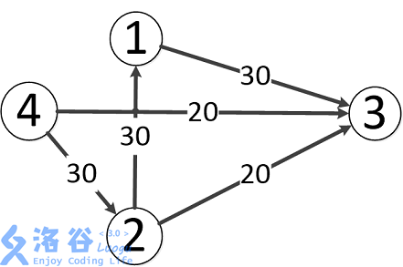
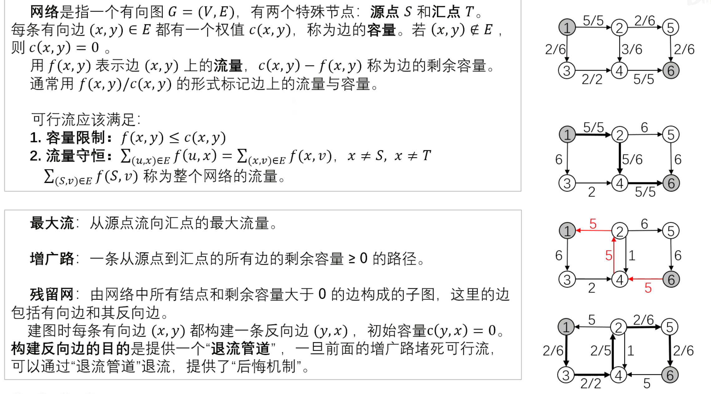
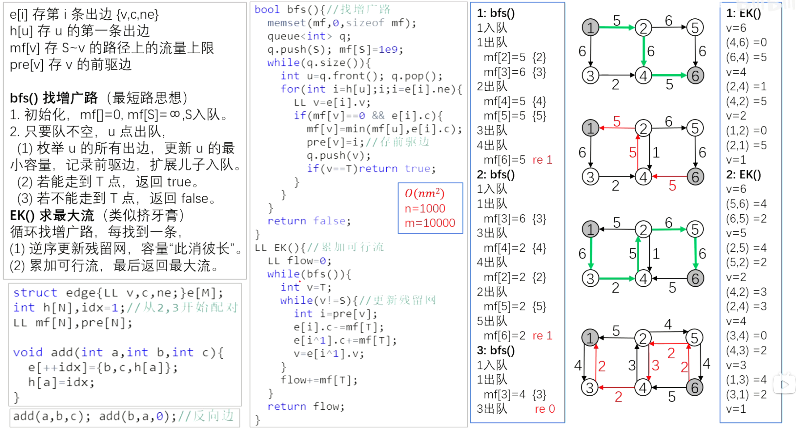
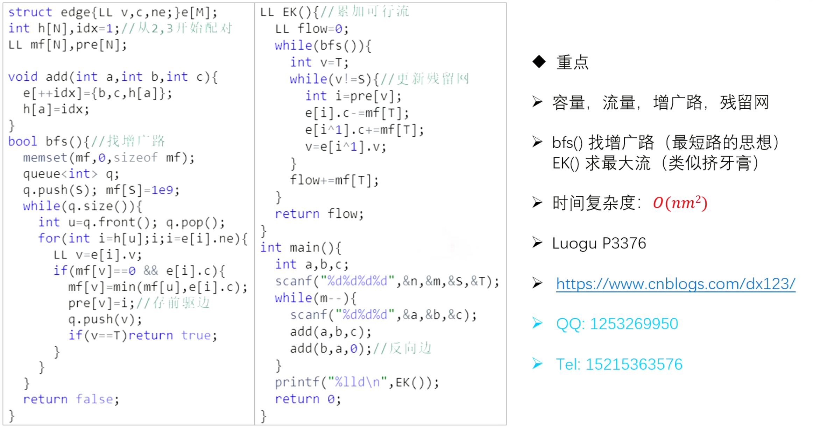
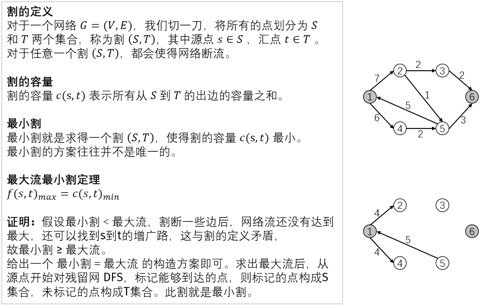
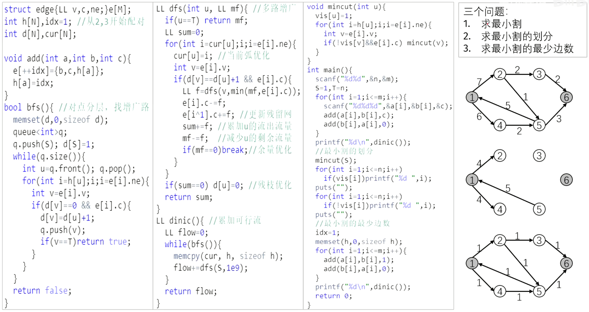

# 【模板】网络最大流

## 题目描述

如题，给出一个网络图，以及其源点和汇点，求出其网络最大流。

## 输入格式

第一行包含四个正整数 $n,m,s,t$，分别表示点的个数、有向边的个数、源点序号、汇点序号。

接下来 $m$ 行每行包含三个正整数 $u_i,v_i,w_i$，表示第 $i$ 条有向边从 $u_i$ 出发，到达 $v_i$，边权为 $w_i$（即该边最大流量为 $w_i$）。

## 输出格式

一行，包含一个正整数，即为该网络的最大流。

## 样例 #1

### 样例输入 #1

```
4 5 4 3
4 2 30
4 3 20
2 3 20
2 1 30
1 3 30
```

### 样例输出 #1

```
50
```

## 提示

#### 样例输入输出 1 解释

  

题目中存在 $3$ 条路径：

- $4\to 2\to 3$，该路线可通过 $20$ 的流量。
- $4\to 3$，可通过 $20$ 的流量。
- $4\to 2\to 1\to 3$，可通过 $10$ 的流量（边 $4\to 2$ 之前已经耗费了 $20$ 的流量）。

故流量总计 $20+20+10=50$。输出 $50$。

---

#### 数据规模与约定

- 对于 $30\%$ 的数据，保证 $n\leq10$，$m\leq25$。
- 对于 $100\%$ 的数据，保证 $1 \leq n\leq200$，$1 \leq m\leq 5000$，$0 \leq w\lt 2^{31}$。

```c++
#include <iostream>
#include <cstring>
#include <algorithm>
#include <queue>

using namespace std;
using LL = long long int;
const int N = 10010, M = 200010;

int n, m, S, T;
struct edge {
    LL v, c, ne;
} e[M];
int h[N], idx = 1;//从2,3开始配对
LL mf[N];
int pre[N];

void add(int a, int b, int c) {
    e[++idx] = {b, c, h[a]};
    h[a] = idx;
}

bool bfs() {//找增广路
    memset(mf, 0, sizeof mf);
    queue<int> q;
    q.push(S);
    mf[S] = 1e9;
    while (q.size()) {
        int u = q.front();
        q.pop();
        for (int i = h[u]; i; i = e[i].ne) {
            LL v = e[i].v;
            if (mf[v] == 0 && e[i].c) {
                mf[v] = min(mf[u], e[i].c);
                pre[v] = i;//存前驱边
                q.push(v);
                if (v == T)return true;
            }
        }
    }
    return false;
}

LL EK() {//累加可行流
    LL flow = 0;
    while (bfs()) {
        int v = T;
        while (v != S) {//更新残留网
            int i = pre[v];
            e[i].c -= mf[T];
            e[i ^ 1].c += mf[T];
            v = e[i ^ 1].v;
        }
        flow += mf[T];
    }
    return flow;
}

int main() {
    int a, b, c;
    scanf("%d%d%d%d", &n, &m, &S, &T);
    while (m--) {
        scanf("%d%d%d", &a, &b, &c);
        add(a, b, c);
        add(b, a, 0);//反向边
    }
    printf("%lld\n", EK());
    return 0;
}
```


【361 网络流 最大流 EK 算法】 https://www.bilibili.com/video/BV1o94y1271C/?share_source=copy_web&vd_source=8fa0ddfc571cb8e214b881be981477a4








# [USACO4.4] 追查坏牛奶 Pollutant Control

## 题目描述

你第一天接手三鹿牛奶公司就发生了一件倒霉的事情：公司不小心发送了一批有三聚氰胺的牛奶。

很不幸，你发现这件事的时候，有三聚氰胺的牛奶已经进入了送货网。这个送货网很大，而且关系复杂。你知道这批牛奶要发给哪个零售商，但是要把这批牛奶送到他手中有许多种途径。

送货网由一些仓库和运输卡车组成，每辆卡车都在各自固定的两个仓库之间单向运输牛奶。在追查这些有三聚氰胺的牛奶的时候，有必要保证它不被送到零售商手里，所以必须使某些运输卡车停止运输，但是停止每辆卡车都会有一定的经济损失。

你的任务是，在保证坏牛奶不送到零售商的前提下，制定出停止卡车运输的方案，使损失最小。

## 输入格式

第 $1$ 行两个整数 $N$、$M$，$N$ 表示仓库的数目，$M$ 表示运输卡车的数量。仓库 $1$ 代表发货工厂，仓库 $N$ 代表有三聚氰胺的牛奶要发往的零售商。

第 $2\sim M+1$ 行，每行 $3$ 个整数 $S_i$、$E_i$ 和 $C_i$。其中 $S_i$、$E_i$ 分别表示这辆卡车的出发仓库和目的仓库。$C_i$ 表示让这辆卡车停止运输的损失。

## 输出格式

两个整数 $C$ 和 $T$，$C$ 表示最小的损失，$T$ 表示在损失最小的前提下，最少要停止的卡车数。

## 样例 #1

### 样例输入 #1

```
4 5
1 3 100
3 2 50
2 4 60
1 2 40
2 3 80
```

### 样例输出 #1

```
60 1
```

## 提示

对于 $100 \%$ 的数据，满足 $2 \le N \le 32$，$0 \le M \le 10^3$，$1 \le S_i \le N$，$1 \le E_i \le N$，$0 \le C_i \le 2 \times 10^6$。

题目翻译来自 NOCOW。

USACO Training Section 4.4

```

```


【363 网络流 最小割 Dinic 算法】 https://www.bilibili.com/video/BV1iG411s7iX/?share_source=copy_web&vd_source=8fa0ddfc571cb8e214b881be981477a4



