# 【模板】最近公共祖先（LCA）

## 题目描述

如题，给定一棵有根多叉树，请求出指定两个点直接最近的公共祖先。

## 输入格式

第一行包含三个正整数 $N,M,S$，分别表示树的结点个数、询问的个数和树根结点的序号。

接下来 $N-1$ 行每行包含两个正整数 $x, y$，表示 $x$ 结点和 $y$ 结点之间有一条直接连接的边（数据保证可以构成树）。

接下来 $M$ 行每行包含两个正整数 $a, b$，表示询问 $a$ 结点和 $b$ 结点的最近公共祖先。

## 输出格式

输出包含 $M$ 行，每行包含一个正整数，依次为每一个询问的结果。

## 样例 #1

### 样例输入 #1

```
5 5 4
3 1
2 4
5 1
1 4
2 4
3 2
3 5
1 2
4 5
```

### 样例输出 #1

```
4
4
1
4
4
```

## 提示

对于 $30\%$ 的数据，$N\leq 10$，$M\leq 10$。

对于 $70\%$ 的数据，$N\leq 10000$，$M\leq 10000$。

对于 $100\%$ 的数据，$1 \leq N,M\leq 500000$，$1 \leq x, y,a ,b \leq N$，**不保证** $a \neq b$。


样例说明：

该树结构如下：

  

第一次询问：$2, 4$ 的最近公共祖先，故为 $4$。

第二次询问：$3, 2$ 的最近公共祖先，故为 $4$。

第三次询问：$3, 5$ 的最近公共祖先，故为 $1$。

第四次询问：$1, 2$ 的最近公共祖先，故为 $4$。

第五次询问：$4, 5$ 的最近公共祖先，故为 $4$。

故输出依次为 $4, 4, 1, 4, 4$。

2021/10/4 数据更新 @fstqwq：应要求加了两组数据卡掉了暴力跳。

**LCA（倍增算法实现）**

```c++
#include <bits/stdc++.h>

using namespace std;
const int N = 5e5 + 10;

int n, m, a, b, s;
vector<int> e[N];
int dep[N], fa[N][20];

void dfs(int u, int father) {
    dep[u] = dep[father] + 1;
    fa[u][0] = father;
    for (int i = 1; i <= 19; ++i) {
        fa[u][i] = fa[fa[u][i - 1]][i - 1];
    }
    for (int v: e[u]) {
        if (v != father) dfs(v, u);
    }
}

int lca(int u, int v) {
    if (dep[u] < dep[v]) swap(u, v);
    for (int i = 19; i >= 0; i--) {
        if (dep[fa[u][i]] >= dep[v])
            u = fa[u][i];
    }
    if (u == v) return v;
    for (int i = 19; i >= 0; i--) {
        if (fa[u][i] != fa[v][i]) {
            u = fa[u][i];
            v = fa[v][i];
        }
    }
    return fa[u][0];
}

int main() {
    cin >> n >> m >> s;
    for (int i = 0; i < n - 1; ++i) {
        scanf("%d%d", &a, &b);
        e[a].push_back(b);
        e[b].push_back(a);
    }
    dfs(s, 0);
    for (int i = 0; i < m; ++i) {
        scanf("%d%d", &a, &b);
        cout << lca(a, b) << endl;
    }
    return 0;
}
```


> 【321 倍增算法 P3379【模板】最近公共祖先（LCA）】 https://www.bilibili.com/video/BV1vg41197Xh/?share_source=copy_web&vd_source=8fa0ddfc571cb8e214b881be981477a4


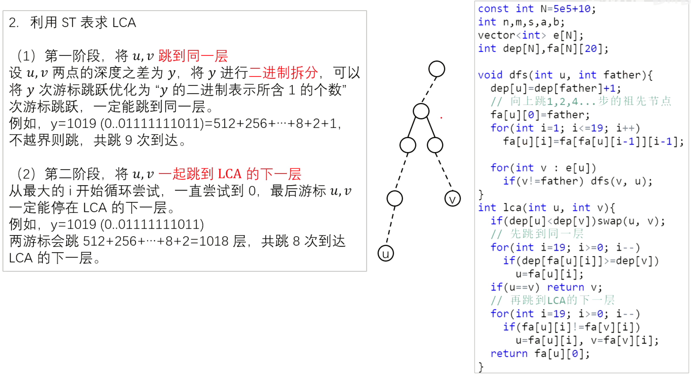


**LCA（Tarjan算法实现）**

```c++
#include <bits/stdc++.h>

using namespace std;
const int N = 5e5 + 10;
int n, m, s;
vector<int> e[N];
int ans[N], fa[N];
bool vis[N];
typedef pair<int, int> PII;
vector<PII> query[N];

int find(int x) {
    if (fa[x] != x) fa[x] = find(fa[x]);
    return fa[x];
}

void tarjan(int u) {
    vis[u] = true;
    for (auto v: e[u]) {
        if (!vis[v]) {
            tarjan(v);
            fa[v] = u;
        }
    }
    for (auto q: query[u]) {
        int v = q.first, i = q.second;
        if (vis[v]) ans[i] = find(v);
    }
}

int main() {
    cin >> n >> m >> s;
    int a, b;
    for (int i = 1; i <= n; ++i) fa[i] = i;
    for (int i = 0; i < n - 1; ++i) {
        scanf("%d%d", &a, &b);
        e[a].push_back(b);
        e[b].push_back(a);
    }
    for (int i = 1; i <= m; ++i) {
        scanf("%d%d", &a, &b);
        query[a].push_back({b, i});
        query[b].push_back({a, i});
    }
    tarjan(s);
    for (int i = 1; i <= m; ++i)
        cout << ans[i] << endl;
    return 0;
} 
```

利用Tarjan实现LCA是离线做法，因为fa数组是动态变化的，也就是find()函数的返回结果是不断变化的，可以看最后一张图。

但是Tarjan算法并不会维护一个深度数组，所以在很多复合类型的题目中，可能应用不了。因为我们很多时候都要通过深度数组来维护一些别的信息帮助解题。


> 【322 Tarjan算法 P3379【模板】最近公共祖先（LCA）】 https://www.bilibili.com/video/BV1A94y12737/?share_source=copy_web&vd_source=8fa0ddfc571cb8e214b881be981477a4


正反都添加到`query`中是为了保证查询一定是可查到结果的。

同时要注意到：只有DFS返回之后，结点的父亲才被更新。


**倍增算法和Tarjan算法的比较**


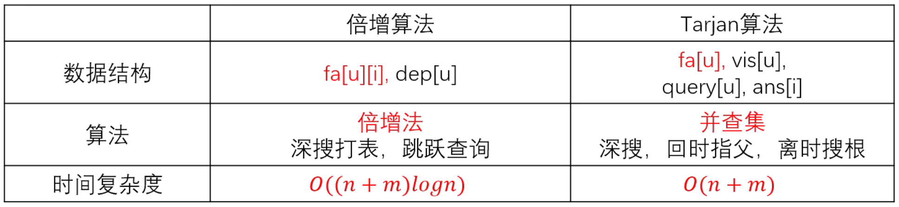


# Tarjan算法总结

## Tarjan求强连通分量

有向图强连通分量：在有向图G中，如果两个顶点vi,vj间（vi>vj）有一条从vi到vj的有向路径，同时还有一条从vj到vi的有向路径，则称两个顶点强连通(strongly connected)。如果有向图G的每两个顶点都强连通，称G是一个强连通图。有向图的极大强连通子图，称为强连通分量(strongly connected components)。


反正就是在图中找到一个最大的图，使这个图中每个两点都能够互相到达。这个最大的图称为强连通分量，同时一个点也属于强连通分量。


> [USACO06JAN] The Cow Prom S
>
> 题目描述
>
> 有一个 $n$ 个点，$m$ 条边的有向图，请求出这个图点数大于 $1$ 的强连通分量个数。
>
> 输入格式
>
> 第一行为两个整数 $n$ 和 $m$。
>
> 第二行至 $m+1$ 行，每一行有两个整数 $a$ 和 $b$，表示有一条从 $a$ 到 $b$ 的有向边。
>
> 输出格式
>
> 仅一行，表示点数大于 $1$ 的强连通分量个数。


```c++
#include <bits/stdc++.h>

using namespace std;
const int N = 1e4 + 10;

int n, m;
vector<int> e[N];
int dfn[N], low[N], tot;
int stk[N], instk[N], top;
int scc[N], siz[N], cnt;

void tarjan(int x) {
    dfn[x] = low[x] = ++tot;
    stk[++top] = x, instk[x] = 1;
    for (int y: e[x]) {
        if (!dfn[y]) {
            tarjan(y);
            low[x] = min(low[x], low[y]);
        } else if (instk[y]) {
            low[x] = min(low[x], dfn[y]);
        }
    }
    if (dfn[x] == low[x]) {
        int y;
        ++cnt;
        do {
            y = stk[top--];
            instk[y] = 0;
            scc[y] = cnt;
            ++siz[cnt];
        } while (y != x);
    }
}

int main() {
    cin >> n >> m;
    int a, b;
    for (int i = 0; i < m; ++i) {
        cin >> a >> b;
        e[a].push_back(b);
    }
    for (int i = 1; i <= n; ++i)
        if (!dfn[i]) tarjan(i);
    int res = 0;
    for (int i = 1; i <= n; ++i) {
        if (dfn[i] == low[i] && siz[scc[i]] > 1) res++;
    }
    cout << res << endl;
    return 0;
} 
```


## Tarjan缩点

其实这也是利用了tarjan求强连通分量的方法，对于一些贡献具有传导性，比如友情啊、路径上的权值啊等等非常适用。思想就是因为强连通分量中的每两个点都是强连通的，可以**将一个强连通分量当做一个超级点**，而点权按题意来定。


首先我们先看一下一个问题：**一个有向图，有n个点以及m条边，我们至少应该添加几条边才能使整个图变成强连通图。或者是一个无向图至少添加几条边变成连通图。**

首先我们对于一个**有向无环的图（DAG）**，至少添加几条边才能使它变为强连通图？我们很容易根据有向无环图的性质得到，我们计算入度为零的点数为a，出度为零的点数为b，那么我们至少需要添加的边数为`max(a,b)`，如果只有一个点的话，我们不需要添加任何边。

那么我们怎么把一个图转换为DAG呢，因为上面给出的图可能存在环，那么我们就会想到把已经组成全连通的子图转换成一个点来看，那么我们最终的图就不会包含环了。

其实我们上述的tarjan算法已经求出了每个点属于的连通集编号了，其实每个连通集编号就代表了一个最大连通集。


## Tarjan求割点、桥

割点：在无向连通图中，如果将其中一个点以及所有连接该点的边去掉，图就不再连通，那么这个点就叫做割点（cut vertex / articulation point）。

割点怎么求？

与之前强连通分量中的tarjan差不多。但要加一个特判，

首先选定一个根节点，从该根节点开始遍历整个图（使用DFS）。

对于根节点，判断是不是割点很简单——计算其子树数量，如果有2棵即以上的子树，就是割点。因为如果去掉这个点，这两棵子树就不能互相到达。（注意这里的概念，称之为子树，表示了子树互不相连，而且不连向祖先）

对于非根节点，判断是不是割点就有些麻烦了。我们维护两个数组`dfn[]`和`low[]`（就是上面用过的），对于边(u, v)，如果`low[v]>=dfn[u]`，此时u就是割点。这是我认为最难以理解的一部分，可以这样想：`low[v]>=dfn[u]`也就意味着，v不能回到u的前面，这是一种什么情况呢？

显然如果节点U的所有孩子节点可以不通过父节点U而访问到U的祖先节点（也就是`low[v]<dfn[u]`），那么说明此时去掉节点U不影响图的连通性，U就不是割点。

相反，如果节点U至少存在一个孩子顶点，必须通过父节点U才能访问到U的祖先节点，也就是如果存在一个孩子`low[v]>=dfn[u]`，那么去掉节点U后，顶点U的祖先节点和孩子节点就不连通了，说明U是一个割点。


## 争议点

关于tarjan算法，一直有一个很大的争议，就是`low[u]=min(low[u],dfn[v]);`（你可以发现这和上面求强连通分量是不一杨的）

这句话，如果改成`low[u]=min(low[u],low[v])`就会出错，但是在求强连通分量时却没有问题。

根据许多大佬的观点，我想提出自己的一点看法。

在求强连通分量时，如果v已经在栈中，那么说明u，v一定在同一个强连通分量中，所以到最后`low[u]=low[v]`是必然的，提前更新也不会有问题。

但是在求割点时，low的定义有了小小的变化，不再是最早能追溯到的祖先，（因为是个无向图）没有意义，应该是最早能绕到的割点，为什么用绕到，是因为是无向边，所以有另一条路可以走，如果把dfn[v]改掉就会上翻过头，可能翻进另一个环中，所以wa掉，仅是本人的一些个人看法，不知道讲的对不对，请各位指教。


> 原文链接：https://blog.csdn.net/csyifanZhang/article/details/105370924


# LCA - Lowest Common Ancestor

## 题面翻译

## Description:

一棵树是一个简单无向图，图中任意两个节点仅被一条边连接，所有连通无环无向图都是一棵树。-Wikipedia

最近公共祖先（LCA）是……（此处省去对LCA的描述），你的任务是对一棵给定的树$T$以及上面的两个节点$u,v$求出他们的$LCA$。


**例如图中$9$和$12$号节点的$LCA$为$3$号节点**

## Input:

输入的第一行为数据组数$T$，对于每组数据，第一行为一个整数$N(1\leq N\leq1000)$，节点编号从$1$到$N$，接下来的$N$行里每一行开头有一个数字$M(0\leq M\leq999)$，$M$为第$i$个节点的子节点数量，接下来有$M$个数表示第$i$个节点的子节点编号。下面一行会有一个整数$Q(1\leq Q\leq1000)$，接下来的$Q$行每行有两个数$u,v$，输出节点$u,v$在给定树中的$LCA$。

输入数据保证只有一个根节点并且没有环。

## Output:

对于每一组数据输出$Q+1$行，第一行格式为"Case i:"（没有双引号），i表示当前数据是第几组，接下来的$Q$行每一行一个整数表示一对节点$u,v$的$LCA$。

## Sample Input:
```
1
7
3 2 3 4
0
3 5 6 7
0
0
0
0
2
5 7
2 7
```

## Sample Output:
```
Case 1:
3
1
```

Translated by @_yxl_gl_

## 题目描述

A tree is an undirected graph in which any two vertices are connected by exactly one simple path. In other words, any connected graph without cycles is a tree. - Wikipedia

The lowest common ancestor (LCA) is a concept in graph theory and computer science. Let T be a rooted tree with N nodes. The lowest common ancestor is defined between two nodes v and w as the lowest node in T that has both v and w as descendants (where we allow a node to be a descendant of itself). - Wikipedia

Your task in this problem is to find the LCA of any two given nodes v and w in a given tree T.

### 

**For example the LCA of nodes 9 and 12 in this tree is the node number 3.**

### Input

The first line of input will be the number of test cases. Each test case will start with a number N the number of nodes in the tree, 1 <= N <= 1,000. Nodes are numbered from 1 to N. The next N lines each one will start with a number M the number of child nodes of the Nth node, 0 <= M <= 999 followed by M numbers the child nodes of the Nth node. The next line will be a number Q the number of queries you have to answer for the given tree T, 1 <= Q <= 1000. The next Q lines each one will have two number v and w in which you have to find the LCA of v and w in T, 1 <= v, w <= 1,000.

Input will guarantee that there is only one root and no cycles.

### Output

For each test case print Q + 1 lines, The first line will have “Case C:” without quotes where C is the case number starting with 1. The next Q lines should be the LCA of the given v and w respectively.

### Example

 ```
Input:
1
7
3 2 3 4
0
3 5 6 7
0
0
0
0
2
5 7
2 7

Output:
Case 1:
3
1
 ```

## 输入格式

## 输出格式

## 题意翻译

## Description:

一棵树是一个简单无向图，图中任意两个节点仅被一条边连接，所有连通无环无向图都是一棵树。-Wikipedia

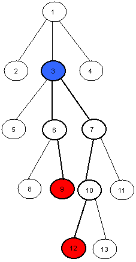

**例如图中99和1212号节点的���\*L\**C\**A\*为33号节点**

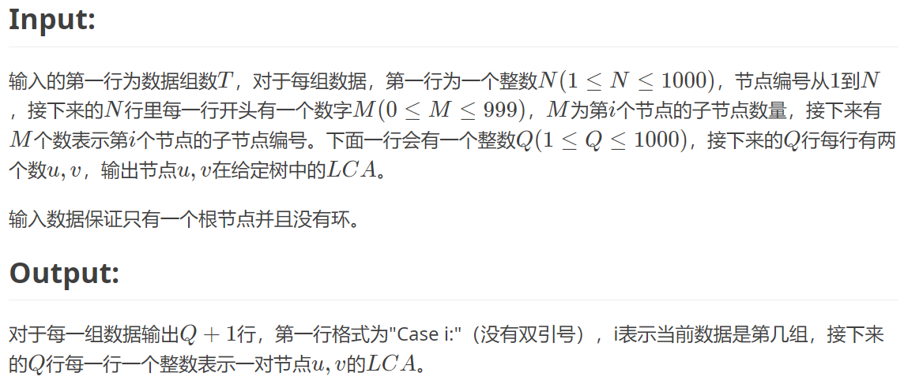

## Sample Input:

```
1
7
3 2 3 4
0
3 5 6 7
0
0
0
0
2
5 7
2 7
```

## Sample Output:

```
Case 1:
3
1
```

Translated by @*yxl_gl*

## 输入输出样例

无

```c++
#include <bits/stdc++.h>

using namespace std;
const int N = 1010;

int a, b;
vector<int> e[N];
int dep[N], fa[N][20];
bool st[N];

void dfs(int u, int father) {
    dep[u] = dep[father] + 1;
    fa[u][0] = father;
    for (int i = 1; i <= 19; ++i) {
        fa[u][i] = fa[fa[u][i - 1]][i - 1];
    }
    for (int v: e[u]) {
        if (v != father) dfs(v, u);
    }
}

int lca(int u, int v) {
    if (dep[u] < dep[v]) swap(u, v);
    for (int i = 19; i >= 0; i--) {
        if (dep[fa[u][i]] >= dep[v])
            u = fa[u][i];
    }
    if (u == v) return v;
    for (int i = 19; i >= 0; i--) {
        if (fa[u][i] != fa[v][i]) {
            u = fa[u][i];
            v = fa[v][i];
        }
    }
    return fa[u][0];
}

void solve(int tt) {
    int n, m, q;
    cout << "Case:" << tt << endl;

    memset(dep, 0, sizeof dep);
    memset(fa, 0, sizeof fa);
    memset(st, false, sizeof st);

    for (int i = 0; i < N; ++i) e[i].clear();
    cin >> n;
    for (int i = 1; i <= n; ++i) {
        cin >> m;
        for (int j = 0; j < m; ++j) {
            scanf("%d", &a);
            e[a].push_back(i);
            e[i].push_back(a);
            st[a] = true;
        }
    }
    int s = 1;
    while (st[s]) s++;
    dfs(s, 0);
    cin >> q;
    for (int i = 0; i < q; ++i) {
        scanf("%d%d", &a, &b);
        cout << lca(a, b) << endl;
    }
}

int main() {
    int t;
    cin >> t;
    for (int i = 1; i <= t; ++i) solve(i);
    return 0;
}
```


# [USACO06JAN] The Cow Prom S

## 题目描述

有一个 $n$ 个点，$m$ 条边的有向图，请求出这个图点数大于 $1$ 的强连通分量个数。

## 输入格式

第一行为两个整数 $n$ 和 $m$。

第二行至 $m+1$ 行，每一行有两个整数 $a$ 和 $b$，表示有一条从 $a$ 到 $b$ 的有向边。

## 输出格式

仅一行，表示点数大于 $1$ 的强连通分量个数。

## 样例 #1

### 样例输入 #1

```
5 4
2 4
3 5
1 2
4 1
```

### 样例输出 #1

```
1
```

## 提示

#### 数据规模与约定

对于全部的测试点，保证 $2\le n \le 10^4$，$2\le m\le 5\times 10^4$，$1 \leq a, b \leq n$。

```
#include <bits/stdc++.h>

using namespace std;
const int N = 1e4 + 10;

int n, m;
vector<int> e[N];
int dfn[N], low[N], tot;
int stk[N], instk[N], top;
int scc[N], siz[N], cnt;

void tarjan(int x) {
    dfn[x] = low[x] = ++tot;
    stk[++top] = x, instk[x] = 1;
    for (int y: e[x]) {
        if (!dfn[y]) {
            tarjan(y);
            low[x] = min(low[x], low[y]);
        } else if (instk[y]) {
            low[x] = min(low[x], dfn[y]);
        }
    }
    if (dfn[x] == low[x]) {
        int y;
        ++cnt;
        do {
            y = stk[top--];
            instk[y] = 0;
            scc[y] = cnt;
            ++siz[cnt];
        } while (y != x);
    }
}

int main() {
    cin >> n >> m;
    int a, b;
    for (int i = 0; i < m; ++i) {
        cin >> a >> b;
        e[a].push_back(b);
    }
    for (int i = 1; i <= n; ++i)
        if (!dfn[i]) tarjan(i);
    int res = 0;
    for (int i = 1; i <= n; ++i) {
        if (dfn[i] == low[i] && siz[scc[i]] > 1) res++;
    }
    cout << res << endl;
    return 0;
} 
```


> 【341 强连通分量 Tarjan 算法】 https://www.bilibili.com/video/BV1SY411M7Tv/?share_source=copy_web&vd_source=8fa0ddfc571cb8e214b881be981477a4


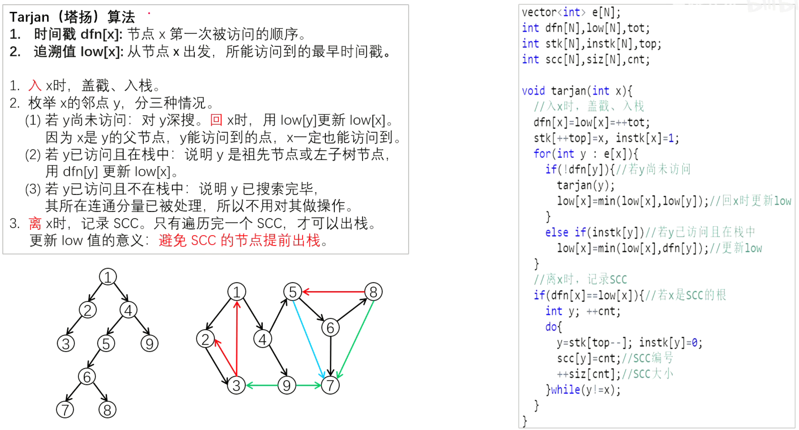

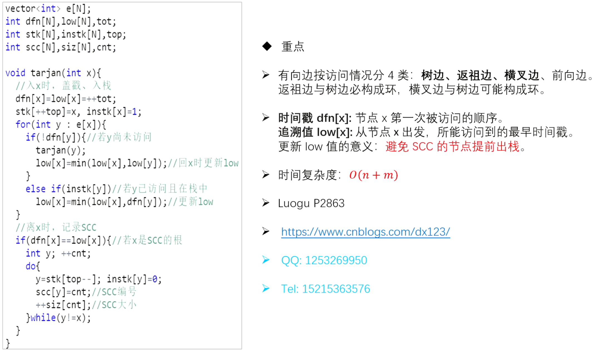


# 会议

## 题目描述

有一个村庄居住着 $n$ 个村民，有 $n-1$ 条路径使得这 $n$ 个村民的家联通，每条路径的长度都为 $1$。现在村长希望在某个村民家中召开一场会议，村长希望所有村民到会议地点的距离之和最小，那么村长应该要把会议地点设置在哪个村民的家中，并且这个距离总和最小是多少？若有多个节点都满足条件，则选择节点编号最小的那个点。

## 输入格式

第一行，一个数 $n$，表示有 $n$ 个村民。

接下来 $n-1$ 行，每行两个数字 $a$ 和 $b$，表示村民 $a$ 的家和村民 $b$ 的家之间存在一条路径。

## 输出格式

一行输出两个数字 $x$ 和 $y$。

$x$ 表示村长将会在哪个村民家中举办会议。

$y$ 表示距离之和的最小值。

## 样例 #1

### 样例输入 #1

```
4
1 2 
2 3 
3 4
```

### 样例输出 #1

```
2 4
```

## 提示

#### 数据范围

对于 $70\%$ 数据 $n \le 10^3$。

对于 $100\%$ 数据 $n \le 5 \times 10^4$。

**树的重心**

```c++
#include <bits/stdc++.h>

using namespace std;
const int N = 1e5 + 10;
int n, idx, h[N], ne[N * 2], e[N * 2], dist[N];
int maxx[N] = {0};

void add(int a, int b) {
    ne[idx] = h[a];
    e[idx] = b;
    h[a] = idx++;
}

void solve(int x) {
    memset(dist, -1, sizeof dist);
    dist[x] = 0;
    queue<int> q;
    q.push(x);
    while (q.size()) {
        int t = q.front();
        q.pop();

        for (int i = h[t]; ~i; i = ne[i]) {
            int j = e[i];
            if (dist[j] == -1) {
                dist[j] = dist[t] + 1;
                q.push(j);
            }
        }
    }
}

int dfs(int u, int fa) {
    int res = 0;
    for (int i = h[u]; ~i; i = ne[i]) {
        if (e[i] == fa) continue;
        int t = dfs(e[i], u);
        res += t;
        maxx[u] = max(maxx[u], t);
    }
    maxx[u] = max(maxx[u], n - 1 - res);
    return res + 1;
}

int main() {
    cin >> n;
    int a, b;
    memset(h, -1, sizeof h);
    for (int i = 1; i < n; ++i) {
        cin >> a >> b;
        add(a, b);
        add(b, a);
    }
    dfs(1, -1);
    int in = 0, minn = 2e9;
    for (int i = 1; i <= n; ++i) {
        if (minn > maxx[i]) {
            in = i;
            minn = maxx[i];
        }
    }
    solve(in);
    int res = 0;
    for (int i = 1; i <= n; ++i) {
        res += dist[i];
    }
    cout << in << " " << res << endl;
    return 0;
}
```

**树的重心**：找到一个点，其所有的子树中最大的子树节点数最少，那么这个点就是这棵树的重心，删去重心后，生成的多棵树尽可能平衡。换句话说，删除这个点后最大连通块（一定是树）的结点数最小。

性质：

- **树中所有点到某个点的距离和中，到重心的距离和是最小的（实际应用中经常用到此性质）。**
- 把两棵树通过一条边相连，新的树的重心在原来两棵树重心的连线上。
- 一棵树添加或者删除一个节点，树的重心最多只移动一条边的位置。
- 一棵树最多有两个重心，且相邻。


# 医院设置

## 题目描述

设有一棵二叉树，如图：


其中，圈中的数字表示结点中居民的人口。圈边上数字表示结点编号，现在要求在某个结点上建立一个医院，使所有居民所走的路程之和为最小，同时约定，相邻接点之间的距离为 $1$。如上图中，若医院建在 $1$ 处，则距离和 $=4+12+2\times20+2\times40=136$；若医院建在 $3$ 处，则距离和 $=4\times2+13+20+40=81$。

## 输入格式

第一行一个整数 $n$，表示树的结点数。

接下来的 $n$ 行每行描述了一个结点的状况，包含三个整数 $w, u, v$，其中 $w$ 为居民人口数，$u$ 为左链接（为 $0$ 表示无链接），$v$ 为右链接（为 $0$ 表示无链接）。

## 输出格式

一个整数，表示最小距离和。

## 样例 #1

### 样例输入 #1

```
5						
13 2 3
4 0 0
12 4 5
20 0 0
40 0 0
```

### 样例输出 #1

```
81
```

## 提示

#### 数据规模与约定

对于 $100\%$ 的数据，保证 $1 \leq n \leq 100$，$0 \leq u, v \leq n$，$1 \leq w \leq 10^5$。

**带权的树的重心**

```c++
#include <bits/stdc++.h>

using namespace std;
const int N = 1e5 + 10;
int n, idx, h[N], ne[N * 2], e[N * 2], dist[N];
int tot, maxx[N] = {0}, w[N];

void add(int a, int b) {
    ne[idx] = h[a];
    e[idx] = b;
    h[a] = idx++;
}

void solve(int x) {
    memset(dist, -1, sizeof dist);
    dist[x] = 0;
    queue<int> q;
    q.push(x);
    while (q.size()) {
        int t = q.front();
        q.pop();

        for (int i = h[t]; ~i; i = ne[i]) {
            int j = e[i];
            if (dist[j] == -1) {
                dist[j] = dist[t] + 1;
                q.push(j);
            }
        }
    }
}

int dfs(int u, int fa) {
    int res = 0;
    for (int i = h[u]; ~i; i = ne[i]) {
        if (e[i] == fa) continue;
        int t = dfs(e[i], u);
        res += t;
        maxx[u] = max(maxx[u], t);
    }
    maxx[u] = max(maxx[u], tot - res - w[u]);
    return res + w[u];
}

int main() {
    cin >> n;
    int a, b;
    memset(h, -1, sizeof h);
    for (int i = 1; i <= n; ++i) {
        cin >> w[i] >> a >> b;
        tot += w[i];
        if (a) add(a, i), add(i, a);
        if (b) add(b, i), add(i, b);
    }
    dfs(1, -1);
    int in = 0, minn = 2e9;
    for (int i = 1; i <= n; ++i) {
        if (minn > maxx[i]) {
            in = i;
            minn = maxx[i];
        }
    }
    solve(in);
    int res = 0;
    for (int i = 1; i <= n; ++i) {
        res += dist[i] * w[i];
    }
    cout << res << endl;
    return 0;
}
```


# [NOI2011] 道路修建

## 题目描述

在 W 星球上有 $n$ 个国家。为了各自国家的经济发展，他们决定在各个国家之间建设双向道路使得国家之间连通。但是每个国家的国王都很吝啬，他们只愿意修建恰好 $n - 1$ 条双向道路。

每条道路的修建都要付出一定的费用，这个费用等于道路长度乘以道路两端 的国家个数之差的绝对值。例如，在下图中，虚线所示道路两端分别有 $2$ 个、$4$ 个国家，如果该道路长度为 $1$，则费用为 $1×|2 - 4|=2$。图中圆圈里的数字表示国家的编号。

  

由于国家的数量十分庞大，道路的建造方案有很多种，同时每种方案的修建费用难以用人工计算，国王们决定找人设计一个软件，对于给定的建造方案，计算出所需要的费用。请你帮助国王们设计一个这样的软件。

## 输入格式

输入的第一行包含一个整数 $n$，表示 W 星球上的国家的数量，国家从 $1$ 到 $n$ 编号。

接下来 $n–1$ 行描述道路建设情况，其中第 $i$ 行包含三个整数 $a_i,b_i$ 和 $c_i$，表示第 $i$ 条双向道路修建在 $a_i$ 与 $b_i$ 两个国家之间，长度为 $c_i$。

## 输出格式

输出一个整数，表示修建所有道路所需要的总费用。

## 样例 #1

### 样例输入 #1

```
6
1 2 1
1 3 1
1 4 2
6 3 1
5 2 1
```

### 样例输出 #1

```
20
```

## 提示

对于 $100\%$ 的数据，$1\leq a_i, b_i\leq n$，$0\leq c_i\leq10^6$，$2\leq n\leq 10^6$。
| 测试点编号 |      $n=$      |
| :--------: | :------------: |
|    $1$     |      $2$       |
|    $2$     |      $10$      |
|    $3$     |     $100$      |
|    $4$     |     $200$      |
|    $5$     |     $500$      |
|    $6$     |     $600$      |
|    $7$     |     $800$      |
|    $8$     |     $1000$     |
|    $9$     |     $10^4$     |
|    $10$    | $2\times 10^4$ |
|    $11$    | $5\times 10^4$ |
|    $12$    | $6\times 10^4$ |
|    $13$    | $8\times 10^4$ |
|    $14$    |     $10^5$     |
|    $15$    | $6\times 10^5$ |
|    $16$    | $7\times 10^5$ |
|    $17$    | $8\times 10^5$ |
|    $18$    | $9\times 10^5$ |
|  $19,20$   |     $10^6$     |

**计算子树中点的个数**

```c++
#include <bits/stdc++.h>

using namespace std;
using LL = long long int;
const int N = 1e6 + 10;
int n, idx, h[N], ne[N * 2], e[N * 2], c[N * 2];
LL tot;

void add(int a, int b, int t) {
    c[idx] = t;
    ne[idx] = h[a];
    e[idx] = b;
    h[a] = idx++;
}

int check(int a, int b) {
    if (a > b) return a - b;
    else return b - a;
}

int dfs(int u, int fa) {
    int res = 0;
    for (int i = h[u]; ~i; i = ne[i]) {
        if (e[i] == fa) continue;
        int t = dfs(e[i], u);
        res += t;
        tot += check(n - t, t) * (LL) c[i];
    }
    return res + 1;
}

int main() {
    cin >> n;
    int a, b, t;
    memset(h, -1, sizeof h);
    for (int i = 1; i < n; ++i) {
        cin >> a >> b >> t;
        add(a, b, t);
        add(b, a, t);
    }
    dfs(1, -1);
    cout << tot << endl;
    return 0;
}
```


# [USACO19DEC] Milk Visits S

## 题目描述

Farmer John 计划建造 $N$ 个农场，用 $N-1$ 条道路连接，构成一棵树（也就是说，所有农场之间都互相可以到达，并且没有环）。每个农场有一头奶牛，品种为更赛牛或荷斯坦牛之一。

Farmer John 的 $M$ 个朋友经常前来拜访他。在朋友 $i$ 拜访之时，Farmer John 会与他的朋友沿着从农场 $A_i$ 到农场 $B_i$ 之间的唯一路径行走（可能有 $A_i = B_i$）。除此之外，他们还可以品尝他们经过的路径上任意一头奶牛的牛奶。由于 Farmer John 的朋友们大多数也是农场主，他们对牛奶有着极强的偏好。他的有些朋友只喝更赛牛的牛奶，其余的只喝荷斯坦牛的牛奶。任何 Farmer John 的朋友只有在他们访问时能喝到他们偏好的牛奶才会高兴。

请求出每个朋友在拜访过后是否会高兴。

## 输入格式

输入的第一行包含两个整数 $N$ 和 $M$。

第二行包含一个长为 $N$ 的字符串。如果第 $i$ 个农场中的奶牛是更赛牛，则字符串中第 $i$ 个字符为 `G`，如果第 $i$ 个农场中的奶牛是荷斯坦牛则为 `H`。

以下 $N-1$ 行，每行包含两个不同的整数 $X$ 和 $Y$（$1 \leq X, Y \leq N$），表示农场 $X$ 与 $Y$ 之间有一条道路。

以下 $M$ 行，每行包含整数 $A_i$，$B_i$，以及一个字符 $C_i$。$A_i$ 和 $B_i$ 表示朋友 $i$ 拜访时行走的路径的端点，$C_i$ 是 `G` 或 `H` 之一，表示第 $i$ 个朋友喜欢更赛牛的牛奶或是荷斯坦牛的牛奶。

## 输出格式

输出一个长为 $M$ 的二进制字符串。如果第 $i$ 个朋友会感到高兴，则字符串的第 $i$ 个字符为 `1`，否则为 `0`。

## 样例 #1

### 样例输入 #1

```
5 5
HHGHG
1 2
2 3
2 4
1 5
1 4 H
1 4 G
1 3 G
1 3 H
5 5 H
```

### 样例输出 #1

```
10110
```

## 提示

在这里，从农场 1 到农场 4 的路径包括农场 1、2 和 4。所有这些农场里都是荷斯坦牛，所以第一个朋友会感到满意，而第二个朋友不会。

关于部分分：

测试点 $1$ 样例。

测试点 $2\sim 5$ 满足 $N\le 10^3$，$M\le 2\cdot 10^3$。

对于 $100\%$ 的数据，$1 \leq N \leq 10^5$，$1 \leq M \leq 10^5$。

供题：Spencer Compton

**树+并查集**

```c++
#include <bits/stdc++.h>

using namespace std;
const int N = 1e5 + 10;
int n, m, idx, h[N], ne[N * 2], e[N * 2];
int p[N];
string s;

int find(int x) {
    if (p[x] != x) p[x] = find(p[x]);
    return p[x];
}

void add(int a, int b) {
    ne[idx] = h[a];
    e[idx] = b;
    h[a] = idx++;
}

void dfs(int u, int fa) {
    for (int i = h[u]; ~i; i = ne[i]) {
        if (fa != -1) {
            if (s[fa] == s[u]) {
                p[find(u)] = find(fa);
            }
        }
        if (e[i] != fa) dfs(e[i], u);
    }
}

int main() {
    cin >> n >> m;
    cin >> s;
    s = "1" + s;
    for (int i = 1; i <= n; ++i) p[i] = i;
    memset(h, -1, sizeof h);
    int a, b;
    for (int i = 0; i < n - 1; ++i) {
        cin >> a >> b;
        add(a, b);
        add(b, a);
    }
    dfs(1, -1);
    char c;
    for (int i = 0; i < m; ++i) {
        cin >> a >> b >> c;
        if (find(a) == find(b) && s[a] != c) {
            cout << 0;
            continue;
        }
        cout << 1;
    }
    return 0;
}
```

这一棵树只有两种颜色，故我们只要记录树上一个个颜色相同的连通块，只有当所查询两点是同一连通块且连通块颜色与目标颜色不同时输出0。


**LCA做法**

```c++
#include <bits/stdc++.h>

using namespace std;
const int N = 1e5 + 10;

int n, m;
vector<int> e[N];
int dep[N], fa[N][20];
struct node {
    int h, g;
} s[N];
string ss;

void dfs(int u, int father) {
    dep[u] = dep[father] + 1;
    if (ss[u] == 'G') {
        s[u].g = 1 + s[father].g;
        s[u].h = s[father].h;
    } else {
        s[u].g = s[father].g;
        s[u].h = 1 + s[father].h;
    }
    fa[u][0] = father;
    for (int i = 1; i <= 19; ++i) {
        fa[u][i] = fa[fa[u][i - 1]][i - 1];
    }
    for (int v: e[u]) {
        if (v != father) dfs(v, u);
    }
}

int lca(int u, int v) {
    if (dep[u] < dep[v]) swap(u, v);
    for (int i = 19; i >= 0; i--) {
        if (dep[fa[u][i]] >= dep[v])
            u = fa[u][i];
    }
    if (u == v) return v;
    for (int i = 19; i >= 0; i--) {
        if (fa[u][i] != fa[v][i]) {
            u = fa[u][i];
            v = fa[v][i];
        }
    }
    return fa[u][0];
}

int main() {
    cin >> n >> m >> ss;
    ss = "1" + ss;
    int a, b;
    for (int i = 0; i < n - 1; ++i) {
        cin >> a >> b;
        e[a].push_back(b);
        e[b].push_back(a);
    }
    dfs(1, 0);
    char c;
    for (int i = 0; i < m; ++i) {
        cin >> a >> b >> c;
        int t = lca(a, b);
        if (c == 'G') {
            int gg = s[a].g - s[t].g + s[b].g - s[t].g;
            if (ss[t] == 'G') gg++;
            if (gg) cout << 1;
            else cout << 0;
        } else {
            int hh = s[a].h - s[t].h + s[b].h - s[t].h;
            if (ss[t] == 'H') hh++;
            if (hh) cout << 1;
            else cout << 0;
        }
    }
    return 0;
}
```

给定一棵树，树上的点只有两种状态——H或G。

Q次询问，每次询问两点间路径有没有H或者G。

我们可以只维护一个节点到根节点路径上H和G的数量就行。

由于一个节点的信息和其父亲的信息只差1，所以这很好修改。


# 专心OI - 找祖先

## 题目背景

Imakf 是一个小蒟蒻，他最近刚学了 LCA，他在手机 APPstore 里看到一个游戏也叫做 LCA 就下载了下来。

## 题目描述

这个游戏会给出你一棵树，这棵树有 $N$ 个节点，根结点是 $R$ ，系统会选中 $M$ 个点 $P_1,P_2...P_M$ ，要Imakf 回答有多少组点对 $(u_i,v_i)$ 的最近公共祖先是 $P_i$。Imakf 是个小蒟蒻，他就算学了 LCA 也做不出，于是只好求助您了。

Imakf 毕竟学过一点 OI，所以他要求您把答案模 $(10^9+7)$。

## 输入格式

第一行三个整数 $N , R , M$。

此后 $N-1$ 行，每行两个数 $a,b$，表示 $a,b$ 之间有一条边。

此后 $1 $行，共 $M$ 个数，表示$P_i$。

保证给出的边形成一棵树。

## 输出格式

输出共 $M$ 行，每行一个数，第 $i$ 行的数表示有多少组点对 $(u_i,v_i)$ 的最近公共祖先是 $P_i$

## 样例 #1

### 样例输入 #1

```
7 1 3
1 2
1 3
2 4
2 5
3 6
3 7
1 2 4
```

### 样例输出 #1

```
31
7
1
```

## 提示

样例 1 的树如下图所示：

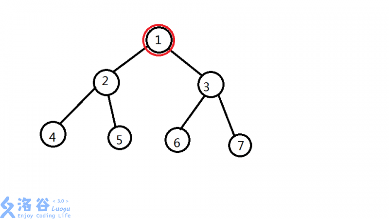

 对于询问 1 $~(1,1)
(1,2)
(1,3)
(1,4)
(1,5)
(1,6)
(1,7)
(2,1)
(2,3)
(2,6)
(2,7)
(3,1)
(3,2)
(3,4)
(3,5)
(4,1)
(4,3)$

$
(4,6)
(4,7)
(5,1)
(5,3)
(5,6)
(5,7)
(6,1)
(6,2)
(6,4)
(6,5)
(7,1)
(7,2)
(7,4)
(7,5)$ 共 $31$ 组点对。

询问 2 $(2,2)
(2,4)
(2,5)
(4,2)
(4,5)
(5,2)
(5,4)$ 共 $7$ 组点对。

对于询问 3 $(4,4)$ 共 $1$ 组点对。

$1\le R\le N\leq10000$，$0\le M\leq50000$。

**DFS**

```c++
#include <bits/stdc++.h>

using namespace std;
const int N = 1e4 + 10, mod = 1e9 + 7;
using LL = long long int;
LL s[N];
int n, r, m, idx, h[N], ne[N * 2], e[N * 2];
LL ans[N];

void add(int a, int b) {
    e[idx] = b;
    ne[idx] = h[a];
    h[a] = idx++;
}

void dfs(int u, int fa) {
    s[u] = 1;
    LL res = 0;
    for (int i = h[u]; ~i; i = ne[i]) {
        int j = e[i];
        if (j == fa)continue;
        dfs(j, u);
        LL t = s[j];
        s[u] += t;
        res += t * t;
    }
    ans[u] = (s[u] * s[u] - res) % mod;
}

int main() {
    cin >> n >> r >> m;
    memset(h, -1, sizeof h);
    int a, b;
    for (int i = 0; i < n - 1; ++i) {
        cin >> a >> b;
        add(a, b);
        add(b, a);
    }
    dfs(r, -1);
    for (int i = 1; i <= m; ++i) {
        cin >> a;
        cout << ans[a] << endl;
    }
    return 0;
}
```

**注意：题目中没说是只有n-1条边，所以不能推断是二叉树，要考虑一个树根结点有多个子树的情况**


对于每个点x，我们可以把答案分成跨过x的和没有跨过x的方案两部分。

从排列组合的角度思考这个过程似乎是更加通顺的。

从整体中任选两个组成一个数对，删除掉每个子结点对答案的贡献。


# [USACO15DEC] Max Flow P

## 题目描述

Farmer John has installed a new system of $N-1$ pipes to transport milk between the $N$ stalls in his barn ($2 \leq N \leq 50,000$), conveniently numbered $1 \ldots N$.  Each pipe connects a pair of stalls,  and all stalls are connected to each-other via paths of pipes.


FJ is pumping milk between $K$ pairs of stalls ($1 \leq K \leq 100,000$).  For the $i$th such pair,  you are told two stalls $s_i$ and $t_i$, endpoints of a path along which milk is being pumped at a unit rate.  FJ is concerned that some stalls might end up overwhelmed with all the milk being pumped through them, since a stall can serve as a waypoint along many of the $K$ paths along which milk is being pumped.  Please help him determine the maximum amount of milk being pumped through any stall.  If milk is being pumped along a path from $s_i$ to $t_i$, then it counts as being pumped through the endpoint stalls $s_i$ and

$t_i$, as well as through every stall along the path between them.


FJ 给他的牛棚的 $N$ 个隔间之间安装了 $N-1$ 根管道，隔间编号从 $1$ 到 $N$。所有隔间都被管道连通了。

FJ 有 $K$ 条运输牛奶的路线，第 $i$ 条路线从隔间 $s_i$ 运输到隔间 $t_i$。一条运输路线会给它的两个端点处的隔间以及中间途径的所有隔间带来一个单位的运输压力，你需要计算压力最大的隔间的压力是多少。

## 输入格式

The first line of the input contains $N$ and $K$.


The next $N-1$ lines each contain two integers $x$ and $y$ ($x \ne y$) describing a pipe

between stalls $x$ and $y$.


The next $K$ lines each contain two integers $s$ and $t$ describing the endpoint

stalls of a path through  which milk is being pumped.

第一行输入两个整数 $N$ 和 $K$。

接下来 $N-1$ 行每行输入两个整数 $x$ 和 $y$，其中 $x \ne y$。表示一根在牛棚 $x$ 和 $y$ 之间的管道。

接下来 $K$ 行每行两个整数 $s$ 和 $t$，描述一条从 $s$ 到 $t$ 的运输牛奶的路线。

## 输出格式

An integer specifying the maximum amount of milk pumped through any stall in the barn.

一个整数，表示压力最大的隔间的压力是多少。

## 样例 #1

### 样例输入 #1

```
5 10
3 4
1 5
4 2
5 4
5 4
5 4
3 5
4 3
4 3
1 3
3 5
5 4
1 5
3 4
```

### 样例输出 #1

```
9
```

## 提示

$2 \le N \le 5 \times 10^4,1 \le K \le 10^5$

**树上差分**

```c++
#include <bits/stdc++.h>

using namespace std;
const int N = 5e4 + 10, M = 2 * N;
int h[N], e[M], ne[M], idx, m, n, dep[N], fa[N][22];
int ans, power[N];

void add(int a, int b) {
    e[idx] = b;
    ne[idx] = h[a];
    h[a] = idx++;
}

void dfs(int u, int f) {
    dep[u] = dep[f] + 1;
    fa[u][0] = f;
    for (int i = 0; fa[u][i]; ++i) {
        fa[u][i + 1] = fa[fa[u][i]][i];
    }
    for (int i = h[u]; ~i; i = ne[i]) {
        if (e[i] != f) dfs(e[i], u);
    }
}

int lca(int u, int v) {
    if (dep[u] < dep[v]) swap(u, v);
    for (int i = 21; i >= 0; --i) {
        if (dep[fa[u][i]] >= dep[v]) {
            u = fa[u][i];
        }
    }
    if (u == v) return u;
    for (int i = 20; i >= 0; --i) {
        if (fa[u][i] != fa[v][i]) {
            u = fa[u][i];
            v = fa[v][i];
        }
    }
    return fa[u][0];
}

void dfs2(int u, int f) {
    for (int i = h[u]; ~i; i = ne[i]) {
        if (f == e[i]) continue;
        dfs2(e[i], u);
        power[u] += power[e[i]];
    }
    ans = max(ans, power[u]);
}

int main() {
    cin >> n >> m;
    int a, b;
    memset(h, -1, sizeof h);
    for (int i = 0; i < n - 1; ++i) {
        cin >> a >> b;
        add(b, a);
        add(a, b);
    }
    dfs(1, 0);
    for (int i = 0; i < m; ++i) {
        cin >> a >> b;
        int l = lca(a, b);
        power[a]++;
        power[b]++;
        power[l]--;
        power[fa[l][0]]--;
    }
    dfs2(1, 0);
    cout << ans << endl;
    return 0;
}
```

LCA+树上差分

我们要统计每个点经过几次，也就是在每一条路径上，给路径上的点+1，所以我们此题用树上差分就可以很快得得到每个点经过的次数

具体是这样的：假设一条u到v的路径，那么这条路径是`u--->lca(u,v)--->v`的，所以我们把`u--->lca(u,v)`与`lca(u,v)--->v`两条路径各自加一，也就是`++power[u]`，`++power[v]`，`power[lca(u,v)]-=2`

但是这样一来，`lca(u,v)`上+2又-2等于0，也就是`u--->v`整条路经上除了`lca(u,v)`都加了1，为了排除这个干扰，我们把`power[lca(u,v)]-=2`改成`- -power[lca(u,v)]`，`- -power[lca(u,v)的父亲]`

LCA用倍增比较方便，最后遍历整棵树统计和


> 【34 树上差分】 https://www.bilibili.com/video/BV1xV4y187qR/?share_source=copy_web&vd_source=8fa0ddfc571cb8e214b881be981477a4


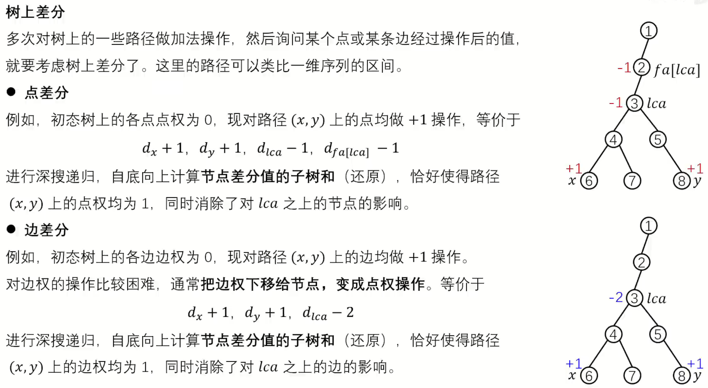


# [BJOI2018] 求和

## 题目描述

master 对树上的求和非常感兴趣。他生成了一棵有根树，并且希望多次询问这棵树上一段路径上所有节点深度的$k$ 次方和，而且每次的$k$ 可能是不同的。此处节点深度的定义是这个节点到根的路径上的边数。他把这个问题交给了pupil，但pupil 并不会这么复杂的操作，你能帮他解决吗？

## 输入格式

第一行包含一个正整数$n$，表示树的节点数。

之后$n-1$ 行每行两个空格隔开的正整数$i, j$，表示树上的一条连接点$i$ 和点$j$ 的边。

之后一行一个正整数$m$，表示询问的数量。

之后每行三个空格隔开的正整数$i, j, k$，表示询问从点$i$ 到点$j$ 的路径上所有节点深度的$k$ 次方和。由于这个结果可能非常大，输出其对$998244353$ 取模的结果。

树的节点从$1$ 开始标号，其中$1$ 号节点为树的根。

## 输出格式

对于每组数据输出一行一个正整数表示取模后的结果。

## 样例 #1

### 样例输入 #1

```
5
1 2
1 3
2 4
2 5
2
1 4 5
5 4 45
```

### 样例输出 #1

```
33
503245989
```

## 提示

### 样例解释

以下用$d (i)$ 表示第$i$ 个节点的深度。

对于样例中的树，有$d (1) = 0, d (2) = 1, d (3) = 1, d (4) = 2, d (5) = 2$。

因此第一个询问答案为$(2^5 + 1^5 + 0^5)\ mod\ 998244353 = 33$，第二个询问答案为$(2^{45} + 1^{45} + 2^{45})\ mod\ 998244353 = 503245989$。

### 数据范围

对于$30\%$ 的数据，$1 \leq n,m \leq 100$。

对于$60\%$ 的数据，$1 \leq n,m \leq 1000$。

对于$100\%$ 的数据，$1 \leq n,m \leq 300000, 1 \leq k \leq 50$。

另外存在5个不计分的hack数据

### 提示

数据规模较大，请注意使用较快速的输入输出方式。

**树上前缀和**

```c++
#include <bits/stdc++.h>

using namespace std;
using LL = long long int;
const int N = 3e5 + 10, mod = 998244353;
int h[N], e[2 * N], ne[2 * N], idx, m, n, dep[N], fa[N][22];
LL mi[60], s[N][60];

void add(int a, int b) {
    e[idx] = b;
    ne[idx] = h[a];
    h[a] = idx++;
}

void dfs(int u, int f) {
    for (int i = 0; fa[u][i]; ++i) {
        fa[u][i + 1] = fa[fa[u][i]][i];
    }
    for (int i = h[u]; ~i; i = ne[i]) {
        int v = e[i];
        if (v == f)continue;
        fa[v][0] = u;
        dep[v] = dep[u] + 1;
        for (int j = 1; j <= 50; ++j) mi[j] = mi[j - 1] * dep[v] % mod;
        for (int j = 1; j <= 50; ++j) s[v][j] = (s[u][j] + mi[j]) % mod;
        dfs(v, u);
    }
}

int lca(int u, int v) {
    if (dep[u] < dep[v]) swap(u, v);
    for (int i = 21; i >= 0; --i) {
        if (dep[fa[u][i]] >= dep[v]) {
            u = fa[u][i];
        }
    }
    if (u == v) return u;
    for (int i = 21; i >= 0; --i) {
        if (fa[u][i] != fa[v][i]) {
            u = fa[u][i];
            v = fa[v][i];
        }
    }
    return fa[u][0];
}

int main() {
    cin >> n;
    int a, b, c;
    memset(h, -1, sizeof h);
    for (int i = 0; i < n - 1; ++i) {
        cin >> a >> b;
        add(b, a);
        add(a, b);
    }
    mi[0] = 1;
    dfs(1, 0);
    cin >> m;
    for (int i = 0; i < m; ++i) {
        cin >> a >> b >> c;
        int l = lca(a, b);
        LL ans = (s[a][c] + s[b][c] - s[l][c] - s[fa[l][0]][c] + 2 * mod) % mod;
        cout << ans << endl;
    }
    return 0;
}
```


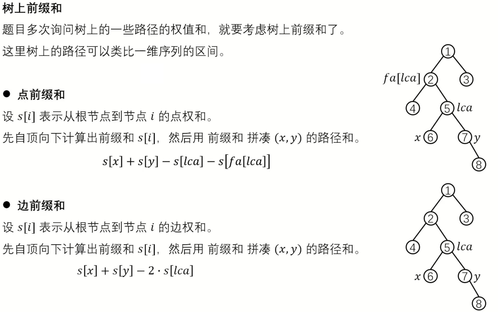


> 【32 树上前缀和 P4427 [BJOI2018] 求和】 https://www.bilibili.com/video/BV1j14y1o7Rn/?share_source=copy_web&vd_source=8fa0ddfc571cb8e214b881be981477a4


# 【模板】最小生成树

## 题目描述

如题，给出一个无向图，求出最小生成树，如果该图不连通，则输出 `orz`。

## 输入格式

第一行包含两个整数 $N,M$，表示该图共有 $N$ 个结点和 $M$ 条无向边。

接下来 $M$ 行每行包含三个整数 $X_i,Y_i,Z_i$，表示有一条长度为 $Z_i$ 的无向边连接结点 $X_i,Y_i$。

## 输出格式

如果该图连通，则输出一个整数表示最小生成树的各边的长度之和。如果该图不连通则输出 `orz`。

## 样例 #1

### 样例输入 #1

```
4 5
1 2 2
1 3 2
1 4 3
2 3 4
3 4 3
```

### 样例输出 #1

```
7
```

## 提示

数据规模：

对于 $20\%$ 的数据，$N\le 5$，$M\le 20$。

对于 $40\%$ 的数据，$N\le 50$，$M\le 2500$。

对于 $70\%$ 的数据，$N\le 500$，$M\le 10^4$。

对于 $100\%$ 的数据：$1\le N\le 5000$，$1\le M\le 2\times 10^5$，$1\le Z_i \le 10^4$。


样例解释：

 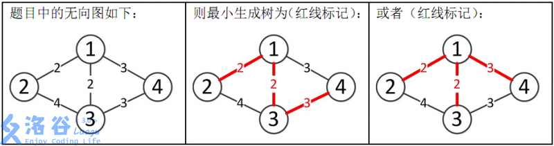 

所以最小生成树的总边权为 $2+2+3=7$。

```c++
#include <bits/stdc++.h>

using namespace std;
const int N = 5050, M = 2e5 + 10;

struct node {
    int x, y, w;

    bool operator<(const node &D) const {
        return w < D.w;
    }
} s[M];

int n, m, p[N], ans;

int find(int x) {
    if (p[x] != x) p[x] = find(p[x]);
    return p[x];
}

bool solve() {
    int cnt = n;
    for (int i = 0; i < m; ++i) {
        int x = s[i].x;
        int y = s[i].y;
        if (find(x) == find(y)) continue;
        p[find(x)] = find(y);
        ans += s[i].w;
        cnt--;
    }
    if (cnt == 1) return true;
    return false;
}

int main() {
    cin >> n >> m;
    int a, b, c;
    for (int i = 0; i < m; ++i) {
        cin >> a >> b >> c;
        s[i] = {a, b, c};
    }
    sort(s, s + m);
    for (int i = 0; i <= n; ++i) p[i] = i;
    if (solve()) {
        cout << ans;
    } else {
        cout << "orz";
    }
    return 0;
}
```


# 买礼物

## 题目描述

又到了一年一度的明明生日了，明明想要买 $B$ 样东西，巧的是，这 $B$ 样东西价格都是 $A$ 元。

但是，商店老板说最近有促销活动，也就是：

如果你买了第 $I$ 样东西，再买第 $J$ 样，那么就可以只花 $K_{I,J}$ 元，更巧的是，$K_{I,J}$ 竟然等于 $K_{J,I}$。

现在明明想知道，他最少要花多少钱。

## 输入格式

第一行两个整数，$A,B$。

接下来 $B$ 行，每行 $B$ 个数，第 $I$ 行第 $J$ 个为 $K_{I,J}$。

我们保证 $K_{I,J}=K_{J,I}$ 并且 $K_{I,I}=0$。

特别的，如果 $K_{I,J}=0$，那么表示这两样东西之间不会导致优惠。

注意 $K_{I,J}$ **可能大于** $A$。

## 输出格式

一个整数，为最小要花的钱数。

## 样例 #1

### 样例输入 #1

```
1 1
0
```

### 样例输出 #1

```
1
```

## 样例 #2

### 样例输入 #2

```
3 3
0 2 4
2 0 2
4 2 0
```

### 样例输出 #2

```
7
```

## 提示

样例解释 $2$。

先买第 $2$ 样东西，花费 $3$ 元，接下来因为优惠，买 $1,3$ 样都只要 $2$ 元，共 $7$ 元。

（同时满足多个“优惠”的时候，聪明的明明当然不会选择用 $4$ 元买剩下那件，而选择用 $2$ 元。）

数据规模

对于 $30\%$ 的数据，$1\le B\le 10$。

对于 $100\%$ 的数据，$1\le B\le500,0\le A,K_{I,J}\le1000$。

2018.7.25新添数据一组

```c++
#include <bits/stdc++.h>

using namespace std;
const int N = 550;

struct node {
    int x, y, w;

    bool operator<(const node &D) const {
        return w < D.w;
    }
} s[N * N];

int A, m, tot, p[N], ans;
using LL = long long int;

int find(int x) {
    if (p[x] != x) p[x] = find(p[x]);
    return p[x];
}

LL solve() {
    LL ans = 0;
    for (int i = 0; i < tot; ++i) {
        int x = s[i].x;
        int y = s[i].y;
        if (find(x) == find(y)) continue;
        p[find(x)] = find(y);
        ans += s[i].w;
    }
    return ans;
}

int main() {
    cin >> A >> m;
    int a, b, c;
    for (int i = 0; i < m; ++i) {
        for (int j = 0; j < m; ++j) {
            cin >> a;
            if (a == 0)continue;
            if (a > A) a = A;//注意题目中明确说明K可能大于A
            s[tot++] = {i + 1, j + 1, a};
        }
    }
    sort(s, s + tot);
    for (int i = 0; i <= m; ++i) p[i] = i;
    LL ans = solve();
    for (int i = 1; i <= m; ++i)
        if (p[i] == i) ans += A;
    cout << ans;
    return 0;
}
```

**注意题目中明确说明K~ij~可能大于A**


# [USACO08OCT] Watering Hole G

## 题目描述

Farmer John 的农场缺水了。

他决定将水引入到他的 $n$ 个农场。他准备通过挖若干井，并在各块田中修筑水道来连通各块田地以供水。在第 $i$ 号田中挖一口井需要花费 $W_i$ 元。连接 $i$ 号田与 $j$ 号田需要 $P_{i,j}$（$P_{j,i}=P_{i,j}$）元。

请求出 FJ 需要为使所有农场都与有水的农场相连或拥有水井所需要的最少钱数。

## 输入格式

第一行为一个整数 $n$。

接下来 $n$ 行，每行一个整数 $W_i$。

接下来 $n$ 行，每行 $n$ 个整数，第 $i$ 行的第 $j$ 个数表示连接 $i$ 号田和 $j$ 号田需要的费用 $P_{i,j}$。

## 输出格式

输出最小开销。

## 样例 #1

### 样例输入 #1

```
4
5
4
4
3
0 2 2 2
2 0 3 3
2 3 0 4
2 3 4 0
```

### 样例输出 #1

```
9
```

## 提示

对于 $100\%$ 的数据，$1 \leq n \leq 300$，$1 \leq W_i \leq 10^5$，$0 \leq P_{i,j} \leq 10^5$。

**最小生成树+维护最小值的并查集**

```c++
#include <bits/stdc++.h>

using namespace std;
const int N = 300 + 10;
using LL = long long int;
int n, w[N], p[N][N], tot, s[N], minn[N];

struct node {
    int x, y, d;

    bool operator<(const node &W) const {
        return d < W.d;
    }
} a[N * N];

int find(int x) {
    if (s[x] != x) s[x] = find(s[x]);
    return s[x];
}

LL solve() {
    LL ans = 0;
    for (int i = 0; i < tot; ++i) {
        int x = a[i].x;
        int y = a[i].y;
        if (find(x) == find(y)) continue;
        if (a[i].d <= max(minn[find(x)], minn[find(y)])) {
            minn[find(y)] = min(minn[find(y)], minn[find(x)]);
            s[find(x)] = find(y);
            ans += a[i].d;
        }
    }
    return ans;
}

int main() {
    cin >> n;
    for (int i = 1; i <= n; ++i) cin >> w[i], minn[i] = w[i];
    for (int i = 1; i <= n; ++i)
        for (int j = 1; j <= n; ++j) cin >> p[i][j];
    for (int i = 1; i <= n; ++i)
        for (int j = i + 1; j <= n; ++j) a[tot++] = {i, j, p[i][j]};
    sort(a, a + tot);
    for (int i = 1; i <= n; ++i) s[i] = i;
    LL ans = solve();
    for (int i = 1; i <= n; ++i)
        if (s[i] == i) ans += minn[i];
    cout << ans << endl;
    return 0;
}
```

打井的条件：`a[i].d <= max(minn[find(x)], minn[find(y)])`

维护最小值的顺序一定要记清楚：

```c++
    minn[find(y)] = min(minn[find(y)], minn[find(x)]);
    s[find(x)] = find(y);
```

先合并两棵树的最小值，然后再合并两棵树。

如果先合并两棵树的话，最小值那里的find函数会发生变化！这个致命的原因导致我排查了半天。


另外一种非常好的思路：

让我们回到问题的本质：让每个村庄都有水。（前方高能）

我们可以假设，所有的井都和一处水源联通。那么，我们可以把所有的村庄都和这个水源连接起来，这样，我们只要把这个水源点也看成一个村庄，让他和所有的点都或直接或间接地联通，并且让每个点之间连通，问题就解决了

这样，这个问题就转化成了一个n+1个点的最小生成树，并且每个点和水源点连接的费用就是打井的费用。

于是，样例的情况就是1号点和水源点联通，其他点与一号店联通，而我的数据就是每个点都与水源点联通。

其实就是要让水源点和每个点联通，这样水就会走进每个村子

于是，我们在建点和点的边的基础上，在建和水源点的边，然后跑一边最小生成树就可以了。（prim和kruskal都可以，但我更喜欢kruskal）

**本质上就是建立一个虚拟的点**


# 口袋的天空

## 题目背景

小杉坐在教室里，透过口袋一样的窗户看口袋一样的天空。

有很多云飘在那里，看起来很漂亮，小杉想摘下那样美的几朵云，做成棉花糖。

## 题目描述

给你云朵的个数 $N$，再给你 $M$ 个关系，表示哪些云朵可以连在一起。

现在小杉要把所有云朵连成 $K$ 个棉花糖，一个棉花糖最少要用掉一朵云，小杉想知道他怎么连，花费的代价最小。

## 输入格式

第一行有三个数 $N,M,K$。

接下来 $M$ 行每行三个数 $X,Y,L$，表示 $X$ 云和 $Y$ 云可以通过 $L$ 的代价连在一起。

## 输出格式

对每组数据输出一行，仅有一个整数，表示最小的代价。

如果怎么连都连不出 $K$ 个棉花糖，请输出 `No Answer`。

## 样例 #1

### 样例输入 #1

```
3 1 2
1 2 1
```

### 样例输出 #1

```
1
```

## 提示

对于 $30\%$ 的数据，$1 \le N \le 100$，$1\le M \le 10^3$；

对于 $100\%$ 的数据，$1 \le N \le 10^3$，$1 \le M \le 10^4$，$1 \le K \le 10$，$1 \le X,Y \le N$，$0 \le L<10^4$。

**最小生成树+K连通块**

```c++
#include <bits/stdc++.h>

using namespace std;
const int N = 1000 + 10;
using LL = long long int;
int n, m, k, p[N];
LL ans;

struct node {
    int x, y, w;

    bool operator<(const node &W) const {
        return w < W.w;
    }
} s[N * 10];

int find(int x) {
    if (p[x] != x) p[x] = find(p[x]);
    return p[x];
}

bool solve() {
    int tot = n;
    for (int i = 0; i < m; ++i) {
        int x = s[i].x;
        int y = s[i].y;
        if (find(x) == find(y)) continue;
        p[find(x)] = find(y);
        ans += s[i].w;
        tot--;
        if (tot == k) return true;
    }
    return false;
}

int main() {
    cin >> n >> m >> k;
    int a, b, c;
    for (int i = 0; i < m; ++i) {
        cin >> a >> b >> c;
        s[i] = {a, b, c};
    }
    sort(s, s + m);
    for (int i = 0; i <= n; ++i) p[i] = i;
    if (solve()) cout << ans << endl;
    else cout << "No Answer" << endl;
    return 0;
}
```

当`连通块的数量==k`的时候直接结束最小生成树的生成


# 仓鼠找 sugar

## 题目描述

小仓鼠的和他的基（mei）友（zi）sugar 住在地下洞穴中，每个节点的编号为 $1\sim n$。地下洞穴是一个树形结构。这一天小仓鼠打算从从他的卧室（$a$）到餐厅（$b$），而他的基友同时要从他的卧室（$c$）到图书馆（$d$）。他们都会走最短路径。现在小仓鼠希望知道，有没有可能在某个地方，可以碰到他的基友？


小仓鼠那么弱，还要天天被 zzq 大爷虐，请你快来救救他吧！

## 输入格式

第一行两个正整数 $n$ 和 $q$，表示这棵树节点的个数和询问的个数。

接下来 $n-1$ 行，每行两个正整数 $u$ 和 $v$，表示节点 $u$ 到节点 $v$ 之间有一条边。

接下来 $q$ 行，每行四个正整数 $a$、$b$、$c$ 和 $d$，表示节点编号，也就是一次询问，其意义如上。

## 输出格式

对于每个询问，如果有公共点，输出大写字母 `Y`；否则输出`N`。

## 样例 #1

### 样例输入 #1

```
5 5
2 5
4 2
1 3
1 4
5 1 5 1
2 2 1 4
4 1 3 4
3 1 1 5
3 5 1 4
```

### 样例输出 #1

```
Y
N
Y
Y
Y
```

## 提示

**本题时限 1s，内存限制 128M，因新评测机速度较为接近 NOIP 评测机速度，请注意常数问题带来的影响。**


$20\%$ 的数据 $n, q\le200$。

$40\%$ 的数据 $n, q\le 2\times10^3$。

$70\%$ 的数据 $n, q\le 5\times10^4$。

$100\%$ 的数据 $1\le n, q\le10^5$。

**LCA**

```c++
#include <bits/stdc++.h>

using namespace std;
const int N = 1e5 + 10;
using LL = long long int;
int n, q, idx, h[N], ne[N * 2], e[N * 2], fa[N][21], dep[N];

void add(int a, int b) {
    ne[idx] = h[a];
    e[idx] = b;
    h[a] = idx++;
}

void dfs(int u, int f) {
    fa[u][0] = f;
    dep[u] = dep[f] + 1;
    for (int i = 1; i <= 20; ++i) 
        fa[u][i] = fa[fa[u][i - 1]][i - 1];
    for (int i = h[u]; ~i; i = ne[i])
        if (f != e[i]) dfs(e[i], u);
}

int lca(int u, int v) {
    if (dep[u] < dep[v]) swap(u, v);
    for (int i = 20; i >= 0; i--)
        if (dep[fa[u][i]] >= dep[v]) u = fa[u][i];
    if (u == v) return v;
    for (int i = 20; i >= 0; i--) {
        if (fa[u][i] != fa[v][i]) {
            u = fa[u][i];
            v = fa[v][i];
        }
    }
    return fa[u][0];
}

int dist(int a, int b) { return dep[a] + dep[b] - 2 * dep[lca(a, b)]; }

int main() {
    cin >> n >> q;
    int a, b, c, d;
    memset(h, -1, sizeof h);
    for (int i = 0; i < n - 1; ++i) {
        cin >> a >> b;
        add(a, b);
        add(b, a);
    }
    dfs(1, 0);
    for (int i = 0; i < q; ++i) {
        cin >> a >> b >> c >> d;
        if (dist(a, b) + dist(c, d) >= dist(a, c) + dist(b, d)) printf("Y\n");
        else printf("N\n");
    }
}
```

然后我们可以用数学归纳（或者说是试出来的吧）发现：

如果**两个起点的距离 + 两个终点的距离 >= 两条路径的长度和**

那么两条路径有一部分一定是**重合**的（或者说一定是**存在公共点**的）

或许也可以用容斥原理解释~~（其实怎么证明正确性我也没想好……直观感觉吧）~~


# 【模板】割点（割顶）

## 题目背景

割点

## 题目描述

给出一个 $n$ 个点，$m$ 条边的无向图，求图的割点。

## 输入格式

第一行输入两个正整数 $n,m$。

下面 $m$ 行每行输入两个正整数 $x,y$ 表示 $x$ 到 $y$ 有一条边。

## 输出格式

第一行输出割点个数。

第二行按照节点编号从小到大输出节点，用空格隔开。

## 样例 #1

### 样例输入 #1

```
6 7
1 2
1 3
1 4
2 5
3 5
4 5
5 6
```

### 样例输出 #1

```
1 
5
```

## 提示

对于全部数据，$1\leq n \le 2\times 10^4$，$1\leq m \le 1 \times 10^5$。

点的编号均大于 $0$ 小于等于 $n$。

**tarjan图不一定联通。**

```c++
#include <bits/stdc++.h>

using namespace std;
const int N = 20010;
int n, m, a, b;
vector<int> e[N];
int dfn[N], low[N], tot;
bool cut[N];
int root;

void tarjan(int x) {
    dfn[x] = low[x] = ++tot;
    int child = 0;
    for (int y: e[x]) {
        if (!dfn[y]) {
            tarjan(y);
            low[x] = min(low[x], low[y]);
            if (low[y] >= dfn[x]) {
                child++;
                if (x != root || child > 1) {
                    cut[x] = true;
                }
            }
        } else {
            low[x] = min(low[x], dfn[y]);
        }
    }
}

int main() {
    cin >> n >> m;
    for (int i = 0; i < m; ++i) {
        cin >> a >> b;
        e[a].push_back(b);
        e[b].push_back(a);
    }
    for (root = 1; root <= n; root++)
        if (!dfn[root]) tarjan(root);
    int ans = 0;
    for (int i = 1; i <= n; i++)
        if (cut[i]) ans++;
    printf("%d\n", ans);
    for (int i = 1; i <= n; i++)
        if (cut[i]) printf("%d ", i);
    return 0;
}
```

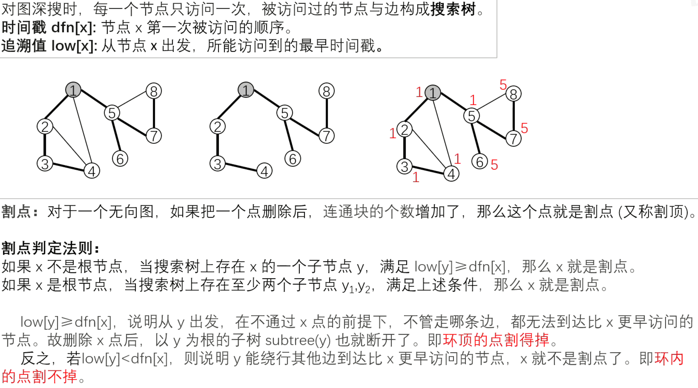


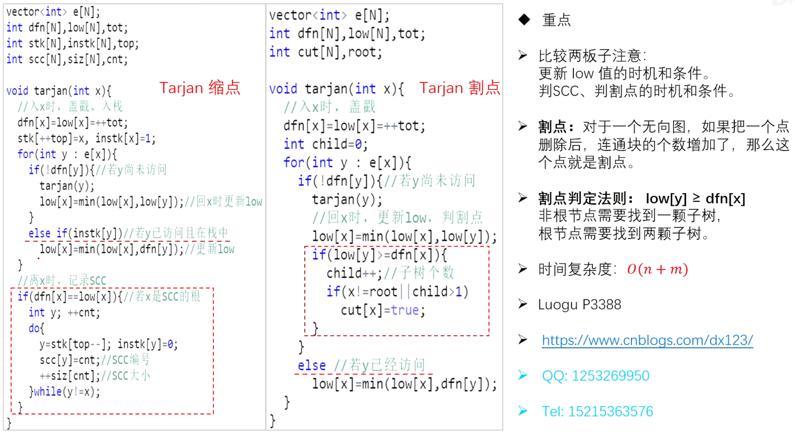


> 【343 Tarjan 割点】 https://www.bilibili.com/video/BV1QL4y1N7bC/?share_source=copy_web&vd_source=8fa0ddfc571cb8e214b881be981477a4


# 树的分解

## 题目描述

给出 $N$ 个点的树和 $K$，问能否把树划分成 $\frac{N}{K}$ 个连通块，且每个连通块的点数都是 $K$。

## 输入格式

第一行，一个整数 $T$，表示数据组数。接下来 $T$ 组数据，对于每组数据：

第一行，两个整数 $N, K$。

接下来 $N - 1$ 行，每行两个整数 $A_i, B_i$，表示边 $(A_i, B_i)$。点用 $1, 2, \ldots, N$ 编号。

## 输出格式

对于每组数据，输出 `YES` 或 `NO`。

## 样例 #1

### 样例输入 #1

```
2
4 2
1 2
2 3
3 4
4 2
1 2
1 3
1 4
```

### 样例输出 #1

```
YES
NO
```

## 提示

- 对于 $60 \%$ 的数据，$1 \le N, K \le 10^3$；
- 对于 $100 \%$ 的数据，$1 \le T \le 10$，$1 \le N ,K \le 10^5$。

```c++
#include <bits/stdc++.h>

using namespace std;
const int N = 1e5 + 10;
int n, k, idx, cnt, h[N], ne[N * 2], e[N * 2];
int st[N];

void add(int a, int b) {
    ne[idx] = h[a];
    e[idx] = b;
    h[a] = idx++;
}

void dfs(int x, int fa) {
    st[x] = 1;
    for (int i = h[x]; ~i; i = ne[i]) {
        int j = e[i];
        if (j == fa) continue;
        dfs(j, x);
        st[x] += st[j];
    }
    if (st[x] == k) {
        st[x] = 0;
        cnt++;
    }
}

void solve() {
    cin >> n >> k;
    cnt = 0;
    idx = 0;
    memset(h, -1, sizeof h);
    memset(st, 0, sizeof st);
    int a, b;
    for (int i = 0; i < n - 1; ++i) {
        cin >> a >> b;
        add(a, b);
        add(b, a);
    }
    if (n % k != 0) {
        cout << "NO" << endl;
        return;
    }
    dfs(1, 0);
    if (cnt == n / k) cout << "YES" << endl;
    else cout << "NO" << endl;
    return;
}

int main() {
    int T;
    cin >> T;
    while (T--) solve();
    return 0;
}
```


