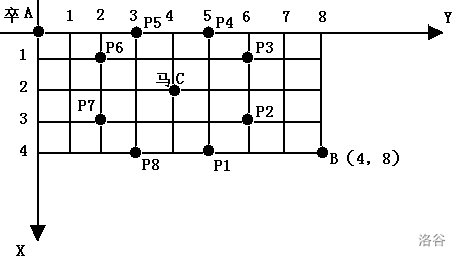
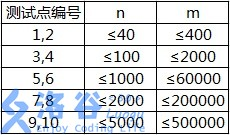

https://www.luogu.com.cn/training/5011

# [NOIP2001 普及组] 装箱问题

## 题目描述

有一个箱子容量为 $V$，同时有 $n$ 个物品，每个物品有一个体积。


现在从 $n$ 个物品中，任取若干个装入箱内（也可以不取），使箱子的剩余空间最小。输出这个最小值。

## 输入格式

第一行共一个整数 $V$，表示箱子容量。

第二行共一个整数 $n$，表示物品总数。

接下来 $n$ 行，每行有一个正整数，表示第 $i$ 个物品的体积。

## 输出格式

- 共一行一个整数，表示箱子最小剩余空间。

## 样例 #1

### 样例输入 #1

```
24
6
8
3
12
7
9
7
```

### 样例输出 #1

```
0
```

## 提示

对于 $100\%$ 数据，满足 $0<n \le 30$，$1 \le V \le 20000$。

**【题目来源】**

NOIP 2001 普及组第四题

```c++
#include <bits/stdc++.h>

using namespace std;

const int N = 35, M = 20010;
int f[M], n, m, v[N];

int main() {
    cin >> m >> n;
    for (int i = 1; i <= n; ++i) cin >> v[i];

    for (int i = 1; i <= n; ++i)
        for (int j = m; j >= v[i]; --j) f[j] = max(f[j], f[j - v[i]] + v[i]);

    cout << m - f[m];
    return 0;
}
```


# [NOIP2005 普及组] 采药

## 题目描述

辰辰是个天资聪颖的孩子，他的梦想是成为世界上最伟大的医师。为此，他想拜附近最有威望的医师为师。医师为了判断他的资质，给他出了一个难题。医师把他带到一个到处都是草药的山洞里对他说：“孩子，这个山洞里有一些不同的草药，采每一株都需要一些时间，每一株也有它自身的价值。我会给你一段时间，在这段时间里，你可以采到一些草药。如果你是一个聪明的孩子，你应该可以让采到的草药的总价值最大。”


如果你是辰辰，你能完成这个任务吗？

## 输入格式

第一行有 $2$ 个整数 $T$（$1 \le T \le 1000$）和 $M$（$1 \le  M \le 100$），用一个空格隔开，$T$ 代表总共能够用来采药的时间，$M$ 代表山洞里的草药的数目。

接下来的 $M$ 行每行包括两个在 $1$ 到 $100$ 之间（包括 $1$ 和 $100$）的整数，分别表示采摘某株草药的时间和这株草药的价值。

## 输出格式

输出在规定的时间内可以采到的草药的最大总价值。

## 样例 #1

### 样例输入 #1

```
70 3
71 100
69 1
1 2
```

### 样例输出 #1

```
3
```

## 提示

**【数据范围】**

- 对于 $30\%$ 的数据，$M \le 10$；
- 对于全部的数据，$M \le 100$。

**【题目来源】**

NOIP 2005 普及组第三题

```c++
#include<bits/stdc++.h>

using namespace std;
typedef long long int LL;
const int M = 110, T = 1010;

int v[M], w[M];
int m, t;
int f[T];

int main() {
    cin >> t >> m;

    for (int i = 1; i <= m; ++i) {
        cin >> v[i] >> w[i];
    }

    for (int i = 1; i <= m; ++i)
        for (int j = t; j >= v[i]; --j)
            f[j] = max(f[j], f[j - v[i]] + w[i]);

    cout << f[t];
    return 0;
}
```


# [NOIP2008 普及组] 传球游戏

## 题目描述

上体育课的时候，小蛮的老师经常带着同学们一起做游戏。这次，老师带着同学们一起做传球游戏。

游戏规则是这样的：$n$个同学站成一个圆圈，其中的一个同学手里拿着一个球，当老师吹哨子时开始传球，每个同学可以把球传给自己左右的两个同学中的一个（左右任意），当老师再次吹哨子时，传球停止，此时，拿着球没有传出去的那个同学就是败者，要给大家表演一个节目。

聪明的小蛮提出一个有趣的问题：有多少种不同的传球方法可以使得从小蛮手里开始传的球，传了$m$次以后，又回到小蛮手里。两种传球方法被视作不同的方法，当且仅当这两种方法中，接到球的同学按接球顺序组成的序列是不同的。比如有三个同学$1$号、$2$号、$3$号，并假设小蛮为$1$号，球传了$3$次回到小蛮手里的方式有$1 \rightarrow 2 \rightarrow 3 \rightarrow 1$ 和 $1 \rightarrow 3 \rightarrow 2 \rightarrow 1$，共 $2$ 种。

## 输入格式

一行，有两个用空格隔开的整数$n,m(3 \le n \le 30,1 \le m \le 30)$。

## 输出格式

$1$个整数，表示符合题意的方法数。

## 样例 #1

### 样例输入 #1

```
3 3
```

### 样例输出 #1

```
2
```

## 提示

40%的数据满足：$3 \le n \le 30,1 \le m \le 20$

100%的数据满足：$3 \le n \le 30,1 \le m \le 30$

2008普及组第三题

```c++
#include <bits/stdc++.h>

using namespace std;
const int N = 35;
int n, m;
long long int f[N][N];

int main() {
    cin >> n >> m;
    f[0][1] = 1;

    for (int i = 1; i <= m; ++i) {
        for (int j = 1; j <= n; ++j) {
            long long int &v = f[i][j];
            if (j - 1 >= 1) v += f[i - 1][j - 1];
            else v += f[i - 1][n];
            if (j + 1 <= n) v += f[i - 1][j + 1];
            else v += f[i - 1][1];
        }
    }

    cout << f[m][1];
    return 0;
}
```


# [NOIP2012 普及组] 摆花

## 题目描述

小明的花店新开张，为了吸引顾客，他想在花店的门口摆上一排花，共 $m$ 盆。通过调查顾客的喜好，小明列出了顾客最喜欢的 $n$ 种花，从 $1$ 到 $n$ 标号。为了在门口展出更多种花，规定第 $i$ 种花不能超过 $a_i$ 盆，摆花时同一种花放在一起，且不同种类的花需按标号的从小到大的顺序依次摆列。

试编程计算，一共有多少种不同的摆花方案。

## 输入格式

第一行包含两个正整数 $n$ 和 $m$，中间用一个空格隔开。

第二行有 $n$ 个整数，每两个整数之间用一个空格隔开，依次表示 $a_1,a_2, \cdots ,a_n$。

## 输出格式

一个整数，表示有多少种方案。注意：因为方案数可能很多，请输出方案数对 $10^6+7$ 取模的结果。

## 样例 #1

### 样例输入 #1

```
2 4
3 2
```

### 样例输出 #1

```
2
```

## 提示

【数据范围】

对于 $20\%$ 数据，有 $0<n \le 8,0<m \le 8,0 \le a_i \le 8$。

对于 $50\%$ 数据，有 $0<n \le 20,0<m \le 20,0 \le a_i \le 20$。

对于 $100\%$ 数据，有 $0<n \le 100,0<m \le 100,0 \le a_i \le 100$。

NOIP 2012 普及组 第三题

```c++
#include <bits/stdc++.h>

using namespace std;
const int N = 110, mod = 1e6 + 7;
int n, m, f[N][N], s[N];

int main() {
    cin >> n >> m;
    for (int i = 1; i <= n; ++i) cin >> s[i];

    f[0][0] = 1;
    for (int i = 1; i <= n; ++i)
        for (int j = 0; j <= m; ++j)
            for (int k = 0; k <= min(s[i], j); ++k)
                f[i][j] = (f[i][j] + f[i - 1][j - k]) % mod;

    cout << f[n][m];
    return 0;
}
```


# 四方定理

## 题目描述

四方定理是众所周知的：任意一个正整数$n$，可以分解为不超过四个整数的平方和。例如：$25=1^{2}+2^{2}+2^{2}+4^{2}$，当然还有其他的分解方案，$25=4^{2}+3^{2}$和$25=5^{2}$。给定的正整数$n$，编程统计它能分解的方案总数。注意：$25=4^{2}+3^{2}$和$25=3^{2}+4^{2}$视为一种方案。

## 输入格式

第一行为正整数$t$($t\le 100$)，接下来$t$行，每行一个正整数$n$($n\le 32768$)。

## 输出格式

对于每个正整数$n$，输出方案总数。

## 样例 #1

### 样例输入 #1

```
1
2003
```

### 样例输出 #1

```
48
```

```c++
#include <bits/stdc++.h>

using namespace std;
const int N = 33000;
int n, t;
int f[5][N];

int main() {
    cin >> t;

    f[0][0] = 1;
    for (int i = 1; i * i < N; ++i) {
        for (int s = 1; s <= 4; ++s) {
            for (int j = i * i; j < N; ++j)
                f[s][j] += f[s - 1][j - i * i];
        }
    }

    while (t--) {
        cin >> n;
        int res = 0;
        for (int i = 1; i <= 4; ++i) res += f[i][n];
        cout << res << endl;
    }
    return 0;
}
```


# [NOIP2002 普及组] 过河卒

## 题目描述

棋盘上 $A$ 点有一个过河卒，需要走到目标 $B$ 点。卒行走的规则：可以向下、或者向右。同时在棋盘上 $C$ 点有一个对方的马，该马所在的点和所有跳跃一步可达的点称为对方马的控制点。因此称之为“马拦过河卒”。

棋盘用坐标表示，$A$ 点 $(0, 0)$、$B$ 点 $(n, m)$，同样马的位置坐标是需要给出的。



现在要求你计算出卒从 $A$ 点能够到达 $B$ 点的路径的条数，假设马的位置是固定不动的，并不是卒走一步马走一步。

## 输入格式

一行四个正整数，分别表示 $B$ 点坐标和马的坐标。

## 输出格式

一个整数，表示所有的路径条数。

## 样例 #1

### 样例输入 #1

```
6 6 3 3
```

### 样例输出 #1

```
6
```

## 提示

对于 $100 \%$ 的数据，$1 \le n, m \le 20$，$0 \le$ 马的坐标 $\le 20$。

**【题目来源】**

NOIP 2002 普及组第四题

```c++
#include<bits/stdc++.h>

using namespace std;
typedef long long int LL;
const int N = 24;

bool st[N][N];
LL f[N];
int n, m;

void del(int a, int b) {
    st[a][b] = true;
    int dx[8] = {-2, -1, 1, 2, -2, -1, 1, 2};
    int dy[8] = {1, 2, 2, 1, -1, -2, -2, -1};

    for (int i = 0; i < 8; ++i) {
        int x = a + dx[i], y = b + dy[i];
        if (x < 0 || y < 0 || x > n || y > m) continue;
        st[x][y] = true;
    }
}

int main() {
    cin >> n >> m;

    int x, y;
    cin >> x >> y;
    del(x, y);


    f[0] = 1;
    for (int i = 0; i <= n; ++i) {
        for (int j = 0; j <= m; ++j) {
            if (i == 0 && j == 0) {
                continue;
            }
            if (st[i][j]) {
                f[j] = 0;
                continue;
            }
            if (i == 0) {
                f[j] = f[j - 1];
                continue;
            }
            if (j == 0) {
                f[j] = f[j];
                continue;
            }
            f[j] = f[j] + f[j - 1];
        }
    }
    cout << f[m];
    return 0;
}
```


# 最大正方形

## 题目描述

在一个 $n\times m$ 的只包含 $0$ 和 $1$ 的矩阵里找出一个不包含 $0$ 的最大正方形，输出边长。

## 输入格式

输入文件第一行为两个整数 $n,m(1\leq n,m\leq 100)$，接下来 $n$ 行，每行 $m$ 个数字，用空格隔开，$0$ 或 $1$。

## 输出格式

一个整数，最大正方形的边长。

## 样例 #1

### 样例输入 #1

```
4 4
0 1 1 1
1 1 1 0
0 1 1 0
1 1 0 1
```

### 样例输出 #1

```
2
```

```c++
#include <bits/stdc++.h>

using namespace std;
const int N = 110;
int n, f[N][N], a[N][N], m;

int main() {
    cin >> n >> m;
    for (int i = 1; i <= n; ++i)
        for (int j = 1; j <= m; ++j)
            cin >> a[i][j];

    int res = 0;
    for (int i = 1; i <= n; ++i)
        for (int j = 1; j <= m; ++j)
            if (a[i][j]) {
                f[i][j] = min(min(f[i - 1][j], f[i][j - 1]), f[i - 1][j - 1]) + 1;
                res = max(res, f[i][j]);// 可以做到同步更新
            }

    cout << res;
    return 0;
}
```


# 疯狂的采药

## 题目背景

此题为纪念 LiYuxiang 而生。

## 题目描述

LiYuxiang 是个天资聪颖的孩子，他的梦想是成为世界上最伟大的医师。为此，他想拜附近最有威望的医师为师。医师为了判断他的资质，给他出了一个难题。医师把他带到一个到处都是草药的山洞里对他说：“孩子，这个山洞里有一些不同种类的草药，采每一种都需要一些时间，每一种也有它自身的价值。我会给你一段时间，在这段时间里，你可以采到一些草药。如果你是一个聪明的孩子，你应该可以让采到的草药的总价值最大。”

如果你是 LiYuxiang，你能完成这个任务吗？

此题和原题的不同点：

$1$. 每种草药可以无限制地疯狂采摘。

$2$. 药的种类眼花缭乱，采药时间好长好长啊！师傅等得菊花都谢了！

## 输入格式

输入第一行有两个整数，分别代表总共能够用来采药的时间 $t$ 和代表山洞里的草药的数目 $m$。

第 $2$ 到第 $(m + 1)$ 行，每行两个整数，第 $(i + 1)$ 行的整数 $a_i, b_i$ 分别表示采摘第 $i$ 种草药的时间和该草药的价值。

## 输出格式

输出一行，这一行只包含一个整数，表示在规定的时间内，可以采到的草药的最大总价值。

## 样例 #1

### 样例输入 #1

```
70 3
71 100
69 1
1 2
```

### 样例输出 #1

```
140
```

## 提示

#### 数据规模与约定

- 对于 $30\%$ 的数据，保证 $m \le 10^3$ 。
- 对于 $100\%$ 的数据，保证 $1 \leq m \le 10^4$，$1 \leq t \leq 10^7$，且 $1 \leq m \times t \leq 10^7$，$1 \leq a_i, b_i \leq 10^4$。

```c++
#include<bits/stdc++.h>

using namespace std;

const int N = 1e4 + 10;
const int M = 1e7 + 10;

int v[N], w[N];
long long int f[M], n, m;

int main() {
    cin >> m >> n;
    for (int i = 1; i <= n; ++i) cin >> v[i] >> w[i];

    for (int i = 1; i <= n; i++)
        for (int j = v[i]; j <= m; j++)
            f[j] = max(f[j], f[j - v[i]] + w[i]);

    cout << f[m];
    return 0;
}
```


# A+B Problem（再升级）

## 题目背景

题目名称是吸引你点进来的。

实际上该题还是很水的。

## 题目描述

- $1+1=?$ 显然是 $2$。
- $a+b=?$ P1001 回看不谢。
- 哥德巴赫猜想 似乎已呈泛滥趋势。

_以上纯属个人吐槽_

给定一个正整数 $n$，求将其分解成若干个素数之和的方案总数。

## 输入格式

一行一个正整数 $n$。

## 输出格式

一行一个整数表示方案总数。

## 样例 #1

### 样例输入 #1

```
7
```

### 样例输出 #1

```
3
```

## 样例 #2

### 样例输入 #2

```
20
```

### 样例输出 #2

```
26
```

## 提示

### 样例解释

存在如下三种方案：

- $7=7$。
- $7=2+5$。
- $7=2+2+3$。

### 数据范围及约定

- 对于 $30\%$ 的数据 $1\le n\le 10$。
- 对于 $100\%$ 的数据，$1\le n\le 10^3$。

```c++
#include <bits/stdc++.h>

using namespace std;

const int N = 1010;
int n, cnt, v[N];
long long int f[N];

bool check(int x) {
    for (int i = 2; i * i <= x; ++i)
        if (x % i == 0) return false;
    return true;
}

int main() {
    cin >> n;

    for (int i = 2; i <= n; i++)
        if (check(i)) v[++cnt] = i;

    f[0] = 1;
    for (int i = 1; i <= cnt; ++i)
        for (int j = v[i]; j <= n; ++j)
            f[j] += f[j - v[i]];
    cout << f[n];
    return 0;
}
```

完全背包问题


# 最大约数和

## 题目描述

选取和不超过 $S$ 的若干个不同的正整数，使得所有数的约数（不含它本身）之和最大。

## 输入格式

输入一个正整数 $S$。

## 输出格式

输出最大的约数之和。

## 样例 #1

### 样例输入 #1

```
11
```

### 样例输出 #1

```
9
```

## 提示

**【样例说明】**

取数字 $4$ 和 $6$，可以得到最大值 $(1+2)+(1+2+3)=9$。

**【数据规模】**

对于 $100 \%$ 的数据，$1 \le S \le 1000$。

```c++
#include <bits/stdc++.h>

using namespace std;

const int N = 1010;
int n, a[N], f[N][N];

int main() {
    cin >> n;
    for (int i = 2; i <= n; ++i) {
        int res = 0;
        int s = 1;
        while (s <= i / 2) {
            if (i % s == 0) res += s;
            s++;
        }
        a[i] = res;
    }
    for (int i = 1; i <= n; ++i) {
        for (int s = 1; s <= n; ++s) {
            f[i][s] = f[i - 1][s];
            if (s - i >= 0) f[i][s] = max(f[i][s], f[i - 1][s - i] + a[i]);
        }
    }
    cout << f[n][n];
    return 0;
} 
```

本质是01背包问题，可以优化成一维数组

```c++
#include <bits/stdc++.h>

using namespace std;

const int N = 1010;
int n, a[N], f[N];

int main() {
    cin >> n;
    for (int i = 2; i <= n; ++i) {
        int res = 0;
        int s = 1;
        while (s <= i / 2) {
            if (i % s == 0) res += s;
            s++;
        }
        a[i] = res;
    }
    for (int i = 1; i <= n; ++i) {
        for (int s = n; s >= i; --s) {
            f[s] = max(f[s], f[s - i] + a[i]);
        }
    }
    cout << f[n];
    return 0;
} 
```

遇到动态规划题要抽象成已经学过的动态规划模型，比如常见的背包问题


# [USACO07DEC]Charm Bracelet S

## 题目描述

Bessie has gone to the mall's jewelry store and spies a charm bracelet. Of course, she'd like to fill it with the best charms possible from the N (1 ≤ N ≤ 3,402) available charms. Each charm i in the supplied list has a weight Wi (1 ≤ Wi ≤ 400), a 'desirability' factor Di (1 ≤ Di ≤ 100), and can be used at most once. Bessie can only support a charm bracelet whose weight is no more than M (1 ≤ M ≤ 12,880).

Given that weight limit as a constraint and a list of the charms with their weights and desirability rating, deduce the maximum possible sum of ratings.

有 $N$ 件物品和一个容量为 $M$ 的背包。第 $i$ 件物品的重量是 $W_i$，价值是 $D_i$。求解将哪些物品装入背包可使这些物品的重量总和不超过背包容量，且价值总和最大。

## 输入格式

\* Line 1: Two space-separated integers: N and M

\* Lines 2..N+1: Line i+1 describes charm i with two space-separated integers: Wi and Di

第一行：物品个数 $N$ 和背包大小 $M$。

第二行至第 $N+1$ 行：第 $i$ 个物品的重量 $W_i$ 和价值 $D_i$。

## 输出格式

\* Line 1: A single integer that is the greatest sum of charm desirabilities that can be achieved given the weight constraints

输出一行最大价值。

## 样例 #1

### 样例输入 #1

```
4 6
1 4
2 6
3 12
2 7
```

### 样例输出 #1

```
23
```

```c++
#include <bits/stdc++.h>

using namespace std;
const int N = 3450, M = 13000;
int n, m, v[N], w[N];
int f[M];

int main() {
    cin >> n >> m;
    for (int i = 1; i <= n; ++i) cin >> v[i] >> w[i];

    for (int i = 1; i <= n; ++i)
        for (int j = m; j >= v[i]; --j)
            f[j] = max(f[j], f[j - v[i]] + w[i]);

    cout << f[m];
    return 0;
}
```

本质是01背包问题


# [USACO09OCT]Bessie's Weight Problem G

## 题目描述

Bessie 像她的诸多姊妹一样，因为从 Farmer John 的草地吃了太多美味的草而长出了太多的赘肉。所以 FJ 将她置于一个及其严格的节食计划之中。她每天不能吃多过 $H (5 \le H \le 45,000)$ 公斤的干草。 Bessie 只能吃一整捆干草；当她开始吃一捆干草的之后就再也停不下来了。她有一个完整的$N (1 \le N \le 500)$ 捆可以给她当作晚餐的干草的清单。她自然想要尽量吃到更多的干草。很自然地，每捆干草只能被吃一次（即使在列表中相同的重量可能出现2次，但是这表示的是两捆干草，其中每捆干草最多只能被吃掉一次）。 给定一个列表表示每捆干草的重量 $S_i (1 \le S_i \le H)$ , 求 Bessie 不超过节食的限制的前提下可以吃掉多少干草（注意一旦她开始吃一捆干草就会把那一捆干草全部吃完）。

## 输入格式

第一行有两个由空格隔开的整数 $H$ 和 $N$。

第 $2$ 到第 $N+1$ 行，第 $i+1$ 行是一个单独的整数，表示第 $i$ 捆干草的重量 $S_i$。

## 输出格式

第一行一个单独的整数表示 Bessie 在限制范围内最多可以吃多少公斤的干草。

## 样例 #1

### 样例输入 #1

```
56 4
15
19
20
21
```

### 样例输出 #1

```
56
```

## 提示

#### 输入说明

有四捆草，重量分别是 $15,19,20$ 和 $21$。Bessie 在 $56$ 公斤的限制范围内想要吃多少就可以吃多少。


#### 输出说明

Bessie 可以吃 $3$ 捆干草（重量分别为 $15, 20, 21$）。恰好达到她的 $56$ 公斤的限制。

```c++
#include <bits/stdc++.h>

using namespace std;
const int N = 550, M = 45010;
int n, m, v[N];
int f[M];

int main() {
    cin >> m >> n;
    for (int i = 1; i <= n; ++i) cin >> v[i];

    for (int i = 1; i <= n; ++i)
        for (int j = m; j >= v[i]; --j)
            f[j] = max(f[j], f[j - v[i]] + v[i]);

    cout << f[m];
    return 0;
}
```


# 最大子段和

## 题目描述

给出一个长度为 $n$ 的序列 $a$，选出其中连续且非空的一段使得这段和最大。

## 输入格式

第一行是一个整数，表示序列的长度 $n$。

第二行有 $n$ 个整数，第 $i$ 个整数表示序列的第 $i$ 个数字 $a_i$。

## 输出格式

输出一行一个整数表示答案。

## 样例 #1

### 样例输入 #1

```
7
2 -4 3 -1 2 -4 3
```

### 样例输出 #1

```
4
```

## 提示

#### 样例 1 解释

选取 $[3, 5]$ 子段 $\{3, -1, 2\}$，其和为 $4$。

#### 数据规模与约定

- 对于 $40\%$ 的数据，保证 $n \leq 2 \times 10^3$。
- 对于 $100\%$ 的数据，保证 $1 \leq n \leq 2 \times 10^5$，$-10^4 \leq a_i \leq 10^4$。

```c++
#include<bits/stdc++.h>

using namespace std;
int n, temp;
int sum, maxsum = INT_MIN;

int main() {
    cin >> n;
    while (n--) {
        scanf("%d", &temp);
        sum += temp;
        maxsum = maxsum > sum ? maxsum : sum;
        if (sum < 0)sum = 0;
    }
    cout << maxsum;
    return 0;
}
```


# [USACO1.5] [IOI1994]数字三角形 Number Triangles

## 题目描述

观察下面的数字金字塔。


写一个程序来查找从最高点到底部任意处结束的路径，使路径经过数字的和最大。每一步可以走到左下方的点也可以到达右下方的点。

```cpp
        7 
      3   8 
    8   1   0 
  2   7   4   4 
4   5   2   6   5 
```
在上面的样例中,从 $7 \to 3 \to 8 \to 7 \to 5$ 的路径产生了最大

## 输入格式

第一个行一个正整数 $r$ ,表示行的数目。

后面每行为这个数字金字塔特定行包含的整数。

## 输出格式

单独的一行,包含那个可能得到的最大的和。

## 样例 #1

### 样例输入 #1

```
5
7
3 8
8 1 0
2 7 4 4
4 5 2 6 5
```

### 样例输出 #1

```
30
```

## 提示

【数据范围】  
对于 $100\%$ 的数据，$1\le r \le 1000$，所有输入在 $[0,100]$ 范围内。

题目翻译来自NOCOW。

USACO Training Section 1.5

IOI1994 Day1T1

```c++
#include<bits/stdc++.h>

using namespace std;

const int N = 1010;
const int INF = 1e9;

int a[N][N];
int f[N][N];
int n;

int main() {
    cin >> n;
    for (int i = 0; i <= n; ++i)
        for (int j = 0; j <= i + 1; j++)
            f[i][j] = -INF;

    for (int i = 1; i <= n; ++i)
        for (int j = 1; j <= i; ++j)
            scanf("%d", &a[i][j]);

    f[1][1] = a[1][1];
    for (int i = 2; i <= n; ++i)
        for (int j = 1; j <= i; ++j)
            f[i][j] = max(f[i - 1][j - 1], f[i - 1][j]) + a[i][j];

    int res = -INF;
    for (int i = 1; i <= n; ++i) res = max(res, f[n][i]);

    cout << res;
    return 0;
}
```


# 最长连号

## 题目描述

输入长度为 $n$ 的一个正整数序列，要求输出序列中最长连号的长度。

连号指在序列中，从小到大的连续自然数。

## 输入格式

第一行，一个整数 $n$。

第二行，$n$ 个整数 $a_i$，之间用空格隔开。

## 输出格式

一个数，最长连号的个数。

## 样例 #1

### 样例输入 #1

```
10
1 5 6 2 3 4 5 6 8 9
```

### 样例输出 #1

```
5
```

## 提示

#### 数据规模与约定

对于 $100\%$ 的数据，保证 $1 \leq n \leq 10^4$，$1 \leq a_i \leq 10^9$。

```c++
#include<bits/stdc++.h>

using namespace std;

int main() {
    long long int last, now, sum = 1, temp = 1;
    int n;
    cin >> n >> last;
    for (int i = 0; i < n - 1; ++i) {
        scanf("%lld", &now);
        if (last + 1 == now) {
            temp++;
            if (temp > sum) {
                sum = temp;
            }
        } else {
            temp = 1;
        }
        last = now;
    }
    cout << sum;
    return 0;
}
```


# 最大食物链计数

## 题目背景

你知道食物链吗？Delia 生物考试的时候，数食物链条数的题目全都错了，因为她总是重复数了几条或漏掉了几条。于是她来就来求助你，然而你也不会啊！写一个程序来帮帮她吧。

## 题目描述

给你一个食物网，你要求出这个食物网中最大食物链的数量。

（这里的“最大食物链”，指的是**生物学意义上的食物链**，即**最左端是不会捕食其他生物的生产者，最右端是不会被其他生物捕食的消费者**。）

Delia 非常急，所以你只有 $1$ 秒的时间。

由于这个结果可能过大，你只需要输出总数模上 $80112002$ 的结果。

## 输入格式

第一行，两个正整数 $n、m$，表示生物种类 $n$ 和吃与被吃的关系数 $m$。

接下来 $m$ 行，每行两个正整数，表示被吃的生物A和吃A的生物B。

## 输出格式

一行一个整数，为最大食物链数量模上 $80112002$ 的结果。

## 样例 #1

### 样例输入 #1

```
5 7
1 2
1 3
2 3
3 5
2 5
4 5
3 4
```

### 样例输出 #1

```
5
```

## 提示

各测试点满足以下约定：

  

【补充说明】

数据中不会出现环，满足生物学的要求。（感谢 @AKEE ）

```c++
#include<bits/stdc++.h>

using namespace std;
const int N = 5010;
const int M = 5e5 + 10;
const int mod = 80112002;

int s[N], n, m;
int h[N], e[M], ne[M], idx;
int rudu[N], chudu[N];

void add(int a, int b) {
    e[idx] = b;
    ne[idx] = h[a];
    h[a] = idx++;
}

int main() {
    memset(h, -1, sizeof h);

    scanf("%d%d", &n, &m);

    for (int i = 0; i < m; i++) {
        int a, b;
        scanf("%d%d", &a, &b);
        rudu[b]++;
        chudu[a]++;
        add(a, b);
    }

    queue<int> q;
    for (int i = 1; i <= n; i++)
        if (rudu[i] == 0) {
            q.push(i);
            s[i] = 1;
        }

    int ans = 0;
    while (q.size()) {
        int t = q.front();
        q.pop();

        for (int i = h[t]; i != -1; i = ne[i]) {
            int j = e[i];
            s[j] = (s[j] + s[t]) % mod;
            rudu[j]--;
            if (rudu[j] == 0) {
                if (chudu[j] == 0) ans = (ans + s[j]) % mod;
                else q.push(j);
            }
        }
    }
    cout << ans;
    return 0;
}
```

