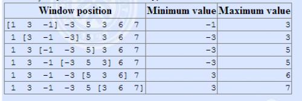

https://www.luogu.com.cn/training/201#problems

# 扫描

## 题目描述

有一个 $1 \times n$ 的矩阵，有 $n$ 个整数。

现在给你一个可以盖住连续 $k$ 个数的木板。

一开始木板盖住了矩阵的第 $1 \sim k$ 个数，每次将木板向右移动一个单位，直到右端与第 $n$ 个数重合。

每次移动前输出被覆盖住的数字中最大的数是多少。

## 输入格式

第一行两个整数 $n,k$，表示共有 $n$ 个数，木板可以盖住 $k$ 个数。

第二行 $n$ 个整数，表示矩阵中的元素。

## 输出格式

共 $n - k + 1$ 行，每行一个整数。

第 $i$ 行表示第 $i \sim i + k - 1$ 个数中最大值是多少。

## 样例 #1

### 样例输入 #1

```
5 3
1 5 3 4 2
```

### 样例输出 #1

```
5
5
4
```

## 提示

对于 $20\%$ 的数据，$1 \leq k \leq n \leq 10^3$。

对于 $50\%$ 的数据，$1 \leq k \leq n \leq 10^4$。

对于 $100\%$ 的数据，$1 \leq k \leq n \leq 2 \times 10^6$，矩阵中的元素大小不超过 $10^4$ 并且均为正整数。

```c++
#include<bits/stdc++.h>

using namespace std;
const int N = 2e6 + 10;
int n, k, a[N], q[N];

int main() {
    cin >> n >> k;
    for (int i = 0; i < n; ++i) scanf("%d", &a[i]);
    int hh = 0, tt = -1;
    for (int i = 0; i < n; ++i) {
        if (i - k + 1 > q[hh]) hh++;
        while (hh <= tt && a[q[tt]] < a[i]) tt--;
        q[++tt] = i;
        if (i >= k - 1) printf("%d\n", a[q[hh]]);
    }
    return 0;
} 
```


# 求m区间内的最小值

## 题目描述

一个含有 $n$ 项的数列，求出每一项前的 $m$ 个数到它这个区间内的最小值。若前面的数不足 $m$ 项则从第 $1$ 个数开始，若前面没有数则输出 $0$。

## 输入格式

第一行两个整数，分别表示 $n$，$m$。

第二行，$n$ 个正整数，为所给定的数列 $a_i$。

## 输出格式

$n$ 行，每行一个整数，第 $i$ 个数为序列中 $a_i$ 之前 $m$ 个数的最小值。

## 样例 #1

### 样例输入 #1

```
6 2
7 8 1 4 3 2
```

### 样例输出 #1

```
0
7
7
1
1
3
```

## 提示

对于 $100\%$ 的数据，保证 $1\le m\le n\le2\times10^6$，$1\le a_i\le3\times10^7$。

```c++
#include<bits/stdc++.h>

using namespace std;
const int N = 2e6 + 10;
int n, m, a[N], q[N];

int main() {
    cin >> n >> m;
    for (int i = 1; i <= n; ++i) scanf("%d", &a[i]);
    cout << 0 << endl;
    int hh = 0, tt = -1;
    q[0] = 1;
    for (int i = 1; i < n; ++i) {
        if (i - m + 1 > q[hh]) hh++;
        while (hh <= tt && a[q[tt]] >= a[i]) --tt;
        q[++tt] = i;
        printf("%d\n", a[q[hh]]);
    }
    return 0;
}
```


# 滑动窗口 /【模板】单调队列

## 题目描述

有一个长为 $n$ 的序列 $a$，以及一个大小为 $k$ 的窗口。现在这个从左边开始向右滑动，每次滑动一个单位，求出每次滑动后窗口中的最大值和最小值。

例如：

The array is $[1,3,-1,-3,5,3,6,7]$, and $k = 3$。



## 输入格式

输入一共有两行，第一行有两个正整数 $n,k$。
第二行 $n$ 个整数，表示序列 $a$

## 输出格式

输出共两行，第一行为每次窗口滑动的最小值   
第二行为每次窗口滑动的最大值

## 样例 #1

### 样例输入 #1

```
8 3
1 3 -1 -3 5 3 6 7
```

### 样例输出 #1

```
-1 -3 -3 -3 3 3
3 3 5 5 6 7
```

## 提示

【数据范围】    
对于 $50\%$ 的数据，$1 \le n \le 10^5$；  
对于 $100\%$ 的数据，$1\le k \le n \le 10^6$，$a_i \in [-2^{31},2^{31})$。

```c++
#include<bits/stdc++.h>

using namespace std;
const int N = 2e6 + 10;
int n, k, a[N], q[N];

int main() {
    cin >> n >> k;
    for (int i = 0; i < n; ++i) scanf("%d", &a[i]);
    int hh = 0, tt = -1;
    for (int i = 0; i < n; ++i) {
        if (i - k + 1 > q[hh]) hh++;
        while (hh <= tt && a[q[tt]] > a[i]) tt--;
        q[++tt] = i;
        if (i >= k - 1) printf("%d ", a[q[hh]]);
    }
    cout << endl;
    hh = 0, tt = -1;
    for (int i = 0; i < n; ++i) {
        if (i - k + 1 > q[hh]) hh++;
        while (hh <= tt && a[q[tt]] < a[i]) tt--;
        q[++tt] = i;
        if (i >= k - 1) printf("%d ", a[q[hh]]);
    }
    return 0;
} 
```


# [USACO16OPEN] Diamond Collector S

## 题目描述

Bessie the cow, always a fan of shiny objects, has taken up a hobby of mining diamonds in her spare time!  She has collected $N$ diamonds ($N \leq 50,000$) of varying sizes, and she wants to arrange some of them in a pair of  display cases in the barn.


Since Bessie wants the diamonds in each of the two cases to be relatively similar in  size, she decides that she will not include two diamonds in the same case if their sizes differ by more than $K$ (two diamonds can be displayed together in the same case if their sizes differ by exactly $K$).  Given $K$, please help Bessie determine the maximum number of diamonds she can display in both cases together.

奶牛Bessie很喜欢闪亮亮的东西（Baling~Baling~），所以她喜欢在她的空余时间开采钻石！她现在已经收集了N颗不同大小的钻石（N<=50,000），现在她想在谷仓的两个陈列架上摆放一些钻石。

Bessie想让这些陈列架上的钻石保持相似的大小，所以她不会把两个大小相差K以上的钻石同时放在一个陈列架上（如果两颗钻石的大小差值为K，那么它们可以同时放在一个陈列架上）。现在给出K，请你帮Bessie确定她最多一共可以放多少颗钻石在这两个陈列架上。

## 输入格式

The first line of the input file contains $N$ and $K$ ($0 \leq K \leq 1,000,000,000$).

The next $N$ lines each contain an integer giving the size of one of the

diamonds.  All sizes will be positive and will not exceed $1,000,000,000$.

## 输出格式

Output a single positive integer, telling the maximum number of diamonds that

Bessie can showcase in total in both the cases.

## 样例 #1

### 样例输入 #1

```
7 3
10
5
1
12
9
5
14
```

### 样例输出 #1

```
5
```

```c++
#include <bits/stdc++.h>

using namespace std;
const int N = 5e4 + 10;
int n, a[N], k, l[N], r[N];// l[i] 坐标到 i 的个数  r[i] 右边到 i+1 的个数

int main() {
    cin >> n >> k;
    for (int i = 0; i < n; ++i) scanf("%d", &a[i]);
    sort(a, a + n);
    l[0] = 1;
    for (int i = 1, j = 0; i <= n - 1; ++i) {
        while (a[i] - a[j] > k) j++;
        l[i] = max(l[i - 1], i - j + 1);
    }
    for (int i = n - 1, j = n - 1; i > 0; i--) {
        while (a[j] - a[i] > k) j--;
        r[i - 1] = max(r[i], j - i + 1);
    }
    int ans = 0;
    for (int i = 0; i < n; ++i) ans = max(ans, l[i] + r[i]);
    cout << ans;
    return 0;
}
```


# 逛画展

## 题目描述

博览馆正在展出由世上最佳的 $m$ 位画家所画的图画。

游客在购买门票时必须说明两个数字，$a$ 和 $b$，代表他要看展览中的第 $a$ 幅至第 $b$ 幅画（包含 $a,b$）之间的所有图画，而门票的价钱就是一张图画一元。

Sept 希望入场后可以看到所有名师的图画。当然，他想最小化购买门票的价格。

请求出他购买门票时应选择的 $a,b$，数据保证一定有解。

若存在多组解，**输出 $a$ 最小的那组**。

## 输入格式

第一行两个整数 $n,m$，分别表示博览馆内的图画总数及这些图画是由多少位名师的画所绘画的。

第二行包含 $n$ 个整数 $a_i$，代表画第 $i$ 幅画的名师的编号。

## 输出格式

一行两个整数 $a,b$。

## 样例 #1

### 样例输入 #1

```
12 5
2 5 3 1 3 2 4 1 1 5 4 3
```

### 样例输出 #1

```
2 7
```

## 提示

#### 数据规模与约定

- 对于 $30\%$ 的数据，有 $n\le200$，$m\le20$。
- 对于 $60\%$ 的数据，有 $n\le10^5$，$m\le10^3$。
- 对于 $100\%$ 的数据，有 $1\leq n\le10^6$，$1 \leq a_i \leq m\le2\times10^3$。

```c++
#include <bits/stdc++.h>

using namespace std;
const int N = 1e6 + 10, M = 2e3 + 10;
int n, m, a[N], st[M], cnt;

int main() {
    cin >> n >> m;
    for (int i = 1; i <= n; ++i) scanf("%d", &a[i]);
    int minn = 2e9, sx = 0, sy = 0;
    for (int i = 1, j = 1; i <= n; ++i) {
        if (st[a[i]] == 0) cnt++;
        st[a[i]]++;
        if (cnt == m) {
            while (st[a[j]] > 1) {
                st[a[j]]--;
                j++;
            }
            if (minn > i - j + 1) {
                sx = j;
                sy = i;
                minn = i - j + 1;
            }
        }
    }
    cout << sx << " " << sy;
    return 0;
} 
```


# A-B 数对

## 题目背景

出题是一件痛苦的事情！

相同的题目看多了也会有审美疲劳，于是我舍弃了大家所熟悉的 A+B Problem，改用 A-B 了哈哈！

## 题目描述

给出一串正整数数列以及一个正整数 $C$，要求计算出所有满足 $A - B = C$ 的数对的个数（不同位置的数字一样的数对算不同的数对）。

## 输入格式

输入共两行。

第一行，两个正整数 $N,C$。

第二行，$N$ 个正整数，作为要求处理的那串数。

## 输出格式

一行，表示该串正整数中包含的满足 $A - B = C$ 的数对的个数。

## 样例 #1

### 样例输入 #1

```
4 1
1 1 2 3
```

### 样例输出 #1

```
3
```

## 提示

对于 $75\%$ 的数据，$1 \leq N \leq 2000$。

对于 $100\%$ 的数据，$1 \leq N \leq 2 \times 10^5$，$0 \leq a_i <2^{30}$,$1 \leq C < 2^{30}$。

2017/4/29 新添数据两组

```c++
#include<bits/stdc++.h>

using namespace std;
const int N = 2e5 + 10;
int n, a[N], c;
long long int res;

void tt(int x) {
    x = c + x;
    int l = 0, r = n - 1;
    while (l < r) {
        int mid = l + r >> 1;
        if (a[mid] >= x) r = mid;
        else l = mid + 1;
    }
    if (a[l] != x) return;
    int ll = l;
    l = 0, r = n - 1;
    while (l < r) {
        int mid = l + r + 1 >> 1;
        if (a[mid] <= x) l = mid;
        else r = mid - 1;
    }
    int rr = l;
    res += rr - ll + 1;
    return;
}

int main() {
    cin >> n >> c;
    for (int i = 0; i < n; ++i) scanf("%d", &a[i]);
    sort(a, a + n);
    for (int i = 0; i < n; ++i) tt(a[i]);
    cout << res;
}
```


# 寻找段落

## 题目描述

给定一个长度为 $n$ 的序列 $a$，定义 $a_i$ 为第 $i$ 个元素的价值。现在需要找出序列中最有价值的“段落”。段落的定义是长度在 $[S, T]$ 之间的连续序列。最有价值段落是指平均值最大的段落。

**段落的平均值** 等于 **段落总价值** 除以 **段落长度**。

## 输入格式

第一行一个整数 $n$，表示序列长度。

第二行两个整数 $S$ 和 $T$，表示段落长度的范围，在 $[S, T]$ 之间。

第三行到第 $n+2$ 行，每行一个整数表示每个元素的价值指数。

## 输出格式

一个实数，保留 $3$ 位小数，表示最优段落的平均值。

## 样例 #1

### 样例输入 #1

```
3
2 2
3
-1
2
```

### 样例输出 #1

```
1.000
```

## 提示

【数据范围】

对于 $30\%$ 的数据有 $n \le 1000$。

对于 $100\%$ 的数据有 $1 \le n \le 100000$，$1 \le S \le T \le n$，$-{10}^4 \le a_i \le {10}^4$。

【题目来源】

tinylic 改编

```c++
#include <bits/stdc++.h>

using namespace std;
const int N = 1e5 + 10;
int n, a[N], s, t;
double f[N];

bool check(double mid) {
    for (int i = 1; i <= n; ++i) f[i] = f[i - 1] + (double) a[i] - mid;
    int hh = 1, tt = 0, q[N];
    for (int i = s; i <= n; ++i) {
        while (hh <= tt && f[q[tt]] > f[i - s]) tt--;// 注意这里的下标 f[i - s + 1] 错
        q[++tt] = i - s;
        while (hh <= tt && q[hh] < i - t) hh++;// 注意这里的下标
        if (hh <= tt && f[i] - f[q[hh]] > 0) return true;
    }
    return false;
}

int main() {
    cin >> n >> s >> t;
    for (int i = 1; i <= n; ++i) scanf("%d", &a[i]);
    double l = -2e9, r = 2e9;
    while (r - l > 0.00001) {
        double mid = (l + r) / 2.0;
        if (check(mid)) l = mid;
        else r = mid;
    }
    printf("%.3lf", l);
    return 0;
}
```

首先看出答案满足单调性，可以二分答案，转化为判定性问题。

将`a`全部减去`mid`，问题转化为判断是否存在一个长度在`s~t`范围内的区间它的和为正，如果有说明还有更大的平均值。这点非常巧妙，<u>做前缀和时每个数都减掉平均值</u>。

用前缀和和单调队列维护。

然后用单调队列求出`sum[i]-min(sum[i-t]~sum[i-s])`，然后判断是否大于0即可。这一步将O(n^2^)变成O(n)，非常的巧妙呵呵。


核心代码：

```c++
bool can(double mid) {
    for (int i = 1; i <= n; i++)
        sum[i] = sum[i - 1] + double(a[i]) - mid;
    int head = 1, tail = 0, q[maxn];
    for (int i = s; i <= n; i++) {
        while (head <= tail && sum[q[tail]] > sum[i - s]) tail--;
        q[++tail] = i - s;
        while (head <= tail && q[head] < i - t) head++;
        if (head <= tail && sum[i] - sum[q[head]] >= 0) return 1;
    }
    return 0;
}
```


# [USACO07MAR]Face The Right Way G

## 题目描述

Farmer John has arranged his N (1 ≤ N ≤ 5,000) cows in a row and many of them are facing forward, like good cows. Some of them are facing backward, though, and he needs them all to face forward to make his life perfect.

Fortunately, FJ recently bought an automatic cow turning machine. Since he purchased the discount model, it must be irrevocably preset to turn K (1 ≤ K ≤ N) cows at once, and it can only turn cows that are all standing next to each other in line. Each time the machine is used, it reverses the facing direction of a contiguous group of K cows in the line (one cannot use it on fewer than K cows, e.g., at the either end of the line of cows). Each cow remains in the same \*location\* as before, but ends up facing the \*opposite direction\*. A cow that starts out facing forward will be turned backward by the machine and vice-versa.

Because FJ must pick a single, never-changing value of K, please help him determine the minimum value of K that minimizes the number of operations required by the machine to make all the cows face forward. Also determine M, the minimum number of machine operations required to get all the cows facing forward using that value of K.

$N$ 头牛排成一列 $1 \le N \le 5000$。每头牛或者向前或者向后。为了让所有牛都面向前方，农夫每次可以将 $K$ 头连续的牛转向 $1 \le K \le N$，求使操作次数最小的相应 $K$ 和最小的操作次数 $M$。$F$ 为朝前，$B$ 为朝后。

请在一行输出两个数字 $K$ 和 $M$，用空格分开。

## 输入格式

Line 1: A single integer: N


Lines 2..N+1: Line i+1 contains a single character, F or B, indicating whether cow i is facing forward or backward.

## 输出格式

Line 1: Two space-separated integers: K and M

## 样例 #1

### 样例输入 #1

```
7
B
B
F
B
F
B
B
```

### 样例输出 #1

```
3 3
```

## 提示

For K = 3, the machine must be operated three times: turn cows (1,2,3), (3,4,5), and finally (5,6,7)

```c++
#include <bits/stdc++.h>

using namespace std;
const int N = 5010;
int n, a[N], cha[N];

int main() {
    cin >> n;
    for (int i = 1; i <= n; ++i) {
        char s;
        cin >> s;
        if (s == 'F') a[i] = 1;
    }
    int ansk = 0, ansm = INT_MAX;
    for (int k = 1; k <= n; ++k) {
        int cnt = 0, now = 0;
        bool flag = true;
        memset(cha, 0, sizeof cha);
        for (int i = 1; i <= n; ++i) {
            now = now ^ cha[i];
            if (a[i] ^ now == 0) {
                // 需要转
                if (i + k - 1 > n) {
                    flag = false;
                    break;
                }
                cnt++;
                cha[i + k] ^= 1;
                now ^= 1;
            }
        }
        if (flag) {
            if (cnt < ansm) {
                ansk = k;
                ansm = cnt;
            }
        }
    }
    cout << ansk << " " << ansm;
    return 0;
}
```

因为同一个点翻转两次就与没有翻转的效果相同了，因此我们有一个贪心策略为：

从左到右对于出现的每一个`B`翻转一次从当前点开始的区间，就能保证是最优解。

**主要学习怎么用O(1)的时间进行差分操作**

**真是非常的巧妙！！！**

- `now`异或`0`还是`now`
- `now`异或`1`变成相反的值（1变成0、0变成1）

我们可以维护一个 `bool` 变量 `now` 来表示当前状态——是否翻转。易知翻转偶数次和不翻转是一样的，所以每次修改的时候只要异或上 `1` 就可以了。

当前的的串的值就是 `a[i]` 异或 `now`，如果是`0`则说明该位置需要翻转

> now就是用来判断当前是否需要反转的，now为0，则说明不需要翻转，now为1，说明需要翻转。
>
> 刚好一个数异或0还是它本身，一个数异或1就变成相反数
>
> 然后结合a[i]来判断当前位置是否需要翻转，如果不需要翻转就继续判断下一位。
>
> 如果当前位置需要翻转，则利用cha数组来更新i+k位置的翻转情况，同时now异或1，反转now的状态
>
> now会一直维持自身状态，直到当前位置需要翻转，或者遇到之前cha数组更新过的位置


# 连续自然数

## 题目描述

对一个给定的自然数$M$，求出所有的连续的自然数段（每一段至少有两个数），这些连续的自然数段中的全部数之和为$M$。

例子：$1998+1999+2000+2001+2002 = 10000$，所以从$1998$到$2002$的一个自然数段为$M=10000$的一个解。

## 输入格式

包含一个整数的单独一行给出M的值（$10 \le M \le 2,000,000$）。

## 输出格式

每行两个自然数，给出一个满足条件的连续自然数段中的第一个数和最后一个数，两数之间用一个空格隔开，所有输出行的第一个按从小到大的升序排列，对于给定的输入数据，保证至少有一个解。

## 样例 #1

### 样例输入 #1

```
10000
```

### 样例输出 #1

```
18 142 
297 328 
388 412 
1998 2002
```

```c++
#include<bits/stdc++.h>

using namespace std;
typedef long long int LL;
const int N = 1e6 + 10;
int m;
LL a[N];

int main() {
    cin >> m;
    for (int i = 1; i < N; i++) a[i] = i;
    for (int i = 1; i < N; i++) a[i] += a[i - 1];

    for (int i = 0, j = 1; j < N;) {
        if (j == i) {
            j++;
            continue;
        }
        if (a[j] - a[i - 1] == m) {
            cout << i << " " << j << endl;
            i++;
            j++;
        } else if (a[j] - a[i - 1] < m) ++j;
        else i++;
    }
    return 0;
} 
```


# [USACO17DEC]My Cow Ate My Homework S

## 题目描述

In your bovine history class, you have been given a rather long homework assignment with $N$ questions ($3 \leq N \leq 100,000$), each graded with an integer score in the range 0...10,000. As is often customary, your teacher plans to assign a final grade by discarding a question on which you received the lowest score and then averaging the remaining scores together. Unfortunately, your pet cow Bessie has just eaten your answers to the first $K$ questions! ($K$ could be as small as 1 or as large as $N-2$).

After copious explanation, your teacher finally believes your story, and agrees to grade the remaining non-eaten part of the assignment the same way as before -- by removing the lowest-scoring question (or one such question, in the event of a tie) and averaging the rest.


Please output all values of $K$ which would have earned you the maximum possible score according to this grading scheme, in sorted order.


在你的历史课上，你得到了一个很长的作业。这个作业包含了N个题目（3 ≤ N ≤ 100,000），每个题目的成绩在0~10,000之间。


按照惯例，你的老师按照以下方式计算最终成绩：去掉你最低的一个成绩，然后将其余成绩的平均成绩作为最终成绩。但不幸的是，你的宠物牛“贝西”刚刚吃了前K个题目的答案！（1 ≤ K ≤ N-2）


经过你的一番解释，老师终于相信了你的故事，并且同意对你有答案的题目（没有被吃掉答案的题目）像之前一样给分——通过去掉最低的成绩（如果有多个最低成绩，则只去掉其中一个）并取剩余成绩的平均成绩。


根据这一成绩计算方案，请按升序输出所有可以使你最终成绩最高的K的值。

## 输入格式

The first line of input contains $N$, and the next line contains the scores on the $N$ homework questions.

## 输出格式

Please output, one value per line, all values of $K$ which would have earned you the maximum possible score.

## 样例 #1

### 样例输入 #1

```
5
3 1 9 2 7
```

### 样例输出 #1

```
2
```

## 提示

If Bessie eats the first two questions, then the remaining scores are 9, 2, and 7. Removing the minimum and averaging, we get a final grade of 8, which is the highest possible.

```c++
#include <bits/stdc++.h>

using namespace std;
typedef pair<int, int> PII;
typedef long long int LL;
const int N = 1e5 + 10;
int n, s[N], minn[N];
stack<int> v;
PII final;

int main() {
    cin >> n;
    for (int i = 0; i <= n; ++i) minn[i] = 2e9 + 10;
    for (int i = n; i >= 1; --i) scanf("%d", &s[i]);
    for (int i = 1; i <= n; ++i) minn[i] = min(minn[i - 1], s[i]);
    for (int i = 1; i <= n; ++i) s[i] += s[i - 1];
    final = {s[n] - minn[n], n - 1};
    for (int i = 2; i <= n - 1; ++i) {
        if ((LL) (s[i] - minn[i]) * final.second > (LL) (i - 1) * final.first) {
            final = {s[i] - minn[i], i - 1};
            while (v.size()) v.pop();
            v.push(n - i);
        } else if ((LL) (s[i] - minn[i]) * final.second == (LL) (i - 1) * final.first) {
            v.push(n - i);
        }
    }
    while (v.size()) {
        printf("%d\n", v.top());
        v.pop();
    }
    return 0;
}
```

本题利用了倒序前缀和，既然前面的题不用考虑，自然要求出后面的所有题目的分数之和


仅需要考虑红色部分去除最小值之后的平均成绩，所以还需要维护一个`minn`数组，`minn[i]`表示从`i`到`n`中所有题目的最小得分。

题目中说**输出所有可以使你最终成绩最高的K的值**，也就是需要维护一个`final`作为最高成绩

- 出现和最高成绩一样的就把当前的`K`压栈
- 出现比当前最高成绩还高的成绩时，清空栈，把`K`压栈

同时为了避免浮点数的相关问题，故将除法转换为乘法，转化为乘法后要记得开`long long int`，避免溢出


# 火烧赤壁

## 题目背景

曹操平定北方以后，公元 208 年，率领大军南下，进攻刘表。他的人马还没有到荆州，刘表已经病死。他的儿子刘琮听到曹军声势浩大，吓破了胆，先派人求降了。

孙权任命周瑜为都督，拨给他三万水军，叫他同刘备协力抵抗曹操。

隆冬的十一月，天气突然回暖，刮起了东南风。

没想到东吴船队离开北岸大约二里距离，前面十条大船突然同时起火。火借风势，风助火威。十条火船，好比十条火龙一样，闯进曹军水寨。那里的船舰，都挤在一起，又躲不开，很快地都烧起来。一眨眼工夫，已经烧成一片火海。

曹操气急败坏的把你找来，要你钻入火海把连环线上着火的船只的长度统计出来！

## 题目描述

给定每个起火部分的起点和终点，请你求出燃烧位置的长度之和。

## 输入格式

第一行一个整数，表示起火的信息条数 $n$。  
接下来 $n$ 行，每行两个整数 $a, b$，表示一个着火位置的起点和终点（**注意：左闭右开**）。

## 输出格式

输出一行一个整数表示答案。

## 样例 #1

### 样例输入 #1

```
3
-1 1
5 11
2 9
```

### 样例输出 #1

```
11
```

## 提示

### 数据规模与约定

对于全部的测试点，保证 $1 \leq n \leq 2 \times 10^4$，$-2^{31} \leq a \leq  b \lt 2^{31}$，且答案小于 $2^{31}$。

```c++
#include<bits/stdc++.h>

using namespace std;
typedef long long int LL;
typedef pair<int, int> PII;
const int N = 2e4 + 10;
int n;
PII a[N], b[N];

bool cmp(PII a, PII b) {
    if (a.first == b.first) return a.second < b.second;
    return a.first < b.first;
}

int main() {
    cin >> n;
    for (int i = 0; i < n; i++) scanf("%d%d", &a[i].first, &a[i].second);
    sort(a, a + n, cmp);

    int k = 0;
    for (int i = 0; i < n; ++i) {
        int st = a[i].first;
        int ed = a[i].second;
        while (i + 1 < n && a[i + 1].first < ed) {
            ed = max(ed, a[i + 1].second);
            i++;
        }
        b[k++] = {st, ed};
    }
    int ans = 0;
    for (int i = 0; i < k; ++i) ans += b[i].second - b[i].first;
    cout << ans;
    return 0;
} 
```

**合并区间的一种方法**