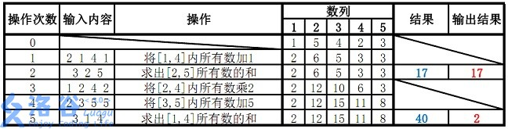
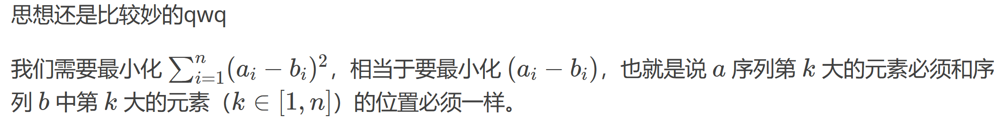

https://www.luogu.com.cn/training/206#problems

# 【模板】线段树 1

## 题目描述

如题，已知一个数列，你需要进行下面两种操作：

1. 将某区间每一个数加上 $k$。
2. 求出某区间每一个数的和。

## 输入格式

第一行包含两个整数 $n, m$，分别表示该数列数字的个数和操作的总个数。

第二行包含 $n$ 个用空格分隔的整数，其中第 $i$ 个数字表示数列第 $i$ 项的初始值。

接下来 $m$ 行每行包含 $3$ 或 $4$ 个整数，表示一个操作，具体如下：

1. `1 x y k`：将区间 $[x, y]$ 内每个数加上 $k$。
2. `2 x y`：输出区间 $[x, y]$ 内每个数的和。

## 输出格式

输出包含若干行整数，即为所有操作 2 的结果。

## 样例 #1

### 样例输入 #1

```
5 5
1 5 4 2 3
2 2 4
1 2 3 2
2 3 4
1 1 5 1
2 1 4
```

### 样例输出 #1

```
11
8
20
```

## 提示

对于 $30\%$ 的数据：$n \le 8$，$m \le 10$。  
对于 $70\%$ 的数据：$n \le {10}^3$，$m \le {10}^4$。  
对于 $100\%$ 的数据：$1 \le n, m \le {10}^5$。

保证任意时刻数列中所有元素的绝对值之和 $\le {10}^{18}$。

**【样例解释】**


```c++
#include <bits/stdc++.h>

#define lc p<<1
#define rc p<<1|1
using namespace std;
const int N = 2e5 + 10;

using LL = long long int;
int n, f;

LL w[N];
struct {
    int l, r;
    LL sum, add;
} tr[N * 4];

void pushup(int p) {
    tr[p].sum = tr[lc].sum + tr[rc].sum;
}

void pushdown(int p) {
    if (tr[p].add) {
        tr[lc].sum += (tr[lc].r - tr[lc].l + 1) * tr[p].add;
        tr[rc].sum += (tr[rc].r - tr[rc].l + 1) * tr[p].add;
        tr[lc].add += tr[p].add;
        tr[rc].add += tr[p].add;
        tr[p].add = 0;
    }
}

void build(int p, int l, int r) {
    tr[p] = {l, r, w[l], 0};
    if (l == r) return;
    int m = l + r >> 1;
    build(lc, l, m);
    build(rc, m + 1, r);
    pushup(p);
}

void update(int p, int x, int y, int k) {
    if (x <= tr[p].l && tr[p].r <= y) {
        tr[p].sum += k * (tr[p].r - tr[p].l + 1);
        tr[p].add += k;
        return;
    }
    int m = tr[p].l + tr[p].r >> 1;
    pushdown(p);
    if (x <= m)update(lc, x, y, k);
    if (y > m) update(rc, x, y, k);
    pushup(p);
}

LL query(int p, int x, int y) {
    if (x <= tr[p].l && tr[p].r <= y) {
        return tr[p].sum;
    }
    int m = tr[p].l + tr[p].r >> 1;
    pushdown(p);
    LL sum = 0;
    if (x <= m) sum += query(lc, x, y);
    if (y > m)sum += query(rc, x, y);
    return sum;
}

int main() {
    cin >> n >> f;
    for (int i = 1; i <= n; ++i) {
        cin >> w[i];
    }
    int a, b, c, d;
    build(1, 1, n);
    for (int i = 0; i < f; ++i) {
        cin >> a;
        if (a == 1) {
            cin >> b >> c >> d;
            update(1, b, c, d);
        } else {
            cin >> b >> c;
            cout << query(1, b, c) << endl;
        }
    }
    return 0;
}
```


> B站上讲得非常好的一个视频：
>
> https://www.bilibili.com/video/BV1G34y1L7b3/?spm_id_from=333.337.search-card.all.click&vd_source=11579445a367b6624c1d123aa6f75a37
>
> 同时也推荐这个UP主（董晓算法），所有视频都非常通透，详略得当，强烈推荐！
>
> UP主页：
>
> https://space.bilibili.com/517494241


# 【模板】线段树 2

## 题目描述

如题，已知一个数列，你需要进行下面三种操作：

- 将某区间每一个数乘上 $x$

- 将某区间每一个数加上 $x$

- 求出某区间每一个数的和

## 输入格式

第一行包含三个整数 $n,m,p$，分别表示该数列数字的个数、操作的总个数和模数。

第二行包含 $n$ 个用空格分隔的整数，其中第 $i$ 个数字表示数列第 $i$ 项的初始值。

接下来 $m$ 行每行包含若干个整数，表示一个操作，具体如下：

操作 $1$： 格式：`1 x y k`  含义：将区间 $[x,y]$ 内每个数乘上 $k$

操作 $2$： 格式：`2 x y k`  含义：将区间 $[x,y]$ 内每个数加上 $k$

操作 $3$： 格式：`3 x y`  含义：输出区间 $[x,y]$ 内每个数的和对 $p$ 取模所得的结果

## 输出格式

输出包含若干行整数，即为所有操作 $3$ 的结果。

## 样例 #1

### 样例输入 #1

```
5 5 38
1 5 4 2 3
2 1 4 1
3 2 5
1 2 4 2
2 3 5 5
3 1 4
```

### 样例输出 #1

```
17
2
```

## 提示

【数据范围】

对于 $30\%$ 的数据：$n \le 8$，$m \le 10$   
对于 $70\%$ 的数据：$n \le 10^3 $，$ m \le 10^4$   
对于 $100\%$ 的数据：$ n \le 10^5$，$ m \le 10^5$

除样例外，$p = 571373$

（数据已经过加强）


样例说明：

  

故输出应为 $17$、$2$（ $40 \bmod 38 = 2$ ）

```c++
#include <bits/stdc++.h>

using namespace std;
const int N = 1e5 + 10;
typedef long long int LL;
int n, m, w[N], p;
struct node {
    int l, r;
    LL sum, add, mul;
} tr[N * 4];

void pushup(int u) {
    tr[u].sum = (tr[u << 1].sum + tr[u << 1 | 1].sum) % p;
}

void build(int u, int l, int r) {
    if (l == r) {
        tr[u] = {l, r, w[l], 0, 1};
        return;
    }
    tr[u] = {l, r, 0, 0, 1};
    int mid = tr[u].l + tr[u].r >> 1;
    if (l <= mid) build(u << 1, l, mid);
    if (r >= mid + 1) build(u << 1 | 1, mid + 1, r);
    pushup(u);
}

void pushdown(int u) {
    tr[u << 1].sum = (tr[u << 1].sum * tr[u].mul + (tr[u << 1].r - tr[u << 1].l + 1) * tr[u].add) % p;
    tr[u << 1].add = (tr[u << 1].add * tr[u].mul + tr[u].add) % p;
    tr[u << 1].mul = (tr[u << 1].mul * tr[u].mul) % p;
    tr[u << 1 | 1].sum = (tr[u << 1 | 1].sum * tr[u].mul + (tr[u << 1 | 1].r - tr[u << 1 | 1].l + 1) * tr[u].add) % p;
    tr[u << 1 | 1].add = (tr[u << 1 | 1].add * tr[u].mul + tr[u].add) % p;
    tr[u << 1 | 1].mul = (tr[u << 1 | 1].mul * tr[u].mul) % p;
    tr[u].add = 0;
    tr[u].mul = 1;
}

LL query(int u, int l, int r) {
    if (l <= tr[u].l && tr[u].r <= r) return tr[u].sum % p;
    int mid = tr[u].l + tr[u].r >> 1;
    pushdown(u);
    LL res = 0;
    if (l <= mid) res += query(u << 1, l, r);
    if (r >= mid + 1) res += query(u << 1 | 1, l, r);
    return res % p;
}

// *
void modify1(int u, int x, int y, int v) {
    if (x <= tr[u].l && tr[u].r <= y) {
        tr[u].sum = tr[u].sum * v % p;
        tr[u].mul = tr[u].mul * v % p;
        tr[u].add = tr[u].add * v % p;
        return;
    }
    pushdown(u);
    int mid = tr[u].l + tr[u].r >> 1;
    if (x <= mid) modify1(u << 1, x, y, v);
    if (y >= mid + 1) modify1(u << 1 | 1, x, y, v);
    pushup(u);
}

// +
void modify2(int u, int x, int y, int v) {
    if (x <= tr[u].l && tr[u].r <= y) {
        tr[u].sum = ((tr[u].r - tr[u].l + 1) * v + tr[u].sum) % p;
        tr[u].add = (tr[u].add + v) % p;
        return;
    }
    pushdown(u);
    int mid = tr[u].l + tr[u].r >> 1;
    if (x <= mid) modify2(u << 1, x, y, v);
    if (y >= mid + 1) modify2(u << 1 | 1, x, y, v);
    pushup(u);
}

int main() {
    cin >> n >> m >> p;
    for (int i = 1; i <= n; ++i) scanf("%d", &w[i]);
    build(1, 1, n);
    int a, b, k, op;
    while (m--) {
        scanf("%d%d%d", &op, &a, &b);
        if (op == 1) {
            scanf("%d", &k);
            modify1(1, a, b, k);
        } else if (op == 2) {
            scanf("%d", &k);
            modify2(1, a, b, k);
        } else {
            printf("%lld\n", query(1, a, b));
        }
    }
    return 0;
}
```

**导语**：本题主要是学习如何维护两个`lazytag`，如何确定两个`lazytag`的顺序


作为一道模板题这题太虐心了，然而不得不承认确实在做完之后对于线段树掌握的深入了很多。

首先先说明本题的思路。题目要求有三种操作，两种是不同的在线修改，还有一种是在查询取模后的结果。而这两种操作又是区间乘法和区间加法，我们可以惊喜的发现这两种操作对于取模运算来说都是自由的！但是面对非常大的数据，我们必须思考怎么样用线段树优雅的跑过这道题目。

面对这两种操作，可以联想到线段树的一个非常好的功能就是`lazytag`，只计算出确实需要访问的区间的真实值，其他的保存在`lazytag`里面，这样可以近似O(NlogN)的运行起来。在尝试着写了只有一个`lazetag`的程序之后我们发现一个`lazytag`是不能够解决问题的，那就上两个，分别表示乘法意义上的`lazytag`和加法意义上的`lazytag`。紧接着想到`pushdown`操作之后我们又发现必须在向下传递`lazytag`的时候人为地为这两个`lazytag`规定一个先后顺序，排列组合一下只有两种情况：

- 加法优先。问题是这样的话非常不容易进行更新操作，假如改变一下`add`的数值，`mul`也要联动变成奇奇怪怪的分数小数损失精度，我们内心是很拒绝的。
- 乘法优先。这样的话假如改变`add`的数值就只改变`add`，改变`mul`的时候把`add`也对应的乘一下就可以了，没有精度损失，看起来很不错。

**所谓先乘后加就是在做乘法的时候把加法的`lazytag`也就是`add`也乘上这个数，在后面做加法的时候直接加就行了。**

> 题解区的一个评论：
>
> 其实可以这么理解,这里的`add`记录着的是父亲进行所有操作后对儿子产生的需要进行加法的贡献（不需要进行乘法操作），`mul`记录的是儿子需要进行乘法的贡献,这样先乘后加就很容易理解了    


# [TJOI2018]数学计算

## 题目描述

小豆现在有一个数 $x$，初始值为 $1$。小豆有 $Q$ 次操作，操作有两种类型：

`1 m`：将 $x$ 变为 $x \times m$，并输出 $x \bmod M$

`2 pos`：将 $x$ 变为 $x$ 除以第 $pos$ 次操作所乘的数（保证第 $pos$ 次操作一定为类型 1，对于每一个类型 1 的操作至多会被除一次），并输出 $x \bmod M$。

## 输入格式

一共有  $t$ 组输入。

对于每一组输入，第一行是两个数字 $Q,M$。

接下来 $Q$ 行，每一行为操作类型 $op$，操作编号或所乘的数字 $m$（保证所有的输入都是合法的）。

## 输出格式

对于每一个操作，输出一行，包含操作执行后的 $x \bmod M$ 的值。

## 样例 #1

### 样例输入 #1

```
1
10 1000000000
1 2
2 1
1 2
1 10
2 3
2 4
1 6
1 7
1 12
2 7
```

### 样例输出 #1

```
2
1
2
20
10
1
6
42
504
84
```

## 提示

对于 $20\%$ 的数据，$1 \le Q \le 500$。

对于 $100\%$ 的数据，$1 \le Q \le 10^5$，$t \le 5, M \le 10^9$，$0 < m \leq 10^9$。

```c++
#include<bits/stdc++.h>

using namespace std;
typedef long long int LL;
const int N = 1e5 + 10;
int M, Q;
struct node {
    int l, r;
    LL sum;
} tr[N * 4];

void pushup(int u) {
    tr[u].sum = tr[u << 1].sum * tr[u << 1 | 1].sum % M;
}

void build(int u, int l, int r) {
    tr[u] = {l, r, 1};
    if (l == r) return;
    else {
        int mid = tr[u].l + tr[u].r >> 1;
        if (l <= mid) build(u << 1, l, mid);
        if (r >= mid + 1) build(u << 1 | 1, mid + 1, r);
    }
}

void modify(int u, int x, int v) {
    if (x == tr[u].l && tr[u].l == tr[u].r) tr[u].sum = v;
    else {
        int mid = tr[u].l + tr[u].r >> 1;
        if (x <= mid) modify(u << 1, x, v);
        else modify(u << 1 | 1, x, v);
        pushup(u);
    }
}

void solve() {
    cin >> Q >> M;
    memset(tr, 0, sizeof tr);
    build(1, 1, Q);
    int op, t;
    for (int i = 1; i <= Q; ++i) {
        scanf("%d%d", &op, &t);
        if (op == 1) modify(1, i, t);
        else modify(1, t, 1);
        printf("%lld\n", tr[1].sum);
    }
}

int main() {
    int t;
    cin >> t;
    while (t--) solve();
    return 0;
}
```

直接模拟会因为爆 `long long` 的问题导致代码非常复杂，甚至无法编写。

考虑强大的数据结构——线段树。需要建空树，然后操作时向后插入的操作。操作 2 可以看做是把第 `t` 次的乘数改为 1。**每个非叶子节点的值为其左右儿子的值的乘积对 mod 取模的值**。

> 我第一次看这道题，没看出来线段树（没区间没修改没线段……）
>
> 直到看了题解：
>
> 题目有两个操作，一个是乘一个值，另一个是除之前乘的某个值。转化一下，操作的目的为：改变一个值，查找之前的值。
>
> 可以将数据按时间排序，建线段树，维护区间乘。这样的话根节点就是到现在为止的所有数的乘积。
>
> 那么第一个操作就是将当前时间的值设为m。
>
> 第二个操作是去除某次乘的值，根据乘除逆运算的关系，除一个值就是将那个值置1，可以说是穿越到了从前，防止了乘法运算。
>
> 那么第二个操作就是将pos时的值置为1。
>
> 明确了操作，还有一些细节。 多组数据，所以线段树不要忘记初始化。 乘法运算，线段树初值设为1。 不要忘记mod运算。
>
> 线段树题目：
>
> [统计和：简化版的模板1](https://www.luogu.org/problemnew/show/P2068)
>
> [忠诚：模板1难度经典题](https://www.luogu.org/problemnew/show/P1816)
>
> [XOR的艺术：模板1的变种](https://www.luogu.org/problemnew/show/P2574)
>
> [最大数：模板1的变种](https://www.luogu.org/problemnew/show/P1198)
>
> [光开关：XOR艺术的双倍经验](https://www.luogu.org/problemnew/show/P2846)
>
> [开关：XOR艺术的三倍经验](https://www.luogu.org/problemnew/show/P3870)
>
> [维护序列：模板2的双倍经验](https://www.luogu.org/problemnew/show/P2023)
>
> [方差：线段树+数学，模板1变种](https://www.luogu.org/problemnew/show/P1471)
>
> [数学计算：模板1简化，思维](https://www.luogu.org/problemnew/show/P4588)
>
> [Glass Carving：模板1困难](https://www.luogu.org/problemnew/show/CF527C)
>
> [酒店hotel：Glass的困难版](https://www.luogu.org/problemnew/show/P2894)


# 楼房重建

## 题目描述

小 A 的楼房外有一大片施工工地，工地上有 $N$ 栋待建的楼房。每天，这片工地上的房子拆了又建、建了又拆。他经常无聊地看着窗外发呆，数自己能够看到多少栋房子。

为了简化问题，我们考虑这些事件发生在一个二维平面上。小 A 在平面上 $(0,0)$ 点的位置，第 $i$ 栋楼房可以用一条连接 $(i,0)$ 和 $(i,H_i)$ 的线段表示，其中 $H_i$ 为第 $i$ 栋楼房的高度。如果这栋楼房上任何一个高度大于 $0$ 的点与 $(0,0)$ 的连线没有与之前的线段相交，那么这栋楼房就被认为是可见的。

施工队的建造总共进行了 $M$ 天。初始时，所有楼房都还没有开始建造，它们的高度均为 $0$。在第 $i$ 天，建筑队将会将横坐标为 $X_i$ 的房屋的高度变为 $Y_i$（高度可以比原来大—修建，也可以比原来小—拆除，甚至可以保持不变—建筑队这天什么事也没做）。请你帮小 A 数数每天在建筑队完工之后，他能看到多少栋楼房？

## 输入格式

第一行两个正整数 $N,M$。

接下来 $M$ 行，每行两个正整数 $X_i,Y_i$。

## 输出格式

$M$ 行，第 $i$ 行一个整数表示第 $i$ 天过后小 A 能看到的楼房有多少栋。

## 样例 #1

### 样例输入 #1

```
3 4
2 4
3 6
1 1000000000
1 1
```

### 样例输出 #1

```
1
1
1
2
```

## 提示

对于 $100\%$ 的数据，$1 \le X_i \le N$，$1 \le Y_i \le 10^9$，$1\le N,M \le 10^5$。

```c++
#include<bits/stdc++.h>

using namespace std;
const int N = 1e5 + 10;
int n, m;
struct node {
    int l, r, cnt;
    double maxx;
} tr[N * 4];

void build(int u, int l, int r) {
    tr[u] = {l, r};
    if (l == r) return;
    int mid = tr[u].l + tr[u].r >> 1;
    if (l <= mid) build(u << 1, l, mid);
    if (r >= mid + 1) build(u << 1 | 1, mid + 1, r);
}

int query(int u, double maxx) {
    if (tr[u].maxx < maxx) return 0;
    if (tr[u].l == tr[u].r) return tr[u].maxx > maxx;
    if (tr[u << 1].maxx > maxx) return query(u << 1, maxx) + tr[u].cnt - tr[u << 1].cnt;
    if (tr[u << 1].maxx <= maxx) return query(u << 1 | 1, maxx);
}

void modify(int u, int x, int y) {
    if (tr[u].l == tr[u].r) {
        tr[u].maxx = y * 1.0 / x;
        tr[u].cnt = 1;
        return;
    }
    int mid = tr[u].l + tr[u].r >> 1;
    if (x <= mid) modify(u << 1, x, y);
    else modify(u << 1 | 1, x, y);
    tr[u].maxx = max(tr[u << 1].maxx, tr[u << 1 | 1].maxx);
    tr[u].cnt = tr[u << 1].cnt + query(u << 1 | 1, tr[u << 1].maxx);
}

int main() {
    cin >> n >> m;
    int x, y;
    build(1, 1, n);
    for (int i = 1; i <= m; ++i) {
        scanf("%d%d", &x, &y);
        modify(1, x, y);
        printf("%d\n", tr[1].cnt);
    }
    return 0;
} 
```

显然可以想到进行斜率处理，通过斜率的单调递增来求出`cnt`

因为区间是固定的，并且发现一个区间内的答案可以通过两个子区间用某种方式进行转移。所以可以考虑到线段树做法。

线段树中只需要维护两个值，一个是区间最大值，还有一个是区间可见的楼房数量`cnt`的值。`cnt`表示站在当前区间左端点可以看到的楼房数量。

建树，修改，甚至不用pushdown，一切好说。但是发现pushup不好处理，显然两个子区间的值不能直接合并。必须满足一定关系。

可以发现，区间内的第一项一定在这个序列内，区间最大值也一定在这个序列内。

对于要被`pushup`的区间，它的两个子区间已经处理好了，容易知道，左儿子区间内可见的楼房一定都在这个大区间内可见。（因为前面形态固定，又不能选择不看到）所以**只需要处理右儿子区间和左儿子区间最大值的关系**，即可递归处理`cnt`值。

**具体观察代码中的`query`函数！**

- 如果整个区间的最大值小于传入的最大值，那么直接返回0
- 如果区间是一个点，那么直接判断该点楼房是否大于传入的最大值，如果是则返回1，反之返回0
- 如果区间的左子区间的最大值大于传入的最大值，说明该区间的右区间可见的楼房都可以在整个范围内被看到，要加入答案。但是这里注意，并不是返回`tr[u<<1|1].cnt`而是返回`tr[u].cnt-tr[u<<1].cnt`，这两者表示的意思是不一样的。前者表示的是在右子区间内看见的部分，后者表示的是在当前区间内，右子区间可见的部分，意义完全不同。
- 如果区间的左子区间的最大值小于等于传入的最大值，那么直接递归当前区间的右子区间，并返回。


# XOR的艺术

## 题目描述

AKN 觉得第一题太水了，不屑于写第一题，所以他又玩起了新的游戏。在游戏中，他发现，这个游戏的伤害计算有一个规律，规律如下

1. 拥有一个伤害串，是一个长度为 $n$ 的只含字符 ``0`` 和字符 ``1`` 的字符串。规定这个字符串的首字符是第一个字符，即下标从 $1$ 开始。

2. 给定一个范围 $[l,~r]$，伤害为伤害串的这个范围内中字符 ``1`` 的个数

3. 会修改伤害串中的数值，修改的方法是把 $[l,~r]$ 中所有原来的字符 ``0`` 变成 ``1``，将 ``1`` 变成 ``0``。

AKN 想知道一些时刻的伤害，请你帮助他求出这个伤害。

## 输入格式

输入的第一行有两个用空格隔开的整数，分别表示伤害串的长度 $n$，和操作的个数 $m$。

输入第二行是一个长度为 $n$ 的字符串 $S$，代表伤害串。

第 $3$ 到第 $(m + 2)$ 行，每行有三个用空格隔开的整数 $op, l, r$。代表第 $i$ 次操作的方式和区间，规则是：

- 若 $op = 0$，则表示将伤害串的 $[l,~r]$ 区间内的 ``0`` 变成 ``1``，``1`` 变成 ``0``。
- 若 $op = 1$，则表示询问伤害串的 $[l,~r]$ 区间内有多少个字符 ``1``。

## 输出格式

对于每次询问，输出一行一个整数，代表区间内 ``1`` 的个数。

## 样例 #1

### 样例输入 #1

```
10 6
1011101001
0 2 4
1 1 5
0 3 7
1 1 10
0 1 4
1 2 6
```

### 样例输出 #1

```
3
6
1
```

## 提示

#### 样例输入输出 $1$ 解释

原伤害串为 ``1011101001``。

对于第一次操作，改变 $[2,~4]$ 的字符，伤害串变为 ``1100101001``。

对于第二次操作，查询 $[1,~5]$ 内 ``1`` 的个数，共有 $3$ 个。

对于第三次操作，改变 $[3,~7]$ 的字符，伤害串变为 ``1111010001``。

对于第四次操作，查询 $[1,~10]$ 内 ``1`` 的个数，共有 $6$ 个。

对于第五次操作，改变 $[1,~4]$ 的字符，伤害串变为 ``0000010001``。

对于第六次操作，查询 $[2,~6]$ 内 ``1`` 的个数，共有 $1$ 个。

#### 数据范围与约定

对于 $10\%$ 的数据，保证 $n, m \leq 10$。

另有 $30\%$ 的数据，保证 $n, m \leq 2 \times 10^3$。

对于 $100\%$ 的数据，保证 $2 \leq n, m \leq 2 \times 10^5$，$0 \leq op \leq 1$，$1 \leq l \leq r \leq n$，$S$ 中只含字符 ``0`` 和字符 ``1``。

```c++
#include<bits/stdc++.h>

using namespace std;
typedef long long int LL;
const int N = 2e5 + 10;
int n, m;
struct node {
    int l, r;
    int sum;
    bool add;// 是否需要往下继续异或
} tr[N * 4];

void build(int u, int l, int r) {
    tr[u] = {l, r};
    if (l == r) return;
    int mid = tr[u].l + tr[u].r >> 1;
    if (l <= mid) build(u << 1, l, mid);
    if (r >= mid + 1) build(u << 1 | 1, mid + 1, r);
}

void pushup(int u) {
    tr[u].sum = tr[u << 1].sum + tr[u << 1 | 1].sum;
}

void pushdown(int u) {
    if (tr[u].add) {
        tr[u << 1].sum = tr[u << 1].r - tr[u << 1].l + 1 - tr[u << 1].sum;
        if (tr[u << 1].add) tr[u << 1].add = false;
        else tr[u << 1].add = true;
        tr[u << 1 | 1].sum = tr[u << 1 | 1].r - tr[u << 1 | 1].l + 1 - tr[u << 1 | 1].sum;
        if (tr[u << 1 | 1].add) tr[u << 1 | 1].add = false;
        else tr[u << 1 | 1].add = true;
        tr[u].add = false;
    }
}

void modify(int u, int x, int y) {
    if (x <= tr[u].l && tr[u].r <= y) {
        tr[u].sum = tr[u].r - tr[u].l + 1 - tr[u].sum;
        if (tr[u].add) tr[u].add = false;
        else tr[u].add = true;
    } else {
        pushdown(u);
        int mid = tr[u].l + tr[u].r >> 1;
        if (x <= mid) modify(u << 1, x, y);
        if (y >= mid + 1) modify(u << 1 | 1, x, y);
        pushup(u);
    }
}

int query(int u, int l, int r) {
    if (l <= tr[u].l && tr[u].r <= r) {
        return tr[u].sum;
    }
    pushdown(u);
    int mid = tr[u].l + tr[u].r >> 1;
    int res = 0;
    if (l <= mid) res += query(u << 1, l, r);
    if (r >= mid + 1) res += query(u << 1 | 1, l, r);
    return res;
}

int main() {
    cin >> n >> m;
    build(1, 1, n);
    string s;
    cin >> s;
    for (int i = 0; i < n; ++i) {
        if (s[i] == '1') {
            modify(1, i + 1, i + 1);
        }
    }
    int op, x, y;
    while (m--) {
        scanf("%d%d%d", &op, &x, &y);
        if (op) printf("%d\n", query(1, x, y));
        else modify(1, x, y);
    }
    return 0;
}
```

首先，由于是区间修改和区间查询，并且数据范围还这么大，所以需要使用线段树来维护。 读入的数都是0或1且修改操作为异或1的话，那么`lazytag`和线段树的维护就很好想了。

**因为`0^1=1`，`1^1=0`，所以本题如果对同一个区间连续异或1两次，得到的结果和没有异或是一样的。**

**如果对于一段区间，长度为len，有n个1，那么就有len-n个0。相应地，对这段区间异或1之后，它的1的个数就变成了len-n。**

**关于`lazytag`的更新**：原本在每次更新时光关注该如何更新当前线段的`sum`，而忽略了正确更新`lazytag`的方式——每次更新`lazytag`前，应该判断`lazytag`是否为真，如果是真，则更新为假，如果是假，则更新为真。第一次写代码时，每次更新`lazytag`都直接赋了`true`，这导致了严重的错误。

更新`lazytag`的位置：

- `pushdown`函数
- `modify`函数内部直接更新当前线段


# 【模板】树状数组 1

## 题目描述

如题，已知一个数列，你需要进行下面两种操作：

- 将某一个数加上 $x$

- 求出某区间每一个数的和

## 输入格式

第一行包含两个正整数 $n,m$，分别表示该数列数字的个数和操作的总个数。   

第二行包含 $n$ 个用空格分隔的整数，其中第 $i$ 个数字表示数列第 $i$ 项的初始值。

接下来 $m$ 行每行包含 $3$ 个整数，表示一个操作，具体如下：

- `1 x k`  含义：将第 $x$ 个数加上 $k$

- `2 x y`  含义：输出区间 $[x,y]$ 内每个数的和

## 输出格式

输出包含若干行整数，即为所有操作 $2$ 的结果。

## 样例 #1

### 样例输入 #1

```
5 5
1 5 4 2 3
1 1 3
2 2 5
1 3 -1
1 4 2
2 1 4
```

### 样例输出 #1

```
14
16
```

## 提示

【数据范围】

对于 $30\%$ 的数据，$1 \le n \le 8$，$1\le m \le 10$；   
对于 $70\%$ 的数据，$1\le n,m \le 10^4$；   
对于 $100\%$ 的数据，$1\le n,m \le 5\times 10^5$。

数据保证对于任意时刻，$a$ 的任意子区间（包括长度为 $1$ 和 $n$ 的子区间）和均在 $[-2^{31}, 2^{31})$ 范围内。


样例说明：

  

故输出结果14、16

```c++
#include<bits/stdc++.h>

using namespace std;
const int N = 5e5 + 10;

int n, m, tr[N];

int lowbit(int x) {
    return x & -x;
}

void add(int x, int y) {
    for (int i = x; i <= n; i += lowbit(i)) tr[i] += y;
}

int query(int x) {
    int res = 0;
    for (int i = x; i; i -= lowbit(i)) res += tr[i];
    return res;
}

int main() {
    cin >> n >> m;
    for (int i = 1; i <= n; ++i) {
        int x;
        scanf("%d", &x);
        add(i, x);
    }
    while (m--) {
        int k, x, y;
        scanf("%d%d%d", &k, &x, &y);
        if (k == 1) add(x, y);
        else printf("%d\n", query(y) - query(x - 1));
    }
    return 0;
} 
```


# 【模板】树状数组 2

## 题目描述

如题，已知一个数列，你需要进行下面两种操作：

1. 将某区间每一个数加上 $x$；

2. 求出某一个数的值。

## 输入格式

第一行包含两个整数 $N$、$M$，分别表示该数列数字的个数和操作的总个数。

第二行包含 $N$ 个用空格分隔的整数，其中第 $i$ 个数字表示数列第 $i $ 项的初始值。

接下来 $M$ 行每行包含 $2$ 或 $4$个整数，表示一个操作，具体如下：

操作 $1$： 格式：`1 x y k` 含义：将区间 $[x,y]$ 内每个数加上 $k$；

操作 $2$： 格式：`2 x` 含义：输出第 $x$ 个数的值。

## 输出格式

输出包含若干行整数，即为所有操作 $2$ 的结果。

## 样例 #1

### 样例输入 #1

```
5 5
1 5 4 2 3
1 2 4 2
2 3
1 1 5 -1
1 3 5 7
2 4
```

### 样例输出 #1

```
6
10
```

## 提示

#### 样例 1 解释：

  

故输出结果为 6、10。

---

#### 数据规模与约定

对于 $30\%$ 的数据：$N\le8$，$M\le10$；

对于 $70\%$ 的数据：$N\le 10000$，$M\le10000$；

对于 $100\%$ 的数据：$1 \leq N, M\le 500000$，$1 \leq x, y \leq n$，保证任意时刻序列中任意元素的绝对值都不大于 $2^{30}$。

```c++
#include <bits/stdc++.h>

using namespace std;
const int N = 5e5 + 10;
typedef long long int LL;
int n, m;
LL tr[N];

int lowbit(int x) {
    return x & -x;
}

void add(int x, int y) {
    for (int i = x; i <= n; i += lowbit(i)) tr[i] += y;
    return;
}

int query(int x) {
    int res = 0;
    for (int i = x; i; i -= lowbit(i)) res += tr[i];
    return res;
}

int main() {
    cin >> n >> m;
    int num;
    for (int i = 1; i <= n; ++i) {
        scanf("%d", &num);
        add(i, num);
        add(i + 1, -num);
    }
    int op, x, y, k;
    while (m--) {
        scanf("%d%d", &op, &x);
        if (op == 1) {
            scanf("%d%d", &y, &k);
            add(x, k);
            add(y + 1, -k);
        } else {
            printf("%lld\n", query(x));
        }
    }
    return 0;
}
```

**主要是利用树状数组维护一个差分数组**


# 逆序对

## 题目描述

猫猫 TOM 和小老鼠 JERRY 最近又较量上了，但是毕竟都是成年人，他们已经不喜欢再玩那种你追我赶的游戏，现在他们喜欢玩统计。

最近，TOM 老猫查阅到一个人类称之为“逆序对”的东西，这东西是这样定义的：对于给定的一段正整数序列，逆序对就是序列中 $a_i>a_j$ 且 $i<j$ 的有序对。知道这概念后，他们就比赛谁先算出给定的一段正整数序列中逆序对的数目。注意序列中可能有重复数字。

**Update:数据已加强。**

## 输入格式

第一行，一个数 $n$，表示序列中有 $n$个数。

第二行 $n$ 个数，表示给定的序列。序列中每个数字不超过 $10^9$。

## 输出格式

输出序列中逆序对的数目。

## 样例 #1

### 样例输入 #1

```
6
5 4 2 6 3 1
```

### 样例输出 #1

```
11
```

## 提示

对于 $25\%$ 的数据，$n \leq 2500$

对于 $50\%$ 的数据，$n \leq 4 \times 10^4$。

对于所有数据，$n \leq 5 \times 10^5$

请使用较快的输入输出

应该不会 $O(n^2)$ 过 50 万吧 by chen_zhe

**归并排序**

```c++
#include<bits/stdc++.h>

using namespace std;
const int N = 500010;
int a[N];
int tmp[N];

unsigned long long int merge_sort(int l, int r) {
    if (l >= r)return 0;
    int mid = r + l >> 1;
    unsigned long long int res = merge_sort(l, mid) + merge_sort(mid + 1, r);
    int i = l, j = mid + 1, k = 0;
    while (i <= mid && j <= r) {
        if (a[i] <= a[j])tmp[k++] = a[i++];
        else {
            tmp[k++] = a[j++];//妙极了 
            res += mid - i + 1;
        }
    }
    while (i <= mid)tmp[k++] = a[i++];
    while (j <= r)tmp[k++] = a[j++];
    for (int i = l, j = 0; i <= r; i++, ++j) a[i] = tmp[j];
    return res;
}

int main() {
    int n;
    unsigned long long int sum = 0;
    cin >> n;
    for (int i = 0; i < n; ++i)scanf("%d", &a[i]);
    cout << merge_sort(0, n - 1);
    return 0;
}
```

**树状数组**

```c++
#include <bits/stdc++.h>

using namespace std;
typedef long long int LL;
const int N = 5e5 + 10;
int n, a[N], num[N];
vector<int> all;

int find(int x) {
    int l = 0, r = all.size() - 1;
    while (l < r) {
        int mid = l + r >> 1;
        if (all[mid] >= x) r = mid;
        else l = mid + 1;
    }
    return l + 1;
}

int lowbit(int x) {
    return x & -x;
}

void add(int x) {
    for (int i = x; i <= N - 1; i += lowbit(i)) num[i]++;
}

int query(int x) {
    int res = 0;
    for (int i = x; i; i -= lowbit(i)) res += num[i];
    return res;
}

int main() {
    cin >> n;
    for (int i = 1; i <= n; ++i) {
        scanf("%d", &a[i]);
        all.push_back(a[i]);
    }
    sort(all.begin(), all.end());
    all.erase(unique(all.begin(), all.end()), all.end());
    LL ans = 0;
    for (int i = 1; i <= n; ++i) {
        int id = find(a[i]);
        ans += i - 1 - query(id);// 此时仅仅插入了 i-1 个数字
        add(id);
    }
    cout << ans;
    return 0;
} 
```

树状数组解法在这道题没有归并快，由于我们不仅要排序，还要建树状数组统计，所以，虽然两者复杂度相同，但是树状数组在这里会慢一些。（三倍左右）

Q1: 我们需要知道，怎么统计第 `i` 个数会与第`1`~ `i−1`个数构成多少个逆序对呢?

Ans1：考虑根据值来建树状数组 , 初始树状数组为全 0。现在按照序列从左到右将数据的值对应的位置的数加一，代表又有一个数出现。因此，在循环到第 `i` 项时，前 `i−1` 项已经加入到树状数组内了 , 树状数组内比 a~i~ 大的都会与 a~i~ 构成逆序对，因为它们一定出现的更早，所以产生的逆序对数量为 i−query(a~i~)

注:query(a~i~): 代表在树状数组内询问 1 ~ a~i~ 项的前缀和

Q2: 根据 a~i~ 来建树状数组空间不够啊？

Ans2：确实不够。但是我们需要的只是数据之间的相对大小，只需要满足大于或小于本身，与大多少无关，

这启发我们对数据离散化，先将数据排序，再用 `1` ~ `n` 分别对应 `n` 个数表示它们的相对大小，对新的序列建树状数组空间就够了

Q3: 相等的元素是否会导致求解错误？

Ans3：上述代码中相等的元素不会导致错误，但是洛谷题解区很多树状数组的解法都没法很好的解决相同元素导致的错误

**注意要使用 long long int 存答案**


# [NOIP2013 提高组] 火柴排队

## 题目描述

涵涵有两盒火柴，每盒装有 $n$ 根火柴，每根火柴都有一个高度。 现在将每盒中的火柴各自排成一列， 同一列火柴的高度互不相同， 两列火柴之间的距离定义为：$ \sum (a_i-b_i)^2$

其中 $a_i$ 表示第一列火柴中第 $i$ 个火柴的高度，$b_i$ 表示第二列火柴中第  $i$ 个火柴的高度。

每列火柴中相邻两根火柴的位置都可以交换，请你通过交换使得两列火柴之间的距离最小。请问得到这个最小的距离，最少需要交换多少次？如果这个数字太大，请输出这个最小交换次数对 $10^8-3$ 取模的结果。

## 输入格式

共三行，第一行包含一个整数 $n$，表示每盒中火柴的数目。

第二行有 $n$ 个整数，每两个整数之间用一个空格隔开，表示第一列火柴的高度。

第三行有 $n$ 个整数，每两个整数之间用一个空格隔开，表示第二列火柴的高度。

## 输出格式

一个整数，表示最少交换次数对 $10^8-3$ 取模的结果。

## 样例 #1

### 样例输入 #1

```
4
2 3 1 4
3 2 1 4
```

### 样例输出 #1

```
1
```

## 样例 #2

### 样例输入 #2

```
4
1 3 4 2
1 7 2 4
```

### 样例输出 #2

```
2
```

## 提示

【输入输出样例说明一】

最小距离是$ 0$，最少需要交换 $1$ 次，比如：交换第 $1 $列的前$ 2$ 根火柴或者交换第 $2$ 列的前 $2 $根火柴。

【输入输出样例说明二】

最小距离是 $10$，最少需要交换 $2$ 次，比如：交换第 $1$ 列的中间 $2$ 根火柴的位置，再交换第 $2$ 列中后 $2$ 根火柴的位置。

【数据范围】

对于 $10\%$ 的数据， $1 \leq n \leq 10$；

对于 $30\%$ 的数据，$1 \leq n \leq 100$；

对于 $60\%$ 的数据，$1 \leq n \leq 10^3$；

对于 $100\%$ 的数据，$1 \leq n \leq 10^5$，$0 \leq$ 火柴高度 $< 2^{31}$。

```c++
#include <bits/stdc++.h>

using namespace std;
typedef long long int LL;
const int N = 5e5 + 10, mod = 1e8 - 3;
int n, a[N], b[N], c[N], d[N], q[N], num[N];

int lowbit(int x) {
    return x & -x;
}

void add(int x) {
    for (int i = x; i <= N - 1; i += lowbit(i)) num[i]++;
}

LL query(int x) {
    LL res = 0;
    for (int i = x; i; i -= lowbit(i)) res += num[i];
    return res;
}

bool cmp1(int i, int j) {
    return a[i] < a[j];
}

bool cmp2(int i, int j) {
    return b[i] < b[j];
}

int main() {
    cin >> n;
    for (int i = 1; i <= n; ++i) {
        scanf("%d", &a[i]);
        c[i] = i;
    }
    for (int i = 1; i <= n; ++i) {
        scanf("%d", &b[i]);
        d[i] = i;
    }
    sort(c + 1, c + n + 1, cmp1);
    sort(d + 1, d + n + 1, cmp2);
    for (int i = 1; i <= n; ++i) q[c[i]] = d[i];
    LL ans = 0;
    for (int i = 1; i <= n; ++i) {
        int id = q[i];
        ans = (ans + i - 1 - query(id)) % mod;
        add(id);
    }
    cout << ans;
    return 0;
} 
```

虽然火柴高度是唯一的，但我们不可能直接开一个 `INT_MAX`大小的数组！很明显，有一个考点：**离散化**！

回归题目，既然要求找到 min(Σ[(a~i~-b~i~)^2^])，那么我们不妨变形一下，若想使min(Σ[(a~i~-b~i~)^2^])最小，而和式中a~i~^2^+b~i~^2^是个定值，那么，就只能在 2*a~i~b~i~ 这一项上下文章

那么，我们要取 Σ(a~i~*b~i~)的**最大值**！这样，上述和式min(Σ[(a~i~-b~i~)^2^])的值最小

如何取到最大值？

公式证明： $乱序之乘 \leq 顺序之乘$



假设我们现在有离散化后的序列 $a=\left \{ 4,3,1,2 \right \}$，$b=\left \{ 1,3,2,4 \right \}$

我们令 `q[a[i]]`=`b[i]`，相当于以 `a[i]` 为关键字对序列 `b[i]` 排序。

若序列 `a` 与序列 `b` 相等，那么此时 `q[a[i]]` 应该等于 `a[i]` 的，也就是 `q[i]=i`

那么也就是说如果我们想让序列 `a` 与序列 `b` 相等，那么我们需要让 `q` 升序排列。

问题就变为，将原本乱的 `q` 序列升序排列的最少交换次数。

诶，这不就是逆序对吗？

**注意：这种题和AcWing上面那个离散化的题目不一样！**

**AcWing上离散化的题目是离散坐标，本身就是有序的**

**这道题目是离散位置，本身是无序的，不可以用AcWing上的方法来离散！！！！**

**注意学习如何离散位置！！！！**


# [CQOI2006] 简单题

## 题目描述

有一个 $n$ 个元素的数组，每个元素初始均为 $0$。有 $m$ 条指令，要么让其中一段连续序列数字反转—— $0$ 变 $1$，$1$。

变 $0$（操作 $1$），要么询问某个元素的值（操作 $2$）。

例如当 $n=20$ 时，$10$ 条指令如下：


## 输入格式

第一行包含两个整数 $n,m$，表示数组的长度和指令的条数；以下 $m$ 行，每行的第一个数 $t$ 表示操作的种类：

若 $t=1$，则接下来有两个数 $L,R$，表示区间 $[L,R]$ 的每个数均反转；若 $t=2$，则接下来只有一个数 $i$，表示询问的下标。

## 输出格式

每个操作 $2$ 输出一行（非 $0$ 即 $1$），表示每次操作 $2$ 的回答。

## 样例 #1

### 样例输入 #1

```
20 10
1 1 10
2 6
2 12
1 5 12
2 6
2 15
1 6 16
1 11 17
2 12
2 6
```

### 样例输出 #1

```
1
0
0
0
1
1
```

## 提示

对于 $50\%$ 的数据，$1 \le n \le 10^3$，$1 \le m \le 10^4$；

对于 $100\%$ 的数据，$1 \le n \le 10^5$，$1 \le m \le 5 \times 10^5$，保证 $L \le R$。

**树状数组**

```c++
#include <bits/stdc++.h>

using namespace std;

const int N = 1e5 + 10;
int n, m;
long long int tr[N];

int lowbit(int x) {
    return x & -x;
}

void add(int x) {
    for (int i = x; i <= n; i += lowbit(i)) {
        tr[i]++;
    }
}

long long int ask(int x) {
    long long int ans = 0;
    for (int i = x; i > 0; i -= lowbit(i)) {
        ans += tr[i];
    }
    return ans;
}

int main() {
    cin >> n >> m;
    for (int i = 0; i < m; ++i) {
        int a, b, c;
        cin >> a >> b;
        if (a == 2) {
            cout << ask(b) % 2 << endl;
        } else {
            cin >> c;
            add(b);
            add(c + 1);
        }
    }
    return 0;
}
```


# 统计和

## 题目描述

给定一个长度为 $n(n\leq 100000)$，初始值都为 $0$ 的序列，$x(x\leq 100000)$ 次的修改某些位置上的数字，每次加上一个数，然后提出 $y(y\leq 100000)$ 个问题，求每段区间的和。

## 输入格式

第一行 $1$ 个整数，表示序列的长度 $n$。

第二行 $1$ 个整数，表示操作的次数 $w$。

后面依次是 $w$ 行，分别表示加入和询问操作。

其中，加入用 `x` 表示，询问用 `y` 表示。

$x$的格式为 `x a b` 表示在序列上第 $a$ 个数加上 $b$。保证 $1 \leq a \leq n$，$1 \leq b \leq 10^9$。

$y$ 的格式为 `y a b` 表示询问 $a$ 到 $b$ 区间的加和。保证 $1 \leq a \leq b \leq n$。

## 输出格式

每行一个正整数，分别是每次询问的结果

## 样例 #1

### 样例输入 #1

```
5
4
x 3 8
y 1 3
x 4 9
y 3 4
```

### 样例输出 #1

```
8
17
```

**树状数组维护一个前缀和数组**

```c++
#include <bits/stdc++.h>

using namespace std;

const int N = 1e5 + 10;
int n, m;
long long int tr[N];

int lowbit(int x) {
    return x & -x;
}

void add(int x, int c) {
    for (int i = x; i <= n; i += lowbit(i)) {
        tr[i] += c;
    }
}

long long int ask(int x) {
    long long int ans = 0;
    for (int i = x; i > 0; i -= lowbit(i)) {
        ans += tr[i];
    }
    return ans;
}

int main() {
    cin >> n >> m;
    for (int i = 0; i < m; ++i) {
        string a;
        int b, c;
        cin >> a >> b >> c;
        if (a == "x") {
            add(b, c);
        } else {
            cout << ask(c) - ask(b - 1) << endl;
        }
    }
    return 0;
}
```


# Agent2

## 题目背景

炎炎夏日还没有过去，`Agent`们没有一个想出去外面搞事情的。每当`ENLIGHTENED总部`组织活动时，人人都说有空，结果到了活动日，却一个接着一个`咕咕咕`了。只有不咕鸟`Lyn_king`一个人冒着太阳等了半个多小时，然后居然看到连`ENLIGHTENED行动参谋`都`咕咕咕`了，果然`咕咕咕`是人类的本性啊。

## 题目描述

作为一个`ENLIGHTENED行动指挥`，自然不想看到这一点，于是他偷取到了那些经常`咕咕咕`的`Agent`的在下来$N$天的`活动安排表`，并且叫上了你来整理。在整理过程中，`ENLIGHTENED行动指挥`对你说了$M$条命令，命令操作如下。
1. 输入$0,a,b$，这代表在第$a$天到第$b$天，有一名`Agent`要咕咕咕。
2. 输入$1$ $a$，这代表`ENLIGHTENED行动指挥`询问你根据目前的信息，在第$a$天有多少名`Agent`会咕咕咕。

作为同是不咕鸟的你，也想要惩戒那些经常`咕咕咕`的人，所以，请协助完成`ENLIGHTENED行动指挥`完成整理，并且在他每次询问时，输出正确的答案。

## 输入格式

第一行输入两个整数输$N,M$，
下来$M$行,每行输入一个命令，命令格式见题目描述。

## 输出格式

对于每一次询问的操作，都要输出询问的答案。答案之间用换行隔开。

## 样例 #1

### 样例输入 #1

```
5 5
0 1 2
0 1 5
1 1
0 3 5
1 5
```

### 样例输出 #1

```
2
2
```

## 提示

对于$20\%$的数据 $N,M \leq 10$

对于$40\%$的数据 $N,M \leq 10^3$

对于$60\%$的数据 $N,M \leq 10^5$

对于$100\%$的数据 $1 \leq a,b \leq N \leq 10^7,M \leq 4*10^5$

```c++
#include <bits/stdc++.h>

using namespace std;

const int N = 4e5 + 10;
int n, m;
long long int tr[2 * N];
struct node {
    int a, x, y;
} s[N];
vector<int> v;

int get(int x) {
    int l = 0, r = v.size() - 1;
    while (l < r) {
        int mid = l + r >> 1;
        if (v[mid] >= x) r = mid;
        else l = mid + 1;
    }
    return l + 1;
}

int lowbit(int x) {
    return x & -x;
}

void add(int x, int c) {
    // 注意  i<=get(n)
    for (int i = x; i <= get(n); i += lowbit(i)) {
        tr[i] += c;
    }
}

long long int ask(int x) {
    long long int ans = 0;
    for (int i = x; i > 0; i -= lowbit(i)) {
        ans += tr[i];
    }
    return ans;
}

int main() {
    scanf("%d%d", &n, &m);
    v.push_back(n);
    for (int i = 0; i < m; ++i) {
        scanf("%d", &s[i].a);
        if (s[i].a == 1) {
            cin >> s[i].x;
            v.push_back(s[i].x);
        } else {
            scanf("%d%d", &s[i].x, &s[i].y);
            v.push_back(s[i].x);
            v.push_back(s[i].y);
        }
    }

    sort(v.begin(), v.end());
    v.erase(unique(v.begin(), v.end()), v.end());

    for (int i = 0; i < m; ++i) {
        if (s[i].a == 1) {
            printf("%lld\n", ask(get(s[i].x)));
        } else {
            add(get(s[i].x), 1);
            add(get(s[i].y) + 1, -1);
        }
    }
    return 0;
}
```


# 最接近神的人

## 题目描述

破解了符文之语，小 FF 开启了通往地下的道路。当他走到最底层时，发现正前方有一扇巨石门，门上雕刻着一幅古代人进行某种活动的图案。而石门上方用古代文写着“神的殿堂”。小 FF 猜想里面应该就有王室的遗产了。但现在的问题是如何打开这扇门……。

仔细研究后，他发现门上的图案大概是说：古代人认为只有智者才是最容易接近神明的。而最聪明的人往往通过一种仪式选拔出来。仪式大概是指，即将隐退的智者为他的候选人写下一串无序的数字，并让他们进行一种操作，即交换序列中相邻的两个元素。而用最少的交换次数使原序列变成不下降序列的人即是下一任智者。

小 FF 发现门上同样有着 $n$ 个数字。于是他认为打开这扇门的秘诀就是找到让这个序列变成不下降序列所需要的最小次数。但小 FF 不会……只好又找到了你，并答应事成之后与你三七分……

## 输入格式

第一行为一个整数 $n$，表示序列长度。

第二行为 $n$ 个整数，表示序列中每个元素。

## 输出格式

一个整数 $\mathit{ans}$，即最少操作次数。

## 样例 #1

### 样例输入 #1

```
4
2 8 0 3
```

### 样例输出 #1

```
3
```

## 提示

### 数据范围及约定

- 对于 $30\%$ 的数据 $1≤n≤10^4$。
- 对于 $100\%$ 的数据 $1≤n≤5\times 10^5$，$A_i\in [-2^{31}, 2^{31})$。

### 样例解释

开始序列为 $[2,8,0,3]$，目标序列为 $[0, 2, 3, 8]$，可进行三次操作的目标序列：

1. 交换 $(8,0)$，序列变成 $[2,0,8,3]$；
2. 交换 $(2,0)$，序列变成 $[0,2,8,3]$；
3. 交换 $(8,3)$，序列变成 $[0,2,3,8]$。

**用树状数组来计算逆序对**

```c++
#include <bits/stdc++.h>

using namespace std;

const int N = 5e5 + 10;
int n, a[N], tr[N];
vector<int> v;

int get(int x) {
    int l = 0, r = v.size() - 1;
    while (l < r) {
        int mid = l + r >> 1;
        if (v[mid] >= x) r = mid;
        else l = mid + 1;
    }
    return l + 1;
}

int lowbit(int x) {
    return x & -x;
}

void add(int x) {
    for (int i = x; i <= v.size(); i += lowbit(i)) {
        tr[i]++;
    }
}

int ask(int x) {
    int ans = 0;
    for (int i = x; i > 0; i -= lowbit(i)) {
        ans += tr[i];
    }
    return ans;
}

int main() {
    cin >> n;
    for (int i = 1; i <= n; ++i) {
        cin >> a[i];
        v.push_back(a[i]);
    }
    sort(v.begin(), v.end());
    v.erase(unique(v.begin(), v.end()), v.end());
    long long int res = 0;
    for (int i = 1; i <= n; ++i) {
        int t = get(a[i]);
        res += (long long int) i - 1 - ask(t);
        add(t);
    }
    cout << res << endl;
    return 0;
}
```


# [USACO18OPEN] Out of Sorts S

## 题目描述

留意着农场之外的长期职业生涯的可能性，奶牛Bessie开始在不同的在线编程网站上学习算法。

她到目前为止最喜欢的算法是“冒泡排序”。这是Bessie的对长度为$N$的数组$A$进行排序的奶牛码实现。

```c++
sorted = false
while (not sorted):
   sorted = true
   moo
   for i = 0 to N-2:
      if A[i+1] < A[i]:
         swap A[i], A[i+1]
         sorted = false
```
显然，奶牛码中的“moo”指令的作用只是输出“moo”。奇怪的是，Bessie看上去执着于在她的代码中的不同位置使用这个语句。

给定一个输入数组，请预测Bessie的代码会输出多少次“moo”。

## 输入格式

输入的第一行包含$N$（$1 \leq N \leq 100,000$）。接下来$N$行描述了$A[0] \ldots A[N-1]$，每个数都是一个范围为$0 \ldots 10^9$的整数。输入数据不保证各不相同。

## 输出格式

输出“moo”被输出的次数。

## 样例 #1

### 样例输入 #1

```
5
1
5
3
8
2
```

### 样例输出 #1

```
4
```

## 提示

供题：Brian Dean

```c++
#include <bits/stdc++.h>

using namespace std;

const int N = 1e5 + 10;
int n, a[N], tr[N];
vector<int> v;

int get(int x) {
    int l = 0, r = v.size() - 1;
    while (l < r) {
        int mid = l + r >> 1;
        if (v[mid] >= x) r = mid;
        else l = mid + 1;
    }
    return l + 1;
}

int lowbit(int x) {
    return x & -x;
}

void add(int x) {
    for (int i = x; i <= v.size(); i += lowbit(i)) {
        tr[i]++;
    }
}

int ask(int x) {
    int ans = 0;
    for (int i = x; i > 0; i -= lowbit(i)) {
        ans += tr[i];
    }
    return ans;
}

int main() {
    cin >> n;
    for (int i = 1; i <= n; ++i) {
        cin >> a[i];
        v.push_back(a[i]);
    }
    sort(v.begin(), v.end());
    v.erase(unique(v.begin(), v.end()), v.end());
    long long int res = 0;
    for (int i = 1; i <= n; ++i) {
        int t = get(a[i]);
        res = max(res, (long long int) i - 1 - ask(t));
        add(t);
    }
    cout << res + 1 << endl;
    return 0;
}
```

注意：这个题并不是寻找数组中的所有逆序对。

本题是寻找对于数组中某一个元素而言，它前面的所有逆序对。

最后答案要加上一，因为一开始无论存不存在逆序对都会检查，也可以理解为排好序之后会再检查一遍。


# [eJOI2019] 异或橙子

## 题目描述

Janez 喜欢橙子！他制造了一个橙子扫描仪，但是这个扫描仪对于扫描的每个橙子的图像只能输出一个  $32$ 位整数。

他一共扫描了 $n$ 个橙子，但有时他也会重新扫描一个橙子，导致这个橙子的 $32$ 位整数发生更新。

Janez 想要分析这些橙子，他觉得异或操作非常有趣，他每次选取一个区间从 $l$  至 $u$，他想要得到这个区间内所有子区间的异或和的异或和。

例如 $l=2,u=4$ 的情况，记橙子序列 $A$ 中第 $i$ 个橙子的整数是 ，那么他要求的就是：

$$a_2 \oplus a_3 \oplus a_4 \oplus (a_2\oplus a_3)\oplus(a_3\oplus a_4)\oplus(a_2\oplus a_3 \oplus a_4)$$

-------------------------------------

注：式子中的 $\oplus$ 代表按位异或运算。异或的运算规则如下。

对于两个数的第 $i$ 位，记为 $x,y$，那么：

| $x$  | $y$  | $x\oplus y$ |
| :--: | :--: | :---------: |
| $0$  | $1$  |     $1$     |
| $1$  | $0$  |     $1$     |
| $0$  | $0$  |     $0$     |
| $1$  | $1$  |     $0$     |

例：$13\oplus 23=26$

|          $13=$ | $0\cdots 001101$ |
| -------------: | :--------------: |
|          $23=$ | $0\cdots 010111$ |
| $13\oplus 23=$ | $0\cdots 011010$ |

## 输入格式

第一行输入两个正整数 $n,q$，表示橙子数量和操作次数。

接下来一行 $n$ 个非负整数，表示每个橙子扫描得到的数值 ，从 $1$ 开始编号。

接下来 $q$ 行，每行三个数：

- 如果第一个数是 $1$，接下来输入一个正整数 $i$ 与非负整数 $j$，表示将第 $i$ 个橙子的扫描值 $a_i$ 修改为 $j$。

- 如果第一个数是 $2$，接下来输入两个正整数 $u,l$ 表示询问这个区间的答案。

## 输出格式

对于每组询问，输出一行一个非负整数，表示所求的总异或和。

## 样例 #1

### 样例输入 #1

```
3 3
1 2 3
2 1 3
1 1 3
2 1 3
```

### 样例输出 #1

```
2
0
```

## 样例 #2

### 样例输入 #2

```
5 6
1 2 3 4 5
2 1 3
1 1 3
2 1 5
2 4 4
1 1 1
2 4 4
```

### 样例输出 #2

```
2
5
4
4
```

## 提示

#### 输入输出样例 1 解释

- 最初，$A=[1,2,3]$，询问结果为 $1\oplus 2\oplus 3\oplus(1\oplus 2)\oplus (2\oplus 3)\oplus(1\oplus 2\oplus 3)=2$

- 修改后，第一个位置被修改为 $3$ ，询问的结果是 $3\oplus 2\oplus 3\oplus(3\oplus 2)\oplus (2\oplus 3)\oplus(3\oplus 2\oplus 3)=0$。

----------------------------

#### 数据规模与约定：

**本题采用多测试点捆绑测试，共有 5 个子任务**。

- Subtask 1(12 points)：$1\le n,q\le 10^2$，无特殊限制
- Subtask 2(18 points)：$1\le n,q\le 5\times 10^2$，且没有修改操作。
- Subtask 3(25 points)：$1\le n,q\le 5\times 10^3$，无特殊限制
- Subtask 4(20 points)：$1\le n,q\le 2\times 10^5$，且没有修改操作。
- Subtask 5(25 points)：$1\le n,q\le 2\times 10^5$，无特殊限制

对于所有数据，$0\le a_i\le 10^9,1\le n,q\le 2\times 10^5$

--------------------------

#### 说明

原题来自：[eJOI2019](http://ejoi2019.si/) Problem A. [XORanges](https://www.ejoi2019.si/static/media/uploads/tasks/xoranges-isc(1).pdf)

题面&数据来自：[LibreOJ](https://loj.ac/problem/3195)

```c++
#include <bits/stdc++.h>

using namespace std;

const int N = 2e5 + 10;
int n, m, a[N], tr[2][N];

int lowbit(int x) {
    return x & -x;
}

void update(int x, int y) {
    for (int i = x; i <= n; i += lowbit(i)) {
        tr[x & 1][i] ^= y;
    }
}

int ask(int s, int x) {
    int ans = 0;
    for (int i = x; i > 0; i -= lowbit(i)) {
        ans ^= tr[s & 1][i];
    }
    return ans;
}

int main() {
    cin >> n >> m;
    for (int i = 1; i <= n; ++i) {
        cin >> a[i];
        update(i, a[i]);
    }
    for (int i = 0; i < m; ++i) {
        int op, x, y;
        cin >> op >> x >> y;
        if (op == 1) {
            update(x, a[x]);
            update(x, y);
            a[x] = y;
        } else {
            if (x % 2 == y % 2) {
                cout << (ask(x, x - 1) ^ ask(x, y)) << endl;
            } else {
                cout << 0 << endl;
            }
        }
    }
    return 0;
}
```


# Holidays

## 题面翻译

n天假期，安排m个人来浇花，第i个人负责[a[i],b[i]]天，问花是否可以每天都被浇水且不重复。
可以的话输出“OK”，不可以的话输出最早出问题的那天的天号以及那天花被浇了多少次水。

1≤n,m≤100
1≤a[i]≤b[i]≤n
b[i]≤a[i+1]

感谢@夜刀神十香ღ 提供的翻译

## 题目描述

School holidays come in Berland. The holidays are going to continue for $ n $ days. The students of school № $ N $ are having the time of their lives and the IT teacher Marina Sergeyevna, who has spent all the summer busy checking the BSE (Berland State Examination) results, has finally taken a vacation break! Some people are in charge of the daily watering of flowers in shifts according to the schedule. However when Marina Sergeyevna was making the schedule, she was so tired from work and so lost in dreams of the oncoming vacation that she perhaps made several mistakes. In fact, it is possible that according to the schedule, on some days during the holidays the flowers will not be watered or will be watered multiple times. Help Marina Sergeyevna to find a mistake.

## 输入格式

The first input line contains two numbers $ n $ and $ m $ ( $ 1<=n,m<=100 $ ) — the number of days in Berland holidays and the number of people in charge of the watering respectively. The next $ m $ lines contain the description of the duty schedule. Each line contains two integers $ a_{i} $ and $ b_{i} $ ( $ 1<=a_{i}<=b_{i}<=n $ ), meaning that the $ i $ -th person in charge should water the flowers from the $ a_{i} $ -th to the $ b_{i} $ -th day inclusively, once a day. The duty shifts are described sequentially, i.e. $ b_{i}<=a_{i+1} $ for all $ i $ from $ 1 $ to $ n-1 $ inclusively.

## 输出格式

Print "OK" (without quotes), if the schedule does not contain mistakes. Otherwise you have to find the minimal number of a day when the flowers will not be watered or will be watered multiple times, and output two integers — the day number and the number of times the flowers will be watered that day.

## 样例 #1

### 样例输入 #1

```
10 5
1 2
3 3
4 6
7 7
8 10
```

### 样例输出 #1

```
OK
```

## 样例 #2

### 样例输入 #2

```
10 5
1 2
2 3
4 5
7 8
9 10
```

### 样例输出 #2

```
2 2
```

## 样例 #3

### 样例输入 #3

```
10 5
1 2
3 3
5 7
7 7
7 10
```

### 样例输出 #3

```
4 0
```

## 提示

Keep in mind that in the second sample the mistake occurs not only on the second day, but also on the sixth day, when nobody waters the flowers. However, you have to print the second day, i.e. the day with the minimal number.

**树状数组维护差分数组**

```c++
#include <bits/stdc++.h>

using namespace std;

const int N = 110;
int n, m, a[N], b[N];
int tr[N];

int lowbit(int x) {
    return x & -x;
}

void add(int x, int t) {
    for (int i = x; i <= n; i += lowbit(i)) {
        tr[i] += t;
    }
}

int ask(int x) {
    int ans = 0;
    for (int i = x; i > 0; i -= lowbit(i)) {
        ans += tr[i];
    }
    return ans;
}

int main() {
    cin >> n >> m;
    for (int i = 1; i <= m; ++i) {
        cin >> a[i] >> b[i];
        add(a[i], 1);
        add(b[i] + 1, -1);
    }
    for (int i = 1; i <= n; ++i) {
        int t = ask(i);
        if (t == 1) continue;
        cout << i << " " << t << endl;
        return 0;

    }
    cout << "OK" << endl;
    return 0;
} 
```


# [SHOI2009] 会场预约

## 题目背景

## 形式化描述

你需要维护一个在数轴上的线段的集合 $S$，支持两种操作：

`A l r` 表示将 $S$ 中所有与线段 $[l,r]$ 相交的线段删去，并将 $[l,r]$ 加入 $S$ 中。

`B` 查询 $S$ 中的元素数量。

对于 `A` 操作，每次还需输出删掉的元素个数。

## 题目描述

PP 大厦有一间空的礼堂，可以为企业或者单位提供会议场地。

这些会议中的大多数都需要连续几天的时间（个别的可能只需要一天），不过场地只有一个，所以不同的会议的时间申请不能够冲突。也就是说，前一个会议的结束日期必须在后一个会议的开始日期之前。所以，如果要接受一个新的场地预约申请，就必须拒绝掉与这个申请相冲突的预约。

一般来说，如果 PP 大厦方面事先已经接受了一个会场预约（例如从 $10$ 日到 $15$ 日），就不会再接受与之相冲突的预约（例如从 $12$ 日到 $17$ 日）。

不过，有时出于经济利益，PP 大厦方面有时会为了接受一个新的会场预约，而拒绝掉一个甚至几个之前预订的预约。 于是，礼堂管理员 QQ 的笔记本上经常记录着这样的信息：（本题中为方便起见，所有的日期都用一个整数表示）例如，如果一个为期 $10$ 天的会议从 $90$ 日开始到 $99$ 日，那么下一个会议最早只能在 $100$ 日开始。（此处前后矛盾，若无法理解请参考形式化描述。）

最近，这个业务的工作量与日俱增，礼堂的管理员 QQ 希望参加 SHTSC 的你替他设计一套计算机系统，方便他的工作。这个系统应当能执行下面两个操作：

`A` 操作：有一个新的预约是从 $start$ 日到 $end$ 日，并且拒绝掉所有与它相冲突的预约。执行这个操作的时候，你的系统应当返回为了这个新预约而拒绝掉的预约个数，以方便 QQ 与自己的记录相校对。

`B` 操作：请你的系统返回当前的仍然有效的预约的总数。

## 输入格式

第一行一个正整数 $n$，表示操作个数。  
接下来 $n$ 行，每行表示一个操作，都是上面两种中的一个。

## 输出格式

输出 $n$ 行，每行一个整数，表示对应操作的答案。

## 样例 #1

### 样例输入 #1

```
6
A 10 15
A 17 19
A 12 17
A 90 99
A 11 12
B
```

### 样例输出 #1

```
0
0
2
0
1
2
```

## 提示

【数据范围】  
对于 $100\%$ 的数据，$1\le n \le 2\times 10^5$，$1\le l \le r \le 10^5$。

**一个非常简单的STL做法（非常好想，代码很短）**

```c++
#include<bits/stdc++.h>

using namespace std;
int n;

struct node {
    int l, r;

    bool operator<(const node &w) const {
        return r < w.l;
    }
};

set<node> s;

int main() {
    cin >> n;
    char c;
    int a, b;
    for (int i = 0; i < n; ++i) {
        cin >> c;
        if (c == 'A') {
            cin >> a >> b;
            struct node temp = (node) {a, b};
            int tot = 0;
            auto t = s.find(temp);
            while (t != s.end()) {
                tot++;
                s.erase(t);
                t = s.find(temp);
            }
            cout << tot << endl;
            s.insert(temp);
        } else {
            cout << s.size() << endl;
        }
    }
    return 0;
}
```

题意已经暗示的很明确要你使用平衡树了，~~但我不会平衡树~~

首先考虑A操作，由于STL的`set`有相同元素只保留一个的特性，因此我们不难想到令有冲突的预约相等，这样我们就可以很方便的用`.find()`这个函数来完成A操作了。

怎么令它们相等呢？

其实也很简单，由于使用自定义数据类型的`set`要重载运算符，因此我们可以这样：

```c++
struct node {
    int l, r;

    bool operator<(const node &w) const {
        return r < w.l;
    }
};
```

这样对于两个`node`类型的结构体a，b来说，`a<b`就代表a完全在b的左边，`a>b`就代表a完全在b的右边，`a==b`就代表a与b有冲突(有重叠部分)。


> 等于的定义是`a < b == false && b < a == false`，太妙了


对于B操作，直接输出set里元素的个数就好了。


**本题另外一种用树状数组的做法**

```c++
#include <bits/stdc++.h>

using namespace std;
const int N = 1e5 + 10;
int n, tr[N], endd[N], ans, del;

int lowbit(int x) {
    return x & -x;
}

void add(int x, int c) {
    for (int i = x; i <= N; i += lowbit(i)) {
        tr[i] += c;
    }
}

int ask(int x) {
    int res = 0;
    for (int i = x; i >= 1; i -= lowbit(i)) {
        res += tr[i];
    }
    return res;
}

int main() {
    cin >> n;
    char c;
    int st, ed;
    for (int i = 0; i < n; ++i) {
        cin >> c;
        if (c == 'A') {
            del = 0;
            cin >> st >> ed;
            for (int p; (p = ask(ed));) {
                int l = 0, r = ed;
                while (l < r) {
                    int mid = l + r + 1 >> 1;
                    if (ask(mid) < p) l = mid;
                    else r = mid - 1;
                }
                ++l;
                if (endd[l] >= st) {
                    ans--;
                    del++;
                    add(l, -1);
                } else {
                    break;
                }
            }
            add(st, 1);
            ans++;
            endd[st] = ed;
            cout << del << endl;
        } else {
            cout << ans << endl;
        }
    }
    return 0;
} 
```

注意这个二分写法

```c++
int l = 0, r = ed;
while (l < r) {
    int mid = l + r + 1 >> 1;
    if (ask(mid) < p) l = mid;
    else r = mid - 1;
}
++l;
```

`if`中间只能是`<`进行判断，不可以用`<=`，不然会出错，想想为什么？（提示：树状数组的性质）

二分完成之后要将`l`增加1，想想为什么？（提示：树状数组的性质）


# 守墓人

## 题目背景

 

在一个荒凉的墓地上，有一个令人尊敬的守墓人， 他看守的墓地从来没有被盗过， 所以人们很放心的把自己的先人的墓安顿在他那

守墓人能看好这片墓地是必然而不是偶然……

因为……守墓人懂风水 0.0

## 题目描述

他把墓地分为主要墓碑和次要墓碑， 主要墓碑只能有 $1$ 个， 守墓人把他记为 $1$ 号， 而次要墓碑有 $n-1$ 个，守墓人将之编号为 $2,3\dots n$，所以构成了一个有 $n$ 个墓碑的墓地。

而每个墓碑有一个初始的风水值，这些风水值决定了墓地的风水的好坏，所以守墓人需要经常来查询这些墓碑。

善于运用风水的守墓人，通过一次次逆天改命，使得自己拥有了无限寿命，没人知道他活了多久。这天，你幸运的拜访到了他，他要求你和他共同见证接下来几年他的战果，但不过他每次统计风水值之和都需要你来帮他计算，算错了他会要你命 QAQ

风水也不是不可变，除非遭遇特殊情况，已知在接下来的 $2147483647$ 年里，会有 $f$ 次灾难，守墓人会有几个操作：

1. 将 $[l,r]$ 这个区间所有的墓碑的风水值增加 $k$。

2.将主墓碑的风水值增加 $k$

3.将主墓碑的风水值减少 $k$

4.统计 $[l,r]$ 这个区间所有的墓碑的风水值之和

5.求主墓碑的风水值

上面也说了，很多人会把先人的墓安居在这里，而且守墓人活了很多世纪→\_→，墓碑的数量会多的你不敢相信= =

守墓人和善的邀请你帮他完成这些操作，要不然哪天你的旅馆爆炸了，天上下刀子.....

为了活命，还是帮他吧

## 输入格式

第一行，两个正整数 $n,f$ 表示共有 $n$ 块墓碑，并且在接下来的 $2147483647 $年里，会有 $f$ 次世界末日

第二行，$n$ 个正整数，表示第 $i$ 块墓碑的风水值

接下来 $f$ 行，每行都会有一个针对世界末日的解决方案，如题所述，标记同题

## 输出格式

输出会有若干行，对 $4$ 和 $5$ 的提问做出回答

## 样例 #1

### 样例输入 #1

```
5 7
0 0 0 0 0
1 1 5 1
1 1 3 3
2 3
3 1
4 1 5
2 1
5
```

### 样例输出 #1

```
16
7
```

## 提示

$20\%$ 的数据满足：$1\leq n\leq 100$

$50\%$ 的数据满足：$1\leq n\leq 6000$

$100\%$ 的数据满足：$1\leq n,f\leq 2 \times 10^5$，答案不超过 64 位整数。

**线段树板子题**

```c++
#include <bits/stdc++.h>

#define lc p<<1
#define rc (p<<1|1)
using namespace std;
const int N = 2e5 + 10;

using LL = long long int;
int n, f;
LL w[N];
struct {
    int l, r;
    LL sum, add;
} tr[N * 4];

void pushup(int p) {
    tr[p].sum = tr[lc].sum + tr[rc].sum;
}

void pushdown(int p) {
    if (tr[p].add) {
        tr[lc].sum += (tr[lc].r - tr[lc].l + 1) * tr[p].add;
        tr[rc].sum += (tr[rc].r - tr[rc].l + 1) * tr[p].add;
        tr[lc].add += tr[p].add;
        tr[rc].add += tr[p].add;
        tr[p].add = 0;
    }
}

void build(int p, int l, int r) {
    tr[p] = {l, r, w[l], 0};
    if (l == r) return;
    int m = l + r >> 1;
    build(lc, l, m);
    build(rc, m + 1, r);
    pushup(p);
}

void update(int p, int x, int y, int k) {
    if (x <= tr[p].l && tr[p].r <= y) {
        tr[p].sum += k * (tr[p].r - tr[p].l + 1);
        tr[p].add += k;
        return;
    }
    int m = tr[p].l + tr[p].r >> 1;
    pushdown(p);
    if (x <= m)update(lc, x, y, k);
    if (y > m) update(rc, x, y, k);
    pushup(p);
}

LL query(int p, int x, int y) {
    if (x <= tr[p].l && tr[p].r <= y) {
        return tr[p].sum;
    }
    int m = tr[p].l + tr[p].r >> 1;
    pushdown(p);
    LL sum = 0;
    if (x <= m) sum += query(lc, x, y);
    if (y > m)sum += query(rc, x, y);
    return sum;
}

int main() {
    cin >> n >> f;
    for (int i = 1; i <= n; ++i) {
        cin >> w[i];
    }
    int a, b, c, d;
    build(1, 1, n);
    for (int i = 0; i < f; ++i) {
        cin >> a;
        if (a == 1) {
            cin >> b >> c >> d;
            update(1, b, c, d);
        } else if (a == 2) {
            cin >> b;
            update(1, 1, 1, b);
        } else if (a == 3) {
            cin >> b;
            update(1, 1, 1, 0 - b);
        } else if (a == 4) {
            cin >> b >> c;
            cout << query(1, b, c) << endl;
        } else {
            cout << query(1, 1, 1) << endl;
        }
    }
    return 0;
}
```


# [USACO04OPEN] MooFest G 加强版

## 题目描述

每一年，约翰的 $ N $ 只奶牛参加奶牛狂欢节。这是一个全世界奶牛都参加的大联欢。狂欢节包括很多有趣的活动，比如干草堆叠大赛、跳牛栏大赛，奶牛之间有时还相互扎屁股取乐。当然，她们会排成一列嚎叫，来欢庆她们的节日。奶牛们的叫声实在刺耳，以致于每只奶牛的听力都受到不同程度的损伤。现在告诉你奶牛 $ i $ 的听力为 $ v_i $ ，这表示如果奶牛 $ j $ 想说点什么让她听到，必须用高于 $ v_i \times dis(i,j) $ 的音量。因此，如果奶牛 $ i $ 和 $ j $ 想相互交谈，她们的音量必须不小于 $ \max (v_i,v_j) \times dis(i,j) $。其中 $ dis(i,j) $ 表示她们间的距离。

现在 $ N $ 只奶牛都站在一条直线上了，每只奶牛还有一个坐标 $ x_i $。如果每对奶牛都在交谈，并且使用最小音量，那所有 $ N(N-1)/2 $ 对奶牛间谈话的音量之和为多少？

## 输入格式

第 $1$ 行输入一个整数 $ N $ 。

接下来 $ N $ 行，每行输入两个数 $ v_i $ 和 $ x_i $ ，分别代表第 $ i $ 头奶牛的听力和坐标。

## 输出格式

输出一个数，代表这 $ N(N-1)/2 $ 对奶牛谈话时的音量之和。

## 样例 #1

### 样例输入 #1

```
4
3 1
2 5
2 6
4 3
```

### 样例输出 #1

```
57
```

## 提示

### 数据范围

因为原数据下 $O(N^2)$ 算法可以通过，所以新添加了一些增强数据。

原数据作为子任务 $1$，新添加的数据作为子任务 $2$。

- 子任务 $1$（$1$ 分）：$1 \leq N,V_i,x_i \leq 2 \times 10^4$。
- 子任务 $2$（$99$ 分）：$1 \leq N,V_i,x_i \leq 5 \times 10^4$。

**维护两个树状数组**

```c++
#include<bits/stdc++.h>

using namespace std;
const int N = 5e4 + 10;
const int M = 1e6 + 10;
using LL = long long int;
int n;
int tr1[M];// 比当前小的个数 
LL tr2[M];// 比当前位置小的距离总和 

struct node {
    LL v, x;

    bool operator<(const node &y) const {
        return v < y.v;
    }
} a[N];

int lowbit(int x) {
    return x & -x;
}

void up1(int x, int y) {
    for (int i = x; i <= M; i += lowbit(i)) {
        tr1[i] += y;
    }
}

void up2(int x, int y) {
    for (int i = x; i <= M; i += lowbit(i)) {
        tr2[i] += y;
    }
}

int ask1(int x) {
    int res = 0;
    for (int i = x; i >= 1; i -= lowbit(i)) {
        res += tr1[i];
    }
    return res;
}

LL ask2(int x) {
    LL res = 0;
    for (int i = x; i >= 1; i -= lowbit(i)) {
        res += tr2[i];
    }
    return res;
}

int main() {
    cin >> n;
    for (int i = 1; i <= n; ++i) {
        cin >> a[i].v >> a[i].x;
    }
    sort(a + 1, a + 1 + n);
    LL ans = 0;
    LL summ = 0;// 当前点之前所有点距离之和 
    for (int i = 1; i <= n; ++i) {
        int num = ask1(a[i].x);
        LL sum = ask2(a[i].x);// 比当前位置小的距离总和 
        ans += (LL) (num * a[i].x - sum) * a[i].v;
        ans += (LL) (summ - sum - (i - num - 1) * a[i].x) * a[i].v;
        up1(a[i].x, 1);
        up2(a[i].x, a[i].x);
        summ += a[i].x;
    }
    cout << ans << endl;
    return 0;
}
```

这道题非常的妙啊！值得细细品一下：

$ \max (v_i,v_j) \times dis(i,j) $这个式子的计算有些许复杂。

按照`v`从小到大排序即可避免计算$\max (v_i,v_j)$

通过维护两个树状数组可以在`nlogn`时间复杂度下计算$dis(i,j)$

- `tr1`查询比自己当前距离小的点的数量
- `tr2`查询比自己当前距离小的点的距离之和

$ ans += (LL) (num * a[i].x - sum) * a[i].v$ 计算比当前点的`x`还要小的点对答案的贡献

$ans += (LL) (summ - sum - (i - num - 1) * a[i].x) * a[i].v$ 计算比当前点的`x`大的点对答案的贡献


> 如果在结构体里面不用long long int，则计算num * a[i].x的时候可能会爆int


# 三元上升子序列

## 题目描述

Erwin 最近对一种叫 `thair` 的东西巨感兴趣。。。

在含有 $n$ 个整数的序列 $a_1,a_2,\ldots,a_n$ 中，三个数被称作`thair`当且仅当 $i<j<k$ 且 $a_i<a_j<a_k$。

求一个序列中 `thair` 的个数。

## 输入格式

开始一行一个正整数 $n$,

以后一行 $n$ 个整数 $a_1,a_2,\ldots,a_n$。

## 输出格式

一行一个整数表示 `thair` 的个数。

## 样例 #1

### 样例输入 #1

```
4
2 1 3 4
```

### 样例输出 #1

```
2
```

## 样例 #2

### 样例输入 #2

```
5
1 2 2 3 4
```

### 样例输出 #2

```
7
```

## 提示

#### 样例2 解释

$7$ 个 `thair` 分别是：

- 1 2 3
- 1 2 4
- 1 2 3
- 1 2 4
- 1 3 4
- 2 3 4
- 2 3 4

#### 数据规模与约定

- 对于 $30\%$ 的数据 保证 $n\le100$；
- 对于 $60\%$ 的数据 保证 $n\le2000$；
- 对于 $100\%$ 的数据 保证 $1 \leq n\le3\times10^4$，$1\le a_i\leq 10^5$。

**两个树状数组计算比当前位置小的点数和比当前位置大的点数**

```c++
#include<bits/stdc++.h>

using namespace std;
const int N = 1e5 + 10;
int n, tr[N], a[N], small[N], big[N];

int lowbit(int x) {
    return x & -x;
}

int ask(int x) {
    int res = 0;
    for (int i = x; i >= 1; i -= lowbit(i)) {
        res += tr[i];
    }
    return res;
}

void update(int x, int y) {
    for (int i = x; i <= N; i += lowbit(i)) {
        tr[i] += y;
    }
}

int main() {
    cin >> n;
    for (int i = 1; i <= n; ++i) {
        cin >> a[i];
    }
    for (int i = 1; i <= n; ++i) {
        small[i] = ask(a[i] - 1);
        update(a[i], 1);
    }
    memset(tr, 0, sizeof tr);
    for (int i = n; i >= 1; --i) {
        big[i] = n - i - ask(a[i]);
        update(a[i], 1);
    }
    long long int ans = 0;
    for (int i = 1; i <= n; ++i) {
        ans += (long long int) small[i] * big[i];
    }
    cout << ans << endl;
    return 0;
} 
```


# [USACO17JAN] Promotion Counting P

## 题目描述

奶牛们又一次试图创建一家创业公司，还是没有从过去的经验中吸取教训——牛是可怕的管理者！

为了方便，把奶牛从 $1\sim n$ 编号，把公司组织成一棵树，1 号奶牛作为总裁（这棵树的根节点）。除了总裁以外的每头奶牛都有一个单独的上司（它在树上的 “双亲结点”）。  

所有的第 $i$ 头牛都有一个不同的能力指数 $p_i$，描述了她对其工作的擅长程度。如果奶牛 $i$ 是奶牛 $j$ 的祖先节点，那么我们我们把奶牛 $j$ 叫做 $i$ 的下属。

不幸地是，奶牛们发现经常发生一个上司比她的一些下属能力低的情况，在这种情况下，上司应当考虑晋升她的一些下属。你的任务是帮助奶牛弄清楚这是什么时候发生的。简而言之，对于公司的中的每一头奶牛 $i$，请计算其下属 $j$ 的数量满足 $p_j > p_i$。

## 输入格式

输入的第一行包括一个整数 $n$。

接下来的 $n$ 行包括奶牛们的能力指数 $p_1,p_2 \dots p_n$。保证所有数互不相同。

接下来的 $n-1$ 行描述了奶牛 $2 \sim n$ 的上司的编号。再次提醒，1 号奶牛作为总裁，没有上司。

## 输出格式

输出包括 $n$ 行。输出的第 $i$ 行应当给出有多少奶牛 $i$ 的下属比奶牛 $i$ 能力高。

## 样例 #1

### 样例输入 #1

```
5
804289384
846930887
681692778
714636916
957747794
1
1
2
3
```

### 样例输出 #1

```
2
0
1
0
0
```

## 提示

对于 $100\%$ 的数据，$1\le n \le 10^5$，$1 \le p_i \le 10^9$。

**树状数组+DFS**

```c++
#include<bits/stdc++.h>

using namespace std;
const int N = 1e5 + 10;
vector<int> e[N];
vector<int> q;
int n, a[N], ans[N], tr[N];

int lowbit(int x) {
    return x & -x;
}

int ask(int x) {
    int res = 0;
    for (int i = x; i >= 1; i -= lowbit(i)) {
        res += tr[i];
    }
    return res;
}

void update(int x, int y) {
    for (int i = x; i <= N - 1; i += lowbit(i)) {
        tr[i] += y;
    }
}

int get(int x) {
    int l = 0, r = q.size() - 1;
    while (l < r) {
        int mid = l + r >> 1;
        if (x <= q[mid]) r = mid;
        else l = mid + 1;
    }
    return l + 1;
}

void dfs(int x) {
    ans[x] -= ask(N - 1) - ask(get(a[x]));
    for (int i: e[x]) {
        dfs(i);
    }
    ans[x] += ask(N - 1) - ask(get(a[x]));
    update(get(a[x]), 1);
}

int main() {
    cin >> n;
    for (int i = 1; i <= n; ++i) {
        cin >> a[i];
        q.push_back(a[i]);
    }
    for (int i = 2; i <= n; ++i) {
        int l;
        cin >> l;
        e[l].push_back(i);
    }
    sort(q.begin(), q.end());
    q.erase(unique(q.begin(), q.end()), q.end());
    dfs(1);
    for (int i = 1; i <= n; ++i) cout << ans[i] << endl;
    return 0;
}
```

首先要注意下离散化。

本题是DFS和树状数组的结合，非常巧妙。

在DFS过程中，先查一次比自己大的点的数量有多少，在遍历完所有的子节点之后，再查一下比自己大的点的数量有多少，这样就可以统计出来子节点中比自己大的点的数量有多少。这种DFS和树状数组配合的方式也完美避开了在树上进行树状数组的尴尬，比如一头奶牛不是这个点的下属，但是也很容易因为P值大而被统计进去。
