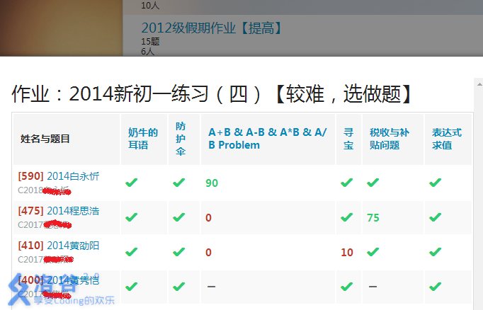
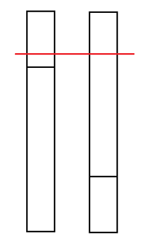

https://www.luogu.com.cn/training/8917#problems

# [NOIP2005 普及组] 采药

## 题目描述

辰辰是个天资聪颖的孩子，他的梦想是成为世界上最伟大的医师。为此，他想拜附近最有威望的医师为师。医师为了判断他的资质，给他出了一个难题。医师把他带到一个到处都是草药的山洞里对他说：“孩子，这个山洞里有一些不同的草药，采每一株都需要一些时间，每一株也有它自身的价值。我会给你一段时间，在这段时间里，你可以采到一些草药。如果你是一个聪明的孩子，你应该可以让采到的草药的总价值最大。”


如果你是辰辰，你能完成这个任务吗？

## 输入格式

第一行有 $2$ 个整数 $T$（$1 \le T \le 1000$）和 $M$（$1 \le  M \le 100$），用一个空格隔开，$T$ 代表总共能够用来采药的时间，$M$ 代表山洞里的草药的数目。

接下来的 $M$ 行每行包括两个在 $1$ 到 $100$ 之间（包括 $1$ 和 $100$）的整数，分别表示采摘某株草药的时间和这株草药的价值。

## 输出格式

输出在规定的时间内可以采到的草药的最大总价值。

## 样例 #1

### 样例输入 #1

```
70 3
71 100
69 1
1 2
```

### 样例输出 #1

```
3
```

## 提示

**【数据范围】**

- 对于 $30\%$ 的数据，$M \le 10$；
- 对于全部的数据，$M \le 100$。

**【题目来源】**

NOIP 2005 普及组第三题

```c++
#include<bits/stdc++.h>

using namespace std;
typedef long long int LL;
const int M = 110, T = 1010;

int v[M], w[M];
int m, t;
int f[T];

int main() {
    cin >> t >> m;
    for (int i = 1; i <= m; ++i) cin >> v[i] >> w[i];
    for (int i = 1; i <= m; ++i)
        for (int j = t; j >= v[i]; --j)
            f[j] = max(f[j], f[j - v[i]] + w[i]);

    cout << f[t];
    return 0;
}
```

本质是标准的01背包


# [USACO07DEC]Charm Bracelet S

## 题目描述

Bessie has gone to the mall's jewelry store and spies a charm bracelet. Of course, she'd like to fill it with the best charms possible from the N (1 ≤ N ≤ 3,402) available charms. Each charm i in the supplied list has a weight Wi (1 ≤ Wi ≤ 400), a 'desirability' factor Di (1 ≤ Di ≤ 100), and can be used at most once. Bessie can only support a charm bracelet whose weight is no more than M (1 ≤ M ≤ 12,880).

Given that weight limit as a constraint and a list of the charms with their weights and desirability rating, deduce the maximum possible sum of ratings.

有 $N$ 件物品和一个容量为 $M$ 的背包。第 $i$ 件物品的重量是 $W_i$，价值是 $D_i$。求解将哪些物品装入背包可使这些物品的重量总和不超过背包容量，且价值总和最大。

## 输入格式

\* Line 1: Two space-separated integers: N and M

\* Lines 2..N+1: Line i+1 describes charm i with two space-separated integers: Wi and Di

第一行：物品个数 $N$ 和背包大小 $M$。

第二行至第 $N+1$ 行：第 $i$ 个物品的重量 $W_i$ 和价值 $D_i$。

## 输出格式

\* Line 1: A single integer that is the greatest sum of charm desirabilities that can be achieved given the weight constraints

输出一行最大价值。

## 样例 #1

### 样例输入 #1

```
4 6
1 4
2 6
3 12
2 7
```

### 样例输出 #1

```
23
```

```c++
#include <bits/stdc++.h>

using namespace std;
const int N = 3450, M = 13000;
int n, m, v[N], w[N];
int f[M];

int main() {
    cin >> n >> m;
    for (int i = 1; i <= n; ++i) cin >> v[i] >> w[i];

    for (int i = 1; i <= n; ++i)
        for (int j = m; j >= v[i]; --j)
            f[j] = max(f[j], f[j - v[i]] + w[i]);

    cout << f[m];
    return 0;
}
```

还是01背包问题


# [NOIP2001 普及组] 装箱问题

## 题目描述

有一个箱子容量为 $V$，同时有 $n$ 个物品，每个物品有一个体积。


现在从 $n$ 个物品中，任取若干个装入箱内（也可以不取），使箱子的剩余空间最小。输出这个最小值。

## 输入格式

第一行共一个整数 $V$，表示箱子容量。

第二行共一个整数 $n$，表示物品总数。

接下来 $n$ 行，每行有一个正整数，表示第 $i$ 个物品的体积。

## 输出格式

- 共一行一个整数，表示箱子最小剩余空间。

## 样例 #1

### 样例输入 #1

```
24
6
8
3
12
7
9
7
```

### 样例输出 #1

```
0
```

## 提示

对于 $100\%$ 数据，满足 $0<n \le 30$，$1 \le V \le 20000$。

**【题目来源】**

NOIP 2001 普及组第四题

```c++
#include <bits/stdc++.h>

using namespace std;

const int N = 35, M = 20010;
int f[M], n, m, v[N];

int main() {
    cin >> m >> n;
    for (int i = 1; i <= n; ++i) cin >> v[i];

    for (int i = 1; i <= n; ++i)
        for (int j = m; j >= v[i]; --j) f[j] = max(f[j], f[j - v[i]] + v[i]);

    cout << m - f[m];
    return 0;
}
```

还是01背包问题，不过这里是把体积本身作为价值，又因为有容量作为上限卡着，所以`f[m]`一定不会超过容量`m`。注意在最后输出时，要做减法，这也是本题唯一的一个小技巧。


# [NOIP2006 普及组] 开心的金明

## 题目描述

金明今天很开心，家里购置的新房就要领钥匙了，新房里有一间他自己专用的很宽敞的房间。更让他高兴的是，妈妈昨天对他说：“你的房间需要购买哪些物品，怎么布置，你说了算，只要不超过$N$元钱就行”。今天一早金明就开始做预算，但是他想买的东西太多了，肯定会超过妈妈限定的$N$元。于是，他把每件物品规定了一个重要度，分为$5$等：用整数$1-5$表示，第$5$等最重要。他还从因特网上查到了每件物品的价格（都是整数元）。他希望在不超过$N$元（可以等于$N$元）的前提下，使每件物品的价格与重要度的乘积的总和最大。

设第$j$件物品的价格为$v[j]$，重要度为$w[j]$，共选中了$k$件物品，编号依次为$j_1,j_2,…,j_k$，则所求的总和为：

$v[j_1] \times w[j_1]+v[j_2] \times w[j_2]+ …+v[j_k] \times w[j_k]$。

请你帮助金明设计一个满足要求的购物单。

## 输入格式

第一行，为$2$个正整数，用一个空格隔开：$n,m$（其中$N(<30000)$表示总钱数，$m(<25)$为希望购买物品的个数。）

从第$2$行到第$m+1$行，第$j$行给出了编号为$j-1$的物品的基本数据，每行有$2$个非负整数$ v p$（其中$v$表示该物品的价格$(v \le 10000)$，$p$表示该物品的重要度($1-5$)

## 输出格式

$1$个正整数，为不超过总钱数的物品的价格与重要度乘积的总和的最大值$(<100000000)$。

## 样例 #1

### 样例输入 #1

```
1000 5
800 2
400 5
300 5
400 3
200 2
```

### 样例输出 #1

```
3900
```

## 提示

NOIP 2006 普及组 第二题

```c++
#include <bits/stdc++.h>

using namespace std;

const int N = 30, M = 30010;
int n, m, w[N], v[N];
int f[M];

int main() {
    cin >> n >> m;
    for (int i = 1; i <= m; ++i) cin >> v[i] >> w[i];

    for (int i = 1; i <= m; ++i)
        for (int j = n; j >= v[i]; --j) {
            f[j] = max(f[j], f[j - v[i]] + v[i] * w[i]);
        }

    cout << f[n];
    return 0;
}
```

还是01背包问题，不过这里的`w`数组并不是真正的价值，真正的价值是`v[i]*w[i]`


# 小A点菜

## 题目背景

uim 神犇拿到了 uoi 的 ra（镭牌）后，立刻拉着基友小 A 到了一家……餐馆，很低端的那种。

uim 指着墙上的价目表（太低级了没有菜单），说：“随便点”。

## 题目描述

不过 uim 由于买了一些书，口袋里只剩 $M$ 元 $(M \le 10000)$。

餐馆虽低端，但是菜品种类不少，有 $N$ 种 $(N \le 100)$，第 $i$ 种卖 $a_i$ 元 $(a_i \le 1000)$。由于是很低端的餐馆，所以每种菜只有一份。

小 A 奉行“不把钱吃光不罢休”，所以他点单一定刚好把 uim 身上所有钱花完。他想知道有多少种点菜方法。

由于小 A 肚子太饿，所以最多只能等待 $1$ 秒。

## 输入格式

第一行是两个数字，表示 $N$ 和 $M$。

第二行起 $N$ 个正数 $a_i$（可以有相同的数字，每个数字均在 $1000$ 以内）。

## 输出格式

一个正整数，表示点菜方案数，保证答案的范围在 int 之内。

## 样例 #1

### 样例输入 #1

```
4 4
1 1 2 2
```

### 样例输出 #1

```
3
```

## 提示

2020.8.29，增添一组 hack 数据 by @yummy

**二维版本**

```c++
#include <bits/stdc++.h>

using namespace std;

const int N = 110, M = 10010;
int n, f[N][M], a[N], m;

int main() {
    cin >> n >> m;
    for (int i = 1; i <= n; ++i) cin >> a[i];

    f[0][0] = 1;
    for (int i = 1; i <= n; ++i)
        for (int j = 0; j <= m; ++j) {
            f[i][j] = f[i - 1][j];
            if (j - a[i] >= 0) f[i][j] += f[i - 1][j - a[i]];
        }
    cout << f[n][m];
    return 0;
}
```

01背包问题，不过这里统计的不是最多价值，而是方案数量

**一维版本**

```c++
#include <bits/stdc++.h>

using namespace std;

const int N = 110, M = 10010;
int n, f[M], a[N], m;

int main() {
    cin >> n >> m;
    for (int i = 1; i <= n; ++i) cin >> a[i];

    f[0] = 1;
    for (int i = 1; i <= n; ++i)
        for (int j = m; j >= a[i]; --j) {
            f[j] += f[j - a[i]];
        }
    cout << f[m];
    return 0;
}
```

虽然背包问题本身不保证`f[m]`一定和`f[m-1]`不同，但是考虑到本题一定有解，所以不用考虑`f[m]`和`f[m-1]`不同的情况


# 精卫填海

## 题目描述

【版权说明】

本题为改编题。

【问题描述】

发鸠之山，其上多柘木。有鸟焉，其状如乌，文首，白喙，赤足，名曰精卫，其名自詨。是炎帝之少女，名曰女娃。女娃游于东海，溺而不返，故为精卫。常衔西山之木石，以堙于东海。——《山海经》

精卫终于快把东海填平了！只剩下了最后的一小片区域了。同时，西山上的木石也已经不多了。精卫能把东海填平吗？

事实上，东海未填平的区域还需要至少体积为v的木石才可以填平，而西山上的木石还剩下n块，每块的体积和把它衔到东海需要的体力分别为k和m。精卫已经填海填了这么长时间了，她也很累了，她还剩下的体力为c。

## 输入格式

输入文件的第一行是三个整数：v、n、c。

从第二行到第n+1行分别为每块木石的体积和把它衔到东海需要的体力。

## 输出格式

输出文件只有一行，如果精卫能把东海填平，则输出她把东海填平后剩下的最大的体力，否则输出’Impossible’（不带引号）。

## 样例 #1

### 样例输入 #1

```
100 2 10
50 5
50 5
```

### 样例输出 #1

```
0
```

## 样例 #2

### 样例输入 #2

```
10 2 1
50 5
10 2
```

### 样例输出 #2

```
Impossible
```

## 提示

【数据范围】

对于20%的数据，0<n<=50。

对于50%的数据，0<n<=1000。

对于100%的数据，0<n<=10000，所有读入的数均属于[0,10000]，最后结果<=c。

```c++
#include <bits/stdc++.h>

using namespace std;

const int N = 10010;
int n, m, c, f[1000010], v[N], w[N];

int main() {
    cin >> m >> n >> c;
    for (int i = 1; i <= n; ++i) {
        cin >> v[i] >> w[i];// 体积 体力 
    }

    for (int i = 1; i <= n; ++i)
        for (int j = c; j >= w[i]; --j)
            f[j] = max(f[j], f[j - w[i]] + v[i]);

    // f 消耗i体力可以搬动的最大体积石头 
    if (f[c] < m) puts("Impossible");
    else {
        int i = c;
        while (f[i] >= m)--i;
        i++;
        cout << c - i;
    }
    return 0;
}
```

还是01背包问题，不过有个小变形

背包容积是此时剩余的体力c

每个石头的价值是石头的体积

每个石头的代价是搬运石头消耗的体力

求出的是，满足某个价值的最小背包容量


# [USACO09OCT]Bessie's Weight Problem G

## 题目描述

Bessie 像她的诸多姊妹一样，因为从 Farmer John 的草地吃了太多美味的草而长出了太多的赘肉。所以 FJ 将她置于一个及其严格的节食计划之中。她每天不能吃多过 $H (5 \le H \le 45,000)$ 公斤的干草。 Bessie 只能吃一整捆干草；当她开始吃一捆干草的之后就再也停不下来了。她有一个完整的$N (1 \le N \le 500)$ 捆可以给她当作晚餐的干草的清单。她自然想要尽量吃到更多的干草。很自然地，每捆干草只能被吃一次（即使在列表中相同的重量可能出现2次，但是这表示的是两捆干草，其中每捆干草最多只能被吃掉一次）。 给定一个列表表示每捆干草的重量 $S_i (1 \le S_i \le H)$ , 求 Bessie 不超过节食的限制的前提下可以吃掉多少干草（注意一旦她开始吃一捆干草就会把那一捆干草全部吃完）。

## 输入格式

第一行有两个由空格隔开的整数 $H$ 和 $N$。

第 $2$ 到第 $N+1$ 行，第 $i+1$ 行是一个单独的整数，表示第 $i$ 捆干草的重量 $S_i$。

## 输出格式

第一行一个单独的整数表示 Bessie 在限制范围内最多可以吃多少公斤的干草。

## 样例 #1

### 样例输入 #1

```
56 4
15
19
20
21
```

### 样例输出 #1

```
56
```

## 提示

#### 输入说明

有四捆草，重量分别是 $15,19,20$ 和 $21$。Bessie 在 $56$ 公斤的限制范围内想要吃多少就可以吃多少。


#### 输出说明

Bessie 可以吃 $3$ 捆干草（重量分别为 $15, 20, 21$）。恰好达到她的 $56$ 公斤的限制。

```c++
#include <bits/stdc++.h>

using namespace std;
const int N = 550, M = 45010;
int n, m, v[N];
int f[M];

int main() {
    cin >> m >> n;
    for (int i = 1; i <= n; ++i) cin >> v[i];

    for (int i = 1; i <= n; ++i)
        for (int j = m; j >= v[i]; --j)
            f[j] = max(f[j], f[j - v[i]] + v[i]);

    cout << f[m];
    return 0;
}
```

01背包问题  物品（干草）的体积就是物品的价值


# [USACO08DEC]Hay For Sale S

## 题面翻译

题目描述
    农民john面临一个很可怕的事实，因为防范失措他存储的所有稻草给澳大利亚蟑螂吃光了，他将面临没有稻草喂养奶牛的局面。在奶牛断粮之前，john拉着他的马车到农民Don的农场中买一些稻草给奶牛过冬。已知john的马车可以装的下C(1 <= C <=50,000)立方的稻草。
    农民Don有H(1 <= H <= 5,000)捆体积不同的稻草可供购买，每一捆稻草有它自己的体积(1 <= V_i <= C)。面对这些稻草john认真的计算如何充分利用马车的空间购买尽量多的稻草给他的奶牛过冬。
    现在给定马车的最大容积C和每一捆稻草的体积Vi，john如何在不超过马车最大容积的情况下买到最大体积的稻草？他不可以把一捆稻草分开来买。

    输入输出格式
    输入格式：
    第一行两个整数，分别为C和H
    第2..H+1行:每一行一个整数代表第i捆稻草的体积Vi
    
    输出格式：
    
    一个整数，为john能买到的稻草的体积。
    输入输出样例
    输入样例#1：
    7 3
    2
    6
    5
    输出样例#1：
    7

翻译提供者：黑客集团_鬼

## 题目描述

Farmer John suffered a terrible loss when giant Australian cockroaches ate the entirety of his hay inventory, leaving him with nothing to feed the cows. He hitched up his wagon with capacity C (1 <= C <= 50,000) cubic units and sauntered over to Farmer Don's to get some hay before the cows miss a meal.

Farmer Don had a wide variety of H (1 <= H <= 5,000) hay bales for sale, each with its own volume (1 <= V\_i <= C). Bales of hay, you know, are somewhat flexible and can be jammed into the oddest of spaces in a wagon.

FJ carefully evaluates the volumes so that he can figure out the largest amount of hay he can purchase for his cows.

Given the volume constraint and a list of bales to buy, what is the greatest volume of hay FJ can purchase?  He can't purchase partial bales, of course. Each input line (after the first) lists a single bale FJ can buy.

约翰遭受了重大的损失：蟑螂吃掉了他所有的干草，留下一群饥饿的牛．他乘着容量为C(1≤C≤50000)个单位的马车，去顿因家买一些干草．  顿因有H(1≤H≤5000)包干草，每一包都有它的体积Vi(l≤Vi≤C).约翰只能整包购买，

他最多可以运回多少体积的干草呢？

## 输入格式

\* Line 1: Two space-separated integers: C and H

\* Lines 2..H+1: Each line describes the volume of a single bale: V\_i

## 输出格式

\* Line 1: A single integer which is the greatest volume of hay FJ can purchase given the list of bales for sale and constraints.

## 样例 #1

### 样例输入 #1

```
7 3 
2 
6 
5
```

### 样例输出 #1

```
7
```

## 提示

The wagon holds 7 volumetric units; three bales are offered for sale with volumes of 2, 6, and 5 units, respectively.


Buying the two smaller bales fills the wagon.

```c++
#include <bits/stdc++.h>

using namespace std;

const int N = 5010, M = 50010;
int n, m, f[M], v[N];

int main() {
    cin >> m >> n;
    for (int i = 1; i <= n; ++i) cin >> v[i];

    for (int i = 1; i <= n; ++i)
        for (int j = m; j >= v[i]; --j)
            f[j] = max(f[j], f[j - v[i]] + v[i]);

    cout << f[m];
    return 0;
}
```

01背包问题，物品（干草）的体积就是物品的价值


# 5 倍经验日

## 题目背景

现在乐斗有活动了！每打一个人可以获得 5 倍经验！absi2011 却无奈的看着那一些比他等级高的好友，想着能否把他们干掉。干掉能拿不少经验的。

## 题目描述

现在 absi2011 拿出了 $x$ 个迷你装药物（嗑药打人可耻…），准备开始与那些人打了。

由于迷你装药物每个只能用一次，所以 absi2011 要谨慎的使用这些药。悲剧的是，用药量没达到最少打败该人所需的属性药药量，则打这个人必输。例如他用 $2$ 个药去打别人，别人却表明 $3$ 个药才能打过，那么相当于你输了并且这两个属性药浪费了。

现在有 $n$ 个好友，给定失败时可获得的经验、胜利时可获得的经验，打败他至少需要的药量。

要求求出最大经验 $s$，输出 $5s$。

## 输入格式

第一行两个数，$n$ 和 $x$。

后面 $n$ 行每行三个数，分别表示失败时获得的经验 $\mathit{lose}_i$，胜利时获得的经验 $\mathit{win}_i$ 和打过要至少使用的药数量 $\mathit{use}_i$。

## 输出格式

一个整数，最多获得的经验的五倍。

## 样例 #1

### 样例输入 #1

```
6 8
21 52 1
21 70 5
21 48 2
14 38 3
14 36 1
14 36 2
```

### 样例输出 #1

```
1060
```

## 提示

**【Hint】**

五倍经验活动的时候，absi2011 总是吃体力药水而不是这种属性药。

**【数据范围】**

- 对于 $10\%$ 的数据，保证 $x=0$。
- 对于 $30\%$ 的数据，保证 $0\le n\le 10$，$0\le x\le 20$。
- 对于 $60\%$ 的数据，保证 $0\le n,x\le 100$， $10<lose_i,win_i\le 100$，$0\le use_i\le 5$。
- 对于 $100\%$ 的数据，保证 $0\le n,x\le 10^3$，$0<lose_i\le win_i\le 10^6$，$0\le use_i\le 10^3$。

**【题目来源】**

fight.pet.qq.com

absi2011 授权题目

```c++
#include<bits/stdc++.h>

using namespace std;
const int N = 1e3 + 10;

int n, x;

int jingyan[N];
int lose[N], win[N], s[N];

int main() {
    cin >> n >> x;
    for (int i = 1; i <= n; i++) cin >> lose[i] >> win[i] >> s[i];

    for (int i = 1; i <= n; i++) {
        for (int j = x; j >= s[i]; --j)
            jingyan[j] = max(jingyan[j] + lose[i], jingyan[j - s[i]] + win[i]);
        for (int j = s[i] - 1; j >= 0; --j)
            jingyan[j] += lose[i];
    }
    
    printf("%lld", 5ll * jingyan[x]);
    return 0;
}
```

还是01背包问题，选择装入一个物品会消耗容量，增加经验值（多），不选择一个物品则不会消耗容量，同时也会增加经验值（少），所以状态转移方程要分成两部分计算


# 最大约数和

## 题目描述

选取和不超过 $S$ 的若干个不同的正整数，使得所有数的约数（不含它本身）之和最大。

## 输入格式

输入一个正整数 $S$。

## 输出格式

输出最大的约数之和。

## 样例 #1

### 样例输入 #1

```
11
```

### 样例输出 #1

```
9
```

## 提示

**【样例说明】**

取数字 $4$ 和 $6$，可以得到最大值 $(1+2)+(1+2+3)=9$。

**【数据规模】**

对于 $100 \%$ 的数据，$1 \le S \le 1000$。

```c++
#include <bits/stdc++.h>

using namespace std;

const int N = 1010;
int n, a[N], f[N];

int main() {
    cin >> n;
    for (int i = 2; i <= n; ++i) {
        int res = 0;
        int s = 1;
        while (s <= i / 2) {
            if (i % s == 0) res += s;
            s++;
        }
        a[i] = res;
    }
    for (int i = 1; i <= n; ++i)
        for (int s = n; s >= i; --s)
            f[s] = max(f[s], f[s - i] + a[i]);
    cout << f[n];
    return 0;
} 
```

01背包问题，每个数字本身的大小就是物品的体积，每个数的约数之和就是物品的价值


# 小书童——刷题大军

## 题目背景

数学是火，点亮物理的灯；物理是灯，照亮化学的路；化学是路，通向生物的坑；生物是坑，埋葬学理的人。  文言是火，点亮历史宫灯；历史是灯，照亮社会之路；社会是路，通向哲学大坑；哲学是坑，埋葬文科生。——小A

## 题目描述

小A“刷题”十分猖狂，明目张胆地“刷题”。他现在在小书童里发现了n样他喜欢的“题目”，每“题”都有他的需要时间，而老师布置了m项作业，每项作业都有它的需要时间及分值，老师规定k分以上算及格。小A只剩r个单位时间，他想在及格的基础上更多地“刷题”。

## 输入格式

第一行：n m k r。第二行：n个数，代表每“题”他的需要时间。第三行：m个数。表示每项作业它的需要时间。第四行：m个数。代表每项作业它的分值。

## 输出格式

一个数，代表小A能刷几道题

## 样例 #1

### 样例输入 #1

```
3 4 20 100
15 20 50
10 15 40 40
5 5 10 15
```

### 样例输出 #1

```
2
```

## 提示

没有不能及格的情况

对于100%的数据，$n\le 10,m\le 10,k\le 50,r\le 150$

```c++
#include <bits/stdc++.h>

using namespace std;

const int N = 200;
int n, m, k, r;
int v1[N], v2[N], w[N];
int f[N]; // 单位时间的最大分值 
int dp[N]; // 单位时间刷题的最大数量 
int main() {
    cin >> n >> m >> k >> r;
    for (int i = 1; i <= n; ++i) cin >> v1[i];// 每“题”他的需要时间
    for (int i = 1; i <= m; ++i) cin >> v2[i];// 每项作业它的需要时间
    for (int i = 1; i <= m; ++i) cin >> w[i];

    for (int i = 1; i <= m; ++i)
        for (int j = 199; j >= v2[i]; --j)
            f[j] = max(f[j], f[j - v2[i]] + w[i]);

    int i = 0;
    while (f[i] < k) i++;
    int ti = r - i;
    for (int i = 1; i <= n; ++i)
        for (int j = ti; j >= v1[i]; --j)
            dp[j] = max(dp[j], dp[j - v1[i]] + 1);

    cout << dp[ti];
    return 0;
}
```

一共是处理两遍的01背包问题。

第一遍得到完成课内作业所需要的最小时间。通过计算某个时间所完成作业对应分值的最大值来得到最小时间。

第二遍是计算剩下的时间可以做多少题。

注意：题目中说了没有不能及格的情况，所以不用考虑`while (f[i] < k) i++;`中的`i`越界，要是没说一定可以完成课内作业的话还需要特判`i`的范围。


# kkksc03考前临时抱佛脚

## 题目背景

kkksc03 的大学生活非常的颓废，平时根本不学习。但是，临近期末考试，他必须要开始抱佛脚，以求不挂科。

## 题目描述

这次期末考试，kkksc03 需要考 $4$ 科。因此要开始刷习题集，每科都有一个习题集，分别有 $s_1,s_2,s_3,s_4$ 道题目，完成每道题目需要一些时间，可能不等（$A_1,A_2,\ldots,A_{s_1}$，$B_1,B_2,\ldots,B_{s_2}$，$C_1,C_2,\ldots,C_{s_3}$，$D_1,D_2,\ldots,D_{s_4}$）。


kkksc03 有一个能力，他的左右两个大脑可以同时计算 $2$ 道不同的题目，但是仅限于同一科。因此，kkksc03 必须一科一科的复习。


由于 kkksc03 还急着去处理洛谷的 bug，因此他希望尽快把事情做完，所以他希望知道能够完成复习的最短时间。

## 输入格式

本题包含 $5$ 行数据：第 $1$ 行，为四个正整数 $s_1,s_2,s_3,s_4$。

第 $2$ 行，为 $A_1,A_2,\ldots,A_{s_1}$ 共 $s_1$ 个数，表示第一科习题集每道题目所消耗的时间。

第 $3$ 行，为 $B_1,B_2,\ldots,B_{s_2}$ 共 $s_2$ 个数。

第 $4$ 行，为 $C_1,C_2,\ldots,C_{s_3}$ 共 $s_3$ 个数。

第 $5$ 行，为 $D_1,D_2,\ldots,D_{s_4}$ 共 $s_4$ 个数，意思均同上。

## 输出格式

输出一行,为复习完毕最短时间。

## 样例 #1

### 样例输入 #1

```
1 2 1 3		
5
4 3
6
2 4 3
```

### 样例输出 #1

```
20
```

## 提示

$1\leq s_1,s_2,s_3,s_4\leq 20$。

$1\leq A_1,A_2,\ldots,A_{s_1},B_1,B_2,\ldots,B_{s_2},C_1,C_2,\ldots,C_{s_3},D_1,D_2,\ldots,D_{s_4}\leq60$。

```c++
#include<bits/stdc++.h>

using namespace std;
const int N = 25;
int t1[N], t2[N], t3[N], t4[N], s1, s2, s3, s4;
int m1 = 1e9, m2 = 1e9, m3 = 1e9, m4 = 1e9;
int tt1, tt2;

void dfs1(int u) {
    if (u == s1) {
        m1 = min(m1, max(tt1, tt2));
        return;
    }
    tt1 += t1[u];
    dfs1(u + 1);
    tt1 -= t1[u];
    tt2 += t1[u];
    dfs1(u + 1);
    tt2 -= t1[u];
}

void dfs2(int u) {
    if (u == s2) {
        m2 = min(m2, max(tt1, tt2));
        return;
    }
    tt1 += t2[u];
    dfs2(u + 1);
    tt1 -= t2[u];
    tt2 += t2[u];
    dfs2(u + 1);
    tt2 -= t2[u];
}

void dfs3(int u) {
    if (u == s3) {
        m3 = min(m3, max(tt1, tt2));
        return;
    }
    tt1 += t3[u];
    dfs3(u + 1);
    tt1 -= t3[u];
    tt2 += t3[u];
    dfs3(u + 1);
    tt2 -= t3[u];
}

void dfs4(int u) {
    if (u == s4) {
        m4 = min(m4, max(tt1, tt2));
        return;
    }
    tt1 += t4[u];
    dfs4(u + 1);
    tt1 -= t4[u];
    tt2 += t4[u];
    dfs4(u + 1);
    tt2 -= t4[u];
}

int main() {
    cin >> s1 >> s2 >> s3 >> s4;
    for (int i = 0; i < s1; ++i) cin >> t1[i];
    for (int i = 0; i < s2; ++i) cin >> t2[i];
    for (int i = 0; i < s3; ++i) cin >> t3[i];
    for (int i = 0; i < s4; ++i) cin >> t4[i];
    dfs1(0);
    dfs2(0);
    dfs3(0);
    dfs4(0);
    cout << m1 + m2 + m3 + m4;
    return 0;
}
```

直接DFS搜索，暂时没想到背包DP的做法


# NASA的食物计划

## 题目背景

NASA（美国航空航天局）因为航天飞机的隔热瓦等其他安全技术问题一直大伤脑筋，因此在各方压力下终止了航天飞机的历史，但是此类事情会不会在以后发生，谁也无法保证。所以，在遇到这类航天问题时，也许只能让航天员出仓维修。但是过多的维修会消耗航天员大量的能量，因此 NASA 便想设计一种食品方案，使体积和承重有限的条件下多装载一些高卡路里的食物。

## 题目描述

航天飞机的体积有限，当然如果载过重的物品，燃料会浪费很多钱，每件食品都有各自的体积、质量以及所含卡路里。在告诉你体积和质量的最大值的情况下，请输出能达到的食品方案所含卡路里的最大值，当然每个食品只能使用一次。

## 输入格式

第一行 $2$ 个整数，分别代表体积最大值 $h$ 和质量最大值 $t$。 

第二行 $1$ 个整数代表食品总数 $n$。 

接下来 $n$ 行每行 $3$ 个数 体积 $h_i$，质量 $t_i$，所含卡路里 $k_i$。

## 输出格式

一个数，表示所能达到的最大卡路里（`int` 范围内）

## 样例 #1

### 样例输入 #1

```
320 350
4
160 40 120
80 110 240
220 70 310
40 400 220
```

### 样例输出 #1

```
550
```

## 提示

对于 $100\%$ 的数据，$h,t,h_i,t_i \le 400$，$n \le 50$，$k_i \le 500$。

```c++
#include <bits/stdc++.h>

using namespace std;
const int N = 60, M = 410;

int v[N], w[N], n, h, t, m[N];
int f[M][M];

int main() {
    cin >> h >> t;
    cin >> n;
    for (int i = 1; i <= n; ++i) cin >> v[i] >> m[i] >> w[i];

    for (int i = 1; i <= n; i++)
        for (int j = h; j >= v[i]; --j) {
            for (int k = t; k >= m[i]; --k)
                f[j][k] = max(f[j][k], f[j - v[i]][k - m[i]] + w[i]);
        }
    cout << f[h][t];
    return 0;
}
```

**本质是二维的01背包问题**

**先枚举第一维的变量，再枚举第二维的变量**

**同时也注意到，二维的01背包问题必须优化**


# L国的战斗之间谍

## 题目背景

L国即将与I国发动战争！！

## 题目描述

俗话说的好：“知己知彼，百战不殆”。L国的指挥官想派出间谍前往I国，于是，选人工作就落到了你身上。

你现在有N个人选，每个人都有这样一些数据：A（能得到多少资料）、B（伪装能力有多差）、C（要多少工资）。已知敌人的探查间谍能力为M（即去的所有人B的和要小于等于M）和手头有X元钱，请问能拿到多少资料？

## 输入格式

N  M  X

A1  B1  C1

A2  B2  C2

………………

AN  BN  CN

## 输出格式

能得到的资料总数

## 样例 #1

### 样例输入 #1

```
3 10 12
10 1 11
1 9 1
7 10 12
```

### 样例输出 #1

```
11
```

## 提示

数据范围：

1≤n≤100,1≤m≤1000, 1≤x≤1000

```c++
#include <bits/stdc++.h>

using namespace std;

const int N = 110, M = 1010;
int n, m, x, a[N], b[N], c[N];
int f[M][M];

int main() {
    cin >> n >> m >> x;
    for (int i = 1; i <= n; ++i) cin >> a[i] >> b[i] >> c[i];

    for (int i = 1; i <= n; ++i)
        for (int j = m; j >= b[i]; --j)
            for (int k = x; k >= c[i]; --k)
                f[j][k] = max(f[j][k], f[j - b[i]][k - c[i]] + a[i]);

    cout << f[m][x];
    return 0;
}
```

**本质是二维的01背包问题**

**先枚举第一维的变量，再枚举第二维的变量**

**同时也注意到，二维的01背包问题必须优化**


# 榨取kkksc03

## 题目描述

洛谷 2 的团队功能是其他任何 OJ 和工具难以达到的。借助洛谷强大的服务器资源，任何学校都可以在洛谷上零成本的搭建 OJ 并高效率的完成训练计划。

为什么说是搭建 OJ 呢？为什么高效呢？


因为，你可以上传私有题目，团队外别人是无法看到的。我们还能帮你们评测！

你可以创建作业，给组员布置任务，查看组员的完成情况，还可以点评任意一份代码！

你可以创建比赛！既可以是 OI 赛制还可以是 ICPC 赛制！既可以是团队内部的私有比赛，也可以公开赛，甚至可以指定谁可以参加比赛。这样，搞“x 校联赛”最合适不过了。洛谷凭借这个功能，希望能够提供公开及私有比赛的另外一个平台。



值得说明的是，本次比赛就是采用团队私有题目+邀请比赛的机制。

洛谷的运营组决定，如果一名 OIer 向他的教练推荐洛谷，并能够成功的使用（成功使用的定义是：该团队有 $20$ 个或以上的成员，上传 $10$ 道以上的私有题目，布置过一次作业并成功举办过一次公开比赛），那么他可以浪费掉 kkksc03 的一些时间的同时消耗掉 kkksc03 的一些金钱以满足自己的一个愿望。

kkksc03 的时间和金钱是有限的，所以他很难满足所有同学的愿望。所以他想知道在自己的能力范围内，最多可以完成多少同学的愿望？

## 输入格式

第一行三个整数 $n,M,T$，表示一共有 $n$（$1 \le n \le 100$）个愿望， kkksc03 的手上还剩 $M$（$0 \le M \le 200$）元，他的暑假有 $T$（$0 \le T \le 200$）分钟时间。

第 $2$~$n+1$ 行 $m_{i}$ , $t_{i}$ 表示第 $i$ 个愿望所需要的金钱和时间。

## 输出格式

一行，一个数，表示 kkksc03 最多可以实现愿望的个数。

## 样例 #1

### 样例输入 #1

```
6 10 10
1 1
2 3 
3 2
2 5
5 2
4 3
```

### 样例输出 #1

```
4
```

```c++
#include <bits/stdc++.h>

using namespace std;

const int N = 110, M = 210;
int n, m, t;
int b[N], c[N];
int f[M][M];

int main() {
    cin >> n >> m >> t;
    for (int i = 1; i <= n; ++i) cin >> b[i] >> c[i];

    for (int i = 1; i <= n; ++i)
        for (int j = m; j >= b[i]; --j)
            for (int k = t; k >= c[i]; --k)
                f[j][k] = max(f[j][k], f[j - b[i]][k - c[i]] + 1);
    cout << f[m][t];
    return 0;
}
```

**本质是二维的01背包问题**

**先枚举第一维的变量，再枚举第二维的变量**

**同时也注意到，二维的01背包问题必须优化**

注意到本题与上述两题的不同点：本题的价值是每个题的数量，也就是每次要`+1`而上述两个二维01背包问题的价值是`+w[i]`


# [HAOI2012] 音量调节

## 题目描述

一个吉他手准备参加一场演出。他不喜欢在演出时始终使用同一个音量，所以他决定每一首歌之前他都需要改变一次音量。在演出开始之前，他已经做好一个列表，里面写着每首歌开始之前他想要改变的音量是多少。每一次改变音量，他可以选择调高也可以调低。

音量用一个整数描述。输入文件中整数 $beginLevel$，代表吉他刚开始的音量，整数 $maxLevel$，代表吉他的最大音量。音量不能小于 $0$ 也不能大于 $maxLevel$。输入中还给定了 $n$ 个整数 $c_1,c_2,c_3,\cdots,c_n$，表示在第 $i$ 首歌开始之前吉他手想要改变的音量是多少。

吉他手想以最大的音量演奏最后一首歌，你的任务是找到这个最大音量是多少。

## 输入格式

第一行依次为三个整数 $n$，$beginLevel$ 和 $maxLevel$。

第二行依次为 $n$ 个整数 $c_1,c_2,c_3,\cdots,c_n$。

## 输出格式

输出演奏最后一首歌的最大音量。如果吉他手无法避免音量低于 $0$ 或者高于 $maxLevel$，输出 `-1`。

## 样例 #1

### 样例输入 #1

```
3 5 10
5 3 7
```

### 样例输出 #1

```
10
```

## 提示

$1\le n\le 50$，$1\le c_i\le maxLevel$，$1\le maxLevel\le 1000$，$0\le beginLevel\le maxLevel$。

```c++
#include <bits/stdc++.h>

using namespace std;

const int N = 60, M = 1010;
int n, a[N];
int beginl, maxl;
bool f[N][M];

int main() {
    cin >> n >> beginl >> maxl;
    for (int i = 1; i <= n; ++i) cin >> a[i];

    f[0][beginl] = true;// 注意初始化的方式
    for (int i = 1; i <= n; ++i)
        for (int j = 0; j <= maxl; ++j) {
            if (f[i - 1][j] && j + a[i] <= maxl) f[i][j + a[i]] = true;
            if (f[i - 1][j] && j - a[i] >= 0) f[i][j - a[i]] = true;
        }

    for (int i = maxl; i >= 0; --i) {
        if (f[n][i]) {
            cout << i;// 可以到达的最大音量是多少
            return 0;
        }
    }
    cout << "-1";
    return 0;
} 
```

到达型的01背包问题

初始条件：`f[0][beginlevel]=true`,没演奏前可以到达`beginlevel`


# 疯狂的采药

## 题目背景

此题为纪念 LiYuxiang 而生。

## 题目描述

LiYuxiang 是个天资聪颖的孩子，他的梦想是成为世界上最伟大的医师。为此，他想拜附近最有威望的医师为师。医师为了判断他的资质，给他出了一个难题。医师把他带到一个到处都是草药的山洞里对他说：“孩子，这个山洞里有一些不同种类的草药，采每一种都需要一些时间，每一种也有它自身的价值。我会给你一段时间，在这段时间里，你可以采到一些草药。如果你是一个聪明的孩子，你应该可以让采到的草药的总价值最大。”

如果你是 LiYuxiang，你能完成这个任务吗？

此题和原题的不同点：

$1$. 每种草药可以无限制地疯狂采摘。

$2$. 药的种类眼花缭乱，采药时间好长好长啊！师傅等得菊花都谢了！

## 输入格式

输入第一行有两个整数，分别代表总共能够用来采药的时间 $t$ 和代表山洞里的草药的数目 $m$。

第 $2$ 到第 $(m + 1)$ 行，每行两个整数，第 $(i + 1)$ 行的整数 $a_i, b_i$ 分别表示采摘第 $i$ 种草药的时间和该草药的价值。

## 输出格式

输出一行，这一行只包含一个整数，表示在规定的时间内，可以采到的草药的最大总价值。

## 样例 #1

### 样例输入 #1

```
70 3
71 100
69 1
1 2
```

### 样例输出 #1

```
140
```

## 提示

#### 数据规模与约定

- 对于 $30\%$ 的数据，保证 $m \le 10^3$ 。
- 对于 $100\%$ 的数据，保证 $1 \leq m \le 10^4$，$1 \leq t \leq 10^7$，且 $1 \leq m \times t \leq 10^7$，$1 \leq a_i, b_i \leq 10^4$。

```c++
#include<bits/stdc++.h>

using namespace std;

const int N = 1e4 + 10;
const int M = 1e7 + 10;

int v[N], w[N];
long long int f[M], n, m;

int main() {

    cin >> m >> n;

    for (int i = 1; i <= n; ++i) cin >> v[i] >> w[i];

    for (int i = 1; i <= n; i++)
        for (int j = v[i]; j <= m; j++)
            f[j] = max(f[j], f[j - v[i]] + w[i]);

    cout << f[m];
    return 0;
}
```

考察完全背包的题目

注意完全背包递归的顺序是从前到后`for (int j = v[i]; j <= m; j++)`

也只有完全背包是从前到后！


# [USACO3.1]总分 Score Inflation

## 题目背景

选手在我们 USACO 的竞赛中的得分越多我们越高兴。

我们试着设计我们的竞赛以便人们能尽可能的多得分,这需要你的帮助。

## 题目描述

我们可以从几个种类中选取竞赛的题目，这里的一个“种类”是指一个竞赛题目的集合，解决集合中的题目需要相同多的时间并且能得到相同的分数。

你的任务是写一个程序来告诉 USACO 的职员,应该从每一个种类中选取多少题目，使得解决题目的总耗时在竞赛规定的时间里并且总分最大。

## 输入格式

输入的第一行是用空格隔开的两个整数，分别代表竞赛时间 $m$ 和题目类 $n$。

第 $2$ 到第 $(n + 1)$ 行，每行两个用空格隔开的整数，第 $(i + 1)$ 行的整数 $p_i, t_i$ 分别代表解决第 $i$ 类题得到的分数和需要花费的时间。

既然是某一类题目，那么这一类题目可以重复选择。

## 输出格式

输出一行一个整数，代表最大的总分。

## 样例 #1

### 样例输入 #1

```
300 4
100 60
250 120
120 100
35 20
```

### 样例输出 #1

```
605
```

## 提示

#### 数据规模与约定

对于 $100\%$ 的数据，保证 $1 \leq n, m \leq 10^4$，$1 \leq p_i, t_i \leq 10^4$。

```c++
#include <bits/stdc++.h>

using namespace std;

const int N = 1e4 + 10;
long long int n, m, p[N], t[N], f[N];

int main() {
    cin >> m >> n;
    for (int i = 1; i <= n; ++i) cin >> p[i] >> t[i];

    for (int i = 1; i <= n; ++i) {
        for (int j = t[i]; j <= m; ++j)
            f[j] = max(f[j], f[j - t[i]] + p[i]);
    }
    cout << f[m];
    return 0;
}
```

考察完全背包的题目

注意完全背包递归的顺序是从前到后`for (int j = t[i]; j <= m; j++)`


# 神奇的四次方数

## 题目描述

在你的帮助下，v神终于帮同学找到了最合适的大学，接下来就要通知同学了。在班级里负责联络网的是dm同学，于是v神便找到了dm同学，可dm同学正在忙于研究一道有趣的数学题，为了请dm出山，v神只好请你帮忙解决这道题了。

题目描述：将一个整数m分解为n个四次方数的和的形式，要求n最小。例如，m=706,706=5^4^+3^4^,则n=2。

## 输入格式

一行，一个整数m。

## 输出格式

一行，一个整数n。

## 样例 #1

### 样例输入 #1

```
706
```

### 样例输出 #1

```
2
```

## 提示

数据范围：对于30%的数据，m<=5000;对于100%的数据，m<=100,000

### 完全背包法

```c++
#include <bits/stdc++.h>

using namespace std;
const int N = 25, M = 100010;
int m, w[N];
bool f[N][M];

int main() {
    cin >> m;
    for (int i = 1; i <= 20; ++i) w[i] = i * i * i * i;

    f[0][0] = true;
    for (int i = 1; i <= 20; ++i)// 枚举第几个数是否要被加入，带有从小到大的顺序
        for (int k = 1; k <= 20; ++k)// 枚举选到第几个数字了
            for (int j = w[i]; j <= m; ++j)// 枚举背包容量
                if (f[k - 1][j - w[i]]) f[k][j] = true;

    int i = 1;
    while (i <= N - 1 && !f[i][m]) i++;
    cout << i;
    return 0;
}
```

完全背包问题

这个题目还不方便进行优化，因为要依靠第一维来判断最小值。


### 搜索法

完全背包固然是正解，但万一比赛时我们脑子瓦特想不出正解怎么办呢？

那就是我们的爆搜出场的时候了！（滑稽）

但是纯爆搜显然是不行的，m<=100000，这个数据范围很有可能得不了高分甚至爆0，所以我们就要进行一些优化。

首先是剪枝。我们可以用ans存下当前的最好答案，如果在搜索时当前选的数的数量已经大于ans了，那肯定就没必要找了，这样是白费力气。另外，1^4^+2^4^和2^4^+1^4^是一样的方案，不需要分别处理，我们存储一个last保证选出的数列变得不降，同样可以减少时间消耗。

另外搜的顺序非常重要。如果我们从1往上搜，那第一个选出来的肯定是全1的序列。这种情况我们肯定不想要，希望直接将其剪枝。那么怎么操作呢？结合刚才说的，我们可以确定一个较小的ans，然后之后的搜索肯定不会超过这个步数。没错，从最大往小的搜可以很好地完成这个任务。如果不这样的话只会有30分。

如何实现？请看代码。

```c++
#include<bits/stdc++.h>

using namespace std;

int n;
int ans = 99999;
/*
三个参数：
tot是之前所有选的数的和，
k是选了几个数（用于更新ans）
last是上次选的数（保证不降序排列，不会出现1^4+2^4和
2^4+1^4分别处理的尴尬情况）
*/
void dfs(int tot, int k, int last) {
    if (k > ans) return; //剪枝
    if (tot > n) return; //边界条件

    if (tot == n) //达到n了，更新答案
    {
        if (ans > k) ans = k;
        return;
    }

    int i = last;
    while (i * i * i * i <= n - tot) ++i;
    while (i >= last) {
        dfs(tot + i * i * i * i, k + 1, i);
        --i;
    }
}

int main() {
    cin >> n;
    dfs(0, 0, 1);
    cout << ans;
}
```

这个思路非常的奇妙！

这份代码虽是爆搜，但运行也是非常快的~

除了#2有236ms，#9有184ms外其他都是0ms。


# A+B Problem（再升级）

## 题目背景

题目名称是吸引你点进来的。

实际上该题还是很水的。

## 题目描述

- $1+1=?$ 显然是 $2$。
- $a+b=?$ P1001 回看不谢。
- 哥德巴赫猜想 似乎已呈泛滥趋势。

_以上纯属个人吐槽_

给定一个正整数 $n$，求将其分解成若干个素数之和的方案总数。

## 输入格式

一行一个正整数 $n$。

## 输出格式

一行一个整数表示方案总数。

## 样例 #1

### 样例输入 #1

```
7
```

### 样例输出 #1

```
3
```

## 样例 #2

### 样例输入 #2

```
20
```

### 样例输出 #2

```
26
```

## 提示

### 样例解释

存在如下三种方案：

- $7=7$。
- $7=2+5$。
- $7=2+2+3$。

### 数据范围及约定

- 对于 $30\%$ 的数据 $1\le n\le 10$。
- 对于 $100\%$ 的数据，$1\le n\le 10^3$。

```c++
#include <bits/stdc++.h>

using namespace std;

const int N = 1010;
int n, cnt, v[N];
long long int f[N];

bool check(int x) {
    for (int i = 2; i * i <= x; ++i)
        if (x % i == 0) return false;
    return true;
}

int main() {
    cin >> n;

    for (int i = 2; i <= n; i++)
        if (check(i)) v[++cnt] = i;

    f[0] = 1;
    for (int i = 1; i <= cnt; ++i)
        for (int j = v[i]; j <= n; ++j)
            f[j] += f[j - v[i]];
    cout << f[n];
    return 0;
}
```

完全背包问题

每个素数的大小是体积，注意初始化的方式


# [NOIP1996 提高组] 砝码称重

## 题目描述

设有 $1\mathrm{g}$、$2\mathrm{g}$、$3\mathrm{g}$、$5\mathrm{g}$、$10\mathrm{g}$、$20\mathrm{g}$ 的砝码各若干枚（其总重$ \le 1000$），可以表示成多少种重量？

## 输入格式

输入方式：$a_1 , a_2  ,a_3 , a_4 , a_5 ,a_6$

（表示 $1\mathrm{g}$ 砝码有 $a_1$ 个，$2\mathrm{g}$ 砝码有 $a_2$ 个，…，$20\mathrm{g}$ 砝码有 $a_6$ 个）

## 输出格式

输出方式：`Total=N`

（$N$ 表示用这些砝码能称出的不同重量的个数，但不包括一个砝码也不用的情况）

## 样例 #1

### 样例输入 #1

```
1 1 0 0 0 0
```

### 样例输出 #1

```
Total=3
```

## 提示

**【题目来源】**

NOIP 1996 提高组第四题

**二维未优化**

```c++
#include <bits/stdc++.h>

using namespace std;
const int N = 10, M = 1010;
int n = 6, w[N] = {0, 1, 2, 3, 5, 10, 20}, cnt, v[M];
bool f[M][M];

int main() {
    for (int i = 1; i <= 6; ++i) {
        int s;
        cin >> s;
        for (int j = 0; j < s; ++j) {
            v[++cnt] = w[i];
        }
    }
    f[0][0] = true;
    for (int i = 1; i <= cnt; ++i)
        for (int j = 0; j <= 1000; j++) {
            if (f[i - 1][j]) f[i][j] = true;
            if (j - v[i] >= 0 && f[i - 1][j - v[i]]) f[i][j] = true;
        }
    int ans = 0;
    for (int i = 1; i <= 1000; ++i) if (f[cnt][i]) ans++;
    cout << "Total=" << ans << endl;
    return 0;
}
```

01背包问题变形，可到达问题，观察这个题是不是可以得出一个结论——所有的可到达性背包问题都无法优化成一维？

并不是！这个题可以优化成一维！


**优化成一维**

```c++
#include <bits/stdc++.h>

using namespace std;
const int N = 10, M = 1010;
int n = 6, w[N] = {0, 1, 2, 3, 5, 10, 20}, cnt, v[M];
bool f[M];

int main() {
    for (int i = 1; i <= 6; ++i) {
        int s;
        cin >> s;
        for (int j = 0; j < s; ++j) {
            v[++cnt] = w[i];
        }
    }
    f[0] = true;
    for (int i = 1; i <= cnt; ++i)
        for (int j = 1000; j >= v[i]; --j) {
            if (f[j - v[i]]) f[j] = true;
        }
    int ans = 0;
    for (int i = 1; i <= 1000; ++i) if (f[i]) ans++;
    cout << "Total=" << ans << endl;
    return 0;
}
```

注意：**砝码称重**这个题可以优化成一维，但是上面那道类似的可达性01背包问题**调节音量**不可以优化成一维，因为要利用维数来判断。

**砝码称重**是单调上升的，可达性比较方便判断

**调节音量**并不是单调的，可以往上调整，也可以往下调整，所以要保留二维数组，利用第一维来判断上一层是否可达


# 通天之分组背包

## 题目背景

直达通天路·小 A 历险记第二篇

## 题目描述

自 $01$ 背包问世之后，小 A 对此深感兴趣。一天，小 A 去远游，却发现他的背包不同于 $01$ 背包，他的物品大致可分为 $k$ 组，每组中的物品相互冲突，现在，他想知道最大的利用价值是多少。

## 输入格式

两个数 $m,n$，表示一共有 $n$ 件物品，总重量为 $m$。

接下来 $n$ 行，每行 $3$ 个数 $a_i,b_i,c_i$，表示物品的重量，利用价值，所属组数。

## 输出格式

一个数，最大的利用价值。

## 样例 #1

### 样例输入 #1

```
45 3
10 10 1
10 5 1
50 400 2
```

### 样例输出 #1

```
10
```

## 提示

$1 \leq m, n \leq 1000$，$1\leq k\leq 100$，$a_i, b_i, c_i$ 在 `int` 范围内。

```c++
#include <bits/stdc++.h>

using namespace std;

const int N = 1010, M = 110;
int n, m, w[M][N], v[M][N], s[M];
int f[N];

int main() {
    cin >> m >> n;
    int cnt = 0;
    for (int i = 0; i < n; ++i) {
        int a, b, c;
        cin >> a >> b >> c;
        s[c]++;
        w[c][s[c]] = b;
        v[c][s[c]] = a;
        cnt = cnt > c ? cnt : c;
    }

    for (int i = 1; i <= cnt; ++i) {
        for (int j = m; j >= 0; --j)
            for (int k = 1; k <= s[i]; ++k)
                if (j - v[i][k] >= 0) f[j] = max(f[j], f[j - v[i][k]] + w[i][k]);
    }
    cout << f[m];
    return 0;
}
```

分组背包问题

只要在板子上改动一点：求背包的组数（直接在输入时求就行了）

`v`数组第一维是组别，第二维是组里面第几个


# [USACO2.2]集合 Subset Sums

## 题目描述

对于从 $1\sim n$ 的连续整数集合，能划分成两个子集合，且保证每个集合的数字和是相等的。举个例子，如果 $n=3$，对于 $\{1,2,3\}$ 能划分成两个子集合，每个子集合的所有数字和是相等的：

$\{3\}$ 和 $\{1,2\}$ 是唯一一种分法（交换集合位置被认为是同一种划分方案，因此不会增加划分方案总数）  
如果 $n=7$，有四种方法能划分集合 $\{1,2,3,4,5,6,7 \}$，每一种分法的子集合各数字和是相等的:

$\{1,6,7\}$ 和 $\{2,3,4,5\}$  
$\{2,5,7\}$ 和 $\{1,3,4,6\}$  
$\{3,4,7\}$ 和 $\{1,2,5,6\}$  
$\{1,2,4,7\}$ 和 $\{3,5,6\}$  

给出 $n$，你的程序应该输出划分方案总数。

## 输入格式

输入文件只有一行，且只有一个整数 $n$

## 输出格式

输出划分方案总数。

## 样例 #1

### 样例输入 #1

```
7
```

### 样例输出 #1

```
4
```

## 提示

【数据范围】  

对于 $100\%$ 的数据，$1\le n \le 39$。

翻译来自NOCOW

USACO 2.2

```c++
#include <bits/stdc++.h>

using namespace std;
const int N = 1000;
int n;
long long int f[N];

int main() {
    cin >> n;
    int s = (1 + n) * n / 2;// 求和
    if (s % 2 == 1) {
        cout << "0";// 如果和是奇数
        return 0;
    }
    s /= 2;// 确定背包容量

    f[0] = 1;
    for (int i = 1; i <= n; ++i)
        for (int j = s; j >= i; --j)
            f[j] += f[j - i];

    cout << f[s] / 2;
    return 0;
}
```

其实还是01背包问题的变形。

背包的容量是所有数求和的一半。这里要进行判断，若所有数求和后是奇数，那么直接输出无解后返回即可。

然后求出来所有的集合数，注意最后要除以二，因为每两个集合配对才是一个方案。


# 投资的最大效益

## 题目背景

约翰先生获得了一大笔遗产，他暂时还用不上这一笔钱，他决定进行投资以获得更大的效益。银行工作人员向他提供了多种债券，每一种债券都能在固定的投资后，提供稳定的年利息。当然，每一种债券的投资额是不同的，一般来说，投资越大，收益也越大，而且，每一年还可以根据资金总额的增加，更换收益更大的债券。

## 题目描述

例如：有如下两种不同的债券：

1. 投资额 $\$4000$，年利息 $\$400$；
2. 投资额 $\$3000$，年利息 $\$250$。

初始时，有 $\$10000$ 的总资产，可以投资两份债券 1 债券，一年获得 $\$800$ 的利息；而投资一份债券 1 和两份债券 2，一年可获得 $\$900$ 的利息，两年后，可获得 $\$1800$ 的利息；而所有的资产达到 $\$11800$，然后将卖掉一份债券 2，换购债券 1，年利息可达到 $\$1050$；第三年后，总资产达到 $\$12850$，可以购买三份债券 1，年利息可达到 $\$1200$，第四年后，总资产可达到 $\$14050$。

现给定若干种债券、最初的总资产，帮助约翰先生计算，经过 $n$ 年的投资，总资产的最大值。

## 输入格式

第一行为三个正整数 $s, n, d$，分别表示最初的总资产、年数和债券的种类。

接下来 $d$ 行，每行表示一种债券，两个正整数 $a, b$ 分别表示债券的投资额和年利息。

## 输出格式

仅一个整数，表示 $n$ 年后的最大总资产。

## 样例 #1

### 样例输入 #1

```
10000 4 2
4000 400
3000 250
```

### 样例输出 #1

```
14050
```

## 提示

对于 $100 \%$ 的数据，$1 \le s \le {10}^6$，$2 \le n \le 40$，$1 \le d \le 10$，$1 \le a \le {10}^4$，且 $a$ 是 $1000$ 的倍数，$b$ 不超过 $a$ 的 $10\%$。

```c++
#include <bits/stdc++.h>

using namespace std;
const int N = 13, M = 3e6 + 10;
int n, s, d, v[N], w[N], cnt;
long long int f[M];

int main() {
    cin >> s >> n >> d;
    for (int i = 1; i <= d; ++i) cin >> v[i] >> w[i];

    while (n--) {
        for (int i = 1; i <= d; ++i)
            for (int j = v[i]; j <= s; ++j)
                f[j] = max(f[j], f[j - v[i]] + w[i]);

        s = f[s] + s;
        memset(f, 0, sizeof f);
    }
    cout << s;
    return 0;
}
```

**循环n次的完全背包问题**

不过上面是未优化的版本，所以大约在几百ms左右，下面是优化后的版本

因为a是1000的整数倍，所以可以将本金除以1000以节省dp空间，加快运行速度。

```c++
#include <bits/stdc++.h>

using namespace std;
const int N = 13, M = 3e5 + 10;
int n, s, d, v[N], w[N], cnt;
long long int f[M];

int main() {
    cin >> s >> n >> d;
    for (int i = 1; i <= d; ++i) cin >> v[i] >> w[i];

    while (n--) {
        int ww = s % 1000;
        s /= 1000;
        for (int i = 1; i <= d; ++i)
            for (int j = v[i] / 1000; j <= s; ++j)
                f[j] = max(f[j], f[j - v[i] / 1000] + w[i]);
        s = f[s] + s * 1000 + ww;
        memset(f, 0, sizeof f);
    }
    cout << s;
    return 0;
}
```


# 找啊找啊找GF

## 题目背景

“找啊找啊找 GF，找到一个好 GF，吃顿饭啊拉拉手，你是我的好 GF。再见。”

“诶，别再见啊…”

七夕… 七夕… 七夕这个日子，对于 sqybi 这种单身的菜鸟来说是多么的痛苦… 虽然他听着这首叫做“找啊找啊找 GF”的歌，他还是很痛苦。为了避免这种痛苦，sqybi 决定要给自己找点事情干。他去找到了七夕模拟赛的负责人 zmc MM，让她给自己一个出题的任务。经过几天的死缠烂打，zmc MM 终于同意了。

但是，拿到这个任务的 sqybi 发现，原来出题比单身更让人感到无聊 -\_- … 所以，他决定了，要在出题的同时去办另一件能够使自己不无聊的事情——给自己找 GF。

## 题目描述

sqybi 现在看中了 $n$ 个 MM，我们不妨把她们编号 $1$ 到 $n$。请 MM 吃饭是要花钱的，我们假设请 $i$ 号 MM 吃饭要花 $rmb[i]$ 块大洋。而希望骗 MM 当自己 GF 是要费人品的，我们假设请第 $i$ 号 MM 吃饭试图让她当自己 GF 的行为（不妨称作泡该 MM）要耗费 $rp[i]$ 的人品。而对于每一个 MM 来说，sqybi 都有一个对应的搞定她的时间，对于第 $i$ 个 MM 来说叫做 $time[i]$。sqybi 保证自己有足够的魅力用 $time[i]$ 的时间搞定第 $i$ 个 MM ^\_^。

sqybi 希望搞到尽量多的 MM 当自己的 GF，这点是毋庸置疑的。但他不希望为此花费太多的时间（毕竟七夕赛的题目还没出），所以他希望在保证搞到 MM 数量最多的情况下花费的总时间最少。

sqybi 现在有 $m$ 块大洋,他也通过一段时间的努力攒到了 $r$ 的人品（这次为模拟赛出题也攒 rp 哦\~\~）。他凭借这些大洋和人品可以泡到一些 MM。他想知道，自己泡到最多的 MM 花费的最少时间是多少。

注意 sqybi 在一个时刻只能去泡一个 MM ——如果同时泡两个或以上的 MM 的话，她们会打起来的…

## 输入格式

输入的第一行是 $n$，表示 sqybi 看中的 MM 数量。

接下来有 $n$ 行，依次表示编号为 $1, 2, 3, \ldots , n$ 的一个 MM 的信息。每行表示一个 MM 的信息，有三个整数：$rmb$，$rp$ 和 $time$。

最后一行有两个整数，分别为 $m$ 和 $r$。

## 输出格式

你只需要输出一行，其中有一个整数，表示 sqybi 在保证 MM 数量的情况下花费的最少总时间是多少。

## 样例 #1

### 样例输入 #1

```
4
1 2 5
2 1 6
2 2 2
2 2 3
5 5
```

### 样例输出 #1

```
13
```

## 提示

sqybi 说：如果题目里说的都是真的就好了…

sqybi 还说，如果他没有能力泡到任何一个 MM，那么他就不消耗时间了（也就是消耗的时间为 $0$），他要用这些时间出七夕比赛的题来攒 rp…

**【数据规模】**

对于 $20 \%$ 的数据，$1 \le n \le 10$； 
对于 $100 \%$ 的数据，$1 \le rmb \le 100$，$1 \le rp \le 100$，$1 \le time \le 1000$。 
对于 $100 \%$ 的数据，$1 \le m, r, n \le 100$。

```c++
#include <bits/stdc++.h>

using namespace std;
const int N = 103, M = 1e4 + 3;
int n, m, r, rmb[N], rp[N], ti[N];
int f[N][N];
int dptime[N][N];

int main() {
    cin >> n;
    for (int i = 1; i <= n; ++i) cin >> rmb[i] >> rp[i] >> ti[i];
    cin >> m >> r;
    for (int i = 1; i <= n; ++i)
        for (int j = m; j >= rmb[i]; --j)
            for (int k = r; k >= rp[i]; --k)
                if (f[j - rmb[i]][k - rp[i]] + 1 > f[j][k]) {
                    f[j][k] = f[j - rmb[i]][k - rp[i]] + 1;
                    dptime[j][k] = dptime[j - rmb[i]][k - rp[i]] + ti[i];
                } else if (f[j - rmb[i]][k - rp[i]] + 1 == f[j][k]) {
                    dptime[j][k] = min(dptime[j][k], dptime[j - rmb[i]][k - rp[i]] + ti[i]);
                }
    cout << dptime[m][r];
    return 0;
} 
```

**本质上是二维的01背包问题，但是需要额外维护一个dp数组用来存储额外的信息**

**注意观察和理解这里是如何同时维护两个数组的！！！**

**在一般的`f`数组维护最大数量外，还维护了一个`dp`数组存储时间的最小值**

**注意什么时候`dp`数组直接赋值，什么时候`dp`数组取最小值**

**再次重复！！！这个题非常典型！！！要牢记！！！及时复习！！！**


# 搭配购买

## 题目描述

明天就是母亲节了，电脑组的小朋友们在忙碌的课业之余挖空心思想着该送什么礼物来表达自己的心意呢？听说在某个网站上有卖云朵的，小朋友们决定一同前往去看看这种神奇的商品，这个店里有 $n$ 朵云，云朵已经被老板编号为 $1,2,3,...,n$，并且每朵云都有一个价值，但是商店的老板是个很奇怪的人，他会告诉你一些云朵要搭配起来买才卖，也就是说买一朵云则与这朵云有搭配的云都要买，电脑组的你觉得这礼物实在是太新奇了，但是你的钱是有限的，所以你肯定是想用现有的钱买到尽量多价值的云。

## 输入格式

第一行输入三个整数，$n,m,w$，表示有 $n$ 朵云，$m$ 个搭配和你现有的钱的数目。

第二行至 $n+1$ 行，每行有两个整数， $c_i,d_i$，表示第 $i$ 朵云的价钱和价值。

第 $n+2$ 至 $n+1+m$ 行 ，每行有两个整数 $u_i,v_i$。表示买第 $u_i$ 朵云就必须买第 $v_i$ 朵云,同理，如果买第 $v_i$ 朵就必须买第 $u_i$ 朵。

## 输出格式

一行，表示可以获得的最大价值。

## 样例 #1

### 样例输入 #1

```
5 3 10
3 10
3 10
3 10
5 100
10 1
1 3
3 2
4 2
```

### 样例输出 #1

```
1
```

## 提示

- 对于 $30\%$ 的数据，满足 $1 \le n \le 100$；
- 对于 $50\%$ 的数据，满足 $1 \le n, w \le 10^3$，$1 \le m \le 100$；
- 对于 $100\%$ 的数据，满足 $1 \le n, w \le 10^4$，$0 \le m \le 5 \times 10^3$。

```c++
#include <bits/stdc++.h>

using namespace std;
const int N = 1e4 + 10;
int n, w, m, p[N];
int v1[N], w1[N];
int v2[N], w2[N], num, v3[N], w3[N];
int f[N];

int find(int x) {
    if (p[x] != x) p[x] = find(p[x]);
    return p[x];
}

int main() {
    cin >> n >> m >> w;
    for (int i = 1; i <= n; ++i) scanf("%d%d", &v1[i], &w1[i]);
    for (int i = 1; i <= n; ++i) p[i] = i;
    for (int i = 0; i < m; ++i) {
        int o, k;
        scanf("%d%d", &o, &k);
        p[find(o)] = find(k);
    }

    for (int i = 1; i <= n; ++i) {
        v2[find(i)] += v1[i];
        w2[find(i)] += w1[i];
    }

    for (int i = 1; i <= n; ++i) {
        if (v2[i] || w2[i]) {
            ++num;
            v3[num] = v2[i];
            w3[num] = w2[i];
        }
    }

    for (int i = 1; i <= num; ++i)
        for (int j = w; j >= v3[i]; --j)
            f[j] = max(f[j], f[j - v3[i]] + w3[i]);
    cout << f[w];
    return 0;
} 
```

**本质是01背包问题**

利用并查集，合并集合


# yyy2015c01 的 U 盘

## 题目背景

在 2020 年的某一天，我们的 yyy2015c01 买了个高端 U 盘。

## 题目描述

你找 yyy2015c01 借到了这个高端的 U 盘，拷贝一些重要资料，但是你发现这个 U 盘有一些问题：

1. 这个 U 盘的传输接口很小，只能传输大小不超过 $L$ 的文件。
2. 这个 U 盘容量很小，一共只能装不超过 $S$ 的文件。

但是你要备份的资料却有很多，你只能备份其中的一部分。

为了选择要备份哪些文件，你给所有文件设置了一个价值 $V_i$，你希望备份的文件总价值不小于 $p$。

但是很快你发现这是不可能的，因为 yyy2015c01 的传输接口太小了，你只有花钱买一个更大的接口（更大的接口意味着可以传输更大的文件，但是购买它会花费更多的钱）。

注意：你的文件不能被分割（你只能把一个文件整个的传输进去，并储存在U盘中）,

你放在 U 盘中文件的总大小不能超过 U 盘容量。

现在问题来了：你想知道，在满足 U 盘中文件价值之和**不小于** $p$ 时，最小需要多大的接口。

## 输入格式

第 $1$ 行，三个正整数 $n,p,S$ 分别表示文件总数，希望最小价值 $p$ ，U 盘大小。

接下来 $n$ 行，每行两个正整数 $W_{i},V_{i}$，表示第 $i$ 个文件的大小和价值。

## 输出格式

输出一个正整数表示最小需要的接口大小。

如果无解输出 `No Solution!`。

## 样例 #1

### 样例输入 #1

```
3 3 5
2 2
1 2
3 2
```

### 样例输出 #1

```
2
```

## 样例 #2

### 样例输入 #2

```
2 3 505
1 2
500 1
```

### 样例输出 #2

```
500
```

## 样例 #3

### 样例输入 #3

```
3 3 2
2 2
1 2
3 2
```

### 样例输出 #3

```
No Solution!
```

## 样例 #4

### 样例输入 #4

```
4 5 6
5 1
5 2
5 3
1 1
```

### 样例输出 #4

```
No Solution!
```

## 提示

$1 \le n, W_i, S \le 10^3$，$1 \leq V_i \leq 10^6$，$1 \leq p \leq 10^9$。

数据较小，请勿乱搞。

样例解释 $1$：买一个大小为 $2$ 接口，把物品 $1$ 、$2$ 放进$\text{U}$盘。

样例解释 $2$：买一个大小为 $500$ 的接口。

样例解释 $3$：本来可以买大小为 $2$ 的接口，可是 U 盘容量放不下足够的文件。

如果数据出现疏漏，请联系出题人 [a710128](https://www.luogu.com.cn/user/2573)

向本题主人公 yyy2015c01 同学致敬！

```c++
#include <bits/stdc++.h>

using namespace std;
const int N = 1e3 + 10;

struct ti {
    int w, v;

    bool operator<(const ti &W) const {
        return v < W.v;
    }
} ti[N];

int n, p, s;
int f[N];

bool check(int x) {
    memset(f, 0, sizeof f);
    for (int i = 0; i <= x; ++i)
        for (int j = s; j >= ti[i].v; --j)
            f[j] = max(f[j], f[j - ti[i].v] + ti[i].w);
    if (f[s] >= p) return true;
    return false;
}

int main() {
    cin >> n >> p >> s;
    for (int i = 0; i < n; ++i) cin >> ti[i].v >> ti[i].w;
    sort(ti, ti + n);

    int l = 0, r = n - 1;
    while (l < r) {
        int mid = l + r >> 1;
        if (check(mid)) r = mid;
        else l = mid + 1;
    }
    if (l == n - 1) {
        if (check(l)) cout << ti[l].v;
        else cout << "No Solution!";
    } else {
        cout << ti[l].v;
    }
    return 0;
} 
```

**本质是01背包问题，这个题需要用到二分优化**

二分哪些文件是可以被传入到U盘的


# [USACO08NOV]Buying Hay S

## 题目描述

Farmer John is running out of supplies and needs to purchase H (1 <= H <= 50,000) pounds of hay for his cows.

He knows N (1 <= N <= 100) hay suppliers conveniently numbered 1..N. Supplier i sells packages that contain P\_i (1 <= P\_i <= 5,000) pounds of hay at a cost of C\_i (1 <= C\_i <= 5,000) dollars. Each supplier has an unlimited number of packages available, and the packages must be bought whole.

Help FJ by finding the minimum cost necessary to purchase at least H pounds of hay.

约翰的干草库存已经告罄，他打算为奶牛们采购 $H(1 \leq H \leq 50000)$ 磅干草。

他知道 $N(1 \leq N\leq 100)$ 个干草公司，现在用 $1$ 到 $N$ 给它们编号。第 $i$ 公司卖的干草包重量为 $P_i (1 \leq P_i \leq 5,000)$ 磅，需要的开销为 $C_i (1 \leq C_i \leq 5,000)$ 美元。每个干草公司的货源都十分充足， 可以卖出无限多的干草包。

帮助约翰找到最小的开销来满足需要，即采购到至少 $H$ 磅干草。

## 输入格式

\* Line 1: Two space-separated integers: N and H

\* Lines 2..N+1: Line i+1 contains two space-separated integers: P\_i and C\_i

## 输出格式

\* Line 1: A single integer representing the minimum cost FJ needs to pay to obtain at least H pounds of hay.

## 样例 #1

### 样例输入 #1

```
2 15 
3 2 
5 3
```

### 样例输出 #1

```
9
```

## 提示

FJ can buy three packages from the second supplier for a total cost of 9.

```c++
#include <bits/stdc++.h>

using namespace std;
const int N = 110, M = 5e5 + 10;
int n, h;
struct tt {
    int p, c;
} ti[N];

int f[M];

bool check(int x) {
    for (int i = 0; i <= x; ++i) f[i] = 0;
    for (int i = 0; i < n; ++i)
        for (int j = ti[i].c; j <= x; ++j)
            f[j] = max(f[j], f[j - ti[i].c] + ti[i].p);
    if (f[x] >= h) return true;
    return false;
}

int main() {
    cin >> n >> h;
    for (int i = 0; i < n; ++i) cin >> ti[i].p >> ti[i].c;
    int l = 0, r = 5e5;
    while (l < r) {
        int mid = l + r >> 1;
        if (check(mid)) r = mid;
        else l = mid + 1;
    }
    cout << l;
    return 0;
} 
```

**本质是完全背包问题**

把重量当价值，把花费当限制条件，二分背包容量（也就是花销）即可


# [USACO08MAR]River Crossing S

## 题目描述

Farmer John is herding his N cows (1 <= N <= 2,500) across the expanses of his farm when he finds himself blocked by a river. A single raft is available for transportation.

FJ knows that he must ride on the raft for all crossings and that that adding cows to the raft makes it traverse the river more slowly.

When FJ is on the raft alone, it can cross the river in M minutes (1 <= M <= 1000).  When the i cows are added, it takes M\_i minutes (1 <= M\_i <= 1000) longer to cross the river than with i-1 cows (i.e., total M+M\_1 minutes with one cow, M+M\_1+M\_2 with two, etc.). Determine the minimum time it takes for Farmer John to get all of the cows across the river (including time returning to get more cows).

Farmer John以及他的N(1 <= N <= 2,500)头奶牛打算过一条河，但他们所有的渡河工具，仅仅是一个木筏。 由于奶牛不会划船，在整个渡河过程中，FJ必须始终在木筏上。在这个基础上，木筏上的奶牛数目每增加1，FJ把木筏划到对岸就得花更多的时间。 当FJ一个人坐在木筏上，他把木筏划到对岸需要M(1 <= M <= 1000)分钟。当木筏搭载的奶牛数目从i-1增加到i时，FJ得多花M\_i(1 <= M\_i <= 1000)分钟才能把木筏划过河（也就是说，船上有1头奶牛时，FJ得花M+M\_1分钟渡河；船上有2头奶牛时，时间就变成M+M\_1+M\_2分钟。后面的依此类推）。那么，FJ最少要花多少时间，才能把所有奶牛带到对岸呢？当然，这个时间得包括FJ一个人把木筏从对岸划回来接下一批的奶牛的时间。

## 输入格式

\* Line 1: Two space-separated integers: N and M

\* Lines 2..N+1: Line i+1 contains a single integer: M\_i

## 输出格式

\* Line 1: The minimum time it takes for Farmer John to get all of the cows across the river.

## 样例 #1

### 样例输入 #1

```
5 10 
3 
4 
6 
100 
1
```

### 样例输出 #1

```
50
```

## 提示

There are five cows. Farmer John takes 10 minutes to cross the river alone, 13 with one cow, 17 with two cows, 23 with three, 123 with four, and 124 with all five.


Farmer John can first cross with three cows (23 minutes), then return (10 minutes), and then cross with the last two (17 minutes). 23+10+17 = 50 minutes total.

```c++
#include <bits/stdc++.h>

using namespace std;
const int N = 2510;
int n, m[N], m1;
long long int f[N];

int main() {
    cin >> n >> m1;
    for (int i = 1; i <= n; ++i) cin >> m[i];
    m[1] += 2 * m1;
    for (int i = 1; i <= n; ++i) m[i] += m[i - 1];
    memset(f, 0x3f, sizeof f);
    f[0] = 0;
    for (int i = 1; i <= n; ++i)
        for (int j = i; j <= n; ++j) {
            f[j] = min(f[j], f[j - i] + m[i]);
        }
    cout << f[n] - m1 << endl;
    return 0;
} 
```

**本质是一个完全背包问题**

这里利用前缀和处理运送x头牛所需要的时间，注意是计算往返时间，要加上两倍的`m`，但是最后输出时间要减去一个`m`，因为不用再返回了。

**注意这里是如何处理背包问题当中的最小值问题的！！！！！！**

https://blog.csdn.net/qq_46450354/article/details/124570951

> 情况一：从前 i 个物品中选，且总体积不超过 j 的最大价值，初始化是 f[i , k] = 0，0 <= i <= n, 0 <= k <= m（只会求价值的最大值）。
>
> 另外，思考该问题：从前 i 个物品中选，且总体积不超过 j 的最小价值？
>
> 该问题不存在，除非有负价值的物品，不然最小值恒为0
>
> 这也就引申出了体积恰好是 j 的时候，最小价值的问题。
>
> 情况二：从前 i 个物品中选，且总体积恰好是 j，也就是背包要装满的情况
>
> - 求价值最大值：初始化 f[0] = 0, 其余是 -INF
> - 求价值最小值：初始化 f[0] = 0, 其余是 INF
>
> 情况一和情况二的状态转移方程都是和一般的背包问题是一样的，不再赘述，只是初始化方式不一样。
>
> 情况三：从前 i 个物品中选，且总体积至少是 j ，初始化是 f[0] = 0, 其余是 INF（只会求价值的最小值）
>
> 例子：给你一堆物品，每个物品有一定的体积和对应的价值，每个物品只能选一次，求总体积至少是 j 的最小价值
>
> ```c++
> #include <iostream>
> #include <cstring>
> 
> using namespace std;
> 
> const int N = 110;
> 
> int n, m;
> int f[N][N];
> 
> int main() {
>     cin >> n >> m;
>     memset(f, 0x3f, sizeof f);
>     f[0][0] = 0;
> 
>     for (int i = 1; i <= n; i++) {
>         int v, w;
>         cin >> v >> w;
>         for (int j = 0; j <= m; j++) {
>             f[i][j] = min(f[i - 1][j], f[i][max(0, j - v)] + w);
>             //即使物品体积比j大，j - v < 0，也能选，等价于f[i - 1][0]
>         }
>     }
>     cout << f[n][m] << endl;
>     return 0;
> }
> ```


# [USACO05MAR]Space Elevator 太空电梯

## 题目描述

奶牛们要去太空了！它们打算用方块建造一座太空电梯。现在它们有 $N$ 种方块，第 $i$ 种方块有一个特定的高度 $h_i$，一定的数量 $c_i$。为了防止宇宙射线破坏方块，第 $i$ 种方块的任何部分不能超过高度 $a_i$。\
请用这些方块堆出最高的太空电梯。

## 输入格式

第一行，一个整数 $N$；\
第二行到 $N+1$ 行，第 $i+1$ 行三个整数 $h_i,a_i,c_i$，数字之间用空格分隔。

## 输出格式

共一行，一个整数，为太空电梯的高度。

## 样例 #1

### 样例输入 #1

```
3
7 40 3
5 23 8
2 52 6
```

### 样例输出 #1

```
48
```

## 提示

对于 $100\%$ 的数据：$1\le N\le 400$，$1\le h_i \le 100$，$1\le c_i\le 10$，$1\le a_i\le 4\times 10^4$。

```c++
#include<bits/stdc++.h>

using namespace std;
const int N = 4010, M = 4e4 + 1010;
int n, h[N], a[N];
bool f[M];

struct tt {
    int h, a;
    bool operator<(const tt &W) const {
        if (a != W.a) return a < W.a;
        return h > W.h;
    }
} ti[N];

int main() {
    int cnt = 0;
    cin >> n;
    for (int i = 0; i < n; ++i) {
        int x, y, z;
        cin >> x >> y >> z;
        while (z--) {
            ti[cnt].a = y;
            ti[cnt].h = x;
            cnt++;
        }
    }
    sort(ti, ti + cnt);
    f[0] = true;
    for (int i = 0; i < cnt; ++i)
        for (int j = M; j >= h[i]; --j) {
            if (f[j - ti[i].h] && j <= ti[i].a) f[j] = true;
        }

    int i = M - 1;
    while (i > 0 && !f[i]) i--;
    cout << i;
    return 0;
} 
```

**本质是01背包的可到达问题**

虽然物品数量不唯一，但是由于总数量较小，可以直接当作是01背包来做，当单个物品数量较多的时候，再用多重背包优化。

本题需要按照双关键字排序，第一关键字是限制高度`a`，第二关键字是每个方块的长度。具有相同限制高度的方块，长度大的在下面。



如果红色是两个方块的限制高度，那么通过此图就可以看出要将长度大的方块排在前面。这样的思路也有点类似于贪心。


# Cut Ribbon

## 题面翻译

给一长度为n的缎带，要求将其剪成若干长度为a,b,c的缎带，且缎带数量尽可能多。

输入格式：
输入仅一行，四个正整数n,a,b,c(n,a,b,c≤4000)。

输出格式：
输出仅一行，即缎带数量的最大值。

## 题目描述

Polycarpus has a ribbon, its length is $ n $ . He wants to cut the ribbon in a way that fulfils the following two conditions:

- After the cutting each ribbon piece should have length $ a $ , $ b $ or $ c $ .
- After the cutting the number of ribbon pieces should be maximum.

Help Polycarpus and find the number of ribbon pieces after the required cutting.

## 输入格式

The first line contains four space-separated integers $ n $ , $ a $ , $ b $ and $ c $ $ (1<=n,a,b,c<=4000) $ — the length of the original ribbon and the acceptable lengths of the ribbon pieces after the cutting, correspondingly. The numbers $ a $ , $ b $ and $ c $ can coincide.

## 输出格式

Print a single number — the maximum possible number of ribbon pieces. It is guaranteed that at least one correct ribbon cutting exists.

## 样例 #1

### 样例输入 #1

```
5 5 3 2
```

### 样例输出 #1

```
2
```

## 样例 #2

### 样例输入 #2

```
7 5 5 2
```

### 样例输出 #2

```
2
```

## 提示

In the first example Polycarpus can cut the ribbon in such way: the first piece has length 2, the second piece has length 3.

In the second example Polycarpus can cut the ribbon in such way: the first piece has length 5, the second piece has length 2.

```c++
#include<bits/stdc++.h>

using namespace std;
const int N = 4010;
int a, b, c, n;
int f[N];

int main() {
    cin >> n >> a >> b >> c;
    for (int i = 0; i <= n; ++i) f[i] = -1e9;
    f[0] = 0;
    int v[4] = {0, a, b, c};
    for (int i = 1; i <= 3; ++i)
        for (int j = v[i]; j <= n; ++j)
            f[j] = max(f[j], f[j - v[i]] + 1);
    cout << f[n];
    return 0;
}
```

这题就是一个裸的完全背包

可是背包必须要装满。

https://blog.csdn.net/qq_46450354/article/details/124570951

> 情况一：从前 i 个物品中选，且总体积不超过 j 的最大价值，初始化是 f[i , k] = 0，0 <= i <= n, 0 <= k <= m（只会求价值的最大值）。
>
> 另外，思考该问题：从前 i 个物品中选，且总体积不超过 j 的最小价值？
>
> 该问题不存在，除非有负价值的物品，不然最小值恒为0
>
> 这也就引申出了体积恰好是 j 的时候，最小价值的问题。
>
> 情况二：从前 i 个物品中选，且总体积恰好是 j，也就是背包要装满的情况
>
> - 求价值最大值：初始化 f[0] = 0, 其余是 -INF
> - 求价值最小值：初始化 f[0] = 0, 其余是 INF
>
> 情况一和情况二的状态转移方程都是和一般的背包问题是一样的，不再赘述，只是初始化方式不一样。
>
> 情况三：从前 i 个物品中选，且总体积至少是 j ，初始化是 f[0] = 0, 其余是 INF（只会求价值的最小值）
>
> 例子：给你一堆物品，每个物品有一定的体积和对应的价值，每个物品只能选一次，求总体积至少是 j 的最小价值
>
> ```c++
> #include <iostream>
> #include <cstring>
> 
> using namespace std;
> 
> const int N = 110;
> 
> int n, m;
> int f[N][N];
> 
> int main() {
>     cin >> n >> m;
>     memset(f, 0x3f, sizeof f);
>     f[0][0] = 0;
> 
>     for (int i = 1; i <= n; i++) {
>         int v, w;
>         cin >> v >> w;
>         for (int j = 0; j <= m; j++) {
>             f[i][j] = min(f[i - 1][j], f[i][max(0, j - v)] + w);
>             //即使物品体积比j大，j - v < 0，也能选，等价于f[i - 1][0]
>         }
>     }
>     cout << f[n][m] << endl;
>     return 0;
> }
> ```


# Elimination

## 题面翻译

题目背景

在2214年的的 "Russian代码杯" 的决赛选手将是在淘汰赛中的获胜者。
题目描述

两种形式的选拔赛 淘汰赛有两种形式，我们把他叫正常赛与特殊赛，正常赛中的题目为c道，获胜的n个人可以参加决赛。特殊赛题目为d道，获胜的1个人可参加决赛。此外，有k位大佬拥有报送名额，不用参加淘汰赛。（黑幕）

组委会需要你组织好各轮淘汰赛，比赛用到的题目要最少，但是保证在所有淘汰赛结束后，有n.m位选手进入决赛。
输入格式

第1行输入c和d（1<=c,d<=100）

第2行输入n和m（1<=n,m<=100）

第3行输入k（1<=k<=100）

（c,d,n,m,k为正整数）
输出格式

输出最少需要多少道题目

## 题目描述

The finalists of the "Russian Code Cup" competition in 2214 will be the participants who win in one of the elimination rounds.

The elimination rounds are divided into main and additional. Each of the main elimination rounds consists of $ c $ problems, the winners of the round are the first $ n $ people in the rating list. Each of the additional elimination rounds consists of $ d $ problems. The winner of the additional round is one person. Besides, $ k $ winners of the past finals are invited to the finals without elimination.

As a result of all elimination rounds at least $ n·m $ people should go to the finals. You need to organize elimination rounds in such a way, that at least $ n·m $ people go to the finals, and the total amount of used problems in all rounds is as small as possible.

## 输入格式

The first line contains two integers $ c $ and $ d $ ( $ 1<=c,d<=100 $ ) — the number of problems in the main and additional rounds, correspondingly. The second line contains two integers $ n $ and $ m $ ( $ 1<=n,m<=100 $ ). Finally, the third line contains an integer $ k $ ( $ 1<=k<=100 $ ) — the number of the pre-chosen winners.

## 输出格式

In the first line, print a single integer — the minimum number of problems the jury needs to prepare.

## 样例 #1

### 样例输入 #1

```
1 10
7 2
1
```

### 样例输出 #1

```
2
```

## 样例 #2

### 样例输入 #2

```
2 2
2 1
2
```

### 样例输出 #2

```
0
```

```c++
#include<bits/stdc++.h>

using namespace std;
const int N = 100010;
int c, d, n, m, k;
int f[N];

int main() {
    cin >> c >> d >> n >> m >> k;
    int tot = n * m - k;
    if (tot <= 0) {
        cout << 0;
        return 0;
    }
    int v[3] = {0, n, 1};
    int w[3] = {0, c, d};
    memset(f, 0x3f, sizeof f);
    f[0] = 0;
    for (int i = 1; i <= 2; ++i)
        for (int j = 0; j <= tot; ++j)
            f[j] = min(f[j], f[max(0, j - v[i])] + w[i]);
    cout << f[tot];
    return 0;
}
```

**本题是变形的完全背包问题，是要求出不小于 j 的最小价值**

从前 i 个物品中选，且总体积至少是 j ，初始化是 f[0] = 0, 其余是 INF（只会求价值的最小值）

例子：给你一堆物品，每个物品有一定的体积和对应的价值，每个物品只能选一次，求总体积至少是 j 的最小价值

```c++
#include <iostream>
#include <cstring>

using namespace std;

const int N = 110;

int n, m;
int f[N][N];

int main() {
    cin >> n >> m;
    memset(f, 0x3f, sizeof f);
    f[0][0] = 0;

    for (int i = 1; i <= n; i++) {
        int v, w;
        cin >> v >> w;
        for (int j = 0; j <= m; j++) {
            f[i][j] = min(f[i - 1][j], f[i][max(0, j - v)] + w);
            //即使物品体积比j大，j - v < 0，也能选，等价于f[i - 1][0]
        }
    }
    cout << f[n][m] << endl;
    return 0;
}
```


# [CSP-J2019] 纪念品

## 题目描述

小伟突然获得一种超能力，他知道未来 $T$ 天 $N$ 种纪念品每天的价格。某个纪念品的价格是指购买一个该纪念品所需的金币数量，以及卖出一个该纪念品换回的金币数量。

每天，小伟可以进行以下两种交易**无限次**：
1. 任选一个纪念品，若手上有足够金币，以当日价格购买该纪念品；
2. 卖出持有的任意一个纪念品，以当日价格换回金币。

每天卖出纪念品换回的金币可以**立即**用于购买纪念品，当日购买的纪念品也可以**当日卖出**换回金币。当然，一直持有纪念品也是可以的。

$T$ 天之后，小伟的超能力消失。因此他一定会在第 $T$ 天卖出**所有**纪念品换回金币。

小伟现在有 $M$ 枚金币，他想要在超能力消失后拥有尽可能多的金币。

## 输入格式

第一行包含三个正整数 $T, N, M$，相邻两数之间以一个空格分开，分别代表未来天数 $T$，纪念品数量 $N$，小伟现在拥有的金币数量 $M$。

接下来 $T$ 行，每行包含 $N$ 个正整数，相邻两数之间以一个空格分隔。第 $i$ 行的 $N$ 个正整数分别为 $P_{i,1}$，$P_{i,2}$,……,$P_{i,N}$，其中 $P_{i,j}$ 表示第 $i$ 天第 $j$ 种纪念品的价格。

## 输出格式

输出仅一行，包含一个正整数，表示小伟在超能力消失后最多能拥有的金币数量。

## 样例 #1

### 样例输入 #1

```
6 1 100
50
20
25
20
25
50
```

### 样例输出 #1

```
305
```

## 样例 #2

### 样例输入 #2

```
3 3 100
10 20 15
15 17 13
15 25 16
```

### 样例输出 #2

```
217
```

## 提示

【输入输出样例 1 说明】

最佳策略是：

第二天花光所有 100 枚金币买入 5 个纪念品 1；

第三天卖出 5 个纪念品 1，获得金币 125 枚；

第四天买入 6 个纪念品 1，剩余 5 枚金币；

第六天必须卖出所有纪念品换回 300 枚金币，第四天剩余 5 枚金币,共 305 枚金币。

超能力消失后，小伟最多拥有 305 枚金币。

【输入输出样例 2 说明】

最佳策略是：

第一天花光所有金币买入 10 个纪念品 1；

第二天卖出全部纪念品 1 得到 150 枚金币并买入 8 个纪念品 2 和 1 个纪念品 3，剩余 1 枚金币；

第三天必须卖出所有纪念品换回216 枚金币，第二天剩余1枚金币，共 217 枚金币。

超能力消失后，小伟最多拥有 217 枚金币。


【数据规模与约定】

对于 $10\%$ 的数据，$T = 1$。

对于 $30\%$ 的数据，$T \leq 4, N \leq 4, M \leq 100$，所有价格 $10 \leq P_{i,j} \leq 100$。

另有 $15\%$ 的数据，$T \leq 100, N = 1$。

另有 $15\%$ 的数据，$T = 2, N \leq 100$。

对于 $100\%$ 的数据，$T \leq 100, N \leq 100, M \leq 10^3$，所有价格 $1 \leq P_{i,j} \leq 10^4$，数据保证任意时刻，小明手上的金币数不可能超过 $10^4$

```c++
#include <bits/stdc++.h>

using namespace std;
typedef long long int LL;
const int N = 110, M = 1e5 + 10;
int n, m, t, f[M], g[N][N];

int main() {
    cin >> t >> n >> m;
    for (int i = 1; i <= t; ++i)
        for (int j = 0; j < n; ++j) scanf("%d", &g[i][j]);


    for (int i = 1; i < t; ++i) { // day
        for (int j = 0; j < n; j++) {  // items
            for (int k = g[i][j]; k <= m; ++k) {  // vol
                f[k] = max(f[k], f[k - g[i][j]] + g[i + 1][j] - g[i][j]);
            }
        }
        m += f[m];
        memset(f, 0, sizeof f);
    }
    cout << m;
    return 0;
}
```

`f`数组表示的是每天的最大赢利

每天都是一次背包，循环`t`次


# [NOIP2006 提高组] 金明的预算方案

## 题目描述

金明今天很开心，家里购置的新房就要领钥匙了，新房里有一间金明自己专用的很宽敞的房间。更让他高兴的是，妈妈昨天对他说：“你的房间需要购买哪些物品，怎么布置，你说了算，只要不超过 $n$ 元钱就行”。今天一早，金明就开始做预算了，他把想买的物品分为两类：主件与附件，附件是从属于某个主件的，下表就是一些主件与附件的例子：

|  主件  |      附件      |
| :----: | :------------: |
|  电脑  | 打印机，扫描仪 |
|  书柜  |      图书      |
|  书桌  |   台灯，文具   |
| 工作椅 |       无       |

如果要买归类为附件的物品，必须先买该附件所属的主件。每个主件可以有 $0$ 个、$1$ 个或 $2$ 个附件。每个附件对应一个主件，附件不再有从属于自己的附件。金明想买的东西很多，肯定会超过妈妈限定的 $n$ 元。于是，他把每件物品规定了一个重要度，分为 $5$ 等：用整数 $1 \sim 5$ 表示，第 $5$ 等最重要。他还从因特网上查到了每件物品的价格（都是 $10$ 元的整数倍）。他希望在不超过 $n$ 元的前提下，使每件物品的价格与重要度的乘积的总和最大。

设第 $j$ 件物品的价格为 $v_j$，重要度为$w_j$，共选中了 $k$ 件物品，编号依次为 $j_1,j_2,\dots,j_k$，则所求的总和为：

$v_{j_1} \times w_{j_1}+v_{j_2} \times w_{j_2}+ \dots +v_{j_k} \times w_{j_k}$。

请你帮助金明设计一个满足要求的购物单。

## 输入格式

第一行有两个整数，分别表示总钱数 $n$ 和希望购买的物品个数 $m$。

第 $2$ 到第 $(m + 1)$ 行，每行三个整数，第 $(i + 1)$ 行的整数 $v_i$，$p_i$，$q_i$ 分别表示第 $i$ 件物品的价格、重要度以及它对应的的主件。如果 $q_i=0$，表示该物品本身是主件。

## 输出格式

输出一行一个整数表示答案。

## 样例 #1

### 样例输入 #1

```
1000 5
800 2 0
400 5 1
300 5 1
400 3 0
500 2 0
```

### 样例输出 #1

```
2200
```

## 提示

#### 数据规模与约定

对于全部的测试点，保证 $1 \leq n \leq 3.2 \times 10^4$，$1 \leq m \leq 60$，$0 \leq v_i \leq 10^4$，$1 \leq p_i \leq 5$，$0 \leq q_i \leq m$，答案不超过 $2 \times 10^5$。

```c++
#include <bits/stdc++.h>

using namespace std;
typedef pair<int, int> PII;
const int M = 32010, N = 65;
PII master[N];
vector<PII> sv[N];
int n, m, f[M];

int main() {
    cin >> m >> n;
    for (int i = 1; i <= n; ++i) {
        int v, p, q;
        cin >> v >> p >> q;
        if (!q) master[i] = {v, v * p};
        else sv[q].push_back({v, v * p});
    }
    for (int i = 1; i <= n; ++i) {
        if (master[i].first) {
            for (int j = m; j >= 0; --j) {
                for (int k = 0; k < 1 << sv[i].size(); ++k) {
                    int v = master[i].first, w = master[i].second;
                    for (int u = 0; u < sv[i].size(); u++) {
                        if (k >> u & 1) {
                            v += sv[i][u].first;
                            w += sv[i][u].second;
                        }
                    }
                    if (j >= v) {
                        f[j] = max(f[j], f[j - v] + w);
                    }
                }
            }
        }
    }
    cout << f[m] << endl;
    return 0;
}
```

主要是学习如何**进行二进制的枚举**

进行二进制枚举的前提是选择当前的主件
