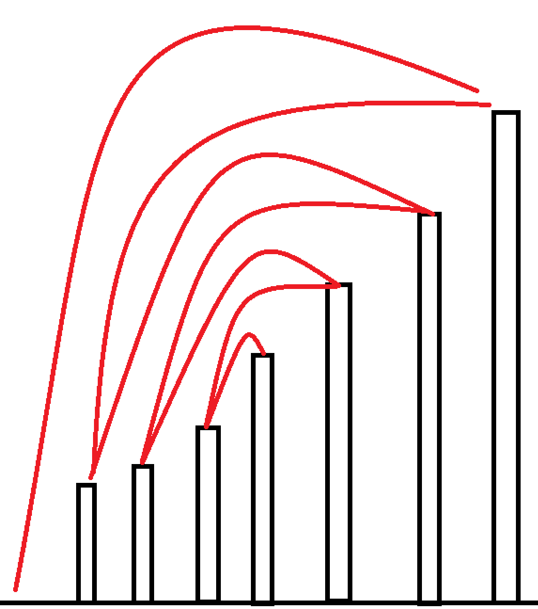

# 【深基12.例1】部分背包问题

## 题目描述

阿里巴巴走进了装满宝藏的藏宝洞。藏宝洞里面有 $N(N \le 100)$ 堆金币，第 $i$ 堆金币的总重量和总价值分别是 $m_i,v_i(1\le m_i,v_i \le 100)$。阿里巴巴有一个承重量为 $T(T \le 1000)$ 的背包，但并不一定有办法将全部的金币都装进去。他想装走尽可能多价值的金币。所有金币都可以随意分割，分割完的金币重量价值比（也就是单位价格）不变。请问阿里巴巴最多可以拿走多少价值的金币？

## 输入格式

第一行两个整数 $N,T$。

接下来 $N$ 行，每行两个整数 $m_i,v_i$。

## 输出格式

一个实数表示答案，输出两位小数

## 样例 #1

### 样例输入 #1

```
4 50
10 60
20 100
30 120
15 45
```

### 样例输出 #1

```
240.00
```

```c++
#include <bits/stdc++.h>

using namespace std;
const int N = 110;
int n, t;

struct node {
    int v, w;
    double t;

    bool operator<(const node &W) const {
        return t > W.t;
    }
} d[N];

int main() {
    cin >> n >> t;
    for (int i = 0; i < n; ++i) {
        scanf("%d%d", &d[i].v, &d[i].w);
        d[i].t = 1.0 * d[i].w / d[i].v;
    }
    sort(d, d + n);
    double ans = 0;
    for (int i = 0; i < n && t > 0; ++i) {
        if (t >= d[i].v) {
            t -= d[i].v;
            ans += d[i].w;
        } else {
            ans += t * d[i].t;
            t = 0;
        }
    }
    printf("%.2lf", ans);
    return 0;
} 
```

千万不要被题目给误导了，这道题是贪心。

所有金币都可以分开，也就是说只要按照性价比最高的取一定得到的价值最大。

性价比就是这堆金币的价值除以重量。

只需要把这n堆金币按性价比排序就行了。

然后依次遍历，如果背包中剩余可以拿的重量大于等于这堆金币的重量，就全拿，否则直接装满。

直接装满这里注意一下整型转浮点的细节就好了。


# 排队接水

## 题目描述

有 $n$ 个人在一个水龙头前排队接水，假如每个人接水的时间为 $T_i$，请编程找出这 $n$ 个人排队的一种顺序，使得 $n$ 个人的平均等待时间最小。

## 输入格式

第一行为一个整数 $n$。

第二行 $n$ 个整数，第 $i$ 个整数 $T_i$ 表示第 $i$ 个人的等待时间 $T_i$。

## 输出格式

输出文件有两行，第一行为一种平均时间最短的排队顺序；第二行为这种排列方案下的平均等待时间（输出结果精确到小数点后两位）。

## 样例 #1

### 样例输入 #1

```
10 
56 12 1 99 1000 234 33 55 99 812
```

### 样例输出 #1

```
3 2 7 8 1 4 9 6 10 5
291.90
```

## 提示

$n \leq 1000,t_i \leq 10^6$，不保证 $t_i$ 不重复。

当 $t_i$ 重复时，按照输入顺序即可（sort 是可以的）

```c++
#include <bits/stdc++.h>

using namespace std;
const int N = 1010;
int n;

struct node {
    int ti, num;

    bool operator<(const node &s) const {
        return ti < s.ti;
    }
} d[N];

int main() {
    cin >> n;
    for (int i = 0; i < n; ++i) scanf("%d", &d[i].ti), d[i].num = i + 1;
    sort(d, d + n);
    double ans = 0;
    for (int i = 0; i < n - 1; ++i) ans += d[i].ti * (n - i - 1);
    ans = ans / n;
    for (int i = 0; i < n; ++i) printf("%d ", d[i].num);
    puts("");
    printf("%.2lf", ans);
    return 0;
}
```

需要严谨的数学证明


# 凌乱的yyy / 线段覆盖

## 题目背景

快 noip 了，yyy 很紧张！

## 题目描述

现在各大 oj 上有 $n$ 个比赛，每个比赛的开始、结束的时间点是知道的。

yyy 认为，参加越多的比赛，noip 就能考的越好（假的）。

所以，他想知道他最多能参加几个比赛。

由于 yyy 是蒟蒻，如果要参加一个比赛必须善始善终，而且不能同时参加 $2$ 个及以上的比赛。

## 输入格式

第一行是一个整数 $n$  ，接下来 $n$ 行每行是 $2$ 个整数 $a_{i},b_{i}$ ( $a_{i}<b_{i}$ )，表示比赛开始、结束的时间。

## 输出格式

一个整数最多参加的比赛数目。

## 样例 #1

### 样例输入 #1

```
3
0 2
2 4
1 3
```

### 样例输出 #1

```
2
```

## 提示

对于 $20\%$ 的数据， $n \le 10$。

对于 $50\%$ 的数据， $n \le 10^3$。

对于 $70\%$ 的数据， $n \le 10^{5}$。

对于 $100\%$ 的数据， $1\le n \le 10^{6}$ ， $0 \le a_{i} < b_{i} \le 10^6$。

```c++
#include <bits/stdc++.h>

using namespace std;
const int N = 1e6 + 10;
int n;

struct node {
    int st, ed;

    bool operator<(const node &d) const {
        return ed < d.ed;
    }
} d[N];

int main() {
    cin >> n;
    for (int i = 0; i < n; ++i) scanf("%d%d", &d[i].st, &d[i].ed);
    sort(d, d + n);
    int last = -2e9, k = 0;
    for (int i = 0; i < n; ++i) {
        if (d[i].st >= last) {
            k++;
            last = d[i].ed;
        }
    }
    cout << k;
    return 0;
}
```

在一个数轴上有`n`条线段，现要选取其中`k`条线段使得这`k`条线段两两没有重合部分，问最大的`k`为多少。

最左边的线段放什么最好？

显然放右端点最靠左的线段最好，从左向右放，右端点越小妨碍越少

其他线段放置按右端点排序，贪心放置线段，即能放就放

个人的想法比较直白，只需要先将每一场比赛以结束时间排一次序，得到一个顺序的结构体数组，存储最前面一节课的下课时间，然后以结束时间为准，在这相同结束时间比赛中下，如果有比赛的开始时间小于等于记录的结束时间，直接参加比赛，然后计数，最后输出总次数就可以了。


# [NOIP2004 提高组] 合并果子 / [USACO06NOV] Fence Repair G

## 题目描述

在一个果园里，多多已经将所有的果子打了下来，而且按果子的不同种类分成了不同的堆。多多决定把所有的果子合成一堆。

每一次合并，多多可以把两堆果子合并到一起，消耗的体力等于两堆果子的重量之和。可以看出，所有的果子经过 $n-1$ 次合并之后， 就只剩下一堆了。多多在合并果子时总共消耗的体力等于每次合并所耗体力之和。

因为还要花大力气把这些果子搬回家，所以多多在合并果子时要尽可能地节省体力。假定每个果子重量都为 $1$ ，并且已知果子的种类 数和每种果子的数目，你的任务是设计出合并的次序方案，使多多耗费的体力最少，并输出这个最小的体力耗费值。

例如有 $3$ 种果子，数目依次为 $1$ ， $2$ ， $9$ 。可以先将 $1$ 、 $2$ 堆合并，新堆数目为 $3$ ，耗费体力为 $3$ 。接着，将新堆与原先的第三堆合并，又得到新的堆，数目为 $12$ ，耗费体力为 $12$ 。所以多多总共耗费体力 $=3+12=15$ 。可以证明 $15$ 为最小的体力耗费值。

## 输入格式

共两行。  
第一行是一个整数 $n(1\leq n\leq 10000)$ ，表示果子的种类数。  

第二行包含 $n$ 个整数，用空格分隔，第 $i$ 个整数 $a_i(1\leq a_i\leq 20000)$ 是第 $i$ 种果子的数目。

## 输出格式

一个整数，也就是最小的体力耗费值。输入数据保证这个值小于 $2^{31}$ 。

## 样例 #1

### 样例输入 #1

```
3 
1 2 9
```

### 样例输出 #1

```
15
```

## 提示

对于 $30\%$ 的数据，保证有 $n \le 1000$：

对于 $50\%$ 的数据，保证有 $n \le 5000$；

对于全部的数据，保证有 $n \le 10000$。

```c++
#include <bits/stdc++.h>

using namespace std;
typedef long long int LL;
const int N = 10010;
int n;
priority_queue<int, vector<int>, greater<> > q;

int main() {
    cin >> n;
    for (int i = 0; i < n; ++i) {
        int x;
        scanf("%d", &x);
        q.push(x);
    }
    LL ans = 0;
    while (q.size() > 1) {
        int f = q.top();
        q.pop();
        int ff = q.top();
        q.pop();
        ans += f + ff;
        q.push(f + ff);
    }
    cout << ans;
    return 0;
}
```

用小根堆

和排队接水那道题很像。

**小的数字被计算的次数多**是最优的贪心策略


# 小A的糖果

## 题目描述

小 A 有 $n$ 个糖果盒，第 $i$ 个盒中有 $a_i$ 颗糖果。

小 A 每次可以从其中一盒糖果中吃掉一颗，他想知道，要让任意两个相邻的盒子中糖的个数之和都不大于 $x$，至少得吃掉几颗糖。

## 输入格式

输入的第一行是两个用空格隔开的整数，代表糖果盒的个数 $n$ 和给定的参数 $x$。

第二行有 $n$ 个用空格隔开的整数，第 $i$ 个整数代表第 $i$ 盒糖的糖果个数 $a_i$。

## 输出格式

输出一行一个整数，代表最少要吃掉的糖果的数量。

## 样例 #1

### 样例输入 #1

```
3 3
2 2 2
```

### 样例输出 #1

```
1
```

## 样例 #2

### 样例输入 #2

```
6 1
1 6 1 2 0 4
```

### 样例输出 #2

```
11
```

## 样例 #3

### 样例输入 #3

```
5 9
3 1 4 1 5
```

### 样例输出 #3

```
0
```

## 提示

#### 样例输入输出 1 解释

吃掉第 2 盒中的一个糖果即可。

---

#### 样例输入输出 2 解释

第 2 盒糖吃掉 $6$ 颗，第 4 盒吃掉 $2$ 颗，第 6 盒吃掉 $3$ 颗。

---

#### 数据规模与约定

- 对于 $30\%$ 的数据，保证 $n \leq 20$，$a_i, x \leq 100$。
- 对于 $70\%$ 的数据，保证 $n \leq 10^3$，$a_i, x \leq 10^5$。
- 对于 $100\%$ 的数据，保证 $2 \leq n \leq 10^5$，$0 \leq a_i, x \leq 10^9$。

```c++
#include <bits/stdc++.h>

using namespace std;
typedef long long int LL;
const int N = 1e5 + 10;
int n, g[N], x;

int main() {
    cin >> n >> x;
    for (int i = 0; i < n; ++i) scanf("%d", &g[i]);
    LL ans = 0;
    for (int i = 0; i < n - 1; ++i) {
        if (g[i] + g[i + 1] > x) {
            ans += g[i] + g[i + 1] - x;
            if (g[i] + g[i + 1] - x < g[i + 1]) {
                g[i + 1] = g[i + 1] - (g[i] + g[i + 1] - x);
            } else {
                g[i + 1] = 0;
            }
        }
    }
    cout << ans;
    return 0;
}
```

我们要尽量吃掉第二个盒里的糖果。 处理好第一个分组后，来看第二个，因为第一个分组已经被处理好了，所以可以无视它，然后问题又变成了前一个问题。 以此类推就好了。

当第二个盒子不够吃的时候，其实不用更改第一个盒子的数据，因为用不到。


# 删数问题

## 题目描述

键盘输入一个高精度的正整数 $N$（不超过 $250$ 位），去掉其中任意 $k$ 个数字后剩下的数字按原左右次序将组成一个新的非负整数。编程对给定的 $N$ 和 $k$，寻找一种方案使得剩下的数字组成的新数最小。

## 输入格式

输入两行正整数。

第一行输入一个高精度的正整数 $n$。

第二行输入一个正整数 $k$，表示需要删除的数字个数。

## 输出格式

输出一个整数，最后剩下的最小数。

## 样例 #1

### 样例输入 #1

```
175438 
4
```

### 样例输出 #1

```
13
```

```c++
#include <bits/stdc++.h>

using namespace std;
int k;
string s;

int main() {
    cin >> s;
    cin >> k;
    if (k >= s.size()) {
        cout << 0;
        return 0;
    }
    while (k) {
        bool change = false;
        for (int i = 0; i < s.size() - 1; ++i) {
            if (s[i] > s[i + 1]) {
                s.erase(i, 1);
                k--;
                change = true;
                break;
            }
        }
        if (!change) break;
    }
    while (s.size() && s[0] == '0') s.erase(0, 1);// 去除前导0
    while (k) {
        s.erase(s.size() - 1, 1);
        k--;
    }
    if (s.size()) cout << s;
    else cout << 0;
    return 0;
} 
```

此题先看看思路：
如果是直接删掉最大的数字，很容易便可举出反例：
1529 1
如果直接删最大的9，结果为152，如果删掉5，结果为129，显然删掉5才是最佳答案。
再看一组数据：
141519 2
如果删最大的9，5，结果为1411，如果删掉4，5，结果为1119，显然删掉4，5才是最佳答案。
发现什么了吗？
先看第一组：
1  5  1  9
小大 小 大
留删 留 留
第二组：
1   4  1  5  1   9
小 大 小 大 小 大
留 删 留删 留 留
删掉的是“山峰”，也就是比后一个数大的数，且越靠前“山峰”越早删。
大体思路也就一句话：删除靠前的“山峰”。

另外，有几个坑不得不提：

1. 注意删除前导0（虽然它说每个数位都不为0，但是测试数据里面好像有这样的数据）。
2. 当把数删为0时，要输出0。

另外送大家几组数据（我就在此栽过跟头）：
   输入                       输出
133420 2                   120
1444 3                        1
20018 2                      1
10000 1                      0

1243865 1怎么删呢？如果你认为是删8，那就错了。如果删8，得124365，但如果删4，得123865，哪个更小呢？毫无疑问是后者吧。那如果是1244444 5呢？最后删到124就删不掉了，所以还有一个条件，如果删了一遍，删不掉，就删去最后一个。大概意思就是这样，由于这道题没有出现有0的情况，所以我在这里暂时不讨论，可以自己想想。
提供两组测试数据
输入：
20018 2
输出：
1
输入：
10000 1
输出：
0 


# 陶陶摘苹果（升级版）

## 题目描述

又是一年秋季时，陶陶家的苹果树结了 $n$ 个果子。陶陶又跑去摘苹果，这次他有一个 $a$ 公分的椅子。当他手够不着时，他会站到椅子上再试试。

这次与 NOIp2005 普及组第一题不同的是：陶陶之前搬凳子，力气只剩下 $s$ 了。当然，每次摘苹果时都要用一定的力气。陶陶想知道在 $s<0$ 之前最多能摘到多少个苹果。

现在已知 $n$ 个苹果到达地上的高度 $x_i$，椅子的高度 $a$，陶陶手伸直的最大长度 $b$，陶陶所剩的力气 $s$，陶陶摘一个苹果需要的力气 $y_i$，求陶陶最多能摘到多少个苹果。

## 输入格式

第 $1$ 行：两个数 苹果数 $n$，力气 $s$。

第 $2$ 行：两个数 椅子的高度 $a$，陶陶手伸直的最大长度 $b$。

第 $3$ 行~第 $3+n-1$ 行：每行两个数 苹果高度 $x_i$，摘这个苹果需要的力气 $y_i$。

## 输出格式

只有一个整数，表示陶陶最多能摘到的苹果数。

## 样例 #1

### 样例输入 #1

```
8 15
20 130
120 3
150 2
110 7
180 1
50 8
200 0
140 3
120 2
```

### 样例输出 #1

```
4
```

## 提示

对于 $100\%$ 的数据，$n\leq 5000$, $a\leq 50$, $b\leq 200$, $s\leq 1000$, $x_i\leq 280$, $y_i\leq 100$。

```c++
#include <bits/stdc++.h>

using namespace std;
const int N = 5010;
int a, b, n, s;

struct node {
    int x, y;

    bool operator<(node &t) const {
        return y < t.y;
    }
} d[N];

int main() {
    cin >> n >> s >> a >> b;
    for (int i = 0; i < n; ++i) scanf("%d%d", &d[i].x, &d[i].y);
    sort(d, d + n);
    int ans = 0;
    for (int i = 0; i < n && s; ++i) {
        if (d[i].y <= s && a + b >= d[i].x) {
            ans++;
            s -= d[i].y;
        }
    }
    cout << ans;
    return 0;
}
```

按照需要的力气大小排序，小的在前，大的在后，每次采摘的时候利用高度来判断能不能摘。

同样都是一个可以摘到的苹果，肯定是摘需要力气小的那个。


# [NOIP2018 提高组] 铺设道路

## 题目背景

NOIP2018 提高组 D1T1

## 题目描述

春春是一名道路工程师，负责铺设一条长度为 $n$ 的道路。 

铺设道路的主要工作是填平下陷的地表。整段道路可以看作是 $n$ 块首尾相连的区域，一开始，第 $i$ 块区域下陷的深度为 $d_i$ 。 

春春每天可以选择一段连续区间 $[L,R]$ ，填充这段区间中的每块区域，让其下陷深度减少 $1$。在选择区间时，需要保证，区间内的每块区域在填充前下陷深度均不为 $0$ 。 

春春希望你能帮他设计一种方案，可以在最短的时间内将整段道路的下陷深度都变为 $0$ 。

## 输入格式

输入文件包含两行，第一行包含一个整数 $n$，表示道路的长度。 第二行包含 $n$ 个整数，相邻两数间用一个空格隔开，第 $i$ 个整数为 $d_i$ 。

## 输出格式

输出文件仅包含一个整数，即最少需要多少天才能完成任务。

## 样例 #1

### 样例输入 #1

```
6   
4 3 2 5 3 5
```

### 样例输出 #1

```
9
```

## 提示

【样例解释】

一种可行的最佳方案是，依次选择： 
$[1,6]$、$[1,6]$、$[1,2]$、$[1,1]$、$[4,6]$、$[4,4]$、$[4,4]$、$[6,6]$、$[6,6]$。   

【数据规模与约定】

对于 $30\%$ 的数据，$1 ≤ n ≤ 10$ ；    
对于 $70\%$ 的数据，$1 ≤ n ≤ 1000$ ；     
对于 $100\%$ 的数据，$1 ≤ n ≤ 100000 , 0 ≤ d_i ≤ 10000$ 。

```c++
#include <bits/stdc++.h>

using namespace std;
const int N = 1e5 + 10;
int n, g[N];

int main() {
    cin >> n;
    for (int i = 1; i <= n; ++i) cin >> g[i];
    int ans = 0;
    for (int i = 1; i <= n; ++i) if (g[i] > g[i - 1]) ans += g[i] - g[i - 1];
    cout << ans;
    return 0;
}
```

我们的贪心策略是：
若`a[i]>a[i-1]`，计数器`sum+=a[i]-a[i-1]`

那么为什么这样贪心是对的呢

贪心证明：

假设现在有一个坑，但旁边又有一个坑

你肯定会选择把两个同时减1

那么小的坑肯定会被大的坑“带着”填掉

大的坑也会减少`a[i]-a[i-1]`的深度，可以说是“免费的”

所以这样贪心是对的

自己的理解：

1. 想象每次填坑的时候都从这个坑的左边开始填
2. 每次填坑的时候确保右边比它深坑都已经被填上了，这样就可以选择一个较长的区间，节省次数


# [USACO1.3]混合牛奶 Mixing Milk

## 题目描述

由于乳制品产业利润很低，所以降低原材料（牛奶）价格就变得十分重要。帮助 Marry 乳业找到最优的牛奶采购方案。

Marry 乳业从一些奶农手中采购牛奶，并且每一位奶农为乳制品加工企业提供的价格可能相同。此外，就像每头奶牛每天只能挤出固定数量的奶，每位奶农每天能提供的牛奶数量是一定的。每天 Marry 乳业可以从奶农手中采购到小于或者等于奶农最大产量的整数数量的牛奶。

给出 Marry 乳业每天对牛奶的需求量，还有每位奶农提供的牛奶单价和产量。计算采购足够数量的牛奶所需的最小花费。

注：每天所有奶农的总产量大于 Marry 乳业的需求量。

## 输入格式

第一行二个整数 $n,m$，表示需要牛奶的总量，和提供牛奶的农民个数。

接下来 $m$ 行，每行两个整数 $p_i,a_i$，表示第 $i$ 个农民牛奶的单价，和农民 $i$ 一天最多能卖出的牛奶量。

## 输出格式

单独的一行包含单独的一个整数，表示 Marry 的牛奶制造公司拿到所需的牛奶所要的最小费用。

## 样例 #1

### 样例输入 #1

```
100 5
5 20
9 40
3 10
8 80
6 30
```

### 样例输出 #1

```
630
```

## 提示

【数据范围】  
对于 $100\%$ 的数据：  
$0 \le n,a_i \le 2 \times 10^6$，$0\le m \le 5000$，$0 \le p_i \le 1000$

题目翻译来自 NOCOW。

USACO Training Section 1.3

```c++
#include <bits/stdc++.h>

using namespace std;
const int N = 5050;
int n, m;

struct node {
    int p, a;

    bool operator<(const node &w) const {
        return p < w.p;
    }
} d[N];

int main() {
    cin >> n >> m;
    for (int i = 0; i < m; ++i) scanf("%d%d", &d[i].p, &d[i].a);
    sort(d, d + m);
    int ans = 0, i = 0;
    while (n) {
        if (n >= d[i].a) {
            n -= d[i].a;
            ans += d[i].a * d[i].p;
        } else {
            ans += n * d[i].p;
            n = 0;
        }
        ++i;
    }
    cout << ans;
    return 0;
}
```

先从售价低的开始拿货，拿没了就找售价稍微高一点的拿货……


# [NOIP2007 普及组] 纪念品分组

## 题目描述

元旦快到了，校学生会让乐乐负责新年晚会的纪念品发放工作。为使得参加晚会的同学所获得 的纪念品价值相对均衡，他要把购来的纪念品根据价格进行分组，但每组最多只能包括两件纪念品， 并且每组纪念品的价格之和不能超过一个给定的整数。为了保证在尽量短的时间内发完所有纪念品，乐乐希望分组的数目最少。

你的任务是写一个程序，找出所有分组方案中分组数最少的一种，输出最少的分组数目。

## 输入格式

共 $n+2$ 行：

第一行包括一个整数 $w$，为每组纪念品价格之和的上限。

第二行为一个整数 $n$，表示购来的纪念品的总件数 $G$。

第 $3\sim n+2$ 行每行包含一个正整数 $P_i$ 表示所对应纪念品的价格。

## 输出格式

一个整数，即最少的分组数目。

## 样例 #1

### 样例输入 #1

```
100 
9 
90 
20 
20 
30 
50 
60 
70 
80 
90
```

### 样例输出 #1

```
6
```

## 提示

$50\%$ 的数据满足：$1\le n\le15$。

$100\%$ 的数据满足：$1\le n\le3\times10^4$，$80\le w\le200$，$5 \le  P_i  \le  w$。

```c++
#include <bits/stdc++.h>

using namespace std;
const int N = 3e4 + 10;
int n, w, g[N];

int main() {
    cin >> w >> n;
    for (int i = 0; i < n; ++i) cin >> g[i];
    sort(g, g + n);
    int i = 0, j = n - 1, ans = 0;
    while (j >= i && g[j] >= w) ans++, j--;
    while (j >= i) {
        if (g[i] + g[j] <= w) {
            ans++;
            i++;
            j--;
        } else j--, ans++;
    }
    cout << ans;
    return 0;
}
```

先找最大的，把单个超过限制价格的都单独一组。

然后开始双指针，如果最小最大的和超过了限制价格，那么大的那个单独一组，小的和第二大的开始比较


# 跳跳！

## 题目描述

你是一只小跳蛙，你特别擅长在各种地方跳来跳去。

这一天，你和朋友小 F 一起出去玩耍的时候，遇到了一堆高矮不同的石头，其中第 $i$ 块的石头高度为 $h_i$，地面的高度是 $h_0 = 0$。你估计着，从第 $i$ 块石头跳到第 $j$ 块石头上耗费的体力值为 $(h_i - h_j) ^ 2$，从地面跳到第 $i$ 块石头耗费的体力值是 $(h_i) ^ 2$。

为了给小 F 展现你超级跳的本领，你决定跳到每个石头上各一次，并最终停在任意一块石头上，并且小跳蛙想耗费**尽可能多**的体力值。

当然，你只是一只小跳蛙，你只会跳，不知道怎么跳才能让本领更充分地展现。

不过你有救啦！小 F 给你递来了一个写着 AK 的电脑，你可以使用计算机程序帮你解决这个问题，万能的计算机会告诉你怎么跳。

那就请你——会写代码的小跳蛙——写下这个程序，为你 NOIp AK 踏出坚实的一步吧！

## 输入格式

输入一行一个正整数 $n$，表示石头个数。

输入第二行 $n$ 个正整数，表示第 $i$ 块石头的高度 $h_i$。

## 输出格式

输出一行一个正整数，表示你可以耗费的体力值的最大值。

## 样例 #1

### 样例输入 #1

```
2
2 1
```

### 样例输出 #1

```
5
```

## 样例 #2

### 样例输入 #2

```
3
6 3 5
```

### 样例输出 #2

```
49
```

## 提示

#### 样例解释

两个样例按照输入给定的顺序依次跳上去就可以得到最优方案之一。

#### 数据范围
对于 $1 \leq i \leq n$，有 $0 < h_i \leq 10 ^ 4$，且保证 $h_i$ 互不相同。

对于 $10\%$ 的数据，$n \leq 3$；

对于 $20\%$ 的数据，$n \leq 10$；

对于 $50\%$ 的数据，$n \leq 20$；

对于 $80\%$ 的数据，$n \leq 50$；

对于 $100\%$ 的数据，$n \leq 300$。

```c++
#include <bits/stdc++.h>

using namespace std;
typedef long long int LL;
const int N = 330;
int n, h[N];

int main() {
    cin >> n;
    for (int i = 1; i <= n; ++i) cin >> h[i];
    sort(h, h + n + 1);
    LL ans = 0;
    int i = 0, j = n;
    while (i < j) {
        ans += abs(h[i] - h[j]) * abs(h[i] - h[j]);
        i++;
        if (i == j) break;
        ans += abs(h[i] - h[j]) * abs(h[i] - h[j]);
        j--;
    }
    cout << ans;
    return 0;
}
```



怎么折腾怎么来！