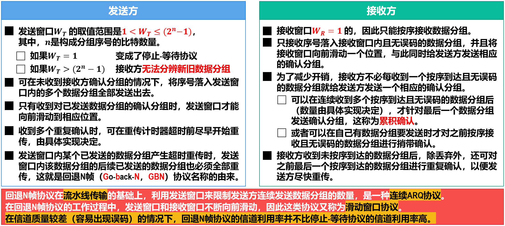
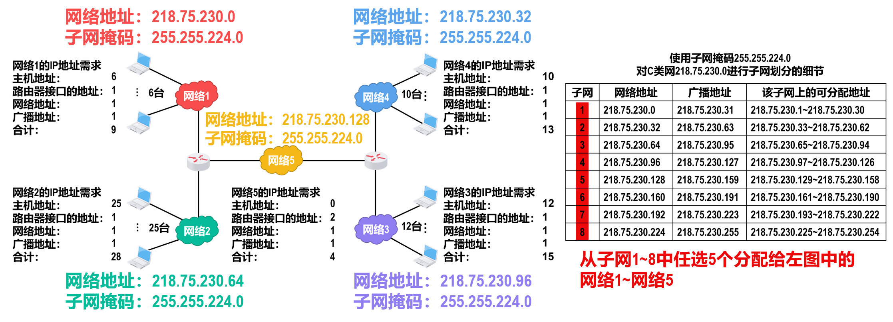
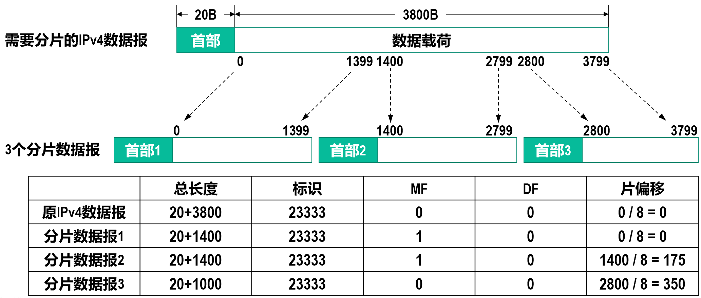
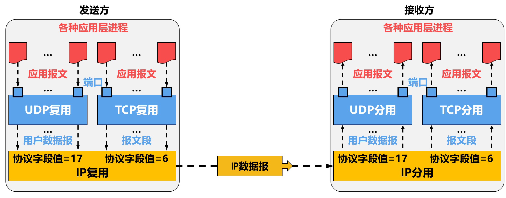
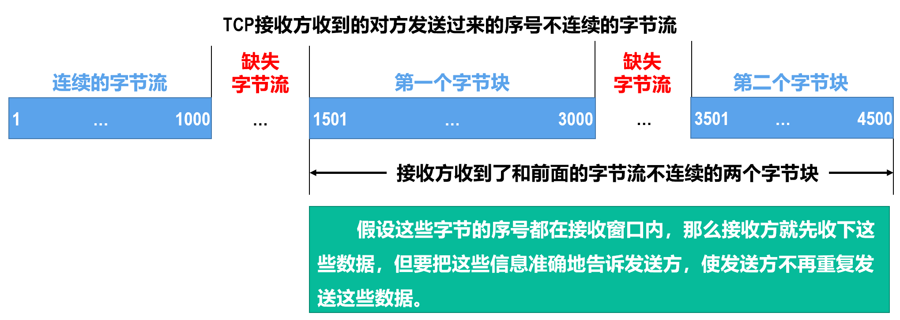

# 考试范围

说明：
下列为按教材章节标示的本次考试范围（不代表考研等其他考试）。
如果节（x.y）下面不列小节(x.y.z)，则该节的所有小节都包含；
如果节（x.y）下面列出小节(x.y.z)，则该节列出的小节包含，其他小节不包含；
PPT课件属于对应章节的就在范围内，不属于这些章节的PPT不考。

第1章 计算机网络和因特网
1.1 什么是因特网
1.2 网络边缘
1.3 网络核心
1.4 分组交换网中的时延、丢包和吞吐量
1.5 协议层次及其服务模型

第2章 应用层
2.1 应用层协议原理
2.2 Web和HTTP
2.2.1 HTTP概况
2.2.2 非持续连接和持续连接
2.2.3 HTTP报文格式
2.2.4 用户与服务器的交互：cookie
2.4 DNS：因特网的目录服务

第3章 运输层
3.1 概述和运输层服务
3.2 多路复用与多路分解
3.3 无连接运输：UDP
3.4 可靠传输原理
3.5 面向连接的运输：TCP
3.6 拥塞控制原理
3.7 TCP拥塞控制

第4章 网络层：数据平面
4.1 网络层概述
4.2 路由器工作原理
4.3 网际协议：IPv4、寻址、IPv6及其他

第5章 网络层：控制平面
5.2 路由选择算法
5.3 因特网自治系统内部的路由选择：OSPF
5.4 ISP之间的路由选择：BGP
5.6 ICMP：因特网控制报文协议

第6章 链路层和局域网
6.1 链路层概述
6.2 差错检测和纠正技术
6.3 多路访问链路和协议
6.3.1 信道划分协议
6.3.2 随机接入协议
6.3.3 轮流协议
6.4 交换局域网
6.7 回顾：Web页面请求的历程

# 第1章 计算机网络和因特网

## 什么是因特网

因特网为应用程序提供服务的基础设施。

因特网为应用程序提供编程接口（API）

- 应用程序连接到因特网上的通道
- 提供不同级别的服务选项
  - 服务方式
  - 服务质量

人类之间交流的语言（协议）

计算机之间交流的语言（协议）

- 语法
- 语义
- 同步

一个协议定义了在两个或者多个通信实体之间交换的报文格式和次序，以及报文发送和/或接收一条报文或其他事件所采取的动作。

### OSI

> 在计算机网络中，OSI指的是"开放系统互连"（Open Systems Interconnection）。
>
> OSI是一个由国际标准化组织（ISO）制定的网络参考模型，旨在定义计算机网络中不同层次的功能和协议。该模型将计算机网络的通信过程划分为七个不同的层次，每个层次都有其特定的功能和任务。每个层次在通信过程中通过接口与上下两个相邻层次进行交互。
>
> 以下是OSI模型的七个层次：
> 1. 物理层（Physical Layer）：处理物理介质上的比特传输，如电压、电流和光信号等。
> 2. 数据链路层（Data Link Layer）：提供可靠的数据传输，通过帧的形式将数据划分为数据块。
> 3. 网络层（Network Layer）：负责数据包的路由和转发，实现网络间的逻辑通信。
> 4. 传输层（Transport Layer）：提供端到端的可靠数据传输，负责数据分段、流量控制和错误恢复等。
> 5. 会话层（Session Layer）：建立、管理和终止会话连接，为应用程序之间的通信提供协调和同步。
> 6. 表示层（Presentation Layer）：处理数据的表示和转换，确保不同系统的数据格式能够互相理解。
> 7. 应用层（Application Layer）：提供应用程序与网络之间的接口，支持特定的网络应用和服务。
>
> OSI模型为不同厂商和组织开发网络设备和协议提供了一个通用的参考框架。尽管在实际网络中并不都严格遵循OSI模型的七层结构，但该模型仍然是理解计算机网络和协议的基础概念之一。

## 网络边缘

主机：客户端和服务器

数据中心的服务器

### 网络边缘的构成

端系统（主机）：运行应用程序，如：IE、Foxmail等

我们通常说的“服务器”（例如淘宝服务器）在网络结构中属于网络核心还是网络边缘？

> 一般情况下，我们通常将像淘宝服务器这样的服务器归类为网络边缘设备，而不是网络核心设备。
>
> 在计算机网络中，网络边缘指的是用户或终端设备连接到互联网或内部网络的地方。这包括个人计算机、智能手机、服务器、路由器等设备。边缘设备负责与用户进行交互，处理用户请求和提供服务。
>
> 相比之下，网络核心是指连接网络中各个边缘设备的主干网络部分。它由高速路由器、交换机和其他中央设备组成，用于传输数据和路由流量。**网络核心设备负责在边缘设备之间进行数据转发和路由决策。**
>
> 淘宝服务器作为提供服务的设备，处于网络边缘位置。它处理用户的请求、存储商品信息、处理交易等。虽然淘宝服务器可能连接到网络核心设备，但从角色和功能上来说，它更符合网络边缘设备的定义。
>
> 需要注意的是，这只是一种常见的分类方法，并不意味着所有服务器都只属于网络边缘。在复杂的网络架构中，可能会有一些服务器部署在网络核心，用于负载均衡、缓存、路由等关键功能。因此，在具体的网络环境中，服务器的位置可能会有所不同。

### 网络应用的通信模型

客户/服务器模型（C/S）：

- 客户：使用服务者
- 服务器：提供服务者

对等模型（P2P）

- 所有的主机同时承担服务器和客户机的双重身份

### 接入网的作用

将网络边缘与网络核心连接起来，通常是将端系统连接到边缘路由器上。

边缘路由器：端系统到任何其它远程端系统的路径上的第一台路由器。

> https://mooc1.chaoxing.com/mooc2/work/view?courseId=233435142&classId=74377116&cpi=200104603&workId=26168279&answerId=51539574&enc=d9c417f55a7cbac1551040040181cf84

**接入网是指将端系统物理连接到边缘路由器的网络**

**边缘路由器是指端系统到任何其它远程系统路径上的第一台路由器**

**ADSL是指：非对称数字用户线**

从构成因特网的硬件角度，因特网有以下哪几部分构成呢？

- 端系统
- 交换设备（路由器、链路层交换机等）
- 通信链路

因特网作为为应用程序提供服务的基础设施，以下那些说法是正确的？

- 因特网为应用程序提供网络编程接口（API）
- 因特网为应用程序提供数据交互服务
- 因特网能够为应用程序提供不同种类、不同质量的服务

网络协议包含下面的那些要素：

- 语义
- 语法
- 同步

网络应用程序的通信模型一般包括：

- C/S模型
- P2P模型
- 混合模型

### 接入的方式

家庭：Modem拨号/ADSL拨号/HFC/FTTH/卫星

企业：以太网/Wi-Fi

广域无线接入：3G/LTE/5G

#### Modem拨号

通过本地电话回路点对点连接ISP的拨号池（通常是路由器）

无法实现在上网的同时拨打电话

#### DSL：数字用户线

下行/上行速率最高可达55Mbps/15Mbps

- 频分复用：
  - 0kHz—4kHz：语音
  - 4kHz—50kHz：上行
  - 50kHz—1MHz：下行
- 带宽独享

#### 光纤同轴电缆混合网络HFC

HFC (Hybrid Fiber Coaxial Cable) 

下行/上行速率最高可达40Mbps/30Mbps

通过有线电视网络部署

带宽共享

#### 局域网接入

公司/大学的局域网 (LAN) 将端系统连接到边缘路由器

#### 无线接入

共享的无线接入网络连接端系统和路由器

- 通过基站（无线接入点）

#### 常用的物理媒体

导向媒体/非导向媒体

新型的物理媒体

物理媒体分类：

- 导引型媒体：信号沿着固体媒体被导引
- 非导引型媒体：信号自由传播

导引型媒体：

- 双绞线：两根互相绝缘的铜导线
  - 3类线：传统的电话线， 10Mbps以太网
  - 5类线：100Mbps以太网
  - 6类线：1Gbps以太网
- 同轴电缆
  - 双向传输
  - 基带
    - 电缆上单信道
    - 以太网
  - 宽带
- 光缆
  - 在玻璃光纤传播光脉冲，每一个脉冲一比特
  - 高速运行
  - 低误码率：中继器相隔很远； 不受电磁干扰

非导引型媒体：无线电

无线电的特性：

1. 通过电磁频谱传播信号
2. 没有物理“线路”
3. 双向传输
4. 传播受到环境影响

## 网络核心

路由器

网络的网络

基本问题：数据是怎样通过网络传输的？

第一代计算机网络——电路交换网络

- 数据交换前需建立起一条从发端到收端的电路（预留资源）
- 在数据交换的全部时间内用户始终占用端到端的固定传输信道
- 交换双方可实时进行数据交换而不会存在任何延迟

电路交换涉及到TDM、FDM

电路交换存在的问题：

- 计算机之间的数据交换往往具有突发性和间歇性特征，而对电路交换而言，用户支付的费用则是按用户占用线路的时间来收费的。
- 不够灵活。只要在通话双方建立的通路中的任何一点出了故障，就必须重新拨号建立新的连接，这对紧急和重要通信是很不利的。

第二代计算机网络--分组交换网络

数据截断划分成分组，由分组交换机（路由器）转发分组，使用链路最大传输速率传输。

分组传输的模式：存储转发传输

什么是存储转发：分组交换机（链路层交换机或路由器）将整个分组收下并存储，存储后再发出去

**为什么要存储后再转发**：校验

分组交换网络的特征：

- 数据分成若干分组分别传送
- 不必预先确定分组的传输路径
- 交换结点均为共享结点，选择路径
- 存储/转发
- 断续(动态)分配传输带宽
- 网状拓扑结构——提高可靠性
- 主干线路往往由一些高速链路构成

存储转发的效率及可靠性：

- 传输时延（发送时延）：将分组推向链路的时间，L/R，其中 R为链路带宽
- 排队时延：存储需要缓存，缓存的过程中可能需要排队（等待前面的分组处理）
- 分组丢失：缓存满，随即丢弃

## 分组交换网中的时延、丢包和吞吐量

### 时延

时延：在路由器缓存中的分组队列，分组到达输入链路的速率超出输出链路能力。

- 节点处理时延d~proc~
  - 检测比特差错
  - 确定输出链路
- 排队时延d~queue~
  - 在输出链路中等待被发送
  - 取决于路由器的拥塞程度
- 传输时延d~trans~
  - R=链路带宽 (bps)、L=分组长度 (bits)
  - 将分组比特流发送到链路上的时间 = L/R
- 传播时延d~prop~
  - d = 物理链路的长度
  - s = 媒体中的传播速度 (~2x10^8^ 米/秒)
  - 传播时延= d / s
  - 注意:传输时延和传播时延是两个完全不同的概念

假定:

- R=链路带宽 (bps)
- L=分组长度 (bits)
- a=平均分组到达速率

流量强度：La/R

- La/R ~ 0: 平均排队时延很小，甚至为0
- La/R < 1: 时延较小，且会随时间推延而变小
- La/R = 1: 时延不会变化，具体数值取决于当时队列长度
- La/R > 1: 平均时延较大，且随时间推延而趋于无穷！

### 丢包

缓存中队列的容量是有限的，当分组到达时队列已满，则分组被丢弃 (丢失)。丢失的分组可能会被前一个节点、源端系统重新传输，或者根本不重传。

### 吞吐量

两种吞吐量：

- 瞬时吞吐量：任何时刻接收文件的速率
- 平均吞吐量：接收整个文件的平均速率

瓶颈链路：在端到端路径上限制了端到端平均吞吐量的那一段链路。

## 协议层次及其服务模型

层次: 每个层次实现一种服务，即通过该层次自身的行为，其依赖下一层所提供的服务。

协议：控制报文的发送和接收。例如：TCP, IP, HTTP, FTP, PPP。

基本概念

实体(Entity)：实体是任何可以发送和接收信息的硬件和软件进程。通常是一个特定的软件模块。

对等体(Peer)：不同机器上包含对应层的实体称为对等体。

协议(Protocol)：

- 语法，即数据与控制信息的结构或格式。
- 语义，即需发现何种控制信息，完成何种动作以及做出何种应答。
- 同步，即事件实现顺序的详细说明。

服务(Service)：为保证上层对等体之间能互相通信，下层向上层提供的功能。

服务原语：指网络相邻层间进行交互时所要交换的一些必要命令。

服务访问点(SAP)：是同一系统中相邻两层的实体进行交互的地方。

协议数据单元(PDU)：是对等层次上传送数据的单位。

服务数据单元(SDU)：是层与层之间交换数据的单位。

网络体系结构(Network Architecture)：是层和协议的集合。

协议栈(Protocol Stack)：一个特定的系统所使用的一组协议（每层一个协议）称为协议栈。

> https://mooc1.chaoxing.com/mooc2/work/view?courseId=233435142&classId=74377116&cpi=200104603&workId=26432664&answerId=51551255&enc=6a3c97fd05305aea5d3cdfd9884cc1ed

网络协议主要是约束对等体之间通信行为的规范

网络协议的语义和语法主要体现为报文格式

所谓协议栈是指一个特定系统使用的一组协议

关于网络协议分层，以下说法正确的是：ABCD

A. 可能造成功能的重叠

B. 在特殊情况下，某一层的功能实现可能需要使用其它层的信息

C. 可以使系统具有更好的可扩展性

D. 一个层次可以仅对其他层次提供调用服务的接口，而隐藏实现服务的细节。

# 第2章 应用层

## 应用层协议原理

进程：在端系统运行起来的程序，一个程序可能产生多个进程

- 同一台主机上的不同多个进程之间的通信采用的是内部进程通信方式（操作系统决定）
- 不同主机之间的进程通信采用报文交换方式（应用层协议）

应用层协议 ≠ 网络应用

### 套接字socket

当新的网络应用程序Run起来后，就变成了网络应用进程。产生了如下问题：

- 当新的网络应用和其它网络应用共同运行在一台主机上时，如何把新的网络应用区分开来？
- 通信子网只负责把数据交付到主机，并不负责把数据交付到应用，主机如何知道数据该交付到哪个网络应用？
  - 操作系统（单机）是如何处理这些问题的

解决方法 “**套接字**（Socket）”

每个网络应用进程都有一个属于自己的套接字，该套接字在整个因特网上独一无二：

- 主机地址：标识该网络应用进程运行在因特网上哪一台主机上，通常使用32位的IP地址进行标识
- 端口地址：在该主机上标示该网络应用进程，通常使用16位的端口号进行标识
- 因此套接字的长度为48位

进程通过套接字来接收和发送报文。套接字相当于一个门，发送进程将报文”推出”门，发送进程依赖门另一边的传输基础设施（传输层及以下）来投递数据到接收进程的套接字

UDP的套接字由一个二元组（目的IP地址和目的端口号）来标识

TCP的套接字由一个四元组（源IP地址、源端口号、目的IP地址、目的端口号）来标识

UDP的一个服务器进程只用一个套接字跟所有客户端发送和接收数据

TCP的一个服务器进程跟每个客户端用不同的套接字发送和接收数据

### 传输服务

因特网运输层将所提供的服务整合成两类传输服务，你的网络应用使用哪一类传输服务，你该做出决定了！

TCP：

- 面向连接：在客户端和服务器进程之间需要建立连接
- 可靠传输：在发送和接受进程之间
- 流量控制：发送数据的速度决不超过接收的速度
- 拥塞控制：当网络超负荷时，束紧发送端口，减缓发送速度
- 不提供：实时性, 最小带宽承诺

UDP：

- 在客户端和服务器进程之间实现“不可靠的”数据传输
- 不提供：连接建立，可靠性保证，流量控制，拥塞控制，实时性，最小带宽承诺

### 安全性

TCP/UDP天生不具备安全性，如果你敢把密码以明文送给TCP/UDP，TCP/UDP就敢把明文送给网络

## Web和HTTP

**特别说明：WEB属于C/S模式**

HTML文件是Web页面的基础，它可以包括各种各样的对象，是一个容器对象，任何一个对象都可以用 URL来定位

## HTTP概况

协议：

- 信息表达的协议——HTML
- 信息传输的协议——HTTP

## 非持续连接和持续连接

- HTTP1.0的传输模式——非持久性连接
- HTTP1.1的新传输模式——持久连接
  - 非流水线方式：一个对象传输完成方能传输下一个
  - 流水线方式：可以一次性发送所有请求，慢慢接收

## HTTP报文格式

### HTTP请求行支持的方法

HTTP1.0 定义的方法：

- GET：向服务器请求指定URL的对象
- POST：
  - 用于向服务器提交表单数据
  - 也可以同时请求一个WEB页面
  - 特别注意：可以不使用POST方法，而使用GET方法发送表单数据以获取新的WEB页面。e.g. 搜索引擎
- HEAD：请求服务器返回一个响应报文，但是该报文中并不包含请求的对象。该方法常常用来进行故障跟踪。

HTTP1.1新定义的方法：

- PUT：上传的文件放在实体主体字段中，目标路径由URL字段标明
- DELETE：删除URL字段中指定的文件
- 另一种上传数据的方式：
  - 使用GET方法
  - 将需要上传的数据放到URL中

关于http响应报文，以下说法正确的是：ABCD

A. 状态码和状态短语表达的意思是一致的

B. 状态行和首部行构成了整个响应报文的首部

C. 空行作为http报文首部与数据部分的界限标志

D. 允许只有首部没有数据的http响应报文存在

Web中的cookie机制，有以下那些部分组成：ABCD

A. http请求报文中与Cookie相关的首部行

B. http响应报文中与Cookie相关的首部行

C. 由客户端负责管理的Cookie文件

D. 服务器后端的数据库系统

## 用户与服务器的交互：cookie

WEB站点使用Cookie的目的：

- 限制用户的访问
- 把内容和用户身份关联起来

Cookie技术的组成部分：

- 在HTTP响应报文中有一个Cookie首部行
- 在HTTP请求报文中也有一个Cookie首部行
- 在用户的端系统中保留了一个Cookie文件，由用户浏览器负责管理
- 在Web站点有一个后端数据库

## DNS：因特网的目录服务

IP 地址和域名之间如何映射(转换) ?为此设计了DNS系统，用于IP地址和域名之间的转换。

DNS是一个分布式数据库，由很多台DNS服务器按照层次结构组织起来

DNS运行在端到端系统上，且使用**UDP**协议（53号端口）进行报文传输，因此DNS是**应用层协议**

DNS以**C/S**的模式工作

DNS不直接和用户打交道，而是因特网的核心功能

严格的讲，本地DNS服务器其并不属于DNS层次结构中的一层

- 每一个网络服务提供商都会提供一个本地DNS服务器，有时候，我们将其称为“默认DNS服务器”
- 当一台主机需要做一个域名查询的时候，查询请求首先被发送到本地域名服务器
- 本地域名服务器的行为就像一个代理，它会向域名的层次体系中进行进一步的域名查询。

发起请求使用递归查询，后续解析为迭代查询

### DNS可提供的服务

1. 域名到IP地址的转换
2. 主机/邮件服务器别名
3. 负载均衡
   - 一个域名对应多个IP
   - DNS服务器在多个IP中进行轮转

### 攻击DNS服务器

- DDoS攻击
  - 通过ICMP Ping洪泛攻击根DNS服务器——难以成功
    - 根服务器通常配备分组过滤器
    - 大多数本地DNS服务器缓存了TLD DNS服务器的地址
  - 通过DNS请求报文洪泛攻击TLD DNS服务器
    - 难以过滤
- 重定向攻击
  - DNS劫持攻击——攻击者截获来自主机的请求并返回伪造的回答
  - DNS毒害攻击——攻击者想一台DNS服务器发送伪造的回答，诱使服务器在它的缓存中接收伪造的记录。
- 利用DNS服务器对目标主机采用DDoS攻击——反射攻击

# 第3章 运输层

## 概述和运输层服务

为不同主机上运行的应用进程之间提供逻辑通信(logical communication)。

运输层和网络层的区别：

- 网络层: 不同主机之间的逻辑通信
- 运输层: 应用进程之间的逻辑通信

因特网上的运输层协议：

1. 用户数据报协议UDP（数据报）
2. 传输控制协议TCP（报文段）

## 多路复用与多路分解

### 端口

端口的作用就是让应用层的各种应用进程都能将其数据通过端口向下交付给运输层，以及让运输层知道应当将其报文段中的数据向上通过端口交付给应用层相应的进程（或者线程）。

从这个意义上讲，端口是用来标志应用层的进程（或者线程）。

端口用一个 16 bit 端口号进行标志。

### 套接字

TCP 使用“连接”(而不仅仅是“端口”)作为最基本的抽象，同时将TCP 连接的端点称为套接字(socket) 。

套接字和端口、IP 地址的关系是：

### 报文段（数据报）的投送

主机收到IP包：

- 每个数据包都有源IP地址和目的IP地址
- 每个数据包都携带一个传输层的数据报文段
- 每个数据报文段都有源、目的端口号

主机根据“IP地址＋端口号”将报文段定向到相应的套接字。

对于UDP来说，发给同一个进程的数据，无论是从哪里来，都只用一个套接字来接收。

TCP 套接字由一个四元组来标识（一个连接一组套接字）：

`（源IP地址，源端口号，目的IP地址，目的端口号）`

接收方主机根据这四个值将报文段定向到相应的套接字。

服务器主机同时支持多个并发的TCP套接字：每一个套接字都由其四元组来标识。

Web服务器为每一个客户连接都产生不同的套接字，非持久HTTP对每一个请求都建立不同的套接字（会影响性能）。

## 无连接运输：UDP

**UDP通信事先无需握手，是无连接的**

### UDP处理数据的流程

发送方：

1. 从应用进程得到数据
2. 附加上为多路复用/多路分解所需的源和目的端口号及差错检测信息，形成报文段（数据报）
3. 递交给网络层，尽力而为的交付给接收主机

接收方：

1. 从网络层接收报文段（数据报）
2. 根据目的端口号，将数据交付给相应的应用进程

### UDP的优势

- 无需建立连接——建立连接会增加时延
- 简单——发送方和接收方无需维护连接状态
- 段首部开销小——TCP： 20 Byte  VS  UDP：8 Byte
- 无拥塞控制——UDP 可按需要随时发送

### 部分采用UDP协议的应用

- 远程文件服务器（NFS）
- 流式多媒体
- 因特网电话
- 网络管理（SNMP）
- 选路协议（RIP）
- 域名解析（DNS）

### UDP大量应用可能导致的严重后果

- 路由器中大量的分组溢出
- 显著减小TCP通信的速率，甚至挤垮TCP会话

### 使用UDP的可靠数据传输

在应用层实现数据的可靠传输，也就是应用程序特定的错误恢复。（增加了应用进程的实现难度）

### UDP的检验和

目标：检测收到的报文段的“差错” (例如, 出现突变的比特)。

发送方：

- 把报文段看作是16比特字的序列
- 检验和：对报文段的所有16比特字的和进行反码运算
- 发送方将校验和写入UDP检验和字段中

接收方：

- 计算接收到的报文段的和（包括发送方的校验和）
  - 不为全1--检测到错误存在
  - 为全1—没有检测到错误（但仍可能存在错误）

例子：将两个16比特字相加

**注意：最高有效位的进位要回卷加到结果当中**

**是否连首部一起校验？校验字段还没有计算出来呀！**

把检验和字段置为0

**接收方怎么校验？也用相同的方式计算一遍？但接收方收到的数据是包含校验和啊！**

接收方按直接相加的方式计算一遍，结果应该为全1

**有没有可能出现奇数字节的UDP数据包？这样的话最后一个字节该怎么计算？**

完全有可能，最后一个字节和一个全0的字节计算

**有没有可能出现奇数位（bit）的UDP数据包？这样的话又该怎么计算？**

完全不可能，应用层下来的数据一定是按字节的，所以首部是按字节统计长度的

## 可靠传输原理

**在应用层、运输层和链路层都很重要**

逐步地开发**可靠数据传输协议rdt**的发送方和接收方。

只考虑单向数据传输(unidirectional data transfer)的情况。

用**有限状态机FSM**来描述发送方和接收方。

可靠信道上的可靠传输——rdt 1.0

底层信道完全可靠：

- 不会产生比特错误
- 不会丢失分组

信道可能导致比特出现差错时——rdt 2.x

假设：

- 分组比特可能受损
- 所有传输的分组都将按序被接收，不会丢失

处理机制：

如何判断分组受损——差错检测：

- 如何通知发送方分组是否受损——接收方反馈（ACK和NAK）
- 在得知分组受损后，发送方如何处理——出错重传

如何实现重传？使用缓冲区缓存已发出但未收到反馈的报文段

需要多大的缓冲区呢？接收方和发送方各一个报文段大小的缓冲区即可

第二个版本——rdt 2.1

问题的引入：ACK和NAK分组可能受损，而rdt 2.0没有考虑该情况—2.0的一个致命的缺陷

解决问题的几种思路：

- 在人类的对话中，如果听不清楚对方所述，会回问一句“刚才你说什么来着？”但如果这句话仍然没有听清楚呢？怎么办？双方对着问“刚才你说什么来着？”这就可能进入了一个难以解困的死循环
- 增加足够的检查和比特，使发送方不仅可以检查比特差错，还可以恢复比特差错
- 收到出错的反馈时，不管三七二十一，直接重发当前数据分组
  - 怎么区分新旧数据？
  - 但这就需要对数据分组进行编号，以示识别

rdt 2.1：在具有比特差错信道上的有NAK的可靠数据传输协议

ACK和NAK损坏怎么办？

- 发送方不知道接收方的情况
- 不能只重传：重复接收

重复接收怎么办？

- 发送方重发——若收到被破坏的ACK或者NAK
- 为每一个数据报加上序号，接收方收到重复序号的数据则丢弃

第三个版本——rdt 2.2

针对rdt 2.1的改进：只使用ACK

如何通告“错”在哪里：取消NAK，接收方对最后一个正确收到的分组发送 ACK。（接收方必须明确指出被确认的分组的序号）

发送方收到的重复的ACK将按照NAK来进行处理：重传正确的分组

停等协议：发送方发送数据报之后等待接收方的响应

信道不但出错，而且丢包时——rdt 3.0

假设：底层信道不但可能出现比特差错，而且可能会丢包（data,ACK）

发生丢包后，如何处理：校验和技术、序号、ACK、重传

如何判断数据报丢失了呢？最简单的方法就是：耐心的等待！

rdt 3.0的性能分析：网络协议限制了物理资源的利用率！

rdt 3.0性能低下的原因：停等操作

提高性能的方法：流水线技术

问题：当流水线技术中丢失一个分组后，如何进行重传？

- Go-Back-N（GBN）协议：其后分组全部重传
- 选择重传（SR）协议：仅重传该分组

上述两种协议已经在后面高军老师课程中介绍过了，可以往后查看。

## 面向连接的运输：TCP

> https://mooc1.chaoxing.com/mooc2/work/view?courseId=233435142&classId=74377116&cpi=200104603&workId=27425809&answerId=51672344&enc=dae6d18a4334f7e169f4a4c5286c114d
>
> - 在rdt2.0中，接收方为了防止失序数据的到达，设置了多个缓冲区（错）
> - 假定主机A通过TCP向主机B发送大文件，如果当前连接的一个分组的序号为m，则下一个分组的序号必然是m+1（错）
> - 假定主机A通过TCP向主机B发送一个序号为64的4字节报文段，则主机B反馈的确认号必定是68（错）

### TCP报文段首部结构

源端口和目的端口字段——各占 2 字节。端口是运输层与应用层的服务接口。运输层的复用和分用功能都要通过端口才能实现。

序号字段——占 4 字节。TCP 连接中传送的数据流中的每一个字节都编上一个序号。序号字段的值则指的是本报文段所发送的数据的第一个字节在整个报文字节流中的序号。

确认号字段——占 4 字节，是期望收到对方的下一个报文段的数据的第一个字节的序号。

首部长度——占 4 bit，它指示意32bit的字为单位的TCP首部长度。若选项字段为空，TCP首部典型长度为20字节。

保留字段——占 6 bit，保留为今后使用，但目前应置为 0。

紧急比特 URG —— 当 URG = 1 时，表明紧急指针字段有效。它告诉系统此报文段中有紧急数据，应尽快传送。（一般不使用）

确认比特 ACK —— 只有当 ACK = 1 时确认号字段才有效。当 ACK = 0 时，确认号无效。

推送比特 PSH (PuSH) —— 接收 TCP 收到推送比特置 1 的报文段，就尽快地交付给接收应用进程，而不再等到整个缓存都填满了后再向上交付。

复位比特 RST (ReSeT) —— 当 RST = 1 时，表明 TCP 连接中出现严重差错（如由于主机崩溃或其他原因），必须释放连接，然后再重新建立运输连接。

同步比特 SYN —— 同步比特 SYN 置为 1，就表示这是一个连接请求或连接接受报文。

终止比特 FIN (FINal) —— 用来释放一个连接。当FIN = 1 时，表明此报文段的发送端的数据已发送完毕，并要求释放运输连接。

窗口字段 —— 占 2 字节。窗口字段用来控制对方发送的数据量，单位为字节。TCP 连接的一端根据设置的缓存空间大小确定自己的接收窗口大小，然后通知对方以确定对方的发送窗口的上限。

检验和 —— 占 2 字节。检验和字段检验的范围包括首部和数据这两部分。在计算检验和时，要在 TCP 报文段的前面加上 12 字节的伪首部。

紧急指针字段 —— 占 16 bit。紧急指针指出在本报文段中的紧急数据的最后一个字节的序号。

选项字段 —— 长度可变。TCP 只规定了一种选项，即最大报文段长度MSS (Maximum Segment Size)。MSS 告诉对方 TCP：“我的缓存所能接收的报文段的数据字段的最大长度是 MSS 个字节。”

MSS 是 TCP 报文段中的数据字段的最大长度。数据字段加上 TCP 首部才等于整个的 TCP 报文段。

填充字段 —— 这是为了使整个首部长度是 4 字节的整数倍。

### TCP超时的设置

如何设置TCP的超时？

应该大于往返时延RTT，但是RTT是随时变化的。

若超时时间设置太短：造成不必要的重传

若超时时间设置太长：对丢包反应太慢

$RTO = RTT_S  + 4 × RTT_D  $

### 可靠的TCP数据传输

IP协议是不可靠的

TCP采用了上面阐述的数据可靠传输的方法

特别之处：

- TCP编号采用按字节编号，而非按报文段编号
- TCP仅采用唯一（单一）的超时定时器
  - 假定每一个已发送但未被确认的报文段都与一个定时器相关联
  - 但定时器的管理需要相当大的开销

TCP的几种重传情况：

 产生TCP ACK的建议（RFC1122、2581）

### 快速重传

快速重传：在超时到来之前重传报文段

超时周期往往太长，增加重发丢失分组的延时

通过重复的ACK检测丢失报文段：

- 发送方常要连续发送大量报文段
- 如果一个报文段丢失，会引起很多连续的重复ACK

如果发送收到一个数据的3个ACK，它会认为确认数据之后的报文段丢失，此时进行快速重传：在超时到来之前重传报文段

TCP流量控制：略

## 拥塞控制原理

拥塞控制的方法：

- 网络辅助的拥塞控制
  - 直接网络反馈：路由器以阻塞分组的形式通知发送方“网络拥塞了”
  - 经由接收方的网络反馈：路由器标识从发送方流向接收方分组中的某个字段以指示拥塞的产生，由接收方通知发送方“网络拥塞了”
- 端到端拥塞控制
  - 网络层不为拥塞控制提供任何帮助和支持
  - 端系统通过对网络行为（丢包或时延增加）的观测判断网络是否发生拥塞
  - 目前TCP采用该种方法

## TCP拥塞控制

TCP拥塞控制为端到端拥塞控制

TCP进行拥塞控制的方法：

- 每个发送方自动感知网络拥塞的程度
- 发送方根据感知的结果限制外发的流量
  - 如果前方路径上出现了拥塞，则降低发送速率
  - 如果前方路径上没有出现拥塞，则增加发送速率

TCP拥塞控制需要解决的三个问题：

- TCP发送方如何限制外发流量的速率：拥塞窗口
- 发送方如何感知拥塞：
  - 超时
  - 三个ACK
- 在感知到拥塞后，发送方如何调节发送速率
  - 太快→拥塞崩溃
  - 太慢→带宽利用率低

TCP拥塞控制的具体过程看后面高军老师的讲解，这里仅仅做一点强调：

- 对收到3个重复ACK的反应
  - 将门限值和CongWin减为原来的一半
  - 线性增大拥塞窗口
- 对超时事件的反应
  - 门限值设为当前CongWin的一半（门限值初始值65kB）
  - 将CongWin设为1个 MSS大小
  - 窗口以指数速度增大
  - 窗口增大到门限值之后，再以线性速度增大

特别说明：早期的TCP Tahoe版本对上述两个事件并不区分，统一将CongWin降为1。实际上， 3个重复的ACK相对超时来说是一个预警信号，因此在Reno版中作了区分

发送端的发送窗口不能超过拥塞窗口 cwnd 和接收端窗口 rwnd 中的最小值。我们假定接收端窗口足够大，因此现在发送窗口的数值等于拥塞窗口的数值。

快速恢复（TCP推荐但非必须实现）

- 3个冗余ACK进入快速重传后
- 每收到一个冗余ACK：CongWin++
- 直至收到一个新的ACK：CongWin=门限值，重新进入拥塞避免
- 在进入快速恢复之后及重新进入拥塞避免之间，如果出现超时现象，直接按照前述超时事件进行处理

### TCP拥塞控制算法（Reno）总结

- 当 拥塞窗口CongWin 小于门限值Threshold时，发送方处于 **慢启动** 阶段，窗口以**指数速度增大**。
- 当 拥塞窗口CongWin 大于门限值Threshold时，发送方处于 **拥塞避免** 阶段，**窗口线性增大**。
- 当收到 3个重复的ACK 时，门限值Threshold设为拥塞窗口的1/2，而拥塞窗口CongWin设为门限值Threshold+3MSS ，收到新的ACK，则拥塞窗口CongWin设为门限值Threshold。
- 当 超时 事件发生时，门限值Threshold设为拥塞窗口的1/2，而拥塞窗口
  CongWin设为1个 MSS。

### TCP的吞吐量

> 在计算机网络中，TCP（传输控制协议）的吞吐量是指在一定时间内通过TCP连接传输的数据量。吞吐量通常以每秒传输的数据量来衡量，单位可以是比特/秒（bps）、千比特/秒（Kbps）、兆比特/秒（Mbps）或吉比特/秒（Gbps）等。
>
> TCP吞吐量的定义受到以下因素的影响：
>
> 1. 网络带宽：网络带宽是指网络连接的最大数据传输速率，以比特/秒为单位。较高的带宽意味着TCP连接可以在单位时间内传输更多的数据量，从而提高吞吐量。
>
> 2. 往返时延（Round-Trip Time，RTT）：RTT是指发送方发送数据到接收方并接收到确认消息的时间。较高的RTT会增加数据传输的延迟，从而影响吞吐量。
>
> 3. 拥塞控制：TCP的拥塞控制算法用于监测网络的拥塞程度，并调整发送数据的速率以避免网络拥塞。拥塞控制机制会根据网络的拥塞情况来调整发送方的发送速率，从而影响吞吐量。
>
> 4. 窗口大小：TCP使用滑动窗口机制来管理数据的传输。窗口大小决定了发送方可以在未收到确认消息之前发送的数据量。较大的窗口大小可以提高吞吐量，因为发送方可以发送更多的数据，而无需等待确认。
>
> 在实际计算吞吐量时，需要考虑上述因素。通常使用以下公式计算TCP吞吐量：
>
> 吞吐量 = 传输的数据量 / 传输时间
>
> 其中，传输的数据量可以是字节数、比特数或其他单位，传输时间可以是秒数或毫秒数。
>
> 需要注意的是，TCP吞吐量的实际值可能会受到网络环境、网络拥塞、协议延迟等因素的影响。此外，吞吐量也可以因应用程序的需求和网络配置的限制而有所不同。因此，在评估和测量TCP吞吐量时，应考虑到实际情况和相关因素。

作为窗口大小和RTT的函数TCP的平均吞吐量应该是什么样的？不考虑慢启动

假定当丢包事件发生时，窗口大小为 W，此时吞吐量为W/RTT

TCP吞吐量的进一步讨论

吞吐量是丢包率(L)的函数$\frac{1.22*MSS}{RTT\sqrt{L} } $

对于一条MSS=1500字节，RTT=100ms的TCP连接而言，如果希望达到10Gbps的吞吐量，那么丢包率L不能高于2x10^-10^

### TCP拥塞控制的公平性分析

#### 公平性的目标

如果K个TCP连接共享同一个带宽为R的瓶颈链路, 每个连接的平均传输速率为 $\frac{R}{K}$

#### TCP的公平性

> TCP（传输控制协议）是一种可靠的、面向连接的传输协议，它在计算机网络中广泛应用。然而，TCP协议在面对多个并发连接时，存在公平性问题。
>
> 公平性问题指的是当多个TCP连接共享网络带宽时，每个连接获得的带宽是否公平分配。在网络拥塞的情况下，带宽有限，如果某些连接获得过多的带宽，可能会导致其他连接的性能下降，造成不公平的现象。
>
> TCP公平性问题的主要原因是拥塞控制机制的设计。TCP使用拥塞控制算法来调整发送方的发送速率，以避免网络拥塞。其中，主要的拥塞控制算法是拥塞避免和拥塞恢复。
>
> 在拥塞避免阶段，TCP发送方根据网络的拥塞情况动态调整拥塞窗口的大小，从而控制发送速率。然而，这种拥塞控制算法是基于每个TCP连接独立运行的，而不考虑其他连接的存在。这可能导致某些连接获得过多的带宽，而其他连接的带宽受限，从而导致公平性问题。
>
> 此外，TCP还使用了拥塞控制的丢包恢复机制，即当检测到网络拥塞时，TCP会将发送速率减半。这种机制可能会导致某些连接过于保守地减小发送速率，从而浪费了带宽资源。
>
> 为了解决TCP的公平性问题，提出了一些改进的拥塞控制算法和流量调度算法。例如，基于TCP的拥塞控制算法如TCP Vegas和TCP CUBIC尝试更好地评估网络的拥塞程度，以提供更公平的带宽分配。此外，流量调度算法如公平队列调度（Fair Queuing）和公平带宽分享（Fair Bandwidth Sharing）也被用于在路由器和交换机等网络设备上实现公平性。
>
> 总之，TCP的公平性问题是指在多个并发连接共享网络带宽时，带宽是否公平分配的问题。这个问题主要源于TCP拥塞控制机制的设计，但可以通过改进的拥塞控制算法和流量调度算法来解决。

#### 公平性和UDP

多媒体应用一般不使用TCP，不希望因为拥塞控制影响其速率。

多媒体应用采用UDP，恒定的速率传输音频和视频数据，可容忍丢包。

# 第4章 网络层：数据平面

## 网络层概述

网络层在计算机网络中的地位：

- 为运输层提供支持
  - 运输层实现进程到进程的通信
  - 运输层功能的实现依赖于网络层提供的服务
- 为实现从源主机到目标主机成功的移动数据分组，整个路径上的每一台分组交换机（设备）上均需实现网络层

### 功能

**网络层实现主机到主机的通信。**

- 在全局范畴为主机之间的通信进行选路，选路的结果反映为分组交换机（设备）上的转发表 (控制层面）
- 分组交换机（设备）上的网络层根据转发表以及分组头部信息，将分组向适当链路进行转发（数据层面）

### 分组交换机（设备）的分类

根据链路层首部信息进行转发的——链路层节点交换机

根据网络层首部信息进行转发的——路由器

### 网络层可能提供的服务

确保交付：确保分组最终到达目的地

具有时延上界的确保交付：时延上限内交付

有序分组交付：以发送顺序到达

确保最小带宽：以低于特定比特率速率传输，分组不会丢失且会在预定时延内到达

确保最大时延抖动：连续分组间隔时间不超过特定值

安全性服务：机密性、完整性和源鉴别

### 网络层提供的服务

面向连接的服务——虚电路，需事先握手

面向无连接的服务——数据报，无需握手

### 网络层与运输层相应服务的区别

**网络层**是向运输层提供**主机到主机**的服务，而**运输层**是向应用层提供**进程到进程**的服务

网络层仅提供上述两种服务中的一种，不同时提供两种，而运输层则同时提供两种

**运输层的服务在网络边缘的端系统中实现**，而**网络层的服务则在整个网络中实现，含路由器**

### 虚电路

#### 目标

使收发双方之间的路径表现得如同电话线路一般。

#### 工作机制

- 数据开始流动之前，呼叫建立；流动结束后要断开
- 每一个分组携带虚电路的标识 (而不是目的主机的地址)
- 路径上的每一个路由器必须为进行中的连接维持连接状态信息
  - 传输层的连接仅涉及到两个端系统（end system）
- 链路, 路由器资源 (带宽、缓冲区) 可以分配给虚电路
  - 目的：为了达到类似线路交换的性能

#### 虚电路的组成

- 从源到目的主机的路径
  - 一系列链路和路由器
- VC 号，沿着该路径的每段链路的一个号码
  - 一条虚电路在每条链路上具有不同的VC号
  - 每台中间路由器必须用一个新的VC号替代每个传输分组的VC号
- 沿着该路径的每台路由器中的转发表
  - 创建一条新的虚电路，转发表增加一个新表项
  - 终止一条虚电路，表中相应项被删除

#### 信令协议

- 用于建立、维护以及断开虚电路
- 用于 ATM, 帧中继, X.25网络
- 今天的因特网已经不再使用该协议

### 数据报网络

在网络层没有连接建立过程

路由器：在端到端的连接中不维护连接状态信息

在网络层不存在“连接”的概念

传输报文时使用目的主机地址信息

同一对主机间的报文可能会走不同的路径

## 路由器工作原理

### 路由器的两个关键组成

- 运行路由算法\协议（RIP、OSPF、BGP）
- 从入口到出口的转发

### 分散式交换

按照给出的目的地址,使用输入端口的内存中存储的路由表，查找输出端口。

端口内容中的路由表是路由选择处理器计算和更新。

#### 最长前缀匹配

查找给定目标地址的转发表项时，请使用与目标地址匹配的最长地址前缀。

### 输入端口

如果输入端口的处理速率超过了交换结构的速率，输入端口就可能产生排队。

线头阻塞：在输入队列中排队的分组必须等待通过交换结构发送，因为它被位于线头的另一个分组阻塞了。

**输入缓冲区溢出可导致排队时延和丢包！**

> 在路由器中，线头阻塞（Head-of-Line Blocking）是指在队列中的某个数据包由于前面的数据包没有被及时处理而被阻塞的情况。当多个数据包进入路由器的输入队列或输出队列时，如果前面的数据包没有被处理完毕，后续的数据包就会被阻塞在队列中等待。
>
> 线头阻塞可以在路由器的输入队列和输出队列中发生。在输入队列中，当多个数据包到达路由器的输入接口并需要转发时，如果前面的数据包在进行路由选择、查找转发表或其他处理时花费了较长时间，后续的数据包就会被阻塞在输入队列中等待处理，从而造成线头阻塞。
>
> 在输出队列中，当多个数据包需要通过同一个输出接口发送时，如果前面的数据包在排队等待发送的过程中发生了阻塞，后续的数据包也会受到影响而被阻塞在输出队列中。
>
> 线头阻塞会导致延迟增加和吞吐量降低，因为被阻塞的数据包需要等待前面的数据包处理完成后才能继续转发。在高负载的网络环境中，线头阻塞可能会导致网络性能下降和传输延迟增加的问题。
>
> 为了缓解线头阻塞的影响，一些技术和算法被应用于路由器设计中，如使用多队列调度算法、使用优先级队列、增加缓冲区容量等，以提高并行处理能力和减少数据包在队列中的等待时间。

### 经内存交换

在输入端口和输出端口之间的交换是在CPU（路由处理器）的直接控制下完成的。

分组被拷贝到系统内存中，CPU提出报头中的目标地址，查找路由表中的输出接口，将数据包拷贝到输出接口。

转发速度受限于内存的带宽（吞吐量<带宽/2）。

一次转发一个分组。

### 经总线交换

输入端口经一根共享总线将分组直接传送到输出端口。

总线交换的问题：交换速度受限于总线的带宽。

### 经内联网络

克服总线带宽限制。

Banyan 网络：过去在多处理机计算机体系结构中用来互连多个处理器的网络。

设计先进：将长度变化的IP分组分片成固定尺寸的**信元**，通过交换结构对信元进行转发。

### 输出端口

缓存管理：当交换结构将分组交付给输出端口的速率超过输出链路速率时进行缓存管理。当通过交换结构到达的分组速率超过了输出链路的速率时，需要对分组进行缓存。

调度原则：在数据报队列中选择数据报进行传输。

**输出端口缓冲区溢出会导致分组的排队和丢失！**

### 路由器拥塞问题

**输出端口分组调度策略**

先来先服务FCFS（FIFO)

丢弃策略：
- 尾部丢弃：丢弃到达的数据包
- 优先级：按优先级丢弃/删除
- 随机：随机丢弃/移除

优先级排队：

- 发送最高优先级排队数据包。
- 多个类，具有不同的优先级。类别可能取决于标记或其他首部信息，例如 IP、端口等。

循环（RR）调度：

- 多个类
- 循环扫描不同类的队列，轮流给每个类发送数据包（如果有可用的数据包）

加权公平队列（WFQ）：

- 通用的循环排队（RR）
- 每个类在每个周期中获得一定数量的服务（根据权值）

## 网际协议：IPv4、寻址、IPv6及其他

### IP数据报的格式

###  IP分片和重组

网络链路具有 MTU (最大传输单位)属性——是由链路层最大帧的限制决定的。不同类型的链路有不同的MTU值。

重组只在目的主机进行，数据报头部的标识、标志以及片偏移字段用于目的主机对接收的分片进行重组。

### IP地址

32位主机或路由器的接口标志符，IP 地址只和接口有关, 而与主机、路由器却没有太多关联。

- 一般说来，路由器有多个接口
- 主机也有可能有多个接口

### IP地址的结构

### IP地址的表示方法

### 什么是子网

### IP地址的分类

路由器总是具有两个或两个以上的 IP 地址。路由器的每一个接口都有一个不同网络号的 IP 地址。

### 子网的划分

子网划分的方法：从主机号中借用一部分位数作为子网号。

### 子网掩码

作用：对外隐藏子网的存在，对内指示网络号和子网号的位置。

获得方法：通过在网络号的子网号相应的位置全置1，主机号相应的位置全置0，即可得到子网掩码。

### 网络地址和广播地址

(IP 地址) AND (子网掩码) = 网络地址

### 引入子网掩码后的寻址

采用子网掩码后，路由器的寻址过程将演变成一个两级寻址过程：

1. 检查分组目的IP地址中的网络号：若网络号不是本网络，则从路由表中找出相应的转发结点地址将其转发出去。
2. 检查子网号：当网络号是本网络时，路由器将检查子网号，向相应的子网转发此分组。

### 最长前缀匹配

使用 CIDR 时，路由表中的每个项目由“网络前缀”和“下一跳地址”组成。在查找路由表时可能会得到不止一个匹配结果。应当从匹配结果中选择具有最长网络前缀的路由：最长前缀匹配(longest-prefix matching)。网络前缀越长，其地址块就越小，因而路由就越具体。最长前缀匹配又称为最长匹配或最佳匹配。

### 层次编址—路由聚合

DHCP：动态主机配置协议

思考：DHCP工作在哪个层次？

> DHCP（Dynamic Host Configuration Protocol）是一种网络协议，用于自动分配IP地址和其他网络配置参数给连接到网络的主机。DHCP工作在计算机网络体系结构中的应用层。
>
> 应用层是计算机网络体系结构中的最高层，负责提供用户应用程序和网络之间的接口。DHCP作为一个应用层协议，使用UDP（User Datagram Protocol）作为传输协议，通过网络中的DHCP服务器和客户端之间的交互来完成IP地址的分配和配置。
>
> 具体而言，DHCP工作的过程如下：
> 1. 客户端发送DHCP发现消息（DHCP Discover），广播到网络中的所有DHCP服务器。
> 2. DHCP服务器收到DHCP发现消息后，回复DHCP提供消息（DHCP Offer），提供IP地址和其他网络配置参数。
> 3. 客户端接收到一个或多个DHCP提供消息后，选择其中一个DHCP服务器，发送DHCP请求消息（DHCP Request）来接受提供的IP地址和配置参数。
> 4. DHCP服务器收到DHCP请求消息后，发送DHCP确认消息（DHCP Acknowledgment）来确认客户端的请求，并提供最终的IP地址和配置参数。
>
> 通过DHCP协议，网络中的DHCP服务器可以动态地为主机分配IP地址，以及提供子网掩码、默认网关、DNS服务器等其他网络配置参数。这样可以大大简化了网络管理，减少了手动配置IP地址的工作量。
>
> 需要注意的是，DHCP协议虽然工作在应用层，但它和其他网络层协议（如IP协议）密切相关，通过网络层的UDP协议进行通信，并利用网络层的IP地址来实现DHCP服务器和客户端之间的交互。

### NAT

动机：本地网络只要使用一个IP地址就可以和外部网络相连。

不需要从 ISP处获得大批IP地址: 所有设备可以使用同一个 IP地址。

可以在不通知外部网络的情况下改变内网主机的IP地址。

即使改变了ISP也无须改变内网主机的IP地址。

内网主机对外网主机而言是不可见的、不可寻址的。（这也算是一项安全措施）

> NAT的具体过程：略
>
> https://www.bilibili.com/video/BV1NT411g7n6?p=65&vd_source=11579445a367b6624c1d123aa6f75a37

两类地址：

- 本地地址
- 全球地址

三种地址转换方式：

- 静态NAT：一个本地地址对应一个全球地址
- 动态NAT：一个全球地址对应多个本地地址
- 端口NAT：一个本地地址的端口对应到一个全球地址的端口

NAT转换表具有WAN端和LAN端

> 在计算机网络中，WAN和LAN是两个常用的术语，用来描述不同的网络范围和拓扑结构。
>
> WAN代表广域网（Wide Area Network），指的是连接广泛地理区域的计算机网络。WAN通常覆盖跨越城市、国家甚至全球的范围，并通过公共或专用的传输媒介（如电话线、光纤、卫星等）连接着远离的地理位置上的计算机和网络设备。WAN的目的是为不同地区的网络提供互联互通的能力，例如连接不同分支机构的企业网络、连接不同城市的互联网服务提供商等。
>
> LAN代表局域网（Local Area Network），指的是在相对较小的范围内连接设备的计算机网络。LAN通常限于一个建筑物、校园、办公室或某个地理区域。它使用局域网技术（如以太网）来连接计算机、服务器、打印机和其他网络设备，以实现高速数据传输和资源共享。LAN通常是私有网络，由一个组织或个人控制和管理。
>
> WAN和LAN之间有几个主要区别：
>
> 1. 范围：WAN覆盖的范围更大，跨越较长的地理距离，而LAN覆盖的范围相对较小，局限于特定的区域或场所。
>
> 2. 传输速度：由于WAN覆盖范围广且跨越较长距离，其传输速度通常较慢。而LAN通常提供更高的传输速度和带宽，适用于本地区域内的高速数据交换。
>
> 3. 管理控制：WAN通常涉及多个组织或服务提供商之间的协调，因此其管理和控制较为复杂。相比之下，LAN通常由单个组织或个人负责管理和控制。
>
> 需要注意的是，WAN和LAN并不是互斥的概念，而是描述了不同范围和拓扑结构的网络。在实际的网络环境中，可以通过互联网服务提供商的WAN连接来连接不同地理位置上的局域网，将局域网互连形成更大的网络。

NAT转换中存在的一个问题：NAT穿透

解决方案1：采用端口NAT，在路由器中静态的为服务器配置一条记录

解决方案2：通用即插即用UPnP

解决方案3：中继（用于Skype）

### 因特网控制报文协议ICMP

用于主机、路由器、网关之间交换网络层信息：

- 错误报告: 如主机、网络、端口、协议不可达等
- 回声请求/回答 (用于ping应用程序)

从体系结构而言，位于IP层之上：ICMP 报文封装在IP分组中。

ICMP 报文的种类有两种：

- ICMP 差错报告报文
- ICMP 询问报文

### IPv4面临的问题

- 地址空间消耗很快
- 首部长度不定（20-40字节），中间结点（路由器）需要消耗相当资源用于分组处理
- 缺少QoS
- 安全性不够高

### IPv6数据报格式

略

无检查和，中间结点无需计算

中间结点不再负责分片和重组，由端结点负责

首部长度固定，加速中间结点转发速度

### IPv6与IPv4不同之处

校验和: 为了节省路由器的处理时间，去掉了此功能

扩大的地址空间。IPv6 将地址从 IPv4 的 32 bit 增大到了128 bit

简单高效的40字节首部

改进的选项：不再是标准IP首部的一部分，可能出现在IPv6首部中由下一个首部指出的位置上。

允许协议继续扩充

支持即插即用（即自动配置）

支持资源的预分配

ICMPv6: 新版本的 ICMP

- 增加了消息的类型，比如”报文太大“。
- 增加了多播组管理功能

### IPv4到IPv6的迁移

设立标志日，统一迁移

双栈技术

- 新加入的设备支持IPv4/IPv6双协议栈
- 一段链路上，如果源和目标均支持IPv6，则使用IPv6进行通信
- 如果任一方不支持IPv6，则使用IPv4进行通信
- 可能会出现信息的丢失（流标号）

隧道技术

# 第5章 网络层：控制平面

## 路由选择算法

链路状态路由选择算法

距离向量路由选择算法

> 链路状态选路算法和距离向量选路算法是两种常见的路由选择算法，用于在计算机网络中确定数据包在网络中的传输路径。
>
> 1. 链路状态选路算法（Link State Routing Algorithm）：
>    - 描述：链路状态选路算法基于每个路由器了解整个网络拓扑的全局信息，每个路由器都维护有关网络中所有路由器和链路的信息。
>    - 工作原理：每个路由器将自己的链路状态广播给整个网络，以构建网络拓扑图。通过收集和处理链路状态信息，每个路由器计算出最短路径树（Shortest Path Tree），并使用该树确定到达目标网络的最佳路径。
>    - 示例协议：OSPF（Open Shortest Path First）就是一种常见的链路状态选路协议。
>
> 2. 距离向量选路算法（Distance Vector Routing Algorithm）：
>    - 描述：距离向量选路算法基于每个路由器只了解邻居路由器的距离向量信息，每个路由器只维护与其直接相邻的邻居路由器的距离信息。
>    - 工作原理：每个路由器周期性地向邻居路由器发送距离向量信息，邻居路由器将其接收到的信息与自身的距离向量信息进行计算和更新。通过不断交换和更新距离向量信息，每个路由器最终能够计算出到达目标网络的最佳路径。
>    - 示例协议：RIP（Routing Information Protocol）和BGP（Border Gateway Protocol）就是常见的距离向量选路协议。
>
> 需要注意的是，链路状态选路算法和距离向量选路算法在工作原理和实现方式上有所不同，它们在路由计算和信息交换的方式上有不同的优缺点。具体选择哪种算法取决于网络规模、性能要求和特定的应用场景。

层次路由：自治系统

## 因特网自治系统内部的路由选择：OSPF

## ISP之间的路由选择：BGP

> 在计算机网络中，iBGP（Interior Border Gateway Protocol）和eBGP（Exterior Border Gateway Protocol）是两种不同的BGP（Border Gateway Protocol）扩展。
>
> 1. iBGP（Interior Border Gateway Protocol）：iBGP是在自治系统（AS）内部运行的BGP协议。一个自治系统是一个具有统一的路由政策的网络，由一组路由器组成。iBGP主要用于在同一个自治系统内的不同路由器之间交换路由信息。iBGP确保在自治系统内的所有路由器之间传播BGP路由信息，以便它们可以共享完整的路由表。
>
> 2. eBGP（Exterior Border Gateway Protocol）：eBGP是自治系统之间运行的BGP协议。当两个自治系统相互连接时，它们使用eBGP来交换路由信息。eBGP用于在不同自治系统之间传递路由信息，以实现跨网络的路由选择。eBGP负责将路由信息从一个自治系统传播到另一个自治系统，并确保自治系统之间的路由可达性。
>
> 总结：
> - iBGP是在自治系统内部运行的BGP协议，用于自治系统内的路由器之间交换路由信息。
> - eBGP是自治系统之间运行的BGP协议，用于不同自治系统之间的路由信息交换。

## ICMP：因特网控制报文协议

# 第6章 链路层和局域网

**目标**

- 了解链路层服务的原则：
  - 错误检测，校正
  - 共享广播信道：多址访问
  - 链路层寻址
  - 局域网：以太网，VLAN
- 实例化，各种链路层技术的实现

## 链路层概述

### 术语

节点：主机和路由器

链路：沿着通信路径连接相邻节点的通信信道

- 有线链路
- 无线链路

链路层帧：链路层的PDU

### 链路层的主要功能

负责将数据报通过链路从一个节点传输到物理上相邻的节点。

### 特别说明

- 数据报在不同链路上可能由不同的链路层协议进行处理。

例如：第一段链路上由PPP处理，最后一段链路上由以太网处理，中间链路上由广域链路层协议处理

- 不同的链路层协议可能提供不同的服务

例如：可靠传递、不可靠传递

### 链路层提供的服务

#### 成帧

将数据加上头部和尾部，封装成数据帧

帧头部用MAC地址标识源和目的（不同于IP地址）

#### 链路接入

共享介质的信道访问

#### 可靠交付

很少用于误码率低的链路（光纤、双绞线链路）

用于误码率高的链路（无线链路）

思考：为何运输层和链路层都要提供可靠数据传输

> 在计算机网络中，运输层和链路层都有提供可靠数据传输的需求，但出于不同的目的和层次。
>
> 1. 运输层（Transport Layer）：
>    - 目的：运输层的主要目的是在通信的源端和目的端之间提供可靠的端到端数据传输服务。它负责将数据分割为适当的大小并进行传输，确保数据的正确性、顺序性和完整性。可靠传输服务对于许多应用程序是至关重要的，例如文件传输、电子邮件和网页浏览等。
>
> 2. 链路层（Link Layer）：
>    - 目的：链路层的主要目的是在相邻节点之间提供可靠的数据传输服务。它负责将数据帧从一个节点传输到另一个节点，并处理数据帧的错误、丢失和重复等问题。链路层的可靠传输主要是为了解决物理链路上的传输问题，例如噪声、干扰和传输错误。
>
> 需要同时在运输层和链路层提供可靠数据传输的原因包括：
> 1. 端到端可靠性：运输层的可靠传输确保了端到端通信的可靠性，保证数据在源和目的地之间的正确传输。链路层的可靠传输则确保了相邻节点之间的可靠数据传输。
> 2. 不同层次的需求：运输层和链路层处于网络协议栈的不同层次，各自负责不同的功能和服务。可靠数据传输是它们各自职责范围内的一个重要方面，以满足各自层次的需求。
> 3. 不同层次的错误处理：运输层和链路层面临的错误类型和处理方式不同。运输层主要处理端到端的传输错误，例如丢失、重复、顺序混乱等。链路层主要处理物理链路上的传输错误，例如比特错误和噪声干扰。
>
> 虽然在两个层次都提供可靠数据传输会带来一定的性能开销，但在许多应用中，数据的可靠性是至关重要的。通过运输层和链路层的可靠传输机制，网络能够提供高质量的数据传输服务，确保数据的可靠性和完整性。

#### 差错检测和纠正

信号衰减和电磁干扰噪声导致出错

接收方检测到错误存在：给发送方发送信号要求重传或丢弃该数据帧，或者接收方检测和纠正帧中错误，不用重传

#### 流量控制

在相邻的收发节点间限制流量

#### 半双工和全双工

半双工时，链路两端的节点都能传输分组，但不能同时传输

#### 适配器通信

适配器通信存在于每一台设备上（主机、交换机、路由器）

链路层在“适配器”（网卡NIC）或者芯片上实现

网卡直接与主机的系统总线相连，和其它连接主机的I/O设备相同，是硬件、软件和固件的结合体

适配器是半自治单元，向上提交数据时，需要节点干预，最终受控于节点。

帧的接收和发送、检错、丢弃均是自主进行。

> 这句话的意思是，在计算机网络中，网络适配器（Network Adapter）是一种半自治单元。当网络适配器向上层（更高层）提交数据时，需要节点（例如操作系统或网络协议栈）进行干预和处理。
>
> 具体解释如下：
> - 网络适配器是计算机与网络之间的接口设备，负责将数据从计算机系统传输到网络中，或者从网络中接收数据并传递给计算机系统。它通常由硬件和相关的驱动程序组成，实现网络通信的功能。
> - 半自治单元表示网络适配器在某种程度上具有一定的自主性，能够执行一些本地的网络操作，例如物理层的数据传输和链路层的处理。
> - 当网络适配器向上提交数据时，即将数据传递给更高层的节点（例如操作系统的网络协议栈），需要节点进行干预和处理。这是因为更高层的节点负责实现网络协议、数据处理和应用程序的逻辑，需要对数据进行解析、分析、转发或传递给相应的应用程序。
>
> 因此，这句话的含义是指网络适配器在将数据传递给更高层的节点之前，需要节点对数据进行处理和干预，以便进行适当的网络协议操作和数据处理。这种干预和处理的方式可以根据具体的网络协议和系统实现而有所不同。
>
> 在上述上下文中，"节点"指的是网络协议栈中的某个组件或实体，它负责处理来自网络适配器的数据、执行网络协议操作，并将数据传递给更高层的组件或应用程序。这样的节点可以是操作系统的网络协议栈、网络中的路由器或其他设备，具体取决于讨论的背景和上下文。

### 链路层在何处实现

发送方：

在一个帧内封装数据报，增加差错检测位，可靠交付，流量检测等。

接收方：

查找错误，可靠交付，流量控制等。查找错误，可靠交付，流量控制等。

## 差错检测和纠正技术

### 差错检测模型

EDC= Error Detection and Correction bits 差错检测和纠错比特

差错检测不是100%可靠的，EDC越长，则出错的概率越低！

D = Data 差错检测位保护的数据，可包括首部

### 奇偶校验

#### 单比特奇偶校验

#### 二维奇偶校验

### 检验和方法

目标：检测发送包中的“错误”（例如，翻转位）（注：仅用于运输层）

发送方：

- 将数据段的内容作为16比特的整数序列
- 校验和：累加求和，计算和的1的补码发送方将得到的校验和值放入**PDU校验和**字段

接收方：

- 计算收到的数据段的校验和
- 检查计算出的校验和与校验和字段中的值是否相同：
  - NO – 检测到错误
  - YES – 没有检测错误（不代表没有错误）

特别注意：仅用于TCP、UDP和IPv4协议中

> 在计算机网络中，数据链路层中的“因特网检查和”是指对数据链路层帧中的数据进行校验和计算和验证的操作。
>
> 校验和是一种简单的错误检测机制，用于检测数据在传输过程中是否发生了错误或损坏。在数据链路层中，发送方计算校验和并将其添加到帧的尾部。接收方接收到帧后，会重新计算校验和，并将计算结果与帧中的校验和进行比较。如果两者匹配，说明数据在传输过程中没有发生错误；如果不匹配，则说明数据可能在传输过程中出现了错误或损坏。
>
> 通过校验和的计算和验证，可以帮助数据链路层检测并丢弃错误的帧，以确保数据的可靠性和完整性。这对于保证数据在物理链路上的正确传输非常重要，尤其是在面对可能的传输错误和噪声干扰时。

### 循环冗余检测

## 多路访问链路和协议

两种链路：

- 点到点链路
  - PPP、HDLC
  - 以太网交换机和主机之间的点到点链路
- 广播链路（共享线路或介质）
  - 传统以太网
  - 802.11无线LAN
  - HFC

### 广播链路的特点

- 单个共享广播信道
- 两个或多个节点同时传输：相互干扰。碰撞：一个节点同时收到两个或多个信号

### 多路访问协议

分布式算法决定节点如何共享信道，如节点何时可以传输数据

特别注意：有关共享信道的通信（协商）需使用信道本身，没有额外的信道来进行协调

> 在计算机网络中，多路访问协议（Multiple Access Protocol）指的是一组协议和技术，用于在共享媒体或网络中，允许多个节点同时访问传输介质并进行通信的方式。
>
> 在计算机网络中，当多个节点共享同一个传输介质（如以太网或无线信道）时，需要使用多路访问协议来协调节点之间的访问，以避免冲突和碰撞，确保数据的正确传输。
>
> 常见的多路访问协议包括以下几种：
> 1. CSMA/CD（Carrier Sense Multiple Access with Collision Detection）：用于以太网等共享介质网络，节点在发送数据前先监听信道，如果检测到信道空闲，再发送数据，若发生冲突则进行碰撞检测并进行退避重传。
> 2. CSMA/CA（Carrier Sense Multiple Access with Collision Avoidance）：用于无线局域网（如Wi-Fi），通过采用随机退避机制和预定时间间隙来避免碰撞。
> 3. TDMA（Time Division Multiple Access）：在时分多路复用的基础上，将时间分割为多个时隙，不同节点在不同的时隙中进行数据传输。
> 4. FDMA（Frequency Division Multiple Access）：在频分多路复用的基础上，将频率划分为多个不重叠的子频带，不同节点使用不同的频带进行通信。
> 5. CDMA（Code Division Multiple Access）：采用编码技术，使得不同节点的数据能够同时传输并在接收端进行区分和恢复。
>
> 这些多路访问协议在不同的场景和网络类型中应用广泛，它们提供了有效的方法来实现多个节点之间的共享访问和数据传输。

对于信道为速率为R b/s的广播信道，理想的多址访问协议需满足：

- 当只有一个节点有数据发送时，该节点的吞吐量为R
- 当M个节点有数据发送时，每个节点吞吐量为R/M
- 分散
  - 没有特定节点用于调整传输
  - 没有时钟同步
- 简单

### 多址访问协议的分类

信道划分协议：

- 将信道划分成小的“片”（时隙、频率、编码）
- 将“片”分配给节点使用

随机接入（访问）协议：

- 信道没有被分割，允许碰撞
- 碰撞恢复

轮流协议：

- 节点轮流传送，但数据量大的节点轮流更长时间

### 信道划分协议

#### TDMA

#### 统计时分复用STDM

**在计算机网络中，统计时分复用（Statistical Time Division Multiplexing，STDM）和时分复用（Time Division Multiplexing，TDM）是两种不同的复用技术，它们有一定的联系和区别。**

联系：

1. 复用原理：STDM和TDM都是利用时间分割的原理来实现多路复用。
2. 复用目的：它们的目标都是将多个低速信道或数据流合并成一个高速信道或数据流，以提高带宽利用率和传输效率。

区别：

1. 分配方式：TDM是固定时分复用，将时间划分为固定的时隙，每个时隙分配给特定的通信信道或数据流。而STDM是动态时分复用，根据通信信道或数据流的实际需求，在时隙内根据需求分配时间片段，实现灵活的资源分配。
2. 空闲利用：TDM中，即使在某个时隙中没有数据传输，该时隙仍然会被保留给对应的通信信道。而STDM中，空闲时隙可以被其他通信信道使用，提高了带宽的利用率。
3. 管理和调度：TDM需要严格的时钟同步来确保各个时隙的准确分配和传输。STDM使用动态的资源分配算法，根据实时需求进行管理和调度。

虽然STDM和TDM有一些共同之处，但它们在分配方式、资源利用和调度等方面存在显著的区别。STDM相对于TDM更为灵活，能够更高效地利用带宽，并根据实际需求动态分配资源。

#### FDMA

信道按频谱分成若干频段

每个节点分配固定频段

在频段不用时该部分信道被闲置和浪费

### 随机接入协议

当节点有数据发送时：

- 以信道全部速率R传输
- 没有主节点起协调作用

两个或多个节点传送时：

- 碰撞

随机访问协议解决可能发生的碰撞问题，包括两个方面：

- 如何检测碰撞
- 如何从碰撞中恢复（如：延时后重传）

随机访问协议举例：

- ALOHA、时隙ALOHA
- CSMA，CSMA/CD，CSMA/CA

#### ALOHA

ALOHA网的特征：

- 因群岛位置的散布，网络拓扑采用了**星型结构**；
- 为节省费用和易于组网，网络中各站点的通信采用了**无线传输介质**。
- 由于采用无线电信道，考虑到无法申请更多的频率点，因而所有站点都使用**统一的频率**通过主机交换信息。

##### 时隙ALOHA

假定：

- 所有的帧大小相同
- 时间被划分为相同大小的时隙，一个时隙等于传输一帧的时间
- 节点只在时隙的开始传输帧
- 节点被同步
- 若有两个或多个节点在一个时隙内传送，则所有节点都能在该时隙内检测到冲突

操作：

- 当节点有新的帧发送，它等到下一个时隙发送
- 若没有碰撞，节点能在下一时隙传送完新帧
- 若有碰撞，节点以概率p在后续的每一个时隙重传该帧

优点：

- 单个活动节点能以全速R连续传输
- 高度分散：时隙只在节点同步
- 简单

缺点：

- 碰撞，浪费时隙
- 时隙空闲
- 节点需要在分组传送时间以内检测到碰撞
- 时钟同步

效率 ：当有大量活动节点、每个节点总有大量帧发送、长期运行时成功时隙的份额

假定 N 个节点有大量帧发送，每个节点在每个时隙传送帧的概率为p

一个给定节点成功传送的概率为p(1-p)^N-1^

任意一个节点成功的概率= Np(1-p)^N-1^

为获得N个节点的最大效率，需要找到使Np(1-p)^N-1^最大化的p

当N趋于无穷时，求Np*(1-p*)^N-1^的极限, 得到最大效率为 1/e = 0.37

最佳情况: 信道使用率只有37%!

**如果没有抢到时隙的开始发送，就意味这要等待整个时隙**

> 时隙的目的是什么？

##### 纯ALOHA

非时隙ALOHA：简单，不需同步

当帧首次到达，节点立刻传送

碰撞可能增加

t~0~ 时刻发送的帧与 [t~0-1~,t~0+1~]之内发送的帧碰撞

纯ALOHA的工作效率：

P(给定节点成功概率) = P(给定节点传送)×P(在[t0-1，t0]没有其它节点传送)×P(在[t0，t0+1]没有其它节点传送)

​									= p×(1-p)^N-1^×(1-p)^N-1^

​									= p×(1-p)^2(N-1)^

选择最合适p，n趋于无穷，取极限 = 1/(2e) = 0.18

> 在计算机网络中，ALOHA（亦称随机接入）和CSMA（载波侦听多路访问）是两种常见的访问控制协议，用于解决多个设备共享同一网络媒介时的冲突问题。它们的主要区别如下：
>
> 1. 碰撞检测：ALOHA和CSMA使用不同的碰撞检测机制。在ALOHA中，发送方发送数据后，会立即进行碰撞检测，如果检测到碰撞，则采取退避重传策略。而CSMA使用载波侦听机制，在发送前先侦听媒介上是否有其他设备正在发送数据，如果侦听到载波（即有设备在发送），则等待一段时间再发送，以避免碰撞。
> 2. 随机性：ALOHA是一种纯粹的随机接入协议。当设备准备发送数据时，它会随机选择一个时间窗口进行发送。如果发生碰撞，设备会等待随机的时间后再次尝试发送。而CSMA引入了持续侦听机制，设备会在侦听到载波时等待一段随机的时间，然后再次侦听，如果媒介仍然被占用，则继续等待。
> 3. 效率：由于ALOHA的随机性较高，可能导致碰撞较多，从而降低网络效率。而CSMA的载波侦听机制能够提高效率，因为设备在发送前会先侦听媒介上是否有其他设备发送数据。

> ALOHA和CSMA都是用于计算机网络中的媒体访问控制协议。
>
> ALOHA协议是一种最简单的媒体访问控制协议，它允许任何节点在任何时候发送数据帧，而不考虑其他节点的活动。如果两个或更多个节点同时发送数据帧，则这些数据帧将在传输介质上发生碰撞，导致数据的丢失。在发生碰撞后，节点会等待一个随机时间间隔，然后重试发送。
>
> CSMA（载波监听多路访问）协议是一种更为复杂的媒体访问控制协议。在CSMA协议中，节点会在发送数据之前监听网络，以确保没有其他节点正在发送数据。如果网络上没有其他节点发送数据，则节点可以发送数据。如果另一个节点同时发送数据，则会发生碰撞，发送的数据帧将会丢失。在这种情况下，节点会等待一个随机时间间隔后重新尝试发送数据。
>
> 因此，ALOHA协议允许任何节点在任何时候发送数据，而CSMA协议要求节点在发送数据之前进行一些检查，以减少碰撞的发生。

#### CSMA

##### CSMA分类

- 非坚持（nonpersistent）CSMA：一旦监听到信道忙（即发现有其他站在发送数据），就不再坚持听下去，而是根据协议的算法延迟一个随机的时间后重新再监听。若进行载波监听时发现信道空闲，则将准备好的帧发送出去。
- 时隙非坚持CSMA：采用划分时隙的随机接入CSMA协议，协议规定只能在每个时隙开始时才能发送帧。
- 1坚持CSMA：当一个站点要传送数据时，首先侦听信道，看是否有其他站点正在传送。如果信道正忙，它就持续等待直到它侦听到信道空闲时，便将数据送出。若发生冲突，站点就等待一个随机长的时间，然后重新开始。
- P坚持CSMA：当一个站点要传送数据时，首先侦听信道，看是否有其他站点正在传送。如果信道正忙，它就持续等待直到它侦听到信道空闲时，以概率P发送数据，而以概率（1－P）延迟一段时间τ（网络中最远的端到端的传播时延），重新监听信道。若发生冲突，站点就等待一个随机长的时间，然后重新开始。

##### CSMA比较

- 非坚持：不能充分利用信道刚刚转入空闲期的这段时间。
- 1坚持：容易在上述这段时间产生冲突。
- P坚持：可以在一定程度上克服这些缺点，但却很难选择一个能用于各种通信量强度的P值。

**在实际网络中常选择1坚持CSMA**

##### CSMA/CD

在短时间内碰撞被检测

在有线LANs中比较容易：测量信号强度，比较收、发的信号

在无线LANs中比较困难：传输时接收器是关闭的；接收的信号强度远小于发送信号强度

碰撞后停止传输，减少信道浪费

###### 强化碰撞

当发送数据的站一旦发现发生了碰撞时，除了立即停止发送数据外，还要再继续发送若干比特的人为干扰信号（jamming signal），以便让所有用户都知道现在已经发生了碰撞。

###### 争用期

最先发送数据帧的站，在发送数据帧后至多经过时间 𝟐𝝉（两倍的端到端时延）就可知道发送的数据帧是否遭受了碰撞。以太网的端到端往返时延 𝟐𝝉 称为争用期，或碰撞窗口。经过争用期这段时间还没有检测到碰撞，才能肯定这次发送不会发生碰撞。

###### 以太网CSMA/CD算法

1. 网卡从网络层接收数据报，创建数据帧
2. 如果网卡检测信道空闲，开始帧传输
3. 如果网卡的检测信道忙，等待直到信道空闲，然后发送
4. 如果网卡发送整个帧没有探测到另一个传输，网卡完成帧发送！
5. 如果网卡检测到另一个传输，传输终止并发送干扰信号
6. 传输终止后，进入二进制（指数）退避

第m次碰撞后，网卡随机从{0，1，2，...，2^m-1^}选择K。网卡等待K×512bit时间。返回第2步。

**越多的碰撞，越大的退避间隔。**

### 轮流协议

## 交换局域网

## 回顾：Web页面请求的历程

# 第一章

## 信息时代的计算机网络

## 因特网概述

### 网络、互连网（互联网）与因特网的区别与关系

- 若干节点和链路互连形成网络
- 若干网络通过路由器互连形成互连网（互联网）
- 因特网是当今世界上最大的互联网

我们有时并没有严格区分互联网和因特网这两个名词，许多人口中的互联网实际上是指因特网。

### internet

通用名词

互连网（互联网）

任意通信协议

### Internet

专用名词

因特网

TCP/IP协议族

因特网服务提供者（Internet Service Provider，ISP）

因特网已发展成为基于ISP的多层次结构的互连网络

因特网的标准化工作

因特网的标准化工作是面向公众的，其任何一个建议标准在成为因特网标准之前都以RFC技术文档的形式在因特网上发表。

RFC（Request For Comments）的意思是“请求评论”。任何人都可以从因特网上免费下载RFC文档（http://www.ietf.org/rfc.html），并随时对某个RFC文档发表意见和建议。

因特网的管理机构

## 三种交换方式

### 电路交换

​        计算机之间的数据传送是突发式的，当使用电路交换来传送计算机数据时，其线路的传输效率一般都会很低，线路上真正用来传送数据的时间往往不到10%甚至1%。

### 分组交换

- 发送方：构造分组、转发分组
- 交换节点：缓存分组、转发分组
- 接收方：接收分组、还原报文

分组交换的优点：

- 没有建立连接和释放连接的过程。
- 分组传输过程中逐段占用通信链路，有较高的通信线路利用率。
- 交换节点可以为每一个分组独立选择转发路由，使得网络有很好的生存性。

分组交换的缺点：

- 分组首部带来了额外的传输开销。
- 交换节点存储转发分组会造成一定的时延。
- 无法确保通信时端到端通信资源全部可用，在通信量较大时可能造成网络拥塞。
- 分组可能会出现失序和丢失等问题。

### 报文交换

报文交换是分组交换的前身。

在报文交换中，报文被整个地发送，而不是拆分成若干个分组进行发送。

交换节点将报文整体接收完成后才能查找转发表，将整个报文转发到下一个节点。

因此，报文交换比分组交换带来的转发时延要长很多，需要交换节点具有的缓存空间也大很多。

### 三种交换方式的对比

若要连续传送大量的数据，并且数据传送时间远大于建立连接的时间，则使用电路交换可以有较高的传输效率。然而计算机的数据传送往往是突发式的，采用电路交换时通信线路的利用率会很低。

报文交换和分组交换都**不需要建立连接**（即预先分配通信资源），在传送计算机的突发数据时可以提高通信线路的利用率。

将报文构造成若干个更小的分组进行分组交换，比将整个报文进行报文交换的时延要小，并且还可以避免太长的报文长时间占用链路，有利于差错控制，同时具有更好的灵活性。

## 计算机网络的定义和分类

现阶段计算机网络的一个较好的定义：

计算机网络主要是由一些通用的、可编程的硬件互连而成的，而这些硬件并非专门用来实现某一特定目的（例如，传送数据或视频信号）。这些可编程的硬件能够用来传送多种不同类型的数据，并能支持广泛的和日益增长的应用。

覆盖范围：

- 广域网WAN	几十千米
- 城域网MAN    5-50km
- 局域网LAN     1000m
- 个域网PAN    10m

拓扑结构：

- 总线型
- 星形
- 环形
- 网状型

## 计算机网络的性能指标

计算机网络的性能指标被用来从不同方面度量计算机网络的性能。

- 速率
- 带宽
- 吞吐量
- 时延
- 时延带宽积
- 往返时间
- 利用率
- 丢包率

### 速率

比特（bit，记为小写b）是计算机中**数据量的基本单位**，一个比特就是二进制数字中的一个1或0。

数据量的常用单位有字节（byte，记为大写B）、千字节（KB）、兆字节（MB）、吉字节（GB）以及太字节（TB）。

速率是指数据的传送速率（即每秒传送多少个比特），也称为数据率（Data Rate）或比特率（Bit Rate）。

速率的基本单位是比特/秒（bit/s，可简记为b/s，有时也记为bps，即bit per second）。速率的常用单位有千比特/秒（kb/s或kbps）、兆比特/秒（Mb/s或Mbps）、吉比特/秒（Gb/s或Gbps）以及太比特/秒（Tb/s或Tbps）。

**数据量单位**中的K、M、G、T的数值分别为2^10^、2^20^、2^30^、2^40^

**速率单位**中的k、M、G、T的数值分别为10^3^、10^6^、10^9^、10^12^

【练习1】有一个待发送的数据块，大小为100MB，网卡的发送速率为100Mbps，则网卡发送完该数据块需要多长时间？

### 带宽

带宽在模拟信号系统中的意义：某个信号所包含的各种不同频率成分所占据的频率范围。单位：Hz（kHz，MHz，GHz）。

带宽在计算机网络中的意义：用来表示网络的通信线路所能传送数据的能力，即在单位时间内从网络中的某一点到另一点所能通过的最高数据率。单位：b/s（kb/s，Mb/s，Gb/s，Tb/s）。

**数据传送速率 = min [ 主机接口速率，线路带宽，交换机或路由器的接口速率 ]**

<u>注意：带宽一般指的是线路上的带宽，而总的数据传输速率要从多个角度考虑</u>

### 吞吐量

吞吐量是指在单位时间内通过某个网络或接口的实际数据量。吞吐量常被用于对实际网络的测量，以便获知到底有多少数据量通过了网络。

吞吐量受网络带宽的限制。

### 时延

时延是指数据从网络的一端传送到另一端所耗费的时间，也称为延迟或迟延。 数据可由一个或多个分组、甚至是一个比特构成。

四种时延：

- 发送时延
- 排队时延（不方便计算）
- 处理时延（不方便计算）
- 传播时延

注意：发送速率 = min [主机接口速率， 线路带宽，交换机或路由器的接口速率]

自由空间：3.0 × 10^8^ m/s
铜线：2.3 × 10^8^ m/s
光纤：2.0 × 10^8^ m/s

简单起见，未画出分组在路由器上的排队时延和处理时延。

### 时延带宽积

时延带宽积是传播时延和带宽的乘积。

【举例】主机A和B之间采用光纤链路，链路长1km，链路带宽为1Gb/s，请计算该链路的时延带宽积。

因此，链路的时延带宽积也称为以比特为单位的链路长度，这对我们以后理解以太网的最短帧长是非常有帮助的。

### 往返时间

往返时间（Round-Trip Time，RTT）是指从发送端发送数据分组开始，到发送端收到接收端发来的相应确认分组为止，总共耗费的时间。

### 利用率

链路利用率：链路利用率是指某条链路有百分之几的时间是被利用的（即**有数据通过**）。完全空闲的链路的利用率为零。

网络利用率：网络利用率是指网络中所有链路的链路利用率的加权平均。

根据排队论可知，当某链路的利用率增大时，该链路引起的时延就会迅速增加。

当网络的通信量较少时，产生的时延并不大，但在网络通信量不断增大时，分组在交换节点（路由器或交换机）中的排队时延会随之增大，因此网络引起的时延就会增大。

令D~0~表示网络空闲时的时延，D表示网络当前的时延，那么在理想的假定条件下，可用下式来表示D、D~0~和网络利用率U之间的关系。

### 丢包率

丢包率是指在一定的时间范围内，传输过程中丢失的分组数量与总分组数量的比率。

可能发生丢包的位置：

- 接口
- 节点
- 链路
- 路径
- 网络

分组丢失主要有以下两种情况：

- 分组在传输过程中出现误码，被传输路径中的节点交换机（例如路由器）或目的主机检测出误码而丢弃。
- 节点交换机根据丢弃策略主动丢弃分组。

丢包率可以反映网络的拥塞情况：

- 无拥塞时路径丢包率为0。
- 轻度拥塞时路径丢包率为1%~4%。
- 严重拥塞时路径丢包率为5%~15%。

## 计算机网络体系结构

计算机网络体系结构原理参考模型：

“分层”可将庞大复杂的问题转化为若干较小的局部问题。

分层：

- 应用层：解决通过应用进程的交互来实现特定网络应用的问题
- 运输层：解决进程之间基于网络的通信问题
- 网络层：解决数据包在多个网络之间传输和路由的问题
- 链路层：解决数据包在一个网络或一段链路上传输的问题
- 物理层：解决使用何种信号来表示比特0和1的问题

计算机网络体系结构中的专用术语：

- 实体
  - 实体是指任何可发送或接收信息的硬件或软件进程。
  - 对等实体是指通信双方相同层次中的实体。
- 协议
  - 协议是控制两个对等实体在“水平方向” 进行“逻辑通信”的规则的集合。
  - 协议的三要素
    - 语法：定义所交换信息的格式（报文头部）
    - 语义：定义通信双方所要完成的操作
    - 同步：定义通信双方的时序关系
- 服务
  - 在协议的控制下，两个对等实体在水平方向的逻辑通信使得本层能够向上一层提供服务。
  - 要实现本层协议，还需要使用下面一层所提供的服务。
  - 协议是“水平”的，而服务是“垂直”的。
  - 实体看得见下层提供的服务，但并不知道实现该服务的具体协议。下层的协议对上层的实体是“透明”的。
  - 在同一系统中相邻两层的实体交换信息的逻辑接口称为<u>服务访问点SAP</u>，它被用于区分不同的服务类型。
  - 帧的“类型”字段、IP数据报的“协议”字段，TCP报文段或UDP用户数据报的“端口号”字段都是SAP。
  - 上层要使用下层所提供的服务，必须通过与下层交换一些命令，这些命令称为服务原语。
  - **对等层次**之间传送的数据包称为**该层的协议数据单元**（Protocol Data Unit，PDU）。
  - **同一系统内层与层之间**交换的数据包称为**服务数据单元**（Service Data Unit，SDU）。

# 第二章

## 物理层基本概念

## 物理层下面的传输媒体

## 传输方式

## 编码与调制

## 信道的极限容量

## 信道复用技术

### 信道复用技术的基本原理

复用（Multiplexing）就是在一条传输媒体上同时传输多路用户的信号。

当一条传输媒体的传输容量大于多条信道传输的总容量时，就可以通过复用技术，在这条传输媒体上建立多条通信信道，以便充分利用传输媒体的带宽。

尽管实现信道复用会增加通信成本（需要复用器、分用器以及费用较高的大容量共享信道），但如果复用的信道数量较大，还是比较划算的。

### 常见的信道复用技术

- 频分复用FDM
- 时分复用TDM
- 波分复用WDM
- 码分复用CDM

#### 频分复用FDM

频分复用的所有用户同时占用不同的频带资源并行通信

#### 时分复用TDM

时分复用的所有用户在不同的时间占用同样的频带

#### 波分复用WDM

光的频分复用FDM。

根据频分复用的设计思想，可在一根光纤上同时传输多个频率（波长）相近的光载波信号，实现基于光纤的频分复用技术。目前可以在一根光纤上复用80路或更多路的光载波信号。因此，这种复用技术也称为密集波分复用DWDM。

铺设光缆的工程耗资巨大，应尽量在一根光缆中放入尽可能多的光纤，然后对每一根光纤使用密集波分复用技术。

例如，在一根光缆中放入100根速率为2.5Gb/s的光纤，对每根光纤采用40倍的密集波分复用，则这根光缆的总数据速率为（2.5Gb/s × 40）× 100 = 10000Gb/s = 10Tb/s。

#### 码分复用CDM

码分复用（Code Division Multiplexing，CDM）常称为码分多址（Code Division Multiple Access，CDMA），它是在扩频通信技术的基础上发展起来的一种无线通信技术。

与FDM和TDM不同，CDMA的每个用户可以在相同的时间使用相同的频带进行通信。

CDMA最初用于军事通信，这种系统发送的信号有很强的抗干扰能力，其频谱类似于白噪声，不易被敌人发现。随着技术的进步，CDMA设备的价格和体积都大幅度下降，因而现在已广泛用于民用的移动通信中。

CDMA**将每个比特时间划分为m个更短的时间片，称为码片**（Chip）。m的取值通常为64或128。

为了简单起见，在后续的举例中，我们假设m的取值为8。

CDMA中的每个站点都被指派一个唯一的m比特码片序列（Chip Sequence）。

- 某个站要发送比特1，则发送它自己的m比特码片序列；
- 某个站要发送比特0，则发送它自己的m比特码片序列的反码。

【举例】

假设给某个站指派的8比特码片序列为01011001

- 该站发送比特1：发送自己的8比特码片序列01011001
- 该站发送比特0：发送自己的8比特码片序列01011001的反码10100110

将码片序列中的比特0记为-1，而比特1记为+1，可写出码片序列相应的码片向量。在本例中，该站的码片向量为（-1 +1 -1 +1 +1 -1 -1 +1）。

如果有两个或多个站同时发送数据，则信道中的信号就是这些站各自所发送一系列码片序列或码片序列反码的叠加（就是每一位都做加法）。为了从信道中分离出每个站的信号，给每个站指派码片序列时，必须遵循以下规则：

- 分配给每个站的码片序列必须各不相同，实际常采用伪随机码序列。
- 分配给每个站的码片序列必须相互正交，即各码片序列相应的码片向量之间的规格化內积为0。

令向量A表示站A的码片向量，向量B表示站B的码片向量。

两个不同站A和B的码片序列相互正交，就是向量A与向量B的规格化內积为0，如下式所示。

如果计算出来的结果是0，则说明没有给该设备发送信息。

# 第三章

## 数据链路层概述

链路（Link）是指从一个节点到相邻节点的一段物理线路（有线或无线），而中间没有任何其他的交换节点。

数据链路（Data Link）是基于链路的。当在一条链路上传送数据时，除需要链路本身，还需要一些必要的通信协议来控制这些数据的传输，把实现这些协议的硬件和软件加到链路上，就构成了数据链路。

计算机中的网络适配器（俗称网卡）和其相应的软件驱动程序就实现了这些协议。一般的网络适配器都包含了物理层和数据链路层这两层的功能。

帧（Frame）是数据链路层对等实体之间在水平方向进行逻辑通信的协议数据单元PDU。

> 每一层水平方向通信的协议数据单元都有自己的名字

节点：主机和路由器

链路：沿着通信路径连接相邻节点的通信信道（有线链路、无线链路）

链路层帧：链路层的PDU

**链路层的主要功能：负责将数据报通过链路从一个节点传输到物理上相邻的节点**

几点特别说明：

1. 数据报在不同链路上可能由不同的链路层协议进行处理，第一段链路上由PPP处理，最后一段链路上由以太网处理，中间链路上由广域链路层协议处理
2. 不同的链路层协议可能提供不同的服务（可靠传递、不可靠传递）

链路层提供的服务：

- 成帧
  - 将数据加上头部和尾部，封装成数据帧
  - 帧头部用MAC地址标识源和目的（不同于IP地址）
- 链路接入（共享介质的信道访问）
- 可靠交付
  - 很少用于误码率低的链路（光纤、双绞线链路）
  - 用于误码率高的链路（无线链路）
- 差错检测和纠正
  - 信号衰减和电磁干扰噪声导致出错
  - 接收方检测到错误存在
    - 给发送方发送信号要求重传或丢弃该数据帧
    - 接收方检测和纠正帧中错误，不用重传
- 流量控制
  - 在相邻的收发节点间限制流量
- 半双工和全双工
  - 半双工时，链路两端的节点都能传输分组，但不能同时传输
- 适配器通信
  - 在每一台设备上（主机、交换机、路由器）
  - 链路层在“适配器”（网卡NIC）或者芯片上实现
  - 直接与主机的系统总线相连
  - 是硬件、软件和固件的结合体

## 数据链路层的三个重要问题

- 封装成帧和透明传输
  - 数据链路层给上层交付下来的协议数据单元PDU添加帧首部和帧尾部，这称为封装成帧。
  - 如果能够采取措施，使得数据链路层对上层交付的PDU的内容没有任何限制，就好像数据链路层不存在一样，就称其为透明传输。
- 差错检测
  - 帧在传输的过程中可能出现误码。
  - 接收方根据发送方添加在帧尾部中的检错码，可以检测出帧是否出现了误码。
  - EDC= Error Detection and Correction bits 差错检测和纠错比特
  - D = Data 差错检测位保护的数据，可包括首部
  - 差错检测不是100%可靠的，EDC越长，则出错的概率越低！
- 可靠传输
  - 不可靠传输服务：收到有误码的帧，直接丢弃，其他什么也不做；未收到发送方发送的帧，也不进行任何处理。
  - 可靠传输服务：实现发送方发送什么，接收方最终都能正确收到。

### 封装成帧

封装成帧是指数据链路层给上层交付下来的协议数据单元PDU添加一个首部和一个尾部，使之成为帧。

帧的首部和尾部中包含有一些重要的控制信息。

帧首部和尾部的作用之一就是帧定界。

> 并不是每一种数据链路层协议的帧都包含有帧定界标志。
>
> 以太网V2的MAC帧（最大长度 1518 B），其帧首部和尾部中并没有帧定界标志。
>
> 以太网V2的MAC帧具有前导码，帧间间隔（发送96比特所耗费的时间）

为了提高数据链路层传输帧的效率，应当使帧的数据载荷的长度尽可能地大于首部和尾部的长度。

考虑到对缓存空间的需求以及差错控制等诸多因素，每一种数据链路层协议都规定了帧的数据载荷的长度上限，即**最大传送单元**（Maximum Transfer Unit，**MTU**）。例如，以太网的MTU为1500个字节。

### 透明传输

每一个链路层帧的帧首部和帧尾部都有标志字段（帧界定符），但是在数据载荷部分也有可能出现标志字段。

如果不解决上述问题，则数据链路层就会对上层交付的PDU的内容有所限制，即PDU中不能包含帧定界符。显然，这样的数据链路层没有什么应用价值。

如果能够采取措施，使得数据链路层对上层交付的PDU的内容没有任何限制，就好像数据链路层不存在一样，就称其为透明传输。

- 面向字节的物理链路使用字节填充的方法实现透明传输。
- 面向比特的物理链路使用比特填充的方法实现透明传输。

【2013年 题37】HDLC协议对0111110001111110组帧后对应的比特串为011111000011111010

解析：高级数据链路控制协议HDLC采用帧首部和帧尾部中的标志字段作为帧定界符，其值为01111110。HDLC为了实现“透明传输”，采用“零比特填充法”，即每五个连续比特1后面插入一个比特0。

### 差错检测

接收方如何知道链路层帧的数据载荷部分出现了误码？

#### 误码的相关概念

实际的通信链路都不是理想的，比特在传输过程中可能会产生差错（称为比特差错）：

- 比特1可能变成比特0
- 比特0可能变成比特1

> 受到噪声干扰、传输媒体质量等因素影响

在一段时间内，传输错误的比特数量占所传输比特总数的比率称为**误码率**（Bit Error Rate，BER）。

提高链路的信噪比，可以降低误码率。但在实际的通信链路上，不可能使误码率下降为零。

使用差错检测技术来检测数据在传输过程中是否产生了比特差错，是数据链路层所要解决的重要问题之一。

#### 因特网检查和

**仅用于TCP、UDP和IPv4协议中**

目标：检测发送包中的“错误”（例如，翻转位）（注：仅用于运输层）

**发送方**

将数据段的内容作为16比特的整数序列

校验和：累加求和，计算和的1的补码

发送方将得到的校验和值放入PDU校验和字段

**接收方**

计算收到的数据段的校验和

检查计算出的校验和与校验和字段中的值是否相同

- NO – 检测到错误
- YES – 没有检测错误（不代表没有错误）

#### 奇偶校验

奇校验是在待发送的数据后面添加1个校验位，使得添加该校验位后的整个数据中比特1的个数为奇数。

偶校验是在待发送的数据后面添加1个校验位，使得添加该校验位后的整个数据中比特1的个数为偶数。

产生1位误码（出现在数据位或者校验位）：“1”数量的偶性改变，可检出错误。

产生2位误码（数据位和校验位各1位）：“1”数量的偶性不改变，不能检出错误。

在所传输的数据中，如果有**奇数个位发生误码**，则所包含比特1的数量的奇偶性会发生改变，**可以检测**出误码。

在所传输的数据中，如果有**偶数个位发生误码**，则所包含比特1的数量的奇偶性不会发生改变，**无法检测**出误码（漏检）。

> 在实际使用时，奇偶校验又可分为垂直奇偶校验、水平奇偶校验以及水平垂直奇偶校验。

#### 循环冗余校验

数据链路层广泛使用漏检率极低的循环冗余校验（Cyclic Redundancy Check，CRC）检错技术。

循环冗余校验CRC的基本思想：

- 收发双方约定好一个生成多项式G(X)。
- 发送方基于待发送的数据和生成多项式G(X)，计算出差错检测码（冗余码），将冗余码添加到待发送数据的后面一起传输。
- 接收方收到数据和冗余码后，通过生成多项式G(X)来计算收到的数据和冗余码是否产生了误码。

注意：CRC确定余数的过程中是二进制模2除法，相当于**对应位进行逻辑异或运算**

接收方：余数为0可判断接收无误码，余数不为0可判断接收有误码

### 可靠传输

不可靠传输服务：直接丢弃有误码的帧

可靠传输服务：实现发送方发送什么，接收方最终都能正确收到。（重传）

#### 基本概念

使用差错检测技术（例如循环冗余校验CRC），接收方的数据链路层就可检测出帧在传输过程中是否产生了误码（比特差错）。

利用FCS字段的值（检错码）可以检测出误码。

检测出误码后如何处理呢？取决于数据链路层向其上层提供的服务类型

不可靠传输服务：仅仅丢弃有误码的帧，其他什么也不做；

可靠传输服务：通过某种机制实现发送方发送什么，接收方最终就能收到什么。

一般情况下，有线链路的误码率比较低。为了减小开销，并不要求数据链路层向其上层提供可靠传输服务。即使出现了误码，可靠传输的问题由其上层处理。

无线链路易受干扰，误码率比较高，因此要求数据链路层必须向其上层提供可靠传输服务。

传输差错：

1. 误码（比特差错）
2. 分组丢失：输入队列快满了，主动丢弃收到的分组
3. 分组失序：分组到达顺序与发送顺序不同
4. 分组重复：路由器繁忙，分组在输入队列中等待较长时间，源主机超时重传

传输差错：

- 误码（比特差错）——出现在数据链路层及其下层
- 分组重复——出现在数据链路层的上层
- 分组失序——出现在数据链路层的上层
- 分组丢失——出现在数据链路层的上层

**可靠传输服务并不局限于数据链路层，其他各层均可选择实现可靠传输。**例如运输层的TCP协议就是可靠传输。

可靠传输的实现比较复杂，开销比较大，是否使用可靠传输取决于应用需求。

#### 停止等待协议

接收方收不到数据分组，就不会发送相应的ACK或NAK。

如果不采取措施，发送方就会一直处于等待接收方ACK或NAK的状态。

为解决上述问题，发送方可在每发送完一个数据分组时就启动一个**超时计时器**（Timeout Timer）。

若到了超时计时器所设置的超时重传时间（Retransmission Time-Out，RTO），但发送方仍未收到接收方的ACK或NAK，就重传之前已发送过的数据分组。

**一般可将超时重传时间RTO设置为略大于收发双方的平均往返时间RTT。**

为了避免分组重复这种传输错误，必须给每个分组带上序号。

对于停止-等待协议，由于每发送一个数据分组就停止等待，只要保证每发送一个新的数据分组，其序号与上次发送的数据分组的序号不同就可以了，因此用一个比特来编号就够了，序号有0和1这两个。

**注意：确认分组也需要编号！！！**

注意事项：

使用超时重传机制后，就可以不使用否认机制了，这样可使协议实现起来更加简单。但是，如果点对点链路的误码率较高，使用否认机制可以使发送方在超时计时器超时前就尽快重传。

为了让接收方能够判断所收到的数据分组是否是重复的，需要给数据分组编号。由于停止-等待协议的特性，只需1个比特编序号即可，即序号0和序号1。

为了让发送方能够判断所收到的确认分组是否是重复的，需要给确认分组编号，所用比特数量与数据分组所用比特数量一样。数据链路层一般不会出现确认分组迟到的情况，因此在数据链路层实现停止-等待协议可以不用给确认分组编号。

给超时计时器设置的超时重传时间RTO应当仔细选择，一般将RTO设置为略大于收发双方的平均往返时间RTT。

- 在数据链路层，点对点的往返时间RTT比较固定，RTO就比较好设定。
- 在运输层，由于端到端往返时间非常不确定，设置合适的超时重传时间RTO有时并不容易。

停止-等待协议属于自动请求重传（Automatic Repeat reQuest，ARQ）协议。即重传的请求是发送方自动进行的，而不是接收方请求发送方重传某个误码的数据分组。

停止-等待协议的信道利用率

主要关注**发送时延**和**RTT**

若出现超时重传，对于传送有用的数据信息来说，信道利用率还要降低。

在往返时间RTT相对较大的情况下，为了提高信道利用率，收发双方不适合采用停止-等待协议，而可以选择使用回退N帧（GBN）协议或选择重传（SR）协议。

#### 回退N帧协议

采用流水线传输可以显著提高信道利用率

在使用流水线传输方式时，发送方不能无限制地连续发送数据分组，否则可能会导致网络中的路由器或接收方来不及处理这些数据分组，进而导致数据分组的丢失，这实际上是对网络资源的浪费。

回退N帧协议采用流水线传输方式，并且**利用发送窗口来限制发送方连续发送数据分组的数量**，这属于连续ARQ协议。

采用𝒏个比特给分组编序号，序号范围是 0 ~ 2^n^-1

本例假设采用𝟑个比特给分组编序号，则序号范围是𝟎~𝟕。

发送方需要维护一个发送窗口𝑾~𝑻~  ，在未收到接收方确认分组的情况下，发送方可将序号落入𝑾~𝑻~内的所有数据分组连续发送出去。

采用𝒏个比特给分组编序号，则𝑾~𝑻~的取值范围是𝟏<𝑾~𝑻~≤𝟐^𝒏^−𝟏。本例假设采用𝟑个比特给分组编序号，则𝑾~𝑻~的取值范围是𝟐~𝟕。

本例取𝑾~𝑻~=𝟓。

接收方需要维护一个接收窗口𝑾~𝑹~  ，只有正确到达接收方（无误码）且序号落入𝑾~𝑹~内的数据分组才被接收方接收。𝑾~𝑹~的取值只能是1，这一点与停止-等待协议是相同的。

接收方每正确收到一个序号落入接收窗口的数据分组，就将接收窗口向前滑动一个位置，这样就有一个新的序号落入接收窗口。与此同时，接收方还要给发送方发送针对该数据分组的确认分组。接收方不一定要对收到的的数据分组逐个发送确认，而是可以收到多个数据分组后对按照次序到达的最后一个数据分组发送确认，这由具体实现决定。接收方可以择机将接受到的数据分组交付上层处理。

发送方每收到一个按序确认的确认分组，就将发送窗口向前滑动一个位置，这样就有一个新的序号落入发送窗口，序号落入发送窗口内的数据分组可继续被发送。同时将收到确认的数据分组从缓存中删除了。

回退N帧协议的接收方采用累积确认方式：

- 接收方不必对收到的每一个数据分组都发送一个确认分组，而是可以在收到几个序号连续的数据分组后，**对按序到达的最后一个数据分组发送确认分组**。
- 接收方何时发送累积确认分组，由具体实现决定。
- 确认分组ACK~n~表明序号为n及之前的所有数据分组都已正确接收。

累计确认的优点：

- 即使确认分组丢失，发送方有可能不必重传。
- 使用累计确认还可以减少接收方的开销。
- 减少网络资源的占用。

累积确认的缺点：

- 不能向发送方及时准确地反映出接收方已正确接收的所有数据分组的数量。

在回退N帧协议的工作过程中，发送方的发送窗口和接收方的接收窗口按上述规则不断向前滑动。因此，这类协议又称为滑动窗口协议。在无传输差错的情况下，回退N帧协议的信道利用率比停止-等待协议的信道利用率有显著提高。提高的程度取决于发送窗口的大小。

超时重传、回退N帧的情况：一个数据分组的差错就可能引起大量数据分组的重传。在信道质量较差（容易出现误码）的情况下，回退N帧协议的信道利用率并不比停止-等待协议的信道利用率高。

**总结**

#### 选择重传协议

为了使发送方仅重传出现差错的数据分组，接收方不再采用累积确认，而需要对每一个正确接收的数据分组进行逐一确认。

窗口大小的确定：

- 用𝒏(𝒏＞𝟏)个比特给分组编号

- 𝟏<𝑾~𝑹~≤𝑾~𝑻~
- 𝑾~𝑻~+𝑾~𝑹~≤𝟐^𝒏^

- 当𝑾~𝑹~取最大值𝟐^𝒏−𝟏^时， 𝑾~𝑻~能取到的最大值也为𝟐^𝒏−𝟏^
- 一般情况下，𝑾~𝑹~和𝑾~𝑻~取值相同
- 𝑾~𝑹~超过𝑾~𝑻~没有意义
- 确保接收窗口向前滑动后，落入接收窗口内的新序号与之前的旧序号没有重叠，避免无法分辨新旧数据分组。

如果窗口尺寸超过了限制范围，那么接收方无法分辨新旧分组，进而出现分组重复这种传输错误。

**发送方**

可在未收到接收方确认分组的情况下，将序号落入发送窗口内的多个数据分组全部发送出去。

只有按序收到对已发送数据分组的确认分组时，发送窗口才能向前滑动到相应位置。 

如果收到未按序到达的确认分组，应对其进行记录，以防止其相应数据分组的超时重发，但发送窗口不能向前滑动。

**接收方**

可接收未按序到达但没有误码并且序号落入接收窗口内的数据分组。

为了使发送方仅重传出现差错的分组，接收方不再采用累积确认，而需要对每一个正确接收到的数据分组进行逐一确认。

只有在按序接收数据分组后，接收窗口才能向前滑动到相应位置。

从滑动窗口的角度对比停止-等待协议、回退N帧协议和选择重传协议。

## 点对点协议PPP

点对点协议（Point-to-Point Protocol，PPP）是目前使用最广泛的点对点数据链路层协议。

点对点协议PPP是因特网工程任务组（Internet Engineering Task Force，IETF）于1992年制定的。经过多次修订，目前PPP已成为因特网的正式标准[RFC1661，RFC1662]。

点对点协议PPP主要有两种应用：

1. 因特网用户通过PPP接入ISP
2. 应用于广域网路由器之间的专用线路

PPP协议为在点对点链路中传输各种协议数据报提供了一个标准方法，主要由以下三部分构成：

- 对各种协议数据报的封装方法（封装成帧）
- 链路控制协议LCP，用于建立、配置以及测试数据链路的连接
- 一套网络控制协议NCP~S~，其中的每一个协议支持不同的网络层协议

### PPP的帧格式

帧首部由四个字段构成，帧尾部由两个字段构成。

标志（Flag）字段：PPP帧的定界符，取值为0x7E。

地址（Address）字段：取值为0xFF，预留（目前没有什么作用）。

控制（Control）字段：取值为0x03，预留（目前没有什么作用）。

协议（Protocol）字段：其值用来指明帧的数据载荷应向上交付给哪个协议处理。

帧检验序列（Frame Check Sequence，FCS）字段：其值是使用循环冗余校验CRC计算出的检错码。

标志（Flag）字段：是PPP帧的定界符，取值为：

- 从字节角度看：取值为0x7E。
- 从比特角度看：取值为01111110。

**面向字节的异步链路使用字节填充来实现透明传输[RFC1662]**

发送方的处理：

- 将数据载荷中出现的每一个0x7E减去0x20（相当于异或0x20），然后在其前面插入转义字符0x7D。
- 若数据载荷中原来就含有0x7D，则把每一个0x7D减去0x20，然后在其前面插入转义字符0x7D。
- 将数据载荷中出现的每一个ASCII码控制字符（即数值小于0x20的字符），加上0x20（相当于异或0x20，将其转换成非控制字符），然后在其前面插入转义字符0x7D。

接收方的处理：

进行与发送方相反的变换，就可以正确地恢复出未经过字节填充的原始数据载荷。

**面向比特的同步链路使用零比特填充来实现透明传输**

发送方的处理：

对帧的数据载荷进行扫描（一般由硬件完成），每出现5个连续的比特1，则在其后填充一个比特0。

接收方的处理：

对帧的数据载荷进行扫描，每出现5个连续的比特1时，就把其后的一个比特0删除。

### PPP帧的差错检测

帧检验序列FCS字段：其值是使用循环冗余校验CRC计算出的检错码。

CRC采用的生成多项式为 𝑪𝑹𝑪−𝑪𝑪𝑰𝑻𝑻=𝑿^𝟏𝟔^+𝑿^𝟏𝟐^+𝑿^𝟓^+𝟏

接收方每收到一个PPP帧，就进行CRC检验。若CRC检验正确，就收下这个帧；否则，就丢弃这个帧。使用PPP的数据链路层，向上提供的是不可靠数据传输服务。

### PPP的工作状态

以用户主机拨号接入因特网服务提供者ISP的拨号服务器的过程为例：

## 共享式以太网

以太网（Ethernet）以曾经被假想的电磁波传播介质——以太（Ether）来命名。

以太网最初采用无源电缆（不包含电源线）作为共享总线来传输帧，属于基带总线局域网，传输速率为2.94Mb/s。

以太网目前已经从传统的共享式以太网发展到交换式以太网，传输速率已经从10Mb/s提高到100Mb/s、1Gb/s甚至10Gb/s。我们会首先介绍最早流行的传输速率为10Mb/s的共享式以太网的相关知识。

### 网络适配器

要将计算机连接到以太网，需要使用相应的网络适配器（Adapter），网络适配器一般简称为“网卡”。

不论是使用共享总线的共享式以太网，还是使用集线器的共享式以太网，都需要网卡。

在计算机内部，网卡与CPU之间的通信，一般是通过计算机主板上的I/O总线以并行传输方式进行。

网卡与外部以太网（局域网）之间的通信，一般是通过传输媒体（同轴电缆、双绞线电缆、光纤）以串行方式进行的。

网卡除要实现物理层和数据链路层功能，其另外一个重要功能就是要<u>进行并行传输和串行传输的转换</u>。由于网络的传输速率和计算机内部总线上的传输速率并不相同，因此在网卡的核心芯片中都会包含用于缓存数据的存储器。

在确保网卡硬件正确的情况下，为了使网卡正常工作，还必须要在计算机的操作系统中为网卡安装相应的设备驱动程序。驱动程序负责驱动网卡发送和接收帧。

### MAC地址

数据链路层必须使用地址来区分各主机。

> 点对点信道：数据链路层不需要使用地址

当多个主机连接在同一个广播信道上，要想实现两个主机之间的通信，则每个主机都必须有一个唯一的标识，即一个数据链路层地址。

在每个主机发送的帧的首部中，都携带有发送主机（源主机）和接收主机（目的主机）的数据链路层地址。由于这类地址是用于媒体接入控制（Medium Access Control，MAC）的，因此被称为MAC地址。

MAC地址一般被固化在网卡的电可擦可编程只读存储器EEPROM中，因此MAC地址也被称为硬件地址。

MAC地址有时也被称为物理地址。不要被物理地址中的“物理”二字误导，误认为物理地址属于网络体系结构中物理层的范畴。物理地址属于数据链路层范畴。

一般情况下，普通用户计算机中往往会包含两块网卡：

- 一块是用于接入有线局域网的以太网卡
- 另一块是用于接入无线局域网的Wi-Fi网卡

每块网卡都有一个全球唯一的MAC地址。交换机和路由器往往具有更多的网络接口，所以会拥有更多的MAC地址。

综上所述，**MAC地址是对网络上各接口的唯一标识，而不是对网络上各设备的唯一标识。**

IEEE 802局域网的MAC地址格式：

第1~3字节————组织唯一标识符OUI，由IEEE的注册管理机构分配

第4~6字节————网络接口标识符，由获得OUI的厂商自行随意分配

标准表示法————XX-XX-XX-XX-XX-XX

其他表示法————XX:XX:XX:XX:XX:XX————XXXX.XXXX.XXXX

IEEE 802局域网的MAC地址发送顺序：

字节发送顺序：第1字节—>第6字节

字节内的比特发送顺序：b~0~->b~7~

网卡从网络上每收到一个帧，就检查帧首部中的目的MAC地址，按以下情况处理：

（1）如果目的MAC地址是广播地址（FF-FF-FF-FF-FF-FF），则接受该帧。

（2）如果目的MAC地址与网卡上固化的全球单播MAC地址相同，则接受该帧。

（3）如果目的MAC地址是网卡支持的多播地址，则接受该帧。

（4）除上述（1）、（2）和（3）情况外，丢弃该帧。

> 接收：收到一个MAC帧，检查后决定是接受还是丢弃
>
> 接受：进行检查，例如比较目的MAC地址和本机的MAC地址

网卡还可被设置为一种特殊的工作方式：混杂方式（Promiscuous Mode）。工作在混杂方式的网卡，只要收到共享媒体上传来的帧就会收下，而不管帧的目的MAC地址是什么。

对于网络维护和管理人员，这种方式可以监视和分析局域网上的流量，以便找出提高网络性能的具体措施。

嗅探器（Sniffer）就是一种工作在混杂方式的网卡，再配合相应的工具软件（WireShark），就可以作为一种非常有用的网络工具来学习和分析网络。

混杂方式就像一把“双刃剑”，黑客常利用这种方式非法获取网络用户的口令。

全球单播MAC地址就如同身份证上的身份证号码，具有唯一性，它往往与用户个人信息绑定在一起。因此，用户应尽量确保自己拥有的全球单播MAC地址不被泄露。为了避免用户设备连接Wi-Fi热点时MAC地址泄露的安全问题，目前大多数移动设备都已经采用了随机MAC地址技术。

### CSMA_CD协议的基本原理

在以太网的发展初期，人们普遍认为“无源的电缆线比有源器件可靠”，因此将多个站点连接在一条总线上来构建共享总线以太网。

共享总线以太网具有天然的广播特性，即使总线上某个站点给另一个站点发送单播帧，表示帧的信号也会沿着总线传播到总线上的其他各站点。

当某个站点在总线上发送帧时，总线资源会被该站点独占。此时，如果总线上的其他站点也要在总线上发送帧，就会产生**信号碰撞**。

当两个或多个站点同时使用总线发送帧时，就会产生信号碰撞。

**共享总线以太网的一个重要问题：如何协调总线上的各站点争用总线。**

#### 多址接入MA

多个站点连接在一条总线上，竞争使用总线。

#### 载波监听CS

每个站点在发送帧之前，先要检测一下总线上是否有其他站点在发送帧（“先听后说”）：

- 若检测到总线空闲96比特时间（发送96比特所耗费的时间，也称为帧间最小间隔），则发送这个帧；
- 若检测到总线忙，则继续检测并等待总线转为空闲96比特时间，然后发送这个帧。

#### 碰撞检测CD

每个正在发送帧的站点边发送边检测碰撞（“边说边听”）：

- 一旦发现总线上出现碰撞，立即停止发送，退避一段随机时间后再次从载波监听开始进行发送（“一旦冲突，立即停说，等待时机，重新再说”）。

#### 强化碰撞

发送帧的站点一旦检测到碰撞，除了立即停止发送帧外，还要再继续发送32比特或48比特的人为干扰信号（Jamming Signal），以便有足够多的碰撞信号使所有站点都能检测出碰撞。

注意：

载波监听检测到总线空闲，但总线并不一定空闲。

使用CSMA/CD协议的共享总线以太网上的各站点，只是尽量避免碰撞并在出现碰撞时做出退避后重发的处理，但不能完全避免碰撞。

在使用CSMA/CD协议时，由于正在发送帧的站点必须“边发送帧边检测碰撞”，因此站点不可能同时进行发送和接收，也就是不可能进行全双工通信，而只能进行半双工通信（双向交替通信）。

【2013年 题36】下列介质访问控制方法中，可能发生冲突的是（   B  ）。

A. CDMA

B. CSMA

C. TDMA

D. FDMA

CDMA（Code Division Multiplex Access）是码分多址的英文缩写词。 CDMA的每个用户可以在相同的时间使用相同的频带进行通信。

TDMA（Time Division Multiplex Access）是时分多址的英文缩写词。

FDMA（Frequency Division Multiplex Access）是频分多址的英文缩写词。

CSMA（Carrier Sense Multiple Access）是载波监听多址接入的英文缩写词。

CSMA属于争用型的媒体接入控制协议，连接在同一媒体上的多个站点使用该协议以竞争方式发送数据帧，可能出现冲突（也称为碰撞）。

TDMA、FDMA、CDMA是常见的物理层信道复用技术，属于静态划分信道，用于多用户共享信道，不会发生冲突。

### 共享式以太网的争用期

使用CSMA/CD协议的共享总线以太网上的任意站点在发送帧的过程中都可能会遭遇碰撞。

某个站点从发送帧开始，最长要经过多长时间，才能检测出自己发送的帧与其他站点发送的帧产生了碰撞？

应当考虑位于共享总线以太网两端的两个节点发送的帧产生碰撞的情况。

站点从发送帧开始，最多经过时长𝟐𝝉 （即𝜹→𝟎）就可检测出所发送的帧是否遭遇了碰撞。

因此，共享总线以太网的端到端往返时间𝟐𝝉被称为**争用期**（Contention Period）或碰撞窗口（Collision Window），它是一个非常重要的参数。**站点从发送帧开始，经过争用期𝟐𝝉这段时间还没有检测到碰撞，就可以肯定这次发送不会产生碰撞。**

从争用期的概念可以看出，共享总线以太网上的每一个站点从发送帧开始，到之后的一小段时间内，都有可能遭遇碰撞，而这一小段时间的长短是不确定的，它取决于另一个发送帧的站点与本站点的距离，但不会超过总线的端到端往返传播时延，即一个争用期𝟐𝝉 。

很显然，总线的长度越长（单程端到端传播时延越大），网络中站点数量越多，发生碰撞的概率就越大。因此，共享以太网的总线长度不能太长，接入的站点数量也不能太多。

争用期𝟐𝝉=(𝟓𝟏𝟐 𝒃)/(𝟏𝟎 𝑴𝒃/𝒔)=(𝟓𝟏𝟐 𝒃)/(𝟏𝟎×𝟏𝟎^𝟔^  𝒃/𝒔)=𝟓𝟏.𝟐𝝁𝒔

𝟏𝟎𝑴𝒃/𝒔共享总线以太网（传统以太网）规定：争用期𝟐𝝉 的值为𝟓𝟏𝟐比特的发送时间，即𝟓𝟏.𝟐𝝁s 。

除考虑了信号传播时延外，还考虑到网络中可能存在转发器所带来的时延以及产生碰撞时继续发送𝟑𝟐比特或𝟒𝟖比特人为干扰信号所持续的时间等。

单程端到端传播时延𝝉=(𝟓𝟏.𝟐 𝝁𝒔)/𝟐=𝟐𝟓.𝟔𝝁𝒔

则总线长度为𝟐×𝟏𝟎^𝟖^ 𝒎/𝒔   ×  𝟐𝟓.𝟔𝝁𝒔=𝟓𝟏𝟐𝟎𝒎（共享总线以太网规定：总线长度不能超过𝟐𝟓𝟎𝟎𝒎。）

【2010年 题47】某局域网采用CSMA/CD协议实现介质访问控制，数据传输速率为10Mbps，主机甲和主机乙的距离为2km，信号传播速度是200 000km/s。请回答下列问题，要求说明理由或写出计算过程。

（1）若主机甲和主机乙发送数据时发送冲突，则从开始发送数据时刻起，到两台主机均检测到冲突时刻止，最短需经过多长时间？最长需经过多长时间（假设主机甲和主机乙发送数据过程中，其他主机不发送数据）？

最短需要经过的时长：两主机之间信号的单程传播时延，记为𝝉。

最长需要经过的时长：两主机之间信号的往返传播时延，记为𝟐𝝉。

𝝉=𝟐𝒌𝒎/(𝟐𝟎𝟎𝟎𝟎𝟎𝒌𝒎/𝒔)=𝟏𝟎^−𝟓^  𝒔

### 共享式以太网的最小帧长

当帧长特别小的时候，发送方完成发送之后，不再进行碰撞检测不知道已发送完毕的帧遭遇了碰撞不会重发该帧。而接收方最终收到遭遇碰撞的帧，直接丢弃。

为了确保共享总线以太网上的每一个站点在发送完一个完整的帧之前，能够检测出是否产生了碰撞，**帧的发送时延就不能少于共享总线以太网端到端的往返时间，即一个争用期𝟐𝝉 。**

对于𝟏𝟎𝑴𝒃/𝒔的共享总线以太网，其争用期𝟐𝝉 的值规定为𝟓𝟏.𝟐𝝁s，因此其最小帧长为𝟓𝟏𝟐𝒃，即𝟔𝟒𝑩。

𝟏𝟎𝑴𝒃/𝒔×𝟓𝟏.𝟐𝝁s=𝟓𝟏𝟐𝒃=𝟔𝟒𝑩

- 当某个站点在发送帧时，如果帧的前𝟔𝟒𝑩没有遭遇碰撞，那么帧的后续部分也就不会遭遇碰撞。也就是说，如果遭遇碰撞，就一定是在帧的前𝟔𝟒𝑩之内。
- 由于发送帧的站点边发送帧边检测碰撞，一旦检测到碰撞就立即中止帧的发送，此时已发送的数据量一定小于𝟔𝟒𝑩。因此，接收站点收到长度小于𝟔𝟒𝑩的帧，就可判定这是一个遭遇了碰撞而异常中止的无效帧，将其丢弃即可。

### 共享式以太网的最大帧长

一般来说，帧的数据载荷的长度应远大于帧首部和尾部的总长度，这样可以提高帧的传输效率。

然而，如果不限制数据载荷的长度上限，就可能使得帧的长度太长，这会带来一些问题。

如果发送方发送一个很长的帧，将会长时间占用总线，导致其他节点无法发出帧，同时可能会造成接收方缓冲区溢出。

以太网V2的MAC帧最大帧长1518B，最小帧长64B

【2009年 题37】在一个采用CSMA/CD协议的网络中，传输介质是一根完整的电缆，传输速率为1Gbps，电缆中的信号传播速度是200 000km/s。若最小数据帧长度减少800比特，则最远的两个站点之间的距离至少需要（D. 减少80m）

最小帧长    =    数据传输速率    ×    争用期𝟐𝝉  （可以自己推导一下）

设最远两个站点之间的距离为𝒅(𝒎)，最小帧长为𝒍(𝒃)，与题目给定相关已知量一起代入上式：

𝒍=(𝟐×𝒅/(𝟐𝟎𝟎𝟎𝟎𝟎×𝟏𝟎^𝟑^ ))×𝟏𝟎^𝟗^

𝒅=𝒍/𝟏𝟎，显然，若最小帧长减少800比特，最远的两个站点之间的距离至少需要减少80m。

### 共享式以太网的退避算法

在使用CSMA/CD协议的共享总线以太网中，正在发送帧的站点一边发送帧一边检测碰撞，当检测到碰撞时就立即停止发送，退避一段随机时间后再重新发送。

共享总线以太网中的各站点采用截断二进制指数退避（Truncated Binary Exponential Backoff）算法来选择退避的随机时间。

这段随机时间应该如何选择呢？

退避时间 = 基本退避时间 x 随机数 r

基本退避时间：争用期𝟐𝝉

随机数 r ：𝒓从离散的整数集合{𝟎,𝟏,…,(𝟐^𝒌−𝟏^)}中随机选出一个数，𝒌=min⁡[重传次数，𝟏𝟎]。（这是该算法名称中“截断二进制指数”这种称谓的由来）

如果连续多次发送碰撞，就表明可能有较多的站点参与竞争信道。但使用上述退避算法可使重传需要推迟的平均时间随重传次数而增大（即动态退避），因而减小产生碰撞的概率。

当重传达16次仍不能成功时，就表明同时打算发送帧的站点太多，以至于连续产生碰撞，此时应放弃重传并向高层报告。

### 共享式以太网的信道利用率

发送一帧所需的时间包括：

1. 多个争用期，也就是多个𝟐𝝉
2. 发送帧所需要的时延
3. 单程端到端的传播时延，也就是 𝝉

考虑以下这种理想情况：

1. 总线一旦空闲就有某个站点立即发送帧
2. 各站点发送帧都不会产生碰撞
3. 发送一帧占用总线的时间为𝑻~𝟎+𝝉~，而帧本身的发送时间是𝑻~𝟎~

【2015年 题36】下列关于CSMA/CD协议的叙述中，错误的是（      ）。

A. 边发送数据帧，边检测是否发生冲突

B. 适用于无线网络，以实现无线链路共享

C. 需要根据网络跨距和数据传输速率限定最小帧长

D. 当信号传播延迟趋近于0时，信道利用率趋近100%

选项A的描述正确，其所描述的是CSMA/CD协议中的“碰撞检测（冲突检测）CD”。

选项B的描述错误，因为CSMA/CD协议不适用于无线网络。对于802.11无线局域网，可以使用CSMA/CA协议。

选项C的描述正确，因为“最小帧长 = 数据传输速率 ×争用期𝟐𝝉 ” 。也就是说，最小帧长取决于数据传输速率和争用期𝟐𝝉。选项C中给出的“网络跨距”相当于给出了“端到端单程传播时延𝝉”，进而可得出“争用期𝟐𝝉 ”。

选项D的描述正确，因为选项D中给出“信号传播延迟趋近于0”，这相当于信号瞬间到达整个网络，网络中各站点瞬间就知道总线被占用，因此不会出现碰撞，进而使信道利用率趋近100%。

> CSMA/CD与CSMA/CA的区别：
>
> **CSMA/CD**
>
> 英文Carrier Sense Multiple Access with Collision Detection，意思是载波侦听多路访问／**冲突检测**。
> **采用该协议要求设备在发送帧的同时要对信道进行侦听，以确定是否会发生信道冲突，若在发送数据过程中检测到冲突，则需要进行冲突处理。**整个协议的处理规程如下：
>
> 1. 监听当前信道上是否有数据再发送，如果信道空闲，直接发送数据，如果信道忙，则按照一定的退避算法进行延时监听。
> 2. 当信道允许发送数据时，发送数据。
> 3. 数据发送过程中，边发送边监听，如果发送过程中检测到冲突，则停止发送数据，并发送阻塞信息，强化冲突，并转入1。
>
> **CSMA/CA**
>
> 英文Carrier Sense Multiple Access with Collision Avoidance，意思是载波侦听多路访问／**冲突避免**。
> 采用该协议要求**设备要主动避免冲突而非被动侦测的方式来解决冲突问题。**避免冲突的方法主要有两个：
>
> 1. 是监听到信道空闲时，并不是立即发送，而是等待一段时间再发送数据。
> 2. 是先发送一个很小的信道侦测帧RTS，如果收到最近的接入点返回的CTS，就认为信道是空闲的，然后再发送数据。
>
> 协议的主要流程如下：
>
> 1. 首先检测信道是否有使用，如果检测出信道空闲，则等待一段随机时间后，才送出数据。
> 2. 接收端如果正确收到此帧，则经过一段时间间隔后，向发送端发送确认帧ACK。
> 3. 发送端收到ACK帧，确定数据正确传输，在经历一段时间间隔后，再发送数据。

### 使用集线器的共享式以太网

早期的传统以太网是使用粗同轴电缆的共享总线以太网，后来发展到使用价格相对便宜的细同轴电缆。当初认为这种连接方法既简单又可靠，因为在那个时代普遍认为有源器件不可靠，而无源的电缆线才是最可靠的。然而，实践证明这种使用无源电缆线和大量机械接口的总线型以太网并不像人们想象的那么可靠。

若总线上的某个机械连接点接触不良或断开，则整个网络通信就不稳定或彻底断网。

在使用细同轴电缆的共享总线以太网之后，以太网发展出来了一种使用大规模集成电路来替代总线、并且可靠性非常高的设备，叫作集线器（Hub）。站点连接到集线器的传输媒体也转而使用更便宜、更灵活的双绞线电缆。

集线器的一些主要特点如下：

- 使用集线器的以太网虽然物理拓扑是星型的，但在逻辑上仍然是一个总线网。总线上的各站点共享总线资源，使用的还是CSMA/CD协议。
- 集线器只工作在物理层，它的每个接口仅简单地转发比特，并不进行碰撞检测。碰撞检测的任务由各站点中的网卡负责。
- 集线器一般都有少量的容错能力和网络管理功能。例如，若网络中某个站点的网卡出现了故障而不停地发送帧，集线器可以检测到这个问题，在内部断开与出故障网卡的连线，使整个以太网能正常工作。

<u>使用细同轴电缆的共享总线型以太网</u>和<u>使用集线器和双绞线的星型拓扑的共享式以太网</u>，物理拓扑不相同，但工作逻辑相同，网络中的各站点都使用CSMA/CD协议来共享（争用）网络资源。

IEEE于1990年制定了10BASE-T星型以太网的标准802.3i，这种以太网是局域网发展史上的一座非常重要的里程碑，它为以太网在局域网中的统治地位奠定了牢固的基础。

**10BASE-T**

10：传输速率为10Mb/s

BASE：采用基带信号进行传输

T：采用双绞线作为传输媒体

10BASE-T以太网的通信距离较短，每个站点到集线器的距离不能超过100m。IEEE 802.3以太网还可使用光纤作为传输媒体，相应的标准为10BASE-F，“F”表示光纤。光纤主要用作集线器之间的远程连接。

### 在物理层扩展以太网

#### 扩展站点与集线器之间的距离

共享总线以太网中两站点之间的距离不能太远，否则它们之间所传输的信号就会衰减到使CSMA/CD协议无法正常工作。

在早期广泛使用粗同轴电缆或细同轴电缆共享总线以太网时，为了提高网络的地理覆盖范围，常用的是工作在物理层的转发器。IEEE 802.3标准规定，两个网段可用一个转发器连接起来，任意两个站点之间最多可以经过三个网段。

随着使用双绞线和集线器的10BASE-T星型以太网成为以太网的主流类型，扩展网络覆盖范围就很少使用转发器了。

10BASE-T星型以太网中每个站点到集线器的距离不能超过100m，因此两站点间的通信距离最大不能超过200m。在10BASE-T星型以太网中，可使用光纤和一对光纤调制解调器来扩展站点与集线器之间的距离。

这种扩展方法比较简单，所需付出的代价是：为站点和集线器各增加一个用于电信号和光信号转换的光纤调制解调器，以及它们之间的一对通信光纤。信号在光纤中的衰减和失真很小，因此使用这种方法可以很简单地将站点与集线器之间的距离扩展到1000以上。

​	

#### 扩展共享式以太网的覆盖范围和站点数量

以太网集线器一般具有8~32个接口，如果要连接的站点数量超过了单个集线器能够提供的接口数量，就需要使用多个集线器，这样就可以连接成覆盖更大范围、连接更多站点的多级星型以太网。

采用多个集线器连接而成的多级星型以太网，在扩展了网络覆盖范围和站点数量的同时，也带来了一些负面因素。

- 原本不同的碰撞域合并，使得总的网络吞吐量下降
- 新形成的碰撞域中每个节点发生碰撞的可能性增加

在物理层扩展的共享式以太网仍然是一个碰撞域，不能连接太多的站点，否则可能会出现大量的碰撞，导致平均吞吐量太低。

### 在数据链路层扩展以太网

为了避免使用集线器的同时，形成更大的碰撞域，可以使用网桥在数据链路层扩展共享式以太网。

网桥工作在数据链路层（包含其下的物理层），而集线器仅工作在物理层。网桥比集线器“懂得多”。

#### 网桥的主要结构和工作原理

网桥内部的结构：

1. 接口1
2. 缓存
3. 接口2
4. 网桥实体协议
5. 接口管理软件
6. 转发表

网桥的主要功能：

- 转发MAC帧
- 丢弃MAC帧
- 转发广播MAC帧：目的MAC地址为FF-FF-FF-FF-FF-FF，不用查找转发表，而是会通过除接收该帧的接口的其他接口转发该广播帧。

**网桥的接口在向其连接的网段转发帧时，会执行相应的媒体接入控制协议，对于共享式以太网就是CSMA/CD协议。**

#### 透明网桥的自学习和转发帧

网桥中的转发表对于帧的转发起着决定性的作用，那么转发表是如何建立的呢？

透明网桥（Transparent Bridge）通过**自学习**算法建立转发表。

透明网桥中的“**透明**”，是指以太网中的各站点并不知道自己所发送的帧将会经过哪些网桥的转发，最终到达目的站点。也就是说，以太网中的各网桥对于各站点而言是看不见的。

透明网桥的标准是IEEE 802.1D，它通过一种自学习算法基于以太网中各站点间的相互通信逐步建立起自己的转发表。

透明网桥自学习和转发帧的过程：

1. 网桥收到帧后进行登记（即自学习），登记的内容为帧的源MAC地址和进入网桥的接口号。
2. 网桥根据帧的目的MAC地址和网桥的转发表对帧进行转发，包含以下三种情况：
   1. 明确转发：网桥知道应当从哪个接口转发帧。
   2. 盲目转发：网桥不知道应当从哪个接口转发帧，只能将其通过除进入网桥的接口外的其他所有接口转发。
   3. 丢弃：网桥知道不应该转发该帧，将其丢弃。

**注意：**

- 如果网桥收到有误码的帧则直接丢弃。
- 如果网桥收到一个无误码的广播帧，则不用进行查表，而是直接从除接收该广播帧的接口的其他接口转发该广播帧。
- 转发表中的每条记录都有其有效时间，到期自动删除！这是因为各站点的MAC地址与网桥接口的对应关系并不是永久性的，例如某个站点更换了网卡，其MAC地址就会改变。

#### 透明网桥的生成树协议STP

为了提高以太网的可靠性，有时需要在两个以太网之间使用多个透明网桥来提供冗余链路。

造成广播帧充斥整个网络，网络资源被白白浪费，而网络中的主机之间无法正常通信！

说明：

1. 若网桥B1和B2的转发表中都没有待转发单播帧目的MAC地址的相关记录，则该单播帧也会引起类似的情况。
2. 为了简单起见，未考虑信号在总线上碰撞的情况。

在增加冗余链路提高以太网可靠性的同时，却给网络引入了环路。网络中的广播帧将在环路中永久兜圈，造成广播帧充斥整个网络，网络资源被白白浪费，而网络中的主机之间无法正常通信！

为了避免广播帧在环路中永久兜圈，透明网桥使用**生成树协议**（Spanning Tree Protocol，STP），可以在增加冗余链路提高网络可靠性的同时，又避免环路带来的问题。

不管网桥之间连接成了怎样复杂的带环拓扑，网桥之间通过交互**网桥协议单元**（Bridge Protocol Data Unit，**BPDU**），找出**原网络拓扑的一个连通子集**（即生成树），在这个子集里整个连通的网络中不存在环路。当首次连接网桥或网络拓扑发生变化时（人为改变或出现故障），网桥都会重新构造生成树，以确保网络的连通。

## 交换式以太网

网桥的接口数量很少，通常只有2~4个，一般只用来连接不同的网段。

### 以太网交换机

1990年面世的交换式集线器（Switching Hub），**实质上是具有多个接口的网桥**，常称为以太网交换机（Switch）或二层交换机。

- “二层”是指以太网交换机工作在数据链路层（包括物理层）。
- 与网桥相同，交换机内部的转发表也是通过自学习算法，基于网络中各主机间的通信，自动地逐步建立起来的。
- 另外，交换机也使用生成树协议STP，来产生能够连通全网但不产生环路的通信路径。

**注意！！！！！**

**仅使用交换机（而不使用集线器）的以太网就是交换式以太网。**

交换机的每个接口可以连接计算机、集线器或另一个交换机。

当交换机的**接口与计算机或交换机连接**时，可以工作在**全双工**方式，并能在自身内部同时连通多对接口，使每一对相互通信的计算机都能像独占传输媒体那样，无碰撞地传输数据，这样就**不需要使用CSMA/CD协议了。**

当交换机的**接口连接的是集线器**时，该接口就只能**使用CSMA/CD**协议并只能工作在**半双工**方式。

现在的交换机和计算机中的网卡都能自动识别上述两种情况，并自动切换到相应的工作方式。

交换机一般都具有多种速率的接口，例如10Mb/s、100Mb/s、1Gb/s甚至10Gb/s的接口，大部分接口支持多速率自适应。

一般的交换机都采用“存储转发”方式，为了减小交换机的转发时延，某些交换机采用了**直通交换方式**（Cut-Through）。

采用直通交换方式的交换机，在接收帧的同时就立即按帧的目的MAC地址决定该帧的转发接口，然后通过其内部基于硬件的交叉矩阵进行转发，而不必把整个帧先缓存后再进行处理。

- 直通交换的时延非常小。取决于接受目的MAC地址的速度。
- 直通交换不检查差错就直接将帧转发出去，有可能会将一些无效帧转发给其他主机。

### 共享式以太网和交换式以太网

> 网址：
>
> https://www.bilibili.com/video/BV1NT411g7n6?p=37&spm_id_from=pageDriver&vd_source=11579445a367b6624c1d123aa6f75a37

## 以太网的MAC帧格式

DIX Ethernet V2 的帧格式和IEEE 802.3 的帧格式仅仅在类型字段上有区别，这里仅介绍DIX Ethernet V2 的帧格式。

- 类型字段：其值用来指明数据载荷中的内容是由上一层的哪个协议封装的，以便将收到的MAC帧的数据载荷上交给上一层的这个协议。
- FCS字段：使用CRC生成的帧检验序列FCS，接收方的网卡通过FCS的内容就可检测出帧在传输过程中是否产生了误码。

物理层要在以太网MAC帧前面添加8字节的前导码，第一字节是帧开始定界符，后七个字节是时钟同步码。

接收方可能收到的无效MAC帧包括以下几种：

- MAC帧的长度不是整数个字节
- 通过MAC帧的FCS字段的值检测出帧有误码
- MAC帧的长度不在64~1518字节之间

接收方收到无效的MAC帧时，就简单将其丢弃，以太网的数据链路层没有重传机制。

## 虚拟以太网VLAN

虚拟局域网VLAN的诞生背景

- 将多个站点通过一个或多个以太网交换机连接起来就构建出了交换式以太网。
- 交换式以太网中的所有站点都属于同一个广播域。
- 随着交换式以太网规模的扩大，广播域也相应扩大。
- 巨大的广播域会带来一系列问题。
  - 广播风暴
  - 难以管理和维护，带来潜在的安全问题。

分割广播域的方法：

- 使用路由器可以隔离广播域（成本高）
- 虚拟局域网技术应运而生

### VLAN概述

虚拟局域网（Virtual Local Area Network，VLAN）是一种将局域网内的站点划分成与物理位置无关的逻辑组的技术，一个逻辑组就是一个VLAN，VLAN中的各站点具有某些共同的应用需求。

属于同一VLAN的站点之间可以直接进行通信，而不同VLAN中的站点之间不能直接通信。

网络管理员可对局域网中的各交换机进行配置来建立多个**逻辑上独立的VLAN**。

连接在同一交换机上的多个站点可以属于不同的VLAN，而属于同一VLAN的多个站点可以连接在不同的交换机上。

虚拟局域网VLAN并不是一种新型网络，它只是局域网能够提供给用户的一种服务。

### VLAN的实现机制

虚拟局域网VLAN有多种实现技术，最常见的就是基于以太网交换机的接口来实现VLAN。这就需要以太网交换机能够实现以下两个功能：

- 能够处理带有VLAN标记的帧，也就是IEEE 802.1Q帧。
- 交换机的各接口可以支持不同的接口类型，不同接口类型的接口对帧的处理方式有所不同。

#### IEEE 802.1Q帧

IEEE 802.1Q帧中插入了4个字节的VALN标签，其最后12比特是虚拟局域网标识符VID，取值范围是0~4095，其中0和4095保留不使用。VID是802.1Q帧所属VLAN的编号，设备利用VID来识别帧所属的VLAN。广播帧只在同一VLAN内转发，这样就将广播域限制在了一个VLAN内。

802.1Q帧一般不由用户主机处理，而是由以太网交换机来处理：

- 当交换机收到普通的以太网MAC帧时，会给其插入4字节的VLAN标签使之成为802.1Q帧，该处理简称为“打标签”。
- 当交换机转发802.1Q帧时，**可能**会删除其4字节的VLAN标签使之成为普通的以太网MAC帧，该处理简称为“去标签”。交换机转发802.1Q帧时也有可能不进行“去标签”处理，是否进行“去标签”处理**取决于交换机的接口类型**。

## 3.8以太网的发展

### 100BASE-T以太网

100BASE-T以太网是指在双绞线上传输基带信号的速率为100Mb/s的以太网，也称为快速以太网（Fast Ethernet）。

100BASE-T以太网与10Mb/s标准以太网（传统以太网）一样，仍然使用IEEE 802.3的帧格式和CSMA/CD协议。

100BASE-T以太网为了与10Mb/s标准以太网保持兼容，需要以太网最小帧长保持不变，即仍为64字节。

- 网段的最大电缆长度从1000m减小到100m
- 争用期缩短为5.12𝝁𝒔
- 帧间最小间隔缩短为0.96𝝁𝒔

100BASE-T以太网还可以使用以太网交换机来提供比集线器更好的服务质量，即在全双工方式下无碰撞工作。因此，**使用交换机的100BASE-T以太网，工作在全双工方式下，并不使用CSMA/CD协议。**

### 吉比特以太网

吉比特以太网也称为千兆以太网（Gigabit Ethernet）。1998年，千兆以太网的标准802.3z成为正式标准。

IEEE 802.3z千兆以太网的主要特点有：

- 速率为1000Mb/s（1Gb/s）
- 使用IEEE 802.3的帧格式（与10Mb/s和100Mb/s以太网相同）
- 支持半双工方式（使用CSMA/CD协议）和全双工方式（不使用CSMA/CD协议）
- 兼容10BASE-T和100BASE-T技术

当千兆以太网工作在半双工方式时，需要使用CSMA/CD协议。由于速率已经提高到了1000Mb/s，因此只有减小网段最大长度或增大最小帧长，才能使3.4.2节中介绍的以太网的参数a（𝝉 ∕ 𝑻~𝟎~ ）保持为较小的数值。

- 若将网段最大长度减小到10m，则网络基本失去了应用价值。
- 若将最小帧长增大到640字节，则当上层交付的待封装的协议数据单元PDU很短时，开销就会太大。

**实际上，千兆以太网的网段最大长度仍保持为100m，最小帧长仍保持为64字节（与10BASE-T和100BASE-T兼容）。**

这就需要使用**载波延伸**（Carrier Extension）的办法，将争用期增大为512字节的发送时间而保持最小帧长仍为64字节。

载波延伸：只要发送的MAC帧的长度不足512字节时，就在MAC帧尾部填充一些特殊字符，使MAC帧的长度增大到512字节。

在使用载波延伸的机制下，如果原本发送的是大量的64字节长的短帧，则每一个短帧都会被填充448字节的特殊字符，这样会造成很大的开销。因此，千兆以太网还使用了**分组突发**（Packet Bursting）功能。也就是当有很多短帧要连续发送时，只将第一个短帧用载波延伸的方法进行填充，而其后面的一系列短帧不用填充就可一个接一个地发送，它们之间只需空开必要的帧间最小间隔即可。这样就形成了一连串分组的突发，当累积发送1500字节或稍多一些为止。

当千兆以太网工作在全双工方式时，不使用CSMA/CD协议，也不会使用载波延伸和分组突发。

### 10吉比特以太网

2002年6月，IEEE 802.3ae委员会通过10吉比特以太网（10GE）的正式标准，10GE也称为万兆以太网。

万兆以太网并不是将千兆以太网的速率简单地提高了10倍。万兆以太网的目标是将以太网从局域网范围（校园网或企业网）扩展到城域网与广域网，成为城域网和广域网的主干网的主流技术之一。

IEEE 802.3ae万兆以太网的主要特点有：

- 速率为10Gb/s
  使用IEEE 802.3标准的帧格式（与10Mb/s、100Mb/s和1Gb/s以太网相同）
- 保留IEEE 802.3标准对以太网最小帧长和最大帧长的规定。这是为了用户升级以太网时，仍能和较低速率的以太网方便地通信。
- 只工作在全双工方式而不存在争用媒体的问题，因此不需要使用CSMA/CD协议，这样传输距离就不再受碰撞检测的限制。
- 增加了支持城域网和广域网的物理层标准

万兆以太网交换机常作为千兆以太网的汇聚层交换机，与千兆以太网交换机相连，还可以连接对传输速率要求极高的视频服务器、文件服务器等设备。

### 40/100吉比特以太网

2010年，IEEE发布了40吉比特/100吉比特以太网（40GE/100GE）的IEEE 802.3ba标准，40GE/100GE也称为四万兆/十万兆以太网。

为了使以太网能够更高效、更经济地满足局域网、城域网和广域网的不同应用需求，IEEE 802.3ba标准定义了两种速率类型：

- 40Gb/s主要用于计算应用
- 100Gb/s主要用于汇聚应用

IEEE 802.3ba标准只工作在全双工方式（不使用CSMA/CD协议），但仍使用IEEE 802.3标准的帧格式并遵守最小帧长和最大帧长的规定。

## 3.9 802.11无线局域网的组成

# 第四章

## 网络层概述

网络层的主要任务就是将分组从源主机经过多个网络和多段链路传输到目的主机。

可以将该任务划分：

- 分组转发
- 路由选择

R1如何知道应从自己的哪个接口转发分组？转发表

转发表如何得来？路由表

路由表又如何得来？路由选择处理机上运行路由选择协议

网络层向其上层提供的两种服务：

- 面向连接的虚电路服务
- 无连接的数据报服务

### 虚电路服务

核心思想是“可靠通信应由网络自身来保证”。

必须首先建立网络层连接—— 虚电路（Virtual Circuit，VC），以保证通信双方所需的一切网络资源。

通信双方沿着已建立的虚电路发送分组。

通信结束后，需要释放之前所建立的虚电路。

> 虚电路表示这是一条逻辑上的连接，分组沿着这条逻辑连接按照存储转发方式传送，而不是真正建立了一条物理连接。而采用电路交换的电话通信，则是先建立一条真正的物理连接。因此，分组交换的虚连接与电路交换的连接只是类似，但并不完全一样。

分组的首部仅在连接建立阶段使用完整的目的主机地址，之后每个分组的首部只需要携带一条虚电路编号即可。

这种通信方式如果再使用可靠传输的网络协议，就可使所发送的分组最终正确（无差错按序到达、不丢失、不重复）到达接收方。

然而，因特网的先驱者并没有采用这种设计思想，而是采用了无连接的数据报服务。

### 数据报服务

核心思想是“可靠通信应由用户主机来保证”。

不需要建立网络层连接。

每个分组可走不同的路径。因此，每个分组的首部都必须携带目的主机的完整地址。

通信结束后，没有需要释放的连接。

这种通信方式所传送的分组可能误码、丢失、重复和失序。

- 将相对简单的尽最大努力（即不可靠）的分组交付功能置于因特网核心。
- 将复杂的网络处理功能置于因特网的边缘（即用户主机和其内部的运输层）

由于网络自身不提供端到端的可靠传输服务，这就使得网络中的路由器可以做得比较简单，大大降低了网络造价。另外，这种设计思想的运行方式灵活、能够适应多种应用。因特网能够发展到今日的规模，充分证明了当初采取这种设计思想的正确性。

本章后续内容将围绕网际层如何传送IP数据报这个主题进行介绍

## 网际协议IP

网际协议（Internet Protocol，IP）是TCP/IP体系结构网际层中的核心协议。

### 异构网络互连

这些网络的拓扑、性能以及所使用的网络协议都不尽相同，这是由用户需求的多样性造成的，没有一种单一的网络能够适应所有用户的需求。

要将众多的异构型网络都互连起来，并且能够互相通信，则会面临许多需要解决的问题。

- 不同的网络接入机制
- 不同的差错恢复方法
- 不同的路由选择技术
- 不同的寻址方案
- 不同的最大分组长度
- 不同的服务（面向连接服务和无连接服务）

如果所有的网络在网络层都使用相同的IP协议，那么从网络层角度看好像是一个统一的网络（IP网）

### IPv4地址概述

IPv4地址是给因特网（Internet）上的每一个主机（或路由器）的每一个接口分配的一个在全世界范围内唯一的32比特的标识符。

IPv4地址由因特网名字和数字分配机构（Internet Corporation for Assigned Names and Numbers，ICANN）进行分配。

IPv4地址的编址方法经历了三个历史阶段：

1. 分类编址
2. 划分子网
3. 无分类编址（消除分类编址和划分子网的概念）

由于IPv4地址由32比特构成，不方便阅读、记录以及输入等，因此IPv4地址采用点分十进制表示方法以方便用户使用。

### 分类编址

A类、B类和C类地址都是单播地址，只有单播地址可以分配给网络中的主机（或路由器）的各接口。

主机号为“全0”的地址是网络地址，不能分配给主机（或路由器）的各接口。

主机号为“全1”的地址是广播地址，不能分配给主机（或路由器）的各接口。

#### A类地址8位 0

最小网络号为0，表示本网络，不能指派；

最小可指派的网络号为1，网络地址为1.0.0.0

最大网络号为127，作为本地环回测试地址，不能指派

- 最小的本地环回测试地址为127.0.0.1
- 最大的本地环回测试地址为127.255.255.254

最大可指派的网络号为126，网络地址为126.0.0.0

可指派的A类网络数量为𝟐^(𝟖−𝟏)^−𝟐=𝟏𝟐𝟔（减2是去掉最小网络号0和最大网络号127）

每个A类网络中可分配的地址数量为𝟐^𝟐𝟒^−𝟐=𝟏𝟔𝟕𝟕𝟕𝟐𝟏𝟒（减2是去掉主机号为全0的网络地址和全1的广播地址）

#### B类地址16位 10

最小可指派的网络号为128.0

网络地址为128.0.0.0

最大可指派的网络号为191.255

可指派的B类网络数量为𝟐^(𝟏𝟔−𝟐)^=𝟏𝟔𝟑𝟖𝟒

每个B类网络中可分配的地址数量为𝟐^𝟏𝟔^−𝟐=𝟔𝟓𝟓𝟑𝟒（减2是去掉主机号为全0的网络地址和全1的广播地址）

#### C类地址24位 110

最小可指派的网络号为192.0.0

网络地址为192.0.0.0

最大可指派的网络号为223.255.255

网络地址为223.255.255.0

#### 总结

#### 举例

#### 一般不使用的特殊IPv4地址

#### 例题

【练习】请给出下图各网络的IPv4地址分配方案，要求尽量节约IP地址。

1. 找出图中有哪些网络；
2. 根据各网络中主机和路由器的接口总数量给各网络分配相应类别的网络号；
3. 给各网络中的各主机和路由器的各接口分配IP地址。

同一个网络中，不同主机和路由器的各接口的IPv4地址的主机号必须各不相同，并且不能为“全0”（网络地址）和“全1”（广播地址）。

### 划分子网

随着更多的中小网络加入因特网，IPv4分类编址方法不够灵活、容易造成大量IPv4地址资源浪费的缺点就暴露出来了。

还剩余大量地址：只能由该单位的同一个网络使用，而其他单位的网络不能使用。

申请新的网络号存在以下弊端：

- 需要等待很长的时间，并且要花费更多的费用。
- 即便申请到了两个新的网络号，其他路由器的路由表还需要新增针对这两个新的网络的路由条目。
- 浪费原来已申请到的B类网络中剩余的大量地址。

如果可以从IPv4地址的主机号部分借用一些比特作为子网号来区分不同的子网，就可以利用原有网络中剩余的大量IPv4地址，而不用申请新的网络地址了。那么我们或计算机又如何知道在分类地址中，主机号有多少比特被借用作为子网号了呢？

#### 子网掩码

子网掩码可以表明分类IPv4地址的主机号部分被借用了几个比特作为子网号。

与IPv4地址类似，子网掩码也是由32比特构成的。

- 用左起多个连续的比特1对应IPv4地址中的网络号和子网号；
- 之后的多个连续的比特0对应IPv4地址中的主机号。

将划分子网的IPv4地址与相应的子网掩码进行逐比特的逻辑与运算，就可得到该IPv4地址所在子网的网络地址。

**只要给定了一个分类的IPv4地址及其相应的子网掩码，就可以得出子网划分的全部细节。**

举例

【举例】已知某个网络的地址为218.75.230.0，使用子网掩码255.255.255.128对其进行子网划分，请给出划分细节。

#### 默认子网掩码

A类地址的默认子网掩码255.0.0.0

B类地址的默认子网掩码255.255.0.0

C类地址的默认子网掩码255.255.255.0

### 无分类编址

IPv4地址的划分子网编址方法在一定程度上缓解了因特网在发展中遇到的困难，但是数量巨大的C类网(𝟐^(𝟐𝟒−𝟑)^=𝟐𝟎𝟗𝟕𝟏𝟓𝟐)由于其每个网络所包含的地址数量太小(𝟐^𝟖^=𝟐𝟓𝟔)，因此并没有得到充分使用，而因特网的IPv4地址仍在加速消耗，整个IPv4地址空间面临全部耗尽的威胁。

为此，因特网工程任务组IETF又提出了采用无分类编址的方法，来解决IPv4地址资源紧张的问题，同时还专门成立IPv6工作组负责研究新版本的IP，以彻底解决IPv4地址耗尽问题。1993年，因特网工程任务组IETF发布了无分类域间路由选择（Classless Inter-Domain Routing，CIDR ）的RFC文档[RFC1517~1519，RFC1520]。

- CIDR消除了传统A类、B类和C类地址以及划分子网的概念。
- CIDR可以更加有效地分配IPv4地址资源，并且可以在IPv6使用之前允许因特网的规模继续增长。

IPv4地址的无分类编址方法:

- 两级结构（网络前缀，主机号）
- 使用地址掩码

网络前缀是不定长的，仅从IPv4地址自身是无法确定其网络前缀和主机号的，需要配合使用32比特的地址掩码。

无分类编址方法使用的地址掩码与划分子网使用的子网掩码类似，由32比特构成。

- 用左起多个连续的比特1对应IPv4地址中的网络前缀；
- 之后的多个连续的比特0对应IPv4地址中的主机号。

实际上，无分类域间路由选择CIDR是将网络前缀都相同的、连续的多个无分类IPv4地址，组成一个CIDR地址块，只要知道CIDR地址块中的任何一个地址，就可以知道该地址块的以下全部细节：

- 地址块中的最小地址
- 地址块中的最大地址
- 地址块中的地址数量
- 地址块中聚合某类网络（A类、B类、C类）的数量
- 地址掩码

【例1】给定的无分类编址的IPv4地址为128.14.35.7/20，请给出该地址所在CIDR地址块的全部细节。

128.14.35.7/20————————128.14.00100011.00000111

最小地址————128.14.32.0————128.14.00100000.00000000

最大地址————128.14.47.255————128.14.00101111.11111111

地址数量𝟐^(𝟑𝟐−𝟐𝟎)^

聚合C类网的数量𝟐^(𝟑𝟐−𝟐𝟎)^÷𝟐^𝟖^

地址掩码255.255.240.0————11111111.11111111.11110000.00000000

使用无分类编址方法，可以根据客户的需要分配适当大小的CIDR地址块，因此可以更加有效地分配IPv4的地址空间。

- 使用无分类编址方法的另一个好处是**路由聚合**（也称为**构造超网**）。
- 网络前缀越长，地址块越小，路由越具体；若路由器查表转发分组时发现有多条路由条目匹配，则选择网络前缀最长的那条路由条目，这称为最长前缀匹配，因为这样的路由更具体。

### IPv4地址的应用规划

IPv4地址的应用规划是指将给定的IPv4地址块（或分类网络）划分成若干个更小的地址块（或子网），并将这些地址块（或子网）分配给互联网中的不同网络，进而可以给各网络中的主机和路由器的接口分配IPv4地址。

#### 定长的子网掩码

（Fixed Length Subnet Mask，FLSM）

所划分出的每一个子网都使用同一个子网掩码。

每个子网所分配的IP地址数量相同，容易造成地址资源的浪费。

#### 变长的子网掩码

（Variable Length Subnet Mask，VLSM）

所划分出的每一个子网可以使用不同的子网掩码。

每个子网所分配的IP地址数量可以不同，尽可能减少对地址资源的浪费。

#### 定长的子网掩码举例

【举例】假设申请到的C类网络为218.75.230.0，使用定长的子网掩码给下图所示的小型互联网中的各设备分配IPv4地址。

应用需求：

网络1需要IP地址数量为9，网络2需要IP地址数量为28，网络3需要IP地址数量为15，网络4需要IP地址数量为13，网络5需要IP地址数量为4。

申请到的C类网络地址218.75.230.0，从主机号借用3比特作为子网号

子网数量：𝟐^𝟑^= 8（满足应用需求）

每个子网上的地址数量：𝟐^(𝟖−𝟑)^=𝟑𝟐（满足应用需求）

子网掩码255.255.255.11100000，也就是255.255.255.224

#### 变长的子网掩码举例

【举例】假设申请到的地址块为218.75.230.0/24，使用变长的子网掩码给下图所示的小型互联网中的各设备分配IPv4地址。

应用需求：

从地址块218.75.230.0/24中取出5个地址块：/30，/28，/28，/28，/.27，按需分配给图中的5个网络。

**在地址块中选取子块的原则**

- 每个子块的起点位置不能随便选取，只能选取主机号部分是块大小整数倍的地址作为起点。
- 建议先为大的子块选取。

### IPv4地址和MAC地址

数据报传送过程中IPv4地址与MAC地址的变化情况：

- 在数据包的传送过程中，数据包的源IP地址和目的IP地址保持不变；
- 在数据包的传送过程中，数据包的源MAC地址和目的MAC地址逐链路（或逐网络）改变。

如何通过IP地址找出其相应的MAC地址？地址解析协议ARP

如果仅使用MAC地址进行通信，则会出现以下主要问题：

- 因特网中的每台路由器的路由表中就必须记录因特网上所有主机和路由器各接口的MAC地址。
- 手工给各路由器配置路由表几乎是不可能完成的任务，即使使用路由协议让路由器通过相互交换路由信息来自动构建路由表，也会因为路由信息需要包含海量的MAC地址信息而严重占用通信资源。
- 包含海量MAC地址的路由信息需要路由器具备极大的存储空间，并且会给分组的查表转发带来非常大的时延。

因特网为什么要使用IP地址和MAC地址这两种类型的地址来共同完成寻址工作，仅使用MAC地址进行通信不可以吗？

因特网的网际层使用IP地址进行寻址，就可使因特网中各路由器的路由表中的路由记录的数量大大减少，因为只需记录部分网络的网络地址，而不是记录每个网络中各通信设备的各接口的MAC地址。

路由器收到IP数据报后，根据其首部中的目的IP地址的网络号部分，基于自己的路由表进行查表转发。

查表转发的结果可以指明IP数据报的下一跳路由器的IP地址，但无法指明该IP地址所对应的MAC地址。因此，在数据链路层封装该IP数据报成为帧时，帧首部中的目的MAC地址字段就无法填写，该问题需要使用网际层中的地址解析协议ARP来解决。

### 地址解析协议ARP

ARP（Address Resolution Protocol）是计算机网络中的一种协议，用于将IP地址映射到MAC地址，以便在局域网（LAN）中进行通信。ARP协议解决了在以太网等共享媒介网络中，根据目标IP地址发送数据包时需要知道目标主机的MAC地址的问题。

以下是对ARP协议的详细介绍：

1. 目的：
   - ARP协议的主要目的是解决IP地址和MAC地址之间的映射问题。当主机在局域网上发送数据包时，需要将目标IP地址转换为对应的MAC地址，以便在链路层发送数据帧。

2. 工作原理：
   - 当主机A需要向主机B发送数据包时，如果主机A知道主机B的IP地址，但不知道主机B的MAC地址，它会在本地网络（局域网）上广播一个ARP请求报文。
   - ARP请求报文包含主机A的MAC地址、IP地址和目标IP地址。其他主机收到ARP请求后，会检查请求中的目标IP地址是否与自己的IP地址相匹配。
   - 如果有主机发现自己的IP地址与ARP请求中的目标IP地址匹配，则它会发送一个ARP响应报文，包含自己的MAC地址和IP地址。
   - 主机A接收到ARP响应后，将会在本地缓存中保存目标IP地址和对应的MAC地址映射，以便以后的通信使用。
   - 当主机A获得了主机B的MAC地址后，就可以构建以太网帧并将数据包发送到目标主机B。

3. ARP缓存表：
   - 在ARP协议的实现中，每个主机都会维护一个ARP缓存表（也称为ARP缓存或ARP表），用于存储IP地址和对应的MAC地址映射。
   - 当主机发送数据包时，它会首先检查本地的ARP缓存表，以确定目标IP地址对应的MAC地址是否已知。如果存在对应的MAC地址，就可以直接发送数据包。
   - 如果ARP缓存表中没有目标IP地址的映射，主机将发送ARP请求来获取目标主机的MAC地址，并将响应中的映射信息添加到ARP缓存表中。

4. ARP欺骗（ARP Spoofing）：
   - ARP协议的设计本身没有提供身份验证或安全机制，这导致了一种攻击方式，称为ARP欺骗。
   - 在ARP欺骗攻击中，攻击者发送伪造的ARP响应报文，将自己的MAC地址欺骗为目标主机的MAC地址。
   - 这使得攻击者可以截获目标主机的网络流量或修改通信内容，从而进行各种恶意行为。
   
      - 防止ARP欺骗的常见方法之一是使用静态ARP条目或ARP防火墙等安全机制。
   

总结：ARP协议在计算机网络中起着重要的作用，它通过将IP地址映射到MAC地址，解决了在局域网中进行通信时需要知道目标主机MAC地址的问题。了解ARP协议有助于理解网络通信的基本原理和安全问题。

ARP缓存表中的信息有两种类型：

- 动态类型：通过ARP自动获取，生命周期默认为两分钟。
- 静态类型：手工配置，不同操作系统下的生命周期不同，例如系统重启后不存在或系统重启后依然有效。

ARP仅仅工作在同一段链路中。

> ARP（Address Resolution Protocol）的工作范围是局域网（LAN）内部。具体来说，它适用于在同一个物理网络或广播域内解决IP地址和MAC地址之间的映射问题。
>
> 当主机需要与同一局域网内的其他主机进行通信时，它使用ARP协议来获取目标主机的MAC地址。ARP请求和响应报文在局域网上进行广播，以确保所有主机都能收到并参与地址解析过程。
>
> 然而，ARP协议的范围是有限的，它仅在局域网范围内起作用。当主机需要与不在同一局域网内的目标通信时，将涉及到路由器和跨网络的通信。在这种情况下，ARP协议无法直接解析目标主机的MAC地址。相反，主机将使用默认网关（路由器）的MAC地址作为下一跳的目标，并通过路由器将数据包转发到目标网络。
>
> 因此，ARP协议的范围局限于局域网，用于解决同一物理网络内的IP地址和MAC地址映射问题。在更大规模的网络中，涉及不同的子网和广域网通信时，会使用其他协议和技术来实现地址解析和路由。

ARP协议的相关注意事项：

- 由于ARP协议的主要用途是从网际层使用的IP地址解析出在数据链路层使用的MAC地址。因此，有的教材将ARP协议划归在网际层，而有的教材将ARP协议划归在数据链路层。这两种做法都是可以的。
- 除了本节课介绍的ARP请求报文和响应报文，ARP协议还有其他类型的报文，例如用于检查IP地址冲突的“无故ARP”（Gratuitous ARP）。
- 由于ARP协议很早就制定出来了（1982年11月），当时并没有考虑网络安全问题。因此，ARP协议没有安全验证机制，存在ARP欺骗和攻击等问题。

### IP数据报的发送和转发过程

IP数据报的发送和转发是计算机网络中的重要过程，涉及源主机、目标主机以及中间路由器之间的交互。下面是IP数据报的发送和转发过程的详细介绍：

1. IP数据报发送过程：
   a. 应用层数据生成：源主机上的应用程序生成数据，并通过传输层（如TCP或UDP）将数据封装为传输层报文段。
   b. IP地址分配：源主机为数据报选择源IP地址和目标IP地址。源IP地址是源主机的唯一标识，目标IP地址是数据报要传输到的目标主机的地址。
   c. 封装为IP数据报：源主机将传输层报文段封装为IP数据报。数据报的头部包含源IP地址、目标IP地址和其他相关字段。
   d. 查找目标主机的MAC地址：源主机根据目标IP地址和本地的ARP缓存表或发送ARP请求来获取目标主机的MAC地址。
   e. 封装为链路层帧：源主机使用目标主机的MAC地址和源主机的MAC地址构建链路层帧，将IP数据报封装在帧中，并将帧发送到物理网络。

2. IP数据报转发过程：
   a. 接收和解析帧：中间路由器接收到物理网络上的帧，解析链路层帧头部，获取目标MAC地址和源MAC地址。
   b. 解封装IP数据报：路由器根据帧中的目标MAC地址和自己的MAC地址判断是否需要处理该帧。如果需要处理，则解封装帧，提取IP数据报。
   c. 路由选择：路由器根据目标IP地址和本地路由表选择最佳的下一跳路由器。路由表包含与不同目标网络相关联的下一跳路由器和出接口。
   d. 转发决策：根据路由选择的结果，路由器确定应该将IP数据报发送到哪个接口和下一跳路由器。
   e. 更新MAC地址：路由器更新链路层帧的目标MAC地址和源MAC地址，以便正确转发到下一跳路由器。
   f. 发送到下一跳：路由器将更新后的帧发送到下一跳路由器，继续进行下一跳的转发过程。
   g. 重复转发过程：重复上述过程，直到数据报到达目标主机。

总结：IP数据报的发送和转发过程涉及源主机、目标主机以及中间路由器之间的交互。源主机将数据封装为IP数据报，并通过链路层帧发送到物理网络。中间路由器接收和解析帧，根据路由表进行路由选择和转发决策，更新帧的MAC地址，并将数据报转发到下一跳路由器，直到数据报到达目标主机。这样实现了数据在网络中的传输和转发。

路由器收到IP数据报后如何转发？

- 检查收到的IP数据报是否正确
  - 生存时间是否结束
  - 首部是否误码
  - 若不正确，则丢弃该IP数据报，并向发送该IP数据报的源主机发送差错报告。
- 基于IP数据报首部中的目的IP地址在路由表中进行查找。
  - 若找到匹配的路由条目，则按该路由条目的指示进行转发，否则丢弃该IP数据报，并向发送该IP数据报的源主机发送差错报告。

**路由器不转发广播IP数据报，即路由器隔离广播域。如果因特网中数量巨大的路由器收到广播IP数据报后都进行转发，则会造成巨大的广播风暴，严重浪费因特网资源。**

### IPv4数据报的首部格式

IPv4数据报的首部格式及其内容是实现IPv4协议各种功能的基础。

在TCP/IP标准中，各种数据格式常常以32比特（即4字节）为单位来描述。

固定部分是指每个IPv4数据报都必须要包含的部分。

某些IPv4数据报的首部，除了包含20字节的固定部分，还包含一些可选的字段来增加IPv4数据报的功能。

IPv4数据报首部中的各字段或某些字段的组合，用来表达IPv4协议的相关功能。

- 版本：长度为4个比特，用来表示IP协议的版本。通信双方使用的IP协议的版本必须一致。目前广泛使用的IP协议的版本号为4（即IPv4）。
- 首部长度：长度为4个比特，该字段的**取值以4字节为单位**，用来表示IPv4数据报的首部长度。最小取值为二进制的0101，即十进制的5，再乘以4字节单位，表示IPv4数据报首部只有20字节固定部分。最大取值为二进制的1111，即十进制的15，再乘以4字节单位，表示IPv4数据报首部包含20字节固定部分和最大40字节可变部分。
- 可选字段：长度从1字节到40字节不等，用来支持排错、测量以及安全措施等功能。虽然可选字段增加了IPv4数据报的功能，但这同时也使得IPv4数据报的首部长度成为可变的，这就增加了因特网中每一个路由器处理IPv4数据报的开销。实际上，可选字段很少被使用。
- 填充：用来确保IPv4数据报的首部长度是4字节的整数倍，使用全0进行填充。
- 区分服务：长度为8个比特，用来获得更好的服务。该字段在旧标准中叫作服务类型，但实际上一直没有被使用过。1998年，因特网工程任务组IETF把这个字段改名为区分服务。利用该字段的不同取值可提供不同等级的服务质量。只有在使用区分服务时该字段才起作用，一般情况下都不使用该字段。
- 总长度：长度为16个比特，该字段的**取值以字节为单位**，用来表示IPv4数据报的长度（首部长度+数据载荷长度）。最大取值为二进制的16个比特1，即十进制的65535（很少传输这么长的IPv4数据报）。

【举例】IPv4数据报首部中的首部长度字段和总长度字段。

首部长度字段的取值=(𝟎𝟏𝟎𝟏)~𝟐~，以𝟒字节为单位

总长度字段的取值=(𝟎𝟎𝟎𝟎 𝟎𝟎𝟏𝟏 𝟏𝟏𝟏𝟏 𝟏𝟏𝟎𝟎)~𝟐~，以字节为单位

首部长度=(𝟎𝟏𝟎𝟏)~𝟐~×𝟒=𝟓×𝟒=𝟐𝟎（字节）

总长度=(𝟎𝟎𝟎𝟎 𝟎𝟎𝟏𝟏 𝟏𝟏𝟏𝟏 𝟏𝟏𝟎𝟎)~𝟐~=𝟏𝟎𝟐𝟎（字节）

数据载荷长度 = 总长度 − 首部长度 = 𝟏𝟎𝟐𝟎−𝟐𝟎=𝟏𝟎𝟎𝟎（字节）

#### IPv4数据报分片的概念

标识、标志、片偏移共同用于IPv4数据报的分片。

帧的数据载荷长度受限于最大传送单元MTU，例如，以太网规定MTU的取值为1500字节。

当IPv4数据报长度超过MTU时，无法封装成帧，需要将原IPv4数据报分片为若干个更小的IPv4数据报。

- 标识：长度为16个比特，属于同一个IPv4数据报的各分片数据报应该具有相同的标识。IP软件会维持一个计数器，每产生一个IPv4数据报，计数器值就加1，并将此值赋给标识字段。
- 标志：
  - 最低位（More Fragment，MF）
    - MF=1表示本分片后面还有分片
    - MF=0表示本分片后面没有分片
  - 中间位（Don’t Fragment，DF）
    - DF=1表示不允许分片
    - DF=0表示允许分片
  - 最高位为保留位，必须设置为0
- 片偏移：长度为13个比特，该字段的取值以8字节为单位，用来指出分片IPv4数据报的数据载荷偏移其在原IPv4数据报的位置有多远。**片偏移必须为整数**。片偏移从0开始。

【举例】某个IPv4数据报总长度为3820字节，采用20字节固定首部，根据数据链路层要求，需要将该IPv4数据报分片为长度不超过1420字节的数据报片。

生存时间（Time To Live，TTL）：长度为8个比特，最大取值为二进制的11111111，即十进制的255。该字段的取值最初以秒为单位。因此，IPv4数据报的最大生存时间最初为255秒。路由器转发IPv4数据报时，将其首部中该字段的值减去该数据报在路由器上所耗费的时间，若结果不为0就转发，否则就丢弃。

生存时间字段后来改为以“跳数”为单位，路由器收到待转发的IPv4数据报时，将其首部中的该字段的值减1，若结果不为0就转发，否则就丢弃。

【举例】生存时间TTL字段的作用 —— 防止被错误路由的IPv4数据报无限制地在因特网中兜圈

协议：长度为8个比特，用来指明IPv4数据报的数据载荷是何种协议数据单元PDU。

首部检验和：长度为16个比特，用于检测IPv4数据报在传输过程中其首部是否出现了差错。

IPv4数据报每经过一个路由器，其首部中的某些字段的值（例如生存时间TTL、标志以及片偏移等）都可能发生变化，因此路由器都要重新计算一下首部检验和。

由于网际层并不向其高层提供可靠传输的服务，并且计算首部检验和是一项耗时的操作，因此在IPv6中，路由器不再计算首部检验和，从而更快转发IP数据报。

上述检验和的计算方法不仅用于IP协议，还用于运输层的用户数据报协议UDP和传输控制协议TCP，常被称为因特网检验和（Internet Checksum）。这种检验和的检错性能虽然不如CRC，但更易用软件实现。

> 在计算机网络中，IPv4数据报首部的首部校验和（Header Checksum）用于检测IP数据报首部在传输过程中是否发生了错误或损坏。
>
> IPv4数据报首部校验和是通过对首部中的各个字段进行校验计算得到的。在发送端，计算校验和时，IPv4数据报首部的所有字段（除了校验和字段本身）被看作16位的字（每个字段占两个字节），并进行二进制求和运算。求和时采用的算法是按位求和，并将进位（若有）加到低位上。最终，将结果取反得到校验和值，然后将校验和值填充到首部的校验和字段中。
>
> 在接收端，接收主机会重新计算校验和，并将计算得到的校验和与接收到的校验和进行比较。如果两者相等，则说明首部没有在传输过程中发生错误或损坏；如果两者不相等，则说明首部在传输过程中发生了错误或损坏。
>
> 通过校验和机制，可以有效地检测传输过程中的数据错误或损坏。当数据报首部发生错误时，接收主机会丢弃该数据报，避免了对错误数据的进一步处理和传递。
>
> 需要注意的是，IPv4数据报首部校验和只校验首部部分，不包括数据部分。对于数据的完整性校验，需要使用更高层的协议，如TCP或UDP中的校验和机制。

源IP地址：长度为32个比特，用来填写发送IPv4数据报的源主机的IPv4地址。

目的IP地址：长度为32个比特，用来填写接收IPv4数据报的目的主机的IPv4地址。

## 静态路由配置及其可能产生的路由环路问题

静态路由配置是指用户或者网络管理员使用路由器相关命令给路由器人工配置路由表，**这种方法不能及时适应网络状态（流量、拓扑）的变化。**

使用静态路由配置可能会出现以下**导致路由环路**的问题：

- 路由条目配置错误
- 聚合路由条目时可能引入了不存在的网络（黑洞路由利用最长前缀匹配可以解决这个问题）
- 网络故障（当一个网络出现故障的时候，不仅要删除相应的路由条目，还要配置一个相同地址的黑洞路由）

路由条目的类型：

- 直连网络：也就是路由的端口
- 动态路由（路由选择协议）
- 静态路由（人工配置）

特殊的静态路由条目：

- 默认路由：目的网络`0.0.0.0`，地址掩码`0.0.0.0`
- 特定主机路由：目的网络为特定主机的IP，地址掩码：`255.255.255.255`
- 黑洞路由：下一跳为`null0`

路由器在查找转发表转发IP数据报时，遵循“**最长前缀匹配**”的原则，因此特定主机路由条目的匹配优先级最高。

## 路由选择协议

### 路由选择协议概述

- 静态路由选择
  - 由人工配置的网络路由、默认路由、特定主机路由、黑洞路由
  - 不能及时使用网络状态（流量、拓扑）的变化
  - 一般只在小规模网络中使用
- 动态路由选择
  - 路由器结果路由选择协议自动获得路由信息
  - 能较好地适应网络状态的变化
  - 适用于大规模网络

因特网是全球最大的互联网，它所采取的路由选择协议具有以下三个主要特点：

- 自适应：因特网采用动态路由选择，能较好地适应网络状态的变化。
- 分布式：因特网中的各路由器通过相互间的信息交互，共同完成路由信息的获取和更新。
- 分层次：将整个因特网划分为许多较小的自治系统（Autonomous System，AS）。在自治系统内部和外部采用不同类别的路由选择协议，分别进行路由选择。

因特网采用分层次的路由选择协议：将网络分为多个自治系统，每个自治系统之间使用**外部网关协议EGP**，自治系统内部使用**内部网关协议IGP**。

注意：

- 外部网关协议EGP和内部网关协议IGP只是路由选择协议的分类名称，而不是具体的路由选择协议。
- 外部网关协议和内部网关协议名称中使用的是“网关”这个名词，是因为在因特网早期的RFC文档
  中，没有使用“路由器”而使用的是“网关”这一名词。

路由器的结构：

- 输入端口
- 输出端口
- 路由选择部分：路由表仅包含从目的网络到下一跳的映射
- 分组转发部分

常见的路由选择协议：

1. 内部网关协议
   1. 路由信息协议RIP：基于距离向量，最早在因特网上使用
   2. 内部网关路由协议IGRP：基于距离向量，思科私有
   3. 增强型内部网关路由协议EIGRP：基于距离向量和链路状态，思科私有
   4. 开放式最短路径优先OSPF：基于链路状态
   5. 中间系统到中间系统IS-IS：基于链路状态
2. 外部网关协议
   1. 边界网关协议BGP

### 路由信息协议RIP

Routing Information Protocol RFC 1058

RIP要求自治系统AS内的每一个路由器都要维护一个从它自己到AS内其他每一个网络距离的记录，这是一组距离记录，称为**距离向量**。

RIP使用**跳数**作为度量来衡量到达目的网络的距离：

- 路由器到达直连网络的距离为1
- 路由器到达非直连网路的距离为经过的路由器数量+1
- 允许一条路径最多含有15个路由器。即距离等于16的时候相当于不可达。因此RIP仅适合于小型互联网。

RIP认为好的路由就是路径最短的路由，即经过路由器数量最少的路由，而无关乎每条路由的带宽。

当有多条距离相等的路由时，RIP可以进行等价负载均衡。

RIP包含以下三个要点：

- 和谁交换信息：仅和相邻路由器交换（这也造成了坏消息传得慢的问题）
- 交换什么信息：交换自己的路由表
- 何时交换信息：周期性交换（比如每三十秒一次）

**路由器周期性地和其他相邻路由器交换自己的路由表**

RIP的基本工作过程：

- 路由器刚刚开始工作的时候，仅知道自己和直连网络的距离为1
- 每个路由器仅和相邻的其他路由器周期性地交换、更新路由表
- 若干次交换和更新之后，每个路由器都知道到达本AS内其他网络的最短距离和下一跳地址，称为**收敛**

RIP路由条目的更新规则：

- 发现了新的网络，**添加**
- 到达目的网络，相同的下一跳，最新消息，**更新**
- 到达目的网络，不同的下一跳，新路由优势，**更新**
- 到达目的网络，不同的下一跳，新路由劣势，**不更新**
- 到达目的网络，不同的下一跳，距离相等，**等价负载均衡**

RIP存在**坏消息传得慢**的问题：这**是距离算法的一个固有问题**，该问题也可以称作是**路由环路**或者**距离无穷计数**的问题，可以采取以下几种方式来减轻该问题的出现的频率：

- 限制最大路径为15（16表示不可达）
- 当路由表发生变化的时候就立刻发送更新报文（即**触发更新**），而不仅仅是周期性地发送
- 让路由器记录收到某特定路由信息的接口，而不让同一路由信息再次通过该接口反方向传输（即水平分割）

**无法彻底避免RIP中可能会产生的路由环路问题，这是距离向量算法的本质决定的。**

### 开放最短路径优先OSPF

Open Shortest Path First，是为了克服路由信息协议RIP的缺点在1989年开发出来的。

- “开放”表明OSPF协议不是受某一厂商控制，而是公开发表的。
- “最短路径优先”是因为使用了Dijkstra提出的最短路径算法（Shortest Path First，SPF）。

*“开放最短路径优先”只是一个路由选择协议的名称，但这并不表示其他的路由选择协议不是“最短路径优先”。实际上，用于自治系统AS内部的各种路由选择协议（例如RIP），都要寻找一条“最短”的路径。*

- **OSPF的最短路径是基于链路状态来考虑的**，而不像RIP是基于距离向量的。**链路状态**（Link State，LS）是指本路由器都和哪些路由器相邻，以及相应链路的“代价（cost）”。“**代价**”用来表示费用、距离、时延和带宽等，这些都由网络管理人员来决定。
  *思科路由器中OSPF协议计算代价的方法是：100Mb/s除以链路带宽计算结果小于1的值仍记为1，大于1且有小数的，舍去小数。*
- OSPF基于链路状态并采用最短路径算法计算路由，从算法上保证了不会产生路由环路。
- OSPF不限制网络规模，更新效率高，收敛速度快。

OSPF路由器邻居关系的建立和维护：

- OSPF相邻路由器之间通过交互**问候**（Hello）分组来建立和维护邻居关系。
- **问候**（Hello）**分组封装在IP数据报**中，发往**组播地址224.0.0.5**。IP数据报首部中的**协议号字段的取值为89**，表明IP数据报的数据载荷为OSPF分组。
- **OSPF分组直接使用网际层的IP数据报进行封装，而不像RIP报文需要使用运输层用户数据报协议UDP封装**。<u>从数据包按网络体系结构逐层封装的角度看</u>，**OSPF属于网际层协议，而RIP属于应用层协议**（但其核心功能是路由选择，属于网际层）。
- 问候（Hello）分组的发送周期为10秒。
- 若40秒未收到来自邻居路由器的问候（Hello）分组，则认为邻居路由器不可达。
- 每个路由器都会建立一张邻居表。
- 使用OSPF的每个路由器都会产生**链路状态通告LSA**（Link State Advertisement）。
  - LSA中包含以下两类链路状态信息：
    - 直连网络的链路状态信息
    - 邻居路由器的链路状态信息
- **链路状态通告LSA被封装在链路状态更新LSU（Link State Update）分组中，采用可靠的洪泛法（Flooding）进行发送。**
  
  - 洪泛法的要点是路由器向自己所有的邻居路由器发送链路状态更新分组，收到该分组的各路由器又将该分组转发给自己所有的邻居路由器（但其上游路由器除外），以此类推。
  - 可靠是指收到链路状态更新分组后要发送确认，收到重复的更新分组无需再次转发，但要发送一次确认。
- 使用OSPF的每一个路由器都有一个链路状态数据库（Link State Database，LSDB），用于存储链路状态通告LSA。
  
  - **通过各路由器洪泛发送封装有各自链路状态通告LSA的链路状态更新分组LSU**，各路由器的链路状态数据库LSDB最终将达到一致。

基于链路状态数据库进行最短路径优先计算：

- 使用OSPF的各路由器，基于链路状态数据库LSDB进行最短路径优先计算，构建出各自到达其他各路由器的最短路径，即构建各自的路由表。

OSPF的五种分组类型：

- 问候（Hello）：用来发现和维护邻居路由器的可达性。
- 数据库描述（Database Description）：用来向邻居路由器给出自己的链路状态数据库中的所有链路状态项目的摘要信息。
- 链路状态请求（Link State Request）：用来向邻居路由器请求发送某些链路状态项目的详细信息。
- **链路状态更新LSU**（Link State Update）：路由器使用链路状态更新分组将其链路状态信息进行洪泛发送，即用洪泛法对整个系统更新链路状态。其内部包含**链路状态通告LSA**。
- 链路状态确认（Link State Acknowledgement）：对链路状态更新分组的确认分组。

为了减少洪泛发送问候分组和链路状态更新分组的数量，OSPF采用以下措施：

1. 选举指定路由器（Designated Router，DR）和备用的指定路由器（Backup Designated Router，BDR）
2. 所有的非DR/BDR只与DR/BDR建立邻居关系
3. 非DR/BDR之间通过DR/BDR交换信息

OSPF划分区域

- 为了使OSPF协议能够用于规模很大的网络，OSPF把一个自治系统AS再划分为若干个更小的范围，称为区域（area）。
- 划分区域的好处就是把利用洪泛法交换链路状态信息的范围局限于每一个区域，而不是整个自治系统AS，这样就减少了整个网络上的通信量。
- 采用划分区域的方法，虽然使交换信息的种类增多了，同时也使OSPF协议更加复杂了，但这样做能使每一个区域内部交换路由信息的通信量大大减小，因而使OSPF协议能够用于规模更大的自治系统AS。

1. 自治系统边界路由器（AS Border Router，ASBR）
2. 主干路由器（Backbone Router，BBR）
3. 区域内路由器（Internal Router，IR）
4. 区域边界路由器（Area Border Router，ABR）

> OSPF（Open Shortest Path First）是一种内部网关协议（Interior Gateway Protocol，IGP），被广泛应用于计算机网络中的路由器之间的通信和路由选择。
>
> OSPF被称为分布式的链路状态协议，这是因为它采用了一种分布式的路由算法来计算网络中的最短路径。在OSPF中，每个路由器都负责维护自己直接连接的链路状态信息，并通过与其他邻居路由器交换链路状态更新来了解整个网络的拓扑结构。
>
> 具体而言，分布式的意思是指OSPF中的路由计算过程是由每个参与网络的路由器独立完成的，而不需要一个中心化的控制节点来进行路由计算和决策。每个路由器根据收集到的链路状态信息，使用SPF（Shortest Path First）算法计算出到达网络中其他路由器的最短路径，并将这些信息存储在自己的路由表中。
>
> 分布式的特点使得OSPF具有以下优点：
>
> 1. 灵活性：由于每个路由器独立计算路由，可以更好地适应网络的动态变化和故障恢复。
>
> 2. 可扩展性：分布式的设计使得OSPF能够应对大规模的网络环境，并能够在网络规模扩大时有效地进行路由计算。
>
> 3. 冗余和容错：分布式的链路状态信息存储在多个路由器中，如果某个路由器发生故障，其他路由器仍然可以通过交换链路状态信息来计算新的最短路径。
>
> 需要注意的是，虽然OSPF是一种分布式的协议，但路由器之间仍然需要进行链路状态信息的交换，以保持网络的一致性。这种交换通常是通过OSPF协议的Hello消息和链路状态更新消息来实现的。通过分布式的链路状态协议，OSPF能够提供高效和可靠的路由选择功能，适用于复杂的企业网络和互联网环境。

### 边界网关协议BGP

#### BGP的相关基本概念

边界网关协议（Border Gateway Protocol，BGP）属于外部网关协议EGP这个类别，用于自治系统AS之间的路由选择协议。由于在不同AS内度量路由的“代价”（距离、带宽、费用等）可能不同，因此对于AS之间的路由选择，使用统一的“代价”作为度量来寻找最佳路由是不行的。

**没有统一的路由度量，寻找最佳路由是无意义的。**

BGP只能是力求寻找一条能够到达目的网络且比较好的路由（即不能兜圈子），而并非要寻找一条最佳路由。

自治系统之间的路由选择协议应当允许使用多种路由选择策略。这些策略包括政治、经济、安全等，它们都是由网络管理人员对每一个路由器进行设置的。但这些策略并不是自治系统之间的路由选择协议本身。

- 在配置BGP时，每个AS的管理员要选择至少一个路由器作为该AS的“BGP发言人”。
- 一般来说，两个BGP发言人都是通过一个共享网络连接在一起的，而BGP发言人往往就是BGP边界路由器。
- BGP发言人除了运行BGP协议外，还必须运行自己所在AS所使用的内部网关协议IGP，例如RIP或OSPF。
- BGP发言人交换网络可达性的信息，也就是要到达某个网络所要经过的一系列自治系统。
- 当BGP发言人相互交换了网络可达性的信息后，各BGP发言人就根据所采用的策略，从收到的路由信息中找出到达各自治系统的较好的路由，也就是构造出树形结构且不存在环路的自治系统连通图。

**BGP适用于多级结构的因特网**

#### BGP-4的四种报文

BGP-4是目前使用得最多的版本，在[RFC 4271]中规定了BGP-4的四种报文

- 打开OPEN：用来与相邻的另一个BGP发言人建立关系，使通信初始化。
- 保活KEEPALIVE：用来周期性地证实邻站的连通性。
- 更新UPDATE：用来通告某一条路由的信息，以及列出要撤销的多条路由。
- 通知NOTIFICATION：用来发送检测到的差错。

1. 从实现功能（路由选择）的角度看，这三个路由选择协议都属于网络层。
2. 从数据包按网络体系结构逐层封装的角度看，RIP和BGP属于应用层，OSPF属于网络层。

> RIP用UDP，所以RIP是应用层协议
>
> BGP用TCP，所以BGP是应用层协议
>
> OSPF用IP（RIP用到网络层），所以OSPF是传输层协议；（有不同的说法）
>
> 比如在考研的考纲中：OSPF协议是不使用UDP数据报传送，而是直接使用IP数据报传送，因此OSPF是被划分到属于网络层协议-这一点考研党要以考纲为标准

### 路由器的基本工作原理

**路由器**是一种具有多个输入端口和输出端口的**专用计算机**，其任务是**转发分组**。

路由器由两部分构成：

- 路由选择：其核心是路由选择处理机，其根据路由选择协议周期性地和其他路由器进行路由信息的交换，以便构建和更新路由表。同时也会周期性的地发送路由信息给其他路由器
- 分组转发：输入端口、输出端口、交换结构
  - 物理层识别出比特流，交付上层
  - 链路层识别出帧，去掉帧头和帧尾，交付上层
  - 网络层
    - 如果是数据分组则查别转发，若找不到转发条目，则丢弃分组。**网络层更新数据分组首部中某些字段的值（生存时间TTL）**，然后向下交付链路层封装
    - 如果是路由分组，则送交路由选择处理机，来更新路由表
  - 交换结构的三种基本实现方式：**通过存储器**、**通过总线**、**通过互联网络**，这三种交换结构可实现的路由器转发速率依次提高。

> 在计算机网络中，网际层和网络层并不是完全相同的概念，尽管它们之间存在一定的关联。
>
> 网络层是计算机网络体系结构中的一层，位于传输层和数据链路层之间。它负责将数据包从源主机传输到目标主机，通过选择合适的路径和转发机制来实现数据包的传输和路由。网络层的功能包括地址分配、路由选择、拥塞控制等。
>
> 而网际层是网络层的一个特定实现，它是TCP/IP协议族中的一部分。TCP/IP协议族是互联网中最常用的协议套件，它包括了多个协议，其中网际层是其中一个重要的组成部分。网际层主要负责IP（Internet Protocol）的功能，包括IP地址的分配和路由选择。
>
> 因此，可以说网际层是网络层的一个实现，它是TCP/IP协议族中负责网络层功能的部分。但是在其他网络体系结构或协议套件中，网络层的实现可能不完全相同，因此网际层和网络层并不是严格等同的概念。

## 网际控制报文协议ICMP

> 网际控制报文协议（Internet Control Message Protocol，ICMP）是互联网协议族中的一个协议，用于在IP网络中传递控制和错误消息。它通常与IP协议一起使用，以提供一些网络诊断和错误报告的功能。
>
> ICMP的主要作用是在网络中传递各种类型的控制消息和错误消息，以便实现网络的可靠性和诊断。一些常见的用途包括：
>
> 1. 差错报告：当在网络中发生错误时，ICMP可以生成差错报告消息，例如目标不可达、超时等，以通知源主机或中间路由设备发生了问题。
>
> 2. 路由器发现：ICMP的路由器发现功能可用于确定网络中的路由器和其能力。例如，ICMP路由器通告消息可以广播路由器的存在和网络范围等信息。
>
> 3. 数据报重定向：当一个路由器收到的数据报应该通过不同的接口进行传输时，它可以发送ICMP重定向消息给发送方，告知发送方更好的路由选择。
>
> 4. Ping和跟踪路由：通过ICMP的回显请求和回显应答消息，可以进行常用的网络诊断，如检查主机的可达性和延迟，以及跟踪数据报在网络中的路径。
>
> 总的来说，ICMP是一种在IP网络中用于传递控制和错误消息的协议，提供了一些网络诊断和错误报告的功能，以帮助维护和管理网络的正常运行。

注意：ICMP（Internet Control Message Protocol）并不是路由选择协议。它是Internet协议族中的一个子协议，主要用于在IP网络之间传递控制消息和错误信息，比如ping命令就是使用ICMP协议来检测网络连接是否正常。路由选择协议（Routing Protocol）是网络中用于交换路由信息、计算最优路由并将路由信息传递给其他路由器的协议。常见的路由选择协议有RIP、OSPF、BGP等。

- 为了更有效地转发IP数据报以及提高IP数据报交付成功的机会，TCP/IP体系结构的网际层使用了网际控制报文协议（Internet Control Message Protocol，ICMP）[RFC 792]。
- 主机或路由器使用ICMP来发送差错报告报文和询问报文。
- ICMP报文被封装在IP数据报中发送。

### 差错报告报文

用来向主机或路由器报告差错情况。

常见的ICMP差错报告报文有以下五种：

- 终点不可达：当<u>路由器或主机</u>不能交付IP数据报时，就向源点发送重点不可达报文。具体可再根据ICMP的代码字段细分为目的网络不可达、目的主机不可达、目的协议不可达、目的端口不可达、目的网络未知、目的主机未知等13种。
- 源点抑制：当<u>路由器或主机</u>由于拥塞而丢弃IP数据报时，就向发送该IP数据报的源点发送源点抑制报文，使源点知道应当把IP数据报的发送速率放慢。
- 时间超过（超时）：当路由器收到一个目的IP地址不是自己的IP数据报时，会将其首部中生存时间TTL字段的值减1。若结果不为0，则路由器将该数据报转发出去；若结果为0，路由器不但要丢弃该数据报，还要向发送该IP数据报的源点发送时间超过（超时）报文。
  另外，当终点在预先规定的时间内未能收到一个数据报的全部数据报分片时，就把已收到的数据报片都丢弃，也会向源点发送时间超过（超时）报文。
- 参数问题：当路由器或目的主机收到IP数据报后，根据其首部中的检验和字段的值发现首部在传送过程中出现了误码，就丢弃该数据报，并向发送该数据报的源点发送参数问题报文。
- 改变路由：路由器把改变路由报文发送给主机，让主机知道下次应将IP数据报发送给另外的路由器，这样可以通过更好的路由到达目的主机。

以下情况不应发送ICMP差错报告报文：

- 对ICMP差错报告报文不再发送ICMP差错报告报文。
- 对第一个分片的IP数据报片的所有后续数据报片都不发送ICMP差错报告报文。
- 对具有多播地址的IP数据报都不发送ICMP差错报告报文。
- 对具有特殊地址（例如127.0.0.0或0.0.0.0）的IP数据报不发送ICMP差错报告报文。

### 询问报文

用来向主机或路由器询问情况。

常用的ICMP询问报文有以下两种：

- 回送请求和回答
  - 由主机或路由器向一个特定的目的主机或路由器发出。
  - 收到此报文的主机或路由器必须给发送该报文的源主机或路由器发送ICMP回送回答报文。
  - 这种询问报文用来测试目的站是否可达以及了解其有关状态。
- 时间戳请求和回答
  - 用来请求某个主机或路由器回答当前的日期和时间。
  - 在ICMP时间戳回答报文中有一个32比特的字段，其中写入的整数代表从1900年1月1日起到当前时刻一共有多少秒。
  - 这种询问报文用来进行时钟同步和测量时间。

### ICMP的典型应用

- 分组网间探测（Packet InterNet Groper，PING）
  - 分组网间探测PING用来测试主机或路由器之间的连通性。
  - PING是TCP/IP体系结构的应用层直接使用网际层ICMP的一个例子，它并不使用运输层的TCP或UDP。
  - PING应用所使用的ICMP报文类型为回送请求和回答。
- 跟踪路由（traceroute）
  - 跟踪路由应用traceroute，用于探测IP数据报从源主机到达目的主机要经过哪些路由器。
  - 在不同操作系统中，traceroute应用的命令和实现机制有所不同：
    - 在UNIX版本中，具体命令为“traceroute”，其在运输层使用UDP协议，在网络层使用ICMP报文类型只有差错报告报文。
    - 在Windows版本中，具体命令为“tracert”，其应用层直接使用网际层的ICMP协议，所使用的ICMP报文类型有回送请求和回答报文以及差错报告报文。

## VPN与NAT

### 虚拟专用网VPN

虚拟专用网（Virtual Private Network，VPN）：利用公用的因特网作为本机构各专用网之间的通信载体，这样形成的网络又称为虚拟专用网。

给专用网内各主机配置的IP地址应该是该专用网所在机构可以自行分配的IP地址，这类IP地址仅在机构内部有效，称为**专用地址**（Private Address），不需要向因特网的管理机构申请。

> [RFC 1918]规定了以下三个CIDR地址块中的地址作为专用地址：
>
> - 10.0.0.0~10.255.255.255（CIDR地址块10/8）
> - 172.16.0.0~172.31.255.255（CIDR地址块172.16/12）
> - 192.168.0.0~192.168.255.255（CIDR地址块192.168/16）
>
> 很显然，全世界可能有很多不同机构的专用网具有相同的专用IP地址，但这并不会引起麻烦，因为这些专用地址仅在机构内部使用。

**在因特网中的所有路由器，对目的地址是专用地址的IP数据报一律不进行转发，这需要由因特网服务提供者ISP对其拥有的因特网路由器进行设置来实现。**

- 虽然两个专用网内的主机间发送的数据报是通过公用的因特网传送的，但从效果上就好像是本机构的专用网上传送一样，这也是虚拟专用网中“虚拟”的含义。
- IP数据报在因特网中可能要经过多个网络和路由器，但从逻辑上看，路由器R1和R2之间好像是一条直通的点对点链路，因此也被称为IP隧道技术。

本例所示的是同一机构内不同部门的内部网络所构成的VPN，又称为内联网VPN。有时，一个机构的虚拟专用网VPN需要某些外部机构（通常是合作伙伴）参加进来，这样的VPN就称为外联网VPN。

在外地工作的员工需要访问公司内部的专用网时，只要在任何地点接入因特网，运行驻留在员工PC中的VPN软件，在员工的PC和公司的主机之间建立VPN隧道，就可以访问专用网中的资源，这种虚拟专用网又称为远程接入VPN。

### 网络地址转换NAT

尽管因特网采用了无分类编址方法来减缓IPv4地址空间耗尽的速度，但由于因特网用户数量的急剧增长，特别是大量小型办公室和家庭网络接入因特网的需求不断增加，IPv4地址空间即将耗尽的危险然仍没有解除（实际上，因特网号码分配管理局IANN于2011年2月3日宣布，IPv4地址已经分配完毕）。

网络地址转换（Network Address Translation，NAT）技术于1994年被提出，用来缓解IPv4地址空间即将耗尽的问题。

**NAT能使大量使用内部专用地址的专用网络用户共享少量外部全球地址来访问因特网上的主机和资源。**

这种方法需要在专用网络连接到因特网的路由器上安装NAT软件。装有NAT软件的路由器称为NAT路由器，它至少要有一个有效的外部全球地址IPG。这样，所有使用内部专用地址的主机在和外部因特网通信时，都要在NAT路由器上将其内部专用地址转换成IPG。

上述方法有一个缺点：如果NAT路由器拥有𝒏（𝒏比较小）个全球IP地址，那么专用网内最多可以同时有𝒏台主机接入因特网。若专用网内的主机数量大于𝒏，则需要轮流使用NAT路由器中数量较少的全球IP地址。

由于目前绝大多数基于TCP/IP协议栈的网络应用，都使用运输层的传输控制协议TCP或用户数据报协议UDP，为了更加有效地利用NAT路由器中的全球IP地址，现在常将NAT转换和运输层端口号结合使用。这样就可以使内部专用网中使用专用地址的大量主机，共用NAT路由器上的1个全球IP地址，因而可以同时与因特网中的不同主机进行通信。

将NAT和运输层端口号结合使用，称为网络地址与端口号转换（Network Address and Port Translation，NAPT）。现在很多家用路由器将家中各种智能设备（手机、平板、笔记本电脑、台式电脑、物联网设备等）接入因特网，这种路由器实际上就是一个NAPT路由器，但往往并不运行路由选择协议。

> 这段话提到的家用路由器一般都是NAPT（Network Address Port Translation）路由器，也被称为NAT路由器。NAPT路由器是一种将内部私有网络（如家庭局域网）的IP地址转换为公共IP地址并进行端口映射的路由器。这种路由器将家庭内的多台设备共享同一个公网IP地址，在Internet上只能看到一个公网IP地址，因此在网络层面上形成了一个单一的路由器接口。这样，即使家庭内的设备有动态变化或者增加，也不会影响到Internet中的路由信息。
>
> 然而，家用路由器通常不运行路由选择协议，因为它们并不需要与其他路由器交换路由信息来实现路由选择功能。这是因为它们只需要将从局域网内发出的数据包转发到公网上，或者将从公网发来的数据包转发到局域网内的正确设备。因此，这种路由器并不需要计算和选择路由。同时，这种路由器的路由表也是非常简单的，只需要维护一个简单的转发表即可，因此不需要运行复杂的路由选择协议。

- 尽管NAT（和NAPT）的出现在很大程度上缓解了IPv4地址资源紧张的局面，但NAT（和NAPT）对网络应用并不完全透明，会对某些网络应用产生影响。
- **NAT（和NAPT）的一个重要特点就是通信必须由专用网内部发起，外网主机不能首先发起通信**，因此拥有内部专用地址的主机不能直接充当因特网中的服务器。
- 对于目前P2P这类需要外网主机主动与内网主机进行通信的网络应用，在通过NAT时会遇到问题，需要网络应用自身使用一些特殊的NAT穿透技术来解决。

由于NAT对外网屏蔽了内网主机的网络地址，能为内网主机提供一定的安全防护。

## 多播

### IP多播技术的相关基本概念

多播（Multicast，也称为组播）是一种实现“一对多”通信的技术，与传统单播“一对一”通信相比，多播可以极大地节省网络资源。在因特网上进行的多播，称为IP多播。

当多播组的成员数量很大时，采用多播方式可以显著地减少网络中各种资源的消耗。

要在因特网上实现IP多播，则因特网中的路由器需要解决哪些主要问题？

- IP多播报寻址的问题
- 多播路由选择协议

### IP多播地址和多播组

- 在IPv4中，D类地址被作为多播地址。
- 多播地址只能用作目的地址，而不能用作源地址。
- 用每一个D类地址来标识一个多播组，使用同一个IP多播地址接收IP多播数据报的所有主机就构成了一个多播组。
  - 每个多播组的成员是可以随时变动的，一台主机可以随时加入或离开多播组。
  - 多播组成员的数量和所在的地理位置也不受限制，一台主机可以属于几个多播组。
- 非多播组成员也可以向多播组发送IP多播数据报。
- 与IP数据报相同，IP多播数据报也是“尽最大努力交付”，不保证一定能够交付给多播组内的所有成员。

IPv4多播地址又可分为预留的多播地址（永久多播地址）、全球范围可用的多播地址以及本地管理的多播地址[RFC 3330]。

### IP多播的两种形式

- 只在本局域网上进行的硬件多播。
- 在因特网上进行的多播。

目前大部分主机都是通过局域网接入因特网的。因此，在因特网上进行多播的最后阶段，还是要把IP多播数据报在局域网上用硬件多播交付给多播组的所有成员。

#### 在局域网上进行硬件多播

由于**MAC地址（也称为硬件地址）有多播MAC地址**这种类型，因此只要把IPv4多播地址映射成多播MAC地址，即可将IP多播数据报封装在局域网的MAC帧中，而**MAC帧首部中的目的MAC地址字段的值，就设置为由IPv4多播地址映射成的多播MAC地址**。这样，可以很方便地利用硬件多播来实现局域网内的IP多播。

当给某个多播组的成员主机配置其所属多播组的IP多播地址时，系统就会根据**映射规则**从该IP多播地址生成相应的局域网多播MAC地址。

> 在IP网络中，IP多播是一种将数据包发送到一组特定主机的通信方式。每个IP多播组都有一个唯一的IP地址，这个IP地址被用来标识这个多播组。在局域网中，为了能够将IP多播数据包正确地发送到特定的主机，还需要将IP多播地址转换为相应的局域网多播MAC地址。
>
> 局域网多播MAC地址是一种特殊的MAC地址，用于标识多播数据包的目标设备。每个局域网多播MAC地址的前24位都是固定的，而后24位则是根据IP多播地址计算得出的。计算过程基于一种称为“映射规则”的算法。
>
> 具体来说，给某个多播组的成员主机配置其所属多播组的IP多播地址时，系统会根据这个IP地址通过映射规则计算出相应的局域网多播MAC地址。映射规则中使用的算法是基于多播组地址的最低23位，这些位被用于计算局域网多播MAC地址的后24位。计算出的局域网多播MAC地址用于标识这个多播组的所有成员主机。
>
> 总之，通过映射规则将IP多播地址转换为局域网多播MAC地址可以确保IP多播数据包被正确地发送到目标设备，并且只有属于特定多播组的成员才能接收到这些数据包。

因特网号码指派管理局IANA，将自己从IEEE注册管理机构申请到的以太网MAC地址块中从01-00-5E-00-00-00到01-00-5E-7F-FF-FF的多播MAC地址，用于映射IPv4多播地址。这些多播MAC地址的左起前25个比特都是相同的，剩余23个比特可以任意变化，因此共有𝟐^𝟐𝟑^个。

由于IP多播地址可变化的28比特的前5个比特无法映射到MAC多播地址，这会造成IP多播地址与多播MAC地址的映射关系并不是唯一的。

【举例】 IP多播地址与多播MAC地址的映射关系并不是唯一的。

- IP多播地址226.0.9.26——11100010.00000000.00001001.00011010
- IP多播地址226.128.9.26——11100010.10000000.00001001.00011010

IP多播地址226.0.9.26和IP多播地址226.128.9.26都映射到了多播MAC地址01-00-5E-00-09-1A

由于IP多播地址与多播MAC地址的映射关系不是唯一的，因此收到IP多播数据报的主机还要在网际层利用软件进行过滤，把不是主机要接收的IP多播数据报丢弃。

【举例】收到IP多播数据报的主机还要在网际层利用软件进行过滤，把不是主机要接收的IP多播数据报丢弃。

#### 在因特网上进行IP多播

- 要在因特网上进行IP多播，就必须要考虑IP多播数据报经过多个多播路由器进行转发的问题。

  - 多播路由器必须根据IP多播数据报首部中的IP多播地址，将其转发到有该多播组成员的局域网。
  - 路由器如何知道自己各接口所在局域网中是否有某个多播组的成员？网际组管理协议IGMP

- 网际组管理协议（Internet Group Management Protocol，IGMP）是TCP/IP体系结构网际层中的协议，其作用是**让连接在本地局域网上的多播路由器知道本局域网上是否有主机（实际上是主机中的某个进程）加入或退出了某个多播组**。

  - **IGMP仅在本网络有效**，使用IGMP并不能知道多播组所包含的成员数量，也不能知道多播组的成员都分布在哪些网络中。
  - **仅使用IGMP并不能在因特网上进行IP多播**。连接在局域网上的多播路由器还必须和因特网上的其他多播路由器协同工作，以便把IP多播数据报用最小的代价传送给所有的多播组成员，这就需要使用**多播路由选择协议**。

- 多播路由选择协议的主要任务是：在多播路由器之间为每个多播组建立一个**多播转发树**。

  - 多播转发树连接多播源和所有拥有该多播组成员的路由器。

  - IP多播数据报只要沿着多播转发树进行**洪泛**，就能被传送到所有拥有该多播组成员的多播路由器。

  - 之后，在多播路由器所直连的局域网内，多播路由器通过**硬件多播**，将IP多播数据报发送给该多播组的所有成员。
    

  - 在计算机网络中，硬件多播（Hardware Multicast）是一种网络通信方式，它允许一个多播数据包同时发送给多个目标设备，而不需要为每个目标设备单独发送一个数据包。

    硬件多播是通过在网络硬件上实现的，包括交换机和网卡等设备。当一个多播数据包到达交换机时，交换机会根据数据包的目标MAC地址（多播地址）和端口映射表将数据包发送到所有与该多播地址关联的端口上。这样，所有的目标设备都可以接收到数据包。

    <u>与单播和广播不同</u>，多播数据包只会被特定的一组设备接收。这个设备组被称为“多播组”，**每个多播组都有一个唯一的多播IP地址，可以用来标识这个多播组**。只有加入这个多播组的设备才能接收到这个多播组的数据包。

    **硬件多播可以提高网络的效率和带宽利用率，因为它可以让数据包同时到达多个设备，而不需要为每个设备单独发送一个数据包**。它也可以减少网络拥塞和负载，因为只有特定设备组才会接收到数据包，而其他设备则不会收到。因此，硬件多播在各种网络应用中都得到广泛使用，如视频和音频流媒体、在线游戏、群组通信等。

- 针对不同的多播组需要维护不同的多播转发树，而且必须动态地适应多播组成员的变化，但此时网络拓扑并不一定发生变化，因此多播路由选择协议要比单播路由选择协议（例如RIP、OSPF等）复杂得多。

- 即使某个主机不是任何多播组的成员，它也可以向任何多播组发送多播数据报。

- 为了覆盖多播组的所有成员，多播转发树可能要经过一些没有多播组成员的路由器（例如上图中的R2）。

##### 网际组管理协议IGMP（不用看）

网际组管理协议IGMP目前的最新版本是2002年10月公布的IGMPv3[RFC 3376]。

###### 三种报文类型

- 成员报告报文
- 成员查询报文
- 离开组报文

IGMP报文被封装在IP数据报中传送

- 协议字段的值 = 2，表示数据载荷部分是IGMP报文。
- 目的地址字段的值根据其所封装IGMP报文类型各有不同，但都属于IP多播地址。也就是说封装有IGMP数据报格式的IP数据报都是IP多播数据报。
- 生成时间TTL字段的值 = 1，避免封装IGMP报文的IP多播数据报被路由器转发到其他网络。

###### 加入多播组

- 多播路由器被设置为接收所有IP多播数据报
- IGMP成员报告报文封装在IP多播数据报中
- IP多播数据报封装在以太网多播帧中
- IGMP成员报告报文的内容：希望加入的IP多播组的IP多播地址
- IP多播数据报的目的地址：希望加入的IP多播组的IP多播地址
- 以太网多播帧的目的地址：由IP多播组的IP多播地址映射而来的多播MAC地址

同一IP多播组内的其他成员收到IGMP成员报告报文后：

1. MAC层接受
2. 网际层接受
3. 取消发送IGMP成员报告

其他IP多播组或者不在任何IP多播组内的主机受到IGMP成员报告报文后，直接在MAC层丢弃该IGMP成员报告报文

###### 监视多播组的成员变化

多播路由器默认每隔125秒就向其直连网络发送一个封装有IGMP成员查询报文的IP多播数据报

- IGMP成员查询报文封装在IP多播数据报中
- IP多播数据报封装在以太网多播帧中
- IGMP成员查询报文的内容：主要是要查询的特定的IP多播组的IP多播地址，也可以是0.0.0.0，这表示全部多播地址
- IP多播数据报的目的地址：224.0.0.1，特殊的IP多播地址，在本网络中所有参加多播的主机和路由器的网际层都会接受该多播数据报。
- 以太网多播帧的目的地址：01-00-5E-00-00-01，由224.0.0.1映射而来的多播MAC地址

同一网络中不存在任何一个IP多播组内的主机在MAC层丢弃该IGMP成员查询报文

同一网络中，位于任意IP多播组内的成员收到IGMP成员查询报文后：

1. 在MAC层接受多播帧
2. 网际层接受多播IP多播数据报
   1. 如果主机属于IGMP成员查询报文所查询的IP多播组，那么**将会在一定时间后进行响应**，将会发送IGMP成员报告报文作为应答。
   2. 如果主机不属于IGMP成员查询报文所查询的IP多播组，那么不响应
3. 处于被查询的IP多播组内的主机之所以会在一定时间后才进行响应是因为，如果在等待时间内收到了同一IP多播组内的其他成员的IGMP报告报文就取消响应。

多播路由器被设置为接收所有IP多播数据报。

当多播路由器收到了之前发送的IGMP成员查询报文的回复（IGMP成员报告报文）之后，就知道自己所在网络中，含有该多播组成员。长时间收不到该多播组成员的响应，则将其从多播组列表中删除！

###### 选择发送IGMP成员查询报文的多播路由器

- 同一网络中的多播路由器可能不止一个，但 没有必要每个多播路由器都周期性地发送IGMP成员查询报文。
- 只要在这些多播路由器中选择一个作为查询路由器，由查询路由器发送IGMP成员查询报文，而其他的多播路由器仅被动接收响应并更新自己的多播组列表即可。
- 选择查询路由器的方法：
  - 每个多播路由器若监听到源IP地址比自己的IP地址小的IGMP成员查询报文则退出选举。
  - 最后，网络中只有IP地址最小的多播路由器成为查询路由器。

###### 退出多播组

IGMPv2在IGMPv1的基础上增加了一个可选项：当主机要退出某个多播组时，可主动发送一个离开组报文而不必等待多播路由器的查询。这样可使多播路由器能够更快地发现某个组有成员离开。

- IGMP离开组报文封装在IP多播数据报中
- IP多播数据报封装在以太网多播帧中
- IGMP离开组报文的内容：228.1.1.1，也就是主机要离开的IP多播组
- IP多播数据报的目的地址：224.0.0.2，这是一个特殊的IP多播地址，在本网络中的所有多播路由器的网际层都会接受该多播数据报。
- 以太网多播帧的目的地址：01-00-5E-00-00-02

同一个网络中不处于任何一个IP多播组的其他主机：直接在MAC层丢弃IGMP离开组报文

同一网络中，位于任意IP多播组内的成员收到IGMP离开组报文后：

- 在MAC层接受多播帧
- 在网际层发现该IP数据报地址是224.0.0.2，所以丢弃该IP数据报，丢弃该IGMP离开组报文

多播路由器收到IGMP离开组报文后：有成员离开该多播组，暂时不删除该多播组，**立即发送针对该多播组的特殊的IGMP成员查询报文**，探测该多播组是否还有其他成员。封装该报文的IP多播数据报的目的地址为该多播组的地址228.1.1.1，而不是特殊的多播地址224.0.0.1。

##### 多播路由选择协议（不用看）

多播路由选择协议的主要任务是：在多播路由器之间为每个多播组建立一个多播转发树。多播转发树连接多播源和所拥有该多播组成员的路由器。

目前有以下两种方法来构建多播转发树：

- 基于源树（Source-Base Tree）多播路由选择
- 组共享树（Group-Shared Tree）多播路由选择

###### 基于源树多播路由选择

基于源树的多播路由选择的最典型算法是**反向路径多播**（Reverse Path Multicasting，**RPM**）算法。RPM算法包含以下两个步骤：

1. 利用反向路径广播（Reverse Path Broadcasting，RPB）算法建立一个**广播转发树**。
   1. 要建立广播转发树，可以使用洪泛（Flooding）法。
   2. 利用反向路径广播RPB算法生成的广播转发树，不会存在环路，因此可以避免广播分组在环路中兜圈。
   3. RPB算法的要点是：每一台路由器在收到一个广播分组时，先检查该广播分组是否是从源点经最短路径传送来的。
      1. 若是，本路由器就从自己除刚才接收该广播分组的接口的所有其他接口转发该广播分组。
      2. 否则，丢弃该广播分组。
      3. 如果本路由器有好几个邻居路由器都处在到源点的最短路径上，也就是存在好几条同样长度的最短路径，那么只能选取一条最短路径。选取的规则是这几条最短路径中的邻居路由器的IP地址最小的那条最短路径。
   4. RPB中“反向路径”的意思是：在计算最短路径时把源点当作终点。
   5. 经过上述过程，最终可以得出转发广播分组的广播转发树。以后就按该广播转发树转发广播分组，这样就避免了广播分组兜圈子，同时每一个路由器也不会收到重复的广播分组。
2. 利用剪枝（Pruning）算法，剪除广播转发树中的下游非成员路由器，获得一个**多播转发树**。
   1.  将没有多播组成员（使用IGMP来探测）、并且也没有下游路由器的叶节点从广播转发树上剪除就可实现多播转发树。

###### 组共享树多播路由选择

组共享树多播路由选择采用基于核心的分布式生成树算法来建立共享树。该方法在每个多播组中指定一个核心（core）路由器，以该路由器为根，建立一棵连接多播组的所有成员路由器的生成树，作为多播转发树。

每个多播组中除了核心路由器，其他所有成员路由器都会向自己多播组中的核心路由器单播加入报文。加入报文通过单播朝着核心路由器转发，直到它到达已经属于该多播生成树的某个节点或者直接到达该核心路由器。加入报文所经过的路径，就确定了一条从单播该报文的边缘节点到核心路由器之间的分支，而这个新分支就被嫁接到现有的多播转发树上。

### 因特网的多播路由选择协议

目前还没有在整个因特网范围使用的多播路由选择协议。下面是一些建议使用的多播路由选择协议：

- 距离向量多播路由选择协议（Distance Vector Multicast Routing Protocol，DVMRP）[RFC 1075]。
- 开放最短路径优先的多播扩展（Multicast Extensions to OSPF，MOSPF）[RFC 1585]。
- 协议无关多播-稀疏方式（Protocol Independent Multicast-Sparse Mode，PIM-SM）[RFC 2362]。
- 协议无关多播-密集方式（Protocol Independent Multicast-Dense Mode，PIM-DM）[RFC 3973]。
- 基于核心的转发树（Core Based Tree，CBT）[RFC 2189，RFC 2201]。

尽管因特网工程任务组IETF努力推动着因特网上的全球多播主干网（Multicast Backbone On the Internet，MBONE）的建设，但至今在因特网上的IP多播还没有得到大规模的应用。

- 主要原因是：改变一个已成功运行且广泛部署的网络层协议是一件及其困难的事情。
- 目前IP多播主要应用在一些局部的园区网络、专用网络或者虚拟专用网中。

### IPv4的缺陷

IPv4是在20世纪70年代末期设计的，其IPv4地址的设计存在以下缺陷：

- IPv4的设计者最初并没有想到该协议会在全球范围内广泛使用，因此将IPv4地址的长度规定为他们认为足够长的32比特。
- IPv4地址早期的编址方法（分类的IPv4地址和划分子网的IPv4地址）也不够合理，造成IPv4地址资源的浪费。

如果没有网络地址转换NAT技术的广泛应用，IPv4早已停止发展。

然而，NAT仅仅是为了延长IPv4使用寿命而采取的权宜之计，解决IPv4地址耗尽的根本措施就是采用具有更大地址空间（IP地址的长度为128比特）的新版本IP，即IPv6。

因特网工程任务组IETF早在1992年6月就提出要制定下一代的IP，即IPng（IP Next Generation）。IPng现在正式称为IPv6。

直接将因特网的核心协议从IPv4更换成IPv6是不可行的。世界上许多团体都从因特网的发展中看到了机遇，因此在IPv6标准的制定过程中出于自身经济利益而产生了激烈的争论。

到目前为止，IPv6还只是草案标准阶段[RFC 2460，RFC 4862，RFC 4443]。

尽早开始过渡到IPv6有以下好处：

- 有更多时间来平滑过渡
- 有更多时间来培养IPv6的专门人才
- 及早提供IPv6服务比较便宜

### IPv6引进的主要变化

- 更大的地址空间：IPv6将IPv4的32比特地址空间增大到了128比特，在采用合理编址方法的情况下，在可预见的未来是不会用完的。
- 扩展的地址层次结构：可划分为更多的层次，这样可以更好地反映出因特网的拓扑结构，使得对寻址和路由层次的设计更具有灵活性。
- 灵活的首部格式：与IPv4首部并不兼容。IPv6定义了许多可选的的扩展首部，不仅可提供比IPv4更多的功能，而且还可以提高路由器的处理效率，因为路由器对逐跳扩展首部外的其他扩展首部都不进行处理。
- 改进的选项：IPv6允许分组包含有选项的控制信息，因而可以包含一些新的选项。然而IPv4规定的选项却是固定不变的。
- 允许协议继续扩充：这一点很重要，因为技术总是在不断地发展，而新的应用也会层出不穷。然而IPv4的功能却是固定不变的。
- 支持即插即用（即自动配置）：IPv6支持主机或路由器自动配置IPv6地址及其他网络配置参数。因此IPv6不需要使用DHCP。
- 支持资源的预分配：IPv6能为实时音视频等要求保证一定带宽和时延的应用，提供更好的服务质量保证。

### IPv6数据报的基本首部

#### IPv6数据报的基本首部

所有的扩展首部并不属于IPv6数据报的首部，它们与其后面的数据部分合起来构成有效载荷（payload，也称为净负荷）。

#### IPv6数据报首部格式

IPv6将IPv4数据报首部中不必要的功能取消了，这使得IPv6数据报基本首部中的字段数量减少到只有8个。

取消了首部长度字段，因为IPv6数据报的首部长度是固定的40字节。由于IPv6地址的长度扩展到了128比特，因此使得IPv6数据报基本首部的长度反而增大到了40字节，比IPv4数据报首部固定部分的长度（20字节）增大了20字节。

取消了区分服务（服务类型）字段，因为IPv6数据报首部中的通信量类和流标号字段实现了区分服务字段的功能。

取消了总长度字段，改用有效载荷长度字段。这是因为IPv6数据报的首部长度是固定的40字节，只有其后面的有效载荷长度是可变的。

取消了标识、标志和片偏移字段，因为这些功能已包含在IPv6数据报的分片扩展首部中。

把生存时间TTL字段改称为跳数限制字段，这样名称与作用更加一致。

取消了协议字段，改用下一个首部字段。

取消了首部检验和字段，这样可以加快路由器处理IPv6数据报的速度。

取消了选项字段，改用扩展首部来实现选项功能。

版本字段：长度为4比特，用来表示IP协议的版本。对于IPv6该字段的值是6。

通信量类字段：长度为8比特，该字段用来区分不同的IPv6数据报的类别或优先级。目前正在进行不同的通信量类性能的实验。

流标号字段：长度为20比特。

- IPv6提出了流的抽象概念。
- “流”就是因特网上从特定源点到特定终点（单播或多播）的一系列IPv6数据报（如实时音视频数据的传送），而在这个“流”所经过的路径上的所有路由器都保证指明的服务质量。
- 所有属于同一个流的IPv6数据报都具有同样的流标号。换句话说，流标号用于资源分配。
- 流标号对于实时音视频数据的传送特别有用，但对于传统的非实时数据，流标号则没有用处，把流标号字段的值置为0即可。

有效载荷长度字段：长度为16比特，它指明IPv6数据报基本首部后面的有效载荷（包括扩展首部和数据部分）的字节数量。该字段以字节为单位，最大取值为65535，因此IPv6数据报基本首部后面的有效载荷的最大长度为65535字节。

下一个首部字段：长度为8比特。该字段相当于IPv4数据报首部中的协议字段或可选字段。

- 当IPv6数据报没有扩展首部时，该字段的作用与IPv4的协议字段一样，它的值指出了IPv6数据报基本首部后面的数据是何种协议数据单元PDU。
- 当IPv6数据报基本首部后面带有扩展首部时，该字段的值就标识后面第一个扩展首部的类型。

跳数限制字段：长度为8比特。该字段用来防止IPv6数据报在因特网中永久兜圈。

- 源点在每个IPv6数据报发出时即设定某个跳数限制（最大255跳）。
- 每个路由器在转发IPv6数据报时，要先把跳数限制字段中的值减1。当跳数限制的值为0时，就把这个IPv6数据报丢弃（即不转发）。
- 该字段的作用与IPv4数据报首部中的生存时间TTL字段完全一样。IPv6将名称改为跳数限制后，可使名称与作用更加一致。

源地址字段和目的地址字段：长度都为128比特。分别用来填写IPv6数据报的发送端的IPv6地址和接收端的IPv6地址。

IPv4数据报如果在其首部中使用了选项字段，则在数据报的整个传送路径中的全部路由器，都要对选项字段进行检查，这就降低了路由器处理数据报的速度。

实际上，在路径中的路由器对很多选项是不需要检查的。因此，为了提高路由器对数据包的处理效率，IPv6把原来IPv4首部中的选项字段都放在了扩展首部中，由路径两端的源点和终点的主机来处理，而数据报传送路径中的所有路由器都不处理这些扩展首部（除逐跳选项扩展首部）。

### IPv6数据报的扩展首部

在[RFC 2460]中定义了以下六种扩展首部：

- 逐跳选项
- 路由选择
- 分片
- 鉴别
- 封装安全有效载荷
- 目的站选项

每一个扩展首部都由若干个字段组成，它们的长度也各不相同。

所有扩展首部中的第一个字段都是8比特的下一个首部字段。该字段的值指出在该扩展首部后面是何种扩展首部。

当使用多个扩展首部时，应按以上的先后顺序出现。

### IPv6地址

略

### 从IPv4向IPv6过渡

因特网上使用IPv4的路由器的数量太大，要让所有路由器都改用IPv6并不能一蹴而就。因此，从IPv4转变到IPv6只能采用逐步演进的办法。

另外，新部署的IPv6系统必须能够向后兼容，也就是IPv6系统必须能够接收和转发IPv4数据报，并且能够为IPv4数据报选择路由。

下面介绍两种由IPv4向IPv6过渡的策略：

- 使用双协议栈
- 使用隧道技术

#### 使用双协议栈

双协议栈（Dual Stack）是指在完全过渡到IPv6之前，使一部分主机或路由器装有IPv4和IPv6两套协议栈。

双协议栈主机或路由器既可以和IPv6系统通信，又可以和IPv4系统通信。

双协议栈主机或路由器记为IPv6/IPv4，表明它具有一个IPv6地址和一个IPv4地址。双协议栈主机在与IPv6主机通信时采用IPv6地址，而与IPv4主机通信时采用IPv4地址。

双协议栈主机通过域名系统DNS查询目的主机采用的IP地址：

- 若DNS返回的是IPv4地址，则双协议栈的源主机就使用IPv4地址
- 若DNS返回的是IPv6地址，则双协议栈的源主机就使用IPv6地址

#### 使用隧道技术

隧道技术（Tunneling）的核心思想是：

- 当IPv6数据报要进入IPv4网络时，将IPv6数据报重新封装成IPv4数据报，即整个IPv6数据报成为IPv4数据报的数据载荷。
- 封装有IPv6数据报的IPv4数据报在IPv4网络中传输。
- 当IPv4数据报要离开IPv4网络时，再将其数据载荷（即原来的IPv6数据报）取出并转发到IPv6网络。

要使双协议栈路由器R4知道IPv4数据报的数据载荷是IPv6数据报，则IPv4数据报首部中协议字段的值必须设置为41。

### 网际控制报文协议ICMPv6

略

## 软件定义网络

略

# 第五章

## 运输层概述

第2~4章依次介绍了计算机网络体系结构中的物理层、数据链路层和网络层，它们共同解决了将主机通过异构网络互联起来所面临的问题，实现了主机到主机的通信。

然而在计算机网络中实际进行通信的真正实体，是位于通信两端主机中的进程。如何为运行在不同主机上的应用进程提供直接的逻辑通信服务，就是运输层的主要任务。运输层协议又称为端到端协议。

运输层向应用层实体屏蔽了下面网络核心的细节（例如网络拓扑、所采用的路由选择协议等），它使应用进程看见的就好像是在两个运输层实体之间有一条端到端的逻辑通信信道。

根据应用需求的不同，因特网的运输层为应用层提供了两种不同的运输层协议，即面向连接的TCP和无连接的UDP，这两种协议就是本章要讨论的主要内容。

### TCP/IP体系结构运输层中的两个重要协议

#### TCP

传输控制协议（Transmission Control Protocol，TCP）为其上层提供的是面向连接的可靠的数据传输服务。

使用TCP通信的双方，在传送数据之前必须首先建立TCP连接（逻辑连接，而非物理连接）。数据传输结束后必须要释放TCP连接。

TCP为了实现可靠传输，就必须使用很多措施，例如TCP连接管理、确认机制、超时重传、流量控制以及拥塞控制等。

TCP的实现复杂，TCP报文段的首部比较大，占用处理机资源比较多。

#### UDP

用户数据报协议（User Datagram Protocol，UDP）为其上层提供的是无连接的不可靠的数据传输服务。

使用UDP通信的双方，在传送数据之前不需要建立连接。

UDP不需要实现可靠传输，因此不需要使用实现可靠传输的各种机制。

UDP的实现简单，UDP用户数据报的首部比较小。

### 运输层端口号

运行在计算机上的进程是使用进程标识符（Process Identification，PID）来标识的。

然而，因特网上的计算机并不是使用统一的操作系统，而不同操作系统（Windows、Linux、MacOS）又使用不同格式的进程标识符。为了使运行不同操作系统的计算机的应用进程之间能够基于网络进行通信，就必须使用统一的方法对TCP/IP体系的应用进程进行标识。

TCP/IP体系结构的运输层使用端口号来标识和区分应用层的不同应用进程。端口号的长度为16比特，取值范围是0~65535。

服务器端使用端口号：

- 熟知端口号0~1023：由IANA分配给TCP/IP体系结构应用层中最重要的一些应用协议。
- 登记端口号1024~49151：为没有熟知端口号的应用程序使用。要使用这类端口号，必须在IANA进行登记，以防止重复。例如，Microsoft RDP微软远程桌面应用程序使用的端口号是3389。

客户端使用端口号：

- 短暂端口号49152~65535：仅在客户端使用，由客户进程在运行时动态选择，通信结束后会被系统收回，以便给其他客户进程使用。

端口号只具有本地意义，即端口号只是为了标识本计算机网络协议栈应用层中的各应用进程。在因特网中，不同计算机中的相同端口号是没有关系的，即相互独立。另外，TCP和UDP端口号之间也是没有关系的。

### 发送方的复用和接收方的分用

> 在计算机网络中，运输层的发送方复用（Multiplexing）和接收方分用（Demultiplexing）是指在发送方将多个应用程序的数据流合并为一个传输层的数据流，并在接收方将传输层的数据流分发给相应的应用程序。
>
> 发送方复用（Multiplexing）：
> 发送方复用是指将来自不同应用程序的数据流合并为一个传输层的数据流，以便通过网络传输。发送方在将数据传递给传输层之前，使用不同的标识符（如端口号）对数据进行标记，以区分不同的应用程序。这样，多个应用程序的数据可以通过同一个传输层协议（如TCP或UDP）进行传输。
>
> 在发送方，复用的过程包括将不同应用程序的数据进行分段（如果需要），添加传输层的协议头部信息（如源端口和目标端口），并将数据发送到网络层进行传输。复用机制确保了多个应用程序的数据能够共享同一个传输层协议的连接。
>
> 接收方分用（Demultiplexing）：
> 接收方分用是指在接收方将传输层的数据流分发给相应的应用程序。接收方根据传输层协议的标识符（如目标端口号）来判断数据应该交给哪个应用程序进行处理。
>
> 在接收方，分用的过程包括从传输层接收数据流，解析传输层的协议头部信息，提取目标端口号，并将数据传递给相应的应用程序。分用机制确保了接收方能够正确将传输层的数据流分发给对应的应用程序。
>
> 通过发送方复用和接收方分用，多个应用程序可以共享同一个传输层协议的连接，实现并发传输和接收数据，并确保数据能够正确地被分发给相应的应用程序。

## TCP和UDP对比

无连接的UDP和面向连接的TCP——“连接”指逻辑连接关系，而不是物理连接。

UDP和TCP对单播、多播和广播的支持情况：

- UDP支持单播、多播和广播
- TCP仅支持单播

UDP和TCP应用层报文的处理：

- UDP是面向应用报文的
- TCP是面向字节流的

UDP和TCP对数据传输可靠性的支持情况：

- UDP向上层提供无连接不可靠传输服务（适用于IP电话、视频会议等实时应用）
- TCP向上层提供面向连接的可靠传输服务（适用于要求可靠传输的应用，例如文件传输）

UDP首部和TCP首部的对比：

### TCP报文段的首部格式

TCP的全部功能需要依靠其首部中的各字段来实现。

序号：占32比特，取值范围0~2^32^-1。当序号增加到最后一个时，下一个序号又回到0。用来指出本TCP报文段数据载荷的第一个字节的序号。

确认号：占32比特，取值范围0~2^32^-1。当确认号增加到最后一个时，下一个确认号又回到0。用来指出期望收到对方下一个TCP报文段的数据载荷的第一个字节的序号，同时也是对之前收到的所有数据的确认。

确认标志位ACK：只有当ACK取值为1时，确认号字段才有效。ACK取值为0时，确认号字段无效。<u>TCP规定：在TCP连接建立后，所有传送的TCP报文段都必须把ACK置1。</u>

数据偏移：占4比特，该字段的取值**以4字节为单位**。指出TCP报文段的数据载荷部分的起始处距离TCP报文段的起始处有多远，这**实际上指出了TCP报文段的首部长度**。

保留：占6比特，保留为今后使用，目前应置为0。

窗口：占16比特，该字段的取值**以字节为单位**。指出发送本报文段的一方的接收窗口的大小，即接收缓存的可用空间大小，这用来表征接收方的接收能力。在计算机网络中，经常用接收方的接收能力的大小来控制发送方的数据发送量，这就是所谓的流量控制。

> 在计算机网络中，TCP（Transmission Control Protocol）报文头部的窗口字段用于流量控制和拥塞控制。窗口字段告知接收方可以接收多少数据，以便发送方根据该值进行数据发送。
>
> 具体来说，窗口字段的意义如下：
>
> 1. 接收窗口（Receive Window）：接收方使用接收窗口来指示发送方可以发送多少数据。接收方根据自身的处理能力、可用的缓冲区空间等因素决定接收窗口的大小。发送方的数据量不应超过接收窗口的大小，以避免过多的数据被发送而导致接收方无法及时处理。
>
> 2. 滑动窗口（Sliding Window）：滑动窗口是发送方用于跟踪接收方窗口大小和数据确认的机制。发送方根据接收方报告的接收窗口大小来确定可以发送的数据量。发送方发送数据后等待接收方的确认，确认后滑动窗口向前滑动，允许发送方发送更多的数据。
>
> 3. 拥塞窗口（Congestion Window）：拥塞窗口用于拥塞控制，以防止网络拥塞。拥塞窗口的大小由发送方动态调整，以控制发送数据的速率。如果网络拥塞，发送方会减小拥塞窗口的大小，从而减少发送的数据量。如果网络状况良好，发送方会逐渐增加拥塞窗口的大小，以提高发送速率。
>
> 总的来说，窗口字段在TCP中起到了流量控制和拥塞控制的作用，确保发送方根据接收方的处理能力和网络状况合理发送数据，以实现可靠的数据传输。

检验和：占16比特，用来检查整个TCP报文段在传输过程中是否出现了误码。

同步标志位SYN：用于TCP“三报文握手”建立连接。当SYN=1且ACK=0时，表明这是一个TCP连接请求报文段。对方若同意建立连接，则应在响应的TCP报文段的首部中使SYN=1且ACK=1。综上所述，**SYN为1的TCP报文段要么是一个连接请求报文段，要么是一个连接响应报文段。**

终止标志位FIN：用于TCP“四报文挥手”释放连接。当FIN=1时，表明此TCP报文段的发送方已经将全部数据发送完毕，现在要求释放TCP连接。

复位标志位RST：用于复位TCP连接。当RST=1时，表明TCP连接中出现严重差错，必须释放连接，然后再重新建立连接。RST置1还用来拒绝一个非法的TCP报文段或拒绝打开一个TCP连接。

出于效率的考虑，TCP的发送方可能会延迟发送数据，而TCP的接收方可能会延迟向应用进程交付数据。这样可以一次处理更多的数据。但是当两个应用进程进行交互式通信时，有时在一端的应用进程希望在键入一个命令后立即就能够收到对方的响应。在这种情况下，应用进程可以通知TCP使用推送（PUSH）操作。

推送标志位PSH：发送方TCP把PSH置1，并立即创建一个TCP报文段发送出去，而不需要积累到足够多的数据再发送。接收方TCP收到PSH为1的TCP报文段，就尽快地交付给应用进程，而不再等到接收到足够多的数据才向上交付。

紧急标志位URG：当URG=1时，紧急指针字段有效。当URG=0时，紧急指针字段无效。

紧急指针：占16比特，以字节为单位，用来指明紧急数据的长度。当发送方有紧急数据时，可将紧急数据“插队”到发送缓存的最前面，并立刻封装到一个TCP报文段中进行发送。紧急指针会指出本报文段数据载荷部分包含了多长的紧急数据，紧急数据之后是普通数据。接收方收到紧急标志位为1的TCP报文段，会按照紧急指针字段的值从报文段数据载荷中取出紧急数据并直接上交应用进程，而不必在接收缓存中排队。

选项（长度可变，最大40字节）：

- 最大报文段长度MSS选项：指出TCP报文段数据载荷部分的最大长度，而不是整个TCP报文段的长度。
- **窗口扩大选项：用来扩大窗口，提高吞吐率。**
- 时间戳选项：
  - 用于计算往返时间RTT
  - 用于处理序号超范围的情况，又称为防止序号绕回PAWS。
- **选择确认选项：用来实现选择确认功能。**

填充字段：若选项字段的长度加上20字节固定首部的长度不能被4字节整除时，需要填充相应数量的比特0，以确保首部长度能被4字节整除。

> MSS是TCP的最大报文段的数据长度，是指TCP报文段中数据的最大长度，不包含TCP首部
>
> MTU和MSS之间相差一个IP首部和一个TCP首部的长度
>
> 
>
> https://www.dyxmq.cn/network/tcpip/the-difference-between-mss-and-mtu.html
>
> 
>
> MTU: Maximum transmission unit，最大传输单元，IP报文段的最大大小。
>
> MSS: Maximum segment size，最大的帧大小，是TCP数据段的最大大小。
>
> 其中MTU工作于数据链路层，取决于网络环境。而MSS只是TCP负载部分的大小，它受限于MTU。
>
> 要注意的是MSS描述的只是TCP负载部分的长度，不包括头部。

### TCP的连接建立

TCP是面向连接的协议，它基于运输连接来传送TCP报文段。TCP运输连接的建立和释放，是每一次面向连接的通信中必不可少的过程。

TCP运输连接有以下三个阶段：

1. 通过“三报文握手”来建立TCP连接。
2. 基于已建立的TCP连接进行可靠的数据传输。
3. 在数据传输结束后，还要通过“四报文挥手”来释放TCP连接。

“三报文握手”建立TCP连接的目的在于解决以下三个主要问题：

1. 使TCP双方能够确知对方的存在。
2. 使TCP双方能够协商一些参数（例如最大报文段长度、最大窗口大小、时间戳选项等）。
3. 使TCP双方能够对运输实体资源进行分配和初始化。运输实体资源包括缓存大小、各状态变量、连接表中的项目等。

**TCP连接请求报文段**和**TCP连接请求确认报文段**首部中的同步标志位SYN的值必须设置为1。

#### TCP客户

序号seq字段被设置了一个初始值x，作为TCP客户进程所选择的初始序号。

TCP规定同步标志位SYN被设置为1的报文段（例如TCP连接请求报文段和TCP连接请求确认报文段）不能携带数据，但要消耗掉一个序号。按上述规定，TCP连接请求报文段不能携带数据（即没有数据载荷），但是会消耗掉序号x。因此，TCP客户进程下一次发送的TCP报文段的数据载荷的第一个字节的序号为x+1。

#### TCP服务器

TCP连接请求确认报文段首部中的同步标志位SYN和确认标志位ACK的值都设置为1。

序号seq字段被设置了一个初始值y，作为TCP服务器进程所选择的初始序号。

TCP规定同步标志位SYN被设置为1的报文段（例如TCP连接请求报文段和TCP连接请求确认报文段）不能携带数据，但要消耗掉一个序号。

确认号ack字段的值被设置为x+1，这是对TCP客户进程所选择的初始序号x的确认。

TCP规定普通的TCP确认报文段可以携带数据，但如果不携带数据，则不消耗序号。

采用“三报文握手”而不是“两报文握手”来建立TCP连接，是为了防止已失效的TCP连接请求报文段突然又传送到了TCP服务器进程，因而导致错误。

### TCP的连接释放

#### TCP客户

**发送TCP连接释放报文段并进入终止等待1状态**

序号seq字段的值设置为u，它等于TCP客户进程之前已经传送过的数据的最后一个字节的序号加1。

TCP规定终止标志位FIN等于1的TCP报文段即使不携带数据，也要消耗掉一个序号。

确认号ack字段的值设置为v，它等于TCP客户进程之前已收到的数据的最后一个字节的序号加1。

**发送TCP普通确认报文段并进入时间等待状态**

确认标志位ACK的值设置为1，表明这是一个TCP普通确认报文段。

序号seq字段的值设置为u+1，这是因为TCP客户进程之前发送的TCP连接释放报文段虽然不携带数据，但要消耗掉一个序号。

确认号ack字段的值设置为w+1，这是对所收到的TCP连接释放报文段的确认。

MSL是最长报文段寿命（Maximum Segment Lifetime）的英文缩写词，[RFC793]建议为2分钟。也就是说，TCP客户进程进入时间等待（TIME-WAIT）状态后，还要经过4分钟才能进入关闭（CLOSED）状态。这完全是从工程上来考虑的。对于现在的网络，MSL取为2分钟可能太长了，因此TCP允许不同的实现可根据具体情况使用更小的MSL值。

处于时间等待（TIME-WAIT）状态后要经过2MSL时长，可以确保TCP服务器进程能够收到最后一个TCP确认报文段而进入关闭（CLOSED）状态。

另外，TCP客户进程在发送完最后一个TCP确认报文段后，再经过2MSL时长，就可以使本次连接持续时间内所产生的的所有报文段都从网络中消失。这样就可以使下一个新的TCP连接中不会出现旧连接中的报文段。

#### TCP服务器

**发送TCP普通确认报文段并进入关闭等待状态**

确认标志位ACK的值被设置为1，表明这是一个TCP普通确认报文段。

序号seq字段的值设置为v，它等于TCP服务器进程之前已传送过的数据的最后一个字节的序号加1。
这也与之前收到的TCP连接释放报文段中的确认号v匹配。

确认号ack字段的值设置为u+1，这是对TCP连接释放报文段的确认。

**发送TCP连接释放报文段并进入最后确认状态**

TCP连接释放报文段首部中的终止标志位FIN和确认标志位ACK的值都被设置为1。表明这是一个TCP连接释放报文段，同时也对之前收到的TCP报文段进行确认。

序号seq字段的值假定被设置为w，这是因为在半关闭状态下TCP服务器进程可能又发送了一些数据。

确认号ack字段的值被设置为u+1，这是对之前收到的TCP连接释放报文段的重复确认。

### TCP保活计时器的作用

启动保活计时器（通常为2小时），每75秒发送TCP探测报文，若一连发送10个探测报文段后仍无TCP客户进程的响应，TCP服务器进程就认为TCP客户进程所在主机出了故障，于是就关闭这个连接。

### TCP流量控制

TCP为应用程序提供了流量控制（Flow Control）机制，以解决因发送方发送数据太快而导致接收方来不及接收，造成接收方的接收缓存溢出的问题。

接收方根据接收缓存的可用空间大小控制发送方的发送速率。

流量控制的基本方法：接收方根据自己的接收能力（接收缓存的可用空间大小）控制发送方的发送速率。

假设：

- 网络不会拥塞（不考虑TCP的拥塞控制）
- 在A和B建立TCP连接时，B告诉A：“我的接收窗口rwnd=400”，因此A将自己的发送窗口swnd也设置为400。

为了打破由于非零窗口通知报文段丢失而引起的双方互相等待的死锁局面，TCP为每一个连接都设有一个持续计时器。

- 只要TCP连接的一方收到对方的零窗口通知，就启动持续计时器。
- 当持续计时器超时时，就发送一个零窗口探测报文段，仅携带1字节的数据。
- 对方在确认这个零窗口探测报文段时，给出自己现在的接收窗口值。
- 如果接收窗口值仍然是0，那么收到这个报文段的一方就重新启动持续计时器。
- 如果接收窗口值不是0，那么死锁的局面就可以被打破了。

如果零窗口探测报文段丢失了，还会打破死锁的局面吗？

回答是肯定的。因为零窗口探测报文段也有重传计时器， 当重传计时器超时后，零窗口探测报文段会被重传。

### TCP拥塞控制

在某段时间，若对网络中某一资源的需求超过了该资源所能提供的可用部分，网络性能就要变坏，这种情况就叫作拥塞（congestion）。计算机网络中的链路容量（带宽）、交换节点中的缓存和处理机等都是网络的资源。

若出现拥塞而不进行控制，整个网络的吞吐量将随输入负荷的增大而下降。

#### 流量控制与拥塞控制的区别

##### 流量控制

以接收方的接收能力控制发送方（源点）的发送速率。

只与特定的点对点通信的发送方和接收方之间的流量有关。

##### 拥塞控制

防止过多的数据注入到网络中，使网络能够承受现有的网络负荷。

源点根据各方面因素，按拥塞控制算法自行控制发送速率。

全局性问题，涉及网络中所有的主机、路由器等。

### TCP的四种拥塞控制方法

为了集中精力讨论拥塞控制算法的基本原理，假定如下条件：

- 数据是单方向传送的，而另一个方向只传送确认。
- 接收方总是有足够大的接收缓存空间，因而发送方的发送窗口的大小仅由网络的拥塞程度来决定，也就是不考虑接收方对发送方的流量控制。
- 以TCP最大报文段MSS（即TCP报文段的数据载荷部分）的个数作为讨论问题的单位，而不是以字节为单位（尽管TCP是面向字节流的）。

发送窗口swnd

拥塞窗口cwnd

慢开始门限ssthresh

当cwnd < ssthresh时，使用慢开始算法。

当cwnd > ssthresh时，停止使用慢开始算法而改用拥塞避免算法。

当cwnd = ssthresh时，既可使用慢开始算法，也可使用拥塞避免算法。

#### 慢开始

（slow-start）

cwnd的维护原则：只要网络没有出现拥塞，拥塞窗口就再增大一些，但只要网络出现拥塞，拥塞窗口就减少一些。

判断网络出现拥塞的依据：没有按时收到应当到达的TCP确认报文段而产生了超时重传。

“慢开始”是指一开始向网络注入的报文段少，而并不是指拥塞窗口cwnd的值增长速度慢。

#### 拥塞避免

（congestion avoidance）

“拥塞避免”也并非指完全能够避免拥塞，而是指在拥塞避免阶段将cwnd值控制为按线性规律增长，使网络比较不容易出现拥塞。

#### 快重传

（fast retransmit）

重传计时器超时误认为网络出现拥塞将cwnd的值陡然降低为1并错误地启动慢开始算法因而降低了传输效率。或者是IP数据报首部误码被路由器丢弃。

采用快重传算法可以让发送方尽早知道发生了个别TCP报文段的丢失。

“快重传”是指使发送方尽快（尽早）进行重传，而不是等重传计时器超时再重传。

这就要求接收方不要等待自己发送数据时才进行捎带确认，而是要立即发送确认，即使收到了失序的报文段也要立即发出对已收到的报文段的重复确认。

发送方一旦收到3个连续的重复确认，就将相应的报文段立即重传，而不是等该报文段的重传计时器超时再重传。

对于个别丢失的报文段，发送方不会出现超时重传，也就不会误认为出现了拥塞而错误地把拥塞窗口cwnd的值减为1。实践证明，使用快重传可以使整个网络的吞吐量提高约20%。

#### 快恢复

（fast recovery）

与快重传算法配合使用的是快恢复算法，发送方一旦收到3个重复确认，就知道现在只是丢失了个别的报文段，于是不启动慢开始算法，而是执行快恢复算法。

发送方将慢开始门限ssthresh的值和拥塞窗口cwnd的值都调整为当前cwnd值的一半，并开始执行拥塞避免算法。

也有的快恢复实现是把快恢复开始时的cwnd值再增大一些，即cwnd=新ssthresh+3。理由如下：

- 既然发送方收到了3个重复的确认，就表明有3个数据报文段已经离开了网络。
- 这3个报文段不再消耗网络资源而是停留在接收方的接收缓存中。
- 可见现在网络中不是堆积了报文段而是减少了3个报文段，因此可以适当把cwnd值增大一些。

### TCP可靠传输的实现

TCP的滑动窗口以字节为单位。

为了简单起见，假定网络不存在拥塞问题，也就是发送方在构造自己的**发送窗口swnd**时，仅考虑接收方的**接收窗口rwnd**，而不考虑发送方自己的**拥塞窗口cwnd**。

- 发送方在没有收到接收方确认的情况下，可以把序号落入发送窗口内的数据依次全部发送出去。
- 凡是已经发送过的数据，在未收到确认之前都必须暂时保留，以便在超时重传时使用。

发送窗口后沿的移动情况：

- 不动（没有收到新的确认）
- 前移（收到新的确认）

发送窗口前沿的移动情况：

- 前移（通常情况）
- 不动
  - 情况1：没有收到新的确认，接收方通知的窗口大小也没有改变。
  - 情况2：收到了新的确认，但接收方通知的窗口缩小了，使发送窗口的前沿正好不动。
- 向后收缩（接收方通知的窗口变小了）TCP协议强烈反对这样移动

应该如何描述发送窗口的状态呢？换句话说，如果要编程实现滑动窗口机制，那么对于发送窗口的状态应该如何标记和维护呢？

使用三个指针P1、P2、P3分别指向相应的字节序号：

- P1指向发送窗口内已发送但还未收到确认的第一个数据的序号。
- P2指向发送窗口内还未发送的第一个数据的序号。
- P3指向发送窗口前沿外的第一个数据的序号。

这样就可以用P1、P2和P3这三个指针来描述发送窗口的相关信息:

- 小于P1的就是已发送并已收到确认的部分
- 大于等于P3的就是不允许发送的部分
- P3 - P1 = 发送窗口尺寸
- P2 - P1 = 已发送但还未收到确认的字节数量
- P3 - P2 = 允许发送但当前还未发送的字节数量（又称为可用窗口或有效窗口）

接收方只能对按序收到的数据中的最高序号给出确认。

eg：确认报文段ack=34，rwnd=20

表明接收方已经收到序号到33为止的全部数据，现在期望收到序号为34的数据。表明接收方自己的接收窗口rwnd的尺寸仍为20字节。

对于TCP可靠传输的实现，还需要做以下补充说明：

1. 虽然发送方的发送窗口是根据接收方的接收窗口设置的，但在同一时刻，发送方的发送窗口并不总是和接收方的接收窗口一样大，这是因为：
   1. 网络传送窗口值需要经历一定的时间滞后，并且这个时间还是不确定的。
   2. 发送方还可能根据网络当时的拥塞情况适当减小自己的发送窗口尺寸。
2. 对于不按序到达的数据应如何处理，TCP并无明确规定。
   1. 如果接收方把不按序到达的数据一律丢弃，那么接收窗口的管理将会比较简单，但这样做对网络资源的利用不利，因为发送方会重复传送较多的数据。
   2. TCP通常对不按序到达的数据先临时存放在接收窗口中，等到字节流中所缺少的字节收到后，再按序交付上层的应用进程。
3. TCP要求接收方必须有累积确认（这一点与选择重传协议不同）和捎带确认机制。这样可以减小传输开销。接收方可以在合适的时候发送确认，也可以在自己有数据要发送时把确认信息顺便捎带上。
   1. 接收方不应过分推迟发送确认，否则会导致发送方不必要的超时重传，这反而浪费了网络资源。TCP标准规定，确认推迟的时间不应超过0.5秒。若收到一连串具有最大长度的报文段，则必须每隔一个报文段就发送一个确认[RFC 1122]。
   2. 捎带确认实际上并不经常发生，因为大多数应用程序很少同时在两个方向上发送数据。
4. TCP的通信是全双工通信。通信中的每一方都在发送和接收报文段。因此，每一方都有自己的发送窗口和接收窗口。在谈到这些窗口时，一定要弄清楚是哪一方的窗口。

### TCP超时重传时间的选择

TCP超时重传时间RTO的选择是TCP最复杂的问题之一。

超时重传时间RTO过短，会导致不必要的重传，增大网络负荷。

超时重传时间RTO过长，使网络的空闲时间增大，降低了传输效率

TCP下层是复杂的因特网环境：

- 主机A所发送的报文段可能只经过一个高速率的局域网
- 也可能经过多个低速率的网络
- 并且每个IP数据报的转发路由还可能不同

不能直接使用略大于某次测量得到的往返时间RTT样本的值作为超时重传时间RTO。

但是，可以利用每次测量得到的RTT样本计算加权平均往返时间RTTs，这样可以得到比较平滑的往返时间。显然，超时重传时间RTO的值应略大于加权平均往返时间RTTs的值（而不是某个RTT样本的值）。

超时重传时间的计算公式：$RTO = RTT_S  + 4 × RTT_D  $

往返时间RTT的测量是比较复杂的。

当发送方出现超时重传后，收到确认报文段时是无法判断出该确认到底是对原数据报文段的确认还是对重传数据报文段的确认，也就是无法准确测量出RTT，进而无法正确计算RTO。

报文段每重传一次，就把RTO增大一些。典型的做法是将新RTO的值取为旧RTO的2倍。 

### TCP的选择确认

在之前介绍TCP的快重传和可靠传输时，TCP接收方只能对按序收到的数据中的最高序号给出确认。当发送方超时重传时，接收方之前已收到的未按序到达的数据也会被重传。

能否设法只传送缺少的数据而不重传已经正确到达、只是未按序到达的数据呢？

TCP可以使用选择确认（Selective ACK，**SACK**）[RFC 2018]（建议标准）

SACK相关文档并没有指明发送方应当怎样响应SACK。因此大多数的TCP实现还是重传所有未被确认的数据块。

# 第六章

## 应用层概述

- 应用层：解决通过应用进程的交互来实现特定网络应用的问题
- 运输层：解决进程之间基于网络通信的问题
- 网络层：解决分组在多个网络上传输（路由）的问题
- 链路层：解决分组在一个网络（或一段链路）上传输的问题
- 物理层：解决使用何种信号来传输比特的问题

应用层是计算机网络体系结构的最顶层，是设计和建立计算机网络的最终目的，也是计算机网络中发展最快的部分。

- 早期基于文本的应用（电子邮件、远程登录、文件传输、新闻组）
- 20世纪90年代将因特网带入千家万户的万维网WWW
- 当今流行的即时通信、P2P文件共享及各种音视频应用
- 计算设备的小型化和“无处不在”，宽带住宅接入和无线接入的日益普及和迅速发展，为未来更多的新型应用提供了广阔的舞台

在本章中，我们以一些经典的网络应用为例来学习有关网络应用的原理、协议和实现方面的知识。

## 客户/服务器方式和对等方式

网络应用程序运行在处于网络边缘的不同的端系统上，通过彼此间的通信来共同完成某项任务。

开发一种新的网络应用，首先要考虑的问题就是网络应用程序在各种端系统上的组织方式和它们之间的关系。目前流行的主要有以下两种：

- 客户/服务器（Client/Server，C/S）方式
- 对等（Peer-to-Peer，P2P）方式

### CS客户服务器方式

- 客户和服务器是指通信中所涉及的两个应用进程。
- 客户/服务器方式所描述的是进程之间服务和被服务的关系。
- 客户是服务请求方，服务器是服务提供方。
- 服务器总是处于运行状态，并等待客户的服务请求。

服务器具有固定端口号（例如HTTP服务器的默认端口号为80），而运行服务器的主机也具有固定的IP地址。

C/S方式是因特网上传统的、同时也是最成熟的方式，很多我们熟悉的网络应用采用的都是C/S方式。包括万维网WWW、电子邮件、文件传输FTP等。

基于C/S方式的应用服务通常是**服务集中型**的，即应用服务集中在网络中比客户计算机少得多的服务器计算机上。

- 由于一台服务器计算机要为多个客户机提供服务，在C/S应用中，常会出现服务器计算机跟不上众多客户机请求的情况。
- 为此，在C/S应用中，常用计算机群集（或服务器场）构建一个强大的虚拟服务器。

### P2P对等方式

在P2P方式中，**没有固定的服务请求者和服务提供者**，分布在网络边缘各端系统中的应用进程是对等的，被称为对等方。对等方相互之间直接通信，**每个对等方既是服务的请求者，又是服务的提供者**。

目前，在因特网上流行的P2P应用主要包括P2P文件共享、即时通信、P2P流媒体、分布式存储等。

基于P2P的应用是**服务分散型**的，因为服务不是集中在少数几个服务器计算机中，而是分散在大量对等计算机中，这些计算机并不为服务提供商所有，而是为个人控制的桌面计算机和笔记本电脑，它们通常位于住宅、校园和办公室中。

P2P方式的最突出特性之一就是它的**可扩展性**。因为系统每增加一个对等方，不仅增加的是服务的请求者，同时也增加了服务的提供者，系统性能不会因规模的增大而降低。

P2P方式具有成本上的优势，因为它通常不需要庞大的服务器设置和服务器带宽。为了降低成本，服务提供商对于将P2P方式用于应用的兴趣越来越大。

## 动态主机配置协议DHCP

如何配置用户主机，才能使用户主机正常访问Web服务器？

动态主机配置协议DHCP可为计算机自动配置网络参数，使得计算机“即插即联网”（Plug-and-Play Networking）。DHCP目前是因特网草案标准[RFC 2131，RFC 2132]。

DHCP服务器可为局域网中各主机配置以下参数：

- IP地址：192.168.0.1~192.168.0.251
- 子网掩码：255.255.255.0
- 默认网关：192.168.0.254
- DNS服务器：192.168.0.253

动态主机配置协议DHCP的基本工作过程：

- DISCOVER
  - 事务ID
  - DHCP客户端的MAC地址
- OFFER
  - 事务ID
  - 配置信息：
    - IP地址——使用ARP确保所选IP地址未被网络中其他主机占用
    - 子网掩码
    - 地址租期
    - 默认网关
    - DNS服务器
- REQUEST
  - 事务ID
  - DHCP客户端的MAC地址
  - 接受的租约中的IP地址
  - 提供此租约的DHCP服务器端的IP地址
- ACK
  - 使用ARP检测所分配到的IP地址是否已被网络中其他主机占用：
    - 若是，则发送DHCP谢绝报文，并重新发送DHCP发现报文
    - 否则，可以使用租约中的IP地址与网络中其他主机通信了

> 动态主机配置协议（Dynamic Host Configuration Protocol，简称DHCP）是一种网络协议，用于自动分配IP地址、子网掩码、默认网关和其他网络配置信息给网络中的设备。下面是DHCP的详细工作过程：
>
> 1. DHCP发现：当设备连接到网络时，它会发送一个DHCP发现广播消息，以查找可用的DHCP服务器。该广播消息被发送到本地网络中的所有设备。
>
> 2. DHCP提供：在收到DHCP发现广播消息的DHCP服务器会做出响应。它们将发送一个DHCP提供消息，其中包含可用的IP地址、租约时间以及其他配置信息。通常情况下，多个DHCP服务器可能会发送提供消息。
>
> 3. DHCP请求：设备在接收到一个或多个DHCP提供消息后，选择其中一个DHCP服务器，并向其发送一个DHCP请求消息，以确认接受该服务器提供的配置信息。
>
> 4. DHCP确认：选定的DHCP服务器收到DHCP请求消息后，会向设备发送一个DHCP确认消息，确认设备已经成功获得了IP地址和其他配置信息。此确认消息还包含其他网络配置参数，如默认网关、DNS服务器和租约时间等。
>
> 5. IP地址绑定：在DHCP确认之后，设备与DHCP服务器之间建立了一个租约，该租约指定了设备可以使用IP地址的时间段。DHCP服务器会将设备的MAC地址与分配给它的IP地址进行绑定，以便在租约到期之前保持一致性。
>
> 6. 更新与续约：设备使用分配的IP地址进行网络通信。在租约即将到期之前，设备可以选择续约来延长租约时间，或者重新执行DHCP过程以获取新的IP地址和配置信息。
>
> 7. 租约释放：当设备不再需要分配的IP地址时，或者断开与网络的连接，它会发送一个DHCP释放消息给DHCP服务器，以释放已分配的IP地址。
>
> 总的来说，DHCP的工作过程包括设备发现、DHCP服务器提供配置信息、设备请求并确认配置信息、绑定IP地址与设备的MAC地址、续约或重新执行DHCP过程，以及释放不再使用的IP地址。通过使用DHCP，网络管理员可以更方便地管理和分配IP地址，并确保网络设备能够有效地获得正确的网络配置。

DHCP中继代理：

## 域名系统

### 域名系统的作用

因特网是否可以只使用一台DNS服务器？

这种做法并不可取。因为因特网的规模很大，这样的域名服务器肯定会因为超负荷而无法正常工作，而且一旦域名服务器出现故障，整个因特网就会瘫痪。

早在1983年，因特网就开始采用层次结构的命名树作为主机的名字（即域名），并使用分布式的域名系统DNS。

DNS使大多数域名都在本地解析，仅少量解析需要在因特网上通信，因此系统效率很高。

由于DNS是分布式系统，即使单个计算机出了故障，也不会妨碍整个系统的正常运行。

> 域名系统（Domain Name System，简称DNS）是互联网中用于将域名转换为 IP 地址的系统。它充当了互联网上的“电话簿”，为用户提供了方便的方式来访问网站、发送电子邮件和进行其他互联网服务。
>
> 以下是域名系统的一些主要作用：
>
> 1. 域名解析：域名系统的主要作用是将易于记忆的域名转换为计算机可识别的 IP 地址。当用户在浏览器中输入一个域名时，域名系统将负责解析该域名并返回与之对应的 IP 地址，使用户能够访问所需的网站。
>
> 2. IP 地址管理：域名系统还负责管理 IP 地址的分配和映射。它将域名与相应的 IP 地址相关联，并确保每个域名都具有唯一的 IP 地址。这样，当用户请求一个域名时，域名系统可以迅速地提供与之对应的 IP 地址。
>
> 3. 负载均衡：域名系统可以用于实现负载均衡。当一个域名对应多个服务器时，域名系统可以根据不同的算法和策略将用户的请求分发到不同的服务器上，以平衡服务器的负载，提高系统的性能和可用性。
>
> 4. 邮件路由：域名系统在电子邮件传递中也起到了重要的作用。它帮助确定电子邮件服务器的位置，确保电子邮件能够正确地路由到目标服务器，并被发送到正确的收件人。
>
> 总之，域名系统是互联网中至关重要的基础设施，它使得用户可以使用易于记忆的域名来访问网站和其他网络服务，而无需记住复杂的 IP 地址。它简化了互联网的使用，并提供了许多重要的功能，包括域名解析、IP 地址管理、负载均衡和邮件路由。

### 因特网的域名结构

因特网采用层次树状结构的域名结构。

域名的结构由若干个分量组成，各分量之间用“点”隔开，分别代表不同级别的域名。

`… .三级域名.二级域名.顶级域名`

- 每一级的域名都由英文字母和数字组成，不超过63个字符，不区分大小写字母。
- 级别最低的域名写在最左边，而级别最高的顶级域名写在最右边。
- 完整的域名不超过255个字符。

域名系统既不规定一个域名需要包含多少个下级域名，也不规定每一级的域名代表什么意思。

各级域名由其上一级的域名管理机构管理，而最高的顶级域名则由因特网名称与数字地址分配机构ICANN进行管理。

【举例】湖南科技大学网络信息中心的域名

`nic.hnust.edu.cn`

顶级域名（Top Level Domain，TLD）分为以下三类：

- 国家顶级域名nTLD：采用ISO 3166的规定。如cn表示中国，us表示美国，uk表示英国、等等。
- 通用顶级域名gTLD：最常见的通用顶级域名有七个，即：com（公司企业）、net（网络服务机构）、org（非营利性组织）、int（国际组织）、edu（美国教育机构）、gov（美国政府部门）、mil（美国军事部门）。
- 反向域arpa：用于反向域名解析，即IP地址反向解析为域名。

在国家顶级域名下注册的二级域名均由该国家自行确定。例如，顶级域名为jp的日本，将其教育和企业机构的二级域名定为ac和co，而不用edu和com。

我国则将二级域名划分为以下两类：

- 类别域名：共七个：ac（科研机构）、com（工、商、金融等企业）、edu（教育机构）、gov（政府部门）、net（提供网络服务的机构）、mil（军事机构）和org（非营利性组织）。
- 行政区域名：共34个，适用于我国的各省、自治区、直辖市。例如：bj为北京市、sh为上海市、js为江苏省，等等。

【举例】因特网的域名空间

这种按等级管理的命名方法便于维护名字的唯一性，并且也容易设计出一种高效的域名查询机制。需要注意的是，域名只是个逻辑概念，并不代表计算机所在的物理地点。

### 因特网上的域名服务器

域名和IP地址的映射关系必须保存在域名服务器中，供所有其他应用查询。显然不能将所有信息都储存在一台域名服务器中。DNS使用分布在各地的域名服务器来实现域名到IP地址的转换。

#### 根域名服务器

根域名服务器是最高层次的域名服务器。

每个根域名服务器都知道所有的顶级域名服务器的域名及其IP地址。

尽管我们将这13个根域名服务器中的每一个都视为单个的服务器，但“每台服务器”实际上是由许多分布在世界各地的计算机构成的服务器群集。

- 当本地域名服务器向根域名服务器发出查询请求时，路由器就把查询请求报文转发到离这个DNS客户最近的一个根域名服务器。
- 这就加快了DNS的查询过程，同时也更合理地利用了因特网的资源。根域名服务器通常并不直接对域名进行解析，而是返回该域名所属顶级域名的顶级域名服务器的IP地址。

#### 顶级域名服务器

顶级域名服务器负责管理在该顶级域名服务器注册的所有二级域名。

当收到DNS查询请求时就给出相应的回答，可能是最后的结果，也可能是下一级权限域名服务器的IP地址。

#### 权限域名服务器

权限域名服务器负责管理某个区的域名。

每一个主机的域名都必须在某个权限域名服务器处注册登记。因此权限域名服务器知道其管辖的域名与IP地址的映射关系。

另外，权限域名服务器还知道其下级域名服务器的地址。

#### 本地域名服务器

**本地域名服务器不属于上述的域名服务器的等级结构。**

当一个主机发出DNS请求报文时，这个报文就首先被送往该主机的本地域名服务器。

本地域名服务器起着代理的作用，会将该报文转发到上述的域名服务器的等级结构中。

每一个因特网服务提供者ISP，一个大学，甚至一个大学里的学院，都可以拥有一个本地域名服务器，它有时也称为默认域名服务器。

本地域名服务器离用户较近，一般不超过几个路由器的距离，也有可能就在同一个局域网中。本地域名服务器的IP地址需要直接配置在需要域名解析的主机中。

### 因特网的域名解析过程

- 递归查询
- 迭代查询

由于递归查询对于被查询的域名服务器负担太大，通常采用以下模式：从请求主机到本地域名服务器的查询是递归查询，而其余的查询是迭代查询。

为了提高DNS的查询效率，并减轻根域名服务器的负荷和减少因特网上的DNS查询报文数量，在域名服务器中广泛地使用了高速缓存。高速缓存用来存放最近查询过的域名以及从何处获得域名映射信息的记录。

由于域名到IP地址的映射关系并不是永久不变，为保持高速缓存中的内容正确，域名服务器应为每项内容设置计时器并删除超过合理时间的项（例如，每个项目只存放两天）。

不但在本地域名服务器中需要高速缓存，在用户主机中也很需要。许多用户主机在启动时从本地域名服务器下载域名和IP地址的全部数据库，维护存放自己最近使用的域名的高速缓存，并且只在从缓存中找不到域名时才向域名服务器查询。同理，主机也需要保持高速缓存中内容的正确性。

## 文件传输协议FTP

### FTP的作用

将某台计算机中的文件通过网络传送到可能相距很远的另一台计算机中，是一项基本的网络应用，即文件传送。文件传送协议（File Transfer Protocol，FTP）是因特网上使用得最广泛的文件传送协议。

FTP提供交互式的访问，允许客户指明文件的类型与格式（如指明是否使用ASCII码），并允许文件具有存取权限（如访问文件的用户必须经过授权，并输入有效的口令）。
FTP屏蔽了各计算机系统的细节，因而适合于在异构网络中任意计算机之间传送文件。

在因特网发展的早期阶段，用FTP传送文件约占整个因特网的通信量的三分之一，而由电子邮件和域名系统所产生的通信量还要小于FTP所产生的通信量。只是到了1995年，万维网WWW的通信量才首次超过了FTP。

【举例】文件传送协议FTP的应用

根据应用需求的不同，FTP服务器可能需要一台高性能和高可靠性的服务器计算机，也可能只需要一台普通的个人计算机即可。在windows系统中添加了一个FTP站点（FTP服务器），具体方法比较简单，请同学们在网上自行查阅。

FTP的常见用途是在计算机之间传输文件，尤其是用于批量传输文件。
FTP的另一个常见用途是让网站设计者将构成网站内容的大量文件批量上传到他们的Web服务器。

### FTP的基本工作原理

#### 主动模式

主动模式（建立数据通道时，FTP服务器主动连接FTP客户）

#### 被动模式

FTP客户和服务器之间要建立以下两个并行的TCP连接：

一个是控制连接，在整个会话期间一直保持打开，用于传送FTP相关控制命令。

另一个是数据连接，用于文件传输，在每次文件传输时才建立，传输结束就关闭。

FTP客户和服务器之间要建立“控制连接”和“数据连接”这两个并行的TCP连接。控制连接在整个会话期间都保持打开状态，而数据连接在每次文件传输时才建立，传输结束就关闭。

默认情况下，FTP使用TCP 21端口进行控制连接，TCP 20端口进行数据连接。

但是，是否使用TCP 20端口建立数据连接与传输模式有关，主动方式使用TCP 20端口，被动方式由服务器和客户端自行协商决定。

## 电子邮件

### 电子邮件的作用

电子邮件E-mail是因特网上最早流行的一种应用，并且仍然是当今因特网上最重要、最实用的应用之一。

发件人将邮件发送到自己使用的邮件服务器；

发件人的邮件服务器将收到的邮件按其目的地址转发到收件人邮件服务器中的收件人邮箱；

收件人在方便的时候访问收件人邮件服务器中自己的邮箱，获取收到的电子邮件。

电子邮件使用方便、传递迅速而且费用低廉。它不仅可以传送文字信息，而且还可附上声音和图像。

### 电子邮件系统的组成

电子邮件系统采用客户/服务器方式。

电子邮件系统的三个主要组成构件：用户代理，邮件服务器，以及电子邮件所需的协议。

- 用户代理是用户与电子邮件系统的接口，又称为电子邮件客户端软件。
- 邮件服务器是电子邮件系统的基础设施。因特网上所有的因特网服务提供者ISP都有邮件服务器，其功能是发送和接收邮件，同时还要负责维护用户的邮箱。
- 协议包括邮件发送协议（例如SMTP）和邮件读取协议（例如POP3，IMAP）。

### 简单邮件传送协议SMTP的基本工作过程

简单邮件传送协议（Simple Mail Transfer Protocol，SMTP）的基本工作过程

注意：

- 为了简单起见，省略了认证过程；
- 应答代码后面一般都跟有简单的描述信息；
- 不同的SMTP服务器给出的相同应答代码的描述信息可能不同。

### 电子邮件的信息格式

电子邮件的信息格式并不是由SMTP定义的，而是在[RFC 822]中单独定义的。这个RFC文档已在2008年更新为[RFC 5322]。一个电子邮件有信封和内容两部分。而内容又由首部和主体两部分构成。

### 多用途因特网邮件扩展

SMTP协议只能传送ASCII码文本数据，不能传送可执行文件或其他的二进制对象。

SMTP不能满足传送多媒体邮件（例如带有图片、音频或视频数据）的需要。并且许多其他非英语国家的文字（例如中文、俄文、甚至带有重音符号的法文或德文）也无法用SMTP传送。

为解决SMTP传送非ASCII码文本的问题，提出了多用途因特网邮件扩展 (Multipurpose Internet Mail Extensions，MIME)。

- 增加了5个新的邮件首部字段，这些字段提供了有关邮件主体的信息。
- 定义了许多邮件内容的格式，对多媒体电子邮件的表示方法进行了标准化。
- 定义了传送编码，可对任何内容格式进行转换，而不会被邮件系统改变。

实际上，MIME不仅仅用于SMTP，也用于后来的同样面向ASCII字符的HTTP。

### 常用的邮件读取协议

#### 邮局协议

（Post Office Protocol，**POP**）

POP3是其第三个版本，是因特网正式标准。

非常简单、功能有限的邮件读取协议。

用户只能以**下载并删除**方式或**下载并保留**方式从邮件服务器下载邮件到用户方计算机。

不允许用户在邮件服务器上管理自己的邮件。（例如创建文件夹，对邮件进行分类管理等）。

端口号为110

#### 因特网邮件访问协议

因特网邮件访问协议
（Internet Message Access Protocol，**IMAP**）

IMAP4是其第四个版本，是因特网建议标准。

功能比POP3强大的邮件读取协议。

用户在自己的计算机上就可以操控邮件服务器中的邮箱，就像在本地操控一样，因此IMAP是一个联机协议。

端口号为143

**POP3和IMAP4都采用基于TCP连接的客户/服务器方式**

### 基于万维网的电子邮件

通过浏览器登录（提供用户名和口令）邮件服务器万维网网站就可以撰写、收发、阅读和管理电子邮件。这种工作模式与IMAP很类似，不同的是用户计算机无需安装专门的用户代理程序，只需要使用通用的万维网浏览器。

邮件服务器网站通常都提供非常强大和方便的邮件管理功能，用户可以在邮件服务器网站上管理和处理自己的邮件，而不需要将邮件下载到本地进行管理。

## 万维网WWW

### 万维网概述

万维网（World Wide Web，WWW）并非某种特殊的计算机网络。它是一个大规模的、联机式的信息储藏所，是运行在因特网上的一个分布式应用。

万维网利用网页之间的超链接将不同网站的网页链接成一张逻辑上的信息网。

万维网是欧洲粒子物理实验室的Tim Berners-Lee最初于1989年3月提出的。

目前比较流行的浏览器如下：

- chrome
- Firefox
- IE

浏览器最重要的部分是渲染引擎，也就是浏览器内核。负责对网页内容进行解析和显示。

不同的浏览器内核对网页内容的解析也有不同，因此同一网页在不同内核的浏览器里的显示效果可能不同；网页编写者需要在不同内核的浏览器中测试网页显示效果。

### 统一资源定位符

为了方便地访问在世界范围的文档，万维网使用统一资源定位符URL来指明因特网上任何种类“资源”的位置。

URL的一般形式由以下四个部分组成：`<协议>://<主机>:<端口>/<路径>`

`http://www.hnust.cn:80/ggtz/119945.html`

### 万维网文档

HTML：超文本标记语言HTML(HyperText Markup Language，HTML)，使用多种“标签”来描述网页的结构和内容

CSS：层叠样式表CSS(Cascading Style Sheets，CSS)，从审美的角度来描述网页的样式

JavaScript：一种脚本语言（和Java没有任何关系）控制网页的行为

### 超文本传输协议HTTP

HTTP定义了浏览器（即万维网客户进程）怎样向万维网服务器请求万维网文档，以及万维网服务器怎样把万维网文档传送给浏览器。

#### HTTP1.0和HTTP1.1

**HTTP/1.0**采用**非持续连接**方式。在该方式下，每次浏览器要请求一个文件都要与服务器建立TCP连接，当收到响应后就立即关闭连接。

每请求一个文档就要有两倍的RTT的开销。若一个网页上有很多引用对象（例如图片等），那么请求每一个对象都需要花费2RTT的时间。

为了减小时延，浏览器通常会建立多个并行的TCP连接同时请求多个对象。但是，这会大量占用万维网服务器的资源，特别是万维网服务器往往要同时服务于大量客户的请求，这会使其负担很重。

**HTTP/1.1**采用**持续连接**方式。在该方式下，万维网服务器在发送响应后仍然保持这条连接，使同一个客户（浏览器）和该服务器可以继续在这条连接上传送后续的HTTP请求报文和响应报文。这并不局限于传送同一个页面上引用的对象，而是只要这些文档都在同一个服务器上就行。

为了进一步提高效率，HTTP/1.1的持续连接还可以使用流水线方式工作，即浏览器在收到HTTP的响应报文之前就能够连续发送多个请求报文。这样的一个接一个的请求报文到达服务器后，服务器就发回一个接一个的响应报文。这样就节省了很多个RTT时间，使TCP连接中的空闲时间减少，提高了下载文档的效率。

#### HTTP的报文格式

HTTP**是面向文本的**，其报文中的每一个字段都是一些ASCII码串，并且**每个字段的长度都是不确定的**。

##### HTTP请求报文

##### HTTP响应报文

### 使用Cookie在服务器上记录信息

早期的万维网应用非常简单，仅仅是用户查看存放在不同服务器上的各种静态的文档。因此HTTP被设计为一种无状态的协议。这样可以简化服务器的设计。

现在，用户可以通过万维网进行各种复杂的应用，如网上购物、电子商务等。这些应用往往需要万维网服务器能够识别用户。

Cookie提供了一种机制使得万维网服务器能够“记住”用户，而无需用户主动提供用户标识信息。也就是说，**Cookie是一种对无状态的HTTP进行状态化的技术**。

### 万维网缓存与代理服务器

在万维网中还可以使用缓存机制以提高万维网的效率。

万维网缓存又称为Web缓存（Web Cache），可位于客户机，也可位于中间系统上，位于中间系统上的Web缓存又称为代理服务器（Proxy Server）。

Web缓存把最近的一些请求和响应暂存在本地磁盘中。当新请求到达时，若发现这个请求与暂时存放的请求相同，就返回暂存的响应，而不需要按URL的地址再次去因特网访问该资源。

